.. index:: ! Analysis Plugins

Analysis Plugins
================

The following plugins perform analysis on localisation results.

The plugins are described in the following sections using the order presented on the
``Plugins > GDSC SMLM > Analysis``
menu.

.. index:: ! Drift Calculator

Drift Calculator
----------------

Stabilises the drift in the image by calculating the drift for each frame and applying it to correct the positions of the localisations.

Drift can be calculated using:

.. list-table::
   :widths: 30 80
   :header-rows: 1

   * - Method
     - Description

   * - Sub-image alignment
     - Subsets of the localisation data are used to build images that are aligned to the global image.

   * - Drift file
     - The drift is loaded from file.

   * - Reference stack alignment
     - Images from a reference stack (e.g. a white light image) are aligned to a global projection.

   * - Fiducial markers within an image
     - The positions of fiducial markers are aligned to their centre-of-mass over the entire image.

Further details of the methods are shown in the sections below.

Each method will produce an X and Y offset (drift) for specified frames. (Not all frames must have a drift value.) The calculated values are smoothed using LOESS smoothing (a local regression of the points around each value). The drift error is calculated as the total sum of the drift per frame. The current drift is applied to the results and the drift calculation repeated. This process is iterated until the drift has converged (shown by a small relative change in the drift error). In the case of loading the curve from file, no iteration is performed but the drift points may be smoothed.

The calculated drift curve is interpolated to assign values for any frames without a drift value. Any frames outside the range of frames with drift values cannot be interpolated. These are assigned the same drift as the closest frame with a known drift value (i.e. no extrapolation of the drift curve is performed to avoid errors from poor data at the ends of the analysis range).

The plugin requires the following parameters:

.. list-table::
   :widths: 20 80
   :header-rows: 1

   * - Parameter
     - Description

   * - Input
     - Select the results set to analyse.

       Fitting results can be stored in memory by the ``Peak Fit`` plugin or loaded from file using the ``Results Manager``.

   * - Method
     - The method for calculating the drift curve.

   * - Max iterations
     - The maximum number of iterations when calculating the drift curve.

   * - Relative error
     - Stop iterating when the relative change in the total drift is below this level.

   * - Smoothing
     - The window width to use for LOESS smoothing (values below 0.1 are unstable for small datasets). Set to zero to ignore smoothing.

   * - Limit smoothing
     - Select this option to adjust the smoothing parameter so that smoothing uses a number of points within the configured minimum or maximum.

   * - Min smoothing points
     - The minimum number of points to use for LOESS smoothing.

   * - Max smoothing points
     - The maximum number of points to use for LOESS smoothing. A lower value will allow the drift curve to track the raw drift data more closely but may start to model noise.

   * - Smoothing iterations
     - The number of iterations for LOESS smoothing. 1 is usually fine.

   * - Plot drift
     - Produce an output of the drift for the X and Y shifts. Shows the raw drift correction for each frame and the smoothed correction (see :numref:`Figure %s <fig_drift_calculator_drift_curve>`).

       Use this option to see the effects of different smoothing parameters before applying the drift correction to the data.

An example of a calculated drift curve is shown in :numref:`Figure %s <fig_drift_calculator_drift_curve>`. The drift curves show that drift in the X and Y axis are independent and drift may be approximately constant (X-drift) or can vary during the course of the image acquisition (Y-drift).

.. _fig_drift_calculator_drift_curve:
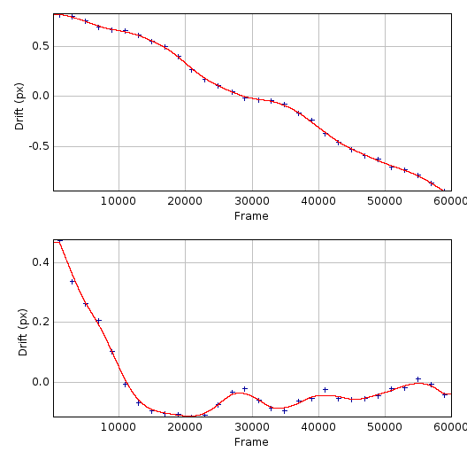

    Plot of the X-drift (top) and Y-drift (bottom) following drift calculation using the localisation sub-images method.

    The STORM dataset consisted of 410,000 results over 60,000 frames. Sub-images were produced using 2,000 frames, raw drift calculated (blue) and smoothed using LOESS with a maximum of 4 points before interpolation to the drift curve (red).

When the drift analysis is complete the plugin will present a dialog asking the user what to do with the drift curve (:numref:`Figure %s <fig_drift_calculator_curve_options_dialog>`).

.. _fig_drift_calculator_curve_options_dialog:
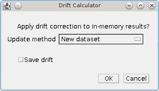

    Drift calculator curve options dialog

The following options are available:

.. list-table::
   :widths: 20 80
   :header-rows: 1

   * - Parameter
     - Description

   * - Update method
     - * ``None``: Do not use the drift curve
       * ``Update``: Update the input result set coordinates using the drift.
       * ``New dataset``: Create a new dataset with updated coordinates using the drift.
       * ``New truncated dataset``: Create a new dataset with updated coordinates but truncate the results to the interpolation range of the drift curve (points outside this range may have a poor drift correction).

   * - Save drift
     - Save the drift curve to file. The plugin will prompt the user for a filename. The drift curve can later be loaded by the ``Drift Calculator`` plugin using the ``File`` option for the ``Method`` parameter.

Note that if the drift correction is used to update the results then only the results held in memory will change. Any derived output, for example a table of the results or a reconstructed image, will have to be regenerated from the new results.

Example images showing the original and drift corrected localisations following sub-image alignment are shown in :numref:`Figure %s <fig_drift_calculator_example_drift_correction>`. The drift correction curve for the image data is shown in :numref:`Figure %s <fig_drift_calculator_drift_curve>`. Note how drift correction has removed the blur from the main image and resolved smeared spots into single points.

.. _fig_drift_calculator_example_drift_correction:
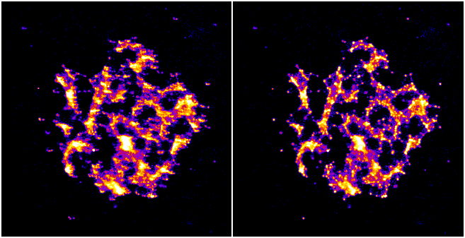

    Example of drift correction.

    Left: Original localisations; Right: Drift corrected localisations.

Details of the different drift calculation methods are shown below.

.. index:: Sub-Image Alignment

Sub-Image Alignment
~~~~~~~~~~~~~~~~~~~

If the localisations represent a structural image then a subset of the localisations will also represent the same structure. Where there are a large number of localisations (for example in STORM images) it is possible to create sub-images from sub-sets of the data and align them.

The ``Sub-image alignment`` method performs the following steps:

#.  Initialise the drift for each time point to zero.

#.  Produce sub-images from N consecutive frames using the coordinates from the localisations plus the drift for that time point.

#.  Combine all sub-images to a master projection.

#.  Aligns each sub-image to the master projection using correlation analysis. The drift time point is set using the average frame from all the localisations in the sub-image.

#.  Smooth the drift curve.

#.  Calculate the change to the drift and repeats from step 2 until convergence.

The following parameters can be specified:

.. list-table::
   :widths: 20 80
   :header-rows: 1

   * - Parameter
     - Description

   * - Frames
     - The number of consecutive frames to use to construct each sub-image.

   * - Minimum localisations
     - The minimum number of localisations used for a sub-image. If the frames for a sub-image do not contain enough localisations then they will be combined with the next set of frames until an image is produced with the minimum number of localisations.

   * - FFT size
     - Specify the size of the reconstructed image.

       Note that large images:

       (a) Will be slower to process.
       (b) May not work if there are not enough localisations because the image density will be spread out and the correlation between images may fail.
       (c) May produce a better drift estimate if the number of localisations per sub-image is very high.

.. index:: Drift File

Drift File
~~~~~~~~~~

The drift can be loaded directly from file. The file must contain delimited records of:

::

    Time X Y

The fields can be delimited with tabs, spaces or commas. Any line not starting with a digit is ignored. Only the time-points that are within the time range of the input results are used.

The file is assumed to contain the final drift curve and no iterations are performed to update the curve. The curve may be smoothed using LOESS smoothing before being interpolated and applied to the data.

The ``Drift File`` method allows the same drift to be applied to multiple data sets. For example if an image is produced with a white light channel for drift tracking and two different colour channels with localisation data the same drift from the white light image can be used to correct both sets of localisations.

.. index:: Reference Stack Alignment

Reference Stack Alignment
~~~~~~~~~~~~~~~~~~~~~~~~~

The drift can be calculated using a reference stack image, for example this may be a white light image taken during the experiment. The reference stack must be a single stack image. Some microscopes may make a separate image during acquisition for the white light. However if all the frames are joined into a master image then you can extract reference stack slices from a master image using ``ImageJ``'s ``Substack Maker`` plugin (``Image > Stacks > Tools > Make Substack...``).

The slice numbers in the reference stack will not correspond to the slices in the localisation results. Therefore the plugin allows the user to specify the actual slice number of the first slice in the reference stack (start frame), and then the frame spacing between slices in the stack. The actual frame for the stack is then calculated as the previous frame (starting from the start frame) plus the frame spacing.

The
``Reference Stack Alignment``
method performs the following steps:

#.  Initialise the drift for each time point to zero

#.  Calculate an average projection of the slices shifted by the current drift

#.  Aligns each slice to the average projection using correlation analysis to compute the drift

#.  Smooth the drift curve

#.  Calculate the change to the drift and repeats from step 2 until convergence

The following parameters can be specified:

.. list-table::
   :widths: 20 80
   :header-rows: 1

   * - Parameter
     - Description

   * - Start frame
     - The actual slice number from the original image for the first frame from the reference stack.

   * - Frame spacing
     - The number of frames from the original image between each slice in the reference stack.

For example if a white light image was taken at the start and then every 20 frames then the method should be called with parameters ``start_frame=1 frame_spacing=20``. The drift will then be calculated as if the `n` slices were at time points::

    1, 21, 41, ..., 20 * (n-1) + 1, 20 * n + 1

.. index:: Fiducial Markers

Fiducial Markers
~~~~~~~~~~~~~~~~

This method uses constant fiducial markers that are placed within the image to allow the drift to be tracked (e.g. fluorescent beads). The method is only available in the drop-down options when there are ROIs listed in the ``ImageJ`` ROI manager.

Rectangular ROIs can be placed around the fiducial markers on the original image and then added to the ROI manager (press ``Ctrl+T``). All the ROIs in the manager will be used to calculate the drift. Ensure that you choose regions containing a constant bright spot that is present through the majority of frames. If multiple spots are within the ROI only the brightest one per frame will be used. Ideally these are fluorescent beads added to the image as fiducial markers.

The ``Marked ROIs`` method performs the following steps:

#.  Initialise the drift for each time point to zero.

#.  Calculate the centre-of-mass of all the spots selected within each ROI.

#.  For each frame and each ROI, calculate the shift from the spot to the centre-of-mass of the ROI.

#.  For each frame, produce a combined shift using a weighted average of the shift from each ROI. The weight is the spot signal (number of photons).

#.  Smooth the drift curve.

#.  Calculate the change to the drift and repeats from step 2 until convergence.

The ``Marked ROIs`` method requires no additional parameters, only ROIs within the ``ROI Manager``. Note however that each ROI's bounds (x,y,width,height) are used to find spots within the input localisations and so the ROI should be selected using an image with the same scale and image bounds as the input data. Ideally this should be an average intensity projection of the original image but it can be a super-resolution reconstruction of the data made using an image scale of 1.

..
  No index

Image Alignment using Correlation Analysis
~~~~~~~~~~~~~~~~~~~~~~~~~~~~~~~~~~~~~~~~~~

Image alignment in the ``Sub-image alignment`` and ``Reference Stack Alignment`` methods is done using the maximum correlation between images (including sub-pixel registration using cubic interpolation). This is computed in the frequency domain after a Fast Fourier Transform (FFT) of the image. The method of producing and then aligning images is computationally intensive so the plugin uses multi-threading to increase speed. The number of threads to use is the ``ImageJ`` default set in ``Edit > Options > Memory & Threads...``.

.. index:: ! Trace Molecules

Trace Molecules
---------------

Traces localisations through time and collates them into traces using time and distance thresholds. Each trace can only have one localisation per time frame. With the correct parameters a trace should represent all the localisations of a single fluorophore molecule including blinking events.

.. index:: Molecule Tracing

Molecule Tracing
~~~~~~~~~~~~~~~~

The fluorophores used in single molecule imaging can exist is several states. When in an active state it can absorb light and emit it at a different frequency (fluorescence). The active state can move into a dark state where it does not fluoresce. The dark state can move back to the active state. Eventually the molecule moves into a bleached state where it will no longer fluoresce (photo-bleached). The rates of the transitions between states are random as are the number of times this can occur. This means that it is possible for the same molecule to turn on and off several times causing blinking.

To prevent over-counting of molecules due to blinking it is possible to trace the localisations through time. Any localisation that occurs very close to another localisation from a different frame may be the same molecule. The distance between localisations can be spatial or temporal. Using two parameters it is possible to trace localisations using the following algorithm:

Any spot that occurred within time threshold and distance threshold of a previous spot is grouped into the same trace as that previous spot. In the event of multiple candidate connections the algorithm assigns the closest distance connection first. The previous time frames can be searched either in earliest or latest order until a match, or all time frames. This is a greedy nearest neighbour algorithm and may not achieve the maximum cardinality matching for the specified distance threshold.

To remove the possibility for overlapping tracks the plugin allows the track to be excluded if a second localisation occurs within an exclusion threshold of the current track position. This ensures that the localisation assigned to the track is the only candidate within the exclusion distance and effectively removes traces of particles that could overlap with another moving particle. Setting the exclusion distance to less than the distance threshold disables this feature.

When all frames are processed the resulting traces are assigned a spatial position equal to the centroid position of all the spots included in the trace.

The molecule tracing algorithm is based on the work of Coltharp, *et al* (2012).

.. index:: Trace Molecules Plugin

Trace Molecules Plugin
~~~~~~~~~~~~~~~~~~~~~~

The ``Trace Molecules`` plugin allows temporal tracing to be performed on localisations loaded into memory. :numref:`Figure %s <fig_trace_molecules_dialog>` shows the plugin dialog.

.. _fig_trace_molecules_dialog:
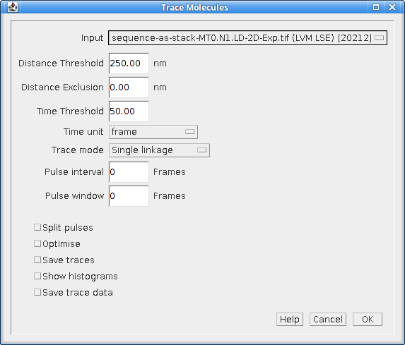

    Trace Molecules dialog

The following parameters can be configured:

.. list-table::
   :widths: 20 80
   :header-rows: 1

   * - Parameter
     - Description

   * - Input
     - Specify the localisations to use.

   * - Distance Threshold (nm)
     - Maximum distance (in nm) for two localisations to belong to the same trace.

   * - Distance exclusion (nm)
     - Exclusion distance (in nm) where no other localisations are allowed. Use this setting to be sure that a trace links together localisations that are not close to any other localisations.

       Ignored if less than the distance threshold.

   * - Time Threshold
     - Maximum time separation for two localisations to belong to the same trace (should cover a minimum of 1 frame).

   * - Time unit
     - The unit for the ``Time Threshold``.

   * - Trace mode
     - * ``LatestForerunner``: Search from the closest time distance in the past for earlier localisations of the same fluorophore. This is the best mode for moving molecules.

       * ``EarliestForerunner``: Search from the maximum time distance in the past for earlier localisations of the same fluorophore.

       * ``SingleLinkage``: Search all time-points in the past up to the maximum time distance to find the closest localisation. This is equivalent to single-linkage clustering. This mode is slower since the other modes will stop searching time-points when a localisation has been found within the distance threshold.

   * - Pulse interval
     - Sets the pulse interval for traces (in frames). Set to zero to disable pulse analysis. See section :numref:`{number}: {name} <analysis_plugins:Pulse Analysis>`.

   * - Pulse window
     - Sets the pulse window for traces (in frames). Set to zero to disable pulse analysis. See section :numref:`{number}: {name} <analysis_plugins:Pulse Analysis>`.

   * - Split pulses
     - Enable this to split traces that span the a pulse boundary into separate traces. Use this setting if your imaging conditions use pulsed activation and you have imaged for long enough between pulses to be sure that all fluorophores have photo-bleached.

   * - Optimise
     - If selected the plugin will provide a second dialog that allows a range of distance and time thresholds to be enumerated (see section :numref:`{number}: {name} <analysis_plugins:Optimisation>`).

   * - Save traces
     - When the tracing is complete, show a file selection dialog to allow the traces to be saved.

   * - Show histograms
     - Present a selection dialog that allows histograms to be output showing statistics on the traces, e.g. total signal, on time and off time.

   * - Save trace data
     - Save all the histogram data to a results directory to allow further analysis. A folder selection dialog will be presented after the tracing has finished.

The plugin will trace the localisations and store the results in memory with a suffix ``Traced``. Two additional datasets are created: all single localisations which could not be joined are given a suffix ``Trace Singles``; all traces are given a suffix ``Traces``. The ``Trace Singles`` plus ``Traces`` datasets equals the ``Traced`` dataset.

A summary of the number of traces is shown on the ``ImageJ`` status bar. The results are accessible using the
``Results Manager``
plugin.

.. index:: Pulse Analysis

Pulse Analysis
^^^^^^^^^^^^^^

The options ``Pulse Interval`` and ``Pulse Window`` allow the user to specify a repeating period within the image time sequence. Only traces that originate within a frame defined by the pulse will be included in the output.

For example a pulse could be defined using ``Pulse Interval`` 30 and ``Pulse Window`` 3. Only traces that have their first localisation in frames 1-3, 31-33, 61-63, etc. will be output in the final traces.

This option was added to allow analysis of images acquired using a pulsed activation laser. Consequently only localisations that could be traced back to a short period after the activation pulse are of interest. All other localisations are likely to be random background fluorescence events.

The options should be disabled when using a continuous activation laser by setting to the parameters to zero.

When using a pulse activation it is possible to photo-bleach all fluorophores that were activated by the pulse before the next pulse. This requires a long pulse interval. If you are confident that all molecules have bleached then it does not make sense for a trace to span pulse intervals. Use the ``Split pulses`` option to break apart any traces that span a pulse interval boundary into separate traces.

.. index:: Trace Molecules; Optimisation

Optimisation
~~~~~~~~~~~~

It is possible to produce an estimate of the optimum distance and time thresholds if the blinking rate of the fluorophore is known. Note that the blinking rate can be estimated from the data using the
``Blink Estimator`` plugin (see :numref:`{number}: {name} <analysis_plugins:Blink Estimator>`). Alternatively it can be measured by manual inspection of purified single fluorophores sufficiently spread on a slide to avoid two molecules in the same location. Care must be taken to ensure that the imaging condition are the same as those used for
*in vivo*
experiments.

The optimisation method is adapted from Coltharp, *et al* (2012). Optimisation is based on the following equation:

.. math::

    \mathit{Expected\:molecules}=\frac{\mathit{Observed\:pulses}}{\mathit{Blinking\:rate}}

The observed pulses is the number of single pulse events that are observed in the data, i.e. continuous emission from the same fluorophore. Dividing this by the average blinking rate of a fluorophore should give the number of molecules.

The observed pulses can be found by tracing the localisations using a time threshold of 1 frame and a distance threshold that will allow a match of the same molecule position. This will only join localisations that are in adjacent frames into a single light pulse. The distance to use is obtained from the data using 2.5x the average localisation precision.

For example if 10,000 pulses have been identified by tracing at ``t=1, d=2.5 x Av. Precision`` and the blinking rate is known to be 2 then the expected number of molecules is 5,000.

A score metric can be computed for a given tracing result:

.. math::

    \mathit{Score}=\frac{\mathit{Traces}-\mathit{Expected\:molecules}}{\mathit{Expected\:molecules}}

The closer the score to zero, the more likely that the tracing parameters are correct. In addition a negative score indicates over-clustering, a positive score is under-clustering. Consequently a plot of the distance and time thresholds verses the score will indicate the parameters that are best suited to achieving a zero score. The zero score can be more easily seen on such a plot by using the absolute value of the score.

The following table describes the parameters used during the optimisation:

.. list-table::
   :widths: 20 80
   :header-rows: 1

   * - Parameter
     - Description

   * - Min Distance Threshold (px)
     - The minimum distance threshold.

   * - Max Distance Threshold (px)
     - The maximum distance threshold.

   * - Min Time Threshold (seconds)
     - The minimum time threshold.

   * - Max Time Threshold (seconds)
     - The maximum time threshold.

   * - Steps
     - The number of steps to use between the minimum and maximum. Steps intervals are chosen using a geometric (not linear) scale to bias sampling towards lower threshold values.

   * - Blinking rate
     - The average blinking rate of the fluorophore. Must be above 1 (otherwise no occurrences of repeat molecules are expected).

       Note that the blinking rate is equal to the number of blinks + 1.

   * - Plot
     - Produce a plot of the score against the time/distance threshold:

       *   ``None``: No plot.
       *   ``Nearest Neighbour``: Output only the calculated values.
       *   ``Bilinear``: Interpolate between calculated values to produce a smoother plot.

When the optimisation option is selected it is preferable to choose a plot option. An ideal plot will show an inverted L-shape as shown in :numref:`Figure %s <fig_trace_molecules_opt_output_plot>`. The parameters that achieve a score close to zero are shown in black. The scale of the image has been calibrated to use the scale of the distance and time thresholds. Therefore hovering over a part of the image will show the time (X-axis) and distance (Y-axis) threshold required for the given score.

.. _fig_trace_molecules_opt_output_plot:
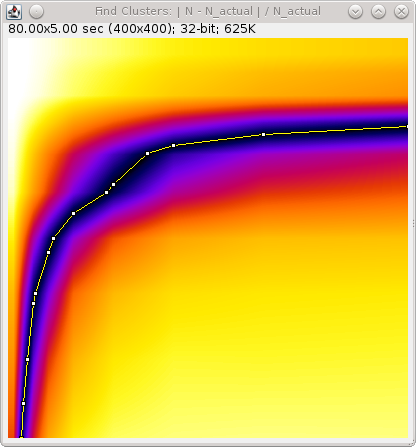

    Output plot from the Trace Molecules optimisation algorithm.

    The plot shows the absolute score  against the time (X-coordinate) and distance (Y-coordinate) thresholds.

Note that at the end of optimisation the thresholds are automatically set using the zero score that is closest on the plot to the origin. This should be a compromise point between the two thresholds. The values used will be written to the ``ImageJ`` log window. The tracing algorithm then runs and the traces are stored in memory.

If the optimised thresholds are not suitable it is left to the user to interpret the plot of the scores and select the best values. For example this could be done by assuming the distance threshold calculated using ``2.5 x Av. Precision`` is correct and looking up the corresponding time threshold when the score is zero.

.. index:: Memory Output

Memory Output
~~~~~~~~~~~~~

The tracing algorithm assigns a unique ID to each trace. All the localisations that are a member of that trace are assigned the same ID. The results are then saved into memory. The results are named using the input results set name plus a suffix as follows:

.. list-table::
   :widths: 20 80
   :header-rows: 1

   * - Suffix
     - Description

   * - Traced
     - A full set of localisations with each assigned the corresponding trace ID.

   * - Trace Centroids
     - The localisations of each trace combined into a centroid.

       Centroids have a signal equal to the sum of the localisations, the coordinates are set using the signal weighted centre-of-mass of the localisations. The background is averaged and the noise combined using the root of the sum-of-squares. The Gaussian standard deviation of the localisation is set using the average precision of the localisations, calculated using the Mortensen formula.

   * - Trace Singles
     - Contains the localisations that were not part of a trace, i.e. are a single localisation.

   * - Trace Multi
     - Contains the localisations that were part of a trace, i.e. are a multi-frame localisation.

   * - Trace Centroids Multi
     - The localisations of each trace combined into a centroid. Only traces with multiple localisations are included.

It is possible to save these results to file using the
``Results Manager``
plugin.

.. index:: File Output

File Output
~~~~~~~~~~~

If the ``Save traces`` option is selected then the plugin will show a file selection dialog allowing the user to choose the location of the clusters results file. The results will use the same format as the plain-text file results option in the ``Peak Fit`` and ``Results Manager`` plugins. However all the localisations for each trace will be stored together under a Trace entry. The Trace entry will have the format:

::

    #Trace x y (+/-sd) n=[n], b=[n], on=[f], off=[f], signal=[f]

where:

*   ``x`` & ``y`` are the coordinates of the centroid
*   ``sd`` is the standard deviation of distances to the centroid
*   ``n`` is the size of the cluster
*   ``b`` is the number of pulses (bursts of continuous time frames)
*   ``on`` is the average on-time of each pulse
*   ``off`` is the average off-time between each pulse
*   ``signal`` is the total signal for all the localisations in the trace

The prefix ``#`` character allows the clusters to be ignored as comments, for example when the cluster file is loaded as a results file.

Note that the number of pulse (or bursts) is equal to the number of blinks + 1. It is equivalent to the blinking rate of the molecule.

.. index:: ! Cluster Molecules

Cluster Molecules
-----------------

Cluster localisations into clusters using distance and optionally time thresholds. When using a time threshold each cluster can only have one localisation per time frame. With the correct parameters a cluster should represent all the localisations of a single fluorophore molecule including blinking events.

This plugin is very similar to the ``Trace Molecules`` plugin (section :numref:`%s <analysis_plugins:Trace Molecules>`) and many of the options are the same. The following options are available:

.. list-table::
   :widths: 20 80
   :header-rows: 1

   * - Parameter
     - Description

   * - Input
     - Specify the localisations.

   * - Distance Threshold (nm)
     - Maximum distance (in nm) for two localisations to belong to the same cluster.

   * - Time Threshold
     - Maximum time separation for two localisations to belong to the same trace (should cover a minimum of 1 frame).

       Note: This is only used for some algorithms.

   * - Time unit
     - The unit for the ``Time Threshold``.

   * - Clustering algorithm
     - Set the clustering algorithm. See section :numref:`{number}: {name} <analysis_plugins:Clustering Algorithms>`.

   * - Pulse interval
     - Sets the pulse interval for clusters (in frames). Clusters will only contain localisations from within the same pulse.

       Set to zero to disable pulse analysis. See section :numref:`{number}: {name} <analysis_plugins:Pulse Analysis>`.

   * - Split pulses
     - Enable this to ensure clusters contain only localisations within a single pulse (defined by the ``Pulse interval``).

       Use this setting if your imaging conditions use pulsed activation and you have imaged for long enough between pulses to be sure that all fluorophores have photo-bleached.

   * - Save clusters
     - When the clustering is complete, show a file selection dialog to allow the clusters to be saved.

   * - Show histograms
     - Present a selection dialog that allows histograms to be output showing statistics on the clusters, e.g. total signal, on time and off time.

   * - Save cluster data
     - Save all the histogram data to a results directory to allow further analysis. A folder selection dialog will be presented after the clustering has finished.

The plugin will cluster the localisations and store the results in memory with a suffix ``Clustered``. Two additional datasets are created: all single localisations which could not be joined are given a suffix ``Cluster Singles``; all clusters are given a suffix ``Clusters``. The ``Cluster Singles`` plus ``Clusters`` datasets equal the ``Clustered`` dataset.

.. index:: Clustering Algorithms

Clustering Algorithms
~~~~~~~~~~~~~~~~~~~~~

The following table lists the available clustering algorithms:

.. list-table::
   :widths: 20 80
   :header-rows: 1

   * - Algorithm
     - Description

   * - Particle single-linkage
     - Joins the closest pair of particles, one of which must not be in a cluster. Clusters are not joined and can only grow when particles are added.

   * - Centroid-linkage
     - Hierarchical centroid-linkage clustering by joining the closest pair of clusters iteratively

   * - Particle centroid-linkage
     - Hierarchical centroid-linkage clustering by joining the closest pair of any single particle and another single or cluster. Clusters are not joined and can only grow when particles are added.

   * - Pairwise
     - Join the current set of closest pairs in a greedy algorithm. This method computes the pairwise distances and joins the closest pairs without updating the centroid of each cluster, and the distances, after every join (centroids and distances are updated after each pass over the data). This can lead to errors over true hierarchical centroid-linkage clustering where centroid are computed after each link step. For example if A joins B and C joins D in a single step but the new centroid of AB is closer to C than D.

   * - Pairwise without neighbours
     - A variant of ``PairwiseWithoutNeighbours`` is to join the closest pairs only if the number of neighbours for each is 1. In the event that no pairs has only a single neighbour then only the closest pair is joined.

       This algorithm should return the same results as the ``Closest`` algorithm (but with different run-time performance).

   * - Centroid-linkage (Distance priority)
     - Hierarchical centroid-linkage clustering by joining the closest pair of clusters iteratively. Clusters are compared using time and distance thresholds with priority on the closest time gap (within the distance threshold).

   * - Centroid-linkage (Time priority)
     - Hierarchical centroid-linkage clustering by joining the closest pair of clusters iteratively. Clusters are compared using time and distance thresholds with priority on the closest distance gap (within the time threshold).

   * - Particle centroid-linkage (Distance priority)
     - Hierarchical centroid-linkage clustering by joining the closest pair of any single particle and another single or cluster. Clusters are not joined and can only grow when particles are added.

       Clusters are compared using time and distance thresholds with priority on the closest time gap (within the distance threshold).

   * - Particle centroid-linkage (Time priority)
     - Hierarchical centroid-linkage clustering by joining the closest pair of any single particle and another single or cluster. Clusters are not joined and can only grow when particles are added.

       Clusters are compared using time and distance thresholds with priority on the closest distance gap (within the time threshold).

Only the ``(Distance priority)`` and ``(Time priority)`` methods use the time information. All the other algorithms will ignore the ``Time Threshold`` and optional ``Pulse interval`` parameters.

All the clustering algorithms (except ``Pairwise``) are multi-threaded for at least part of the algorithm. The number of threads to use is the ``ImageJ`` default set in ``Edit > Options > Memory & Threads...``.

The ``Pairwise`` algorithm is not suitable for multi-threaded operation but is the fastest algorithm by an order of magnitude over the others. All other algorithms have a similar run-time performance except the ``Pairwise without neighbours`` algorithm which doesn't just search for the closest clusters but also tracks the number of neighbours. The algorithm should return the same results as the ``Closest`` algorithm but the analysis of neighbours has run-time implications. At very low densities this algorithm is faster since all pairs without neighbours can be joined in one step. However at most normal and high densities tracking neighbours is costly and the algorithm is approximately 3x slower than the next algorithm.

.. index:: ! Dynamic Trace Molecules

Dynamic Trace Molecules
-------------------------

Traces localisations through time and collates them into traces using a probability model to reconnect localisations to existing traces based on diffusion coefficient, intensity and fluorophore disappearance rate.

Use dynamic multiple target tracing based on Sergé *et al* (2008). Details can be found in the paper's supplementary information appendix 2. This tracing uses a model to assign the probability that a localisation should join a current trajectory (or track). The matrix of all localisations paired with all current trajectories is considered and the maximum likelihood reconnection is selected. New trajectories are created as required and existing trajectories can expire if no localisations have been assigned to them for a set number of frames.

The probability model consists of three parts: the probability for a match given the diffusion; the probability for a match given the intensity; and the probability the trajectory blinks or disappears.

The probability for diffusion computes a probability based on the distance from the end of the trajectory to the localisation. This assumes a maximum diffusion coefficient for moving particles which sets an upper limit on the distance allowed. A moving particle may be slower than the maximum if it has become confined, for example a DNA binding protein bound to the DNA or a membrane protein that has formed a complex. The tracing thus maintains a local diffusion coefficient for each track based on the jumps observed for the previous *N* frames. The probability is computed as a weighted average of the probability based on maximum (unconfined) diffusion and the probability using the local diffusion rate.

The probability for intensity computes the probability that the localisation intensity is from the distribution of intensity values in the trajectory. This is the non-blinking, or on, probability for intensity. When the trajectory is short the probability function uses the population mean and standard deviation. Otherwise it uses the mean and standard deviation from the previous *N* frames where the trajectory was on. A second component is the probability the trajectory will blink (i.e. turn off). The final intensity probability is the weighted combination of the probability for non-blinking (on) and blinking (off). Note that the intensity statistics are only valid if the trajectory was on for the entire frame. Turning off during the frame (partial blink) will skew the statistics. Thus frames are counted as on for new localisations if the probability for non-blinking is higher than the blinking probability. The result is the previous *N* on frames for local statistics may span more time than *N* frames.

The probability for disappearance is modelled using the probability that an off trajectory will reappear. This uses an exponential decay controlled by a decay factor. A higher factor will increase the probability a trajectory reappears after a set amount of time.

The local diffusion model can be optionally disabled. The result is tracing based on a maximum diffusion rate.

The intensity model is disabled if all localisations have the same intensity (i.e. are only (x,y) positions) and can also be optionally disabled. The result is tracing based on diffusion and blinking.

Setting a disappearance threshold to 0 frames will configure tracing using diffusion and intensity with no allowed blinking. This should create tracks similar to the ``Nearest Neighbour`` trace mode but will use a maximum probability connection test and not the closest first assignment algorithm.

This plugin is very similar to the ``Trace Molecules`` plugin (section :numref:`%s <analysis_plugins:Trace Molecules>`) and many of the options are the same. The following options are available:

.. list-table::
   :widths: 20 80
   :header-rows: 1

   * - Parameter
     - Description

   * - Input
     - Specify the localisations.

   * - Diffusion coefficient
     - The expected maximum diffusion coefficient for moving particles. Used to set an upper limit on the radius allowed to reconnect trajectories and localisations.

   * - Temporal window
     - The window over which to build local statistics

   * - Local diffusion weight
     - The weighting for the probability created using the local diffusion coefficient; the remaining probability uses the maximum diffusion coefficient.

   * - On intensity weight
     - The weighting for the probability for non-blinking intensity; the remaining probability uses the probability for blinking intensity.

   * - Disappearance decay factor
     - Controls the expected duration over which an off trajectory may reappear. Higher values will increase probability the molecule may reappear after *t* frames.

   * - Disappearance threshold
     - The threshold used to deactivate a trajectory. Any trajectory that has been in the off (dark) state longer than this threshold is removed and cannot connect to new localisations.

   * - Disable local diffusion model
     - Set to **true** to disable the local diffusion model. The diffusion model will only use the maximum diffusion coefficient. Can be used when particles blink frequently which results in under estimation of the local diffusion using jump distances due to missing distances.

   * - Disable intensity model
     - Set to **true** to disable the intensity model. Can be used when the intensity of particles in a track is highly variable and intensity cannot be used to distinguish the track.

   * - Defaults
     - Use this button to reset the values to the defaults as used in the original source paper (Sergé *et al*, 2008).

   * - Save traces
     - When the tracing is complete, show a file selection dialog to allow the traces to be saved.

   * - Show histograms
     - Present a selection dialog that allows histograms to be output showing statistics on the traces, e.g. total signal, on time and off time.

   * - Save trace data
     - Save all the histogram data to a results directory to allow further analysis. A folder selection dialog will be presented after the tracing has finished.

The plugin will trace the localisations and store the results in memory with a suffix ``Dynamic Traced``. Two additional datasets are created: all single localisations which could not be joined are given a suffix ``Cluster Singles``; all clusters are given a suffix ``Clusters``. The ``Cluster Singles`` plus ``Clusters`` datasets equal the ``Clustered`` dataset.

.. index:: ! Trace Diffusion

Trace Diffusion
---------------

The ``Trace Diffusion`` plugin will trace molecules through frames and then perform mean-squared displacement analysis on consecutive frames to calculate a diffusion coefficient.

The plugin is similar to the ``Diffusion Rate Test`` plugin however instead of simulating particle diffusion the plugin will use an existing results set. This allows the analysis to be applied to results from fitting single-molecule images using the ``Peak Fit`` plugin.

Trace Mode
~~~~~~~~~~

Tracing can be performed using different trace modes:

.. list-table::
   :widths: 20 80
   :header-rows: 1

   * - Mode
     - Description

   * - Nearest Neighbour
     - Uses the nearest neighbour tracing algorithm from the ``Trace Molecules`` plugin (see section :numref:`%s <analysis_plugins:Trace Molecules>`).

   * - Dynamic Multiple Target Tracing (DMTT)
     - Uses the dynamic multiple target tracing algorithm from the ``Dynamic Trace Molecules`` plugin  (see section :numref:`%s <analysis_plugins:Dynamic Trace Molecules>`).

Note that diffusion analysis is based in consecutive frames. If tracing allows gaps then the initial discontinuous tracks are divided into continuous tracks before diffusion analysis.

Analysis
~~~~~~~~

Once the tracks have been identified any tracks containing frame gaps are split into sub-tracks with contiguous frames. Diffusion analysis with variable frame gaps is not supported. The tracks are then filtered using a length criteria and shorter tracks discarded. Optionally the tracks can be truncated to the minimum length which ensures even sampling of particles with different track lengths. The plugin computes the mean-squared distance of each point from the origin. Optionally the plugin computes the mean-squared distance of each point from every other point in the track. These internal distances increase the number of points in the analysis. Therefore if the track is not truncated the number of internal distances at a given time separation is proportional to the track length. To prevent bias in the data towards the longer tracks the average distance for each time separation is computed per track and these are used in the population statistics. Thus each track contributes only once to the mean-displacement for a set time separation.

The mean-squared distance (MSD) per molecule is calculated using two methods. The ``all-vs-all`` method uses the sum of squared distances divided by the sum of time separation between points. The value includes the all-vs-all internal distances (if selected). The ``adjacent`` method uses the average of the squared distances between adjacent frames divided by the time delta (:math:`\Delta t`) between frames. The MSD values are expressed in |micro|\ m\ :sup:`2`/second and can be saved to file or shown in a histogram.

The average mean-squared distances for all the traces are plotted against the time separation and a best fit line is calculated. The mean-squared distances are proportional to the diffusion coefficient (*D*):

.. math::

    \mathit{MSD}(n\Delta t)=4\mathit{Dn}\Delta t+4\sigma ^{2}

where
:math:`n` is the number of separating frames,
:math:`\Delta t` is the time lag between frames, and
:math:`\sigma` is the localisation precision.
Thus the gradient of the best fit line can be used to obtain the diffusion coefficient. Note that the plugin will compute a fit with and without an explicit intercept and pick the solution with the best fit to the data (see :numref:`{number}: {name} <analysis_plugins:Selecting the Best Fit>`).
Note that an additional best fit line can be computed using a MSD correction factor
(see :numref:`{number}: {name} <analysis_plugins:MSD Correction>`).

.. index:: Apparent Diffusion Coefficient

Apparent Diffusion Coefficient
^^^^^^^^^^^^^^^^^^^^^^^^^^^^^^

Given that the localisations within each trace are subject to a fitting error, or precision (:math:`\sigma`), the apparent diffusion coefficient (:math:`D^{\star}`) can be calculated accounting for precision [Uphoff *et al*, 2013]:

.. math::

    D^{\star}=\mathit{max}(0,\frac{\mathit{MSD}}{4n\Delta t}-\frac{\sigma_{\mathit{loc}}^{2}}{n\Delta t})

The plugin thus computes the average precision for the localisations included in the analysis and can optionally report the apparent diffusion coefficient (:math:`D^{\star}`). If the average precision is above 100nm then the plugin prompts the user to confirm the precision value.

.. index:: Jump Distance Analysis

Jump Distance Analysis
~~~~~~~~~~~~~~~~~~~~~~

The jump distance is how far a particle moves is given time period. Analysis of a population of jump distances can be used to determine if the population contains molecules diffusing with one or more diffusion coefficients [Weimann *et al*, 2013]. For two dimensional Brownian motion the probability that a particle starting at the origin will be encountered within a shell of radius *r* and a width *dr* at time :math:`\Delta t` is given by:

.. math::

    p(r^{2},\Delta t)\mathit{dr}^{2}=\frac{1}{4D\Delta t}e^{-{\frac{r^{2}}{4D\Delta t}}}\mathit{dr}^{2}

This can be expanded to a mixed population of *m* species where each fraction (:math:`f_i`) has a diffusion coefficient :math:`D_i`\ :

.. math::

    p(r^{2},\Delta t)\mathit{dr}^{2}=\sum_{j=1}^{m}{\frac{f_{j}}{4D_{j}\Delta t}e^{-{\frac{r^{2}}{4D_{j}\Delta t}}}\mathit{dr}^{2}}

For the purposes of fitting the integrated distribution can be used. For a single population this is given by:

.. math::

    P(r^{2},\Delta t)=\int_{0}^{r^{2}}p(r^{2})\mathit{dr}^{2}=1-e^{-{\frac{r^{2}}{4D\Delta t}}}

The advantage of the integrated distribution is that specific histogram bin sizes are not
required to construct the cumulative histogram from the raw data. Note that the
integration holds for a mixed population of *m* species where each fraction (:math:`f_i`) has a diffusion coefficient :math:`D_i`\ :

.. math::

    P(r^{2},\Delta t)=1-\sum _{j=1}^{m}f_{j}e^{-{\frac{r^{2}}{4D_{j}\Delta t}}}

Weimmann *et al* (2013) show that fitting of the cumulative histogram of jump distances can
accurately reproduce the diffusion coefficient in single molecule simulations. The performance of the method uses an indicator :math:`\beta` expressed as the average distance a particle travels in the chosen time (*d*) divided by the average localisation precision (:math:`\sigma`):

.. math::

    \beta = d / \sigma

When :math:`\beta` is above 6 then jump distance analysis reproduces the diffusion coefficient as accurately as MSD analysis for single populations. For mixed populations of moving and stationary particles the MSD analysis fails (it cannot determine multiple diffusion coefficients) and the jump distance analysis yields accurate values when :math:`\beta` is above 6.

The ``Trace Diffusion`` plugin performs jump distance analysis using the jumps between frames that are *n* frames apart. The distances may be from the origin to the *n* th frame or may use all the available internal distances *n* frames apart. A cumulative histogram is produced of the jump distance. This is then fitted using a single population and then for mixed populations of *j* species by minimising the sum-of-squared residuals (SS) between the observed and expected curves. Alternatively the plugin can fit the jump distances directly without using a cumulative histogram. In this case the probability of each jump distance is computed using the formula for :math:`P(r^{2},\Delta t)` and the combined probability (likelihood) of the data given the model is computed. The best model fit is achieved by maximising the likelihood (maximum likelihood estimation, MLE).

When fitting multiple species the fit is rejected if:
(a) the relative difference between coefficients is smaller than a given factor; or
(b) the minimum fraction, :math:`f_i`, is less than a configured level.
If accepted the result must then be compared to the previous result to determine if increasing the number of parameters has improved the fit (see :numref:`{number}: {name} <analysis_plugins:Selecting the Best Fit>`).

Optimisation is performed using a fast search to maximise the score by varying each parameter in turn (Powell optimiser). In most cases this achieves convergence. However in the case that the default algorithm fails then a second algorithm is used that uses a directed random walk (CMAES optimiser). This algorithm depends on randomness and so can benefit from restarts. The plugin allows the number of restarts to be varied. For the optimisation of the sum-of-squares against the cumulative histogram a least-squares fitting algorithm (Levenberg-Marquardt or LVM optimiser) is used to improve the initial score where possible. The plugin will log messages on the success of the optimisers to the ``ImageJ`` log window. Extra information will be logged if using the ``Debug fitting`` option.

.. index:: Trace Diffusion; MSD Correction

MSD Correction
~~~~~~~~~~~~~~

This corrects for the diffusion distance lost in the first and last frames of the track due to the representation of diffusion over the entire frame as an average coordinate.
A full explanation of the correction is provided in section :numref:`{number}: {name} <msd_correction:MSD Correction>`.

The observed MSD can be converted to the true MSD by dividing by a correction factor (*F*):

.. math::

    F=\frac{n-1/3}{n}

Where *n* is the number of frames over which the jump distance is measured (i.e. end - start).

When performing jump distance analysis it is not necessary to the correct each observed squared distance before fitting. Since the correction is a single scaling factor instead the computed diffusion coefficient can be adjusted by applying the correction factor after fitting. This allows the plugin to save the raw data to file and use for display on results plots.

If the ``MSD correction`` option is selected the plugin will compute the corrected diffusion coefficient as:

.. math::

    D_{\mathit{corr}}=D\cdot {\frac{n}{n-1/3}}

..
  No index

Fitting the Plot of MSD verses N Frames
^^^^^^^^^^^^^^^^^^^^^^^^^^^^^^^^^^^^^^^

When fitting the linear plot of MSD verses the number of frames the correction factor can be included. The observed MSD is composed of the actual MSD multiplied by the correction factor before being adjusted for the precision error:

.. math::

    \mathit{oMSD}(n\Delta t)=4D(n\Delta t)-\frac{4D(\Delta t)}{3}+4\sigma^{2}

This is still a linear fit with a new representation for the intercept that allows the intercept to be negative. To ensure the intercept is correctly bounded it is represented using the fit parameters and not just fit using a single constant C.

When performing the linear fit of the MSD verses jump distance plot, 3 equations are fitted and the results with the best information criterion is selected. The results of each fit are written to the ``ImageJ`` log. The following equations are fit:

Linear fit:

.. math::

    \mathit{oMSD}(n\Delta t)=4D(n\Delta t)

Linear fit with intercept:

.. math::

    \mathit{oMSD}(n\Delta t)=4D(n\Delta t)+4\sigma ^{2}

Linear fit with MSD corrected intercept:

.. math::

    \mathit{oMSD}(n\Delta t)=4D(n\Delta t)-\frac{4D(\Delta t)}{3}+4\sigma^{2}

Note: In each model the linear gradient is proportional to the diffusion coefficient.

.. index:: Precision Correction

Precision Correction
~~~~~~~~~~~~~~~~~~~~

Given that the localisations within each trace are subject to a fitting error, or precision (σ), the apparent diffusion coefficient (:math:`D^{\star}`) can be calculated accounting for precision [Uphoff *et al* , 2013]:

.. math::

    D^\star=\mathit{max}(0,\frac{\mathit{MSD}}{4n\Delta t}-\frac{\sigma _{\mathit{loc}}^{2}}{n\Delta t})

If the ``Precision correction`` option is selected the plugin will subtract the precision and report the apparent diffusion coefficient (:math:`D^{\star}`) from the jump distance analysis.

.. index:: MSD and Precision Correction

MSD and Precision Correction
~~~~~~~~~~~~~~~~~~~~~~~~~~~~

Both the ``MSD correction`` and ``Precision correction`` can be applied to the fitted MSD to compute the corrected diffusion coefficient:

.. math::

    D=\frac{n}{n-1/3}\cdot \mathit{max}(0,\frac{\mathit{MSD}}{4n\Delta t}-\frac{\sigma _{\mathit{loc}}^{2}}{n\Delta t})

.. index:: Selecting the Best Fit

Selecting the Best Fit
~~~~~~~~~~~~~~~~~~~~~~

The Akaike Information Criterion (AIC) is calculated for the fit using the log likelihood (ln(*L*)) and the number of parameters (*p*):

.. math::

   \mathit{AIC}=2p-2\ln(L)

The AIC penalises additional parameters. The model with the lowest AIC is preferred. If a higher AIC is obtained then increasing the number of fitted species in the mixed population has not improved the fit and so fitting is stopped. Note that when performing maximum likelihood estimation the log likelihood is already known and is used directly to calculate the corrected AIC. When fitting the sum-of-squared residuals (:math:`SS_{\text{res}}`) for the straight line MSD fit the log likelihood can be computed as:

.. math::

    L=-{\frac{n}{2}} \ln (2\pi) - \frac{n}{2} \ln(\sigma^2) - \frac{1}{2\sigma^2} \mathit{SS}

This assumes that the residuals are distributed according to independent identical normal distributions (with zero mean). When the residuals are not identical normal distributions, such as fitting the cumulative jump distance histogram, then the adjusted coefficient of determination is used to select the best model:

.. math::

    R^2 &= 1 - \frac{SS_{\text{res}}}{SS_{\text{tot}}}

    R_{\text{adj}}^2 &= 1 - (1 - R^2) \frac{n - 1}{n - p - 1}

where :math:`SS_{\text{tot}}` is the total sum of squares, :math:`n` is the number of values and :math:`p` is the number of parameters.

Parameters
~~~~~~~~~~

The plugin dialog allowing the data to be selected is shown in :numref:`Figure %s <fig_trace_diffusion_dialog>`.

.. _fig_trace_diffusion_dialog:
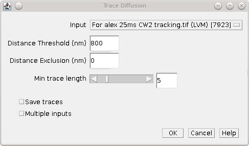

    Trace Diffusion dialog

The plugin has the following parameters:

.. list-table::
   :widths: 20 80
   :header-rows: 1

   * - Parameter
     - Description

   * - Input
     - Specify the input results set.

   * - Mode
     - Specify the trace mode.

       - ``Nearest Neighbour``
       - ``Dynamic Multiple Target Tracing``

       The parameters for each are configured using the ``...`` button. See descriptions below.

   * - Min trace length
     - The minimum length for a track (in time frames).

   * - Ignore ends
     - Ignore the end jumps in the track.

       If a fluorophore activated only part way through the first frame and bleaches only part way through the last frame the end jumps represent a shorter time-span than the frame interval. These jumps can optionally be ignored.

       This option requires tracks to be 2 frames longer than the ``Min trace length`` parameter.

   * - Save traces
     - Save the traces to file in the ``Peak Fit`` results format.

Nearest Neighbour Parameters
^^^^^^^^^^^^^^^^^^^^^^^^^^^^

.. list-table::
   :widths: 20 80
   :header-rows: 1

   * - Parameter
     - Description

   * - Distance threshold
     - The distance threshold for tracing.

   * - Distance exclusion
     - The exclusion distance. If a particle is within the distance threshold but a second particle is within the exclusion distance then the trace is discarded (due to overlapping tracks).

Dynamic Multiple Target Tracing Parameters
^^^^^^^^^^^^^^^^^^^^^^^^^^^^^^^^^^^^^^^^^^

.. list-table::
   :widths: 20 80
   :header-rows: 1

   * - Parameter
     - Description

   * - Diffusion coefficient
     - The expected maximum diffusion coefficient for moving particles. Used to set an upper limit on the radius allowed to reconnect trajectories and localisations.

   * - Temporal window
     - The window over which to build local statistics

   * - Local diffusion weight
     - The weighting for the probability created using the local diffusion coefficient; the remaining probability uses the maximum diffusion coefficient.

   * - On intensity weight
     - The weighting for the probability for non-blinking intensity; the remaining probability uses the probability for blinking intensity.

   * - Disappearance decay factor
     - Controls the expected duration over which an off trajectory may reappear. Higher values will increase probability the molecule may reappear after *t* frames.

   * - Disappearance threshold
     - The threshold used to deactivate a trajectory. Any trajectory that has been in the off (dark) state longer than this threshold is removed and cannot connect to new localisations.

   * - Disable local diffusion model
     - Set to **true** to disable the local diffusion model. The diffusion model will only use the maximum diffusion coefficient. Can be used when particles blink frequently which results in under estimation of the local diffusion using jump distances due to missing distances.

   * - Disable intensity model
     - Set to **true** to disable the intensity model. Can be used when the intensity of particles in a track is highly variable and intensity cannot be used to distinguish the track.

   * - Defaults
     - Use this button to reset the values to the defaults as used in the original source paper (Sergé *et al*, 2008).

When all the datasets have been traced the plugin presents a second dialog to configure the diffusion analysis. The following parameters can be configured:

.. list-table::
   :widths: 20 80
   :header-rows: 1

   * - Parameter
     - Description

   * - Truncate traces
     - Set to to true to only use the first N points specified by the ``Min trace length`` parameter.

   * - Internal distances
     - Compute the all-vs-all distances. Otherwise only compute distance from the origin.

   * - Fit length
     - Fit the first N points with a linear regression.

   * - MSD correction
     - Perform mean square distance (MSD) correction.

       This corrects for the diffusion distance lost in the first and last frames of the track due to the representation of diffusion over the entire frame as an average coordinate.

   * - Precision correction
     - Correct the fitted diffusion coefficient using the average precision of the localisations.

       Note that uncertainty in the position of localisations (fit precision) will contribute to the displacement between localisations. This can be corrected for by subtracting :math:`4s^2` from the measured squared distances with *s* the average precision of the localisations.

   * - Maximum likelihood
     - Perform jump distance fitting using maximum likelihood estimation (MLE). The default is sum-of-squared residuals (SS) fitting of the cumulative histogram of jump distances.

   * - Fit restarts
     - The number of restarts to attempt when fitting using the CMAES optimiser. A higher number produces and more robust fit solution since the best fit of all the restarts is selected.

       Note that the CMAES optimiser is only used when the default Powell optimiser fails to converge.

   * - Jump distance
     - The distance between frames to use for jump analysis.

   * - Minimum difference
     - The minimum relative difference (ratio) between fitted diffusion coefficients to accept the model. The difference is calculated by ranking the coefficient in descending order and then expressing successive pairs as a ratio. Models with coefficients too similar are rejected.

   * - Minimum fraction
     - The minimum fraction of the population that each species must satisfy. Models with species fractions below this are rejected.

   * - Minimum N
     - The minimum number of species to fit. This can be used to force fitting with a set number of species.

       This extra option is only available if the plugin is run with the ``Shift`` key held down, otherwise the default is 1.

   * - Maximum N
     - The maximum number of species to fit. In practice this number may not be achieved if adding more species does not improve the fit.

   * - Debug fitting
     - Output extra information to the ``ImageJ`` log window about the fitting process.

   * - Save trace distances
     - Save the traces to file. The file contains the per-molecule MSD and D* and the squared distance to the origin for each trace.

   * - Save raw data
     - Select this to select a results directory where the raw data will be saved. This is the data that is used to produce all the histograms and output plots.

   * - Show histograms
     - Show histograms of the trace data. If selected a second dialog is presented allowing the histograms to be chosen and the number of histogram bins to be configured.

   * - Title
     - A title to add to the results table.

Output
~~~~~~

..
  No index

MSD verses Time
^^^^^^^^^^^^^^^

The plugin will plot the mean-squared distances against the time as show in :numref:`Figure %s <fig_trace_diffusion_msd_vs_time>`. The plot shows the best fit line. If the data is not linear then the diffusion of particles may be confined, for example by cellular structures when using *in vivo* image data. In this case the diffusion coefficient will be underestimated.

.. _fig_trace_diffusion_msd_vs_time:
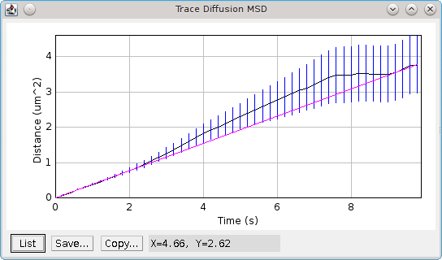

    Plot of mean-squared distance verses time produced by the Trace Diffusion plugin.

    The mean of the raw data is plotted with bars representing standard error of the mean. The best fit line is shown in magenta.

..
  No index

Jump Distance Histogram
^^^^^^^^^^^^^^^^^^^^^^^

The plugin produces a cumulative probability histogram of the jump distance (see :numref:`Figure %s <fig_trace_diffusion_jump_distance_cumul_histogram>`). The best fit for a single species model will be shown in magenta. Any significant deviations of the histogram line from the single species fit are indicative of a multi-species population. If a multiple species model has a better fit than the single species model then it will be plotted in yellow.

.. _fig_trace_diffusion_jump_distance_cumul_histogram:
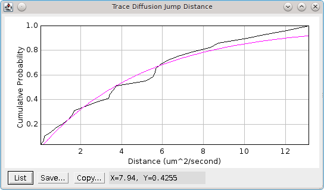

    Jump distance cumulative probability histogram.

    The best fit for the single species model is shown in magenta.

Histograms
^^^^^^^^^^

If the ``Show histograms`` option is selected the plugin presents a second dialog where the histograms can be configured. The number of bins in the histogram can be specified and outliers can optionally be removed. Outliers are any point more than 1.5 times the inter-quartile range above or below the upper and lower quartile boundaries. The following histograms can be chosen:

.. list-table::
   :widths: 20 80
   :header-rows: 1

   * - Parameter
     - Description

   * - Total signal
     - The total signal of each trace.

   * - Signal-per-frame
     - The signal-per-frame of the localisations in a trace.

   * - t-On
     - The on-time of a trace. This excludes the traces too short to be analysed.

   * - MSD/Molecule
     - The average mean-squared distance per molecule. Plots of the all-vs-all and adjacent MSD are shown.

       If the particles contain molecules moving with different diffusion rates or a fixed fraction of molecules then the histogram may be multi-modal.

   * - D*/Molecule
     - The apparent diffusion coefficient per molecule. Plots of the all-vs-all and adjacent D* are shown.

..
  No index

Summary Table
^^^^^^^^^^^^^

The plugin shows a summary table of the analysis results. This allows the plugin to be run with many different settings to view the effect on the calculated diffusion coefficient. The following columns are reported:

.. list-table::
   :widths: 20 80
   :header-rows: 1

   * - Field
     - Description

   * - Title
     - The title (specified by the ``Title`` parameter).

   * - Dataset
     - The input dataset.

   * - Exposure time
     - The dataset exposure time per frame.

   * - Trace settings
     - The settings used for the trace algorithm.

   * - Min-length
     - The minimum track length that was analysed.

   * - Ignore ends
     - True if the end jumps of tracks were ignored.

   * - Truncate
     - True if tracks were truncated to the min length.

   * - Internal
     - True if internal distance were used.

   * - Fit length
     - The number of points fitted in the linear regression.

   * - MSD corr
     - True if MSD correction was applied.

   * - S corr
     - True if precision correction was applied.

   * - MLE
     - True if maximum likelihood fitting was used.

   * - Traces
     - The number of traces analysed.

   * - s
     - The average precision of the localisations in the traces.

   * - D
     - The diffusion coefficient from MSD linear fitting.

   * - Fit s
     - The fitted precision when fitting an intercept in the MSD linear fit.

   * - Jump distance
     - The time distance used for jump analysis.

   * - N
     - The number of jumps for jump distance analysis.

   * - Beta
     - The beta parameter which is the ratio between the mean squared distance the localisation precision: :math:`\frac{\mathit{MSD}}{s^2}`.

       A beta above 6 indicates that jump distance analysis will produce reliable results [Weimann *et al*, 2013].

   * - Jump D
     - The diffusion coefficient(s) from jump analysis.

   * - Fractions
     - The fractions of each population from jump analysis.

   * - IC
     - The information criterion (IC) for the best model fit.

       Note that the IC is not comparable between the MLE or LSQ methods for fitting. It is also not comparable when the number of jumps is different. It can only be used to compare fitting the same jump distances with a different number of mobile species. This can can be controlled using the ``Minimum`` and ``Maximum N`` parameters.

   * - Total signal
     - The average total signal of each trace.

   * - Signal/frame
     - The average signal-per-frame of the localisations in a trace.

   * - t-On
     - The average on-time of a trace. This excludes the traces too short to be analysed.

The plugin will report the number of traces that were excluded using the length criteria and the fitting results to the ``ImageJ`` log. This includes details of the jump analysis with the fitting results for each model and the information criterion used to assess the best model, e.g.

.. code-block:: text

    783 Traces filtered to 117 using minimum length 5
    Linear fit (5 points) : Gradient = 2.096, D = 0.5239 um^2/s, SS = 0.047595 (2 evaluations)
    Jump Distance analysis : N = 151, Time = 6 frames (0.6 seconds). Mean Distance = 1371.0 nm, Precision = 38.55 nm, Beta = 35.57
    Estimated D = 0.4698 um^2/s
    Fit Jump distance (N=1) : D = 0.0498 um^2/s, SS = 0.433899, IC = -453.1 (12 evaluations)
    Fit Jump distance (N=2) : D = 1.655, 0.0346 um^2/s (0.1832, 0.8168), SS = 0.014680, IC = -960.3 (342 evaluations)
    Fit Jump distance (N=3) : D = 1.655, 0.0346, 0.0346 um^2/s (0.1832, 0.1204, 0.6964), SS = 0.014680, IC = -956.1 (407 evaluations)
    Coefficients are not different: 0.0346 / 0.0346 = 1.0
    Best fit achieved using 2 populations: D = 1.655, 0.0346 um^2/s, Fractions = 0.1832, 0.8168

For use in the ``ImageJ`` macro language, extension functions can be registered that allow access to the computed diffusion coefficients and population fractions (see :numref:`{number}: {name} <toolset_plugins:Trace Diffusion Extensions>`).

.. index:: ! Trace Diffusion Multi

Trace Diffusion (Multi)
-----------------------

This plugin allows the ``Trace Diffusion`` plugin to be run with multiple input datasets. Each dataset will be traced separately. The results are then combined for analysis. This allows analysis of multiple repeat experiments as if one single dataset.

When the plugin runs a dialog is presented that allows the datasets to be selected (:numref:`Figure %s <fig_trace_diffusion_multi_selection>`).

.. _fig_trace_diffusion_multi_selection:
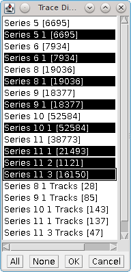

    Trace Diffusion (Multi) dataset selection dialog

*  Click a single result set to select or deselect.

*  Hold the ``Shift`` key to select or deselect a range of results starting from the last clicked result set.

*  Use the ``All`` or ``None`` buttons to select or deselect all the results.

*  Click the ``Cancel`` button to end the plugin.

*  Click the ``OK`` button to run the
   ``Trace Diffusion``
   plugin with the selected results.

When the ``Trace Diffusion`` plugin is executed it will not have the ``Input`` option as the results have already been selected. If multiple datasets are chosen the dataset name in the results table will be named using the first dataset plus the number of additional datasets, e.g. ``Dataset 1 + 6 others``.

Note that the plugin supports the ``ImageJ`` recorder to allow running within an ``ImageJ`` macro.

.. index:: ! Trace Length Analysis

Trace Length Analysis
---------------------

Analyses the track length of traced data and optionally provides an interactive method to split a dual population of fixed and moving molecules.

Allows the traced dataset to be selected. The traced data is then analysed to compute the length of each trace in frames and the mean squared displacement (MSD). The MSD is the mean of the sum of the squared jump distances between localisations in the trace. Each jump distance has the localisation precision subtracted from the jump length (i.e. the expected error in the measurement). The MSD can be converted to the diffusion coefficient for 2D diffusion:

.. math::

    D = \frac{\mathit{MSD}}{4 * \Delta t}

The ``Trace Length Analysis`` plugin shows two histograms:

.. list-table::
   :widths: 40 60
   :header-rows: 1

   * - Histogram
     - Description

   * - Trace diffusion coefficient D
     - The computed diffusion coefficient for all traces.

   * - Trace length distribution
     - The distribution of trace lengths for the fixed and moving molecules.

An interactive dialog is shown that allows the traces to be split into fixed and moving molecules. The following parameters can be set:

.. list-table::
   :widths: 20 80
   :header-rows: 1

   * - Parameter
     - Description

   * - D threshold
     - The threshold for the diffusion coefficient to split molecules into fixed and moving populations.

   * - Normalise
     - If **true** the ``Trace length distribution`` histograms will be normalised by the sum of the counts for each population. Otherwise the histograms show raw counts.

If the ``Save datasets`` button is pressed the input dataset will be saved to memory as two datasets with the ``Fixed`` and ``Moving`` suffix based on the current diffusion coefficient threshold.

Note: An ideal dual population of fixed and moving molecules will be a bimodel histogram of the diffusion coefficient, for example DNA binding proteins that are either diffusing freely or bound to the DNA. If this plugin is run on data which does not contain an obvious dual population of fixed and moving molecules then the histogram will be unimodal. If the population contains only moving molecules then the diffusion coefficients will have a mode far above zero. If the population contains only fixed molecules then the diffusion coefficients will be very low with a mode close to zero. A split of mixed populations of diffusing molecules with different diffusion coefficients is not supported.

.. index:: ! OPTICS

OPTICS
------

Runs the Ordering Points To Identify the Clustering Structure (`OPTICS <https://en.wikipedia.org/wiki/OPTICS_algorithm>`_) algorithm [Ankerst *et al*, 1999] to perform interactive density-based clustering of localisation data. Each point in the data is analysed to determine the number of neighbours within a specified `radius`. A minimum number of points (`MinPoints`) is specified which describes the number of points required to form a cluster. If the `MinPoints` is achieved for the point neighbourhood the algorithm assigns each point the core distance which is the distance to the `MinPoints`\ :sup:`th` closest point. The reachability-distance of another point `p2` from point `p1` is the maximum of the distance between them or the core distance. If point `p2` is above the maximum radius to consider then there is no reachability distance.

Processing starts from an arbitrary unprocessed point. The neighbours are computed as points within the `radius`. If the neighbourhood satisfies `MinPoints` then a new cluster is created. The neighbours are added to a sorted queue to be processed. Processing occurs in order of their reachability-distance. During processing the reachability distance of points already in the queue may change (reduce in size) and the queue is reordered. When no more points are reachable from the cluster then a new unprocessed point is chosen.

The OPTICS algorithm requires parameters `radius` and `MinPoints`. The run-time of the algorithm depends on `radius`. If set to the maximum distance between any two points in the data then the run-time is asymptomatically quadratic as each neighbourhood returns all the points. The `MinPoints` parameter is recommended to be double the number of dimensions: for 2D localisation data that is 4.

FastOPTICS is a variant that is not parameterised using a neighbour radius. The algorithm is based on the concept that a pair of points close in N-dimensional space are also close when the space is projected to 2D. The algorithm computes a number of projections of the data onto a line. This line can be randomly orientated or orientated using equi-distributed vectors around a circle. Each projection provides a linear order of points along the line using a distance from the origin. This set of points is recursively split using random divisions until subsets are all below `MinPoints` in size. The points in a subset are allocated as neighbours of a chosen point in the subset. The point is chosen either randomly, as the median of the subset (using the distance from the origin) or all points are chosen. After a number of random projections each point has an allocated neighbourhood of points. The rest of the algorithm functions the same as OPTICS but with pre-computed neighbours and no requirement for a `radius`.

The OPTICS algorithm outputs the points in a particular ordering. A plot of the order against the reachability distance shows a dendrogram-like structure where the clusters show as wells in the reachability profile. OPTICS provides an algorithm that analyses the gradient of the profile in runs of up and down and uses this to assign a hierarchical level of clustering to the data based on a parameter `Xi` (the change in reachability to define a cluster). A second clustering algorithm uses a fixed distance threshold. All adjacent points in the profile that are reachable below this distance are assigned to the same cluster. The result is the same as if using the DBSCAN algorithm (see section :numref:`{number} <analysis_plugins:DBSCAN>`).

A local outlier probability (LoOP [Kriegel `et al`, 2009]) analysis can be performed by the plugin. The local density is estimated by the typical distance at which a point can be "reached" from its neighbours specified using the `MinPoints` nearest neighbour. By comparing the local density of an object to the local densities of its neighbours, one can identify regions of similar density, and points that have a substantially lower density than their neighbours. These are considered to be outliers. LoOP analysis produces a score in the range of 0 to 1.

The ``OPTICS`` plugin has a preview mode that allows the parameters to be changed and the results updated in real-time. There are various output options to control outlining of clusters on an image, viewing of the clustering structure on the reachability profile and tabulation of cluster results. The ``OPTICS`` dialog is non-blocking allowing the other ``ImageJ`` windows to be used when the preview is active.

Parameters
~~~~~~~~~~

The following options are available (extra options are activated by holding the ``Shift`` when running the plugin):

.. list-table::
   :widths: 20 80
   :header-rows: 1

   * - Parameter
     - Description

   * - Input
     - Select the input results to analyse.

   * - Ignore Z
     - Set to ``true`` to ignore the z coordinate in 3D data and perform 2D clustering. The default is 3D clustering for 3D datasets. Note: The visualisation of clustering results is optimised for 2D. For 3D data the results will be viewed using a projection onto the XY plane.

   * - Min points
     - The minimum number of neighbours required to create a cluster.

   * - OPTICS mode
     - The mode to find neighbours:

       - ``OPTICS``: Use a generating distance parameter to define the search radius for neighbours.
       - ``FastOPTICS``: Assign neighbours using projections to a line to define local neighbours in the projected space. The number of projections (splits) can be configured or is set automatically using the dataset size.

         Extra options allow the configuration of using random vectors (default is equi-distributed on a circle) and the sample mode for which point to assign the sub-set to. Note that the project is recursively split into sub-set. If the ``Approx sets`` option disabled the subset must be smaller than ``Min points``; if enabled this will save any sets that are close to ``Min points`` in size (within 50%) allowing larger subsets to be included.

   * - Clustering
     - Specify the algorithm to assign clusters:

       - ``Xi``: Use a parameter to define the ends of clusters using the steepness of the reachability profile. The clusters are hierarchical, i.e. small clusters may be within larger clusters. Clusters are assigned a level indicating the depth in the hierarchy.

         A smaller number for ``Xi`` will create more clusters.
       - ``Pseudo-DBSCAN``: Use a single clustering distance to divide the reachability profile. The clusters are not hierarchical.

         The ``Core points`` option will only output points that have a core distance within the clustering distance. This excludes points that may be reachable from a cluster but do not have enough neighbours to initialise a cluster. The effect is that the clusters will be identical independent of the encounter order of the algorithm; outlier/edge points that may or may not be included in a cluster depending on processing order are excluded.

   * - Show table
     - Show the clusters in a results table.

       The sort order for the table data can be configured.

   * - Image scale
     - Specify the scale for the output image. The size of the image is the raw pixel bounds for the localisation data multiplied by the scale.

   * - Image mode
     - Specify the type of image to create. See :numref:`{number}: {name} <fitting_plugins:Results Parameters>`.

   * - Outline
     - Specify how clusters should be outlined on the image. The outline algorithm can be configured using the ``...`` button to specify a convex hull or concave hull of the cluster points. The outline can be coloured by cluster ID.

       Outlines can be optionally saved to the ``ImageJ`` ROI manager.

       The concave hull can use the K-nearest neighbour method of Moreira and Santos (2007), or the digging algorithm of Park and Oh (2012). For the digging algorithm the threshold is the allowed ratio between the edge distance and the distance to the internal point; a higher threshold results in a less concave hull.

   * - Spanning tree
     - Specify how links between localisations should be outlined on the image. Links represent the connections made between points as they were included in the cluster following the imposed OPTICS order. The links create a spanning tree and can be coloured by coloured by cluster ID; depth in the clustering hierarchy; OPTICS order; or the LoOP (local outlier probability) score.

   * - Plot mode
     - Configure the options for the reachability profile plot.

       The profile represents the reachability of each localisation in the order imposed by the OPTICS algorithm. Clusters represent a span on the profile. The plot can be drawn with just the profile or with lines underneath the profile representing cluster spans. Hierarchical clusters are shown at their corresponding depth level. Clusters are coloured using a look-up table that attempts to achieve maximum distinction between different colours; the colours themselves are not significant.

       The reachability can be highlighted for all points in a cluster or each cluster can be drawn using either cluster ID, depth or order. In the case of multiple clusters at the same point the colour of the deepest cluster takes precedent.

   * - Preview
     - Enables the live preview of results. Settings changes will result in live update of the displayed results.

       The ``...`` button allows the events generated by the open windows to be configured:

       - ``Show selected clusters in table``: If **true** any cluster that is selected by a selection event will have all the localisations for that cluster shown in a ``Selected Clusters`` table.
       - ``Table create selection``: If **true** mouse clicks in the ``Clusters`` results table generate selection events.
       - ``Table show selection``: If **true** selection events will select the cluster in the ``Clusters`` results table. Only the first cluster selected will be highlighted (as the table does not support discontinuous selections).
       - ``Image create selection``: If **true** mouse clicks in the image inside a cluster generate selection events. The smallest cluster by area is selected allowing clicks of smaller clusters inside larger clusters.
       - ``Image show selection``: If **true** selection events will select the cluster in the image. The image view is positioned with the cluster in the centre.
       - ``Plot create selection``: If **true** mouse selection drags on the reachability plot will generate selection events. All clusters in the horizontal range from the start to the end of the drag are selected.
       - ``Plot show selection``: If **true** selection events will select the cluster in the reachability plot. The plot is zoomed to the start and end of the cluster range with the full profile displayed.

   * - Debug
     - Extra option: If *true* write debugging information to the Java console.

Analysis
~~~~~~~~

The ``OPTICS`` plugin records processing details to the ``ImageJ`` log window. This includes:

- The settings for FastOPTICS including the number of splits and projections performed.
- The processing time for the algorithm which may include splitting the data, computing neighbourhoods and the number of distance comparisons computed. This can be used to performance tune the parameters if the processing is taking too long.
- The number of clusters if the ``Pseudo-DBSCAN`` clustering method is run on the profile with an estimated generating distance. The estimated distance is created using the radius of the circle required to contain the ``Min points`` of neighbours assuming the localisations are uniformly spread over the region defined by the X/Y bounds.

If the live preview is active the plugin also records the `Rand index <https://en.wikipedia.org/wiki/Rand_index>`_ comparing the current clustering with the previous clustering. This provides an indication of how much the clustering has changed with settings changes.

Results
~~~~~~~

The ``OPTICS`` plugin will create results displayed in windows. If the ``OK`` button is pressed the final settings will be used to update any live preview results. If live preview was not enabled then the results will be displayed. Note that the selection events are only created and handled when the ``OPTICS`` plugin dialog is open. After the dialog has been closed the results windows are no longer interactive.

``OPTICS`` will save the clustering results to a dataset in memory. Localisations will have an ID assigned if they were part of a cluster. The ID will be from the cluster in the deepest part of the hierarchy.

An example of the reachability profile is shown in :numref:`Figure %s <fig_optics_profile_example>`. Notes:

- The profile may be very large as all localisations will be represented along the horizontal axis.
- An image can be zoomed to a region in ``ImageJ`` by using the ROI tool to mark a region and then pressing ``+`` or using ``More >> Zoom to Selection``.
- The axes can be reset using ``More >> Set Range to Fit All``.
- The plot window can be resized by dragging the window frame edges / corners.

.. _fig_optics_profile_example:
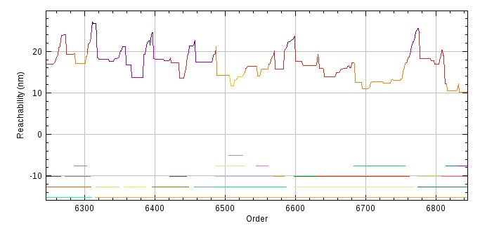

    OPTICS reachability profile.

    The profile is coloured using the cluster depth and the hierarchical clusters are displayed underneath the profile.

Examples of the clusters and spanning tree overlaid on an image are shown in :numref:`Figure %s <fig_optics_outline_example>` and :numref:`Figure %s <fig_optics_spanningtree_example>`. Notes:

- The image can be zoomed using the ``+`` and ``-`` keys.
- Holding the ``Space`` bar allows the canvas to be scrolled using mouse drag.

.. _fig_optics_outline_example:
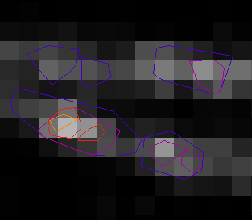

    OPTICS clusters outline.

    The outline, representing the convex hull of clusters, is coloured using the cluster depth and overlaid on a super-resolution image of the localisations.

.. _fig_optics_spanningtree_example:
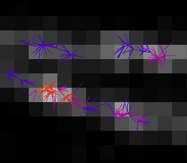

    OPTICS clusters spanning tree.

    The spanning tree, representing the OPTICS order used to connect localisations, is coloured using the cluster depth and overlaid on a super-resolution image of the localisations.

.. index:: ! DBSCAN

DBSCAN
------

Runs the Density-based spatial clustering of applications with noise (`DBSCAN <https://en.wikipedia.org/wiki/DBSCAN>`_) algorithm [Ester *et al*, 1996] to perform interactive density-based clustering of localisation data.

This plugin is a modification of the ``OPTICS`` plugin. The DBSCAN algorithm predates the OPTICS algorithm. The difference is that localisations are processed in arbitrary order. In OPTICS the algorithm tracks how reachable points are from each other and links more reachable points first. DBSCAN does not make this distinction. As per OPTICS the DBSCAN algorithm each point in the data is analysed to determine the number of neighbours within a specified `radius`. A minimum number of points (`MinPoints`) is specified which describes the number of points required to form a cluster.

Processing starts from an arbitrary unprocessed point. The neighbours are computed as points within the `radius`. If the neighbourhood satisfies `MinPoints` then a new cluster is created. The neighbours that are reachable from a core point are added to the cluster and put in a queue to be processed. Processing occurs in arbitrary order. When no more points are reachable from core points in the cluster then a new unprocessed point is chosen.

The DBSCAN algorithm requires parameters `radius` and `MinPoints`. The run-time of the algorithm depends on `radius`. If set to the maximum distance between any two points in the data then the run-time is asymptomatically quadratic as each neighbourhood returns all the points. The `MinPoints` parameter is recommended to be double the number of dimensions: for 2D localisation data that is 4.

If points can be reached within the clustering distance from any core point then they are included in the cluster. Clusters are not hierarchical. The algorithm is faster than OPTICS due to the arbitrary processing order. OPTICS is approximately 1.6x slower.

.. index:: Parameter Estimation

Parameter Estimation
~~~~~~~~~~~~~~~~~~~~

The ``MinPoints`` parameter can be set to approximately 2 times the number of dimensions. For 2D localisation data this is 4. It may be necessary to increase this number for large datasets, noisy data or data that contains a large number of duplicates. The later scenario is common with localisation data where multiple frames may contain the same fluorophore.

The ``Clustering distance`` parameter can be chosen by using a k-nearest neighbour (KNN) distance graph, plotting the distance to the ``k = MinPoints - 1`` nearest neighbour in descending order (:numref:`Figure %s <fig_dbscan_knn_distance_example>`). If too small then a large amount of the data will not be clustered. Too large and the clusters will start to merge. A ``Noise`` parameter can be used to indicate a distance threshold by excluding a fraction of the KNN graph.

.. _fig_dbscan_knn_distance_example:
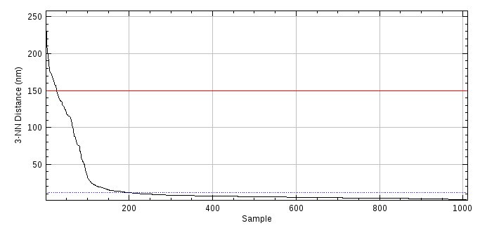

    DBSCAN K-nearest neighbour distance graph.

    The distance to the k\ :sup:`th` nearest neighbour for a random sample of points is plotted in descending order. An estimate for the DBSCAN clustering radius can be taken from the "elbow" of the plot. The red line shows the current ``Clustering distance``; the blue line is the distance defined by excluding the lowest fraction as specified by the ``Noise`` parameter.

Parameters
~~~~~~~~~~

The following options are available:

.. list-table::
   :widths: 20 80
   :header-rows: 1

   * - Parameter
     - Description

   * - Input
     - Select the input results to analyse.

   * - Ignore Z
     - Set to ``true`` to ignore the z coordinate in 3D data and perform 2D clustering. The default is 3D clustering for 3D datasets. Note: The visualisation of clustering results is optimised for 2D. For 3D data the results will be viewed using a projection onto the XY plane.

   * - Min points
     - The minimum number of neighbours required to create a cluster.

   * - Noise
     - The fraction of data to exclude when plotting the estimated clustering distance on the KNN graph.

   * - Samples
     - The number of random points to choose from the data to construct the KNN graph. If set to below 1 then all data points will be processed.

   * - Sample Fraction
     - The fraction of the data to sample to construct the KNN graph. If set to 0 then all data points will be processed.

       Note: If either ``Samples`` or ``Sample Fraction`` are set then the number of samples will be the maximum of (100, ``Samples``, ``Sample Fraction`` × dataset size). This is used to ensure the KNN graph has some data.

   * - Clustering distance
     - The distance used to define the local neighbourhood of a point.

   * - Core points
     - Only include core points in clusters. These are points with ``MinPoints`` neighbours within the ``Clustering distance``. Point that are reachable from a core point are excluded from the cluster.

       This option ensures the output clusters are independent of the processing order; otherwise non-core points may be allocated to different clusters depending on processing order.

   * - Show table
     - Show the clusters in a results table.

       The sort order for the table data can be configured.

   * - Image scale
     - Specify the scale for the output image. The size of the image is the raw pixel bounds for the localisation data multiplied by the scale.

   * - Image mode
     - Specify the type of image to create. See :numref:`{number}: {name} <fitting_plugins:Results Parameters>`.

   * - Outline
     - Specify how clusters should be outlined on the image. The outline algorithm can be configured using the ``...`` button to specify a convex hull or concave hull of the cluster points. The outline can be coloured by cluster ID.

       Outlines can be optionally saved to the ``ImageJ`` ROI manager.

       The concave hull can use the K-nearest neighbour method of Moreira and Santos (2007), or the digging algorithm of Park and Oh (2012). For the digging algorithm the threshold is the allowed ratio between the edge distance and the distance to the internal point; a higher threshold results in a less concave hull.

   * - Preview
     - Enables the live preview of results. Settings changes will result in live update of the displayed results.

       The ``...`` button allows the events generated by the open windows to be configured:

       - ``Show selected clusters in table``: If **true** any cluster that is selected by a selection event will have all the localisations for that cluster shown in a ``Selected Clusters`` table.
       - ``Table create selection``: If **true** mouse clicks in the ``Clusters`` results table generate selection events.
       - ``Table show selection``: If **true** selection events will select the cluster in the ``Clusters`` results table. Only the first cluster selected will be highlighted (as the table does not support discontinuous selections).
       - ``Image create selection``: If **true** mouse clicks in the image inside a cluster generate selection events. The smallest cluster by area is selected allowing clicks of smaller clusters inside larger clusters.
       - ``Image show selection``: If **true** selection events will select the cluster in the image. The image view is positioned with the cluster in the centre.

   * - Debug
     - Extra option: If *true* write debugging information to the Java console.

Analysis
~~~~~~~~

The ``DBSCAN`` plugin records processing details to the ``ImageJ`` log window. This includes:

- The settings for DBSCAN.
- The processing time for the algorithm which may include sampling the KNN data and computing the neighbourhoods. This can be used to performance tune the parameters if the processing is taking too long.
- The number of clusters.

If the live preview is active the plugin also records the `Rand index <https://en.wikipedia.org/wiki/Rand_index>`_ comparing the current clustering with the previous clustering. This provides an indication of how much the clustering has changed with settings changes.

Results
~~~~~~~

The ``DBSCAN`` plugin will create results displayed in windows. If the ``OK`` button is pressed the final settings will be used to update any live preview results. If live preview was not enabled then the results will be displayed. Note that the selection events are only created and handled when the ``DBSCAN`` plugin dialog is open. After the dialog has been closed the results windows are no longer interactive.

``DBSCAN`` will save the clustering results to a dataset in memory. Localisations will have an ID assigned if they were part of a cluster.

An example of the clusters overlaid on an image is shown in :numref:`Figure %s <fig_dbscan_outline_example>`. Notes:

- The image can be zoomed using the ``+`` and ``-`` keys.
- Holding the ``Space`` bar allows the canvas to be scrolled using mouse drag.

.. _fig_dbscan_outline_example:
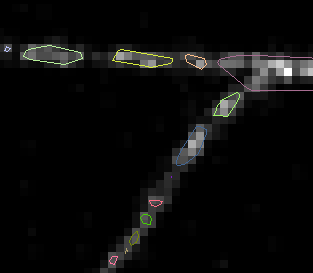

    DBSCAN clusters outline.

    The outline, representing the convex hull of clusters, is coloured using a look-up table to maximise separation of colours and overlaid on a super-resolution image of the localisations.

.. index:: ! Draw Clusters

Draw Clusters
-------------

Draws collections of localisations with the same ID on an image, for example the output from ``Trace Molecules``, ``Cluster Molecules`` or ``Trace Diffusion``.

The ``Draw Clusters`` plugin collects localisations together with the same ID into clusters. If
localisations have no ID they are ignored. The localisations in each cluster are then sorted by start frame to create an ordered trace. Each cluster is then drawn on a selected image, or a new empty image using an ``ImageJ`` overlay. The size of the empty image can be specified but the plugin will zoom a small image until the display window is 500 pixels on the long edge. The overlay can be removed using ``Image > Overlay > Remove Overlay``.

The user has the option to draw the cluster as a series of points (a cluster) or as a connected line (a trace). Plotting points is appropriate when the clusters contain multiple localisations that do not represent a single molecule. Plotting a line is appropriate when the cluster represents a single molecule's position through time.

If an input image is selected then the number of time frames in the image is compared with the maximum start frame in all the localisations. If the image stack is large enough the plugin can draw each cluster on the specific frame containing the localisation. In this case the entire cluster is drawn and the point contained in that particular frame is highlighted using a cross (see :numref:`Figure %s <fig_draw_clusters_example>`).

.. _fig_draw_clusters_example:
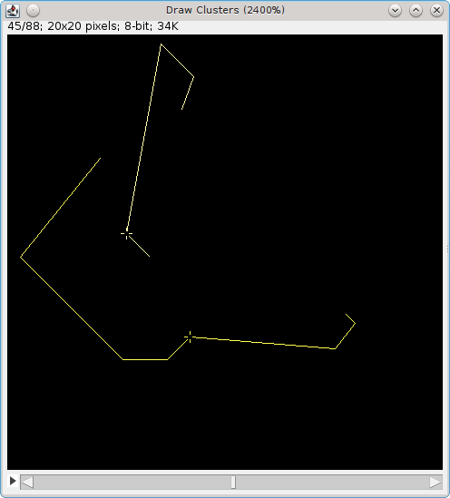

    Draw Clusters example

    The line shows the entire trace of the cluster. The cross is used to mark the point contained in the current frame.

The following options are available:

.. list-table::
   :widths: 20 80
   :header-rows: 1

   * - Parameter
     - Description

   * - Input
     - Select the input results to draw. The list only contains results where all the localisations have an ID.

   * - Image
     - Specify the output image to draw on. If ``[None]`` is selected then the output will be to an image named ``Draw Clusters``.

   * - Image size
     - The size of the default output image on the long edge. Small images will be zoomed.

   * - Expand to singles
     - Expand any localisation with a different start and end frame into a series of singles (with the same coordinates).

       This option is useful for drawing multi-frame localisations, for example centroid representations of clusters. The expansion is performed before the size filtering step.

   * - Min size
     - The minimum size of clusters. All clusters below this will be ignored.

   * - Max size
     - The maximum size of clusters. All clusters above this will be ignored. Set below the ``Min size`` to disable.

   * - Traces
     - Select this option to assume the localisations are connected as a time-series trace. The output will draw lines connecting the points.

       If not selected the output will draw each point individually.

   * - Sort
     - Specify how the clusters will be sorted before drawing. The sort order determines the colour taken from the look-up table.

   * - Spline fit
     - If selected the line will be drawn as a spline fit. This is only valid when ``Traces`` is selected.

   * - Use stack position
     - If selected the plugin will draw each cluster on the specific frame containing the localisation.

       If an output image is selected then the stack must contain enough frames to plot all the localisations.

       If no output image is selected then the default output image will be created as a stack of the required size.

   * - LUT
     - Specify the look-up table (i.e. the colour) used to plot the clusters.

       Each cluster is a single colour. The colour is varied according to the order the clusters are processed.

       Note: Single colour LUTs vary the intensity of the colour from 50% to 100% to provide identification of the order.

   * - Line width
     - Specify the line width. Use zero to draw lines with a 1 pixel stroke width regardless of the magnification.

.. index:: Drawing Cluster Centroids

Drawing Cluster Centroids
~~~~~~~~~~~~~~~~~~~~~~~~~

Note that the
``Draw Clusters``
plugin will draw all the members of a cluster on the image. If you wish to draw only the centroids then you should either:

*   Load the centroids from a pre-processed file as a single localisation with a unique ID
*   Run a clustering algorithm (``Trace Molecules`` or ``Cluster Molecules``) and then select an appropriate centroids dataset that is stored in memory

If you wish to draw the cluster centroid on each frame that contains a member of the cluster then you can use the ``Expand to singles`` and ``Use stack position`` options.

.. index:: ! Density Image

Density Image
-------------

Analyses the local density around each localisation and outputs an image using the
density score. Can optionally filter localisations based on the density score into a new results set.

The
Density Image
plugin counts the number of localisations in the neighbourhood of each localisation. The score is then used to create an image of the density of localisations. The following options are available:

.. list-table::
   :widths: 20 80
   :header-rows: 1

   * - Parameter
     - Description

   * - Input
     - Select the input results to analyse.

   * - Radius
     - Specify the radius of the local region around each localisation.

   * - Use ROI
     - If selected the user will be presented with a dialog allowing the selection of an image with an area ROI drawn on. If only one image has an area ROI it will be chosen automatically. The ROI will be scaled to the dimensions of the input results and only localisations within this region analysed.

       This option allows the user to construct density images using only part of the input image results.

   * - Adjust for border
     - Localisations that are close to the edge of the analysis region will have a local area that extends outside the region. This will result in under-counting of neighbours. This can be compensated for by scaling the count of neighbours using the proportion of area sampled, e.g. if 40% of the area is sampled (60% missing) the count is multiplied by 100/40.

   * - Image Scale
     - Specify the scale of the output image relative to the input results.

   * - Cumulative image
     - The output image may contain several localisations on the same pixel. If ``Cumulative image`` is enabled each pixel will be the combined sum of all the localisation scores at that point. If disabled each pixel will be the highest score of any localisation score at that point.

   * - Use square approximation
     - If enabled use a square neighbour region with edges of 2 x radius. If disabled use a circular neighbour region with the specified radius.

       Using the square approximation avoids computation of pairwise distances by assigning localisations to a grid and summing the counts within the grid neighbourhood. It is very fast when using extremely large datasets.

   * - Square resolution
     - Define how many grid points will be used per pixel for ``Use square approximation``. A larger resolution provides more accurate counting results at the cost of computational speed and memory size.

   * - Score
     - Define the score that will be output in the density image. See section :numref:`{number}: {name} <analysis_plugins:Available Density Score Functions>`.

   * - Filter localisations
     - Remove all localisations that have a score below the specified value. The remaining localisations will be stored in a new results set in memory. The results will be named using the source results name plus the suffix ``Density Filter``.

   * - Filter threshold
     - Define the filter threshold. Most score functions will be either zero or 1 if the density matches that expected for randomly distributed particles.

   * - Compute Ripley's L plot
     - Analyse the data using a range of distance thresholds and compute the Ripley's L-score for each. Show a plot of the L-score against the distance threshold. See section :numref:`{number}: {name} <analysis_plugins:Ripley's L-plot>`.

.. index:: Available Density Score functions

Available Density Score functions
~~~~~~~~~~~~~~~~~~~~~~~~~~~~~~~~~

The plugin computes the number of localisations in a region surrounding each localisation. This value is biased by the total number of localisations and the total area sampled. The number can be normalised using the sample size and sample area to produce different scores. The scores are based on the Ripley's K and L functions. Ripley's K-function describes the fraction of points within a distance threshold
*r*
normalised by the average density of points:

.. math::

    K(r)=\lambda ^{-1}\sum _{i\neq j}I(d_{\mathit{ij}}<r)/n

where *I* is the indicator function, :math:`d_{\mathit{ij}}` is the Euclidean distance between the i\ :sup:`th` and j\ :sup:`th` points in a data set of *n* points, and :math:`\lambda` is the average density of points, generally estimated as :math:`\frac{n}{A}`, where *A* is the area of the region containing all points. Note that the indicator function has a value of 1 for all elements (:math:`d_{\mathit{ij}}`) that are a member of a set (in this case :math:`d_{\mathit{ij}} < r`), otherwise it is zero. If the points are randomly distributed then *K(r)* should be equal to :math:`\pi r^2`.

The K function can be variance normalised to the L function:

.. math::

    L(r)=\sqrt{(K(r)/\pi )}

The L function should be equal to *r* if the points are randomly distributed and its variance should be approximately constant in *r*. A plot of :math:`L(r)-r` should follow the horizontal zero-axis if the data are dispersed using a homogeneous Poisson process. A plot of :math:`(L(r)-r)/r` will also be zero but should have equal variance at any *r* thus the magnitude of deviations from zero can be directly compared for any *r*.

Note that the K and L functions apply to an entire dataset. However it is possible to produce a per localisation K or L score as follows.

.. math::

    K_{i}(r)=\lambda ^{-1}\sum ^{j}I(d_{\mathit{ij}}<r)

Since the count of localisations is expected to be the area of the local region multiplied by
the average sample density (:math:`\lambda`) then the :math:`K_{i}(r)` score is expected to be the area of the local region.

The :math:`K_{i}(r)` score can be normalised by the local region area and should be equal to 1. As before the :math:`K_{i}(r)` score can be variance normalised to an L score:

.. math::

    L_{i}(r)=\sqrt{(K_{i}(r)/\pi )}

In this case the L-score is normalised by :math:`\pi`. If using a square approximation then the normalisation factor for the area of a square is 4.

The :math:`L_{i}(r)` score should be equal to *r* if the points are randomly distributed. The following scores are supported in the plugin:

.. list-table::
    :widths: 20 80
    :header-rows: 1

    * - Score
      - Description

    * - Density
      - The count of the number of localisations in the region around a localisation.

    * - :math:`K_{i}(r)`
      - K score. Should be equal to the local region area.

    * - :math:`K_{i}(r)/\mathit{Area}`
      - Should be equal to 1.

    * - :math:`L_{i}(r)`
      - Should be equal to the radius.

    * - :math:`L_{i}(r)-r`
      - Should be equal to zero.

    * - :math:`L_{i}(r)/r`
      - Should be equal to one. Scores should be comparable across different radii.

    * - :math:`(L_{i}(r)-r)/r`
      - Should be equal to zero. Scores should be comparable across different radii.

.. index:: Ripley's L-plot

Ripley's L-plot
~~~~~~~~~~~~~~~

If the ``Compute L plot`` option is selected then the plugin will compute the L-score for a range of radii. A dialog is presented allowing the user to select the ``Min radius`` and ``Max Radius`` and the ``Increment`` used to move between them. A plot is produced showing the :math:`(L_{i}(r)-r)/r` score for each radius. The score should be equal to zero for homogeneous data and is comparable across radii.

If the ``Confidence intervals`` parameter is enabled the plugin will create 99 random simulations of the given sample size in the same sample area. The :math:`(L_{i}(r)-r)/r` score is computed for each simulation and the upper (blue) and lower (red) bounds of the confidence intervals are shown on the chart. If the actual data values lies outside the confidence intervals then it is a non-random distribution with 99% confidence.

An example of Ripley's L-plot is shown in :numref:`Table %s <table_ripleys_l_plot>`. The figure shows the L-plot for simulated localisations of fluorophores. The raw data show significant deviation from a random distribution (A). Tracing of the localisations with a suitable time and distance threshold collates the individual localisations into single molecule traces. These do not show any deviation from a random distribution (B).

.. _table_ripleys_l_plot:
.. list-table:: Ripley's L-plot shown for two datasets with 99% confidences intervals, upper limit (blue) and lower limit (red). (A) Data showing a significantly non-random distribution. Data was generated by simulating randomly placed fixed position fluorophores with average t-on times of 3 frames. Localisations are expected to be non-random. (B) The same data following tracing with t=10 frames, d=0.3 pixels. Localisations have been collated into single molecules and the traced data do not show deviation from a random distribution.
   :align: center

   * - (A) Raw data

       |density_image_ripleys_l_plot_raw_png|
   * - (B) Traced data

       |density_image_ripleys_l_plot_traced_png|

.. index:: ! Dark Time Analysis

Dark Time Analysis
------------------

The ``Dark Time Analysis`` plugin computes a dark time histogram for blinking fluorophores and then outputs the time threshold required to capture a specified percentage of the blinks.

Fluorophores can be inactive (dark) for a variable amount of time between fluorescent bursts. If tracing is to be used to connect all separate bursts from the same fluorophore into a single molecule then the tracing must be done using the maximum dark time expected from the fluorophore. This can be estimated using the
``Dark Time Analysis``
plugin, ideally on an image sample of fluorophores captured under the same imaging conditions as will be used for *in vivo* experiments. The most success will be obtained using fixed fluorophore samples.

The plugin performs tracing or clustering on the localisations using a specified search distance and the maximum number of frames in the results for the time threshold. This allows the algorithm to connect a localisation in the first frame to the last frame. All the algorithms only allow localisations to be joined to the closest localisation in a different frame (i.e. not the same frame). However only those closer than the distance threshold are joined.

.. _fig_dark_time_analysis_dialog:
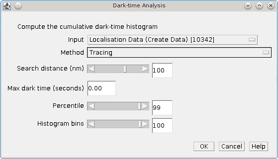

    Dark-time Analysis dialog

:numref:`Figure %s <fig_dark_time_analysis_dialog>` shows the plugin dialag. The plugin supports the following parameters:

.. list-table::
    :widths: 20 80
    :header-rows: 1

    * - Parameter
      - Description

    * - Input
      - Specify the results to use for analysis.

    * - Method
      - Specify the tracing or clustering method.

        Details of the tracing and clustering algorithms can be found in sections :numref:`{number}: {name} <analysis_plugins:Trace Molecules>` and :numref:`{number}: {name} <analysis_plugins:Cluster Molecules>`.

    * - Search distance (nm)
      - Specify the maximum distance between localisations to be part of the same molecule.

    * - Max dark time (seconds)
      - Specify the maximum allowed dark time between localisations to analyse.

        Any dark time distances above this are ignored. Set to zero to allow any dark time.

    * - Percentile
      - Specify the percentile limit used to report the maximum dark-time.

    * - Histogram bins
      - Specify the number of bins to use for the histograms.

When started the progress of the algorithm is shown on the ``ImageJ`` task bar. When tracing/clustering is complete the plugin produces a histogram and cumulative histogram of the dark time for all traces. The dark-time corresponding to the specified percentile is then reported to the ``ImageJ`` log window.

.. index:: ! Blink Estimator

Blink Estimator
---------------

Estimate the blinking rate of fluorophores in a results set.

The
``Blink Estimator``
uses the method of Annibale *et al* (2011) to estimate the blinking rate of a fluorophore. The method is based on performing trace analysis of the localisations using different time thresholds. The distance threshold used for the trace analysis is set using a factor of the average precision of all the localisations in the sample. When the time threshold is 1 then the number of traces will be equal to the total number of flourescent bursts in the sample. As the time threshold is increased the number of traces should asymptote at the number of molecules in the sample, assuming that no missed localisation counts occur. The curve of traces against time threshold can be fitted using the following formula:

.. math::

    N(t_{d})=N\cdot (1+n_{\mathit{blink}}\cdot\operatorname{e}^{(\frac{1-t_{d}}{t_{\mathit{off}}})})

where :math:`t_d` is the dark time of the fluorophore (time-threshold),
:math:`N(t_d)` is the number of traces at :math:`t_d`,
:math:`n_{\mathit{blink}}` is the average number of blinks per fluorophore,
:math:`t_{\mathit{off}}` is the average off time for fluorophores.
To avoid the problems associated with missed counts Annibale *et al* only fit this formula to the first five data points of the curve.

The ``Blink Estimator`` computes the :math:`N(t_d)` curve and fits the curve to the specified formula. By default the plugin fits the curve and shows a plot of the :math:`N(t_d)` curve with the fitted line (see :numref:`Figure %s <fig_blink_estimator_curve_output>`). The fit parameters are reported to the ``ImageJ`` log window.

Alternatively the plugin can fit the curve multiple times using a different number of points for each fit. In this case the output is a set of plots showing the values of each of the fitted parameters against the number of fitted points.

Note that tracing localisations through time also requires a distance threshold to determine if the two coordinates are the same molecule. The distance threshold used for the analysis is computed using the average precision of the localisations multiplied by a search factor. The average precision is determined by fitting a skewed Gaussian to a histogram of the localisation precision. This fit can optionally be displayed.

The following parameters can be set within the plugin to control the output:

.. list-table::
    :widths: 20 80
    :header-rows: 1

    * - Parameter
      - Description

    * - Input
      - Select the input results set.

    * - Max dark time
      - The maximum dark time to use for the :math:`N(t_d)` plot.

    * - Histogram bins
      - The number of histogram bins.

    * - Show histogram
      - Show the histogram of the precision along with the fitted skewed Gaussian curve.

    * - Search distance
      - Define the distance threshold for trace analysis.

    * - Relative distance
      - If selected the ``Search distance`` is relative to the average precision of the localisations in the dataset. If unselected the ``Search distance`` is absolute (in pixels).

    * - Fitted points
      - The number of points to fit on the :math:`N(t_d)` curve. Must be 4 or more.

    * - Range of fitted points
      - The maximum number of additional points to fit for variation analysis. Fit are computed in the interval ``[Fitted Points, Fitted Points + Range]``. Set to zero to show the :math:`N(t_d)` curve.

    * - Time at lower bound
      - When constructing the dark time curve the number of frames used for tracing is converted to time in milliseconds. Set to **true** to output time as nFrames × msPerFrame. Set to **false** to output time as (nFrames+1) × msPerFrame. This setting will shift the time axis of the curve and will produce different curve fitting results. Simulations using the ``Create Data`` plugin suggest that this should be **true**. A value of **false** is stating that localisations in consecutive frames may have blinked into a dark state of less than 1 frame.

.. _fig_blink_estimator_curve_output:
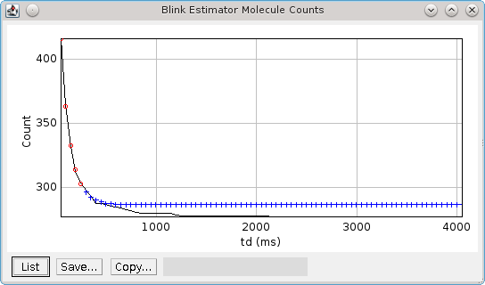

    Curve output from the Blink Estimator.

    The curve data is plotted in black. The red circles show the fitted points. The blue crosses indicate where the fitted line will asymptote.

.. index:: ! TC-PALM Analysis

Time Correlated (TC-PALM) Analysis
----------------------------------

Performs time correlated photo-activated light microscopy (TC-PALM) analysis (see Cisse *et al*, 2013). This plugin accepts a results set from memory. The plugin will use any assigned IDs to group localisations for analysis. All localisations with an ID of zero are assigned an ID. The support for grouped localisations allows the plugin to analyse groups of localisations together: an entire group can be selected even if the region of interest only contains some of the localisations; and groups can be selected and displayed together. It is suggested that the input data is a results set that has been clustered using a distance threshold that collects data within the range of interest.

The analysis uses a cumulative histogram of the number of localisations against time. The profile of the activation against time chart can be used to identify clustering that occurs continuously over the imaging lifetime or during a short interval of the entire imaging lifetime (time correlated activation). If the experiment had constant activation of fluorophores over the lifetime then the chart will show an initial steep gradient that gradually falls off as the fluorophores photo-bleach. If there is selective clustering of fluorophores, for example in response to a stage of the cell life cycle, these bursts of activations will appear as a steep gradient on the activation chart.

Display of the activations against time chart for an entire set of localisations will contain too much information and the bursts may not be visible over the noise of constant activation, or the simultaneous bursts in multiple locations in the image. The plugin thus provides a super-resolution image for an overview of the localisation data. A region of interest (ROI) can be marked on the image and the plugin will create the activations verses time plot.

When the plugin is executed the dataset and image rendering options must be specified.

.. list-table::
    :widths: 20 80
    :header-rows: 1

    * - Parameter
      - Description

    * - Input
      - Select the input results set.

    * - Image
      - Specify the rendering settings for the super-resolution image. Extra options are available using the ``...`` button.

        The options are the same as those available in the ``Peak Fit`` plugin (see :numref:`{number}: {name} <fitting_plugins:Results Parameters>`).

When the super-resolution image has been constructed a region of interest (ROI) is used to mark an area on the super-resolution image for analysis. The ROI may be created using any area ROI tool for example rectangle, oval, polygon or freehand. All groups that fit entirely within the region are analysed. Alternatively all groups that have at least one localisation within the region are analysed. To assist in analysing the activations verses time chart the range of localisations can be bracketed using a minimum and maximum frame. This allows zooming in on a part of the imaging lifetime. A dialog is shown to control the TC-PALM analysis.

.. list-table::
    :widths: 20 80
    :header-rows: 1

    * - Parameter
      - Description

    * - ROI intersects
      - Set to **true** to add all groups that have at least one localisation within the region to the current clusters. If **false** then all localisations from the group must be within the region to be included in the current groups.

    * - Min frame
      - The minimum frame for localisations that are extracted for analysis.

    * - Max Frame
      - The maximum frame for localisations that are extracted for analysis.

    * - Fixed time axis
      - Set to **true** to use the full time length of the input data on the time axis of the plots. If ``false`` the plot will zoom to the range of the current clusters.

    * - Time in seconds
      - Set to **true** to plot seconds on the activations verses time plot. The default is frames.

    * - Dark time tolerance
      - The maximum dark time allowed between activations for connection into a continuous burst.

    * - Min cluster size
      - The minimum size for a continuous burst of activations.

Output
~~~~~~

The ``TC-PALM Analysis`` plugin is interactive. The dialog controlling selection of the current clusters is non-blocking to allow interaction with other windows within ``ImageJ``. Updates to the ROI on the super-resolution image or the selection parameters will result in identification of a new set of current groups.

When the ROI or other parameters controlling the selection are updated the current groups will be identified. The square bounds from the ROI are used to construct a loop view of the region. Any data that is outside the ROI but was included using the ``ROI intersects`` parameter will not be visible. The loop view has a fixed size and thus smaller ROIs are magnified appropriately to allow an overview of the selected region. The settings for the loop view can be adjusted using the ``Loop settings`` button. The data from the current groups is then displayed in plots and a results table.

The current groups are shown on an activations verses time plot (see :numref:`Figure %s <fig_tc_palm_activations_vs_time>`). Each frame where one or more activations occurred is added as an individual line. High counts and occurrences close in time are easily visible on this plot.

.. _fig_tc_palm_activations_vs_time:
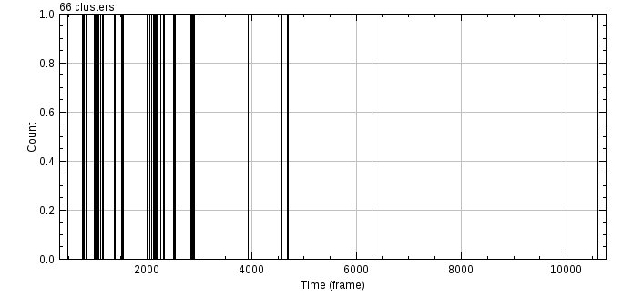

    TC-PALM activations verses time plot. The number of activations for each frame is shown as a separate line on the plot.

The activations are aggregated into a total activations verses time plot (see :numref:`Figure %s <fig_tc_palm_total_activations_vs_time>`). Note that multiple activations may occur at the same time. This is named a clash and the total number of clashes are displayed as a label on the plot. The number of clashes provides an indication of whether time correlated clustering is due to single or multiple fluorophores.

.. _fig_tc_palm_total_activations_vs_time:
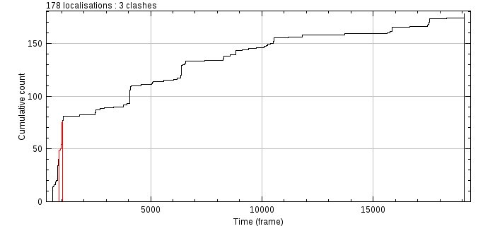

    TC-PALM total activations verses time plot. Highlighted activation bursts are identified using continuous regions of increasing activations within an allowed dark time tolerance of 40 frames and minimum cluster size of 20.

The total activations plot is analysed to identify bursts of activations that occur within a continuous time period. A dark time tolerance allows periods of no activations within the same burst. All bursts above a minimum cluster size are shown in a clusters table and highlighted on the total activations plot. The localisations from these bursts are drawn on the super-resolution images using a point ROI overlay. This can be used to determine if localisations that are close in time are also close in space. This is a time correlated clustering event. The ``Dark time tolerance`` and ``Min cluster size`` parameters can be adjusted and the results updated in real-time. Selecting a cluster in the clusters table will draw the hull of the cluster on the loop image using an ROI.

The current localisation groups are recorded in a table. The table records the average coordinates of the group, the size, the start frame and the duration. The default table sort order uses the start frame of the group. The sort can be changed by clicking on a table header to sort by that column. Lines can be selected using a single-click. Use the shift key to select multiple lines with a single mouse click starting from a previously selected line. Use the control key to select lines to add or remove from the selection allowing selection of discontinuous ranges. The selected data are sorted by start time and joined into bursts if the end of one group is within a dark time tolerance to the start of the next. Each burst is highlighted on the total activations verses time plot. Note that for convenience the ``Min cluster size`` parameter is ignored allowing the manually selected data to always be displayed on the total activations plot. All the localisations from the selected data are overlaid on the super-resolution images. This manually selected data replaces the results from the automated analysis. The automated analysis results can be recreated by adjusting one of the parameters that affects the input data or the analysis.

Batch ROI Analysis
~~~~~~~~~~~~~~~~~~

The interactive analysis can be used to explore the data by moving an ROI around the super-resolution image. Alternatively all the ROIs in the ROI manager can be analysed together and the results reported for the entire analysis. Each ROI can be added to the ``ImageJ`` ROI manager (using ``Ctrl+T``) so it can be revisited. Clicking the ROI in the ROI manager will re-apply the region to the image and the results are updated in real-time. The ``Dark time tolerance`` and ``Min cluster size`` parameters can be adjusted using multiple regions so that the parameters are suitable for analysis of all the regions.

The ``Analysis settings`` button configures the settings for the analysis including the output options. The ``Analyse ROIs`` button will perform analysis on each ROI from the ROI manager. Optionally a check can be made to detect any ROIs that overlap. If any ROIs overlap then a warning is shown as this may lead to double counting of clusters in the results. The overlap check only uses the square bounding rectangle for the overlap analysis so for example touching circular ROIs will be detected as overlapping. You can see overlapping ROIs using the ROI manager ``Show all`` function to overlay all ROIs on the super-resolution image. The analysis provides the option to continue or cancel if there are overlapping ROIs.

For each ROi the localisation groups are extracted and the total activations against time profile is constructed. This is used to identify clusters using the ``Dark time tolerance`` and ``Min cluster size`` parameters. The entire set of clusters from all ROIs are recorded in an ``All Clusters`` table. Summary histograms of cluster size, duration, area and density can be displayed. The localisations from the activation clusters are saved to memory using the same name as the input results set with the text ``TC PALM`` appended.

The ``All clusters`` table stores settings and ROI used to generate each result. Clicking a line in the table will repeat the analysis for the ROI with the saved settings. The ROI and settings will be applied to the super-resolution image and the plugin dialog.

.. index:: ! Neighbour Analysis

Neighbour Analysis
------------------

Saves all localisations paired with their neighbour (if present) to file.

The ``Neighbour Analysis`` plugin searches for the neighbour of each localisation within the given time and distance thresholds. In the event of multiple neighbours the localisation with the highest signal is selected. These are then saved to file as a series of clusters. Each cluster has either one or two entries. The first contains the details of the localisation, the optional second entry contains the details of the neighbour. Note that there is no requirement for neighbours to be symmetric.

This plugin was written to allow off-line analysis of the neighbours of localisations, for example investigation of how average distance, signal strength and frequency of neighbours vary when localisations are categorised using their own signal strength.

.. index:: ! Filter Analysis

Filter Analysis
---------------

Performs filtering on a set of categorised localisation results and computes match statistics for each filter.

The ``Filter Analysis`` plugin is used to benchmark different methods for filtering the results of fitting a 2D Gaussian to an image. When a Gaussian peak is fitted to an image it has many parameters that are changed in order to optimise the fit of the function to the data. For example the centre of the spot, the width of the spot, etc. It can be difficult to know if the parameters have been adjusted too far and the Gaussian function is no longer a fair representation of the image. This plugin requires the user to prepare input data with fitting results identified as correct or incorrect. The plugin will load the results and then filter them with many different settings. The filtered results are compared with the classifications and various comparison metrics are generated allowing the best filter to be identified.

Input Data
~~~~~~~~~~

The plugin requires a folder containing the results of running
``Peak Fit``
on one or more images. The results will contain the X and Y coordinates, X and Y standard deviations and amplitude of the Gaussian function. The results will also contain the original pixel value of the peak candidate location. This column must be updated to contain a zero for any result that is incorrect and a non-zero value for any result that is correct. The classification of spots can be performed using any method.

One successful data preparation method employed by the authors was to manually inspect a set of super-resolution images and extract entire stacks from the image containing suitable spots. These stacks should contain both on and off frames for the fluorophore and examples of good, medium and poor spots that could still be identified manually. The example spots were then manually scored by multiple researchers and a jury system used to score if the frame contained a spot or not. The images were fitted using ``Peak Fit`` and the results files updated using the jury classification to mark results as correct/incorrect.

When the plugin is run the user must select a directory. The plugin will attempt to read all the files in the directory as PeakResults files. The results are cached in memory. If the same directory is selected the user can opt to re-use the results. Click 'No' to re-read the results, for example if the files have been modified with new classifications.

.. index:: Available Filters

Available Filters
~~~~~~~~~~~~~~~~~

When the results have been loaded the user is presented with a dialog as shown in :numref:`Figure %s <fig_filter_analysis_dialog>`. There are several filters available with parameters to control them. Enable the filter by using the checkbox for the filter name. Each filter typically has a set of parameters that control the filter. The plugin allows the parameters to be enumerated so that the performance of the filter can be tested. The plugin dialog will allow the minimum and maximum value for the filter to be set along with an increment used to move between them. The filter will be run for each combination of parameters that is to be enumerated to produce a filter set.

.. _fig_filter_analysis_dialog:
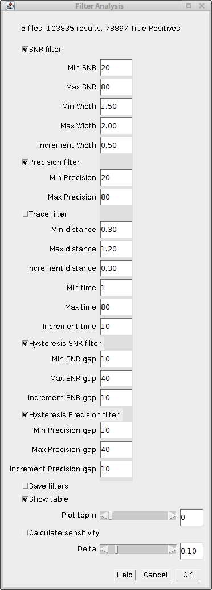

    Filter Analysis plugin dialog

The following filters are available:

.. list-table::
   :widths: 20 80
   :header-rows: 1

   * - Filter
     - Description

   * - SNR Filter
     - Remove all results with a Signal-to-Noise Ratio (SNR) below a set value. Additionally remove peaks where the width has expanded above a set ratio from the estimated PSF width.

       The SNR ratio used is from ``Min SNR`` to ``Max SNR`` in integer increments. The width used is from ``Min Width`` to ``Max Width`` in increments of ``Increment Width``.

   * - Precision Filter
     - Remove all results with a precision below a set value.

       The precision used is from ``Min Precision`` to ``Max Precision`` in integer increments.

   * - Trace Filter
     - Remove all results that do not form part of a molecule trace using the specified time and distance threshold. See section :numref:`{number}: {name} <analysis_plugins:Trace Molecules>` for details of the tracing algorithm.

       The minimum and maximum time and distance threshold can be configured along with the increments used to move between the min and max.

   * - Hysteresis SNR filter
     - Mark all results with a Signal-to-Noise Ratio (SNR) above an upper level as valid. Remove all results with a Signal-to-Noise Ratio (SNR) below a lower level. Any result with a SNR between the upper and lower levels is a candidate result. Candidates are retained if they can be traced directly or via other candidates to a valid result.

       Uses the same SNR and width parameters from the ``SNR Filter`` iterating over them as before. The SNR is used to set the lower SNR limit. Contains additional parameters to set the gap to the upper limit. The user can configure the min and max gap and the increment to move between them.

   * - Hysteresis Precision filter
     - Mark all results with a precision below a lower level as valid. Remove all results with a precision above an upper level. Any result with a precision between the upper and lower levels is a candidate result. Candidates are retained if they can be traced traced directly or via other candidates to a valid result.

       Uses the same precision parameters from the ``Precision Filter`` to set the lower limit. Contains additional parameters to set the gap to the upper limit. The user can configure the min and max gap along with the increment to move between them.

Note that the hysteresis filters perform tracing using a time threshold of 1 and a distance threshold of 2x the average precision of the results.

More flexibility over the filters to use in the analysis is provided by using the
``Create Filters``
and
``Filter Analysis (File)``
plugins (see sections :numref:`{number}<analysis_plugins:Create Filters>` and :numref:`{number}<analysis_plugins:Filter Analysis (File)>`).

Additional Parameters
~~~~~~~~~~~~~~~~~~~~~

After the filters have been configured there are additional parameters controlling the analysis:

.. list-table::
   :widths: 20 80
   :header-rows: 1

   * - Parameter
     - Description

   * - Save filters
     - Save the filters to file. The filters can be read using the ``Filter Analysis (File)`` plugin.

   * - Show table
     - Show a table of the analysis results.

   * - Plot top n
     - Produce a plot of the top N filter sets showing their Jaccard score verses a named parameter value. If a filter set contains filters with different named parameters then the filters are plotted in sequential order.

   * - Calculate sensitivity
     - Calculate how sensitive the scoring metric is to a change in each filter parameter. Each filter parameter is adjusted by the delta and the gradient computed at the point of the optimum filter score.

   * - Delta
     - The delta value used to adjust parameters to calculate the sensitivity.

Output
~~~~~~

At least one output method must be chosen otherwise the plugin will show an error message.

Results Table
^^^^^^^^^^^^^

If ``Show table`` is selected the plugin produces a table of the match statistics for the filtered results compared to the categorised inputs. The results for all the filters in a filter set are shown together. An empty row is used to separate filter sets.

The available scores are Precision, Recall, F-score and Jaccard. Details of the match statistics are given in section :numref:`{number}: {name} <comparison_metrics:Comparison Metrics>`.

..
  No index

Plot Output
^^^^^^^^^^^

If a value for ``Plot top n`` is provided the plugin produces a chart of the Jaccard score against one independent filter variable for each of the top N performing filter sets. An example of the ``Hysteresis Precision`` filter chart is shown in :numref:`Figure %s <fig_filter_analysis_hysteresis_filter_jaccard_plot>`. The chart shows a clear improvement and then fall-off in performance as the lower threshold is increased.

.. _fig_filter_analysis_hysteresis_filter_jaccard_plot:
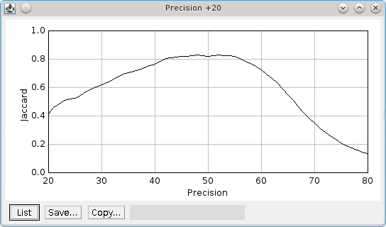

    Plot of the Jaccard score verses lower precision limit for the Hysteresis Precision filter.

    The upper limit for hysteresis thresholding is 20nm higher than the lower limit (+20).

..
  No index

Sensitivity Analysis
^^^^^^^^^^^^^^^^^^^^

If ``Calculate sensitivity`` is selected the plugin produces a table of the sensitivity of each parameter for each unique filter (identified by name). The sensitivity is calculated for the filter parameters that produce the highest Jaccard score. The sensitivity is the partial gradient of the score with respect to each parameter.

If the sensitivity is low then the filter will perform well using a range of parameter values. If the sensitivity is high then the filter performance will rapidly fall-off as the optimum parameter value is changed. Ideally a good filter will have good performance metrics and low sensitivity across all the parameters. It may be better to choose a fil|ter that does not have the highest Jaccard score but has the lowest sensitivity. This filter should perform better on a range of input data.

The sensitivity is calculated by altering each parameter by a relative amount. The delta parameter controls the update magnitude. Note that integer parameters will be correctly adjusted to the next integer. The score is recomputed using the new parameter value following a positive or negative change. The average rate of change of the score is then computed. The sensitivity is output for the Jaccard, Precision and Recall scores. Two scores are output: (a) the raw average change, titled ``Sensitivity (delta)``; or (b) the average change divided by the change in the parameter value, titled ``Sensitivity (unit)``.

.. index:: ! Create Filters

Create Filters
--------------

The ``Create Filters`` plugin can be used to prepare a large set of filters for use in the ``Filter Analysis (File)`` plugin (see section :numref:`%s <analysis_plugins:Filter Analysis (File)>`). The purpose is to create a set of filters that can be applied to a testing dataset to identify the best filter.

The plugin dialog shows a text area where a filter template can be specified as shown in :numref:`Figure %s <fig_create_filters_dialog>`. If the ``Show demo filters`` checkbox is selected then several example filters will be recorded in the ``ImageJ`` log.

.. _fig_create_filters_dialog:
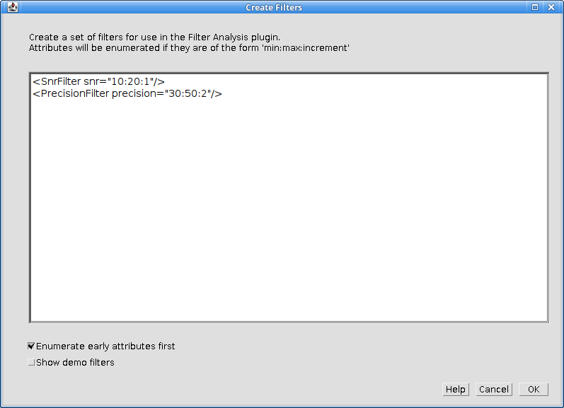

    Create Filters plugin dialog

The filter template must be valid XML elements. Each element should take the format of valid XML filters that can be passed to the
``Free Filter Results``
plugin. An example set of all the valid filters can be output to the ``ImageJ`` log window using the
``Free Filter Results`` plugin (see section :numref:`%s <results_plugins:Free Filter Results>`).

Each XML filter template is processed into a filter set. The attributes of the filter are scanned for the pattern ``min:max:increment``. If this is found a filter is created with the attribute set at each value from the minimum to the maximum using the specified increment. If not then the filter value is left untouched.

If a filter has multiple attributes then all combinations will be enumerated. Use the ``Enumerate early attributes first`` checkbox to enumerate the attributes in the order they appear in the template. Otherwise they will be enumerated in reverse order.

The output filter set will be named using the name of the filter. For example:

.. code-block:: xml

    <SNRFilter snr="10:20:2"/>

Becomes:

.. code-block:: xml

    <FilterSet name="SNR">
      <filters class="linked-list">
        <SNRFilter snr="10"/>
        <SNRFilter snr="12"/>
        <SNRFilter snr="14"/>
        <SNRFilter snr="16"/>
        <SNRFilter snr="18"/>
        <SNRFilter snr="20"/>
      </filters>
    </FilterSet>

When the plugin has generated all the filters it will present a file selection dialog allowing the user to specify the output filter file. If the file already exists it will be overwritten.

.. index:: ! Filter Analysis File

Filter Analysis (File)
----------------------

Performs filtering on a set of categorised localisation results and computes match statistics for each filter.

The
``Filter Analysis (File)``
plugin is similar to the
``Filter Analysis``
plugin (see section :numref:`{number}<analysis_plugins:Filter Analysis>`). The difference is that the plugin will not present options to create filters in the main dialog. Instead the filters are created from an input file that is selected following the main dialog. All other functionality is identical.

The filter file can specify thousands of different filters which are described using XML. This allows combinations of filters to be specified using ``And`` and ``Or`` filters; this is something that is not possible with the
``Filter Analysis``
plugin. A filter file can be generated from a filter template by enumerating the filter parameters using the
``Create Filters``
plugin (see section :numref:`{number}<analysis_plugins:Create Filters>`).

.. index:: ! Spot Analysis

Spot Analysis
-------------

The
``Spot Analysis``
plugin is designed to allow analysis of fluorophore blinking kinetics using calibration images.

The plugin allows the user to extract an ROI outlining a fluorophore position from an image and manually mark the frames where a spot is visible. A trace of the image intensity helps the user choose the brightest frames where a spot may be present. The plugin records the signal, on-time and off-time for the fluorophore to files for later analysis.

The plugin has been used to generate distributions for the signal-per-frame, on-times and off-times for mEOS3 fluorophores captured at a frame rate of 50 frames a second (20ms exposure time). At this rate the fluorophore emissions are very faint but frames can be manually labelled as on (or off). By analysing hundreds of spots it is possible to extract distribution parameters that allow the fluorophores to be modelled using the
``Create Data``
plugin.

Input Images
~~~~~~~~~~~~

The purpose of the plugin is to mark the fluorescent bursts from a single fluorophore. Consequently the input images should ideally be of single fluorophores spread evenly on the image and fixed in position. Overlapping fluorophores can be excluded from analysis by only selecting spots that appear distinct. An example input image with a simulated PSF image generated using the
``Peak Fit``
plugin is shown in :numref:`Figure %s <fig_spot_analysis_example_input_image>`. A single spot has been selected with an ROI on the PSF image. The selection has been applied to the original image to select the region for analysis.

.. _fig_spot_analysis_example_input_image:
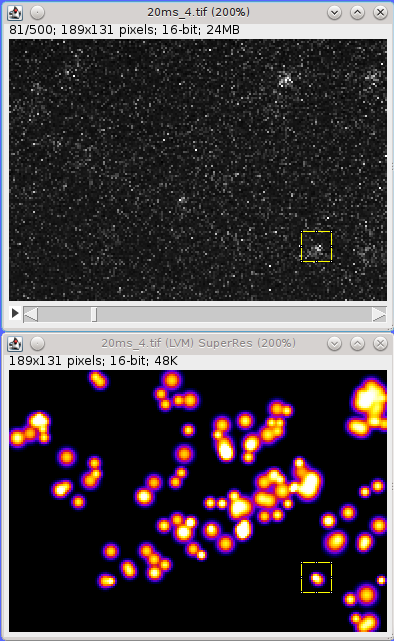

    Example Spot Analysis input image of mEOS3 expressed in *S. pombe*, fixed and activated at a low power to produce non-overlapping fluorophore bursts.

    The super-resolution image is a simulated PSF image of localisations with a SNR above 20. A single fluorophore is selected for analysis.

.. index:: Plugin Interface

Plugin Interface
~~~~~~~~~~~~~~~~

The Spot Analysis plugin displays a window as shown in :numref:`Figure %s <fig_spot_analysis_window>`. The window contains a drop down selection list allowing the input image to be selected and various parameters for the analysis can be set. The centre of the window shows the analysis of the current frame from the spot regions. The window then has several buttons allowing different actions. The final region of the window is a list of the currently selected on-frames with the calculated signal (in photons).

.. _fig_spot_analysis_window:
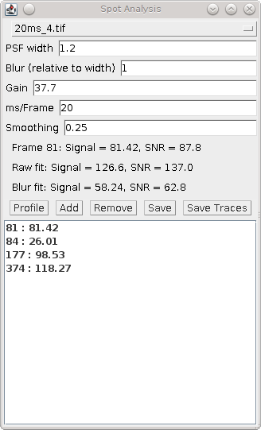

    Spot Analysis plugin window

The following parameters can be set:

.. list-table::
   :widths: 20 80
   :header-rows: 1

   * - Parameters
     - Description

   * - PSF width
     - The estimated peak width of the spots (in pixels). This is used to fit the spot region using ``Peak Fit``.

   * - Blur
     - The Gaussian blur to apply to create the blurred spot image. The width is relative to the PSF width.

   * - Gain
     - The total gain of the system (ADUs/photon). This is used to convert the counts to photons.

   * - ms/Frame
     - The exposure time. Used to calculate the on/off times in milliseconds.

   * - Smoothing
     - The LOESS smoothing parameter used to create the smoothed average for the profile plots.

..
  No index

Profiling a Spot Region
^^^^^^^^^^^^^^^^^^^^^^^

The first action is to select a spot on the input image using a rectangular ROI. It is difficult to see spots on the input image which has many frames and very few fluorescent bursts. Consequently it is recommended that an overview image is created to allow the spots to be identified. This could be a maximum or average intensity projection of the input image. However it is best to identify spots using the
``Find Peaks``
plugin and then reconstruct an image using the fitted PSFs. If the image scale is set to 1 then the reconstructed image is the same size as the input image. This allows spots to be outlined on the PSF image and then the ROI reapplied to the original image. An example of this is show in :numref:`Figure %s <fig_spot_analysis_example_input_image>`.

When a suitable spot has been outlined the region can be analysed using the ``Profile`` button. The analysis extracts the region into a new image named ``Spot Analysis Raw spot``. This is magnified to allow easier viewing. The same region is subjected to a Gaussian blur and extracted to a new image name ``Spot Analysis Blur spot``. The blurred image can make it easier to see peaks in very noisy images. In addition an average intensity projection is created for the spot region and named ``Spot Analysis Average spot``. The average image can indicate if the spot is fixed and central, moves around the image or overlaps with other signal. An example of the raw, blur and average images are shown in :numref:`Figure %s <fig_spot_analysis_spot_images>`. The average spot image shows a blurred spot biased to the upper-right corner but the signal is distinct so the spot is suitable for analysis. The ``Find Peaks`` fitting algorithm is applied to the current frame of the raw and blurred spot (using the configured PSF width). If a spot is detected within 50% of the distance to the centre of the frame it is marked on the image using an cross overlay.

.. _fig_spot_analysis_spot_images:
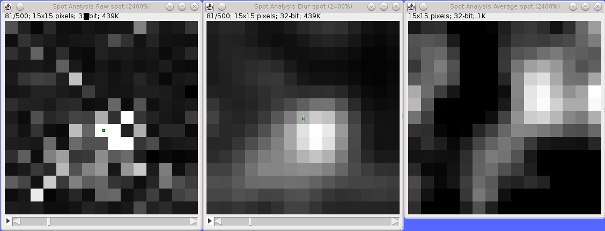

    Spot Analysis raw spot, blurred spot and average spot images.

    The centre of the fitted peak for the raw and blurred image for the current frame is shown using a cross overlay.

The plugin then analyses the spot region and creates profile plots of the mean and the signal standard deviation per frame as shown in :numref:`Figure %s <fig_spot_analysis_profiles>`. The currently selected frame in the spot images is shown using a vertical magenta line. The profile can be very noisy and so a LOESS smoothing is applied to the raw plot data to produce a background level (shown in red). Any selected on frames are labelled using magenta circles. In addition the plugin searches the ``Find Peaks`` results that are held in memory for any results that were created from the input image. If so then these are potential candidates for on-frames and are shown as cyan squares.

.. _fig_spot_analysis_profiles:
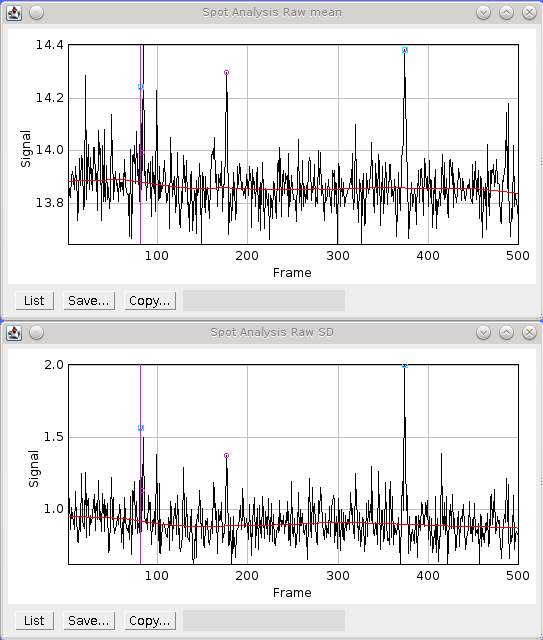

    Spot Analysis mean and standard deviation profiles of the spot region.

    The current frame is shown as a vertical pink line. Candidate on-frames from ``Peak Fit`` results are shown as cyan box. Selected on-frames are shown as magenta circles. The red line is the LOESS smoothing of the plot data.

..
  No index

Adding On-Frames
^^^^^^^^^^^^^^^^

Any fluorophore on-frame should have a higher mean that the frames around it. These can be easily viewed as spikes on the plot profile and the relevant frames in the spot image inspected.

When the spot image is moved to a new frame the plugin will update the signal and SNR figures for the frame. The signal is calculated as the sum of the raw spot minus the LOESS smoothing fit of the mean profile, i.e. the background. The noise is calculated using the LOESS smoothing fit of the standard deviation profile.

The plugin also runs the ``Peak Fit`` algorithm on the raw and blurred spot image. Identified localisations will be marked on the image with an overlay. The signal and SNR for the raw fit and blur fit are shown in the plugin window.

Combining inspection of the spot images with consideration of the signal and SNR of the raw data and fitted data should allow the user to decide if a fluorophore is on in the selected frame. The frame can be added to the on-frames list using the ``Add`` button. This can also be performed using a shortcut key mapped to the
``Spot Analysis (Add)``
plugin (see section :numref:`%s <analysis_plugins:Spot Analysis (Add)>`).

The frame is added to the list in the ``Spot Analysis`` window along with the current estimate of the signal for that frame. Note that LOESS smoothing only uses frames that have not been selected as on-frames. Consequently the background and the noise are updated as more on-frames are added to the list.

..
  No index

Saving a Fluorophore Sequence
^^^^^^^^^^^^^^^^^^^^^^^^^^^^^

When all the on-frames have been marked the fluorophore sequence must be saved using the Save button. This will record the sequence to a summary window as shown in :numref:`Figure %s <fig_spot_analysis_summary_window>`. The window shows the fluorophore signal, on and off times and number of blinks.

.. _fig_spot_analysis_summary_window:
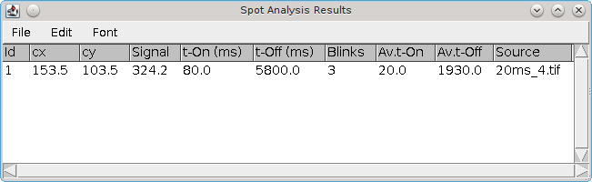

    Spot Analysis summary window

The ``Save`` button can only be pressed once to prevent duplicates in the window. If the sequence list is updated by adding or removing on-frames then the listed can be re-saved. Note that the old sequence will remain in the summary window and the new sequence will have a new ID. The old sequence should be removed using the summary tables ``Edit > Clear`` command to remove selected lines.

.. index:: Spot Analysis Workflow

Spot Analysis Workflow
~~~~~~~~~~~~~~~~~~~~~~

The following workflow is recommended when using the
``Spot Analysis``
plugin.

#.  Open the next input image. Magnify the image if necessary (``Image > Zoom > In [+]``).

#.  Run the ``Peak Fit`` plugin to identify peaks with a high SNR (or other criteria to show clear spots). Create a PSF image output with a scale of 1.

#.  Select a spot on the PSF image using a new rectangle ROI (or moving the previous one). It is recommended to maintain the same ROI size throughout the analysis. Choose a spot that does not overlap any other spots.

#.  Select the input image and press ``Ctrl+Shift+E`` to restore selection (apply the same ROI) to the input image. This will outline the spot location on the input image.

#.  Press the ``Profile`` button. This will produce a profile of the image intensity and standard deviation per frame for the spot. Any localisation results from the ``Peak Fit`` plugin are marked on the profile. The ``Profile`` command will also extract the ROI to a new detail image and zoom in for easier viewing. A blurred version of the image will also be shown using a Gaussian blur to make the spots more uniform. Contrast may have to be adjusted in these images. The images will be set to the first frame containing a localisation fitting result (or frame 1 if none are available).

#.  Scroll left and right through the image using the left/right keys to locate spots. (The original and blurred images will be synchronised.).

#.  Click the ``Add`` button when a spot is visible in the frame. Alternatively use the keyboard shortcut that has been mapped to the ``Spot Analysis (Add)`` command. The frame will be added to the list with the signal estimate for the spot.

#.  Remove bad frames from the list by highlighting them and using the ``Remove`` button. Double-clicking a frame in the list will select that frame on the detail images.

#.  Save the frames listed in the window to the results summary by clicking the ``Save`` button. The summary shows the fluorophore signal, on and off times and number of blinks. The list can only be saved once. It must be updated (using ``Add`` or ``Remove``) before it can be saved again.

#.  Repeat steps 3-9 for different candidate spots.

#.  Save all the results to file using the ``Save Traces`` button. Only results that are present in the table are saved. Duplicate or unwanted results can be removed using the table ``Edit > Clear`` command to remove selected rows.

.. index:: Results Files

Results Files
~~~~~~~~~~~~~

Fluorophore sequences in the summary table can be saved to file. The plugin saves only the sequences within the table. Any sequence that is removed from the table using the ``Edit > Clear`` command will be discarded. Click the ``Save Traces`` button to open a folder selection dialog. Following selection the plugin will write several files to the directory. Any old files will be over-written. The following files are saved:

.. list-table::
   :widths: 20 80
   :header-rows: 1

   * - File
     - Description

   * - traces.txt
     - Contains a summary of each fluorophore. Each record shows the ID, centre X and centre Y of the ROI outlining the spot, the total signal, the number of blinks and then a chain of paired start and stop frames for each pulse.

       This file contains all the information of the other files except the signal-per-frame (see ``signal.txt``).

   * - tOn.txt
     - Contains the on-times for all the results.

   * - tOff.txt
     - Contains the off-times for all the results.

   * - signal.txt
     - Contains the signal for each frame. The frame and signal are shown separated by a space.

       A header line is added before the signal for each fluorophore showing the ID, number of blinks and the total signal.

   * - blinks.txt
     - Contains the number of blinks for all the results. Blinks are the number of dark times recorded for a fluorophore. It is one less than the number of pulses (on-time events).

.. index:: ! Spot Analysis Add

Spot Analysis (Add)
-------------------

This plugin provides a named plugin command for the ``Add`` button of the ``Spot Analysis`` plugin.

Any named plugin command can be mapped to a hot key using ``ImageJ``'s ``Plugins > Shortcuts > Create Shortcut...`` command. Thus the ``Add`` button can be mapped by ``ImageJ`` to a keyboard shortcut. This allows the user to scroll through an image generated by the ``Spot Analysis`` plugin using the standard left and right arrow keys to move between frames. When a spot is present the user adds the spot to the list by clicking the ``Add`` button on the ``Spot Analysis`` window. If the ``Add`` command is mapped to a shortcut the user can perform the same action using the hotkey. This allows faster analysis of images using only simple keyboard commands.

.. index:: ! Crosstalk Activation Analysis

Crosstalk Activation Analysis
-----------------------------

Perform crosstalk activation analysis of photo-switchable probes under pulsed light activation. This plugin is based on the methods described in Bates `et al` (2007) and Bates `et al` (2012).

Activation analysis is based on the activation of a fluorophore from the flourescence transmission of a closely coupled second chromophore via fluorescence resonance energy transfer (more commonly referred to by the acronym `FRET <https://en.wikipedia.org/wiki/F%C3%B6rster_resonance_energy_transfer>`_). The second chromophore will be activated by a pulse of light and localisations from the primary fluorophore are only of interest if they begin immediately following a pulse activation.

Using a second chromophore to transfer activation energy to the primary fluorophore allows configuration of an experiment where the wavelength of the pulse activation light can be further separated from the typical activation wavelength of the primary fluorophore. Pairs of fluorophores can be combined with suitable excitation and emission spectra to allow multi-colour imaging to be performed by pulsing with different activation wavelengths and assigning localisations that occur immediately following an activation pulse to the appropriate channel. Note that activation of the primary fluorophore can occur spontaneously or from light pulsed in other wavelengths. This is `crosstalk`. The crosstalk of a fluorophore pair under the multi-channel experimental conditions (i.e. pulsing with different activation wavelengths in different frames) can be obtained using crosstalk activation analysis. This plugin performs the following analysis on a set of traced localisations:

* Identify localisations that appear in the frame after an activator pulse.
* For those localisations identify those that are activated more than once after a pulse of any activator wavelength, or the same activator wavelength.
* Calculate the ratio of how many times the molecule turns on after an incorrect pulse (channel `N`) to how many times it turns on after a correct pulse (channel `M`); this is the crosstalk ratio between channels `M` and `N`:

.. math::

    \mathit{crosstalk}_{MN} = \frac{\mathit{activations}_N}{\mathit{activations}_M}

The crosstalk between two channels is the ratio of incorrectly to correctly coloured localisations. A value less than 1 is expected otherwise the fluorophore is not being specifically activated by channel M. Ideally crosstalk should be close to zero. Note that a high crosstalk shows that the experiment conditions will have a lot of localisations mislabelled in the channel representing the 'wrong' wavelength due to another channel fluorophore being non-specifically activated. Some level of crosstalk is expected and the ratios can be used to perform spectral unmixing of the identified localisations in a multi-channel imaging experiment. This can be performed using the ``Pulse Activation Analysis`` plugin (see :numref:`{number} <analysis_plugins:Pulse Activation Analysis>`).

The ``Crosstalk Activation Analysis`` plugin requires localisations identified from imaging of a single FRET fluorophore-chromophore pair under the conditions of the multi-channel imaging protocol. Thus if 3 channel imaging is desired using 3 FRET pairs of fluorophore-chromophore then 3 rounds of crosstalk analysis must be performed to compute the crosstalk ratio for each pair.

The input localisations must be traced. This allows crosstalk analysis to be separated from how localisations are traced into bursts of fluorescence from the same molecule. Tracing can be done using the :numref:`{name} <analysis_plugins:Trace Molecules>` plugin.

Workflow
~~~~~~~~

When the plugin is run it displays a dialog where the traced input localisations and number of channels in the full pulse life cycle can be configured.

.. list-table::
   :widths: 20 80
   :header-rows: 1

   * - Parameter
     - Description

   * - Input
     - The dataset to analyse.

   * - Channels
     - The number of channels in the full pulse life cycle. This must be at least 2 (otherwise there is no crosstalk) and the supported maximum is currently 3.

The localisations are then loaded, the calibration is verified and the traces are extracted from the localisations. A dialog is then displayed where the pulse cycle is specified:

.. list-table::
   :widths: 20 80
   :header-rows: 1

   * - Parameter
     - Description

   * - Repeat interval
     - The full length of the pulse cycle in frames.

   * - Dark frames for new activation
     - The number of frames between localisations in the same trace used to split the the trace into activations. The minimum is 1. This will split any non-continuous localisations from a trace into separate activations.

       For results where localisations may be dropped during the fitting process this number can be increased, e.g. 5 will only create new activations if there is a gap of 5 frames in the same trace.

   * - Activation frame C1
     - The activation frame for channel 1.

   * - Activation frame C2
     - The activation frame for channel 2.

   * - Activation frame C3
     - The activation frame for channel 3.

       This is optional depending on the number of configured channels.

Note: The activation frame for each channel is the frame immediately following the pulse activation laser for the flourophore assigned to channel N. The channel is arbitrary. It is used to allow the output results to be mapped to the pulse wavelengths and fluorophores. The pulse life cycle and any computed crosstalk for each channel will be stored and shown as the default settings in the ``Pulse Activation Analysis`` plugin allowing the two plugins to be used together.

When the pulse life cycle has been configured the plugin will split the traces into activations using the ``Dark frames for new activation`` parameter. Activations are non-specific if they occur in a frame not following an activation pulse; otherwise the activations are specific to that pulse channel. The plugin records the background (non-specific) and channel (specific) activations rates to the ``ImageJ`` log window. These can be used to verify that the pulse life cycle has been correctly configured. Ideally the channel activation rates should be higher than the background activation rate; the target channel activation rate should be far higher than the other channels. In the following example the analysis has been performed on traced data from a non-pulsed experiment and the background rate is the same the channel activation rate::

    Activation rate : Background = 9331/17996 = 0.5185 per frame
    Activation rate : Channel 1 = 376/667 = 0.5637 per frame
    Activation rate : Channel 2 = 327/667 = 0.4903 per frame
    Activation rate : Channel 3 = 322/666 = 0.4835 per frame

In the following example from a simulated 3 channel pulsed experiment the activation rate for target channel 1 is much higher than the other channels::

    Activation rate : Background = 17880/26991 = 0.6624 per frame
    Activation rate : Channel 1 = 65385/1000 = 65.39 per frame
    Activation rate : Channel 2 = 7192/1000 = 7.192 per frame
    Activation rate : Channel 3 = 643/1000 = 0.643 per frame

After computing the activation counts the plugin will ask for the target channel. Analysis is performed on the activations to compute the crosstalk ratio(s) for the channel. The plugin will compute 1 ratio for a 2 channel analysis and 2 ratios for a 3 channel analysis. These are saved to memory.

A histogram is constructed of the activation counts for each channel. The crosstalk ratios between channels are displayed on the plot.

.. index:: Simulated Crosstalk

Simulated Crosstalk
~~~~~~~~~~~~~~~~~~~

The ``Crosstalk Activation Analysis`` plugin requires a set of traced localisations from a pulsed life cycle experiment with conjugated fluorophores. This data can be simulated allowing the plugin to be tested.

The simulation can be run by holding the ``Shift`` key down when running the plugin. This will provide an option to run the simulation or to perform crosstalk analysis as normal. Note that the ``Shift`` must be pressed when the main ``ImageJ`` window is the active. When run in simulation mode the plugin will create multiple datasets in memory and the crosstalk analysis is not run.

The simulation requires parameters for 3 sets of molecules which are drawn on a fixed size image region. For brevity only the parameters for a single channel are described:

.. list-table::
   :widths: 20 80
   :header-rows: 1

   * - Parameter
     - Description

   * - Molecules C1
     - The number of molecules in channel 1.

   * - Distribution C1
     - The distribution to use for molecules in channel 1.

       * ``Circle``: Create 10 random circles on the simulation region.
       * ``Line``: Create 10 random lines on the simulation region.
       * ``Point``: Create random points on the simulation region.

       In the case of circles or lines the molecule (x,y) positions are sampled uniformly from the perimeter.

   * - Precision C1
     - The localisation precision of molecules in channel 1. The positions of each localisation for a molecule will be sampled from a Gaussian using the precision for the standard deviation and either x or y for the mean. This simulates a noisy localisation fitting algorithm.

   * - Crosstalk C21
     - The crosstalk from channel 2 into 1. This is the frequency, expressed as a ratio, where a molecule that should be activated by channel 2 is activated by a pulse from channel 1.

   * - Crosstalk C31
     - The crosstalk from channel 3 into 1.

When the simulation is run it uses the following defaults:

.. list-table::
   :widths: 20 60 20
   :header-rows: 1

   * - Parameter
     - Description
     - Default

   * - Cycles
     - The number of pulse activation life cycles.
     - 1000

   * - Size
     - The size of the image region in pixels.
     - 256

   * - Activation Density
     - The activation density in molecules/|micro|\ m.
     - 0.1

   * - Non-specific frequency
     - The background activation frequency.
     - 0.01

   * - Pulse cycle duration
     - The duration of a single pulse cycle.
     - 30

   * - Activation frames
     - The activation frames for the pulse cycle.
     - 1, 11, 21

Initially the simulation creates the distribution shapes for the molecules in each channel and then samples the shapes to create the molecules. These are then activated in their target channel using an activation probability based on the image region and activation density, i.e. some of the molecules will randomly active each pulse. The crosstalk is used to determine the activation probability for how often the molecules activate following a pulse in their non-target channel. At each pulse the number of activated molecules is sampled from a binomial distribution with the configured activation probability. All non-pulse frame are sampled using the background activation probability. Note that is this simulation a molecule is active for only 1 frame.

When the simulation is complete the actual crosstalk for each channel is computed and recorded in the ``ImageJ`` log window with the configured values and the actual crosstalk after the ``=>`` text::

    Simulated crosstalk C12  0.05285=>0.05185, C13  0.1264=>0.1257
    Simulated crosstalk C21  0.07117=>0.07333, C23  0.09783=>0.09856
    Simulated crosstalk C31  0.137=>0.1362, C32  0.1297=>0.1286

The simulation is recorded using datasets in memory with the prefix ``Activation Analysis Simulation``. Each localisation is assigned a unique ID. The effect is that tracing of results is perfect and all separate activations are a new trace. A combined dataset is create along with a dataset for each channel with the suffix ``CN`` where `N` is 1, 2, or 3. The channel datasets can be used as input for the ``Crosstalk Analysis Plugin`` as they represent the imaging of 1 fluorophore-chromophore pair under the full imaging pulse life cycle.

For reference a 3 colour image composite is created with dimensions 1024x1024 pixels (see :numref:`Figure %s <fig_crosstalk_activation_analysis_simulation_example>`). This contains the localisations from each channel drawn with perfect spectral unmixing; each set of localisations is drawn on the correct channel regardless on whether it was due to an activation in the correct or incorrect pulse. This is a reference image for a perfect result. There is currently not an option to draw the localisations with colours associated with the pulse activation frame, i.e. the raw spectrally mixed image. This can be done using no crosstalk correction in the ``Pulse Activation Analysis`` plugin (see :numref:`{number} <analysis_plugins:Pulse Activation Analysis>`).

After the simulation has finished the ``Crosstalk Activation Analysis`` plugin can be run again on any of the simulation channel datasets. The pulse cycle will be correctly configured for the simulation pulse cycle. The computed crosstalk ratios shown on the results plot should match those logged by the simulation to the ``ImageJ`` log window.

.. _fig_crosstalk_activation_analysis_simulation_example:
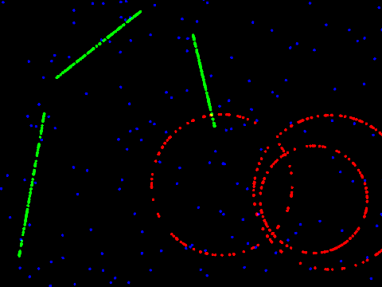

    Example image of simulated 3 channel data output by the Crosstalk Activation Analysis plugin.

.. index:: ! Pulse Activation Analysis

Pulse Activation Analysis
-------------------------

Perform multi-channel super-resolution imaging by means of photo-switchable probes and pulsed light activation. This plugin is based on the methods described in Bates `et al` (2007) and Bates `et al` (2012). For multi-channel pulse imaging this plugin requires the crosstalk ratios computed using the ``Crosstalk Activation Analysis`` plugin (see :numref:`{number} <analysis_plugins:Crosstalk Activation Analysis>`).

Pulse imaging is the use of pulsed activation light to activate fluorophores. Localisations that occur immediately after an activation pulse are extracted for analysis. Pulse imaging can use different fluorophores with different activation light to produce multi-channel imaging. This plugin supports up to 3 channels from 3 different activation pulses during a pulse life cycle. When performing multi-channel pulse imaging it is possible that a fluorophore is activated by the incorrect pulse and will be incorrectly labelled in the output results. This is known as crosstalk. The cross talk ratios for a fluorophore can be used to perform spectral unmixing of the raw results. During this process localisations may be reassigned a channel based on the crosstalk ratios and current channel assignments of their local neighbourhood.

This plugin performs the following analysis on a set of traced localisations:

* Identify localisations that appear in the frame after an activator pulse (specific activations).
* Identify localisations that do not appear in the frame after an activator pulse (non-specific activations).
* Perform specific activation correction. This reassigns localisations to a new channel using the assignments of the local neighbourhood.
* Perform non-specific activation correction. This reassigns localisations to a new channel using the assignments of the local neighbourhood.
* Outputs the assigned localisations to memory.
* Outputs the assigned localisations to an image.

The quality of the output of the crosstalk correction procedure is subjective and depends on the current parameters. The plugin provides a live preview mode allowing the settings for correction to be changed and the results viewed dynamically.

.. index:: Crosstalk Correction

Crosstalk Correction
~~~~~~~~~~~~~~~~~~~~

For each localisation the count of neighbours assigned to each channel is created. The local neighbourhood is defined by a radius. The observed local densities (`od`) of each channel are converted to the true local densities (`d`) for each channel using the crosstalk ratios (`c`).

For 2-channel imaging the following equations are solved for `d`:

.. math::

    \mathit{od}_1 &= d_1 + c_{21} \times d_2 \\
    \mathit{od}_2 &= d_2 + c_{12} \times d_1

For 3-channel imaging the following equations are solved for `d`:

.. math::

    \mathit{od}_1 &= d_1 + c_{21} \times d_2 + c_{31} \times d_3 \\
    \mathit{od}_2 &= d_2 + c_{12} \times d_1 + c_{32} \times d_3 \\
    \mathit{od}_3 &= d_3 + c_{13} \times d_1 + c_{23} \times d_2

The probability the assignment is correct is computed as:

.. math::

    p_{\mathit{correct}} = \frac{d}{\mathit{od}}

This is a measure of how much crosstalk effected the observed density in a specific channel. If this is below a threshold then then localisation can be removed as noise. This is computed for specific activations.

The probability of each channel can be computed as:

.. math::

    p_i = \frac{d_i}{\sum{d_j}}

Note this is different from computing the probability of the channel being correct. This value is a simple probability using the local density in each channel. This is computed for specific activations after unmixing or for non-specific activations using the local density of specific activations.

Correction uses the following methods:

.. list-table::
   :widths: 20 80
   :header-rows: 1

   * - Mode
     - Description

   * - None
     - No correction.

   * - Subtraction
     - Remove activations with a probability of correct assignment (:math:`p_{\mathit{correct}}`) below a specified threshold.

       Only available for specific activations. There is no probability of correct assignment for non-specific activations since they are not assigned by pulse activation.

   * - Most likely
     - Assigns the activation to the channel with the highest probability (:math:`p_i`). If the probability is below a specified threshold then remove the activation.

       In the event of a tie between two channels a random channel is selected.

   * - Weighted random
     - Assign the activation randomly using the probabilities as weights. This only uses probabilities above a specified threshold to ignore unlikely results.

In all cases correction is only applied if there are enough neighbours as specified by a threshold value. Otherwise the activation is removed from output.

Workflow
~~~~~~~~

When the plugin is run it displays a dialog where the traced input localisations and number of channels in the full pulse life cycle can be configured.

.. list-table::
   :widths: 20 80
   :header-rows: 1

   * - Parameter
     - Description

   * - Input
     - The dataset to analyse.

   * - Channels
     - The number of channels in the full pulse life cycle. This must be at least 1 and the supported maximum is currently 3.

       When using 1 channel there is no unmixing. This option can be used to view the localisation data for a single channel without any unmixing. This provides a reference for the quality of the unmixing process.

The localisations are then loaded, the calibration is verified and the traces are extracted from the localisations. A dialog is then displayed where the pulse cycle is specified:

.. list-table::
   :widths: 20 80
   :header-rows: 1

   * - Parameter
     - Description

   * - Repeat interval
     - The full length of the pulse cycle in frames.

   * - Dark frames for new activation
     - The number of frames between localisations in the same trace used to split the the trace into activations. The minimum is 1. This will split any non-continuous localisations from a trace into separate activations.

       For results where localisations may be dropped during the fitting process this number can be increased, e.g. 5 will only create new activations if there is a gap of 5 frames in the same trace.

   * - Activation frame C1
     - The activation frame for channel 1.

   * - Activation frame C2
     - The activation frame for channel 2.

   * - Activation frame C3
     - The activation frame for channel 3.

       This is optional depending on the number of configured channels.

Note: The activation frame for each channel is the frame immediately following the pulse activation laser for the flourophore assigned to channel N. The channel is arbitrary. It must be mapped to the same pulse life cycle used in the ``Crosstalk Analysis Plugin``. The plugin will remember the settings and these should not have to be adjusted.

When the pulse life cycle has been configured the plugin will split the traces into activations using the ``Dark frames for new activation`` parameter. Activations are non-specific if they occur in a frame not following an activation pulse; otherwise the activations are specific to that pulse channel. The plugin records the background (non-specific) and channel (specific) activations rates to the ``ImageJ`` log window. These can be used to verify that the pulse life cycle has been correctly configured. Ideally the channel activation rates should be higher than the background activation rate.

After computing the activation counts the plugin will show a dialog to configure the output. If a multi-channel pulse life cycle has been specified there are options to perform crosstalk correction. The plugin provides a live preview mode allowing the settings to be changed and the results viewed dynamically. The following parameters are available:

.. list-table::
   :widths: 20 80
   :header-rows: 1

   * - Parameter
     - Description

   * - Crosstalk MN
     - The crosstalk ratios.

       For 2 channel mode these will be 21 and 12.

       For 3 channel mode these will be 21, 31, 12, 32, 13 and 23.

   * - Local density radius
     - The neighbourhood radius (in nm).

   * - Min neighbours
     - The minimum number of neighbours to perform crosstalk correction.

       If the neighbour count is below this level then correction will remove the activation.

   * - Crosstalk correction
     - The crosstalk correction mode (see :numref:`%s <analysis_plugins:Crosstalk Correction>`).

   * - Crosstalk correction cutoff CN
     - The threshold below which activation probabilities are ignored. This threshold applies to probabilities computed for the correction (see :numref:`%s <analysis_plugins:Crosstalk Correction>`).

       Applies to correction in channel N.

   * - Nonspecific assignment cutoff
     - The threshold below which activation probabilities are ignored. This threshold applies to probabilities computed for the correction (see :numref:`%s <analysis_plugins:Crosstalk Correction>`).

       Applies to correction of non-specific assignments.

   * - Image
     - The type of output image.

       The image can be configured (see :numref:`{number}: {name} <fitting_plugins:Results Parameters>`).

       If running in multi-channel mode the plugin will create 2 or 3 images then combine them to a composite image using RGB colours.

   * - Preview
     - If **true** show live results.

   * - Draw loop
     - A button which creates a loop view of any current area ROI marked on the localisations image.

       The view will mark activations using an overlay of cross-hairs. It can be zoomed and the cross-hairs will not re-scale allowing detailed inspection of local regions. An example of the loop view before and after correction is shown in :numref:`Figure %s <fig_pulse_activation_analysis_loop_none_example>` and :numref:`Figure %s <fig_pulse_activation_analysis_loop_subtraction_example>`.

   * - Magnification
     - The magnification for the loop view.

Each computation of new results will be saved to memory with the prefix of the input dataset name and a suffix of ``Pulse Activation Analysis`` with an optional channel suffix for 2 or 3 channel analysis.

.. _fig_pulse_activation_analysis_loop_none_example:
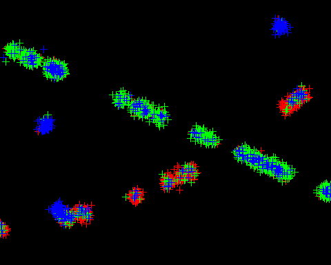

    Example loop view from the Pulse Activation Analysis plugin with no correction.

    Each cross hair represents an activation. Colours represent the channel: red (1); green (2); and blue (3).

.. _fig_pulse_activation_analysis_loop_subtraction_example:
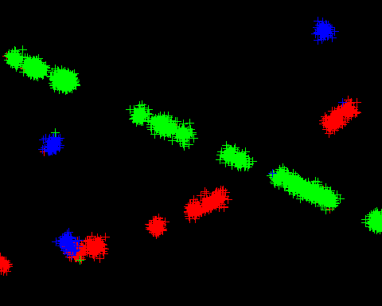

    Example loop view from the Pulse Activation Analysis plugin with subtraction correction.

    Each cross hair represents an activation. Colours represent the channel: red (1); green (2); and blue (3). Subtraction correction was performed by removing all activations with a correct assignment probability of below 50%.

.. index:: ! Fourier Image Resolution

Fourier Image Resolution
------------------------

Calculate the resolution of an image using Fourier Ring Correlation (FRC).

This plugin is based on the FIRE (Fourier Image REsolution) plugin produced as part of the paper by Niewenhuizen, *et al* (2013). Changes to the original functionality include:

* Additional options for computation of the FRC curves
* Improved determination of FRC line crossing points
* Speed optimisations
* Support for multi-threaded random repeats

Additional functionality for correction of spurious correlations has been added based on Matlab code kindly provided by Prof. Bernd Reiger (corresponding author of the FIRE paper).

Fourier Ring Correlation computes the correlation between the features of two images at a certain spatial frequency. A 2D image is transformed into the frequency domain using a Fourier transform. The frequency image represents the amplitude and phase of the original data at different frequencies. These can be visualised as a 2D image, the centre of the image represents the lowest frequencies moving to the highest frequencies at the edge of the image. Points taken from a ring drawn around the centre will represent all the amplitude and phases present at a single frequency. Two images can be compared at a given frequency by measuring the correlation of the data sampled from the same ring on both images. This is the Fourier Ring Correlation (FRC).

To compute the image resolution of a set of localisations requires the following steps:

*   Produce two super-resolution images using the localisation data

*   Transform the two images to the frequency domain

*   Compute the FRC between the two images at all the available frequencies

*   Plot the FRC against the frequency. This will gradually fall to zero as the frequency decreases (see :numref:`Figure %s <fig_frc_curve_example>`)

*   Smooth the raw FRC curve using robust local regression (LOESS)

*   Use the smoothed FRC curve to look-up the spatial frequency corresponding to a correlation threshold (cut-off limit)

The spatial frequency at the correlation limit is the Fourier Image Resolution (FIRE). This can be interpreted as stating that there is no meaningful similarity information at any frequency higher than the resolution, i.e. if the images were reconstructed using only frequencies at this level and above then they would be not be recognised as matching.

Input Data
~~~~~~~~~~

Note that the FRC analysis requires two input images; these are constructed from localisations as super-resolution images. This means that the FRC can be computed using a single input dataset split into two halves to compute the resolution of the data, or using two input datasets to compute the resolution of one dataset against the other. This may be useful if two different super-resolution datasets have been obtained for the same structure for example by using a two-channel experiment with different fluorophores.

In the classic case of a single input dataset the localisations must be split into halves. The plugin provides a framework to do this where all localisations are sorted by time frame. Consecutive localisations are then allocated to a block of set size. The resulting blocks can then be split alternating or randomly between the two output images. Using blocks of localisations sorted by time should reduce the number of occurrences when the same molecule that appears in consecutive frames is split into different images. This artificially increases the resolution as the same molecule is present in both images.

Note that if non-random splitting is performed then the output results will be the same when repeated. If data is split randomly then the output resolution will vary since the super-resolution images are different between repeats. Repeating the analysis multiple times with different splits is used to produce an average resolution and a confidence interval.

When two datasets are used then no splitting is required.

.. index:: Threshold methods

Threshold methods
~~~~~~~~~~~~~~~~~

The final resolution is dependent on the threshold used to assess when the correlation of the image at a given spatial frequency is not significant. Changing the threshold method will change the calculated resolution. The FRC plugin can compute the correlation threshold using the following methods: Fixed; n-Bit information content; or Sigma.

..
  No index

Fixed
^^^^^

Use the fixed value 1/7 = 0.142857. This is the threshold value preferred by Niewenhuizen, *et al* (2013) as it provides output that closely matches the apparent resolution of images under manual inspection.

..
  No index

n-Bit Information Content (Fourier-Space Signal-to-Noise-Ratio)
^^^^^^^^^^^^^^^^^^^^^^^^^^^^^^^^^^^^^^^^^^^^^^^^^^^^^^^^^^^^^^^

This method sets the threshold using a level expected for a given information content (Signal-to-Noise Ratio, SNR) in each pixel of the super-resolution image.

The threshold is computed at each frequency (:math:`T_i`) for the predefined Fourier-space signal-to-noise ratio (:math:`\mathit{SNR}_i`) from the number of data points (:math:`N_i`) used to compute the FRC with the following formula:

.. math::

    T_{i} &= \frac{\mathit{SNR}_{T}/2+2/\sqrt{(N_{i})}\cdot\sqrt{(\mathit{SNR}_{T}/2)}+1/\sqrt{(N_{i})}} {\mathit{SNR}_{T}/2+2/\sqrt{(N_{i})}\cdot\sqrt{r_{i}}+1} \\
          &= \frac{\mathit{SNR}_{T}/2+(2\sqrt{(\mathit{SNR}_{T}/2)}+1)/\sqrt{(N_{i})}}{1+\mathit{SNR}_{T}/2+2\sqrt{(\mathit{SNR}_{T}/2)}/\sqrt{(N_{i})}}

(see Heel & Schatz, (2005), equation 13). Note that the desired :math:`\mathit{SNR}_T` is divided by two since we need half the SNR from each of the half datasets (the two images). For a smoother curve the number of points (:math:`N_i`) is computed as :math:`2\pi r` and not the actual number of samples computed during the Fourier ring analysis.

The SNR threshold is set using the desired number of bits of information required per pixel using:

.. math::

    \mathit{n{\text -}bits}=\log _{2}(1+\mathit{SNR}_{T})

Note the use of the binary logarithm. Classically this can be done using *n-bits* = ½, 1 or 2 bits. For example for a ½ bit curve :math:`\mathit{SNR}_T=0.4142` and the formula reduces to:

.. math::

    T_{i}=\frac{0.2071+1.9102/\sqrt{N_{i}}}{1.2701+0.9102/\sqrt{N_{i}}}

..
  No index

Sigma
^^^^^

Compute the threshold at each frequency (:math:`T_i`) from the number of data points (:math:`N_i`) used to compute the FRC with the following formula:

.. math::

    T_{i}=\frac{\sigma }{\sqrt{N_{i}/2}}

with :math:`\sigma` the sigma-factor (see Heel & Schatz, (2005), equation 2). For example sigma can be 1, 2, 3, etc.

.. index:: Spurious Correlation Q Correction

Spurious Correlation (Q) Correction
~~~~~~~~~~~~~~~~~~~~~~~~~~~~~~~~~~~

When analysing a single dataset, if the same emitter is localised more than once then this can lead to correlations being observed at all spatial frequencies if localisations from the same emitter are split into each half-dataset (because a non-zero pixel will be present in the same position is both images). These spurious correlations can be corrected by subtracting a term from the numerator of the FRC and adding it to the denominator. The FRC at a given frequency *q* is given by the sum of the conjugate multiple of the Fourier transform oFf two sub-images divided by the product of the sums of the squared absolute values of each transformed sub-image:

.. math::

    \mathit{FRC}(q)=\frac{\sum _{\vec{q}\in C}\widehat {f}_{1}(\vec{q})\ast\widehat {f}_{2}(\vec{q})}{\sqrt{\sum _{\vec{q}\in C}|\widehat{f}_{1}(\vec{q})|^{2}}\sqrt{\sum _{\vec{q}\in C}|\widehat{f}_{2}(\vec{q})|^{2}}}

The sum is computed over all pixels at the specified spatial frequency :math:`q=|\vec{q}|` where C denotes the pixels of the perimeter of a circle of constant spatial frequency and *q* is valued as *0/L*, *1/L*, *2/L*, … with *L* the pixel size of the input images (*1/L* is the pixel size in Fourier space). The ring sum can be scaled to a ring mean by dividing by the number of samples in the circle (:math:`N_C`):

.. math::

    \mathit{FRC}(q)=\frac{\frac{1}{N_{C}}\sum _{\vec{q}\in C}\widehat{f}_{1}(\vec{q})\ast \widehat{f}_{2}(\vec{q})}{\frac{1}{N_{C}}\sqrt{\sum _{\vec{q}\in C}|\widehat{f}_{1}(\vec{q})|^{2}}\sqrt{\sum _{\vec{q}\in C}|\widehat{f}_{2}(\vec{q})|^{2}}}

The correction term is computed as:

.. math::

    \mathit{Corr}(q)=\frac{Q}{Q_{\mathit{norm}}}\cdot H(q)\mathit{sinc}(\pi\cdot q)^{2}

where :math:`Q` is the average number of activation cycles per emitter (i.e. repeat localisations),
:math:`Q_{\mathit{norm}}` is a normalisation using the mean pixel value in the input images prior to Fourier transform:

.. math::

    Q_{\mathit{norm}}=\frac{1}{\mathit{mean}_{1}}+\frac{1}{\mathit{mean}_{2}}

and :math:`H(q)` is the factor in the correlation averages related to the localisation uncertainties which is modelled as a Gaussian distribution with mean :math:`\sigma_m` and width :math:`\Delta\sigma` (in units of super-resolution pixels):

.. math::

    H(q)=\frac{1}{\sqrt{1+8\pi ^{2}\Delta \sigma ^{2}q^{2}}}\exp(-{\frac{4\pi ^{2}\sigma _{m}^{2}q^{2}}{1+8\pi ^{2}\Delta \sigma^{2}q^{2}}})

Note that the given equations have been updated from those provided in Niewenhuizen, *et al* (2013) to those used in the code. If *Q=0* then no correction is applied. A plugin for estimating *Q* (the average number of activation cycles per emitter) is provided (see :ref:`analysis_plugins:FIRE Q Estimation`).

The corrected FRC is thus:

.. math::

    \mathit{FRC}(q)=\frac{\frac{1}{N_{C}}\sum _{\vec{q}\in C}\widehat{f}_{1}(\vec{q})\ast \widehat{f}_{2}(\vec{q})-\mathit{Corr}(q)}{\frac{1}{N_{C}}\sqrt{\sum_{\vec{q}\in C}|\widehat {f}_{1}(\vec{q})|^{2}}\sqrt{\sum _{\vec{q}\in C}|\widehat {f}_{2}(\vec{q})|^{2}}+\mathit{Corr}(q)}

Data Selection
~~~~~~~~~~~~~~

The FRC plugin provides the following options
to select the localisation data
:

.. list-table::
   :widths: 20 80
   :header-rows: 1

   * - Parameters
     - Description

   * - Input
     - The results set to analyse.

   * - Input2
     - The optional second results set to analyse.

   * - Use ROI/
       Choose ROI
     - If any open images current have an area ROI then the option to choose an ROI is provided. This option is not shown when no ROIs are available.

       Use ROI is shown when only 1 ROI is available.

       Choose ROI is shown when multiple ROIs are available. A second dialog will be shown to select the image with the desired ROI.

If an ROI is selected then the ROI will be scaled from the source image to the bounds of the
input data and only localisations within the bounds selected. An efficient way to produce an appropriate ROI is to construct a super resolution image of the input dataset using the
``Results Manager``
plugin. An ROI can be drawn on the super resolution image and only that region will be used for the FIRE computation.

Parameters
~~~~~~~~~~

The FRC plugin provides options for each stage of the process:

*  Image construction
*  Fourier transform
*  FIRE analysis

There are also additional options for single dataset processing.

..
  No index

Image Construction
^^^^^^^^^^^^^^^^^^

A super resolution image is required for analysis. If the image is very large then Fourier transform will be slow and may fail due to lack of memory. Options are provided to scale the image automatically to a suitable size for Fourier transform. Localisations are rendered onto the image using bilinear weighting onto the 4 neighbour pixels surrounding the coordinates to reduce pixelation artefacts in the super-resolution image.

.. list-table::
   :widths: 20 80
   :header-rows: 1

   * - Parameters
     - Description

   * - Image scale
     - Specify the image enlargement scale to create the super-resolution image from the localisation data. ``Auto`` will create an image that fits the data into the ``Auto image size``.

   * - Auto image size
     - The size for images created with ``Auto`` scaling.

       Note that ``Auto`` is the preferred method since the images must be a power of 2 on the long edge for efficient Fourier transform and an optimal image will use all of the available pixels.

   * - Max per bin
     - Set above zero to limit the maximum number of localisations that are drawn in each super-resolution pixel.

       Note: This is set to 5 in Niewenhuizen, *et al* (2013) to limit the effect of bright spots from anomalous fluorescent molecules.

..
  No index

Fourier Options
^^^^^^^^^^^^^^^

.. list-table::
   :widths: 20 80
   :header-rows: 1

   * - Parameters
     - Description

   * - Fourier method
     - Set the method to compute the Fourier transform. Using the ``JTransforms`` library has marginal performance improvements. The default Fast Hartley Transform (FHT) will produce identical results.

   * - Sampling method
     - Choose the method to sample pixels on the Fourier ring.

       * ``Radial sum``: Bins all the pixels between radius n to n+1 (exclusive) into ring n.
       * ``Interpolated circle``: Draws a circle on the Fourier image and samples the perimeter at intervals by interpolating the pixels surrounding the perimeter coordinates.

   * - Sampling factor
     - Affects the number of samples taken using ``Interpolated circle`` mode.

       The FRC is calculated by sampling the circle at N points where N is equal to :math:`\pi r \times \mathit{Sampling\:factor}`. Increasing this value will slow down the algorithm but increase resolution of the FRC curve.

       Note that samples are taken in the interval :math:`[0 - \pi]` radians since the Fourier image is two-fold radially symmetric.

..
  No index

FIRE Options
^^^^^^^^^^^^

.. list-table::
   :widths: 20 80
   :header-rows: 1

   * - Parameters
     - Description

   * - Threshold method
     - The method for determining the correlation cut-off (see :numref:`{number}: {name} <analysis_plugins:Threshold methods>`).

   * - Show FRC curve
     - Display the FRC curve. The curve shows the raw data, the smoothed data and the correlation cut-off.

..
  No index

Single Dataset Processing
^^^^^^^^^^^^^^^^^^^^^^^^^

A single data must be split into two halves to construct the images for analysis. If this split is random then multiple repeats can be performed to provide a mean resolution with a confidence interval. Additionally spurious correlations can be corrected using a Q correction factor (see :numref:`{number}: {name} <analysis_plugins:Spurious correlation (Q) correction>`).

.. list-table::
   :widths: 20 80
   :header-rows: 1

   * - Parameters
     - Description

   * - Block size
     - The number of sequential localisations to assign to a block.

       Using blocks reduces correlation artefacts from the same molecule occurring in consecutive frames being split into the two images.

   * - Random Split
     - If true then the block data is split randomly into two halves. Otherwise the data is split by alternating blocks.

   * - Repeats
     - If using a ``Random Split`` then repeating the analysis will produce a different result. Use this option to perform multiple repeats to provide a mean resolution with a confidence interval.

       Repeats use multi-threaded processing and parallel processing of large images may fail due to available memory. This can be handled by reducing the image size or the number of parallel threads.

   * - Show FRC curve repeats
     - When using repeats only the smoothed curve is added to a combined FRC curve output.

       Select this option to draw an FRC curve plot with raw and smoothed data for each repeat.

   * - Show FRC time evolution
     - Sort the results by time and compute the FIRE number using 10 step increments up to the max time. This shows how the resolution has changed as the time increases (i.e. more data was collected).

       This option is computationally intensive and is not currently multi-threaded.

   * - Spurious correlation correction
     - Select this to perform spurious correlation correction.

   * - Q-value
     - The Q correction value. This is the average number of times a molecule is repeat localised. Zero means each molecule is localised only once and no correction is performed.

   * - Precision mean
     - The mean of the Gaussian distribution of the localisation precision.

   * - Precision sigma
     - The standard deviation (width) of the Gaussian distribution of the localisation precision.

Output
~~~~~~

The plugin will display progress of the computation on the ``ImageJ`` status bar. When the plugin has finished the FIRE number will be reported to the ``ImageJ`` log window:

.. code-block:: text

    Fit Spot Data : FIRE number = 31.98 nm (Fourier scale = 33.0)

If repeats were performed then the mean resolution is reported with a confidence interval:

.. code-block:: text

    Fit Spot Data : FIRE number = 32.95 +/- 0.4573 nm [95% CI, n=10] (Fourier scale = 33.0)

..
  No index

FRC Curve
^^^^^^^^^

The FRC curve data can be very noisy. The data is smoothed using a LOESS smoothing procedure and the crossing points with the correlation cut-off curve are computed. :numref:`Figure %s <fig_frc_curve_example>` shows an example of an FRC curve. The smoothed FRC line crosses the cut-off curve at a frequency of approximately 0.031 nm-1. The resolution is therefore approximately 32nm.

.. _fig_frc_curve_example:
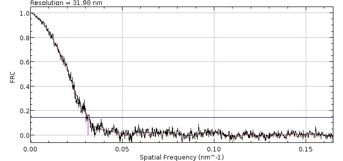

    Example FRC curve from the Fourier Image Resolution plugin.

    The raw FRC data are in black. Smoothed FRC data are in red. The resolution cut-off threshold is in blue at a fixed value of 1/7.

If multiple repeats are performed with randomly split data then a combined curve is produced with all the smoothed curves and the mean resolution (see :numref:`Figure %s <fig_frc_curve_example_combined>`).

.. _fig_frc_curve_example_combined:
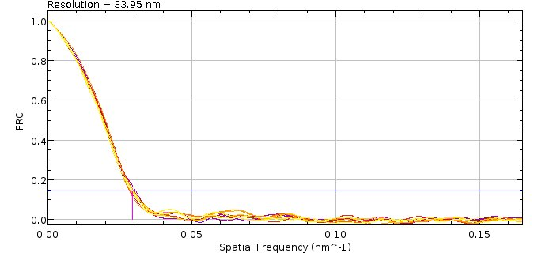

    Example combined FRC Curve from 10 repeats of Fourier Image Resolution analysis.

.. index:: ! FIRE Q Estimation

FIRE Q Estimation
-----------------

Estimate the spurious correction factor *Q* for use in Fourier Image Resolution (FIRE) analysis. *Q* is the average number of activation cycles per emitter (i.e. repeat localisations).

This plugin is based on the Matlab code kindly provided by Prof. Bernd Reiger (corresponding author of the FIRE paper [Niewenhuizen, *et al*, 2013]). The method described here is an update to the original method described in the online methods of the FIRE paper.

Fourier Ring Correlation (FRC) computes the correlation between the features of two images at a certain spatial frequency. This correlation is high at low spatial frequencies and progressively reduces. When the correlation falls below a set threshold there is no meaningful similarity information at any further frequency. The spatial frequency at the correlation limit is the Fourier Image Resolution (FIRE).

When analysing a single dataset, if the same emitter is localised more than once then this can lead to correlations being observed at all spatial frequencies if the localisations from the same emitter are split into each half-dataset. These spurious correlations can be corrected by subtracting a term from the numerator of the FRC and adding it to the denominator. The correction term is computed using a factor *Q* which is the average number of activation cycles per emitter (i.e. repeat localisations), and by assuming the localisations have an uncertainty (precision) that is distributed as a Gaussian with mean :math:`\sigma_m` and width :math:`\Delta\sigma`. This allows the correction to the correlation to be modelled as:

.. math::

    \mathit{Corr}(q)=\frac{Q}{Q_{\mathit{norm}}}\cdot H(q)\mathit{sinc}(\pi\cdot q)^{2}

where :math:`Q_{\mathit{norm}}` is a normalisation using the mean pixel value in the input images prior to
Fourier transform:

.. math::

    Q_{\mathit{norm}}=\frac{1}{\mathit{mean}_{1}}+\frac{1}{\mathit{mean}_{2}}

and *H(q)* is the factor in the correlation averages related to the localisation uncertainties:

.. math::

    H(q)=\frac{1}{\sqrt{1+8\pi ^{2}\Delta \sigma ^{2}q^{2}}}\exp(-{\frac{4\pi ^{2}\sigma _{m}^{2}q^{2}}{1+8\pi ^{2}\Delta \sigma^{2}q^{2}}})

Note that *H(q)* is typically computed assuming the theoretical distribution of localisation uncertainties. However it can be constructed using a sample of *N* points from the actual localisation uncertainties :math:`\sigma_i` if they are available:

.. math::

    H(q)=\frac{1}{N}\sum _{i=0}^{i<N}{\exp (-{4\pi ^{2}\sigma_{i}^{2}q^{2}})}

.. index:: Estimating Q

Estimating Q
~~~~~~~~~~~~

The true correlation term (due to underlying structure in the data) will decline towards zero at high spatial frequencies. This leaves the spurious correlation term as the main contributor to the FRC numerator at high spatial frequencies. A method for estimating the term involves fitting the model of the correction term to the FRC numerator using a range of spatial frequencies where there is no actual correlation.

There are three terms to estimate: :math:`Q`, :math:`\sigma_m` and :math:`\Delta\sigma`. If the uncertainty is not available in the dataset then it must be entered as fixed value and only *Q* will be estimated. If the localisation uncertainty is available for each localisation then it can be estimated using two methods. The first method fits a Gaussian to a histogram of the localisation uncertainty. Alternatively the *H(q)* term can be initially constructed using a random sample of the actual localisation uncertainty and the mean estimated from the initial quadratic fit (see below).

The FRC numerator at a given frequency *q* is given by the sum of the conjugate multiple of the Fourier transform of two sub-images:

.. math::

    \mathit{FRC\:numerator}(q)=\sum _{\vec{q}\in C}\widehat{f}_{1}(\vec{q})\ast \widehat {f}_{2}(\vec{q})

The sum is computed over all pixels at the specified spatial frequency :math:`q=|\vec{q}|` where C denotes the pixels of the perimeter of a circle of constant spatial frequency and *q* is valued as *0/L*, *1/L*, *2/L*, … with *L* the pixel size of the input images (*1/L* is the pixel size in Fourier space). This term is divided by the number of pixels in the Fourier circle to produce function *v(q)*:

.. math::

    v(q)=\frac{1}{2\pi \mathit{qL}}\sum _{\vec{q}\in C}\widehat{f}_{1}(\vec{q})\ast \widehat {f}_{2}(\vec{q})

Note that the term :math:`2\pi q L` is the circumference of the Fourier circle and is adjusted during computation to be the actual number of samples taken from the Fourier circle.

If the correlation is mainly composed of the spurious correlation then the following relation holds:

.. math::

    1=\frac{v(q)}{\frac{Q}{Q_{\mathit{norm}}}\cdot H(q)\mathit{sinc}(\pi\cdot q)^{2}}

*Q* can thus be estimated using:

.. math::

    Q=\frac{Q_{\mathit{norm}}\cdot v(q)}{H(q)\mathit{sinc}(\pi \cdot q)^{2}}

This term varies widely in magnitude with q and so the following function is used:

.. math::

    f(q)=\log (|\frac{Q_{\mathit{norm}}\cdot v(q)}{H(q)\mathit{sinc}(\pi \cdot q)^{2}}|)

This function is described below equation (7) of the Online Methods of Niewenhuizen, *et al* (2013). The function *f(q)* typically is a function that initially decreases, then levels off to a constant plateau value and finally increases again. The function can be well fit using a quadratic (:math:`f(q)=a+bq^2`) if the fit is performed over a suitable range of *q* where the plateau occurs.

To reduce noise the plugin allows smoothing using a median window before application of the absolute and logarithm functions or it can be smoothed afterwards using LOESS smoothing. The Y-intercept is used as an initial estimate of *Q*:

.. math::

    Q=\exp (a)

Note that *H(q)* is typically computed assuming the theoretical distribution of localisation uncertainties. However it can be constructed using a random sample of *N* points from the actual localisation uncertainties. In this case the parameter :math:`\sigma_m` can also be estimated from the fit using:

.. math::

    \sigma _{m}=\sqrt{(\frac{1}{N}\sum {\sigma _{i}^{2}}-b/4\pi ^{2})}

and the other parameter :math:`\Delta\sigma` set using the standard deviation of the localisation uncertainty values.

The initial estimate uses a quadratic fit of the function *f(q)*. This estimate is then refined by optimising the parameters so that *Corr(q)* most closely matches the observed *v(q)*. This is done by optimising the following cost function for all *q*:

.. math::

    \begin{gathered}\mathit{cost}(q)=1-\exp(-\mathit{diff}^{2}/\mathit{noise}^{2});\\\mathit{diff}=\frac{v(q)}{\mathit{Corr}(q)}-1\end{gathered}

with *noise* set to a defined level to scale the difference value appropriately. The cost function has a value between 0 and 1 for all observations; a low value is better. Note that *Corr(q)* is constructed using Q, :math:`\sigma_m` and :math:`\Delta\sigma` and this second optimisation can be done by fitting Q alone and fixing :math:`\sigma_m` and :math:`\Delta\sigma`, or fitting the 3 parameters together.

Parameters
~~~~~~~~~~

The FRC plugin provides options for each stage of the process:

*  Data selection
*  Image construction
*  Fourier transform
*  Estimation options

..
  No index

Data Selection
^^^^^^^^^^^^^^

These are the same as the ``FIRE`` plugin (see :numref:`{number}: {name} <analysis_plugins:Fourier Image Resolution>`) without the option for a second dataset. A subset of the data can be selected using an ROI selected from an open image.

..
  No index

Image Construction
^^^^^^^^^^^^^^^^^^

These are the same as the ``FIRE`` plugin for single datasets. Note that localisations are drawn using bilinear weighting onto the 4 neighbour pixels surrounding the coordinates to reduce pixelation artefacts in the super-resolution image.

.. list-table::
   :widths: 20 80
   :header-rows: 1

   * - Parameters
     - Description

   * - Image scale
     - Specify the image enlargement scale to create the super-resolution image from the localisation data. ``Auto`` will create an image that fits the data into the ``Auto image size``.

   * - Auto image size
     - The size for images created with ``Auto`` scaling.

       Note that ``Auto`` is the preferred method since the images must be a power of 2 on the long edge for efficient Fourier transform.

   * - Block size
     - The number of sequential localisations to assign to a block.

       Using blocks reduces correlation artefacts from the same molecule occurring in consecutive frames being split into the two images.

   * - Random Split
     - If true then the block data is split randomly into two halves. Otherwise the data is split by alternating blocks.

   * - Max per bin
     - Set above zero to limit the maximum number of localisations that are drawn in each super-resolution pixel.

       Note: This is set to 5 in Niewenhuizen, *et al* (2013) to limit the effect of bright spots from anomalous fluorescent molecules.

..
  No index

Fourier Options
^^^^^^^^^^^^^^^

These are the same as the ``FIRE`` plugin (see :numref:`{number}: {name} <analysis_plugins:Fourier Image Resolution>`).

..
  No index

Estimation Options
^^^^^^^^^^^^^^^^^^

.. list-table::
   :widths: 20 80
   :header-rows: 1

   * - Parameters
     - Description

   * - Threshold method
     - The method for determining the correlation cut-off (see :numref:`{number}: {name} <analysis_plugins:Threshold methods>`).

   * - Precision method
     - Specify the method to use to determine the parameters for the distribution of the localisation precision (assumed to be Gaussian).

       * ``Fixed``: Use a fixed value for the precision distribution mean and standard deviation.

       * ``Stored``: Use the precision value that is stored in the results, e.g. from loaded data. These are fit with a Gaussian to estimate :math:`\sigma_m` and :math:`\Delta\sigma`.

       * `Calculate``: Calculate the precision of each localisation using the formula of Mortensen. These are fit with a Gaussian to estimate :math:`\sigma_m` and :math:`\Delta\sigma`. This option requires that the localisations have a signal and width value and the results are calibrated with a gain and pixel size (in nm).

   * - Precision Mean
     - The mean of the localisation uncertainty (precision) for use in ``Fixed`` estimation (:math:`\sigma_m`).

   * - Precision Sigma
     - The standard deviation of the localisation uncertainty (precision) for use in ``Fixed`` estimation (:math:`\Delta\sigma`).

   * - Sample decay
     - Set this to true to sample the localisation precision values to generate *H(q)* for the initial Q-estimation. :math:`\sigma_m` is then also estimated from the initial fit.

       The default generates *H(q)* using :math:`\sigma_m` and :math:`\Delta\sigma` from the ``Fixed`` input or generated from fitting the precision histogram with a Gaussian.

   * - LOESS smoothing
     - Smooth the curve *f(q)* using LOESS smoothing. The default smooths the data using a median window before applying the absolute and logarithm functions.

   * - Fit precision
     - Set to **true** to optimise :math:`\sigma_m` and :math:`\Delta\sigma` when fitting *v(q)* to *Corr(q)*. The default only optimises the Q-value.

   * - MinQ
     - The minimum spatial frequency *q* value to use for fitting.

   * - MaxQ
     - The maximum spatial frequency *q* value to use for fitting.

Note: *q* is specified in terms of the Fourier image width so has a range from 0 to 0.5. Choose a range for *q* where the correlation has fallen off from the initial high value to approach 0, i.e. the range where the correlation is mainly due to spurious correlations between repeats of the same molecule.

Output
~~~~~~

The plugin will display progress of the computation on the ``ImageJ`` status bar. When the plugin has finished the results are presented graphically. A non-blocking dialog is used to allow the user to adjust the estimated values and the displayed results are dynamically updated.

..
  No index

Precision Histogram
^^^^^^^^^^^^^^^^^^^

The histogram of the localisation uncertainty (precision) is displayed with an overlay of the current mean and standard deviation (:numref:`Figure %s <fig_q_estimation_precision_histogram>`) . If no precision is available then only the overlay is shown.

.. _fig_q_estimation_precision_histogram:
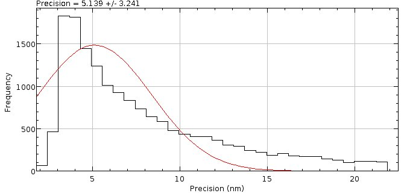

    FIRE Q estimation precision histogram plot

..
  No index

FRC Numerator Curve
^^^^^^^^^^^^^^^^^^^

The FRC numerator function, *v(q),* is plotted against the correction, *Corr(q)* (see :numref:`Figure %s <fig_q_estimation_frc_numerator_curve>`). The corrected numerator is also plotted to show the effect of correction.

Note that the purpose of the plugin is to maximise the fit between the numerator and the correction
within the selected fitting range of *q*. The range is shown using magenta vertical lines. Ideally the range should exclude the low frequencies where the numerator is significantly different from the correction due to actual correlation within the dataset.

.. _fig_q_estimation_frc_numerator_curve:
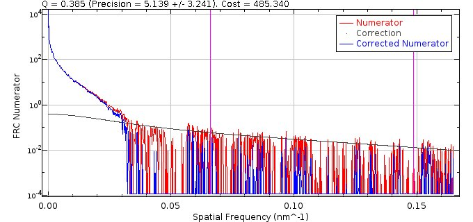

    FIRE Q estimation FRC numerator plot

..
  No index

FRC Numerator/Correction Ratio
^^^^^^^^^^^^^^^^^^^^^^^^^^^^^^

The cost function aims to minimise:

.. math::

    \sum {g(\frac{v(q_{i})}{\mathit{Corr}(q_{i})}-1)}

over a selected range of *q*, where *g(x)* is a mapping function with value 0 when x is zero and a maximum value of 1. Thus the ideal ratio :math:`v(q) / \mathit{Corr}(q)` is 1. The Numerator/Correction Ratio plot (see :numref:`Figure %s <fig_q_estimation_frc_numerator_corr_ratio_curve>`) shows :math:`v(q) / \mathit{Corr}(q)`. The range is set to 0-2 and a line drawn at 1 for the ideal value. The fit range for *q* is shown using magenta vertical lines. This plot is often very noisy indicating that optimising the fit is non-trivial and sub-optimal results may occur (i.e. estimation has failed).

.. _fig_q_estimation_frc_numerator_corr_ratio_curve:
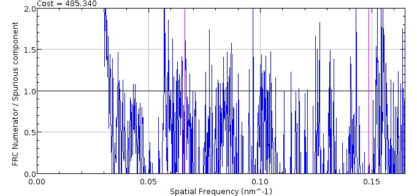

    FIRE Q estimation FRC numerator/correction ratio plot

..
  No index

FRC Curve
^^^^^^^^^

The FRC curve (:numref:`Figure %s <fig_q_estimation_frc_curve>`) is similar to that shown by the FIRE plugin (see section :numref:`%s <analysis_plugins:Fourier Image Resolution>`). The raw data of the correlation is shown in black and the smoothed line in red. The resolution is computed using the crossing point with the threshold curve (blue). If the Q-value is above zero then the original data is shown with 50% opacity. The resolution before and after Q correction are shown in the label.

.. _fig_q_estimation_frc_curve:
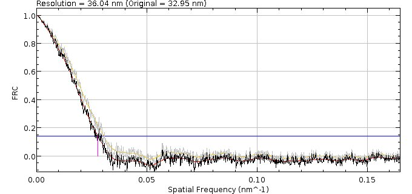

    FIRE Q estimation FRC curve plot

.. index:: Interactive Q-Estimation

Interactive Q-Estimation
^^^^^^^^^^^^^^^^^^^^^^^^

Once the plots have been displayed the plugin shows a dialog (:numref:`Figure %s <fig_q_estimation_interactive_dialog>`) containing the initial estimates for *Q*, :math:`\sigma_m` and :math:`\Delta\sigma` and the value of the cost function. This is a non-blocking dialog and so allows the user to move other ``ImageJ`` windows to optimise the layout.

.. _fig_q_estimation_interactive_dialog:
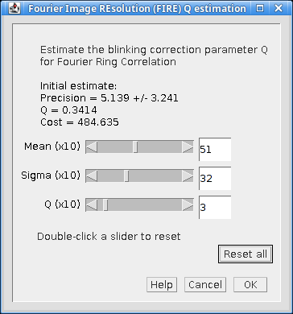

    FIRE Q estimation interactive dialog

The user can adjust any of the current parameter values and see the effects on the plots dynamically. The cost function value is updated and shown so that the effects of manual estimation can be compared to the initial auto-estimation. Adjustments can be made to the slider or by editing the text field value. Note that the estimate values are magnified 10-fold to allow finer adjustment of the estimates. This is due to the limited functionality of sliders within ``ImageJ`` dialogs.

The ``Reset all`` checkbox can be used to set the values back to the initial estimates, for example if adjustments have significantly changed the cost function. Alternatively a double-click on a single slider will reset only that slider.

Clicking the ``OK`` button will close the dialog and the current estimates are saved to memory. These values will be used in the FIRE plugin for the fields for spurious correlation correction.

Clicking the ``Cancel`` button will close the dialog without saving the current estimates.

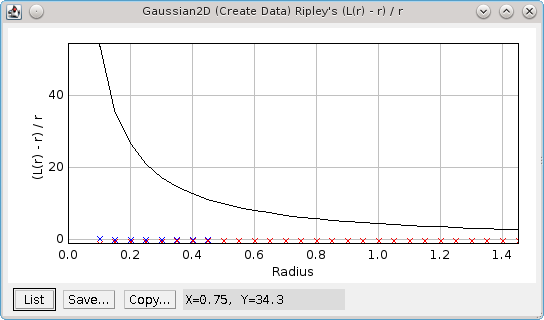
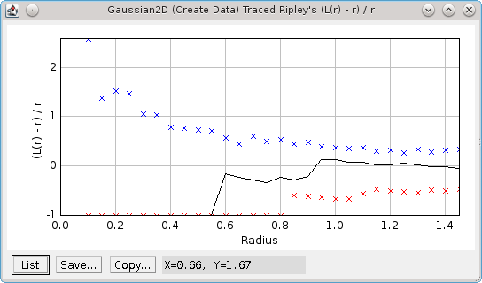

