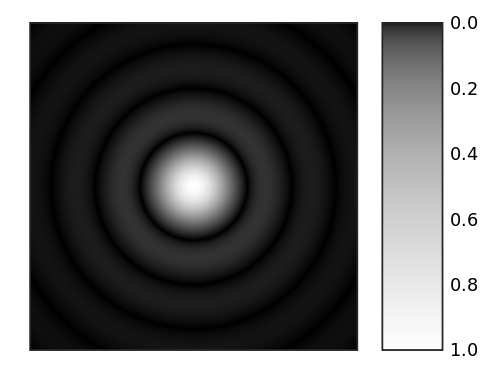
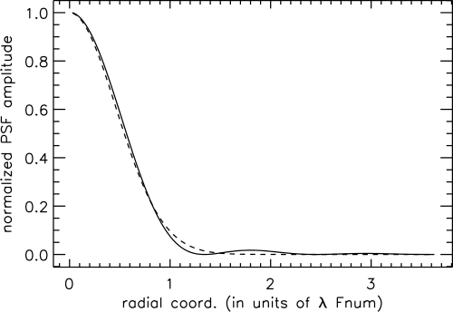

.. index:: ! Background

Background
==========

.. index:: ! Diffraction Limit of Light Microscopy

Diffraction Limit of Light Microscopy
-------------------------------------

Light microscopy uses lens optics to focus light from a sample onto an imaging plane. However even with a perfect set of optics it is not possible to bring all the light into perfect focus. This is because light is diffracted when passing through an opening.

The diffraction pattern resulting from a uniformly-illuminated circular aperture has a bright region in the centre, known as the Airy disk which together with the series of concentric bright rings around is called the Airy pattern (:numref:`Figure %s <fig_airy_pattern>`).

.. _fig_airy_pattern:

    Computer-generated image of an Airy pattern.

    Image taken from Wikimedia Commons.

The inability to perfectly focus light sets a limit on the resolution that can be achieved using conventional light microscopy. The Rayleigh criterion for barely resolving two objects that are point sources of light is that the centre of the Airy disk for the first object occurs at the first minimum of the Airy disk of the second. This separation can be calculated from the following formula:

.. math::

    \sin (\theta )=1.22\frac{\lambda }{d}

where
:math:`\theta` is the angle at which the first minimum occurs,
:math:`\lambda` is the wavelength of the light and
:math:`d` is the diameter of the aperture.
Therefore the resolution that can be achieved is a function of the wavelength of the light and the size of the aperture used in the optical system.

.. index:: ! Approximation using a Gaussian

Approximation using a Gaussian
------------------------------

The Airy pattern falls rather slowly to zero with increasing distance from the centre such that the outer rings contain a significant portion of the integrated intensity. As a result the spot size is undefined (i.e. infinite) when using the entire pattern.

An alternative measure of the spot size is to ignore the relatively small outer rings of the Airy pattern and to approximate the central lobe with a Gaussian profile (:numref:`Figure %s <fig_airy_gauss>`).

.. _fig_airy_gauss:

    Approximation of the Airy pattern (solid line) using a Gaussian (dashed line).

    Image taken from Wikimedia Commons.

The Gaussian profile closely approximates the profile of the Airy pattern in the plane of focus. This allows the location of a point source of light to be found by 2D Gaussian fitting. However this approximation breaks down if the focal plane is above or below the imaging plane. In this instance the pattern still exists as a series of rings but the relative strength of central spot is reduced. Consequently the Gaussian fit will be poor, or not possible, and the localisation precision will be reduced.

.. index:: ! Localisation Fitting Method

Localisation Fitting Method
---------------------------

The single-molecule localisation method used in the GDSC Single Molecule Light Microscopy (SMLM) plugins is based on 2D Gaussian fitting.

For each frame candidate spots are identified and then fit using a local region surrounding each candidate [Wolter *et al* , 2010]. An estimate of the PSF width is required which can be obtained from the wavelength and optical system used for acquisition, or estimated from the image.

Candidates are identified using a smoothing filter on the image followed by non-maximal suppression. Smoothing is done using a single filter such or a difference filter where the second smoothed image is subtracted from the first. Various filters are available such as mean, median or Gaussian. Local maxima are identified within a configured search region which is at least 3x3 pixels.

Peak candidates are processed in descending height order and a 2D Gaussian is fit to the peak using a region around the candidate of typically 2 to 5 times the estimated Gaussian standard deviation. Fitting is performed using a either non-linear least squares estimation (LSE) or maximum likelihood estimation (MLE) until convergence or the maximum iterations is exceeded. Fitted spots are filtered using signal-to-noise, width, precision and coordinate shift criteria. Processing is stopped when a consecutive number of fits fail.

To account for high density samples neighbour peaks within the block region are included in the fit if they are within a fraction of the height of the candidate peak, typically 30%. If multiple peak fitting fails then single peak fitting is attempted. Additionally the candidate can be fit using a two peak model if the fit residuals show an asymmetric distribution around the centre. The doublet fit is selected if it improves the adjusted coefficient of determination for LSE or the Bayesian Information Criterion (BIC) for MLE. To prevent over-counting when fitting multiple peaks a check is made for duplicates using a distance criterion before adding to the results. The method is applicable to all types of localisation microscopy data and results are suitable input for filtering methods using structural models.

Image frames are processed independently allowing multi-threaded operation. Results can be output to memory, file or a rendered image using various methods.

