.. index:: ! Calibration Plugins

Calibration Plugins
===================

The following plugins contain functionality to estimate the width of the point spread function (PSF) for an imaging set-up and analyse the noise and gain of the imaging camera.

The plugins are described in the following sections using the order presented on the
``Plugins > GDSC SMLM > Calibration``
menu.

.. index:: ! PSF Calculator

PSF Calculator
--------------

A simple plugin that estimates your Gaussian approximation to the PSF using the microscope imaging parameters and the wavelength of light (:numref:`Figure %s <fig_psf_calculator_dialog>`).

.. _fig_psf_calculator_dialog:
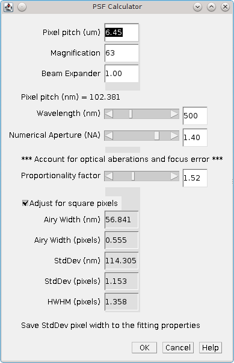

    PSF Calculator dialog

The calculator uses the following formula:

.. math::

    \mathit{Airy\:Width}=\frac{\lambda}{2\pi\mathit{NA}}

:math:`\mathit{Airy\:Width}` is the width of the Airy pattern,
:math:`\lambda` is the wavelength (in nm), and
:math:`\mathit{NA}` is the Numerical Aperture.

The Airy profile can be approximated by a Gaussian profile. The equivalent Gaussian profile is created using a standard deviation of 1.323 times the Airy width. The PSF Calculator will show a plot of the Airy profile (blue) and the corresponding Gaussian profile (red; :numref:`Figure %s <fig_psf_calculator_profile_plot>`). This is interactively updated when the parameters for the calculator are changed:

.. _fig_psf_calculator_profile_plot:
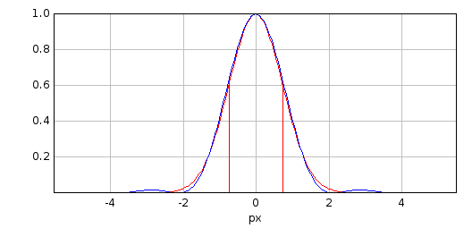

    PSF Calculator PSF profile plot

Note that the Gaussian is a good approximation until the tails of the Airy pattern. The Airy pattern contains waves of decreasing power out to infinity which are not modelled by the Gaussian.

The calculator allows for additional adjustments to be made to the calculated Gaussian standard deviation. To account for optical aberrations in the microscope the width is allowed to be wider by a set proportionality factor. The Gaussian standard deviation (:math:`s`) can then be adjusted (:math:`s_a`) for an accurate representation on square pixels (of width :math:`a`) using the following formula:

.. math::

    s_{a}=\sqrt{s^{2}+a^{2}/12}

The Gaussian Half-Width at Half-Maxima (HWHM) is calculated from the standard deviation by multiplying by :math:`\sqrt{2\ast \ln (2)}=1.177`.

The following table describes the parameters of the plugin. The calculated properties are updated dynamically.

.. list-table::
   :widths: 20 80
   :header-rows: 1

   * - Parameter
     - Description

   * - Pixel pitch (|micro|\ m)
     - The camera pixel size.

   * - Magnification
     - The objective magnification.

   * - Beam Expander
     - Any addition magnification.

   * - Pixel pitch (nm)
     - The calculated image pixel size.

   * - Wavelength (nm)
     - The wavelength of light used for the image (lambda).

   * - Numerical Aperture
     - The objective numerical aperture (NA).

   * - Proportionality Factor
     - The proportionality factor (set to 1 to match the Gaussian to the Airy profile).

   * - Adjust for square pixels
     - Perform square pixel adjustment (set to **false** to match the Gaussian to the Airy profile).

   * - Airy Width (nm)
     - The calculated PSF Airy width in nanometres.

   * - Airy Width (pixels)
     - The calculated PSF Airy width in pixels.

   * - StdDev (nm)
     - The calculated PSF Gaussian standard deviation in nanometres.

   * - StdDev (pixels)
     - The calculated PSF Gaussian standard deviation in pixels.

   * - HWHM (pixels)
     - The calculated PSF Gaussian HWHM in pixels.

Note that the first three fields are only used to calculate the image pixel pitch. If this is already known then it can be entered into the Pixel pitch (|micro|\ m) field (note the use of micrometres and not nanometres) and the ``Magnification`` and ``Beam expander`` can be set to 1. The ``Pixel pitch`` in nanometres is then used to convert the calculated widths in nanometers to pixel dimensions.

Clicking ``OK`` will save the PSF standard deviation in pixels to the global properties. This will be used in the ``Peak Fit`` plugin.

Please contact us if you have feedback on the calculated width from the plugin verses your measured PSF using quantum dots (or other single-point light sources) on calibration images.

.. index:: ! PSF Estimator

PSF Estimator
-------------

A plugin that estimates the PSF using a test image. The fit configuration is the same as in the ``Fit Configuration`` plugin with extra parameters provided to control the estimation. The ``PSF Estimator`` dialog is show in :numref:`Figure %s <fig_psf_estimator_dialog>`. Note that a second dialog will collect parameters specific for the selected ``Fit solver``.

.. _fig_psf_estimator_dialog:
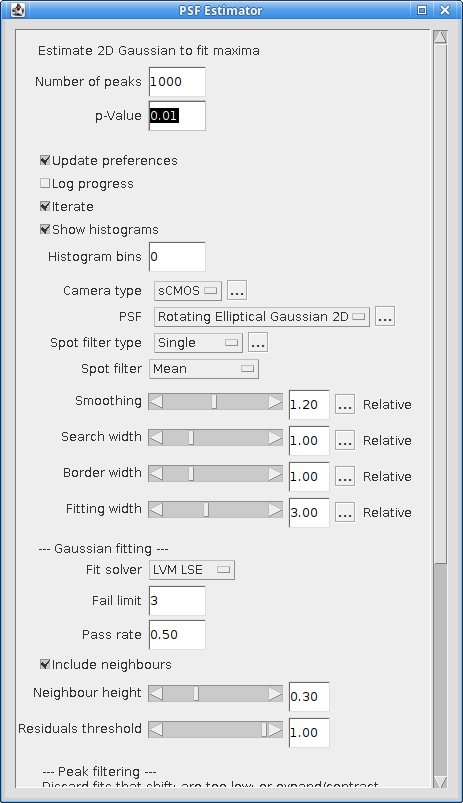

    PSF Estimator dialog

The estimator uses the starting configuration to fit N peaks taken from randomly selected frames in the image stack. The averages of the fitted parameters are then used as the start parameters to perform fitting again. This iterates until the Gaussian parameters do not significantly change. The parameters controlling the estimation are described below.

.. list-table::
   :widths: 20 80
   :header-rows: 1

   * - Parameter
     - Description.

   * - Number of Peaks
     - The number of fitted peaks to use to estimate the Gaussian parameters. The parameters are estimated by averaging across all the fitted peaks.

   * - p-Value
     - The p-value to use for significance testing, i.e. are the parameters the same using a Student's T-test at the given significance.

   * - Updates preferences
     - If selected the plugin will update the global configuration with the calculated PSF values.

   * - Log progress
     - Log progress of the estimator to the ``ImageJ`` log window.

   * - Iterate
     - When the PSF parameters have converged and a ``Free`` fitting option was chosen a test is done to determine if the angle or Y-width are significant. If not significant the estimator will ignore the insignificant parameter and restart using a simpler PSF. The order of iterations is:

       ``Free`` > ``Free Circular`` > ``Circular``

       Note these statistics often don't work so unless you expect astigmatism you can choose to start with a ``Circular`` Gaussian and just find the estimated widths.

   * - Show histograms
     - Show a histogram of the estimated parameters from the final fitting run. A histogram is shown for each parameter. These can be used to verify the mean of the parameter distribution is a suitable estimate for the parameter.

   * - Histogram bins
     - The number of bins to use on the histograms. Set to zero to auto-scale the bin width.

Note that the estimator may not find any peaks if the fitting parameters are badly configured. The estimator can be reset to defaults by holding down the ``Control`` key when running the plugin. The default values are shown below:

.. list-table::
   :widths: 40 40
   :header-rows: 1

   * - Parameter
     - Value

   * - Initial StdDev0,1
     - 1

   * - Initial Angle
     - 0

   * - Spot filter type
     - Single

   * - Spot filter
     - Mean

   * - Smoothing
     - 1.3

   * - Search width
     - 1

   * - Border
     - 1

   * - Fitting width
     - 3

   * - Fit Solver
     - Least Squares Estimator

   * - *Fit criteria*
     - *Least-squared error*

   * - *Significant digits*
     - *5*

   * - *Coord delta*
     - *0.0001*

   * - *Lambda*
     - *10*

   * - *Max iterations*
     - *20*

   * - Fit function
     - Circular

   * - Fail limit
     - 3

   * - Include neighbours
     - True

   * - Neighbour height
     - 0.3

   * - Residuals threshold
     - 1

   * - Shift factor
     - 1

   * - Signal strength
     - 0

   * - Min photons
     - 30

   * - Width factor
     - 2

.. index:: ! Mean-Variance Test

Mean-Variance Test
------------------

The ``Mean-Variance Test`` plugin can be used to calculate the gain and read noise of the microscope Charged Coupled Device (CCD) camera. The plugin requires a set of calibration images. A single-image mode is available but will provide less information on the camera.

Input Images
~~~~~~~~~~~~

When run the plugin will present a folder selection dialog. The folder should contain a set of calibration images. All the images should be taken of the same view with the camera in the same gain mode.

At least one image should be taken with no exposure time. This is the image the camera records when no light has been registered on the sensor and is called the bias image.

The remaining images should be a representative series of different exposures. The purpose is to analyse how the image noise varies with exposure time. In order for the analysis to be valid no images should saturate the camera bit-depth. E.g. for a 12-bit camera all images should have pixel values below :math:`2^{12}-1 = 4095`.

All the images in the folder are opened and processed by the plugin. Each image must contain at least 2 frames. If the filename contains a valid integer delimited by a space or a period character (``.``) then this will be taken as the exposure time. Otherwise an arbitrary exposure time is used, either zero for the first image (alphabetically sorted) or 9999 for the rest.

Analysis
~~~~~~~~

If all the images are valid (contain at least 2 frames) then the plugin will perform the mean-variance test. The average value of the bias images is used as the bias. Each image is then analysed in turn. The mean of each frame is computed. Then a pairwise difference image (i.e. one frame subtracted from the other) is computed for all-vs-all frames. The variance of the difference image is recorded and used to approximate the camera gain:

.. math::

    \mathit{gain}=\frac{\mathit{variance}}{\mathit{mean}-\mathit{bias}}

This is recorded in a summary table. A graph is then produced of the mean verses the variance. This data is fitted with a straight line. The gradient of the line is the camera gain. The read noise of the camera is computed as:

.. math::

    \mathit{read\:noise}=\frac{\sqrt{\mathit{bias\:variance}}}{\mathit{gain}}

If the bias has multiple difference images then the average bias variance is used to calculate the read noise.

Output
~~~~~~

The plugin produces a summary table of the analysis for each pair of frames. The table shows the following data:

.. list-table::
   :widths: 20 80
   :header-rows: 1

   * - Column
     - Description

   * - Image
     - The source image.

   * - Exposure
     - The image exposure. This is the first integer number delimited by a space or period in the image title or, if no number can be found in the image title, zero for the first image and 9999 for the others.

   * - Slice1
     - The first frame (slice) used from the image.

   * - Slice2
     - The second frame (slice) used from the image.

   * - Mean1
     - The mean of slice 1.

   * - Mean2
     - The mean of slice 2.

   * - Mean
     - The mean of both slices.

   * - Variance
     - The variance of the difference image.

   * - Gain
     - The gain estimate:

       :math:`\mathit{gain}=\frac{\mathit{variance}}{\mathit{mean}-\mathit{bias}}`.

The plugin will produce a plot of the mean-variance data as show in :numref:`Figure %s <fig_mean_variance_plot>`. The plot will show the best fit line in red. If the data points with the highest mean lie well under the line it is possible that these images had saturated pixel values and should be removed from the input data set.

.. _fig_mean_variance_plot:
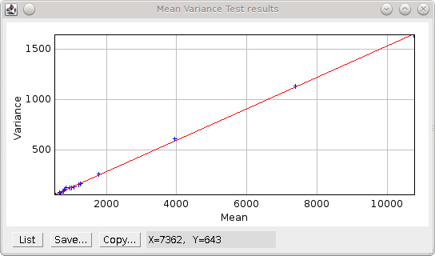

    Mean-variance plot produced by the Mean-Variance Test plugin.

    The best fit line is shown in red.

The plugin reports the final calculated gain and read noise to the ``ImageJ`` log, e.g.

.. code-block:: text

    Mean Variance Test
    Directory = /images/CameraCalibration/CameraGain-2-EmGain-0/
    Bias = 515.4 +/- 7.4 (ADU)
    Variance = -21.78 + 0.1557 * mean
    Read Noise = 47.53 (e-)
    Gain = 1 / 6.422 (ADU/e-)

The parameters for the best fit line are shown as ``Variance = a + b * mean``. The parameter *b* is the gain. The read noise is shown in electrons. The units for the gain are Analogue-to-Digital Unit (ADU) per electron.

Note that the gain can be expressed as electrons per ADU and so the output shows the gain using 1 over the reciprocal of the fit parameter to allow comparison with manufacturer gain values. E.g. In the example above 1 / 6.422 = 1 / (1 / 0.1557) and the gain would be 6.422 e-/ADU.

Single Image Mode
~~~~~~~~~~~~~~~~~

The plugin can be run using a single image. Single image mode cannot compute the camera bias or read noise and the gain values are not as accurate as the full test using multiple images.

Hold the ``Shift`` key down when running the plugin and the analysis will be performed on the currently active image. The image must have more than one slice to allow difference images to be computed and should be a white light image with a constant uniform exposure across the image field, i.e. no significant image features.

In single-image mode the plugin will compute the pairwise comparison of consecutive frames in the image and for each pair compute the approximate camera gain:

.. math::

    \mathit{gain}=\frac{\mathit{variance}}{\mathit{mean}-\mathit{bias}}

The bias must be provided since there is no input bias image; the plugin will ask the user to input the camera bias. The results will be displayed in a table as described above.

The plugin provides a plot of gain verses slice and a histogram of the values. These can be used to determine if the gain is constant throughout the image and so is a good estimate.

.. index:: ! Mean-Variance Test EM-CCD

Mean-Variance Test (EM-CCD)
---------------------------

This plugin is similar to the ``Mean-Variance Test`` plugin but is used on images taken using an Electron Multiplying (EM) CCD camera. An EM-CCD camera uses a multiplication device to increase the number of electrons that are extracted from the imaging sensor before the electrons are counted. The average number of electrons output from the multiplying device for each input electron is a constant known as the EM-gain. The plugin will compute the EM-gain of the camera using a set of calibration images. A single-image mode is available but will provide less information on the camera.

The analysis can only be performed if the gain for the camera in non-EM mode is already known. If the ``Mean-Variance Test`` plugin has been used to calculate the gain in the same ``ImageJ`` session then the value will be stored in memory. If the camera gain is not known then using a value of 1 will allow the plugin to run and the output EM-gain will be the total gain of the system.

.. index:: Multiple Input Images

Multiple Input Images
~~~~~~~~~~~~~~~~~~~~~

Input images requirements are the same as the ``Mean-Variance Test`` plugin: images should be taken of the same view using different exposure times. Each image must have at least two frames. All images must be taken with the camera in the same gain mode and EM-gain mode. A bias image (zero exposure) must be provided.

If all the images are valid the plugin will show a dialog asking for the camera gain (:numref:`Figure %s <fig_mean_var_test_em_gain_dialog>`). This will remember the last entered value or the value computed by the ``Mean-Variance Test`` plugin.

.. _fig_mean_var_test_em_gain_dialog:
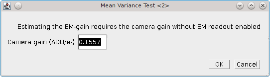

    EM-gain dialog of the Mean-Variance Test (EM-CCD) plugin

Analysis
~~~~~~~~

The images are analysed as per the
``Mean-Variance Test``
plugin. However the analysis of the difference image is used to approximate the camera EM-gain:

.. math::

    \mathit{EM\:gain}=\frac{\mathit{variance}}{(\mathit{mean}-\mathit{bias})\:(2\times\mathit{gain})}

This is recorded in a summary table. A graph is then produced of the mean verses the variance. This data is fitted with a straight line. The gradient of the line is the EM-gain multiplied by twice the camera gain therefore the EM-gain can be computed as:

.. math::

    \mathit{EM\:gain}=\frac{\mathit{gradient}}{2\times\mathit{gain}}

Output
~~~~~~

The plugin summary table and mean-variance plot are the same as the ``Mean-Variance Test`` plugin. The final calculated EM-gain and total gain is reported to the ``ImageJ`` log, e.g.

.. code-block:: text

    Mean Variance Test
    Directory = /images/CameraCalibration/CameraGain-2-EmGain-250/
    Bias = 512.3 +/- 13.15 (ADU)
    Variance = -36550.0 + 79.66 * mean
    Read Noise = 0.3301 (e-)
    Gain = 1 / 6.422 (ADU/e-)
    EM-Gain = 255.8
    Total Gain = 39.83 (ADU/e-)

The total gain is the EM-gain multiplied by the camera gain. As can be seen from comparison of the analysis results with and without the EM-mode the use of EM amplification dramatically reduces the camera read noise and greatly enhances the pixel values (ADUs) produced per electron. This allows images of weak photon signals to be made, for example in single-molecule light microscopy.

The total gain can be used to convert the ADUs into photons if the camera quantum efficiency (QE) is known. The QE states how many photons are converted into an electron charge when they hit the camera sensor; the QE units are electrons per photon (e-/photon). This can be provided by the camera manufacturer and is dependent on the wavelength of light. The photon signal is therefore:

.. math::

    \mathit{Photons}=\frac{\mathit{ADUs}}{\mathit{total\:gain}\times\mathit{QE}}

The total gain multiplied by the QE is known as the system gain. The system gain is used as an input parameter in the ``Peak Fit`` plugin to convert the pixel values into photons.

Single Image Mode
~~~~~~~~~~~~~~~~~

The plugin can be run using a single image. Single image mode cannot compute the camera bias or read noise and the gain values are not as accurate as the full test using multiple images.

Hold the ``Shift`` key down when running the plugin and the analysis will be performed on the currently active image. The image must have more than one slice to allow difference images to be computed and should be a white light image with a constant uniform exposure across the image field, i.e. no significant image features.

In single-image mode the plugin will compute the pairwise comparison of consecutive frames in the image and for each pair compute the approximate camera gain:

.. math::

    \mathit{EM\:gain}=\frac{\mathit{variance}}{(\mathit{mean}-\mathit{bias})\:(2\times\mathit{gain})}

The bias must be provided since there is no input bias image; the plugin will ask the user to input the camera bias and camera gain. Using a camera gain of 1 will calculate the total gain of the system. The results will be displayed in a table as described above.

The plugin provides a plot of gain verses slice and a histogram of the values. These can be used to determine if the gain is constant throughout the image and so is a good estimate.

.. index:: ! EM-Gain Analysis

EM-Gain Analysis
----------------

Analyses a white light image from an EM-CCD camera, construct a histogram of pixel intensity and fit the histogram to obtain the bias, EM-gain, read noise and photons per pixel (see Ulbrich & Isacoff (2007) Supplementary Information).

.. index:: EM-CCD Probability Model

EM-CCD Probability Model
~~~~~~~~~~~~~~~~~~~~~~~~

The ``EM-Gain Analysis`` plugin uses an analysis that assumes that the EM-CCD camera has three main sources of noise:

#.  Photon shot noise occurs when light is emitted from an object. Although the average rate of light from an object is constant for a given time, e.g. 30 photons/second, each photon will arrive at a different time and the gaps between them will vary. This results in a different number of photons counted each second. This noise follows a Poisson distribution with a mean of the average photon emission rate.

#.  The photons are converted to electrons on the camera sensor. These electrons are then multiplied in the Electron Multiplication (EM) gain register. This multiplication increases the number of electrons to be read and reduces the relative size of any error introduced when reading the value. However the EM-gain process is random and introduces noise that is modelled using a Gamma distribution with a shape parameter equal to the number of input electrons and the scale parameter equal to the gain.

#.  Read noise occurs when the values stored on the camera chip for each pixel are read and converted to numbers. This noise follows a Gaussian distribution with mean zero and variable standard deviation.

The probability of observing a pixel value given an input number of photons is therefore a convolution of a Poisson, Gamma and Gaussian distribution. The convolution of the Poisson and Gamma distribution can be expressed as:

.. math::

    G_{p,m}(c)=\operatorname{e}^{-p}\delta(c)+\sqrt{\frac{p}{\mathit{cm}}}\operatorname{e}^{-{\frac{c}{m}}-p}\mathit{BesselI}_{1}(2\sqrt{\frac{\mathit{cp}}{m}})

where
:math:`p` is the average number of photons,
:math:`m` is the EM-gain multiplication factor,
:math:`c` is the observed pixel count,
:math:`\delta(c)` is the Dirac delta function (1 when c=0, 0 otherwise),
:math:`\mathit{BesselI}_1` is the modified Bessel function of the 1\ :sup:`st` kind, and
:math:`G_{p,m}(c)` is the probability of observing the pixel count c.

The output of this is subsequently convolved numerically (no algebraic solution exists) with a Gaussian function with standard deviation equal to the camera read noise and mean equal to the camera bias.

.. index:: Camera Bias

Camera Bias
^^^^^^^^^^^

Note that in order to observe the read noise of the camera a bias (offset) is added to the camera pixel values. This allows a pixel to record negative read noise on very low counts which would not be possible using unsigned integer values as no value below zero is allowed. The bias for the camera is set by the manufacturer and is set at a value far greater than the expected read noise of the system, e.g. 100, 400, 500 or 1000 for a read noise of 3-30 ADUs (Analogue to Digital Units, or pixel values).

Input Image
~~~~~~~~~~~

The plugin requires a white light image where each pixel has been exposed to the same number of photons. This can be produced by imaging without a sample and instead using white paper in front of the objective so that images are evenly illuminated. The light can be adjusted by varying the exposure time and different calibration performed by using different camera gain settings.

The input image is used to construct a histogram of the pixel values that are observed for the given camera settings and background number of photons. This is then fit using the Poisson-Gamma-Gaussian probability mass function.

Ideally the input image should provide a minimum of 1,000,000 pixels, for example 16 frames of a 256x256 pixel image. This level of pixels is required to construct an even histogram that adequately samples the probability mass function. The pixels should have the same mean, i.e. a constant mean across the field of view. If it is not possible to achieve a constant mean across the field, for example in the instance of a gradient in the illumination, then the plugin will support rectangular ROI crops of the image. However the number of pixels should reach the minimum limit to construct a good histogram.

If the minimum pixel limit is not reached the plugin will log a warning but will continue to analyse the image.

Parameters
~~~~~~~~~~

The following parameters can be configured:

.. list-table::
   :widths: 20 80
   :header-rows: 1

   * - Parameter
     - Description

   * - Bias estimate
     - The initial estimate for the camera bias. The bias may be obtained from the camera manufacturer's specifications. A guess can be made by selecting the darkest part of the image, taking the mean and rounding (usually down) to the nearest hundred.

   * - Gain estimate
     - The initial estimate for the total gain of the camera. The total gain may be obtained from the camera manufacturer's specifications. A good guess would be 25-50.

   * - Noise estimate
     - The initial estimate for the camera read noise. The read noise in electrons may be obtained from the camera manufacturer's specifications. This will have to be converted to ADUs by applying the camera gain (not the total gain). A good guess would be 3-10.

   * - Show approximation
     - Show on the final output plot a function that approximates the convolution of the Poisson-Gamma distribution with a Gaussian distribution.

       This approximate PMF is used to model the EM-Gain when performing Maximum Likelihood Estimation fitting within the ``Peak Fit`` plugin.

Note that the plugin will remember the last values that were fitted for the bias, gain and noise estimates. Thus an initial guess can be used, the image analysed and then the plugin repeated with updates to the estimates if appropriate to refine the fit.

.. index:: Simulation Mode

Simulation Mode
~~~~~~~~~~~~~~~

Instead of using an input image to create a histogram of pixel values, it is possible to simulate pixel values by generating a Poisson-Gamma-Gaussian random variable. To run the plugin in simulation mode hold down the ``Shift`` key when running the plugin. The following additional parameters will be available:

.. list-table::
   :widths: 20 80
   :header-rows: 1

   * - Parameter
     - Description

   * - Simulate
     - Check this box to simulate the histogram of pixel values.

   * - Bias
     - The camera bias for the simulation.

   * - Gain
     - The total gain for the simulation.

   * - Noise
     - The read noise for the simulation.

   * - Photons
     - The average number of photons per pixel for the simulation.

   * - Samples
     - The number of samples for the simulation.

   * - Sample PDF
     - Check this to generate the Probability Mass Function (PMF) using the provided parameters. Then sample randomly from within this PMF.

       The default is to generate a random Poisson sample using the average photon number, then use this to generate a Gamma sample from the photon count and then generate a Gaussian sample from the amplified photon count.

Simulation mode can be used to see if the fitting process is working given the expected parameters for bias, gain, noise and photons.

Results
~~~~~~~

The plugin will create a histogram of the pixel values and attempt to fit it using the Poisson-Gamma-Gaussian PMF. The estimated and fitted parameters are written to the ``ImageJ`` log.

The histogram of pixel values, fitted PMF and the fit parameters are shown on a plot (:numref:`Figure %s <fig_em_gain_analysis_histogram_fit>`).

.. _fig_em_gain_analysis_histogram_fit:
.. figure:: images/em_gain_analysis_histogram_fit.png
    :align: center
    :figwidth: 80%

    EM-Gain Analysis histogram of pixel values and the computed fit

The values for the gain, bias and noise should be constant for different background photon levels. This can be evaluated using different input calibration images. The parameters can be used within the ``Peak Fit`` plugin to perform Maximum Likelihood Estimation modelling the camera noise of the EM-CCD camera.

.. index:: ! EM-Gain PMF

EM-Gain PMF
-----------

Displays a plot of the probability mass function (PMF) of the expected value of a pixel on an EM-CCD camera given an average number of photons. The form of the PMF is a convolution of a Poisson, Gamma and Gaussian distribution. See section :numref:`{number}: {name} <calibration_plugins:EM-CCD Probability Model>` for more details.

A fast approximation for the PMF is computed for comparison with the real PMF. This is created by analytically calculating the PMF of a Poisson-Gamma distribution and then approximating a convolution with a Gaussian distribution. The method for this approximation is taken from the supplementary Python software provided by Mortensen, *et al* (2010). They used this approximation when fitting the images of single fluorophores in TIRF (Total Internal Reflection Fluorescence) images taken with an EM-CCD camera. A second plot showing the difference between the real PMF and the approximation is displayed. This allows investigation of any situation where the approximation is not appropriate for modelling the PMF. It is rare for the approximation to differ by more than 1%.

The plugin has the following parameters:

.. list-table::
   :widths: 20 80
   :header-rows: 1

   * - Parameter
     - Description

   * - Gain
     - The total gain for EM-CCD camera.

   * - Noise
     - The camera read noise.

   * - Photons
     - The average number of photons per pixel for the simulation.

   * - Show approximation
     - Show on the PMF plot the approximation function.

       Note: This approximate PMF is used to model the EM-Gain when performing Maximum Likelihood Estimation fitting within the ``Peak Fit`` plugin.

   * - Remove head
     - Set a limit on the initial cumulative probability to remove from the plot. This allows removing the start of the curve where the convolution of the Poisson-Gamma distribution with the Gaussian is incomplete.

   * - Remove tail
     - Set a limit on the final cumulative probability to remove from the plot. This allows removing the tail of the curve where the convolution of the Poisson-Gamma distribution with the Gaussian is incomplete. It also allows removing the long tail which can take up a large amount of the plot width.

   * - Relative delta
     - Check this to show the difference between the actual PMF and the approximate PMF as a relative score. The default is absolute.

Examples of the PMF are shown in :numref:`Table %s <table_em_gain_pmf>`. The PMF is skewed for low photons with a spike at c=0 blurred by the Gaussian read noise. Increasing photon counts return a shape more characteristic of a Poisson distribution. For this reason it is possible to use a simple Poisson model for the camera noise when performing Maximum Likelihood Estimation, i.e. ignoring the effect of EM-gain and read noise, if the number of photons within the localisation is large. This is an option available within the
``Peak Fit``
plugin and allows much faster fitting since the Poisson PMF (a) can be evaluated much faster than the Poisson-Gamma-Gaussian PMF; and (b) has an analytical derivative allowing gradient based fitting methods.

.. _table_em_gain_pmf:
.. list-table:: Example EM gain probability mass function (PMF) plots
    :align: center

    * - |em_gain_pmf_1_png|
    * - |em_gain_pmf_2_png|
    * - |em_gain_pmf_3_png|
    * - The magenta line on the plot shows the position of the average number of photons after the gain has been applied.

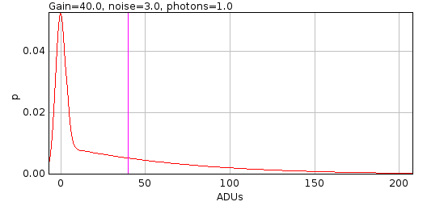
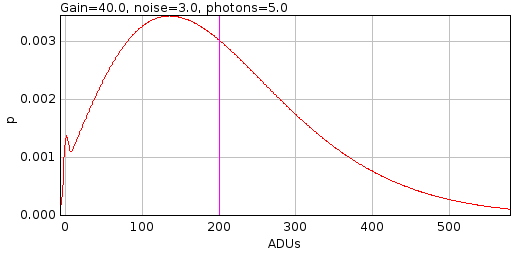
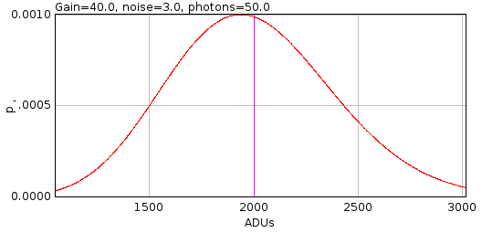

.. index:: ! sCMOS Analysis

sCMOS Analysis
--------------

Analyse the per pixel offset, variance and gain from a sCMOS camera. This plugin is based on the paper by Huang `et al` (2013).

A sCMOS camera has read-out circuits for each pixel in the camera chip. Contrast this with a CCD based camera which has a single readout circuit for every pixel. To construct a probability model of the pixel output requires the variance and the amplification (gain) of the pixel. The model can be used for maximum likelihood estimation (MLE) based fitting of camera output. To apply MLE fitting of point spread functions to super-resolution data requires a per-pixel camera model. The ``sCMOS Analysis`` plugin allows a per-pixel model to be constructed using the protocol described by Huang `et al` (2013).

The first step is to take 60,000 frames of zero exposure from the sCMOS camera. These are used to compute the bias (offset from zero) and read-noise (variance) of each pixel. The bias is the mean pixel value and the variance is computed per-pixel. Note that a fixed value is added to the pixel output by the camera so that the noise can be correctly analysed using the unsigned output data. If no offset was added then any noise below zero could not be recorded.

The gain can be computed using 20,000 frames of increasing exposure from the sCMOS camera. Gain is assumed to be constant. Thus a linear fit of the exposure against the output on a per-pixel basis will output the gain as the slope of the best fit line. The specified numbers of frames for analysis are the numbers used by Huang `et al`.

The gain estimate is obtained using:

.. math::

    g_i = (B_i B_i^T)^{-1} B_i A_i^T

where:

.. math::

    A_i &= \{ (v_i^1 - \mathit{var}_i), \ldots, (v_i^k - \mathit{var}_i), \ldots, (v_i^K - \mathit{var}_i) \} \\
    B_i &= \{ (\overline{D_i^1} - o_i), \ldots, (\overline{D_i^k} - o_i), \ldots, (\overline{D_i^K} - o_i) \}

and :math:`i` is pixel index, :math:`v_i^k` is the variance at exposure level :math:`k`, :math:`\overline{D_i^k}` is the mean at exposure level :math:`k`, :math:`o_i` is the offset, :math:`var_i` is the variance at zero exposure, and :math:`K` is the number of exposure levels.

When the ``sCMOS Analysis`` plugin is run it will ask for a directory. This should contain sub-directories with the images from the sCMOS camera. Each directory should have a number suffix that represents the exposure time. The bias and variance will be computed using the directory with the suffix zero. The numbers of the other directories are arbitrary as the exposure value is not required to compute the gain. Note that the images can be simulated to allow the plugin to be tested (see :numref:`%s <calibration_plugins:sCMOS Camera Simulation>`).

Parameters
~~~~~~~~~~

The analysis requires the following parameters:

.. list-table::
   :widths: 20 80
   :header-rows: 1

   * - Parameter
     - Description

   * - nThreads
     - The number of threads to use for the analysis.

   * - Rolling algorithm
     - Use a rolling algorithm to compute the variance (sum of square difference from the mean).

       If **false** then the sum of squared values is computed and used to compute the variance as:

       :math:`\mathit{variance} = \left( \sum{x_i^2} - \frac{(\sum{x_i})^2}{n} \right) / (n-1)`

       This algorithm is only suitable if the sum of the squared values will not overflow a 64-bit signed integer. For 16-bit unsigned data the maximum squared value is :math:`2^32` and the overflow will occur if using more than :math:`2^31` image frames. In most cases this option should be set to **false**.

   * - Re-use processed data
     - If **true** the plugin will check for a processed data file for each directory of images. This is a tif image with the mean and variance of each pixel in the image series. This data is written by the plugin during processing.

       If the processed data exists then the plugin will use it rather than perform the analysis again. For example this can be used to repeat analysis of a camera after adding more directories with additional exposure data; or it can be used to show the output plots of a previously analysed camera.

Analysis
~~~~~~~~

When the plugin runs it will analyse each directory of images in turn. The mean and variance of each pixel is recorded to a tif image named ``perPixel<directory>.tif``. These can be reloaded by the plugin for fast analysis of precomputed data using the ``Re-use processed data`` option. For the zero exposure image the mean and standard deviation statistics of the computed offset and and variance data is shown in the ``ImageJ`` log::

    photon000 Offset = 99.97 +/- 10.04. Variance = 57.04 +/- 59.31

For the non-zero exposure images the mean and standard deviation statistics of the raw data is shown. The known offset values for each pixel are subtracted from the mean values for each pixel to compute the signal and the mean and standard deviation of the signal is shown in the ``ImageJ`` log::

    photon025 Mean = 155.0 +/- 11.36. Signal = 55.0 +/- 5.55 ADU

When all the images have been processed the gain is computed for each pixel. The mean and standard deviation of the gain is shown in the ``ImageJ`` log::

    Gain Mean = 2.153 +/- 0.4506

The plugin will then ask for a filename to save the per-pixel model. This is saved into the specified directory as a 3 frame stack of 32-bit float data representing the offset, variance and gain for each pixel. The slices are appropriately labelled. This model can be loaded by the ``Camera Model Manager`` plugin (see :numref:`%s <calibration_plugins:Camera Model Manager>`) for use in fitting of localisation data. It is recommended to set the model directory for all output models to the same directory and appropriately name the model after the camera.

The ``sCMOS Analysis`` plugin will show summary histograms of the computed pixel offset, variance and gain. These histograms are equivalent to those shown in Huang `et al` (2013) supplementary figure 1.

If the data was created using a simulation the plugin will load the simulation model from the file ``perPixelSimulation.tif``. Comparisons of the computed and known values of the offset, variance and gain are computed. A scatter plot is produced of the simulated against the measured values. The error for each pixel is computed as the measured value minus the simulated value and displayed in a histogram. The following analysis is performed:

* A Pearson correlation is computed.
* A Komolgorov-Smirnov test is performed to test that the distributions are the same.
* A paired T-Test compares two related samples to assess whether their population means differ. This test is only valid if the distribution of the error is normal; this test is only performed on the gain.
* A Wilcoxon Signed Rank test compares two related samples to assess whether their population mean ranks differ. This test is performed as an alternative to the paired T-Test when the distribution of the error is not normal.

All computations are recorded to the ``ImageJ`` log.

Note that the statistical tests are a guide. Rejection of the null hypothesis does not indicate that the computed values for the per-pixel model are invalid. It shows the measured values can be distinguished statistically from the simulation. This can occur with large population sizes (i.e. number of pixels) even when the differences are small.

In the following example using 20,000 frames of 64x64 pixels with photons 50, 100, 200, 400 and 800 the analysis passes the tests::

    Comparison to simulation: Offset=100.0; Variance=57.9; Gain=2.2 +/- 0.2 (64x64px)
    Error Offset = 0.002947 +/- 0.2119 : R=0.9998 : Kolmogorov–Smirnov p=0.3273 accept : Wilcoxon Signed Rank p=0.5777 accept
    Error Variance = -0.02123 +/- 3.281 : R=0.9984 : Kolmogorov–Smirnov p=1.0 accept : Wilcoxon Signed Rank p=0.2128 accept
    Error Gain = -0.001652 +/- 0.07027 : R=0.9422 : Kolmogorov–Smirnov p=0.3845 accept : Paired T-Test p=0.1324 accept

The same example using an image of 512x512 (a population size increase of 64-fold) the analysis rejects the tests::

    Comparison to simulation: Offset=100.0; Variance=57.9; Gain=2.2 +/- 0.2 (512x512px)
    Error Offset = 3.954E-4 +/- 0.211 : R=0.9998 : Kolmogorov–Smirnov p=0.0 reject : Wilcoxon Signed Rank p=0.0 reject
    Error Variance = 0.04352 +/- 3.2 : R=0.9985 : Kolmogorov–Smirnov p=0.9056 accept : Wilcoxon Signed Rank p=0.0 reject
    Error Gain = -0.001682 +/- 0.06968 : R=0.9441 : Kolmogorov–Smirnov p=0.0 reject : Paired T-Test p=4.337E-35 reject

.. index:: sCMOS Camera Simulation

sCMOS Camera Simulation
~~~~~~~~~~~~~~~~~~~~~~~

The ``sCMOS Analysis`` plugin requires a large amount of data from a sCMOS camera. This data can be simulated allowing the plugin to be tested.

The simulation can be run by holding the ``Shift`` key down when running the plugin. Note that the ``Shift`` must be pressed when the main ``ImageJ`` window is the active. When run in simulation mode the plugin will create image data in a specified output directory. The plugin will prompt for the output directory.

Each pixel is assigned a random offset, variance and gain. The offset is sampled from a Poisson distribution; the variance is sampled from an exponential distribution; and the gain is sampled from a Gaussian distribution. These distributions approximate the raw data shown in Huang `et al` (2013) supplementary figure 1. The defaults for the simulation are configured to approximately match that figure.

The simulation requires the following parameters:

.. list-table::
   :widths: 20 80
   :header-rows: 1

   * - Parameter
     - Description

   * - nThreads
     - The number of threads to use for the simulation.

   * - Offset
     - The mean of the Poisson distribution used to create the pixel offset.

   * - Variance
     - The mean of the exponential distribution used to create the pixel variance.

   * - Gain
     - The mean of the Gaussian distribution used to create the pixel gain.

   * - Gain SD
     - The standard deviation of the Gaussian distribution used to create the pixel gain.

   * - Size
     - The size of the output image (width and height).

   * - Frames
     - The number of frames for the output image.

       This will be tripled for the bias output image (i.e. where photons = 0).

   * - Photons
     - The number of photons to simulate.

       Pixel output for the simulation should be in the range of a 16-bit unsigned integer. Photons should be above zero and ``photons x gain`` should be below the maximum for 16-bit unsigned integer (65535). Due to the randomness of the simulation pixel values may still be clipped to 65535. It is recommended to keep ``photons x gain`` far below this level.

       The zero photon level is added to this list if it is absent.

The simulation will record the per-pixel model to a file named ``perPixelSimulation.tif`` in the output directory. This is a 3 frame stack of 32-bit float data representing the offset, variance and gain for each pixel. The slices are appropriately labelled.

Simulated images are created using the specified ``Frames``  for output photon level; each level will be written to the directory named ``photonsN`` where ``N`` is the photons. Images are written as a series of tif stacks of 10 frames. The data for a pixel is computed using a random Poisson sample of the number of photons multiplied by the gain and added to a random Gaussian sample using a mean of the pixel offset and variance of the pixel variance:

.. math::

    D_i^k = \mathit{Pois}(k) \times g_i + \mathcal{N}(o_i, \mathit{var}_i)

When the simulated images have been created the ``sCMOS Analysis`` plugin continues to run as normal to compute a per-pixel model. The simulated images will be used to perform the camera analysis.

.. index:: ! Camera Model Analysis

Camera Model Analysis
---------------------

Model the on-chip amplification from an EM-CCD camera, CCD or sCMOS camera and compares the data to a model of the camera amplification process. This plugin simulates converting a photon into a measured count as performed by a microscope camera. The simulated data is then fit using a camera noise model. The difference between the data and the model indicates how well the model represents the data; this has implications for fitting localisation data using maximum likelihood estimation (MLE).

The camera noise model can be selected from those that are available for use in fitting or from more robust models that are computationally expensive. An ideal model should fit the data over a range of low to high photons that are the expected photon levels of the localisation image data.

Each camera simulation is performed using only two parameters: gain  :math:`g` and read noise :math:`\sigma^2`. The simulation for a CCD or sCMOS camera will perform sampling of the specified number of photons :math:`x` using a Poisson distribution to produce photo-electrons. This is multiplied by the gain (to simulate linear amplification) and combined with a Gaussian sample of the read noise of the camera pixel. The result is rounded to an integer count. This is the Poisson-Gaussian (PG) model:

.. math::

    PG(x|g,\sigma^2) = \lfloor \mathcal{N}(P(x) \times g, \sigma^2) \rceil

The simulation for an EM-CCD camera adds an additional sample from a gamma distribution to simulate amplification of the photo-electrons in the electron multiplication (EM) gain register. The shape of the distribution is the number of photo-electrons; the scale of the gamma distribution is the total gain of the EM-CCD camera. This is the Poisson-Gamma-Gaussian (PGG) model:

.. math::

    PGG(x|g,\sigma^2) = \lfloor \mathcal{N}( \text{Gamma}(P(x), g), \sigma^2) \rceil

The simulation requires sampling from multiple distributions. To increase the total number of samples the plugin will generate a given number of Poisson samples. For the EM-CCD simulation each Poisson sample is used to generate a number of gamma samples. For the CCD-simulation the amplification has no noise so no over-sampling is done. In either case amplification generates a real-valued sample from a integer valued photo-electron count. Each amplified sample is combined with a configured number of noise samples. The final value is rounded and a histogram of counts generated. For reference a full convolution of the model probability mass/density functions (PMF/PDF) is performed and added to the histogram. The PG model is a convolution of the discrete Poisson PMF scaled by the gain and the continuous Gaussian PDF. The PGG model is a convolution of the Poisson-Gamma PDF and the Gaussian PDF. The Poisson-Gamma PDF can be expressed using a single analytical expression as per [Ulbrich & Isacoff, 2007] SI equation 3.

The cumulative distribution function (CDF) of the simulated data is easily computed by summing the simulation PMF. This is compared to the CDF of the selected camera model function. Since the camera model function is a continuous PDF the CDF must be computed. This is done using integration of the PDF over the range of each histogram bin. The two CDFs are plotted and the maximum and mean distance between the distributions is computed. A Kolmogorov Smirnov test provides a p-value for rejecting the null hypothesis that the two distributions can be considered equal.

The ``Camera Model Analysis`` plugin supports a preview mode. The parameters of the simulation and the chosen camera model can be updated and the results inspected in real-time. This allows fast comparison of models across different levels of photons. The following parameters can be specified:

.. list-table::
   :widths: 20 80
   :header-rows: 1

   * - Parameter
     - Description

   * - Photons
     - The number of photons to simulate.

   * - Mode
     - The camera simulation mode. The gain and read-noise of the camera is specified using the ``...`` button.

       For an EM-CCD camera the number of EM amplification samples per photo-electron sample can also be specified.

   * - Seed
     - The seed for the simulation. This option is shown if the ``Shift`` key is held down when running the plugin. By default the same seed is used for simulations to ensure the settings can be reverted to a previous configuration and the output plots are generated as previously.

   * - Samples
     - The number of Poisson samples.

   * - Noise samples
     - The number of Gaussian read-noise samples per amplified photo-electron sample.

   * - Round down
     - If **true** the simulation will round-down the continuous valued result from the Gaussian sample to create the simulated count. The default is normal rounding which generates data that can be more closely modelled by the available camera model functions.

       Note that the simulation creates continuous valued data. This is an approximation of the discrete process occurring in a camera which outputs integer counts for input photons.

   * - Model
     - The camera model function used to model the simulated data. See :numref:`{number}: {name} <calibration_plugins:Camera Noise Models>`.

   * - Full integration
     - If **true** the integration of the camera model function PDF to CDF uses Simpson integration. Otherwise a fast flap-top integration is used.

   * - Preview
     - Enable dynamic result generation.

.. index:: Camera Noise Models

Camera Noise Models
~~~~~~~~~~~~~~~~~~~

The simulation is configured using gain :math:`g` and read noise :math:`\sigma^2`. The gain can be set to 1 and read noise to 0 to effectively disable them. The simulation is valid but many models may not be valid and exceptions will be logged to the ``ImageJ`` log window. Some models may require that the gain is above 1. Models that use a read noise may require that the read noise is above 0. In this case a read noise of 0.001 (or lower) can be used when the read noise must be strictly positive.

The camera model functions have been written to generate a continuous probability density function (PDF) or a discrete probability mass function (PMF) for observed camera count value :math:`x` and the number of photons :math:`x/g`.

There are many variants of the Poisson-Gamma-Gaussian model function using different convolutions with a Gaussian. These are provided for evaluation purposes. Note that the Poisson-Gamma PMF is a Dirac delta function at x=0. At low expected number of photons the delta function contains the majority of the probability and special handling of the convolution yields improved results.

The following table lists the camera model functions, their intended purpose and notes on the implementation.

.. list-table::
   :widths: 20 10 70
   :header-rows: 1

   * - Model
     - Camera
     - Description

   * - Poisson PMF
     - CCD/sCMOS
     - Uses a discrete Poisson PMF. Gain is handled by mapping the input value x to the PMF. If gain is above 1 this effectively stretches out the underlying Poisson PMF so that each input x maps to either 0 or 1 value from the PMF. If gain is below 1 this compresses the underlying Poisson PMF so that each input x maps to 1 or more values from the PMF where multiple values are summed.

   * - Poisson (Discrete)
     - CCD/sCMOS
     - Converts the input count to integer photons by rounding down and computes the Poisson PMF :math:`P(x) = \frac{{e^{ - \lambda } \lambda ^{\lfloor x/g \rfloor} }}{{\lfloor x/g \rfloor !}}`. The probability is rescaled so that it sums to 1 over the domain.

   * - Poisson (Continuous)
     - CCD/sCMOS
     - Converts the input count to photons and computes the Poisson PMF :math:`P(x) = \frac{{e^{ - \lambda } \lambda ^{x/g} }}{{{x/g}!}}`. The gamma function can be used to provide a factorial for non-integer values. The probability is rescaled so that it sums to 1 over the domain.

   * - Poisson+Gaussian PDF integration
     - CCD/sCMOS
     - Convolves the Poisson PMF with a Gaussian PDF.

       This is not a good model when the read noise is small as convolution of the discrete Poisson PMF with single points of a Gaussian PDF leads to summation errors in the output probability. This is corrected using the ``Full integration`` option. Note that ``Full integration`` is not actually a numerically complete integration and the model may be a poor fit when the read noise is small.

   * - Poisson+Gaussian PMF integration
     - CCD/sCMOS
     - Convolves the Poisson PMF with a Gaussian PMF. The Gaussian PMF is generated using an integration of the PDF over integer intervals, i.e. x +/- 0.5 for all x required in the convolution.

       This is the most accurate camera model function.

   * - Poisson+Gaussian approximation
     - CCD/sCMOS
     - Uses the saddle-point approximation of the Poisson-Gaussian convolution from [Snyder et al, 1995].

       This model is used in the ``Peak Fit`` plugin for the ``MLE`` fit solver when not an EM-CCD camera.

   * - Poisson+Poisson
     - CCD/sCMOS
     - Models the Gaussian read noise as a Poisson distribution. The combination of two Poisson distributions is a Poisson distribution. This model is a good approximation of a Poisson-Gaussian function when the number of photons is high. The model suitability for low signal data can be investigated by setting the read-noise of the microscope camera and using typical per-pixel photon counts.

       This model is used in the ``Peak Fit`` plugin for the ``LVM MLE`` and ``Fast MLE`` fit solver.

   * - Poisson+Gamma PMF
     - EM-CCD
     - Computes the Poisson-Gamma PMF. This model function neglects modelling the read noise which is significant when the number of photons approaches zero.

   * - Poisson+Gamma+Gaussian approximation
     - EM-CCD
     - Computes the Poisson-Gamma-Gaussian PDF. The convolution with the Gaussian is approximated using a partial convolution with a Gaussian at low photon counts where the dirac function is significant. This method is provided as Python source code within the supplementary information of the paper Mortensen, et al (2010) Nature Methods 7, 377-383.

       This model is used in the ``Peak Fit`` plugin for the ``MLE`` fit solver when an EM-CCD camera.

   * - Poisson+Gamma+Gaussian PDF integration
     - EM-CCD
     - Computes the Poisson-Gamma PMF and numerically convolves with a Gaussian PDF. Note: This is not suitable for read noise below 1 and the computation switches to using a Gaussian PMF for the convolution.

   * - Poisson+Gamma+Gaussian PMF integration
     - EM-CCD
     - Computes the Poisson-Gamma PMF and numerically convolves with a Gaussian PMF. The Gaussian PMF is generated using an integration of the PDF over integer intervals, i.e. x +/- 0.5 for all x required in the convolution.

   * - Poisson+Gamma+Gaussian Simpson's integration
     - EM-CCD
     - Computes the Poisson-Gamma PMF and convolves with a Gaussian PDF. The integral over the effective range of the Gaussian kernel is computed with Simpson integration.

   * - Poisson+Gamma+Gaussian Legendre-Gauss integration
     - EM-CCD
     - Computes the Poisson-Gamma PMF and convolves with a Gaussian PDF. The integral over the effective range of the Gaussian kernel is computed with Legendre-Gauss integration.

       This is the most accurate camera model function.

   * - Poisson+Gamma*Gaussian convolution
     - EM-CCD
     - Computes the Poisson-Gamma PMF and numerically convolves with a Gaussian PDF.

       Note that this method is a raw convolution of the PMF and PDF. It contains no special boundary handling of the Poisson-Gamma PMF around x=0 which is a Dirac delta function.

       This is not a good model when the read noise is small as convolution of the discrete Poisson-Gamma PMF with single points of a Gaussian PDF leads to summation errors in the output probability. This is corrected using the ``Full integration`` option. Note that ``Full integration`` is not actually a numerically complete integration and the model may be a poor fit when the read noise is small.

Results
~~~~~~~

The ``Camera Model Analysis`` plugin produces two output plots. The histogram plot shows the raw simulation histogram and the curve of the expected probability mass function. The example shown in :numref:`Figure %s <fig_camera_model_analysis_histogram>` demonstrates the contribution of the Dirac delta function at count=0 to the PMF is significant at low photons.

.. _fig_camera_model_analysis_histogram:
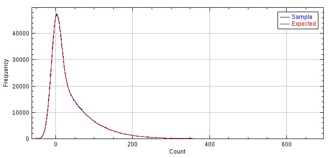

    Camera Model Analysis histogram plot.

    The histogram is a simulation of 1 photon captured by an EM-CCD camera with gain 40 and read noise 13.

The cumulative density function (CDF) plot shows the CDF of the simulation histogram against the CDF of the camera model function. The example shown in :numref:`Figure %s <fig_camera_model_analysis_cdf>` demonstrates the closeness of the ``Poisson+Gamma+Gaussian approximation`` to a simulated PMF at low photons.

.. _fig_camera_model_analysis_cdf:
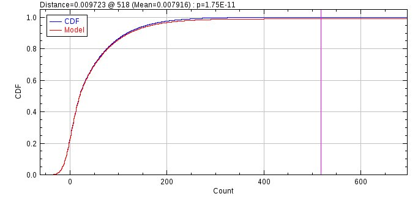

    Camera Model Analysis cumulative density function plot.

    The CDF is a simulation of 1 photon captured by an EM-CCD camera with gain 40 and read noise 13. The model is the ``Poisson+Gamma+Gaussian approximation`` as used in ``Peak Fit``. The magenta line shows the count for the maximum distance between the two CDF curves. The p-value is the significance of the  Kolmogorov Smirnov test for this distance.

.. index:: ! Camera Model Fisher Information Analysis

Camera Model Fisher Information Analysis
----------------------------------------

Model the Fisher information from an EM-CCD camera, CCD or sCMOS camera. This plugin is based on the paper by [Chao *et al*, 2013].

The Fisher information is the amount of information an observable random variable :math:`X` carries about an unknown parameter :math:`\theta` of a distribution that models :math:`X`.

.. math::

  I = \mathbb{E} \left[ \left(\frac{\delta}{\delta \theta} \ln f(X; \theta) \, \middle| \, \theta \right)^2 \right]

In this case the observable :math:`X` is the count from the microscope camera and the parameter :math:`\theta` is the number of photons. Thus this is the Fisher information of the camera count distribution created when light is captured by the camera pixels. The Fisher information can be used to determine the lower bounds on the precision of fitting a model to data. The Cramer-Rao inequality states that the covariance matrix of any unbiased estimator :math:`\hat{\theta}` of :math:`\theta` is no smaller than the inverse of the Fisher information matrix:

.. math::

  \text{Cov}(\hat{\theta}) \geq I^{-1}(\theta)

Thus computation of the Fisher information for a camera model allows determination of the limit of fitting precision for each of the fitted parameters. To avoid direct comparison of the Fisher information between models Chao *et al* instead note that the difference in the fisher information is entirely dependent on the expectation term:

.. math::

  \mathbb{E} \left[ \left(\frac{\delta}{\delta v_{\theta}} \ln (p_{\theta}(z)) \right)^2 \right]

where :math:`v_{\theta}` is the mean of the Poisson random variable that models the detected signal in the pixel, and :math:`p_{\theta}(z))` is the probability distribution of the data :math:`z` at the pixel. The subscript :math:`\theta` denotes the dependence of :math:`v_{\theta}` on the parameter vector :math:`\theta`, i.e. the parameters of the model. The expectation term is a nonnegative scalar, and is proportional to the amount of information the data contains about the parameters in :math:`\theta`. This term is the Fisher information of the probability model with respect to :math:`v_{\theta}`. 

Two models can be compared using their expectation terms. However instead of comparing them directly they can be compared using their noise coefficient :math:`\alpha`. This is the expectation term normalised by the expectation term for an uncorrupted Poisson signal :math:`\frac{1}{v_{\theta}}`:

.. math::

  \alpha = v_{\theta} \cdot \mathbb{E} \left[ \left(\frac{\delta}{\delta v_{\theta}} \ln (p_{\theta}(z)) \right)^2 \right]

The noise coefficient is 1 for a hypothetical best scenario and :math:`0 \leq \alpha \leq 1` for a Poisson signal corrupted by detector noise.

Chao *et al* provide the equation for a CCD detector as a convolution between a Poisson and a Gaussian with width :math:`\sigma^2` equal to the read noise of the CCD (SI equation 7). This is also applicable to single pixels on a sCMOS camera.

Chao *et al* provide the equation for an EM-CCD detector as a convolution between a Poisson, a geometric branching distribution with mean gain :math:`m` and a Gaussian with width :math:`\sigma^2` equal to the read noise of the EM-CCD (SI equation 8; also [Chao *et al* (2012)] equation 13). For the purpose of this plugin the geometric branching distribution has been replaced by the Gamma distribution to use the Poisson-Gamma equation of [Ulbrich & Isacoff, 2007] SI equation 3. This models the EM process of a high number of multiplication stages as an exponential distribution instead of a branched chain geometric distribution. Note that unlike [Chao *et al* (2012)] equation 22 which models using a similar zero-modified exponential distribution (which prevents loss of electrons in the EM gain process) this is not an approximation for high gain only as the gain is not eliminated from the computation of :math:`\alpha`. Thus different gains can create different output Fisher information. However the model is only valid if the gain is significant compared to the read noise (which is to be expected for an EM-CCD) due to assumptions made during the computation for speed.

An additional model is provided for comparison purposes that models the Gaussian read noise as a Poisson distribution. The Poisson-Gaussian approximation is then a single Poisson distribution with mean equal to the sum of Poisson mean photon signal and the Gaussian read-noise variance. This model is used in the ``Peak Fit`` plugin for the ``LVM MLE`` and ``Fast MLE`` fit solver.

The expected term is evaluated by integration:

.. math::

  \mathbb{E} \left[ \left(\frac{\delta}{\delta v_{\theta}} \ln (p_{\theta}(z)) \right)^2 \right] & = \int_{-\infty}^{\infty} \left(\frac{\delta}{\delta v_{\theta}} \ln (p_{\theta}(z)) \right)^2 p_{\theta}(z) \, \delta z \\
  & = \int_{-\infty}^{\infty} \frac{1}{p_{\theta}(z)} \left(\frac{\delta p_{\theta}(z)}{\delta v_{\theta}} \right)^2 \delta z

Thus the expectation term can be evaluated using the probability mass function for the noise model and its gradient function with respect to the mean photon signal :math:`v_{\theta}`. This is numerically integrated over a suitable range to compute both the Fisher information and the noise coefficient.

The plugin provides options to configure the range of photons :math:`v_{\theta}` and two models for side-by-side comparisons. The following parameters can be configured:

.. list-table::
   :widths: 20 80
   :header-rows: 1

   * - Parameter
     - Description

   * - Min exponent
     - The minimum exponent for the photons using a log10 scale.

   * - Max exponent
     - The maximum exponent for the photons using a log10 scale.

   * - Sub divisions
     - The number of divisions to use between each exponent on the log10 scale.

   * - Camera 1 type
     - The type for camera 1.

   * - Camera 1 gain
     - The total gain for camera 1 (count/photon).

   * - Camera 1 noise
     - The read noise for camera 1 (count).

   * - Camera 2 type
     - The type for camera 2.

   * - Camera 2 gain
     - The total gain for camera 2 (count/photon).

   * - Camera 2 noise
     - The read noise for camera 2 (count).

   * - Plot point
     - Choose the shape used to plot the evaluated points on the plot. An interpolated curve will be constructed between the computed points.

The ``Camera Model Fisher Information Analysis`` plugin produces two output plots. The Fisher information plot shows the raw Fisher information for selected models (:numref:`Figure %s <fig_fisher_information_plot>`). The noise coefficient plot shows the noise coefficient for two selected models and demonstrates the relative performance of the noise model verses an uncorrupted Poisson signal. The example shown (:numref:`Figure %s <fig_noise_coefficient_plot>`) uses the same parameters as Chao *et al* (2013) figure S1. The CCD model noise coefficient drops to zero at low signal levels. In contrast the EM-CCD noise coefficient is close to 1 over a similar range of low signal levels. At high signal levels the CCD model is preferred and the EM-CCD model converges on the value of 0.5 which is the excess noise factor of 2 commonly referred to in the literature for an EM-CCD. This noise factor is used in the Mortensen formula for precision using an EM-CCD camera (see :numref:`localisation_precision:Localisation Precision`).

.. _fig_fisher_information_plot:
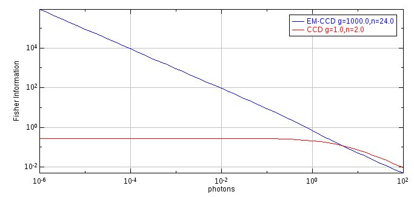

    Camera Model Fisher Information Analysis plot.

    The plot shows the Fisher information of two camera noise models. EM-CCD gain 1000 and read noise 24; CCD gain 1 and read noise 2.

.. _fig_noise_coefficient_plot:
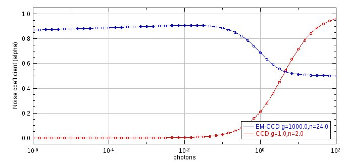

    Camera Model Noise Coefficient plot.

    The plot shows the Fisher information of two camera noise models relative to an uncorrupted Poisson signal. EM-CCD gain 1000 and read noise 24; CCD gain 1 and read noise 2.

.. index:: ! Camera Model Manager

Camera Model Manager
--------------------

The ``Camera Model Manager`` provides management of the per-pixel camera models that can be used in other plugins to perform per-pixel adjustment and fitting of image pixels. A camera model contains the following data for each pixel:

.. list-table::
   :widths: 20 80
   :header-rows: 1

   * - Parameter
     - Description

   * - Offset
     - The offset added to the pixel by the camera. An offset allows the noise below zero to be recorded correctly for very low signals.

   * - Variance
     - The variance or read-noise of the pixel. This is the noise that occurs when pixel values are read by the camera.

   * - Gain
     - The amplification applied to the raw photo-electron data output to create the camera counts.

Camera models are stored in a TIFF image file that contains 3 frames. The size of the image matches the number of pixels in the camera. The frames represent offset, variance and gain. Camera models can be created by the ``sCMOS Analysis`` plugin (see :numref:`%s <calibration_plugins:sCMOS Analysis>`).

When the ``Camera Model Manager`` plugin is run a dialog allows a choice from the following options:

.. list-table::
   :widths: 20 80
   :header-rows: 1

   * - Option
     - Description

   * - Load a camera model
     - Allows a single camera model to be loaded.

   * - Load from directory
     - Allows a directory of camera models to be loaded.

   * - Print all model details
     - Prints all current camera models to the ``ImageJ`` log.

   * - View a camera model
     - Opens the camera model as a stack image.

   * - Delete a camera model
     - Removes a camera model. The file data is not deleted.

   * - Filter an image
     - Applies filtering to an image using the camera model offset and gain.

..
  No index

Load a Camera Model
~~~~~~~~~~~~~~~~~~~

Presents a selection dialog where the camera model TIFF image file can be selected.

If the model is not valid an error message is shown in the ``ImageJ`` log.

..
  No index

Load from Directory
~~~~~~~~~~~~~~~~~~~

Presents a selection dialog where a directory of camera model TIFF image files can be selected.

If any model is not valid an error message is shown in the ``ImageJ`` log.

..
  No index

Print All Model Details
~~~~~~~~~~~~~~~~~~~~~~~

Prints the details of the current camera models to the ``ImageJ`` log. This includes the name of the file containing the model data and the summary metadata such as the width and height and in the case of a camera crop the origin relative to (0,0). An example model is shown below::

    camera_model_resources {
      key: "sCMOS_12bit"
      value {
        width: 1200
        height: 1200
        filename: "/images/sCMOS/Camera model calibration/sCMOS_12bit"
      }
    }

..
  No index

View a Camera Model
~~~~~~~~~~~~~~~~~~~

Presents a selection dialog to choose a camera model. The camera model data is then loaded from the data file and the offset (bias), variance and gain are shown as 3 slices in a stack. The plugin adds a 4\ :sup:`th` slice to the stack containing the normalised variance:

.. math::

    \mathit{var}/g^2 = \frac{\mathit{var}}{g^2}

This is the variance divided by the squared gain. This value represents the pixel read noise in photons. It is used for modelling the camera in some maximum likelihood estimation (MLE) fitting methods in the ``PeakFit`` plugin.

The plugin will compute the mean and standard deviation of each of the camera model properties and log them to the ``ImageJ`` log window::

    Bias : 99.98 += 9.994 : [56.84 to 148.5]
    Gain : 2.198 += 0.2115 : [1.297 to 3.28]
    Variance : 57.98 += 58.05 : [0.0 to 850.8]
    var/g^2 : 12.35 += 12.85 : [0.0 to 183.5]
    sqrt(var/g^2) : 3.101 += 1.653 : [0.0 to 13.55]

The numbers in square brackets are the minimum and maximum of the property values.

..
  No index

Delete a Camera Model
~~~~~~~~~~~~~~~~~~~~~

Presents a selection dialog to choose a camera model. The camera model is removed from the list of registered camera models. The raw model data file is not deleted.

..
  No index

Filter an Image
~~~~~~~~~~~~~~~

Presents a selection dialog to choose an open image. Presents a selection dialog to choose a camera model. The camera model data is loaded and used to filter the image.

If the model bounds are different from the image then it is assumed the image is a crop from within the camera model. A dialog is presented to configure the crop of the camera model. This is used to align the per-pixel data with the correct pixels from the crop image.

The image is then filtered for each frame in the stack and output to a new image with the suffix ``Filtered``. Filtering subtracts the offset and divides by the gain to represent the input image in camera counts converted to photons:

.. math::

    \mathit{photons}_i = \frac{\mathit{count}_i - o_i}{g_i}

.. index:: ! Diffusion Rate Test

Diffusion Rate Test
-------------------

The ``Diffusion Rate Test`` plugin will simulate molecule diffusion and fit a graph of mean-squared displacement to determine the diffusion coefficient. This is a test plugin to show that the simulated diffusion in the ``Create Data`` plugin generates correct moving particles.

When a molecule is diffusing it can move in any direction. The total distance it moves and the track it took may not be visible due to the speed of movement. However the diffusion of particles in a single dimension can be modelled as a population. If the squared distances from the origin after a set time are plotted as a histogram they can be modelled using a Gaussian curve. The average distance the particles will move is zero and the variance of the Gaussian curve will be the mean-squared displacement (MSD). This can be expressed by unit time. The MSD is proportional to the diffusion coefficient (:math:`D`). The relationship for a single-dimension is MSD = :math:`2D`. This increases to :math:`4D` and :math:`6D` for two and three dimensional distances (since the diffusion in each dimension is independent).

.. index:: Grid Walk simulation

Grid Walk simulation
~~~~~~~~~~~~~~~~~~~~

Since the MSD in a single dimension is equal to :math:`2D`, the mean-distance a particle moves will be :math:`\sqrt{2D}`. This step size can be used to simulate diffusion using a grid walk. At each step a particle can move forward or backwards by the step size :math:`s`. If the direction is random then the population of particles will have an average displacement of zero, a mean displacement of the step size:math:`s`, and a mean squared displacement (MSD) of :math:`s^2 = 2D`. Multi-dimension diffusion is done by simulating the movement in each dimension separately.

.. index:: Random Move simulation

Random Move simulation
~~~~~~~~~~~~~~~~~~~~~~

Diffusion can also be simulated by moving particles on a random vector. The distance moved should be sampled from a Gaussian distribution with a mean of zero and a standard deviation of :math:`\sqrt{\mathit{MSD}}`. This is :math:`2D`, :math:`4D` or :math:`6D` for 1, 2 or 3 dimensions respectively.

However the unit vector must be directed in a random orientation. For one dimension this is either forward or backward. For higher dimensions a random vector can be produced by sampling the movement in each dimension from a Gaussian distribution with mean zero and standard deviation 1. This vector is normalised to unit length.

The generation of the unit vector and the movement distance can be combined into a single stage. The random displacement is produced by sampling each dimension from a Gaussian distribution with mean zero and standard deviation of :math:`\sqrt{2D}`. This is the equivalent of 1-dimension diffusion in 3 independent dimensions.

.. index:: Confined Diffusion

Confined Diffusion
~~~~~~~~~~~~~~~~~~

Particles may not be able to freely move in any direction, for example when they collide with a barrier. The ``Diffusion Rate Test`` plugin allows particles to be confined in a sphere. In this case the diffusion step is calculated and if the step would move the particle outside the sphere the move is rejected. Attempts are made to move the particle a set number of times until successful otherwise the particle coordinates are not updated. This simulation produces good results when the average step size is at least an order of magnitude less than the sphere radius (so allowing many steps inside the sphere to be valid) and the ``Randon Move`` simulation is used.

Analysis
~~~~~~~~

The
``Diffusion Rate Test``
plugin simulates the random diffusion of many particles over a period of time. Each diffusion path is then analysed. The plugin has the following parameters:

.. list-table::
   :widths: 20 80
   :header-rows: 1

   * - Parameter
     - Description

   * - Pixel pitch (nm)
     - The pixel size for the simulation.

   * - Seconds
     - The duration of the simulation.

   * - Steps per second
     - The number of diffusion steps the particle makes per second.

   * - Particles
     - The number of particles to simulate.

   * - Diffusion rate
     - The diffusion coefficient (D).

   * - Use grid walk
     - If **true** then simulate diffusion using a grid walk, otherwise use a random move. The grid walk simulation is approximately 3 times faster.

   * - Use confinement
     - If **true** then use a sphere to confine the particle movement.

   * - Confinement attempts
     - The number of times to attempt a confined move.

   * - Confinement radius
     - The radius of the confinement sphere.

   * - Fit N
     - When using confined diffusion only fit the first N points of the MSD plot.

   * - Show example
     - Show an example image of a diffusion path.

   * - Magnification
     - The magnification of the example image. The pixels will represent (pixel pitch) / magnification nanometres.

Output
~~~~~~

..
  No index

MSD plot
^^^^^^^^

For each particle the plugin will compute the squared displacement from the origin over the time course of the simulation. Distances are computed in 2D and 3D. The plugin will plot the mean-squared distance against time for the population as shown in :numref:`Figure %s <fig_diffusion_rate_msd_plot>`. The 2D and 3D MSD data are then fit using a linear regression. The gradient of the fit can be used to calculate the diffusion coefficient by dividing by 4 or 6 respectively.

.. _fig_diffusion_rate_msd_plot:
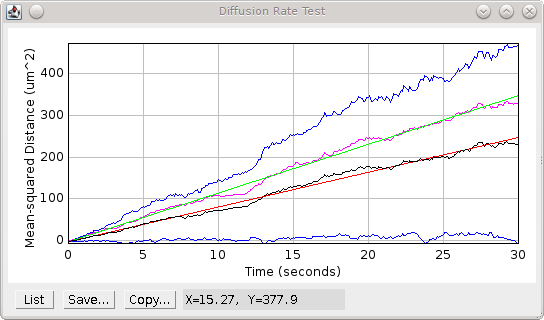

    Mean-squared distance (MSD) plot

    The plot shows the 2D (black) and 3D (magenta) MSD with fitted line. The upper and lower bounds for 2D MSD are shown (blue).

If confined diffusion is performed the MSD will reach a natural upper limit. This will result in a plateau of the MSD plot as shown in :numref:`Figure %s <fig_diffusion_rate_msd_plot_confined>`. In this case only the initial diffusion of the particles will be unconstrained. The analysis should therefore fit the initial linear section of the MSD plot. If the confinement radius is too small there may be no linear section to the MSD curve.

.. _fig_diffusion_rate_msd_plot_confined:
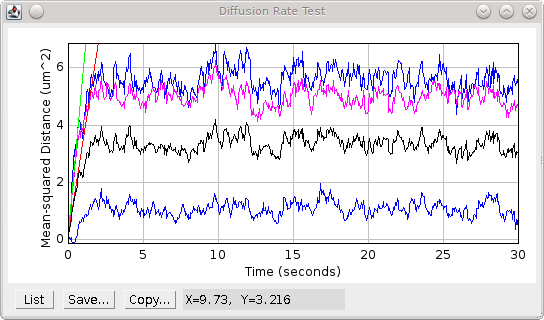

    Mean-squared distance (MSD) plot for confined diffusion

    The plot shows the 2D (black) and 3D (magenta) MSD with fitted line using the initial linear section of data. The upper and lower bounds for 2D MSD are shown (blue).

**Note:** The asymptote of the curve for confined diffusion should be defined by the average distance to the centre of a random distribution of particles within a sphere. This can be computed using the distance from the centre of all the points in a sphere divided by the number of points in a sphere. The surface area (*SA*) of a sphere is equal to the number of points at distance r from the centre. So :math:`\mathit{SA} \times r` is the sum of the distances of points at distance r from the centre. If this is integrated from zero to *R* it produces the sum of all distances from any point within a sphere of radius *R*. The number of points is the volume (*V*) of the sphere. The sum of the distances divided by the number of points is the average distance to the centre, therefore:

.. math::

    \frac{\int ^{R}\mathit{SA} \times r}{V} dr &= \frac{\int ^{R}4\pi r^{2} \times r}{4\pi R^{3}/3} dr \\
    &= \frac{\int ^{R} r^{3}}{R^{3}/3} dr \\
    &= \frac{R^{4}}{R^{3}/3} \\
    &= \frac{3R}{4}

Thus the mean-distance to the centre for particles in a sphere is 0.75 *R*. This can be used to check that the confined simulation is performing as a true random diffusion within a sphere.

..
  No index

Diffusion Example
^^^^^^^^^^^^^^^^^

If the ``Show example`` option was selected the plugin will show an image of the track of a single particle. The track is shown on a black background. The track is initialised at a value of 32 and ends with a value of 255. The movement can thus be followed using a colour lookup table (LUT), e.g. ``Image > Lookup Tables > Fire``.

The plugin will also show a plot of the displacement of the particle over time. The red line shows the X displacement and the blue shows the Y displacement.

..
  No index

Analysis results
^^^^^^^^^^^^^^^^

The fitting analysis results are output to the ``ImageJ`` log window, e.g.

.. code-block:: text

    Diffusion Rate Test : D = 1.0 um^2/sec, Precision = 0.0 nm
    Mean-displacement per dimension = 1414.0 nm/sec
    Simulation step-size = 44.72 nm
    Raw data D=1.0 um^2/s, Precision = 0.0 nm, N=22000, step=0.001 s, mean=0.004034 um^2, MSD = 4.034 um^2/s
    2D Diffusion rate = 1.013 um^2 / sec (50.22 ms)
    3D Diffusion rate = 1.175 um^2 / sec (50.22 ms)

The input diffusion coefficient is shown for reference, the units are |micro|\ m\ :sup:`2`/sec. This is converted to the expected mean-displacement in nm per second and the simulation step size (in nm). This will allow the user to experiment with the radius of the confinement sphere and the number of simulation steps. Remember that the step size should be less than the sphere radius when using confinement. The fitted diffusion coefficients from the 2D and 3D fitting are then shown. These should be close to the input diffusion rate.

If the simulation was performed using confinement then the final distance to the origin for each particle will be saved. The average distance will be shown along with the expected asymptote distance, i.e. the mean-distance to the centre of a sphere, which is calculated as 3/4 of the confinement radius, e.g.

.. code-block:: text

    3D asymptote distance = 702.7 nm (expected 750.00)

..
  No index

Memory Results
^^^^^^^^^^^^^^

The coordinates of each diffusing particle, starting at the origin (0,0), are saved to a results dataset in memory. Each consecutive step of the same particle is given a new frame and particles are allocated a unique ID. The current frame is incremented between particles so that each particle track is separated in time. This allows the results set to be used within the ``Trace Diffusion`` and ``Draw Clusters`` plugins to verify their functionality.

Extra Options
~~~~~~~~~~~~~

Hold the ``Shift`` key down when running the plugin to activate extra options. The following options are available and are described in the following sections:

.. list-table::
   :widths: 20 80
   :header-rows: 1

   * - Parameter
     - Description

   * - Aggregate steps
     - Create a second dataset by averaging N consecutive positions into a single location.

   * - MSD analysis
     - Specify the maximum number of steps used to perform MSD analysis. This is only relevant when the ``Aggregate steps`` parameter is above 1.

   * - Precision
     - Specify the localisation precision of positions.

..
  No index

Aggregate steps parameter
^^^^^^^^^^^^^^^^^^^^^^^^^

The standard plugin simulates diffusion in small steps. These can be aggregated together to simulate the position of the particle in a frame taken on a camera. In this case the average position of a set of consecutive steps is calculated to aggregated the position into a frame. The mean-squared distance between frames is then reported to the ``ImageJ`` log:

.. code-block:: text

    Raw data D=1.0 um^2/s, Precision = 0.0 nm, N=22000, step=0.001 s, mean=0.004016 um^2, MSD = 4.016 um^2/s
    Aggregated data D=1.0 um^2/s, Precision=0.0 nm, N=200, step=0.1 s, mean=0.2713 um^2, MSD = 2.713 um^2/s

Note that the aggregation has the effect of reducing the mean-squared displacement for the dataset.

The aggregated data is saved into a dataset in memory.

..
  No index

MSD Analysis parameter
^^^^^^^^^^^^^^^^^^^^^^

The ``MSD Analysis`` option is available when data aggregation has been performed using the ``Aggregate steps`` parameter. When multiple small steps are aggregated into single coordinates this causes the observed MSD to be lower than the expected MSD given the diffusion coefficient. Effectively the averaging of the position of a particle within a frame has caused loss of information about the diffusion distance covered within that frame. MSD analysis allows the effect of aggregation to be analysed.

For each simulated track the position of the particle is computed as a rolling average of the coordinates using the configured number of ``Aggregated steps`` (N).

For example the first position is the average of the first N steps. The next position is computed by adding the N+1 coordinate and subtracting the 1\ :sup:`st` coordinate from the sum to create a new average.

Using the rolling average position the squared distance between each position and the *j*\ :sup:`th` position along the sequence is computed for all *j* up to the limit set by the ``MSD Analysis`` parameter.
The mean squared distance is then reported for each separation *j* to a summary table:

.. list-table::
   :widths: 20 80
   :header-rows: 1

   * - **Column**
     - Description

   * - D
     - The input diffusion coefficient.

   * - Precision
     - The precision error of each average position.

       If positive the positions will be adjusted with a random error before the distances are computed. See section :numref:`{number} <calibration_plugins:Precision parameter>`.

   * - Dsim
     - The simulated diffusion coefficient (calculated using the mean-squared displacement between non-aggregated coordinates).

   * - Step
     - The size of a single simulation step in seconds.

   * - Resolution
     - The number of steps that are aggregated into a frame.

   * - Frame
     - The frame length in seconds.

   * - t
     - The separation *j* between the two rolling average positions in seconds.

   * - n
     - The separation *j* between the two rolling average positions in frames.

   * - N
     - The number of samples to compute the MSD.

   * - MSD
     - The mean-squared displacement (MSD).

   * - D
     - The observed diffusion coefficient (calculated as MSD / 4t).

..
  No index

Precision parameter
^^^^^^^^^^^^^^^^^^^

By default the exact coordinates of a particle are used in the analysis and to create the output datasets. To simulate the results generated by a super-resolution image reconstruction method the coordinates can be reported with a random error added to each position. The error simulates the fitting precision of the super-resolution localisation method. Error is added independently to the X and Y coordinates using a Gaussian random variable with the given standard deviation.

The precision error has the effect of increasing the mean-squared displacement for the dataset, e.g.

.. code-block:: text

    Raw data D=1.0 um^2/s, Precision = 0.0nm, N=22000, step=0.001 s, mean=0.004016 um^2, MSD = 4.016 um^2/s
    …
    Raw data D=1.0 um^2/s, Precision = 30.0 nm, N=22000, step=0.001 s, mean=0.007614 um^2, MSD = 7.614 um^2/s

