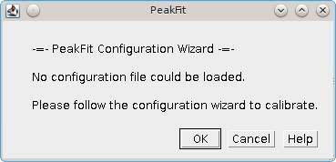
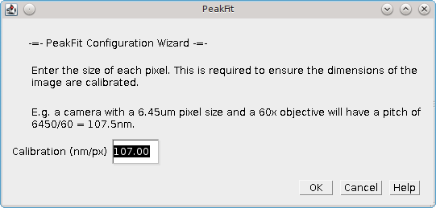
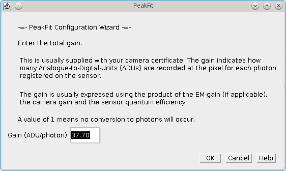
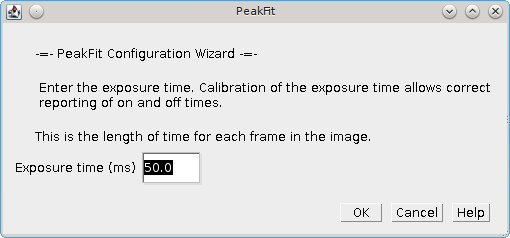
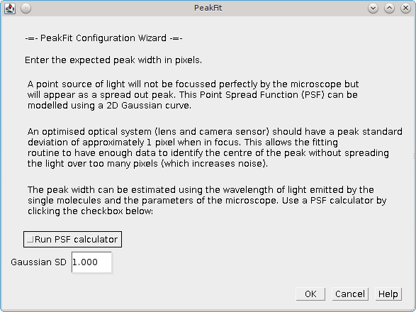
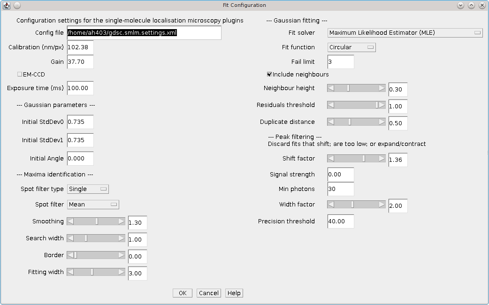

.. index:: fitting plugins

Fitting Plugins
===============

The following plugins use the SMLM fitting engine to find and fit spots on an image.

It is vital that the method used by the software is understood when adjusting the parameters from the defaults. Please refer to section :ref:`background:Localisation Fitting Method` for more details.

The plugins are described in the following sections using the order presented on the ``Plugins > GDSC SMLM > Fitting`` menu.

.. index:: simple fit

Simple Fit
----------

The ``Simple Fit`` plugin provides a single plugin to fit localisations on an image and produce a table and image reconstruction of the results. The fitting is performed using the fitting defaults, i.e. no fitting options are presented. This simplifies the fitting process to a single-click operation.

The plugin must be run when a single-molecule image is the currently active window in ``ImageJ``. Each frame of the image will be analysed and the localisations recorded in a table and/or drawn on a high resolution image reconstruction.

The fitting is performed using multi-threaded code with a thread analysing each frame. Consequently results can appear out-of-order in the results table.

The plugin dialog has a simple appearance as shown in :numref:`Figure %s <fig_simple_fit_dialog>`.

.. _fig_simple_fit_dialog:
.. figure:: images/simple_fit_dialog.png
    :align: center

    Simple Fit dialog

.. index:: parameters

Parameters
~~~~~~~~~~

The plugin offers the following parameters.

.. list-table::
   :widths: 20 80
   :header-rows: 1

   * - Parameter
     - Description

   * -  Use current calibration
     -  If selected use the current SMLM configuration. Otherwise run the configuration wizard.

        This option is only shown if a SMLM configuration file can be found. If no file is found then the configuration wizard is run by default.

   * -  Show table
     -  Show a table containing the localisations.

   * -  Show image
     -  Show a super-resolution image of the localisations. The image will be 1024 pixels on the long edge. Note that the plugin will run if no output options are selected. This is because the fitting results are also stored in memory. The results can be accessed and manipulated using the :ref:`results_plugins:Results Plugins`.

It is possible to stop the fitting process using the ``Escape`` key. All current results will be kept but the fitting process will end.

.. index:: calibration

Calibration
~~~~~~~~~~~

The SMLM plugins require information about the system used to capture the images. This information is used is many of the analysis plugins. The information that is required is detailed below:

.. list-table::
   :widths: 20 80
   :header-rows: 1

   * -  Information
     - Description

   * -  Pixel Pitch
     -  Specify the size of each pixel in the image.

        This is used to set the scale of the image and allows determination of the distance between localisations. This is used in many analysis plugins and for the localisation precision calculation.

        It is expected that the value would be in the range around 100nm. Input of an incorrect value will lead to incorrect precision estimates and require the user to adapt the analysis plugins and their results.

   * -  Gain
     -  Specify how many pixel values are equal to a photon of light. The units are Analogue-to-Digital Units (ADUs)/photon.

        This allows conversion of the pixel values to photons. It is used to convert the volume of the fitted 2D Gaussian to a photon count (the localisation signal).

        The gain is the total gain of the system (ADU/photon) and is equal to:
        [Camera gain (ADU/e-)] x [EM-gain] x [Quantum Efficiency (e-/photon)]

        Note: Check the units for this calculation as the camera gain can often be represented as electrons/ADU. In this case a reciprocal must be used. EM-gain has no units. Quantum Efficiency should be in the range 0-1; the units are electrons/photon.

        For an EM-CCD camera with an EM-gain of 250 the total gain may be in the range around 40. Camera gain and EM-gain can be calculated for your camera using the :ref:`calibration_plugins:Mean-Variance Test` plugins. The gain values and Q.E. may also have been provided on a specification sheet with the camera.

        Input of an incorrect value will lead to incorrect precision estimates. These estimates are used in various analysis plugins to set parameters relative to the average fitting precision.

   * -  Exposure Time
     -  This is the length of time captured by each frame in milliseconds.

        The exposure time is used in various analysis plugins. Input of an incorrect value will only effect the time scales reported in the results.

   * -  Peak Width
     -  Specify the expected width of the Gaussian function that approximates the Point Spread Function (PSF) Airy disk. This is how spread out the spot of light is when in focus. The width is specified in pixels.

        This value is used as an input to the fitting process to avoid having to guess the initial width for each spot processed. Since the width is approximately constant for the microscope it is valuable to input the expected width. The width is updated during the fitting process allowing fitting of out-of-focus spots.

        The width can be calculated using knowledge of the microscope objective and the wavelength of light. It can also be estimated from an image (see section :ref:`calibration_plugins:PSF Estimator`).

        It is expected that this should be in the range around 1 pixel. Input of an incorrect value will lead to poor fitting performance since by default peaks that are too wide/narrow are discarded.

When the ``Simple Fit`` plugin is run it attempts to load the SMLM configuration file. This is located in the user's home directory and is named ``gdsc.smlm.settings.xml``. If no configuration file can be found then a configuration wizard is run to guide the user through calibration. If any dialog is cancelled then the ``Simple Fit`` plugin terminates.

.. index:: configuration wizard 1: introduction

Configuration Wizard 1: Introduction
^^^^^^^^^^^^^^^^^^^^^^^^^^^^^^^^^^^^

The first dialog (:numref:`Figure %s <fig_simple_fit_wizard1>`) of the wizard warns the user that no configuration file could be loaded.

.. _fig_simple_fit_wizard1:

    Configuration Wizard 1: Introduction

.. index:: configuration wizard 2: pixel pitch

Configuration Wizard 2: Pixel Pitch
^^^^^^^^^^^^^^^^^^^^^^^^^^^^^^^^^^^

The second dialog (:numref:`Figure %s <fig_simple_fit_wizard2>`) of the wizard requests the pixel pitch.

.. _fig_simple_fit_wizard2:

    Configuration Wizard 2: Pixel Pitch

.. index:: configuration wizard 3: gain

Configuration Wizard 3: Gain
^^^^^^^^^^^^^^^^^^^^^^^^^^^^

The third dialog (:numref:`Figure %s <fig_simple_fit_wizard3>`) of the wizard requests the total gain.

.. _fig_simple_fit_wizard3:

    Configuration Wizard 3: Gain

.. index:: configuration wizard 4: exposure time

Configuration Wizard 4: Exposure Time
^^^^^^^^^^^^^^^^^^^^^^^^^^^^^^^^^^^^^

The fourth dialog (:numref:`Figure %s <fig_simple_fit_wizard4>`) of the wizard requests the exposure time.

.. _fig_simple_fit_wizard4:

    Configuration Wizard 4: Exposure Time

.. index:: configuration wizard 5: peak width

Configuration Wizard 5: Peak Width
^^^^^^^^^^^^^^^^^^^^^^^^^^^^^^^^^^

The fifth dialog (:numref:`Figure %s <fig_simple_fit_wizard5>`) of the wizard requests the expected peak width for the 2D Gaussian:

.. _fig_simple_fit_wizard5:

    Configuration Wizard 5: Peak Width

A checkbox is provided which allows the user to run the :ref:`calibration_plugins:PSF Calculator`. The calculator will compute an expected Gaussian standard deviation using the microscope optics (see :numref:`Figure %s <fig_psf_calculator>`).

.. _fig_psf_calculator:
.. figure:: images/psf_calculator_dialog.png
    :align: center
    :figwidth: 80%

    PSF Calculator

The calculator uses the following formula:

.. math::

    \mathit{SD}=p\times 1.323\times {\frac{\lambda }{2\pi \mathit{NA}}}

Where:

.. list-table::
    :widths: 20 80
    :header-rows: 0

    * - *SD*
      - The standard deviation of the Gaussian approximation to the Airy pattern.

    * - :math:`\lambda`
      - The wavelength (in nm).

    * - *NA*
      - The Numerical Aperture.

    * - *p*
      - The proportionality factor. Using a value of 1 gives the theoretical lower bounds on the peak width. However the microscope optics are not perfect and the fluorophore may move on a small scale so the fitted width is often wider than this limit. The factor of 1.52 in the calculator matches the results obtained from the ``PSF Estimator`` plugin on many calibration images made with the GDSC optical set-up.

When the configuration wizard is finished the user is presented with the ``Simple Fit`` dialog shown in :numref:`Figure %s <fig_simple_fit_dialog>`. The settings are saved to the settings file.

If the wizard is cancelled at any point then the settings file is not created. The user will be forced to go through the wizard again the next time they run the plugin.

.. index:: advanced settings

Advanced Settings
~~~~~~~~~~~~~~~~~

The ``Simple Fit`` plugin is a simplified interface to the ``Peak Fit`` plugin that uses default values for fitting parameters. All the fitting parameters can be adjusted only by using the ``Peak Fit`` plugin. Since the ``Simple Fit`` plugin resets the SMLM configuration file to the fitting defaults when the ``Peak Fit`` plugin is run immediately after the ``Simple Fit`` plugin the results will be the same. This allows the user to reset the fitting parameters with ``Simple Fit`` and then repeatedly make changes to the parameters with the ``Peak Fit`` plugin to see how the results are affected. This can be a useful learning tool to experiment with the fitting parameters.

.. index:: peak fit

Peak Fit
--------

Finds all the candidate maxima in an image and fits them using a 2D Gaussian. The
``Peak Fit``
dialog is shown in :numref:`Figure %s <fig_peak_fit_dialog>`.

.. _fig_peak_fit_dialog:
.. figure:: images/peak_fit_dialog.png
    :align: center
    :figwidth: 80%

    Peak Fit dialog

The plugin will initialise using the previously selected configuration file. If no file exists then a default set of settings will be created.

A different file can be selected by double clicking in the text box. This will open a file selection dialog.

If the file name is changed and the new file exists the plugin will provide the option to reload the settings from the new configuration file.

When the plugin runs all the settings will be saved to the configuration file, overwriting any existing file.

The dialog contains settings for the imaging conditions and then various parts of the fitting algorithm: Imaging Calibration; Gaussian PSF; Maxima Identification; Fitting; Multiple Peak Fitting; and Peak Filtering. Additional parameters are used to control the output. Each of the sections is described below.

**Note:**

The fitting algorithm is described in section :numref:`{number}: {name} <background:Localisation Fitting Method>`. Understanding the method will ensure that the parameters can be adjusted to achieve the desired fitting result. Using the
``Simple Fit``
plugin will reset the parameters to their defaults.

.. index:: imaging calibration parameters

Imaging Calibration Parameters
~~~~~~~~~~~~~~~~~~~~~~~~~~~~~~

The imaging parameters describe the conditions used to acquire the image. The pixel size is used to define distances in nm. The gain is used to convert the Analogue to Digital Units (ADUs) to photons.

.. list-table::
   :widths: 20 80
   :header-rows: 1

   * - Parameter
     - Description

   * - Calibration (nm/px)
     - The size of the image pixels in nm.

   * - Gain
     - The total gain. Used to convert the camera ADUs to photons.

   * - EM-CCD
     - Select this if you used an EM-CCD camera. This is stored with the results and used in precision calculations.

   * - Exposure time (ms)
     - This is the length of time captured by each frame in milliseconds.

Note that a bias (offset zero level) is not always needed since the fitting process fits the background which will include the bias offset. The number of photons in the peak can then be calculated without needing to know the camera bias. If Maximum Likelihood fitting is used then the bias is required and the plugin will prompt the user to enter it.

.. index:: gaussian psf parameters

Gaussian PSF Parameters
~~~~~~~~~~~~~~~~~~~~~~~

The Point Spread Function (PSF) of the microscope is approximated using a 2D Gaussian function. The Gaussian can have the same width in the X and Y dimensions or separate widths. If the widths are different then the Gaussian will be elliptical in shape. In this case the ellipse can be rotated by an angle. The parameters allow the initial shape of the Gaussian PSF to be specified. These parameters are only an initial guess and the Gaussian shape will be optimised to fit each identified spot in the image.

Note that the Gaussian function is defined in units of pixels.

.. list-table::
   :widths: 20 80
   :header-rows: 1

   * - Parameter
     - Description

   * - Initial StdDev0
     - Set the initial parameters for the 2D Gaussian (``Circular``).

   * - Initial StdDev1
     - Set the initial parameters for the 2D Gaussian. Used for independent X/Y width fitting (``Free Circular``, ``Free``).

   * - Initial Angle
     - Set the initial parameters for the 2D Gaussian. Used for elliptical fitting (``Free``).

.. index:: maxima identification parameters

Maxima Identification Parameters
~~~~~~~~~~~~~~~~~~~~~~~~~~~~~~~~

Note that the ``Smoothing``, ``Search``, ``Border`` and ``Fitting width`` parameters are factors applied to the Gaussian function width (``Initial StdDev``). They have no units.

.. list-table::
   :widths: 20 80
   :header-rows: 1

   * - Parameter
     - Description

   * - Spot filter type
     - The type of filter to use. The default is a ``Single`` filter.

       If a ``Difference`` or ``Jury`` filter is selected then the plugin will present an additional dialog to configure each additional spot filter.

       More details are given in the next section.

   * - Spot filter
     - The name of the first spot filter:

       * ``Mean``: Compute the mean in a square region. The region can be any size and is not limited to integer pixel counts. Internal pixels are weighted 1; the outer edge pixels are given a weight <= 1 based on interpolating the region size.

       * ``Block mean``: Compute the mean in a square region. The region is rounded to integer pixels.

       * ``Circular mean``: Compute the mean in an approximate circular region. The circle is drawn using square pixels. To see the circle mask use ``Process > Filters > Show Circular Masks...``

       * ``Gaussian``: Perform Gaussian convolution. The total region width around each point that is used will be 2n+1 with :math:`n=\lceil{1.84\sigma}\rceil` where :math:`\lceil{x}\rceil` is the ceiling function and :math:`\sigma` is the ``smoothing`` parameter multiplied by the estimated PSF width. This matches the minimum accuracy (smallest recommended) Gaussian kernel filter in ``ImageJ``.

       * ``Median``: Compute the median in a square region. The region is rounded to integer pixels.

   * - Smoothing
     - Controls the size of the first smoothing filter:

       :math:`\mathit{Smooth} = \mathit{Initial\:StdDev} \times \mathit{Smoothing}`

       Filtering can be disabled using a ``Smoothing`` value of 0.

   * - Search Width
     - Controls the size of the region used for finding local maxima:

       :math:`\mathit{Width} = \lfloor{\mathit{Initial\:StdDev} \times \mathit{Search Width}}\rfloor`

       Note that ideally localisation spots should be well separated (over 5 pixels) and so increasing this parameter will reduce the number of false maxima identified as fitting candidates by eliminating noisy pixels.

   * - Border
     - Define the number of border pixels to ignore. No maxima are allowed in the border

       :math:`\mathit{Width} = \lfloor{\mathit{Initial\:StdDev} \times \mathit{Border}}\rfloor`

   * - Fitting Width
     - Controls the size of the region used for fitting each peak.

       :math:`\mathit{Width} = \lfloor{\mathit{Initial\:StdDev} \times \mathit{Fitting Width}}\rfloor`

       The width should be large enough to cover a localisation spot so the function can fit the entire spot data. 3 standard deviations should cover 99% of a Gaussian function.

.. index:: spot filter type

Spot Filter Type
^^^^^^^^^^^^^^^^

The ``Peak Fit`` plugin can perform initial filtering on the image using a ``Single``, ``Difference`` or ``Jury`` filter. The filtered image is then analysed for local maxima. The purpose is to remove noise from the image to prevent identification of false candidate maxima that waste time during the fitting process and may create bad localisation data.

A ``Single`` filter will process the image once with the selected filter.

A ``Difference`` filter will process the image twice with the two configured filters. The second filtered image is then subtracted from the first. This acts as a band-pass filter that allows any frequency between the two filters to pass but remove the other frequencies. For example a PSF with an approximate standard deviation of 1 could be filtered with a difference of Gaussians filter using a filter standard deviation of 0.5 and 2.

The ``Difference`` filter is useful when there is a large background variation in the image since the subtraction of the second image is performing a local background subtraction. The spots are then ranked using their relative height over background. This would rank a spot with a height of 10 over a background of 50 as lower than a spot with a height of 30 over a background of 20. In contrast the ``Single`` filter would put the height 10 spot first as its total height is 60 compared to 50 for the other brighter spot.

A ``Jury`` filter will apply many filters to the image. Each filtered image is used to identify maxima. The pixel value from the filtered image from each maxima is added to a sum image. When all filters have been processed the maxima are then identified in the sum image. The ``Jury`` filter is therefore finding maxima in a combined image composed of pixels that are maxima. Analysis of simple ``Jury`` filters has shown that they have high recall but lower precision than single filters (e.g. a ``Single`` Mean with smoothing 1.3 verses a ``Jury`` of Mean 1, Mean 2 and Mean 3).

.. index:: fitting parameters

Fitting Parameters
~~~~~~~~~~~~~~~~~~

.. list-table::
   :widths: 20 80
   :header-rows: 1

   * - Parameter
     - Description

   * - Fit Solver
     - Specify the method used to fit the maxima.

       *   ``LSE``: Use the GDSC Least Squares Estimator (LSE) fitting algorithm (based on the Hessian matrix of partial derivatives).

       *   ``WLSE``: Use the GDSC Weighted Least-Squares Estimation.

       *   ``LSEqn``: Use the Apache Commons LSE fitting algorithm (based on the Jacobian matrix of partial derivatives).

       *   ``MLE``: Use Maximum Likelihood Estimation.

       Note: The LVM method is fastest, MLE is the most precise (smallest error).

       Individual ``Fit Solver`` methods may require further parameters which are detailed in the following section.

   * - Fit Function
     - Specify the type of 2D Gaussian function to fit.

       *   ``Fixed``: Fits X,Y centre and amplitude.

       *   ``Circular``: Fits X,Y centre, combined X/Y deviation and amplitude.

       *   ``Free Circular``: Fits X,Y centre, individual X/Y deviation and amplitude.

       *   ``Free``: Fits X,Y centre, individual X/Y deviation, rotation angle and amplitude.

   * - Fail Limit
     - Stop processing the image frame when N consecutive fits fail. This prevents attempting to fit the remaining candidates that have a lower signal.

.. index:: gaussian psf equation

Gaussian PSF Equation
^^^^^^^^^^^^^^^^^^^^^

The following equation specifies the elliptical 2D Gaussian (named ``Free`` in the ``Fit function`` options):

.. math::

    f(x,y)=B+\frac{\mathit{Signal}}{2\pi \sigma _{x}\sigma_{y}}e^{-a(x-x_{0})^{2}-2b(x-x_{0})(y-y_{0})+c(y-y_{0})^{2}}

where

.. math::

    \left[\begin{matrix}a&b\\b&c\end{matrix}\right]

is positive-definite and

.. math::

    a=\frac{\cos ^{2}\theta }{2\sigma _{x}^{2}}+\frac{\sin ^{2}\theta}{2\sigma _{y}^{2}}

.. math::

    b=-{\frac{\sin ^{2}2\theta }{4\sigma _{x}^{2}}}+\frac{\sin ^{2}2\theta}{4\sigma _{y}^{2}}

.. math::

    c=\frac{\sin ^{2}\theta }{2\sigma _{x}^{2}}+\frac{\cos ^{2}\theta}{2\sigma _{y}^{2}}

with

.. list-table::
    :widths: 20 80

    * - :math:`B`
      - The background level

    * - :math:`\mathit{Signal}`
      - The total volume of the Gaussian.

    * - :math:`x_0`
      - The X centre of the Gaussian.

    * - :math:`y_0`
      - The Y centre of the Gaussian.

    * - :math:`\sigma_x`
      - The X standard deviation.

    * - :math:`\sigma_y`
      - The Y standard deviation.

    * - :math:`\theta`
      - The angle of rotation of the ellipse.

If :math:`\theta` is zero this reduces to an elliptical 2D Gaussian with no rotation (named ``Free circular``
in the ``Fit function`` options):

.. math::

    f(x,y)=B+\frac{\mathit{Signal}}{2\pi \sigma _{x}\sigma {y}}e^{-\left(\frac{(x-x_{0})^{2}}{2\sigma_{x}^{2}}\right)-\left(\frac{(y-y_{0})^{2}}{2\sigma _{y}^{2}}\right)}

If :math:`\theta` is zero and :math:`\sigma_x = \sigma_y` this reduces to a circular 2D Gaussian:

.. math::

    f(x,y)=B+\frac{\mathit{Signal}}{2\pi \sigma^{2}}e^{-\left(\frac{(x-x_{0})^{2}+(y-y_{0})^{2}}{2\sigma ^{2}}\right)}

Note: A previous of the software did not fit the Gaussian volume (signal) but the height of the Gaussian (amplitude). To convert the signal to the amplitude use the following conversion:

.. math::

    \mathit{Amplitude}=\frac{\mathit{Signal}}{2\pi \sigma _{x}\sigma _{y}}

.. index:: least squares estimation

Least Squares Estimation
^^^^^^^^^^^^^^^^^^^^^^^^

Least-squares estimation is the processes of fitting a function (expected values) to a set of observed values. The fit attempts to minimise the sum of the squared difference between observed (*O*) and expected (*E*):

.. math::

    \mathit{SS}=\sum {(O-E)^{2}}

The parameters for the expected function are updated until no improvement can be made. The estimation process uses the popular Levenberg-Marquardt (LVM) algorithm which uses the gradient of the function, i.e. how the function value will change with a change to the parameters, to choose how to modify the parameters. The ``Peak Fit`` plugin offers two version of the algorithm. One version uses the Hessian matrix of partial derivatives (i.e. it is a full Newton method for finding roots of equations). This is a matrix of the gradient of the function with respect to two parameters for all combinations of parameters. The method must compute the matrix and invert it and this can lead to numerical instability with floating-point numbers, for example if one parameter has a very small gradient with respect to any of the other parameters. The second uses only the Jacobian matrix of partial derivatives. This is a matrix of the gradient with respect to each parameter at each data point. The Jacobian is used to approximate and update the inverted Hessian (i.e. it is a quasi-Newton method) and is less prone to instability. This method is provided by an external library (Apache Commons Maths). The full Newton method is faster and both methods return very similar results.

The weighted least-squares estimator provides a weight for each point using the estimated value. The fit attempts to minimise:

.. math::

    \mathit{SS}=\sum {(O-E)^{2}/E^{2}}

Note that when the estimated value is small the weight will have a destabilising effect on the sum by significantly over-weighting data. The weight is thus limited to a minimum of 1. However weighted least squares is not recommended as it has not been proven in testing on simulated single molecule data to outperform the standard LSE.

Currently the quasi-Newton LSE requires no additional parameters to be configured.

The GDSC Least Squares Estimator requires the following additional parameters:

.. list-table::
   :widths: 20 80
   :header-rows: 1

   * - Parameter
     - Description

   * - Fit Criteria
     - The fit uses a non-linear least squares routine until convergence. If convergence is not achieved by the maximum iterations then the fit fails. Convergence can be defined using:

       *   ``Least squared error``: Convergence of the least-squared error of the fit to a given number of
           Significant digits.

       *   ``Least squared error plus``: Convergence of the least-squared error of the fit to a given number of ``Significant digits``. Convergence is also achieved if 3 consecutive improvements are the same relative improvement and half of the maximum iterations has passed. This avoids slowly converging fits.

       *   ``Coordinates``: Convergence of the X,Y centre coordinates to within a specified ``Coord delta``.

       *   ``Parameters``: Convergence of each of the Gaussian parameters (e.g. centre, width and signal) to a set number of ``Significant digits``.

   * - Significant Digits
     - When comparing two numbers, defines the significant digit for equality, e.g. specify 3 to recognise 1 and 1.001 as equal.

       Note that Java floating points have a limited precision preventing comparisons to high numbers of significant digits. Using a value over 15 will generally not allow convergence.

   * - Coord Delta
     - Define the smallest shift (in pixels) that specifies a movement of the X/Y coordinates. Used in the ``Coordinates`` fit criteria.

   * - Lambda
     - The initial lambda for the Levenberg-Marquardt algorithm. Higher favours the gradients of the parameters. Lower favours the Hessian matrix gradients (second partial derivatives). Lower is used when very close to the solution.

       Note that the algorithm updates the lambda during fitting to refine the improvement to the fit. A value of 10 is a good initial value.

   * - Max Iterations
     - Stop the fit when this is reached and return a failure.

.. index:: maximum likelihood estimation

Maximum Likelihood Estimation
^^^^^^^^^^^^^^^^^^^^^^^^^^^^^

Maximum Likelihood estimation is the processes of fitting a function (expected values) to a set of observed values by maximising the probability of the observed values. MLE requires that there is a probability model for each data point. The function is used to predict the expected value (E) of the data point and the probability model is used to specify the probability (likelihood) of the observed value (O) given the expected value. The total probability is computed by multiplying all the probabilities for all points together:

.. math::

    \mathit{likelihood}=\prod {p(O|E)}

or by summing their logarithms:

.. math::

    \mathit{loglikelihood}=\sum {\ln (p(O|E))}

The maximum likelihood returns the fit that is the most probable given the model for the data.

Poisson noise model
"""""""""""""""""""

This model is suitable for modelling objects with a lot of signal.

The standard model for the image data is a Poisson model. This models the fluctuation of light emitted from a light source (photon shot noise). This is based on the fact that gaps between individual photons can vary even though the average emission rate of the photons is constant. The Poisson model will work when the amount of shot noise is much higher than all other noise in the data, i.e. when the localisations are very bright. If the other noise is significant then a more detailed model is required.

The Poisson probability model is:

.. math::

    p(k|\lambda )=\frac{\lambda ^{k}}{k!}\operatorname{e}^{-\lambda }

with
*k* equal to the pixel count and
*λ* equal to the expected pixel count.
Note that when we take a logarithm of this we can remove the factorial since it is constant and will not affect optimising the sum:

.. math::

    \ln (p(k|\lambda )) &= \ln (\frac{\lambda^{k}}{k!}\operatorname{e}^{-\lambda }) \\
    &= \ln(\frac{\lambda ^{k}}{k!})+\ln (\operatorname{e}^{-\lambda }) \\
    &= \ln (\lambda ^{k})-\ln (k!)-\lambda \\
    &= k\ln (\lambda)-\lambda

The final log-likelihood function is fast to evaluate and since it can be differentiated the formula can be used with derivative based function solvers.

Poisson-Gaussian noise model
""""""""""""""""""""""""""""

This model is suitable for modelling a standard CCD camera.

This model accounts for the photon shot noise and the read noise of the camera, i.e. when the number of electrons is read from the camera chip there can be mistakes. The read noise is normally distributed with a mean of zero.

The two noise distributions can be combined by convolution of a Poisson and a Gaussian function to the produce the following model:

.. math::

    p(k|\lambda ,\sigma )=\sum _{n=0}^{\infty }{\frac{1}{n!}\lambda^{n}\operatorname{e}^{-\lambda }\times {\frac{1}{\sqrt{2\pi }\sigma}\operatorname{e}^{-{\frac{1}{2\sigma ^{2}}(x-n)^{2}}}}}

with
*k* equal to the pixel count,
*λ* equal to the expected pixel count and
*σ* equal to the standard deviation of the Gaussian read noise. This model is evaluated using a saddle-point approximation as described in Snyder *et al* (1995); the implementation is adapted from the authors example source code.

No gradient is available for the function and so non-derivative based methods must be used during fitting.

Poisson-Gamma-Gaussian noise model
""""""""""""""""""""""""""""""""""

This model is suitable for modelling a Electron Multiplying (EM) CCD camera.

This model accounts for the photon shot noise, the electron multiplication gain of the EM register and the read noise of the camera. The EM-gain is modelled using a Gamma distribution. The read noise is normally distributed with a mean of zero.

The convolution of the Poisson and Gamma distribution can be expressed as:

.. math::

    G_{p,m}(c)=\operatorname{e}^{-p}\delta(c)+\sqrt{\frac{p}{\mathit{cm}}}\operatorname{e}^{-{\frac{c}{m}}-p}\mathit{BesselI}_{1}(2\sqrt{\frac{\mathit{cp}}{m}})

where:

.. list-table::
    :widths: 20 80

    * - :math:`p`
      - The average number of photons.

    * - :math:`m`
      - The EM-gain multiplication factor.

    * - :math:`c`
      - The observed pixel count.

    * - :math:`\delta(c)`
      - The Dirac delta function (1 when c=0, 0 otherwise).

    * - :math:`\mathit{BesselI}_1`
      - Modified Bessel function of the 1\ :sup:`st` kind.

    * - :math:`G_{p,m}(c)`
      - The probability of observing the pixel count *c*.

This is taken from Ulbrich and Isacoff (2007). The output of this function is subsequently convolved with a Gaussian function with standard deviation equal to the camera read noise and mean zero. This must be done numerically since no algebraic solution exists. However Mortensen *et al* (2010) provide example code that computes an approximation to the full convolution using the Error function to model the cumulative Gaussian distribution applied to the Poisson-Gamma convolution at low pixel counts. This approximation closely matches the correct convolution with a Gaussian but is faster to compute.

No gradient is available for the function and so non-derivative based methods must be used during fitting.

Parameters
""""""""""

Since MLE requires that we know the value of the data at each point the
``Peak Fit``
plugin requires the camera bias. This is subtracted from the data before fitting so that the probability model can accurately return the likelihood of the pixel values given the expected values from the function.

The Maximum Likelihood Estimator requires the following additional parameters:

.. list-table::
   :widths: 20 80
   :header-rows: 1

   * - Parameter
     - Description

   * - Camera Bias
     - The value added to all pixels by the camera.

   * - Model camera noise
     - Select this option to model the camera noise (read noise and EM-gain (if applicable)). If unselected the MLE will use the Poisson noise model.

   * - Read noise
     - The camera read noise (in ADUs). Only applicable if using ``Model Camera Noise``.

   * - Gain
     - The total camera gain. Only applicable if using ``Model Camera Noise``.

   * - EM-CCD
     - Select this if using an EM-CCD camera. The Poisson-Gamma-Gaussian function will be used to model camera noise. The alternative is the Poisson-Gaussian function. Only applicable if using ``Model Camera Noise``.

   * - Search method
     - The search method to use. It is recommended to use the Powell algorithm for any model. The BFGS algorithm is a good alternative for the Poisson noise model.

       The methods are detailed in section :numref:`{number}: {name} <fitting_plugins:Search Methods>`.

   * - Relative threshold
     - Define the relative threshold for convergence.

   * - Absolution threshold
     - Define the absolute threshold for convergence.

   * - Max iterations
     - The maximum number of iterations. Note that in contrast to the least-squares estimators the function is evaluated multiple times per iteration.

   * - Max function evaluations
     - The maximum number of times to evaluate the model.

.. index:: search methods

Search Methods
^^^^^^^^^^^^^^

Brief notes on the different algorithms and where to find more information are shown below for completeness. It is recommended to use the ``Powell`` or ``BFGS`` methods.

Note that some algorithms support a bounded search. This is a way to constrain the values for the parameters to a range, for example keep the XY coordinates of the localisation within the pixel region used for fitting. When using a bounded search the bounds are set at the following limits:

* The lower bounds on the background and signal are set at zero. The upper bounds are set at the maximum pixel value for the background and twice the sum of the data for the signal.

* The coordinates are limited to the range of the fitted data.

* The width is allowed to change by a value of 2-fold from the initial standard deviation.

Powell
""""""

Search using `Powell's conjugate direction method <https://en.wikipedia.org/wiki/Powell%27s_method>`_.

This method does not require derivatives. It is the recommended method for the camera noise models.

Powell (bounded)
""""""""""""""""

Search using Powell's conjugate direction method using a mapping adapter to ensure a bounded search.

This method maps the parameters from a bounded space to infinite space and then uses the Powell method.

BOBYQA
""""""

Search using Powell's Bound Optimisation BY Quadratic Approximation (`BOBYQA <https://en.wikipedia.org/wiki/BOBYQA>`_) algorithm.

BOBYQA could also be considered as a replacement of any derivative-based optimiser when the derivatives are approximated by finite differences. This is a bounded search.

This method does not require derivatives.

CMAES
"""""

Search using active Covariance Matrix Adaptation Evolution Strategy (`CMA-ES <https://en.wikipedia.org/wiki/CMA-ES>`_). The CMA-ES is a reliable stochastic optimization method which should be applied if derivative-based methods, e.g. conjugate gradient, fail due to a rugged search landscape. This is a bounded search and does not require derivatives.

Conjugate Gradient
"""""""""""""""""""

Search using a `non-linear conjugate gradient optimiser <https://en.wikipedia.org/wiki/Conjugate_gradient_method>`_. Two variants are provided for the update of the search direction: Fletcher-Reeves and Polak-Ribière, the later is the preferred option due to improved convergence properties.

This is a bounded search using simple truncation of coordinates at the bounds of the search space. Note that this method has poor robustness (fails to converge) on test data and is not recommended.

This method requires derivatives.

BFGS
""""

Search using a Broyden-Fletcher-Goldfarb-Shanno (`BFGS <https://en.wikipedia.org/wiki/Broyden–Fletcher–Goldfarb–Shanno_algorithm>`_) gradient optimiser.

This method requires derivatives. This is a good alternative to the Powell method for the Poisson noise model.

.. index:: which fit solver to choose

Which Fit Solver to Choose
^^^^^^^^^^^^^^^^^^^^^^^^^^

The most general fit solver is the least-squares estimator. It does not require any specific information about the camera to perform fitting. For this reason this is the default fitting engine. It is also the fastest method.

Maximum Likelihood estimation should return a solution that is more precise than least-squares estimation, i.e. has less variation between the fitted result and the actual answer. MLE should be operating at the theoretical limit for fitting given how much information is actually present in the pixels. This limit is the Cramér-Roa lower bound which expresses a lower bound on the variance of estimators of a deterministic parameter. MLE has also been proven to be robust to the position of the localisation within the pixel whereas least-squares estimation is less precise the further the localisation is from the pixel centre [Abraham *et al* (2009)]. Therefore MLE should be used if you would like the best possible fitting. However it requires additional parameters which if configured incorrectly will lead to fitting results that are not as precise as the least-squares estimators.

If you are fitting localisations with a high signal then the Poisson model will work. This model also has the advantage of requiring only the camera bias. If unknown then this can be guessed from a low-light image using the darkest part of the frame. The Poisson model allows use of the derivative-based BFGS algorithm and is fast.

At low signal levels other sources of noise beyond shot noise become more significant and the fitting will produce better results if they are included in the model. This would mean choosing the Poisson-Gaussian function (slow) for a standard CCD camera or the Poisson-Gamma-Gaussian function (very slow) for an EM-CCD camera.

Methods for determining the bias, read noise and gain of a camera can be found in the sections describing the :ref:`calibration_plugins:Mean-Variance Test` and :ref:`calibration_plugins:EM-Gain Analysis` plugins.

.. index:: multiple peak fitting parameters

Multiple Peak Fitting Parameters
~~~~~~~~~~~~~~~~~~~~~~~~~~~~~~~~

These parameters control how the algorithm handles fitting high density localisations where the region used for fitting a maxima may contain other maxima. If only the single target peak is fitted it is possible the fitting engine will move the Gaussian centre to the higher peak (causing a duplicate fit). This can be avoided by fitting multiple peaks but with the penalty of increased computation time and likelihood of failure.

In the event that multiple fitting fails the algorithm reverts to fitting a single peak. In this case duplicates fits can be eliminated using the
``Duplicate distance``
parameter.

Note that peaks are processed in height order. Thus any candidate maxima with neighbours that are higher will be able to use the exact fit parameters of the neighbour. If they are not available then fitting of the neighbour failed. In this case, as with lower neighbour peaks, the initial parameters for the neighbour are estimated.

.. list-table::
   :widths: 20 80
   :header-rows: 1

   * - Parameter
     - Description

   * - Include Neighbours
     - Include neighbour peaks within the fitting region in the fit (multiple peak fitting).

   * - Neighbour Height
     - Define the height for a neighbour peak to be included as a fraction of the peak to be fitted. The height is taken relative to an estimate of the background value of the image (the image mean). If the target peak is below the background then only higher neighbour peaks are included.

       Neighbours that are higher than the target maxima may cause the fit procedure to drift to a different position. Use the ``Neighbour Height`` setting to allow higher peaks to be included and lower neighbour peaks to be ignored. A value of 1 will only include peaks higher than the target peak. A value of 0 will include all neighbours. The default of 0.3 allows some lower neighbours.

   * - Residuals Threshold
     - Set a threshold for refitting a single peak as a double peak. A value of 1 disables this feature.

       The residuals (difference of the fitted function to the data) are analysed to determine if there is a skewed arrangement around the centre point. The skew is calculated by dividing the region into quadrants (clockwise labelled ABCD), summing each quadrant and then calculating the difference of opposite quadrants divided by the sum of the absolute residuals:

       :math:`\frac{|A-B+C-D|}{\sum |r|}`

       If this value is zero then the residuals are evenly spread in each quadrant. If it is one then the residuals are entirely above zero in one pair of opposing quadrants and below zero in the other, i.e. the spot is not circular and may be a doublet (two spots close together).

       If the residuals analysis is above the threshold then it is refitted as a doublet. The doublet fit is compared to the single fit and only selected if the fit is significantly improved.

       Note the residuals threshold only controls when doublet fitting is performed and not the selection of a doublet over a single. Lowering the threshold will increase computation time.

   * - Duplicate Distance
     - Each new fit is compared to the current results for the frame. If any existing fits are within this distance then the fit is discarded. This avoids duplicate results when multiple peak fitting has refit an existing result peak.

       Note that doublets are allowed to be closer than this distance since the results of the latest fitting are only compared to all existing results.

.. index:: filtering parameters

Filtering Parameters
~~~~~~~~~~~~~~~~~~~~

These parameters control the fitted peaks that will be discarded.

.. list-table::
   :widths: 20 80
   :header-rows: 1

   * - Parameter
     - Description

   * - Shift Factor
     - Any peak that shifts more than a factor of the initial peak standard deviation is discarded.

   * - Signal Strength
     - Any peak with a signal/noise below this level is discarded.

       The signal is the calculated volume under the Gaussian.

       The image noise is calculated per frame using the least mean of squares of the image residuals. This is a method that returns a value close to the image standard deviation but is robust to outliers. Note: The noise method can be changed using the extra options available by holding the ``Shift`` key when running the plugin.

   * - Min photons
     - The minimum number of photons in a fitted peak. This requires a correctly calibrated gain to convert ADUs to photons.

   * - Min width factor
     - Any peak whose final fitted width is a factor smaller than the start width is discarded (e.g. 0.5x fold).

   * - Max width Factor
     - Any peak whose final fitted width is a factor larger than the start width is discarded (e.g. 2x fold).

   * - Precision
     - Any peak with a precision above this level is discarded, i.e. not very good precision.

If a precision threshold is specified then the plugin will calculate the precision of the localisation using the Mortensen *et al* (2010) formula (see section :numref:`{number}: {name} <localisation_precision:Localisation Precision>`). The appropriate formula for either the Maximum Likelihood and Least Squares Estimator is used.

The precision calculation requires the expected background noise at each pixel. The noise can be estimated two ways. The first method is to use the noise estimate for the entire frame. This is computed automatically during fitting for each frame or can be provided using the additional options (see section below). The second is to use the local background level that is computed when fitting the localisation. This background level is the background number of photons at the localisation position that will contribute photon shot noise to the pixels. The global noise estimate will be a composite of the average photon shot noise over the entire frame and the read noise of the camera. The local background will provide more contextual information about the localisation precision and may be preferred if fitting localisations where the image background is highly variable.

If using precision filtering the plugin will ask the user if they wish to perform the calculation using the local background. If using a local background then the camera bias must be provided so that the background photons can be correctly determined.

.. index:: results parameters

Results Parameters
~~~~~~~~~~~~~~~~~~

Control where the list of localisations will be recorded. Parameters have been grouped for different outputs: Table; Image; File; and Memory.

.. list-table::
   :widths: 20 80
   :header-rows: 1

   * - Parameter
     - Description

   * - Log progress
     - Outputs a lot of logging information to the ``ImageJ`` log window. Used for debugging the fitting algorithm. Logging slows down the program and should normally be disabled.

   * - Show deviations
     - Calculate the estimated deviations for the fitted parameters. These are shown in the table output and saved to the results files.

       Note that the deviations are not used for filtering bad fits so should be disabled to improve performance.

**Table Results**

.. list-table::
   :widths: 20 80
   :header-rows: 0

   * - Results table
     - Show all the fitting results in an ``ImageJ`` result table:

       *   ``None``: No results table.
       *   ``Calibrated``: Output the result positions and widths in nm and values in photons.
       *   ``Uncalibrated``: Output the result positions and widths in pixels and values in ADUs.

**Image Results**

.. list-table::
   :widths: 20 80
   :header-rows: 0

   * - Image
     - Show a reconstructed image using the localisations:

       *   ``None``: No image.
       *   ``Localisations``: Use a value of 1 for each spot.
       *   ``Signal intensity``: Use the signal strength for each spot.
       *   ``Frame number``: Use the frame number for each spot.
       *   ``PSF``: Plot the fitted Gaussian PSF.
       *   ``Localisations (width=precision)``: Plot a Gaussian at the centre of each spot using the localisation precision for the width.
       *   ``Signal (width=precision)``: Plot a Gaussian at the centre of each spot using the localisation precision for the standard deviation and the signal intensity for the height.
       *   ``Localisations (width=av.precision)``: Plot a Gaussian at the centre of each spot using the configured image precision for the width.
       *   ``Signal (width=av.precision)``: Plot a Gaussian at the centre of each spot using the configured image precision for the standard deviation and the signal intensity for the height.
       *   ``Fit error``: Use the fitting error for each spot.

   * - Weighted
     - If selected the exact spot coordinates are used to distribute the value on the surrounding 2x2 integer pixel grid using bilinear weighting.

       If not selected the spot is plotted on the nearest pixel.

   * - Equalised
     - Use histogram equalisation on the image to enhance contrast. Allows viewing large dynamic range images.

   * - Image Precision
     - The Gaussian standard deviation to use for the average precision plotting options.

   * - Image Scale
     - The factor used to enlarge the image.

**File Results**

.. list-table::
   :widths: 20 80
   :header-rows: 0

   * - Results dir
     - The directory used to save the results. The result file will be named using the input image title plus a suffix.

       Leave empty for no results file.

   * - Binary results
     - If selected save the results in binary format. The suffix is ``.results.bin``.

       If not selected save the results in text format. The suffix is ``.results.xls``. The results are tab delimited and can be opened in a spreadsheet application.

       Saving the results in binary format provides very fast read and write performance. It is preferred when using large datasets. The data can be read using the ``Results Manager`` plugin.

**Memory Results**

.. list-table::
   :widths: 20 80
   :header-rows: 0

   * - Results in memory
     - Store all results in memory.

       This is very fast and is the default option applied when no other results outputs are chosen (preventing the loss of results). Results in memory can be accessed by other plugins, for example the ``Result Manager`` can convert them to file or images.

       The memory results will be named using the input image title. If a results set already exists with the same name then it will be replaced.

.. index:: interactive results table

Interactive Results Table
~~~~~~~~~~~~~~~~~~~~~~~~~

The results table will show the coordinates and frame for each localisation. To assist in viewing the localisations the table supports mouse click interaction. If the original source image is open in ``ImageJ`` the table can draw ROI points on the image:

*   Double-clicking a line in the results table will draw a single point overlay on the frame and at the coordinates identified.

*   Highlighting multiple lines with a mouse click while holding the shift key will draw multiple point overlay on the coordinates identified. Each point will only be displayed on the relevant frame in the image. The frame will be set to the first identified frame in the selection.

The coordinates for each point are taken from the X & Y columns for the fitted centre (not the original candidate maxima position).

.. index:: live image display

Live image display
~~~~~~~~~~~~~~~~~~

The super-resolution image is computed in memory and displayed live during the fitting process. To reduce the work load on ``ImageJ`` the displayed image is updated at set intervals as more results become available. The image is initially created using a blank frame; the size is defined by the input image. The image is first drawn when 20 localisations have been recorded. The image is then redrawn each time the number of localisations increases by 10%. Finally the image is redrawn when the fitting process is complete.

.. index:: image examples

Image examples
~~~~~~~~~~~~~~

:numref:`Table %s <table_example_images>` shows examples of different image rendering methods. The ``Localisations`` and ``Signal intensity`` methods are able to plot the location of the fibres to a higher resolution than the original average intensity projection. The ``Point Spread Function`` (PSF) plot shows a very similar width for the fibres as the original image. However there has been a significant reduction in background noise since any signals not identified as a localisation are removed.

The ``Localisations`` image method can be used to directly count localisations in an area, for example counting localisations in regions of a cell. This is only valid if the image has not been rendered using the ``Equalised`` option since that adjusts the pixels values to increase contrast. A region can be marked on the image using any of ``ImageJ``'s area ROI tools. The localisation count can be measured by summing the pixel intensity in the region. This is performed using the ``Analyze > Measure`` command (``Ctrl+M``). Note: Ensure that the ``Integrated density`` measurement is selected in the ``ImageJ`` ``Analyze > Set Measurements...`` dialog.

.. _table_example_images:
.. list-table:: Example super-resolution images using different rendering methods
    :align: center

    * - | (A) Original, average intensity projection
        | |image_examples_average_intensity_projection_jpg|
      - | (B) Localisations
        | |image_examples_localisations_jpg|
    * - | (C) Signal intensity, weighted and equalised
        | |image_examples_signal_intensity_jpg|
      - | (D) PSF equalised
        | |image_examples_psf_equalised_jpg|

Images were generated from a sequence of 2401 frames using the Tubulins 1 dataset from the `Localisation Microscopy Challenge 2013 <http://bigwww.epfl.ch/smlm/challenge/>`_. The original image has been enlarged using 8x magnification and part of the image has been extracted using a region of 256x256 pixels at point (x=1348,y=1002). The region contains 3855 localisations.

.. index:: running peak fit

Running Peak Fit
~~~~~~~~~~~~~~~~

When the plugin is run it will process the image using multi-threaded code. Each frame will be added to a queue and then processed when the next worker is free. The number of workers is configured using the ``ImageJ`` preferences: ``Edit > Options > Memory & Threads``. The ``Parallel threads for stacks`` parameter controls the number of threads. Note that the image is not processed using ``ImageJ``'s standard multi-threaded plugin architecture for processing stacks. The SMLM fitting engine code is written so it can run outside of ``ImageJ`` as a Java library. The plugin just uses the configured ``ImageJ`` parameter for the thread count.

Progress is shown on the ``ImageJ`` progress bar. The plugin can be stopped using the ``Escape`` key. If stopped early the plugin will still correctly close any open output files and the partial results will be saved.

.. index:: additional fitting options

Additional Fitting Options
~~~~~~~~~~~~~~~~~~~~~~~~~~

The standard
``Peak Fit``
plugin allows the user to set all the parameters that control the fitting algorithm. However there are some additional options (disabled by default) that provide extra functionality. These can be set by running the
``Peak Fit``
plugin with the
``Shift``
or
``Alt``
key down. This will add some extra fields to the plugin dialog:

.. list-table::
   :widths: 20 80
   :header-rows: 1

   * - Parameter
     - Description

   * - Interlaced Data
     - Select this option if the localisations only occur in some of the image frames, for example in the case where 2 channel imaging was performed or alternating white light and localisation imaging. If selected the program will ask for additional parameters to specify which frames to include in the analysis (see section below).

   * - Integrate frames
     - Combine N consecutive frames into a single frame for fitting. This allows the ``Peak Fit`` plugin to simulate the result of running the image acquisition at a slower frame rate (exposure time).

       The results will be slightly different from a long exposure experiment due to the cumulative read noise of multiple frames differing from the read noise of a single long exposure frame.

       Note that the results will be entered into the results table with a start and end frame representing all the frames that were integrated.

   * - Min iterations
     - The minimum number of iterations to run the fitting optimiser. Prevents the optimiser stopping too soon but may prevent the optimiser recognising convergence since later iterations may not improve the fit. An experimental feature that should be used with caution.

   * - Noise
     - Set a constant noise for all frames in the image. This overrides the per-frame noise calculation in the default mode.

   * - Noise method
     - Specify the method used to calculate the noise. See section :numref:`{number}: {name} <tools_plugins:Noise Estimator>` for details of the methods.

   * - Image window
     - Applies to output images.

       The ``Image Window`` specifies the number of consecutive frames from the results that should be plotted on a single ``ImageJ`` stack frame.

       By default this parameter is zero. All localisations are plotted on the same output frame.

       If this is set to 1 then each frame will be output to a new frame in the output image. Use this option to allow the input and output images to be directly compared frame-by-frame.

       If set higher than 1 then N frames will be collated together into one output image. Use this option to produce a time-slice stack through your results at a specified collation interval.

       This option is not recommended during live fitting since the results must be sorted. This is not possible with multi-threaded code and the results can appear out of order. In this case any result that is part of a frame that has already been drawn will be ignored.

       The option is also available using the ``Results Manager`` plugin which can plot all results in order.

   * - Show processed frames
     - Show a new image stack (labelled ``Processed frames``) that show the images that were passed to the fitting engine.

       This option is useful when using the ``Interlaced Data`` or ``Integrate Frames`` options. Each slice will be labelled with the start and end frame of the original image used to produce the image data.

.. index:: interlaced data

Interlaced Data
~~~~~~~~~~~~~~~

The additional fitting options allow for interlaced data where not all the frames in the image should be analysed. Interlaced data must follow a regular pattern where a repeating block of frames should be processed followed by a block of frames to ignore. The plugin must know the size of each block and the first frame that must be processed. If the ``Interlaced Data`` option is selected then an addition dialog will be shown (:numref:`Figure %s <fig_peak_fit_interlaced_data_dialog>`).

.. _fig_peak_fit_interlaced_data_dialog:
.. figure:: images/peak_fit_interlaced_data_dialog.png
    :align: center
    :figwidth: 80%

    Peak Fit Interlaced Data dialog

.. list-table::
   :widths: 20 80
   :header-rows: 0

   * - Parameter
     - Description

   * - Start
     - The first frame containing data.

   * - Block
     - The number of continuous frames that contain data.

   * - Skip
     - The number of continuous frames to skip before the next block of data.

The ``Interlaced Data`` option is fully compatible with the ``Integrate Frames`` option. However note that the data is read from the interlaced frames and then aggregated. None of the skipped frames will be aggregated. The user must simply select how many consecutive data frames to integrate.

The use of the interlaced and integrate options together can produce results that have a larger gap between the start and end frame that the number of frames that were integrated. For example if the plugin is set to fit 2 out of 3 frames but integrate 4 frames then any fit results from the first processed image will have a start frame of 1 and an end frame of 5.

.. index:: template configuration

Template Configuration
----------------------

Allows the user to load custom configuration templates from a directory.

The GDSC SMLM configuration is stored in a configuration file. This file is used by many of the plugins to save and load settings. Copies of this file can be edited and saved as templates to a directory. This allows settings to be applied from pre-configured templates within various plugins, for example the fitting configuration of the ``Peak Fit`` plugin.

To load a set of saved templates run the ``Template Configuration`` plugin. The user will be asked to select a template directory. By default this is a directory inside the user's home directory named ``gdsc.smlm``.

When the directory is selected all files with the XML extension will be processed. If the file can be successfully loaded as a GDSC SMLM settings file then the template will be added to the list of available templates. The template will be named using using the filename without the ``.xml`` file extension. Any existing templates with the same name will be replaced. When finished the number of templates successfully loaded will be displayed.

Templates can be used to pre-configure settings for the software for different microscope equipment, or different fitting scenarios (e.g. high density STORM data or low density PALM data).

.. index:: fit configuration

Fit Configuration
-----------------

This plugin allows the fitting engine to be configured. The plugin dialog has several sections controlling different parts of the fitting algorithm, as shown in :numref:`Figure %s <fig_fit_configuration_dialog>`. These settings are the same as the ``Peak Fit`` plugin and are described in section :numref:`{number}: {name} <fitting_plugins:Peak Fit>`.

.. _fig_fit_configuration_dialog:

    The Fit Configuration dialog

As with the
``Peak Fit``
plugin the settings contained in the configuration file are loaded when the plugin is initialised. If no file exists then a default set of settings will be created.

A different file can be selected by double clicking in the
``Config file``
text box. This will open a file selection dialog.

If the file name is changed and the new file exists the plugin will provide the option to
reload the settings from the new configuration file.

When the plugin runs all the settings will be saved to the configuration file, overwriting any existing file.

The
``Fit Configuration``
plugin allows the configuration to be viewed and updated without the need to have an image open. Since all plugins can be called from ``ImageJ`` scripts this also allows creation of a batch macro to change the configuration file.

.. index:: peak fit (series)

Peak Fit (Series)
-----------------

Allows the
``Peak Fit``
plugin to be run on a folder containing many images. This allows the code to run on images that are too large to fit into memory or that may have been imaged in a sequence.

When the
``Peak Fit Series``
plugin is executed it shows a folder selection dialog where the user can select a folder containing a set of images. The plugin then scans the folder for images and sorts them numerically into a list, i.e. the first sequence of numeric digits in the filename are used to sort images, e.g. ``image2.tif`` is before ``image10.tif``. The plugin then provides a dialog to control how the series is loaded (see :numref:`Figure %s <fig_peakfit_series_dialog>`). The dialog shows the name and dimensions of the first image in the series. It is assumed that all images in the folder have the same dimensions (with the exception of the last image which may be truncated). The dialog summarises at the bottom the total number of images and frames that will be read in the series.

.. _fig_peakfit_series_dialog:
.. figure:: images/peakfit_series_dialog.png
    :align: center
    :figwidth: 80%

    Peak Fit (Series) sequence options dialog

When different options are selected the plugin updates the count of the number of images and frames that will be processed. The parameters that effect what images are loaded are show below:

.. list-table::
   :widths: 20 80
   :header-rows: 0

   * - Parameter
     - Description

   * - Number of images
     - Specify the maximum number of images to load.

   * - Staring image
     - The first image in the sequence. The sequence begins at 1.

   * - Increment
     - The gap between images of the sequence. Use a number higher than 1 to miss out images in a sequence.

   * - File name contains
     - Specify the text that the image filename must contain.

   * - Or enter pattern
     - Specify a pattern (regular expression) that the image filename must match.

If the user selects OK then the ``Peak Fit`` plugin is run and must be configured as described in section :numref:`{number}: {name} <fitting_plugins:Peak Fit>`. The only difference is that the plugin is not running on a single image but on a series of images that are loaded sequentially and passed to the ``Peak Fit`` engine. The names of each image loaded in the image series will be saved with the results. This allows other plugins to access the original data associated with the results.

Note that if the directory contains a mixed collection of images then the results will not make sense.

.. index:: spot finder

Spot Finder
-----------

Finds all the candidate maxima in an image.

This plugin uses the same algorithm as the ``Peak Fit`` plugin to identify maxima. However all the candidates are saved to the output. No 2D Gaussian fitting or peak filtering is performed.

The fit configuration is the same as in the ``Peak Fit`` plugin. As with the ``Peak Fit`` plugin the settings contained in the configuration file are loaded when the plugin is initialised. If no file exists then a default set of settings will be created.

A different file can be selected by double clicking in the text box. This will open a file selection dialog.

If the file name is changed and the new file exists the plugin will provide the option to reload the settings from the new configuration file.

When the plugin runs all the settings will be saved to the configuration file, overwriting any existing file.

.. index:: spot finder (series)

Spot Finder (Series)
--------------------

Allows the ``Spot Finder`` plugin to be run on a folder containing many images. This allows the code to run on images that are too large to fit into memory or have been imaged in a sequence.

The plugins allows the user to select a folder containing source images. This works using the same method as the ``Peak Fit (Series)`` plugin. More details on the selection options can be found in section :numref:`{number}: {name} <fitting_plugins:Peak Fit (Series)>`.

.. index:: fit maxima

Fit Maxima
----------

Fits a 2D Gaussian to identified maxima.

This plugin uses the same algorithm as the ``Peak Fit`` plugin to fit maxima. Candidates are taken from any results set held in memory with a valid image source (i.e. fitting a list of selected maxima can be performed on the original data). Candidates are collated per time frame and processed in ranked order until a number of successive fits fails or no candidates remain.

Candidates can be identified using the ``Spot Finder`` plugin. Running the ``Spot Finder`` and ``Fit Maxima`` plugins will produce the same results as using the ``Peak Fit`` plugin. However separating the two steps allows processing to be performed on the candidates. For example the ``Trace Molecules`` plugin can be used to join up candidates in successive frames and fit the combined stack. These are identified internally as spanning multiple frames by tagging an end frame onto the result. The ``Fit Maxima`` plugin will not fit any results that span multiple frames; these will be send directly through to the result output.

The fit configuration is the same as in the ``Peak Fit`` plugin. As with the ``Peak Fit`` plugin the settings contained in the configuration file are loaded when the plugin is initialised. If no file exists then a default set of settings will be created.

A different file can be selected by double clicking in the text box. This will open a file selection dialog.

If the file name is changed and the new file exists the plugin will provide the option to reload the settings from the new configuration file.

When the plugin runs all the settings will be saved to the configuration file, overwriting any existing file.

.. index:: gaussian fit

Gaussian Fit
------------

Uses the Gaussian fitting code to fit peaks. Since it requires no calibration parameters, the least-squares estimation is used. It is currently not possible to use Maximum Likelihood estimation.

The plugin identifies peaks on a smoothed image using non-maximal suppression and a set of size filters. It supports an interactive preview of the candidate peaks (see :numref:`Figure %s <fig_gauss_fit_dialog_and_image>`). These are then fitted using a 2D Gaussian and the results are output to a table.

.. _fig_gauss_fit_dialog_and_image:
.. figure:: images/gauss_fit_dialog_and_image.png
    :align: center
    :figwidth: 80%

    Gaussian Fit plugin with live preview of the candidate peaks on the active image.

The plugin is designed to work on rectangular regions of an image (or the whole image). It will work best in the following situation:

#.  The background level is constant across the image
#.  The peaks are distinct and well separated, e.g. over 40% of the peak height is clearly visible away from any other peak

The plugin works using a two stage process:

#. Identify peaks on a smoothed image using non-maximal suppression
#. Fit all the peaks using a 2D Gaussian simultaneously with a global background or separately with local background

.. index:: maxima identification

Maxima Identification
~~~~~~~~~~~~~~~~~~~~~

Pixels are smoothed using a box filter of 2n+1 square dimensions around each pixel. Non-integer smoothing sizes are supported using a weight for the edge pixels.

Peaks are selected if they are higher than all other pixels in a 2n+1 box region. The box can be a different size from the smoothing window. The peaks must also satisfy the criteria of minimum height above the defined background, minimum width and a certain distance from the edge of the ROI.

When you run the plugin you can enable a preview checkbox at the bottom of the dialog. This will draw on the image the currently identified maxima. This will update as you adjust the parameters such as the smoothing and the minimum peak height.

The following parameters are available:

.. list-table::
   :widths: 20 80
   :header-rows: 0

   * - Parameter
     - Description

   * - Smoothing
     - The size of the smoothing window.

   * - Box Size
     - Identify maxima within a 2n+1 box.

   * - Background
     - Set the background for the image.

   * - Min height
     - Set the minimum height above the background.

   * - Fraction above background
     - Set the minimum height above the background as a fraction of the total peak height.

   * - Min width
     - The minimum peak-width at half-maxima.

   * - Block find algorithm
     - Use the block-find algorithm for non-maximal suppression [Neubeck and Van Gool, 2006].

       This is much faster than a standard search of each 2N+1 region around every pixel. The algorithm finds the maximum in each of the non-overlapping N+1 sized blocks in the image. Only the single maxima from each block is compared to the remaining pixels in the 2N+1 region.

   * - Neighbour check
     - Perform addition checks on neighbours when identifying maxima.

       The block-find algorithm defines a maxima as any pixel with no other higher pixels within a radius. This can over-count maxima if they are equal height. Check adjacent blocks for equal height maxima, eliminating any maxima with neighbours that are already a maxima.

   * - Border
     - The border size in pixels to ignore when identifying maxima.

   * - Preview
     - Draw on the image the currently identified maxima.

.. index:: gaussian fitting

Gaussian Fitting
~~~~~~~~~~~~~~~~

When peaks have been identified they are fit using a 2D Gaussian. This uses the same fitting algorithm as the ``Peak Fit`` plugin.

The following parameters are available:

.. list-table::
   :widths: 20 80
   :header-rows: 0

   * - Parameter
     - Description

   * - Fit Function
     - *   ``Fixed``: Fits X,Y centre and amplitude.
       *   ``Circular``: Fits X,Y centre, combined X/Y deviation and amplitude.
       *   ``Free Circular``: Fits X,Y centre, individual X/Y deviation and amplitude.
       *   ``Free``: Fits X,Y centre, individual X/Y deviation, rotation angle and amplitude.
   * - Fit Background
     - Enable background fitting. If disabled then the background is assumed to be zero.

       Note that cellular images contain background fluorescence and cameras may have a bias offset to allow characterisation of noise. This setting is best left on.

   * - Fit Criteria
     - The fit uses a non-linear least squares routine until convergence. If convergence is not achieved by the maximum iterations then the fit fails. Convergence can be using:

       * ``Least squares``: Convergence of the mean-squared error of the fit to a given number of significant digits.

       * ``Least squares plus``: Convergence of the mean-squared error of the fit to a given number of significant digits. Convergence is also achieved if 3 consecutive improvements are the same relative improvement and half of the maximum iterations has passed. This avoids slowly converging fits.

       * ``Coordinates``: Convergence of the X,Y centre coordinates to within a specified delta.

       * ``Parameters``: Convergence of each of the Gaussian parameters (e.g. centre, width and height) to a set number of significant digits.

   * - Max Iterations
     - The maximum number of iterations for the fit.

   * - Significant Digits
     - When comparing two numbers, defines the significant digit for equality, e.g. specify 3 to recognise 1 and 1.001 as equal.

       Note that Java floating points have a limited precision preventing comparisons to high numbers of significant digits. Using a value over 6 will not work (no convergence) for the ``Gaussian`` or ``Parameter`` fitting criteria options and is not recommended for the ``Least squared error`` option.

   * - Coord Delta
     - Define the smallest shift (in pixels) that specifies a movement of the X/Y coordinates. Used in the ``Coordinates`` fit criteria.

   * - Single fit
     - Peaks are fit all at once using the entire ROI or can be fitted individually (``Single fit``). If using ``Single fit`` then a region is drawn around the peak and fitted.

       Individual fitting works well if the box does not include any other peaks, otherwise a neighbour peak can interfere and it is best to fit all at once.

   * - Single region size
     - The size around each peak to use for fitting.

   * - Initial StdDev
     - The initial standard deviation in pixels for the Gaussian. Set to zero to estimate this from the peak-width.

   * - Log progress
     - Write progress messages to the ``ImageJ`` log.

   * - Show deviations
     - The show deviations output produces an estimated error for each of the parameters in the results table.

   * - Filter results
     - Removes fits that are far away from the initial guess of the Gaussian. Only valid for single fitting as peaks are filtered individually.

       Peaks are removed if they drift more than half the width of the smoothing window or if the width changes more than 3-fold from the initial estimate.

Click ``OK`` to start the fitting. The fit uses a non-linear least squares routine until convergence. If convergence is not achieved by the maximum number of iterations the fit fails. The fitted results are output to a results table.

.. |image_examples_average_intensity_projection_jpg| image:: images/image_examples_average_intensity_projection.jpg

.. |image_examples_localisations_jpg| image:: images/image_examples_localisations.jpg

.. |image_examples_psf_equalised_jpg| image:: images/image_examples_psf_equalised.jpg

.. |image_examples_signal_intensity_jpg| image:: images/image_examples_signal_intensity.jpg

.. |simple_fit_dialog_png| image:: images/simple_fit_dialog.png
