.. index:: ! Fitting Plugins

Fitting Plugins
===============

The following plugins use the SMLM fitting engine to find and fit spots on an image.

It is vital that the method used by the software is understood when adjusting the parameters from the defaults. Please refer to section :ref:`background:Localisation Fitting Method` for more details.

The plugins are described in the following sections using the order presented on the ``Plugins > GDSC SMLM > Fitting`` menu.

.. index:: ! Simple Fit

Simple Fit
----------

The ``Simple Fit`` plugin provides a single plugin to fit localisations on an image and produce a table and image reconstruction of the results. The fitting is performed using the fitting defaults, i.e. no fitting options are presented. This simplifies the fitting process to a single-click operation.

The plugin must be run when a single-molecule image is the currently active window in ``ImageJ``. When the plugin is run it:

* Loads the current calibration (see section :numref:`%s <fitting_plugins:Fitting Calibration>`).
* If the calibration cannot be loaded a wizard is shown to create a calibration (see section :numref:`%s <fitting_plugins:Configuration Wizard 1: Introduction>`).
* A dialog is shown to select output options (see section :numref:`%s <fitting_plugins:Fitting Images>`).

Each frame of the image will be analysed and the localisations recorded in a table and/or drawn on a high resolution image reconstruction.

.. index:: Fitting Calibration

Fitting Calibration
~~~~~~~~~~~~~~~~~~~

The SMLM plugins require information about the system used to capture the images. This information is used is many of the analysis plugins. The information that is required is detailed below:

.. list-table::
   :widths: 20 80
   :header-rows: 1

   * - Information
     - Description

   * - Pixel Pitch
     - Specify the size of each pixel in the image.

       This is used to set the scale of the image and allows determination of the distance between localisations. This is used in many analysis plugins and for the localisation precision calculation.

       It is expected that the value would be in the range around 100nm. Input of an incorrect value will lead to incorrect precision estimates and require the user to adapt the analysis plugins and their results.

   * - Gain
     - Specify how many pixel values are equal to a photon of light. The units are Analogue-to-Digital Units (ADUs)/photon.

       This allows conversion of the pixel values to photons. It is used to convert the volume of the fitted 2D Gaussian to a photon count (the localisation signal).

       The gain is the total gain of the system (ADU/photon) and is equal to:

       [Camera gain (ADU/e-)] x [EM-gain] x [Quantum Efficiency (e-/photon)]

       Note: Check the units for this calculation as the camera gain can often be represented as electrons/ADU. In this case a reciprocal must be used. EM-gain has no units. Quantum Efficiency should be in the range 0-1; the units are electrons/photon.

       For an EM-CCD camera with an EM-gain of 250 the total gain may be in the range around 40. Camera gain and EM-gain can be calculated for your camera using the :ref:`calibration_plugins:Mean-Variance Test` plugins. The gain values and Q.E. may also have been provided on a specification sheet with the camera.

       Input of an incorrect value will lead to incorrect precision estimates. These estimates are used in various analysis plugins to set parameters relative to the average fitting precision.

   * - Exposure Time
     - This is the length of time captured by each frame in milliseconds.

       The exposure time is used in various analysis plugins. Input of an incorrect value will only effect the time scales reported in the results.

   * - Peak Width
     - Specify the expected width of the Gaussian function that approximates the Point Spread Function (PSF) Airy disk. This is how spread out the spot of light is when in focus. The width is specified in pixels.

       This value is used as an input to the fitting process to avoid having to guess the initial width for each spot processed. Since the width is approximately constant for the microscope it is valuable to input the expected width. The width is updated during the fitting process allowing fitting of out-of-focus spots.

       The width can be calculated using knowledge of the microscope objective and the wavelength of light. It can also be estimated from an image (see section :ref:`calibration_plugins:PSF Estimator`).

       It is expected that this should be in the range around 1 pixel. Input of an incorrect value will lead to poor fitting performance since by default peaks that are too wide/narrow are discarded.

When the ``Simple Fit`` plugin is run it attempts to load the SMLM configuration. Settings are located in the user's home directory within a directory named ``[HOME]/.gdsc.smlm/``. If the configuration is missing then a wizard is run to guide the user through calibration (see section :numref:`%s <fitting_plugins:Configuration Wizard 1: Introduction>`).

Note: The configuration wizard is also displayed if the settings are not suitable for the simple fitting procedure due to the use of advanced settings. These can only be configured using the ``Peak Fit`` plugin (see section :numref:`%s <fitting_plugins:Peak Fit>`). If the wizard is used then the existing settings will be overwritten. To use the advanced settings run the ``Peak Fit`` plugin.

.. index:: Configuration Wizard 1: Introduction

Configuration Wizard 1: Introduction
^^^^^^^^^^^^^^^^^^^^^^^^^^^^^^^^^^^^

The first dialog (:numref:`Figure %s <fig_simple_fit_wizard_intro>`) of the wizard warns the user that no configuration file could be loaded.

.. _fig_simple_fit_wizard_intro:
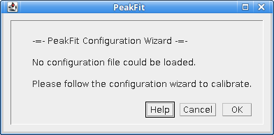

    Configuration Wizard 1: Introduction

.. index:: Configuration Wizard 2: Camera type

Configuration Wizard 2: Camera type
^^^^^^^^^^^^^^^^^^^^^^^^^^^^^^^^^^^

The second dialog (:numref:`Figure %s <fig_simple_fit_wizard_camera>`) of the wizard requests the camera type.

.. _fig_simple_fit_wizard_camera:
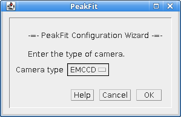

    Configuration Wizard 2: Camera Type

.. index:: Configuration Wizard 3: Pixel Pitch

Configuration Wizard 3: Pixel Pitch
^^^^^^^^^^^^^^^^^^^^^^^^^^^^^^^^^^^

The second dialog (:numref:`Figure %s <fig_simple_fit_wizard_pitch>`) of the wizard requests the pixel pitch.

.. _fig_simple_fit_wizard_pitch:
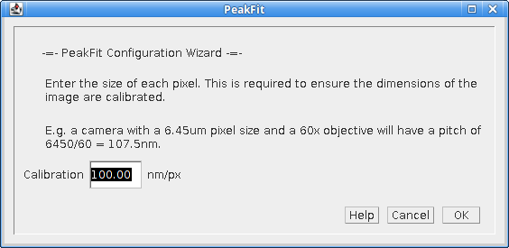

    Configuration Wizard 3: Pixel Pitch

.. index:: Configuration Wizard 4: Gain

Configuration Wizard 4: Gain
^^^^^^^^^^^^^^^^^^^^^^^^^^^^

The third dialog (:numref:`Figure %s <fig_simple_fit_wizard_gain>`) of the wizard requests the total gain.

.. _fig_simple_fit_wizard_gain:
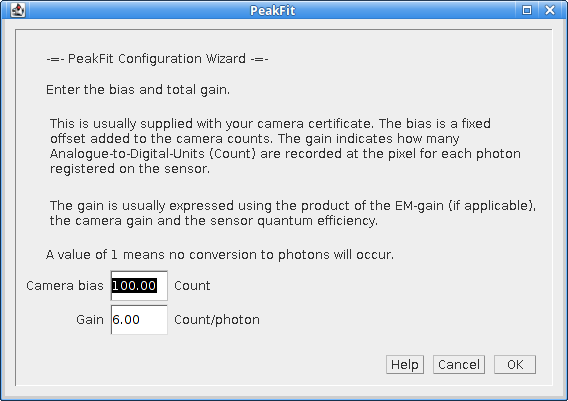

    Configuration Wizard 4: Gain

.. index:: Configuration Wizard 5: Exposure Time

Configuration Wizard 5: Exposure Time
^^^^^^^^^^^^^^^^^^^^^^^^^^^^^^^^^^^^^

The fourth dialog (:numref:`Figure %s <fig_simple_fit_wizard_exposure>`) of the wizard requests the exposure time.

.. _fig_simple_fit_wizard_exposure:
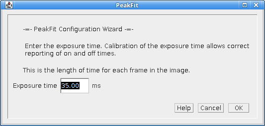

    Configuration Wizard 5: Exposure Time

.. index:: Configuration Wizard 6: Peak Width

Configuration Wizard 6: Peak Width
^^^^^^^^^^^^^^^^^^^^^^^^^^^^^^^^^^

The fifth dialog (:numref:`Figure %s <fig_simple_fit_wizard_width>`) of the wizard requests the expected peak width for the 2D Gaussian:

.. _fig_simple_fit_wizard_width:
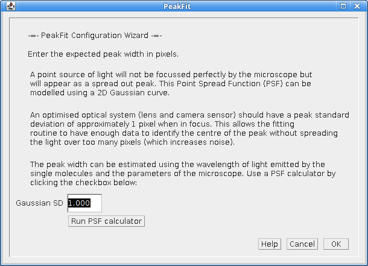

    Configuration Wizard 6: Peak Width

A button is provided which allows the user to run the :ref:`calibration_plugins:PSF Calculator`. The calculator will compute an expected Gaussian standard deviation using the microscope optics (see :numref:`Figure %s <fig_psf_calculator>`).

.. _fig_psf_calculator:
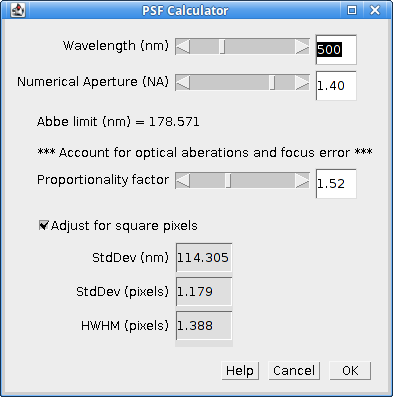

    PSF Calculator

The calculator uses the following formula:

.. math::

    \mathit{SD}=p\times 1.323\times {\frac{\lambda }{2\pi \mathit{NA}}}

Where:

.. list-table::
    :widths: 20 80
    :header-rows: 0

    * - *SD*
      - The standard deviation of the Gaussian approximation to the Airy pattern.

    * - :math:`\lambda`
      - The wavelength (in nm).

    * - *NA*
      - The Numerical Aperture.

    * - *p*
      - The proportionality factor. Using a value of 1 gives the theoretical lower bounds on the peak width. However the microscope optics are not perfect and the fluorophore may move on a small scale so the fitted width is often wider than this limit. The factor of 1.52 in the calculator matches the results obtained from the ``PSF Estimator`` plugin on many calibration images made with the GDSC optical set-up.

When the configuration wizard is finished the user is presented with the ``Simple Fit`` dialog shown in :numref:`Figure %s <fig_simple_fit_dialog>`.

Note that the settings are saved when the ``OK`` button is pressed in the ``Simple Fit`` dialog. This action will reset all fitting settings to the defaults and update the calibration using the values collected in the wizard. If any dialog is cancelled the user will be forced to go through the wizard again the next time they run the plugin.

.. index:: Fitting Images

Fitting Images
~~~~~~~~~~~~~~

The plugin must be run when a single-molecule image is the currently active window in ``ImageJ``. Each frame of the image will be analysed and the localisations recorded in a table and/or drawn on a high resolution image reconstruction.

The fitting is performed using multi-threaded code with a thread analysing each frame. Consequently results can appear out-of-order in the results table.

The plugin dialog has a simple appearance as shown in :numref:`Figure %s <fig_simple_fit_dialog>`.

.. _fig_simple_fit_dialog:
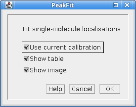

    Simple Fit dialog

Parameters
~~~~~~~~~~

The plugin offers the following parameters.

.. list-table::
   :widths: 20 80
   :header-rows: 1

   * - Parameter
     - Description

   * - Use current calibration
     - If selected use the current SMLM configuration. Otherwise run the configuration wizard.

       This option is only shown if a SMLM configuration file can be found. If no file is found then the configuration wizard is run by default.

   * - Show table
     - Show a table containing the localisations.

   * - Show image
     - Show a super-resolution image of the localisations. The image will be 1024 pixels on the long edge. Note that the plugin will run if no output options are selected. This is because the fitting results are also stored in memory. The results can be accessed and manipulated using the :ref:`results_plugins:Results Plugins`.

It is possible to stop the fitting process using the ``Escape`` key. All current results will be kept but the fitting process will end.

..
  No index

Advanced Settings
~~~~~~~~~~~~~~~~~

The ``Simple Fit`` plugin is a simplified interface to the ``Peak Fit`` plugin that uses default values for fitting parameters. All the fitting parameters can be adjusted only by using the ``Peak Fit`` plugin. Since the ``Simple Fit`` plugin resets the SMLM configuration file to the fitting defaults when the ``Peak Fit`` plugin is run immediately after the ``Simple Fit`` plugin the results will be the same. This allows the user to reset the fitting parameters with ``Simple Fit`` and then repeatedly make changes to the parameters with the ``Peak Fit`` plugin to see how the results are affected. This can be a useful learning tool to experiment with the fitting parameters.

.. index:: ! Peak Fit

Peak Fit
--------

Finds all the candidate maxima in an image and fits them using a 2D Gaussian. The ``Peak Fit`` dialog is shown in :numref:`Figure %s <fig_peak_fit_dialog>`.

.. _fig_peak_fit_dialog:
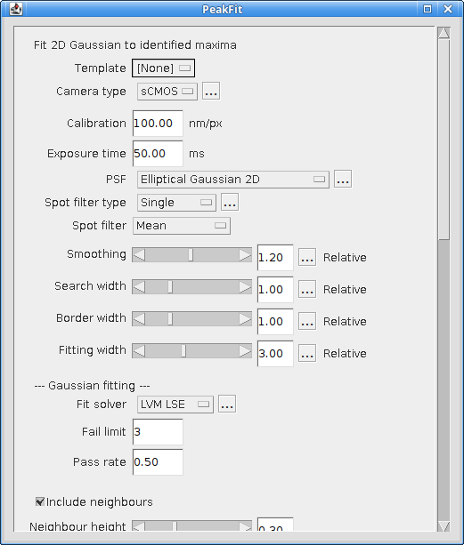

    Peak Fit dialog

Note that the dialog contains many settings and a scroll bar is used to fit the dialog to the screen size. Some fields have additional options that are accessed by clicking the ``...`` button to show a dialog. The additional options dialog will not show if the currently selected value in the field does not require additional configuration.

The plugin will initialise using the previously selected settings or if absent a default set of settings will be created. Settings are saved when a dialog is accepted using the ``OK`` button. If a dialog is cancelled then the settings for that dialog are not saved.

If different settings will be regularly reused the plugin supports templates. These are managed using the ``Template Manager`` plugin (section :numref:`%s <fitting_plugins:Template Manager>`) and can be configured and saved using the ``Fit Configuration`` plugin (section :numref:`%s <fitting_plugins:Fit Configuration>`).

The dialog contains settings for the imaging conditions and then various parts of the fitting algorithm:

* Imaging Calibration
* Gaussian PSF
* Maxima Identification
* Fitting
* Multiple Peak Fitting
* Peak Filtering
* Results output

Each of the sections is described below.

**Note:**

The fitting algorithm is described in section :numref:`{number}: {name} <background:Localisation Fitting Method>`. Understanding the method will ensure that the parameters can be adjusted to achieve the desired fitting result. The ``Simple Fit`` plugin can be used to reset the fitting parameters to their defaults while preserving the current camera calibration.

.. index:: Imaging Calibration Parameters

Imaging Calibration Parameters
~~~~~~~~~~~~~~~~~~~~~~~~~~~~~~

The imaging parameters describe the conditions used to acquire the image. The pixel size is used to define distances in nm. The gain is used to convert the camera counts to photons.

.. list-table::
   :widths: 20 80
   :header-rows: 1

   * - Parameter
     - Description

   * - Camera type
     - Select the camera type.

       Additional options are configurable depending on the camera.

       See :numref:`{number}: {name} <fitting_plugins:Camera Type>`.

   * - Calibration (nm/px)
     - The size of the image pixels in nm.

   * - Exposure time (ms)
     - This is the length of time captured by each frame in milliseconds.

   * - Gain
     - The total gain. Used to convert the camera ADUs to photons.

.. index:: Camera Type

Camera Type
^^^^^^^^^^^

The camera type specifies the camera used to acquire the image data. Knowledge of the camera allows use of fit solvers that model the camera noise to improve fitting precision. The types of supported camera are:

.. list-table::
   :widths: 20 80
   :header-rows: 1

   * - Camera type
     - Description

   * - NA
     - Unknown camera type.

       Only a simple least squares model can be fit to the data.

   * - CCD
     - CCD camera.

   * - EMCCD
     - EM-CCD camera.

   * - sCMOS
     - sCMOS camera.

       Requires a per-pixel model of the camera.

Each camera supports a model where the image count represents the amount of photons that were captured by the area of the camera chip represented by a pixel.

The CCD camera and sCMOS camera use the following model:

.. math::

    \mathit{counts} = \mathit{photons} \times \mathit{QE} \times \mathit{gain} + \mathit{read\:noise} + \mathit{bias}

The EM-CCD camera uses the following model:

.. math::

    \mathit{counts} = \mathit{photons} \times \mathit{QE} \times \mathit{EM\:gain} \times \mathit{gain} + \mathit{read\:noise} + \mathit{bias}

Where:

.. list-table::
   :widths: 20 80

   * - *counts*
     - The camera counts.

   * - *photons*
     - The number of photons.

   * - *QE*
     - The quantum efficiency defining the average number of photons converted to electrons.

   * - *EM gain*
     - The electron multiplication (EM) gain defining the average increase in the number of electrons when passed through the EM amplication.

   * - *gain*
     - The gain defining the average number of counts per electron.

   * - *read noise*
     - The spurious noise caused by the conversion of electrons to counts.

   * - *bias*
     - The offset bias added to camera counts.

       Counts are always positive and so are represented in image files using unsigned integers. So that negative values can be recorded (due to noise) an offset is added to all counts. This allows the noise to be analysed and modelled.

When fitting image data the individual components factors that convert photons to counts can be combined to a total gain:

.. math::

    \mathit{total\:gain} &= \mathit{QE} \times \mathit{gain} \\
    &= \mathit{QE} \times \mathit{EM\:gain} \times \mathit{gain}

This creates a simplified model:

.. math::

    \mathit{counts} = \mathit{photons} \times \mathit{total\:gain} + \mathit{read\:noise} + \mathit{bias}

For ``EM-CCD`` and ``CCD`` camera which use a common system to amplify electrons these values are global. In this case a bias (offset zero level) is not always needed since the fitting process fits the background which will include the bias offset. The number of photons in the peak can then be calculated without needing to know the camera bias. This is applicable to the least squares fitting methods. If maximum likelihood fitting is used then the bias is required to accurately model the probability of the counts and the plugin will prompt the user to enter it.

For ``sCMOS`` cameras each pixel has its own readout electronics and a per pixel model is required. The model stores a gain, noise and bias for each pixel in the camera.

The gain and bias of a CCD-type camera can be analysed using the ``Mean-Variance Test`` plugins (see :numref:`%s <calibration_plugins:Mean-Variance Test>` and :numref:`%s <calibration_plugins:Mean-Variance Test (EM-CCD)>`). The sCMOS camera model can be created using the ``sCMOS Analysis`` plugin (see :numref:`%s <calibration_plugins:sCMOS Analysis>`) and administered using the ``Camera Model Manager`` plugin (see :numref:`%s <calibration_plugins:Camera Model Manager>`).

.. index:: Gaussian PSF Parameters

Gaussian PSF Parameters
~~~~~~~~~~~~~~~~~~~~~~~

The point spread function (PSF) of the microscope is approximated using a 2D Gaussian function. The Gaussian can have the same width in the X and Y dimensions or separate widths. If the widths are different then the Gaussian will be elliptical in shape. In this case the ellipse can be rotated by an angle. The parameters allow the initial shape of the Gaussian PSF to be specified. These parameters are only an initial guess and the Gaussian shape will be optimised to fit each identified spot in the image.

The following PSF models can be selected.

.. list-table::
   :widths: 20 80
   :header-rows: 1

   * - Gaussian PSF
     - Description

   * - Circular
     - Use a single width for the X and Y dimensions.

       The ``Circular`` PSF offers the option to use fixed width fitting where the PSF width will not be fit. This can be used when the PSF width is known to be approximately constant, for example in `TIRF <https://en.wikipedia.org/wiki/Total_internal_reflection_fluorescence_microscope>`_ microscopy.

   * - Elliptical
     - Use a separate width for the X and Y dimensions.

   * - Rotating
     - Use a separate width for the X and Y dimensions and allow the orientation to rotate.

   * - Astigmatic
     - Use a z-depth parameter to model the width for the X and Y dimensions.

       Requires that an astigmatism model has been configured. See section :numref:`{number}: {name} <model_plugins:Astigmatism Model Manager>`.

       *This option is experimental and should not be used for 3D analysis*.

The parameters for the PSF are configured by pressing the ``...`` button to open the PSF options configuration. Note that the Gaussian function widths are defined in units of pixels and the rotation angle in degrees.

.. index:: Astigmatic PSF Model

Astigmatic PSF Model
^^^^^^^^^^^^^^^^^^^^

The ``Astigmatic`` PSF model is experimental. The performance of the model is highly variable and the results should not be used with confidence. Fitting is very sensitive to the initial estimated z-position; currently the estimation algorithm for selecting the initial fit parameters is not good enough to allow high confidence in the results.

.. index:: Maxima Identification Parameters

Maxima Identification Parameters
~~~~~~~~~~~~~~~~~~~~~~~~~~~~~~~~

The maxima identification parameters control the search for local maxima in the image. These are spot candidates that will be fit using the chosen PSF. Note that the ``Smoothing``, ``Search Width``, ``Border Width`` and ``Fitting Width`` parameters are factors applied to the Gaussian function width. They have no units.

.. list-table::
   :widths: 20 80
   :header-rows: 1

   * - Parameter
     - Description

   * - Spot filter type
     - The type of filter to use. The default is a ``Single`` filter.

       If a ``Difference`` or ``Jury`` filter is selected then the plugin will present an additional dialog to configure each additional spot filter. See section :numref:`{number}: {name} <fitting_plugins:Spot Filter Type>`.

   * - Spot filter
     - The name of the first spot filter:

       * ``Mean``: Compute the mean in a square region. The region can be any size and is not limited to integer pixel counts. Internal pixels are weighted 1; the outer edge pixels are given a weight <= 1 based on interpolating the region size.

       * ``Block mean``: Compute the mean in a square region. The region is rounded to integer pixels.

       * ``Circular mean``: Compute the mean in an approximate circular region. The circle is drawn using square pixels. To see the circle mask use ``Process > Filters > Show Circular Masks...``

       * ``Gaussian``: Perform Gaussian convolution. The total region width around each point that is used will be 2n+1 with :math:`n=\lceil{1.84\sigma}\rceil` where :math:`\lceil{x}\rceil` is the ceiling function and :math:`\sigma` is the ``smoothing`` parameter multiplied by the estimated PSF width. This matches the minimum accuracy (smallest recommended) Gaussian kernel filter in ``ImageJ``.

       * ``Median``: Compute the median in a square region. The region is rounded to integer pixels.

       If a ``Difference`` or ``Jury`` filter is selected then additional spot filters can be configured to be used in combination.

   * - Smoothing
     - Controls the size of the first smoothing filter as:

       :math:`\mathit{Smooth} = \mathit{Initial\:StdDev} \times \mathit{Smoothing}`

       Filtering can be disabled using a ``Smoothing`` value of 0.

   * - Search Width
     - Controls the size of the region used for finding local maxima:

       :math:`\mathit{Width} = \lfloor{\mathit{Initial\:StdDev} \times \mathit{Search\:Width}}\rfloor`

       Note: Ideally localisation spots should be well separated (over 5 pixels) and so increasing this parameter will reduce the number of false maxima identified as spot candidates by eliminating noisy pixels.

   * - Border
     - Define the number of border pixels to ignore. No maxima are allowed in the border.

       :math:`\mathit{Width} = \lfloor{\mathit{Initial\:StdDev} \times \mathit{Border}}\rfloor`

   * - Fitting Width
     - Controls the size of the region used for fitting each peak.

       :math:`\mathit{Width} = \lfloor{\mathit{Initial\:StdDev} \times \mathit{Fitting\:Width}}\rfloor`

       The width should be large enough to cover a localisation spot so the function can fit the entire spot data. 3 standard deviations should cover 99% of a Gaussian function.

.. index:: Spot Filter Type

Spot Filter Type
^^^^^^^^^^^^^^^^

The ``Peak Fit`` plugin can perform initial filtering on the image using a ``Single``, ``Difference`` or ``Jury`` filter. The filtered image is then analysed for local maxima. The purpose is to remove noise from the image to prevent identification of false candidate maxima that waste time during the fitting process and may create bad localisation data.

A ``Single`` filter will process the image once with the selected filter.

A ``Difference`` filter will process the image twice with the two configured filters. The second filtered image is then subtracted from the first. This acts as a band-pass filter that allows any frequency between the two filters to pass but removes the other frequencies. For example a PSF with an approximate standard deviation of 1 could be filtered with a difference of Gaussians filter using filter standard deviations of 0.5 and 2.

The ``Difference`` filter is useful when there is a large background variation in the image since the subtraction of the second image is performing a local background subtraction. The spots are then ranked using their relative height over background. This would rank a spot with a height of 10 over a background of 50 as lower than a spot with a height of 30 over a background of 20. In contrast the ``Single`` filter would put the height 10 spot first as its total height is 60 compared to 50 for the other brighter spot. Since spots are processed in rank order until failure this would change the order of fitting when using a ``Single`` or ``Difference`` filter, and may dramatically change fitting results.

A ``Jury`` filter will apply many filters to the image. Each filtered image is used to identify maxima. The pixel value from the filtered image from each maxima is added to a sum image. When all filters have been processed the maxima are then identified in the sum image. The ``Jury`` filter is therefore finding maxima in a combined image composed of pixels that are maxima. Analysis of simple ``Jury`` filters has shown that they have high recall but lower precision than single filters (e.g. a ``Single`` Mean with smoothing 1.3 verses a ``Jury`` of Mean 1, Mean 2 and Mean 3).

The ``Jury`` filter is experimental and is not recommended. It is not performing a true `scale space <https://en.wikipedia.org/wiki/Scale_space>`_ feature detector.

.. index:: Fitting Parameters

Fitting Parameters
~~~~~~~~~~~~~~~~~~

The fitting parameters control the fitting algorithm. Fitting is performed on each candidate spot in turn in ranked order. The ranking is based on the estimated strength of the spot signal. To increase speed fitting can be stopped before all candidates have been processed. This avoids fitting low quality spots that are likely to be rejected by the spot filtering parameters.

.. list-table::
   :widths: 20 80
   :header-rows: 1

   * - Parameter
     - Description

   * - Fit Solver
     - Specify the method used to fit the maxima.

       *   ``LVM LSE``: Use a Levenberg-Marquardt (LVM) least squares estimator (LSE). This has no noise model.

       *   ``LVM MLE``: Use a Levenberg-Marquardt (LVM) maximum likelihood estimator (MLE). The probability model uses Poisson shot noise.

       *   ``LVM WLSE``: Use a Levenberg-Marquardt (LVM) weighted least squares estimator (WLSE). The probability model uses Poisson shot noise and Gaussian read noise.

       *   ``MLE``: Use maximum likelihood estimation. The probability model is configurable and can use Poisson shot noise, EM-gain amplification noise and Gaussian read noise. This is not a gradient based solver and is slow.

       *   ``Fast MLE``: Use a fast Newton-Raphson gradient based maximum likelihood estimation (MLE). The probability model uses Poisson shot noise and Gaussian read noise.

       Each ``Fit Solver`` requires further parameters that are collected in a separate dialog.

   * - Fail Limit
     - Stop processing the image frame when more than N *consecutive* candidates are rejected. The candidate may be rejected due to a failure to fit the PSF or due to the PSF filter parameters.

       Set to negative to disable. Zero will stop at the first failure.

   * - Pass rate
     - Stop processing the image frame when the fraction of successful candidates is below the pass rate. E.g. set to 0.5 to stop processing when less than 50% of the candidates are successful. Note: The pass rate is only evaluated when 5 candidates have been processed to allow a fraction to be computed.

       Set to ``0`` to disable.

If the ``Fail limit`` and ``Pass rate`` are both disabled then all candidates in the frame will be processed.

.. index:: Gaussian PSF Equation

Gaussian PSF Equation
^^^^^^^^^^^^^^^^^^^^^

The following equation specifies the elliptical 2D Gaussian (named ``Rotating Elliptical`` in the ``PSF`` options):

.. math::

    u_k(x,y)=B+\frac{\mathit{Signal}}{2\pi \sigma _{x}\sigma_{y}}e^{-a(x-x_{0})^{2}-2b(x-x_{0})(y-y_{0})+c(y-y_{0})^{2}}

where

.. math::

    \left[\begin{matrix}a&b\\b&c\end{matrix}\right]

is positive-definite and

.. math::

    a=\frac{\cos ^{2}\theta }{2\sigma _{x}^{2}}+\frac{\sin ^{2}\theta}{2\sigma _{y}^{2}}

.. math::

    b=-{\frac{\sin ^{2}2\theta }{4\sigma _{x}^{2}}}+\frac{\sin ^{2}2\theta}{4\sigma _{y}^{2}}

.. math::

    c=\frac{\sin ^{2}\theta }{2\sigma _{x}^{2}}+\frac{\cos ^{2}\theta}{2\sigma _{y}^{2}}

with

.. list-table::
    :widths: 20 80

    * - :math:`u_k(x,y)`
      - The expected value in the *k*\ :sup:`th` pixel.

    * - :math:`B`
      - The background level.

    * - :math:`\mathit{Signal}`
      - The total volume of the Gaussian.

    * - :math:`x_0`
      - The X centre of the Gaussian.

    * - :math:`y_0`
      - The Y centre of the Gaussian.

    * - :math:`\sigma_x`
      - The X standard deviation.

    * - :math:`\sigma_y`
      - The Y standard deviation.

    * - :math:`\theta`
      - The angle of rotation of the ellipse.

Note that the function is using a single point in the Gaussian 2D to represent the value of the area of a pixel.

If :math:`\theta` is zero this reduces to an elliptical 2D Gaussian with no rotation (named ``Elliptical`` in the ``PSF`` options). This is modelled using an integral over the area of the pixel [Smith *et al*, 2010]:

.. math::

    u_k(x,y) = B + \mathit{Signal} \times \Delta E_x(x,y) \times \Delta E_y(x,y)

with

.. list-table::
    :widths: 20 80

    * - :math:`u_k(x,y)`
      - The expected value in the *k*\ :sup:`th` pixel.

    * - :math:`B`
      - The background level.

    * - :math:`\mathit{Signal}`
      - The total volume of the Gaussian.

    * - :math:`\Delta E_x(x,y)`
      - The integral of the Gaussian 2D function over the x-dimension.

        :math:`\Delta E_x(x,y) = \frac{1}{2} \text{erf} (\frac{x - x_0 + \frac{1}{2}}{2 \sigma_x^2}) - \frac{1}{2} \text{erf} (\frac{x - x_0 - \frac{1}{2}}{2 \sigma_x^2})`

        with :math:`\text{erf}` the Error function, :math:`x_0` the Gaussian x centre, :math:`\sigma_x^2` the Gaussian standard deviation in the x-dimension.

    * - :math:`\Delta E_y(x,y)`
      - The integral of the Gaussian 2D function over the y-dimension.

        :math:`\Delta E_y(x,y) = \frac{1}{2} \text{erf} (\frac{y - y_0 + \frac{1}{2}}{2 \sigma_y^2}) - \frac{1}{2} \text{erf} (\frac{y - y_0 - \frac{1}{2}}{2 \sigma_y^2})`

        with :math:`\text{erf}` the Error function, :math:`y_0` the Gaussian y centre, :math:`\sigma_y^2` the Gaussian standard deviation in the y-dimension.

Note that the error function of the Gaussian 2D function can be computed at intervals of 1 pixel and the integral for each pixel computed by subtracting successive values of the series. The formulation exploits the (x,y) separability of the 2D Gaussian and is efficiently computed.

The ``Circular`` Gaussian in the ``PSF`` options is computed by using :math:`\sigma_x = \sigma_y`.

The ``Astigmatic`` Gaussian in the ``PSF`` options uses a z-dependent standard deviation from Smith, *et al* (2010) based on Holtzer *et al*, (2007):

.. math::

    \sigma_x(z) = \sigma_{0x} + \sqrt{1 + \frac{(z-\gamma)^2}{d^2} + A_x \frac{(z-\gamma)^3}{d^2} + B_x \frac{(z-\gamma)^4}{d^2} }

    \sigma_y(z) = \sigma_{0y} + \sqrt{1 + \frac{(z+\gamma)^2}{d^2} + A_y \frac{(z+\gamma)^3}{d^2} + B_y \frac{(z+\gamma)^4}{d^2} }

with

.. list-table::
    :widths: 20 80

    * - :math:`A_x, B_x, A_y, B_y`
      - Empirical constants.

    * - :math:`\gamma`
      - The gamma parameter (half the distance between the focal planes).

    * - :math:`d`
      - The depth of focus.

These constants must be fit using a sample image from the microscope. This can be done using the ``Astigmatism Model Manager`` plugin (see section :numref:`%s <model_plugins:Astigmatism Model Manager>`).

For all the PSF functions gradients are available for the function parameters allowing gradient based function solvers.

**Note:**

A previous of the software did not fit the Gaussian volume (signal) but the height of the Gaussian (amplitude). To convert the signal to the amplitude use the following conversion:

.. math::

    \mathit{Amplitude}=\frac{\mathit{Signal}}{2\pi \sigma _{x}\sigma _{y}}

.. index:: Fit Solvers

Fit Solvers
~~~~~~~~~~~

There are various fit solvers available in ``Peak Fit``. Each solver aims to find the best parameters to optimise the cost function value. All solvers have the following parameters:

.. list-table::
   :widths: 20 80
   :header-rows: 1

   * - Parameter
     - Description

   * - Relative threshold
     - The threshold below which a relative change in the function value terminates fitting.

       Set to ``0`` to disable.

   * - Absolute threshold
     - The threshold below which an absolute change in the function value terminates fitting.

       Set to ``0`` to disable.

   * - Max Iterations
     - Stop the fit when this is reached and return a failure.

Note that if no termination conditions for the solver exist (all have been disabled) then an error is shown.

Additional parameters for each solver are outlined in the following sections.

.. index:: Least Squares Estimation

Least Squares Estimation
^^^^^^^^^^^^^^^^^^^^^^^^

Least-squares estimation is the processes of fitting a function (expected values) to a set of observed values. The fit attempts to minimise the sum of the squared difference:

.. math::

    \mathit{SS} = \sum_{i=1}^N (f_i - g_i)^2

where :math:`f_i` is the value of the PSF function at pixel *i* and :math:`g_i` is the actual image intensity at pixel *i*. This model does not require any camera calibration and is available if the camera type is unknown.

The parameters for the function are updated until no improvement can be made. The estimation process uses the popular Levenberg-Marquardt (LVM) algorithm which uses the gradient of the function, i.e. how the function value will change with a change to the parameters, to choose how to modify the parameters. The method using a weighting factor (``lambda``) to decide the emphasis on the Hessian matrix of partial derivatives. This is a matrix of the gradient of the function with respect to two parameters for all combinations of parameters. The ``lambda`` parameter is updated by the algorithm based on the success of parameter changes.

The ``LVM LSE`` requires the following additional parameters:

.. list-table::
   :widths: 20 80
   :header-rows: 1

   * - Parameter
     - Description

   * - Parameter relative threshold
     - The threshold below which a relative change in the parameter values terminates fitting.

       Set to ``0`` to disable.

   * - Parameter absolute threshold
     - The threshold below which an absolute change in the parameter values terminates fitting.

       Set to ``0`` to disable.

   * - Lambda
     - The initial lambda for the Levenberg-Marquardt algorithm. Higher favours the gradients of the parameters. Lower favours the Hessian matrix gradients (second partial derivatives). Lower is used when very close to the solution.

       Note that the algorithm updates the lambda during fitting to refine the improvement to the fit. A value of 10 is a good initial value.

   * - Use clamping
     - Attenuate the update :math:`U_k` to the parameter values :math:`a_k` at each step using the following formula to apply the update [Stetson, 1987]:

       :math:`a_k(new) = a_k(old) + \frac{U_k}{(1 + \frac{|U_k|}{C_k})}`

       where :math:`C_k` is the parameter specific clamp value. When :math:`U_k = C_k` then half of the update is applied. This damps excessively large adjustment of the parameter values, for example moving the coordinates out of the fit region containing the localisation in a single step. Clamp values are configured using reasonable update steps for the Gaussian parameters, e.g. 1 pixel for coordinate changes. They can be configured if the ``Alt`` key is held down when running ``Peak Fit`` to enable extra options.

   * - Dynamic clamping
     - Applies when ``Use clamping`` is enabled.

       If the sign of the update :math:`U_k` changes then :math:`C_k` is first reduced by a factor of 2. This suppresses oscillations in the optimisation.

.. index:: LVM Maximum Likelihood Estimation

LVM Maximum Likelihood Estimation
^^^^^^^^^^^^^^^^^^^^^^^^^^^^^^^^^

The ``LVM MLE`` solver applies the Levenberg-Marquardt (LVM) algorithm to the optimisation of a maximum likelihood equation for Poisson distributed data [Lawrence and Chromy, 2010]. The maximum likelihood estimation optimises:

.. math::

    \chi_{\text{mle}}^2 = 2 \sum_{i=1}^N (f_i - g_i) - 2 \sum_{i=1,g_i \neq 0}^N g_i \ln \left( \frac{f_i}{g_i} \right)

where :math:`f_i` is the value of the PSF function at pixel *i* and :math:`g_i` is the actual image intensity at pixel *i* (in photons). Gaussian read noise for the pixel values may be incorporated into the model by adding the per-pixel variance (:math:`var`) to the observed and expected values [Lin *et al*, 2017]:

.. math::

    \chi_{\text{mle}}^2 = 2 \sum_{i=1}^N (f_i - g_i) - 2 \sum_{i=1,g_i+var_i \neq 0}^N (g_i + var_i) \ln \left( \frac{f_i + var_i}{g_i + var_i} \right)

The ``LVM MLE`` solver requires a camera calibration so that the bias can be subtracted and the observed values converted to photons. The solver can be applied to CCD-type cameras or sCMOS cameras using a per-pixel model.

The solver dialog will ask for the same parameters as the ``LVM LSE`` solver but in addition the current values of the camera calibration are displayed for verification and/or update.

.. index:: Weighted Least Squares Estimation

Weighted Least Squares Estimation
^^^^^^^^^^^^^^^^^^^^^^^^^^^^^^^^^

The weighted least-squares estimator uses the method of Ruisheng, *et al* (2017) to compute a modified Chi-squared expression assuming a Poisson noise model with Gaussian noise component. The fit attempts to minimise the weighted sum of the squared difference:

.. math::

    \chi^2 = \sum_{i=1}^N \frac{(f_i - g_i)^2}{\sigma_i^2}

where :math:`f_i` is the value of the PSF function at pixel *i* and :math:`g_i` is the actual image intensity at pixel *i* in photons. Note that weight :math:`\sigma_i` can have a destabilising effect on the sum by significantly over-weighting data. The weight is thus moderated to increase stability. The weight requires a Gaussian variance (*var*) for the pixel and is computed as:

.. math::

    \sigma_i^2 = \mathit{var}_i + \max(g_i, 1) + 1

The ``LVM WLSE`` solver requires a camera calibration so that the bias can be subtracted and the observed values converted to photons. The solver can be applied to CCD-type cameras or sCMOS cameras using a per-pixel model.

The solver dialog will ask for the same parameters as the ``LVM LSE`` solver but in addition the current values of the camera calibration are displayed for verification and/or update.

.. index:: Maximum Likelihood Estimation

Maximum Likelihood Estimation
^^^^^^^^^^^^^^^^^^^^^^^^^^^^^

Maximum Likelihood estimation is the processes of fitting a function (expected values) to a set of observed values by maximising the probability of the observed values. MLE requires that there is a probability model for each data point. The function is used to predict the expected value (E) of the data point and the probability model is used to specify the probability (likelihood) of the observed value (O) given the expected value. The total probability is computed by multiplying all the probabilities for all points together:

.. math::

    \mathit{likelihood}=\prod {p(O|E)}

or by summing their logarithms:

.. math::

    \mathit{log\:likelihood}=\sum {\ln (p(O|E))}

The maximum likelihood returns the fit that is the most probable given the model for the data. The following noise models are supported by ``Peak Fit``:

.. list-table::
   :widths: 30 70
   :header-rows: 1

   * - Model
     - Description

   * - Poisson
     - Model the Poisson shot noise of photon signal.

   * - Poisson-Gaussian
     - Model the Poisson shot noise of photon signal and the Gaussian read noise of each pixel.

   * - Poisson-Gamma-Gaussian
     - Model the Poisson shot noise of photon signal, the Gamma noise of EM amplification and the Gaussian read noise of each pixel.

.. index:: Poisson Noise Model

Poisson Noise Model
"""""""""""""""""""

This model is suitable for modelling objects with a lot of signal. In this case the read noise is not significant and any EM amplification for EM-CCD cameras is well approximated by a Poisson.

The standard model for the image data is a Poisson model. This models the fluctuation of light emitted from a light source (photon shot noise). This is based on the fact that gaps between individual photons can vary even though the average emission rate of the photons is constant. The Poisson model will work when the amount of shot noise is much higher than all other noise in the data, i.e. when the localisations are very bright. If the other noise is significant then a more detailed model is required.

The Poisson probability model is:

.. math::

    p(k|\lambda )=\frac{\lambda ^{k}}{k!}\operatorname{e}^{-\lambda }

with
*k* equal to the pixel count and
*λ* equal to the expected pixel count.
Note that when we take a logarithm of this we can remove the factorial since it is constant and will not affect optimising the sum:

.. math::

    \ln (p(k|\lambda )) &= \ln (\frac{\lambda^{k}}{k!}\operatorname{e}^{-\lambda }) \\
    &= \ln(\frac{\lambda ^{k}}{k!})+\ln (\operatorname{e}^{-\lambda }) \\
    &= \ln (\lambda ^{k})-\ln (k!)-\lambda \\
    &= k\ln (\lambda)-\lambda

The final log-likelihood function is fast to evaluate and since it can be differentiated the formula can be used with derivative based function solvers.

.. index:: Poisson-Gaussian Noise Model

Poisson-Gaussian Noise Model
""""""""""""""""""""""""""""

This model is suitable for modelling a standard CCD camera.

This model accounts for the photon shot noise and the read noise of the camera, i.e. when the number of electrons is read from the camera chip there can be mistakes. The read noise is normally distributed with a mean of zero.

The two noise distributions can be combined by convolution of a Poisson and a Gaussian function to the produce the following model:

.. math::

    p(k|\lambda ,\sigma )=\sum _{n=0}^{\infty }{\frac{1}{n!}\lambda^{n}\operatorname{e}^{-\lambda }\times {\frac{1}{\sqrt{2\pi }\sigma}\operatorname{e}^{-{\frac{1}{2\sigma ^{2}}(x-n)^{2}}}}}

with
*k* equal to the pixel count,
*λ* equal to the expected pixel count and
*σ* equal to the standard deviation of the Gaussian read noise. This model is evaluated using a saddle-point approximation as described in Snyder *et al* (1995); the implementation is adapted from the authors example source code.

No gradient is available for the function and so non-derivative based methods must be used during fitting.

.. index:: Poisson-Gamma-Gaussian Noise Model

Poisson-Gamma-Gaussian Noise Model
""""""""""""""""""""""""""""""""""

This model is suitable for modelling a Electron Multiplying (EM) CCD camera.

This model accounts for the photon shot noise, the electron multiplication gain of the EM register and the read noise of the camera. The EM-gain is modelled using a Gamma distribution. The read noise is normally distributed with a mean of zero.

The convolution of the Poisson and Gamma distribution can be expressed as:

.. math::

    G_{p,m}(c)=\operatorname{e}^{-p}\delta(c)+\sqrt{\frac{p}{\mathit{cm}}}\operatorname{e}^{-{\frac{c}{m}}-p}\mathit{BesselI}_{1}(2\sqrt{\frac{\mathit{cp}}{m}})

where:

.. list-table::
    :widths: 20 80

    * - :math:`p`
      - The average number of photons.

    * - :math:`m`
      - The EM-gain multiplication factor.

    * - :math:`c`
      - The observed pixel count.

    * - :math:`\delta(c)`
      - The Dirac delta function (1 when c=0, 0 otherwise).

    * - :math:`\mathit{BesselI}_1`
      - Modified Bessel function of the 1\ :sup:`st` kind.

    * - :math:`G_{p,m}(c)`
      - The probability of observing the pixel count *c*.

This is taken from Ulbrich and Isacoff (2007). The output of this function is subsequently convolved with a Gaussian function with standard deviation equal to the camera read noise and mean zero. This must be done numerically since no algebraic solution exists. However Mortensen *et al* (2010) provide example code that computes an approximation to the full convolution using the Error function to model the cumulative Gaussian distribution applied to the Poisson-Gamma convolution at low pixel counts. This approximation closely matches the full convolution with a Gaussian but is faster to compute.

No gradient is available for the function and so non-derivative based methods must be used during fitting.

Parameters
""""""""""

The ``MLE`` solver requires a camera calibration so that the bias can be subtracted and the observed values converted to photons. The solver can be applied to CCD-type cameras. A per-pixel model is not currently supported (sCMOS cameras).

The Maximum Likelihood Estimator requires the following additional parameters:

.. list-table::
   :widths: 20 80
   :header-rows: 1

   * - Parameter
     - Description

   * - Camera Bias
     - The value added to all pixels by the camera.

   * - Model camera noise
     - Select this option to model the camera noise (read noise and EM-gain (if applicable)). If unselected the MLE will use the Poisson noise model.

   * - Read noise
     - The camera read noise (in camera counts). Only applicable if using ``Model Camera Noise``.

   * - Quantum efficiency
     - The number of electrons created in the camera per photon.

       This is used to convert the gain in units of count/photon to the camera gain in count/electron for modelling the EM gain. It is a setting used when fitting simulated data that explicitly modelled EM amplification separately from photon to electron conversion. In the majority of cases this can be ignored using a value of ``1``.

   * - EM-CCD
     - Select this if using an EM-CCD camera. The Poisson-Gamma-Gaussian function will be used to model camera noise. The alternative is the Poisson-Gaussian function. Only applicable if using ``Model Camera Noise``.

   * - Search method
     - The search method to use. It is recommended to use the Powell algorithm for any model. The BFGS algorithm is a good alternative for the Poisson noise model.

       The methods are detailed in section :numref:`{number}: {name} <fitting_plugins:Search Methods>`.

   * - Max function evaluations
     - The maximum number of times to evaluate the function before fitting terminates.

       This is applicable to many of the ``Search method`` options which may evaluate the function multiple times during a single iteration.

.. index:: Search Methods

Search Methods
^^^^^^^^^^^^^^

Brief notes on the different algorithms and where to find more information are shown below for completeness. It is recommended to use the ``Powell`` or ``BFGS`` methods.

Note that some algorithms support a bounded search. This is a way to constrain the values for the parameters to a range, for example keep the XY coordinates of the localisation within the pixel region used for fitting. When using a bounded search the bounds are set at the following limits:

* The lower bounds on the background and signal are set at zero. The upper bounds are set at the maximum pixel value for the background and twice the sum of the data for the signal.

* The coordinates are limited to the range of the fitted data.

* The width is allowed to change by a value of 2-fold from the initial standard deviation.

.. index:: Powell Bounded

Powell (Bounded)
""""""""""""""""

Search using `Powell's conjugate direction method <https://en.wikipedia.org/wiki/Powell%27s_method>`_. The ``Powell`` method uses an unrestricted parameter space. This variation puts hard limits on the parameters so that the optimisation does not drift into invalid parameters (e.g. negative signal or background).

This method does not require derivatives. It is the recommended method for the camera noise models.

.. index:: Powell

Powell
""""""

Search using `Powell's conjugate direction method <https://en.wikipedia.org/wiki/Powell%27s_method>`_.

This method does not require derivatives.

.. index:: Powell Adapter

Powell (Adapter)
""""""""""""""""

Search using Powell's conjugate direction method using a mapping adapter to ensure a restricted search on the parameter space.

This method maps the parameters from a bounded space to infinite space and then uses the Powell method.

.. index:: BOBYQA

BOBYQA
""""""

Search using Powell's Bound Optimisation BY Quadratic Approximation (`BOBYQA <https://en.wikipedia.org/wiki/BOBYQA>`_) algorithm.

BOBYQA could also be considered as a replacement of any derivative-based optimiser when the derivatives are approximated by finite differences. This is a bounded search.

This method does not require derivatives.

.. index:: CMAES

CMAES
"""""

Search using active Covariance Matrix Adaptation Evolution Strategy (`CMA-ES <https://en.wikipedia.org/wiki/CMA-ES>`_). The CMA-ES is a reliable stochastic optimization method which should be applied if derivative-based methods, e.g. conjugate gradient, fail due to a rugged search landscape. This is a bounded search and does not require derivatives.

Conjugate Gradient
"""""""""""""""""""

Search using a `non-linear conjugate gradient optimiser <https://en.wikipedia.org/wiki/Conjugate_gradient_method>`_. Two variants are provided for the update of the search direction: Fletcher-Reeves and Polak-Ribière, the later is the preferred option due to improved convergence properties.

This is a bounded search using simple truncation of coordinates at the bounds of the search space. Note that this method has poor robustness (fails to converge) on test data and is not recommended.

This method requires derivatives.

.. index:: BFGS

BFGS
""""

Search using a Broyden-Fletcher-Goldfarb-Shanno (`BFGS <https://en.wikipedia.org/wiki/Broyden–Fletcher–Goldfarb–Shanno_algorithm>`_) gradient optimiser.

This method requires derivatives. This is a good alternative to the Powell method for the Poisson noise model.

.. index:: Fast Maximum Likelihood Estimation

Fast Maximum Likelihood Estimation
^^^^^^^^^^^^^^^^^^^^^^^^^^^^^^^^^^

The fast maximum likelihood estimator uses the method of Smith, *et al* (2010) to compute a Newton-Raphson update step for each of the parameters :math:`\theta_i`. The fit attempts to perform Newton-Raphson root finding to locate the root (zero) of the log-likelihood gradient function:

.. math::

    \frac{\delta \ln(L(\overrightarrow{x}|\theta)}{\delta \theta_i} = \sum_k \frac{\delta u_k(x,y)}{\delta \theta_i} \left(\frac{x_k}{u_k(x,y)} -1 \right)

where :math:`\overrightarrow{x}` are the pixel values, :math:`u_k(x,y)` is the integral of the PSF function at pixel *k* (see :numref:`%s <fitting_plugins:Gaussian PSF Equation>`) and :math:`x_k` is the actual image intensity at pixel *k* in photons.

The update to each parameter requires the first and second partial derivatives of the PSF function and is computed as:

.. math::

    \theta_{i+1} \rightarrow \theta_i + & \left[ \sum_k \frac{\delta u_k(x,y)}{\delta \theta_i} \left(\frac{x_k}{u_k(x,y)} -1 \right) \right] \times \\
    & \left[ \sum_k \frac{\delta^2 u_k(x,y)}{\delta \theta_i^2} \left(\frac{x_k}{u_k(x,y)} -1 \right) - \frac{\delta u_k(x,y)^2}{\delta \theta_i} \frac{x_k}{u_k(x,y)^2} \right]^{-1}

The ``Fast MLE`` solver converges quadratically when close to the solution. It requires a good initial estimate of the function parameters otherwise the update steps can cause excessively large adjustment of the parameter values and the iteration is unrecoverable. Parameter clamping can reduce this issue.

The ``Fast MLE`` solver requires a camera calibration so that the bias can be subtracted and the observed values converted to photons. The solver can be applied to CCD-type cameras or sCMOS cameras using a per-pixel model.

The solver dialog will ask for the same parameters as the ``LVM LSE`` solver but in addition the current values of the camera calibration are displayed for verification and/or update. The following parameters are specific to this solver:

.. list-table::
   :widths: 20 80
   :header-rows: 1

   * - Parameter
     - Description

   * - Fixed iterations
     - Set to **true** to perform a fixed number of iterations (specified with the ``Max iterations`` parameter). This eliminates the requirement to evaluate the log-likelihood function value increasing speed if the number of iterations is close to the number used during conventional convergence.

       Fixed iterations was used by Smith, *et al* (2010) with a fit region of size :math:`2 \times 3 \sigma_{\text{PSF}} + 1` and ten iterations.

   * - Line search method
     - This option provides control over the update step. Given that the first order derivative is known for each parameter the recommended direction for the step is down the gradient. If the computed update is in the opposite direction then the search can:

       * ``None``: Take the computed step.
       * ``Ignore``: Ignore a step computed in the 'wrong' direction for a given parameter.
       * ``Partial ignore``: Progressively ignore any search direction that is in the opposite direction to the first derivative gradient. Do this in order of the magnitude of the error until the combined slope direction is correct.

       Note: If all updates are ignored then there is no step and the iteration stops. This may be undesirable.

.. index:: Which Fit Solver to Choose

Which Fit Solver to Choose
^^^^^^^^^^^^^^^^^^^^^^^^^^

.. list-table:: Recommended Fit Solvers
   :widths: 20 20 40
   :header-rows: 1

   * - Camera
     - Signal/Noise
     - Fit Solver

   * - Unknown
     - n/a
     - ``LVM LSE``

   * - Any
     - High
     - ``LVM MLE``

   * - CCD/sCMOS
     - Low
     - ``LVM MLE``

   * - EM-CCD
     - Very Low
     - ``MLE`` with modelling of camera noise

The most general fit solver is the least-squares estimator (``LVM LSE``). It does not require any specific information about the camera to perform fitting. For this reason this is the default fitting engine. It is also the fastest method.

Maximum likelihood estimation (MLE) should return a solution that is more precise than least-squares estimation, i.e. has less variation between the fitted result and the actual answer. MLE should be operating at the theoretical limit for fitting given how much information is actually present in the pixels. This limit is the Cramér-Roa lower bound which expresses a lower bound on the variance of estimators of a deterministic parameter. MLE has also been proven to be robust to the position of the localisation within the pixel whereas least-squares estimation is less precise the further the localisation is from the pixel centre [Abraham *et al*, 2009]. Therefore MLE should be used if you would like the best possible fitting. However it requires camera calibration parameters which if configured incorrectly will lead to fitting results that are not as precise as the least-squares estimator.

If you are fitting localisations with a high signal-to-noise ratio (SNR) then the Poisson model will work. At low SNR levels other sources of noise beyond shot noise become more significant and the fitting will produce better results if they are included in the model. The Poisson-Gaussian model will include the read noise in the likelihood function. For CCD-type cameras the Poisson-Gaussian model is enabled if the read noise is non-zero. For sCMOS cameras the Poisson-Gaussian model is always enabled. For either the Poisson model or Poisson-Gaussian model the recommended fitter is ``LVM MLE`` but other gradient-based methods are also available (``LVM WLSE``, ``Fast MLE``, ``MLE + BFGS``).

For explicit modelling of the EM-gain of a EM-CCD camera the Poisson-Gamma-Gaussian model must be used with the ``MLE`` fit solver. This is slow as it is not a gradient based solver. This is recommended for very low SNR localisations. If the signal is moderate then similar results will be obtained using the much faster Poisson-Gaussian model which assumes the EM-gain does not significantly alter the shape of the Poisson distributed photon signal.

Methods for determining the bias, read noise and gain of a CCD-type camera can be found in the sections :numref:`{number}: {name} <calibration_plugins:Mean-Variance Test>` and :numref:`{number}: {name} <calibration_plugins:EM-Gain Analysis>`. For per-pixel modelling of sCMOS cameras see section :numref:`{number}: {name} <calibration_plugins:Camera Model Manager>`.

.. index:: Multiple Peak Fitting Parameters

Multiple Peak Fitting Parameters
~~~~~~~~~~~~~~~~~~~~~~~~~~~~~~~~

These parameters control how the algorithm handles fitting high density localisations where the region used for fitting a maxima may contain other maxima. Two scenarios are anticipated:

* A peak has other neighbour peaks that are close but separated
* A peak has another peak overlapping (a double peak or doublet)

If only a single peak is fitted in a region containing neighbour peaks it is possible the fitting engine will move the Gaussian centre to a different peak. This can create duplicates when all candidates have been processed. This can be avoided by fitting multiple peaks but with the penalty of increased computation time and likelihood of failure.

Note that peaks are processed in height order. Thus any candidate maxima with neighbours that are higher will be able to use the exact fit parameters of the neighbour. If they are not available then fitting of the neighbour failed. In this case, as with lower neighbour peaks, the initial parameters for the neighbour are estimated.

Multi-peak fitting put constraints on the location parameters for the non-candidate peaks. The location is not allowed to move more than 1 pixel in x or y directions. This constraint should ensure that only the desired neighbour peak is fit. At the end of fitting if a neighbour was a previously fitted peak the parameters are discarded. If it has yet to be processed as a candidate then the parameters are validated and stored if the peak passes the configured peak filters. These will be used as the initial estimate for the peak when it is processed as a candidate peak. Note that candidates are always processed if they have validated parameters even if the stopping criteria for the current frame have been reached. This ensures that good fits are not lost, i.e. a second attempt will be made to fit any candidate that was successfully fit as a neighbour during multi-peak fitting.

In the event that multiple fitting fails the algorithm reverts to fitting a single peak. During multi-peak fitting the possibility of duplicates fits can be eliminated using the ``Duplicate distance`` parameter.

The case of overlapping peaks is handled by analysing the single peak to determine if it may be two peaks (a doublet). The system assumes the fitted function matches the data and a single peak is well approximated by a Gaussian. The difference between the function and the image data are the fit residuals. For a single peak the residuals will be random noise. For a doublet where two peaks are overlapping the fit residuals will not match and will be skewed: some parts will be too high, and some too low. The residuals are analysed to determine if there is a skewed arrangement around the centre point. The skew is calculated by dividing the region into quadrants (clockwise labelled ABCD), summing each quadrant and then calculating the difference of opposite quadrants divided by the sum of the absolute residuals:

.. math::

       \mathit{doublet\:score} = \frac{|A-B+C-D|}{\sum |r|}

If this value is zero then the residuals are evenly spread in each quadrant. If it is one then the residuals are entirely above zero in one pair of opposing quadrants and below zero in the other, i.e. the spot is not circular and may be a doublet (two spots close together).

If the residuals analysis is above a configured threshold then it is refit as a doublet. The doublet fit is compared to the single fit and only selected if the fit is significantly improved.

The following multi-peak parameters can be configured:

.. list-table::
   :widths: 20 80
   :header-rows: 1

   * - Parameter
     - Description

   * - Include Neighbours
     - Set to **true** to include neighbour peaks within the fitting region in the fit (multiple peak fitting).

   * - Neighbour Height
     - Define the height for a neighbour peak to be included expressed as a fraction of the candidate peak. The height is taken relative to an estimate of the local background value of the image.

       Neighbours that are higher than the candidate maxima may cause the fit procedure to drift to a different position (since the candidate location parameters are unconstrained). Use the ``Neighbour Height`` setting to allow higher peaks to be included and lower neighbour peaks to be ignored. A value of 1 will only include peaks higher than the candidate peak. A value of 0 will include all neighbours. The default of 0.3 allows some lower neighbours.

   * - Residuals Threshold
     - Set a threshold for refitting a single peak as a double peak. A value of 1 disables this feature.

       Note the residuals threshold only controls when doublet fitting is performed and not the selection of a doublet over a single. Lowering the threshold will increase computation time.

   * - Duplicate Distance
     - Each new fit is compared to the current results for the frame. If any existing fits are within this distance then the fit is discarded. This avoids duplicate results when multiple peak fitting has refit an existing result peak.

       Note that doublets are allowed to be closer than this distance since the results of the latest fitting are only compared to all existing results.

.. index:: Filtering Parameters

Filtering Parameters
~~~~~~~~~~~~~~~~~~~~

These parameters control the fitted peaks that will be discarded. Note that even if a fit solver has produced parameters than have converged the parameters may not represent the image data. The parameters should always be validated.

Various output from the fitting process can be used to create descriptors to filter the peaks:

* The peak parameters such as the signal of the localisation and the Gaussian PSF width
* The shift of the final (x,y) coordinates compared to the initial estimates
* The background noise estimate is used to create a signal-to-noise ratio for the peak
* The estimated (x,y) localisation precision of the peak

Filtering can use a simple filter that allows setting filters for each of the descriptors of a peak. Alternatively a smart filter can be configured that uses an XML description of a filter. The smart filter can be very complex including combinations of individual filters. More descriptions of the available  filters can be found using the ``Create Filters`` plugin (see section :numref:`%s <analysis_plugins:Create Filters>`). Smart filters are created as output from the benchmarking plugins that identify optimum filters for a simulated training image. These filters will be saved as part of a fitting template. Note that the default smart filter uses the settings from the current simple filters for each peak descriptor.

The following filtering parameters can be configured:

.. list-table::
   :widths: 20 80
   :header-rows: 1

   * - Parameter
     - Description

   * - Smart filter
     - Set to **true** to enable the smart filter.

       A separate dialog is used to enter the XML description of the smart filter.

   * - Disable simple filter
     - Set to **true** to disable the simple filters. Only the smart filter will be used.

   * - Shift Factor
     - Any peak that shifts more than a factor of the initial peak standard deviation is discarded.

   * - Signal Strength
     - Any peak with a signal/noise below this level is discarded. This is a signal-to-noise ratio (SNR) filter created using the mean signal divided by the mean noise.

       :math:`\mathit{SNR} = \frac{\mathit{Signal}}{\mathit{Noise}}`

       The mean signal is calculated using 50% of fitted signal divided by the elliptical area of the region containing 50% of the Gaussian peak.

       The mean noise is computed using pixels within a square region around the Gaussian of :math:`\pm \sigma`. If there is a camera calibration the noise can be estimated assuming a Poisson noise model for the local background and added to the camera model read noise for the region. The local background is either the fitted background for single peaks, or if there are neighbours the mean of the local area after the fitted peak has been subtracted from the values.

       If there is no camera model then the noise is estimated using the least mean of squares of the image residuals. This is a method that returns a value close to the image standard deviation but is robust to outliers. Note: The noise method can be changed using the extra options by holding the ``Shift`` key when running the plugin.

   * - Min photons
     - The minimum number of photons in a fitted peak. This requires a correctly calibrated gain to convert counts to photons.

   * - Min width factor
     - Any peak whose final fitted width is a factor smaller than the start width is discarded (e.g. 0.5x fold).

   * - Max width Factor
     - Any peak whose final fitted width is a factor larger than the start width is discarded (e.g. 2x fold).

   * - Precision
     - Any peak with a localisation precision above this level is discarded, i.e. not very good precision.

       The method for computing the precision can be configured using the ``...`` button.

If a precision threshold is specified then the plugin can calculate the precision of the localisation using the Mortensen *et al* (2010) formula (see section :numref:`{number}: {name} <localisation_precision:Localisation Precision>`). The appropriate formula for either the Maximum Likelihood and Least Squares Estimator is used.

The precision calculation requires the expected background noise at each pixel. The noise can be estimated two ways. The first method is to use the noise estimate for the entire frame. This is computed automatically during fitting for each frame or can be provided using the additional options (see section below). The second is to use the local background level that is computed when fitting the localisation. This background level is the background number of photons at the localisation position that will contribute photon shot noise to the pixels. The global noise estimate will be a composite of the average photon shot noise over the entire frame and the read noise of the camera. The local background will provide more contextual information about the localisation precision and may be preferred if fitting localisations where the image background is highly variable. If using a local background then the camera bias must be provided so that the background photons can be correctly determined.

Precision can also be computed from the fitted function by creating the Fisher information matrix:

.. math::

    I(\theta)_{a,b} = \mathbf{E} \left[ \left( \frac{\delta \ln (L(x|\theta)}{\delta \theta_a} \right) \
                                        \left( \frac{\delta \ln (L(x|\theta)}{\delta \theta_b} \right) \right]

This is the expected value of the combined partial derivatives of the log-likelihood function with respect to pairs of parameters :math:`\theta_a \: \theta_b`. The diagonal of the inverse of the matrix is the Cramér–Rao lower bounds (CRLB) on the variance of an unbaised estimator of :math:`\theta`. When :math:`\theta_a` or :math:`\theta_b` refers to the coordinate parameter this is the CRLB for the localisation precision. To output a single precision value the two values are averaged.

The fisher information matrix can be computed for a Poisson process using [Smith *et al*, 2010]:

.. math::

    I(\theta)_{a,b} = \sum_i \left[ \frac {1}{f_i} \left( \frac{\delta f_i}{\delta \theta_a} \right) \
                                                   \left( \frac{\delta f_i}{\delta \theta_b} \right) \right]

This was extended by Huang *et al* (2015) to account for per-observation Gaussian read noise by adding the variance to the function value:

.. math::

    I(\theta)_{a,b} = \sum_i \left[ \frac {1}{f_i + var_i} \left( \frac{\delta f_i}{\delta \theta_a} \right) \
                                                           \left( \frac{\delta f_i}{\delta \theta_b} \right) \right]

No full definition exists for the Fisher information for a EM-CCD camera. However Mortensen *et al* (2010) provide proof (see supplementary information) that the Fisher information for the localisation precision of a fitted Gaussian is doubled when modelling the likelihood of an EM-CCD camera rather than a CCD camera. Thus to compute the CRLB for a EM-CCD camera the above formula is used and the value multiplied by 2. This simplification produces values that correspond to those produced using the Mortensen formulas.

.. index:: Results Parameters

Results Parameters
~~~~~~~~~~~~~~~~~~

The results parameters control where the list of localisations will be recorded. Parameters have been grouped into table for different outputs: Table; Image; File; and Memory.

.. list-table:: General results parameters
   :widths: 20 80
   :header-rows: 1

   * - Parameter
     - Description

   * - Log progress
     - Set to **true** to log information to the ``ImageJ`` log window.

       Used for debugging the fitting algorithm. Logging slows down the program and should normally be disabled.

   * - Show deviations
     - Set to **true** to calculate the estimated deviations for the fitted parameters. These are shown in the table output and saved to the results files.

       Note that the deviations are not used for filtering bad fits unless the precision method is ``Poisson CRLB`` so should be disabled to improve performance.

.. list-table:: Table results parameters
   :widths: 20 80
   :header-rows: 1

   * - Parameter
     - Description

   * - Results table
     - Set to **true** to show the fitting results in an ``ImageJ`` result table:

       By default a minimum set of data with the fitted signal and the Gaussian PSF parameters will be displayed.

       The ``...`` button allows the table units to be configured and additional fit data to be displayed.

       The results table is interactive (see section :numref:`%s <fitting_plugins:Interactive Results Table>`).

.. _tab_image_results_parameters:
.. list-table:: Image results parameters
   :widths: 20 80
   :header-rows: 1

   * - Parameter
     - Description

   * - Image output
     - Show a reconstructed image using the localisations:

       *   ``None``: No image.
       *   ``Localisations``: Use a value of 1 for each spot.
       *   ``Intensity``: Use the fitted signal strength for each spot.
       *   ``Frame number``: Use the frame number for each spot.
       *   ``Fitted PSF``: Draw the fitted Gaussian PSF.
       *   ``Localisations (width=precision)``: Plot a Gaussian at the centre of each spot using the localisation precision for the width.
       *   ``Intensity (width=precision)``: Plot a Gaussian at the centre of each spot using the localisation precision for the standard deviation and the signal intensity for the height.
       *   ``Localisations (width=av.precision)``: Plot a Gaussian at the centre of each spot using the configured image precision for the width.
       *   ``Intensity (width=av.precision)``: Plot a Gaussian at the centre of each spot using the configured image precision for the standard deviation and the signal intensity for the height.
       *   ``Fit error``: Use the fitting error for each spot.
       *   ``Z position``: Use the fit z-position for each spot. This is primitive support for 3D data. Use the ``3D Results Viewer`` (section :numref:`%s <results_plugins:3D Results Viewer>`) for existing 3D datasets.
       *   ``ID``: Use the ID for each spot. IDs may be assigned by clustering analysis to group localisations.

       The ``...`` button allows the available image options to be configured.

       See also sections :numref:`{number}: {name} <fitting_plugins:Live Image Display>` and :numref:`{number}: {name} <fitting_plugins:Image Examples>`.

.. list-table:: Image rendering options
   :widths: 20 80
   :header-rows: 1

   * - Parameter
     - Description

   * - Weighted
     - If selected the exact spot coordinates are used to distribute the value on the surrounding 2x2 integer pixel grid using bilinear weighting.

       If not selected the spot is plotted on the nearest pixel.

   * - Equalised
     - Use histogram equalisation on the image to enhance contrast. Allows viewing large dynamic range images.

   * - Image Precision
     - The Gaussian standard deviation to use for the average precision plotting options (in pixels).

   * - Image Size mode
     - The mode used to create the output image size.

       * ``Scaled``: Scale the results using a scaling factor.
       * ``Image size``: Create a fixed output image size (in pixels).
       * ``Pixel size``: Create a fixed output pixel size (in nm).

   * - Image Scale
     - The factor used to enlarge the image for ``Scaled`` mode.

       The image will be rendered using the original fit bounds multiplied by the scale, e.g. a 64x64 image with a scale of 8 will draw a 512x512 super resolution image.

   * - Image Size
     - The size of the image for ``Image size`` mode (in pixels).

       The size refers to the maximum of the width or height required to display the results given the known bounds, e.g. a 64x100 image with an image size of 300 will draw a 192x300 super resolution image (with an effective scale of 3).

   * - Pixel Size
     - The size of the pixels for ``Pixel size`` mode (in nm).

       Creates a scale using the results pixel size divided by the output pixel size, e.g. a 64x100 image with a calibration of 100nm/pixel and an output pixel size of 10nm will draw a 640x1000 super resolution image (with an effective scale of 10).

   * - LUT
     - Specify the look-up table used colour the image.

.. list-table:: File results parameters
   :widths: 20 80
   :header-rows: 1

   * - Parameter
     - Description

   * - Results format
     - The format for the output results.

       * ``None``: No output file.
       * ``Text``: Save the results in text format. The suffix is ``.results.xls``. The results are tab delimited and can be opened in a spreadsheet application.
       * ``Binary``: Save the results in binary format. The suffix is ``.results.bin``. Provides very fast read and write performance and is preferred when using large datasets. The data can be read using the ``Results Manager`` plugin.
       * ``TSF``: Use the ``Micro Manager`` `Tagged Spot File <https://micro-manager.org/wiki/Tagged_Spot_File_(tsf)_format>`_ format. The suffix is ``.results.tsf``. This is a defined binary format for universal data exchange.
       * ``MALK``: Use the Molecular Accuracy Localisation Keep format. The suffix is ``.results.txt``. This consists of [X,Y,T,Signal] data in a white-space separated format.

       The GDSC SMLM ``Text`` and ``Binary`` formats offer the option to store the estimated parameter deviations. The ``Text`` format can also configure the units and output the localisation precision of results. Click the ``...`` button to configure the options.

   * - Results dir
     - The directory used to save the results. The result file will be named using the input image title plus a suffix.

       The ``...`` button allows the directory to be chosen.

.. list-table:: Memory results parameters
   :widths: 20 80
   :header-rows: 1

   * - Parameter
     - Description

   * - Save in memory
     - Store all results in memory.

       This is very fast and is the default option applied when no other results outputs are chosen (preventing the loss of results). Results in memory can be accessed by other plugins, for example the ``Result Manager`` can convert them to file or images.

       The memory results will be named using the input image title. If a results set already exists with the same name then it will be replaced.

.. index:: Interactive Results Table

Interactive Results Table
~~~~~~~~~~~~~~~~~~~~~~~~~

The results table will show the coordinates and frame for each localisation. To assist in viewing the localisations the table supports mouse click interaction. If the original source image is open in ``ImageJ`` the table can draw ROI points on the image:

*   Double-clicking a line in the results table will draw a single point overlay on the frame and at the coordinates identified.

*   Highlighting multiple lines with a mouse click while holding the shift key will draw a multiple point overlay on the coordinates identified. Each point will only be displayed on the relevant frame in the image. The frame will be set to the first identified frame in the selection.

The coordinates for each point are taken from the X & Y columns for the fitted centre (not the original candidate maxima position).

.. index:: Live Image Display

Live Image Display
~~~~~~~~~~~~~~~~~~

The super-resolution image is computed in memory and displayed live during the fitting process. To reduce the work load on ``ImageJ`` the displayed image is updated at set intervals as more results become available. The image is initially created using a blank frame; the size is defined by the input image. The image is first drawn when 20 localisations have been recorded. The image is then redrawn each time the number of localisations increases by 10%. Finally the image is redrawn when the fitting process is complete.

.. index:: Image Examples

Image Examples
~~~~~~~~~~~~~~

:numref:`Table %s <table_example_images>` shows examples of different image rendering methods. The ``Localisations`` and ``Intensity`` methods are able to plot the location of the fibres to a higher resolution than the original average intensity projection. The ``Point Spread Function`` (PSF) plot shows a very similar width for the fibres as the original image. However there has been a significant reduction in background noise since any signals not identified as a localisation are removed.

The ``Localisations`` image method can be used to directly count localisations in an area, for example counting localisations in regions of a cell. This is only valid if the image has not been rendered using the ``Equalised`` option since that adjusts the pixels values to increase contrast. A region can be marked on the image using any of ``ImageJ``'s area ROI tools. The localisation count can be measured by summing the pixel intensity in the region. This is performed using the ``Analyze > Measure`` command (``Ctrl + M``). Note: Ensure that the ``Integrated density`` measurement is selected in the ``ImageJ`` ``Analyze > Set Measurements...`` dialog.

.. _table_example_images:
.. list-table:: Example super-resolution images using different rendering methods
    :align: center

    * - | (A) Original, average intensity projection
        | |image_examples_average_intensity_projection_jpg|
      - | (B) Localisations
        | |image_examples_localisations_jpg|
    * - | (C) Intensity, weighted and equalised
        | |image_examples_signal_intensity_jpg|
      - | (D) Fitted PSF, equalised
        | |image_examples_psf_equalised_jpg|

Images were generated from a sequence of 2401 frames using the Tubulins 1 dataset from the `Localisation Microscopy Challenge 2013 <http://bigwww.epfl.ch/smlm/challenge/>`_. The original image has been enlarged using 8x magnification and part of the image has been extracted using a region of 256x256 pixels at origin (x=1348, y=1002). The region contains 3855 localisations.

.. index:: Running Peak Fit

Running Peak Fit
~~~~~~~~~~~~~~~~

When the plugin is run it will process the image using multi-threaded code. Each frame will be added to a queue and then processed when the next worker is free. The number of workers is configured using the ``ImageJ`` preferences: ``Edit > Options > Memory & Threads``. The ``Parallel threads for stacks`` parameter controls the number of threads.

Note that the image is not processed using ``ImageJ``'s standard multi-threaded plugin architecture for processing stacks. The SMLM fitting engine code is written so it can run outside of ``ImageJ`` as a Java library. The plugin just uses the configured ``ImageJ`` parameter for the available thread count.

The number of threads used by the fit engine is :math:`\max (1, \lfloor t \times f \rfloor)` where :math:`t` is the availble thread count and :math:`f` is the fraction of threads to use. The default setting of 0.99 ensures a single thread is unused by the fit engine. This is then available for other tasks such as pre-processing the image frame data. This default can be configured using the :numref:`{name} <fitting_plugins:Additional Fitting Options>`.

Progress is shown on the ``ImageJ`` progress bar. The plugin can be stopped using the ``Escape`` key. If stopped early the plugin will still correctly close any open output files and the partial results will be saved.

Additional Fitting Options
~~~~~~~~~~~~~~~~~~~~~~~~~~

The standard ``Peak Fit`` plugin allows the user to set all the parameters that control the fitting algorithm. However there are some additional options (disabled by default) that provide extra functionality. These can be set by running the ``Peak Fit`` plugin with the ``Shift`` or ``Alt`` key down. These keys should be pressed when the main ``ImageJ`` window is the active frame so that the key press is recorded.  The following extra fields are added to the plugin dialog:

.. list-table::
   :widths: 20 20 80
   :header-rows: 1

   * - Parameter
     - Section
     - Description

   * - Ignore bounds for noise
     - Image input
     - Applies to images with an ROI.

       If **true** the entire image frame is used to estimate the image noise; otherwise the ROI crop is used to estimate the noise.

       The default is **true**. This ensure the signal-to-noise ratio is consistent when fitting the same localisations as part of the entire frame or within an ROI.

   * - Interlaced Data
     - Image input
     - Select this option if the localisations only occur in some of the image frames, for example in the case where 2 channel imaging was performed or alternating white light and localisation imaging. If selected the program will ask for additional parameters to specify which frames to include in the analysis (see section below).

   * - Integrate frames
     - Image input
     - Combine N consecutive frames into a single frame for fitting. This allows the ``Peak Fit`` plugin to simulate the result of running the image acquisition at a slower frame rate (exposure time).

       The results will be slightly different from a long exposure experiment due to the cumulative read noise of multiple frames differing from the read noise of a single long exposure frame.

       Note that the results will be entered into the results table with a start and end frame representing all the frames that were integrated.

   * - Noise
     - Peak filtering
     - Set a constant noise for all frames in the image. This overrides the per-frame noise calculation in the default mode.

   * - Noise method
     - Peak filtering
     - Specify the method used to calculate the noise. See section :numref:`{number}: {name} <tools_plugins:Noise Estimator>` for details of the methods.

   * - Image window
     - Image output options
     - Applies to output images.

       The ``Image Window`` specifies the number of consecutive frames from the results that should be plotted on a single ``ImageJ`` stack frame.

       By default this parameter is zero. All localisations are plotted on the same output frame.

       If this is set to 1 then each frame will be output to a new frame in the output image. Use this option to allow the input and output images to be directly compared frame-by-frame.

       If set higher than 1 then N frames will be collated together into one output image. Use this option to produce a time-slice stack through your results at a specified collation interval.

       This option is not recommended during live fitting since the results must be sorted. This is not possible with multi-threaded code and the results can appear out of order. In this case any result that is part of a frame that has already been drawn will be ignored.

       The option is also available using the ``Results Manager`` plugin which can plot all results in order.

   * - Show processed frames
     - Image output
     - Show a new image stack (labelled ``Processed frames``) that show the images that were passed to the fitting engine. This may be a crop of the original image using the ROI.

       This option is useful when using the ``Interlaced Data`` or ``Integrate Frames`` options. Each slice will be labelled with the start and end frame of the original image used to produce the image data.

   * - Fraction of threads
     - Miscellaneous
     - Used to determine the fraction of threads used for the fitting engine. The default value of 0.99 ensures that 1 thread is available for other tasks such as pre-processing the image frames.

.. index:: Interlaced Data

Interlaced Data
~~~~~~~~~~~~~~~

The additional fitting options allow for interlaced data where not all the frames in the image should be analysed. Interlaced data must follow a regular pattern where a repeating block of frames should be processed followed by a block of frames to ignore. The plugin must know the size of each block and the first frame that must be processed. If the ``Interlaced Data`` option is selected then an addition dialog will be shown (:numref:`Figure %s <fig_peak_fit_interlaced_data_dialog>`).

.. _fig_peak_fit_interlaced_data_dialog:
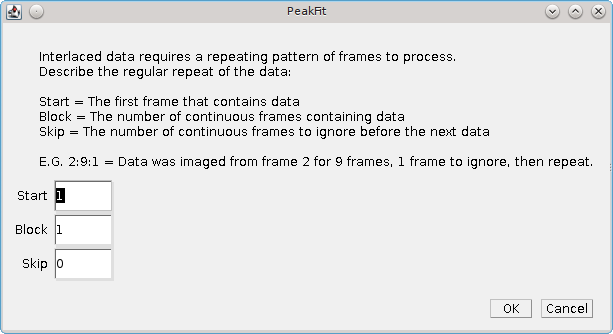

    Peak Fit Interlaced Data dialog

.. list-table::
   :widths: 20 80
   :header-rows: 1

   * - Parameter
     - Description

   * - Start
     - The first frame containing data.

   * - Block
     - The number of continuous frames that contain data.

   * - Skip
     - The number of continuous frames to skip before the next block of data.

The ``Interlaced Data`` option is fully compatible with the ``Integrate Frames`` option. However note that the data is read from the interlaced frames and then aggregated. None of the skipped frames will be aggregated. The user must simply select how many consecutive data frames to integrate.

The use of the interlaced and integrate options together can produce results that have a larger gap between the start and end frame that the number of frames that were integrated. For example if the plugin is set to fit 2 out of 3 frames but integrate 4 frames then any fit results from the first processed image will have a start frame of 1 and an end frame of 5.

.. index:: ! Template Manager

Template Manager
----------------

The ``Template Manager`` provides management of the configuration templates that can be used in other fitting plugins to choose a pre-configured set of options. Templates can be used to pre-configure settings for the software for different microscope equipment, or different fitting scenarios (e.g. high density STORM data or low density PALM data).

Note: Templates can be saved using the ``Fit Configuration`` plugin (section :numref:`%s) <fitting_plugins:Fit Configuration>` or the benchmarking workflow (section :numref:`{number}: {name} <model_plugins:Benchmarking>`).

When the ``Template Manager`` plugin is run a dialog allows a choice from the following options:

.. list-table::
   :widths: 20 80
   :header-rows: 1

   * - Option
     - Description

   * - Load Standard Templates
     - Allows selection of standard templates. These are templates built in to the SMLM jar file.

   * - Load Custom Templates
     - Allows selection of custom templates. These are templates loaded from files in a directory.

   * - Remove Loaded Templates
     - Allows removal of previously loaded templates.

   * - View Template
     - Allows a template to be viewed.

   * - View image example for template
     - Allows an example of the image data used to create the template to be viewed.

       This is applicable to templates created using the benchmarking plugins. These associate templates with frames extracted from the image to demonstrate the PSF and noise of the image.

.. index:: Load Standard Templates

Load Standard Templates
~~~~~~~~~~~~~~~~~~~~~~~

Presents a selection dialog where the user can choose to load standard templates. These are templates directly configured in the code or stored in the SMLM jar file.

New templates can be added to the jar file by adding a JSON format template file to the jar in the directory ``/uk/ac/sussex/gdsc/smlm/templates/`` and adding the template file name to the template list ``/uk/ac/sussex/gdsc/smlm/templates/list.txt``. This allows distribution of the SMLM code with custom templates in a single file.

.. index:: Load Custom Templates

Load Custom Templates
~~~~~~~~~~~~~~~~~~~~~

Presents a directory selection dialog allowing a template directory to be chosen. The plugin will search the directory for files and present a selection dialog where the user can choose which templates to load.

For each chosen file the template will be loaded and added to the list of available templates. The loaded template will be named using the file name without the file extension. Any existing templates with the same name will be replaced. When finished the number of templates successfully loaded will be displayed.

If any chosen file is not a valid template then an error message is written to the ``ImageJ`` log window.

.. index:: Remove Loaded Templates

Remove Loaded Templates
~~~~~~~~~~~~~~~~~~~~~~~

Presents a selection dialog where the user can choose which templates to remove from memory. The original template source will not be deleted.

.. index:: View Template

View Template
~~~~~~~~~~~~~

Presents a dialog with a list of the loaded templates. A text window displays the currently selected template. This updates with changes to the selection.

If the ``Close on exit`` checkbox is set to **true** the text window will be closed with the plugin dialog.

.. index:: View Image Example for Template

View Image Example for Template
~~~~~~~~~~~~~~~~~~~~~~~~~~~~~~~

Presents a dialog with a list of the loaded templates that have an associated example image. A window displays the image example for the currently selected template. This updates with changes to the selection. If the template contains embedded fit results for the image data then these are displayed in a results table. The results represent an example of applying the template fit configuration to the example image data.

If no loaded templates have images then a warning message is displayed.

Note: Templates with associated image data are created using the benchmarking plugins. The benchmarking workflow allows construction of simulated images and optimisation of the fitting settings given the known ground truth localisations. For more details see section :numref:`{number}: {name} <model_plugins:Benchmarking>`.

.. index:: ! Fit Configuration

Fit Configuration
-----------------

This plugin allows the fitting engine to be configured without running ``Peak Fit`` on an image. The plugin dialog has several sections controlling different parts of the fitting algorithm. These settings are the same as the ``Peak Fit`` plugin and are described in section :numref:`{number}: {name} <fitting_plugins:Peak Fit>`.

As with the ``Peak Fit`` plugin the current settings are loaded when the plugin is initialised. If no settings exists then a default set of settings will be created.

The ``Fit Configuration`` plugin allows the configuration to be viewed and updated without the need to have an image open. Since all plugins can be called from ``ImageJ`` scripts this also allows creation of a batch macro to change the fit configuration settings.

The plugin has two output options:

.. list-table::
   :widths: 20 80
   :header-rows: 1

   * - Action
     - Description

   * - Save
     - Save to the current fit settings overwriting the existing settings.

   * - Save Template
     - Save to a specified template file.

       A dialog is shown where the file can be saved. The suffix will be replaced with ``.txt``.

       The template is also saved to the currently active set of templates and is available for the ``Template`` option in the ``Peak Fit`` dialog. The template name will match the file name without the suffix.

The template files saved by the plugin use a JSON format text file to save the settings. The settings include the camera model and so can be used to save fit settings for different microscope systems.

Templates can be administered using the ``Template Manager`` plugin (see section :numref:`%s <fitting_plugins:Template Manager>`). This allows loading and removing templates from the current set of active templates. The template files can be transferred to other computers to allow the same settings to be used on different systems.

.. index:: ! Peak Fit Series

Peak Fit (Series)
-----------------

Allows the ``Peak Fit`` plugin to be run on a folder containing many images. This allows the code to run on images that are too large to fit into memory or that may have been imaged in a sequence.

Currently only TIFF images are supported. This includes OME-TIFF images produced by ``Micro Manager``.

When the ``Peak Fit Series`` plugin is executed it shows a folder selection dialog where the user can select a folder containing a set of images. The plugin then scans the folder for images. If a file is not a recognised TIFF image then the plugin will fail.

Images are sorted numerically into a list, i.e. the first sequence of numeric digits in the filename are used to sort images, e.g. ``image2.tif`` is before ``image10.tif``. This allows correct processing of series images.

By default all the images will be processed as input. If the extra options are enabled by holding the ``Shift`` key when running the plugin a dialog is used to control how the series is loaded (see :numref:`Figure %s <fig_peakfit_series_dialog>`). The dialog shows the name and dimensions of the first image in the series. It is assumed that all images in the folder have the same dimensions (with the exception of the last image which may be truncated). The dialog summarises at the bottom the total number of images and frames that will be read in the series.

.. _fig_peakfit_series_dialog:
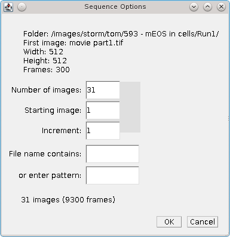

    Peak Fit (Series) sequence options dialog

When different options are selected the plugin updates the count of the number of images and frames that will be processed. The parameters that effect what images are loaded are show below:

.. list-table::
   :widths: 20 80
   :header-rows: 1

   * - Parameter
     - Description

   * - Number of images
     - Specify the maximum number of images to load.

   * - Staring image
     - The first image in the sequence. The sequence begins at 1.

   * - Increment
     - The gap between images of the sequence. Use a number higher than 1 to miss out images in a sequence.

   * - File name contains
     - Specify the text that the image filename must contain.

   * - Or enter pattern
     - Specify a pattern (regular expression) that the image filename must match.

When the input series is ready the ``Peak Fit`` plugin is run and must be configured as described in section :numref:`{number}: {name} <fitting_plugins:Peak Fit>`. The only difference is that the plugin is not running on a single image but on a series of images that are loaded sequentially and passed to the ``Peak Fit`` engine. The names of each image loaded in the image series will be saved with the results. This allows other plugins to access the original data associated with the results.

Note that if the directory contains a mixed collection of images then the results will not make sense.

.. index:: ! Spot Finder

Spot Finder
-----------

Finds all the candidate maxima in an image.

This plugin uses the same algorithm as the ``Peak Fit`` plugin to identify maxima. However all the candidates are saved to the output. No 2D Gaussian fitting or peak filtering is performed.

The fit configuration is the same as in the ``Peak Fit`` plugin. As with the ``Peak Fit`` plugin the current settings are loaded when the plugin is initialised. If no settings exists then a default set of settings will be created.

When the plugin runs all the settings will be saved to the existing settings.

Spots identified as candidates can be fit using the ``Fit Maxima`` plugin (see section :numref:`%s <fitting_plugins:Fit Maxima>`).

.. index:: ! Spot Finder Series

Spot Finder (Series)
--------------------

Allows the ``Spot Finder`` plugin to be run on a folder containing many images. This allows the code to run on images that are too large to fit into memory or have been imaged in a sequence.

The plugins allows the user to select a folder containing source images. This works using the same method as the ``Peak Fit (Series)`` plugin. More details on the selection options can be found in section :numref:`{number}: {name} <fitting_plugins:Peak Fit (Series)>`.

.. index:: ! Spot Finder Preview

Spot Finder (Preview)
---------------------

The ``Spot Finder (Preview)`` plugin allows an interactive view of the candidates that will be identified in an image using the configured spot filter.

This plugin uses the same algorithm as the ``Peak Fit`` plugin to identify maxima. The configuration is the same as in the ``Peak Fit`` plugin. As with the ``Peak Fit`` plugin the current settings are loaded when the plugin is initialised. If no settings exists then a default set of settings will be created.

The plugin presents a non-blocking dialog allowing other windows in ``ImageJ`` to be used. In contrast to the ``Peak Fit`` plugin the dialog allows the second filter settings used in a ``Difference`` filter to be configured without additional dialogs. This is for convenience. A ``Jury`` filter still requires additional dialogs.

When the dialog is shown the input image is taken as the currently active image and the spot filter settings can be configured. In the ``Peak Fit`` plugin the type of camera can be selected. In this plugin the type of camera is only relevant if it is a sCMOS camera with a per-pixel model. The dialog only allows the camera model to be chosen. If the dimensions of the image are different from the camera model then a crop selection from the camera model must be made. The camera model is then used to subtract the bias and apply the gain on a per-pixel basis before the spot filter is applied. The intensities will be in photons. If the camera was a CCD-type camera then the bias and gain are global and the filter will identify the same candidates before and after transformation to photons. For simplicity this step is omitted and the intensities will be in camera counts.

The plugin will begin analysing the image when the ``Preview`` button is clicked and the spot candidates are overlaid on the image. The output of the preview is dependent on whether there is ground truth data loaded for the true localisations in the image. If the ``Save`` button is pressed then all the settings will be saved to the existing settings. If the ``Close`` button is pressed then changes to the settings are discarded. The image overlay on the input image is removed when the plugin dialog closes.

By default the plugin will apply the spot filter to the image data and show a preview of the identified spot candidates. The following preview specific parameters can be configured:

.. list-table::
   :widths: 20 80
   :header-rows: 1

   * - Parameter
     - Description

   * - Top N
     - Show the top N results on the input image using an overlay. Results are ranked by their intensity.

       Set to 0 to disable and show all candidates.

       Note: The slider is configured to the total number of spot candidates.

   * - Select
     - Select the N\ :sup:`th` result on the input image using a circle overlay. This result is also marked on the candidate intensity plot.

       Set to 0 to disable.

   * - Neighbour radius
     - Specify the block radius around each candidate to search for neighbours. A histogram of the number of neighbours is constructed.

       Use this option to investigate the density of the candidates and the possible effects of using the multi-peak fitting options within ``Peak Fit``.

   * - Preview
     - Results are shown when the ``Preview`` checkbox is selected. The plugin will update the results dynamically when the settings are changed, or the active frame in the input image is changed.

If the current image is a simulated image and there is associated ground truth data loaded (see :numref:`{number}: {name} <model_plugins:Load Benchmark Data>`) then the candidate spots are compared to the true localisations. The candidates can then be overlaid as true positives or false positives on the image. The following preview specific parameters can be configured:

.. list-table::
   :widths: 20 80
   :header-rows: 1

   * - Parameter
     - Description

   * - Match distance
     - The distance (in pixels) between a spot candidate and a localisation for a match.

   * - Lower match distance
     - The fraction of the match distance for a perfect match. When less than 100% there is a lower and upper match distance. Any spot within the lower distance to a localisation scores a perfect match of 1. Above the upper distance is no match. In between the two the match is counted as both a match and not a match using a weighting so the total is 1. The effect is that the match statistics are computed as if an average of the scores using all distances between the lower and upper match distance.

   * - Multiple matches
     - Allow a candidate to match more than one localisation. Note that this is relevant for high density samples where true localisations may overlap and appear as a single larger spot. A candidate that matches multiple localisations has the match scores summed (which may be above 1) and the false positive score for the candidate is the larger of 1 minus the matched score, or zero. Thus a candidates false positive score cannot be negative but the true positive score may be above one.

   * - Show TP
     - Show the true positives on the overlay in green.

   * - Show FP
     - Show the false positives on the overlay in red.

   * - Preview
     - Results are shown when the ``Preview`` checkbox is selected. The plugin will update the results dynamically when the settings are changed, or the active frame in the input image is changed.

The results created by the plugin are described in the following sections.

.. index:: Spot Filter Settings

Spot Filter Settings
~~~~~~~~~~~~~~~~~~~~

The spot filter settings are written to the ``ImageJ`` log window. These are the absolute pixel values for the filter settings even if the filter has been configured using ``Relative`` mode to set the size based on the PSF width::

    Single: [search = 2, border = 1, Filter = Average: [border = 1, smooth = 1.84]]
    Single: [search = 2, border = 1, Filter = Gaussian: [border = 1, sigma = 1.84, width = 6.0]]

.. index:: Image Overlay

Image Overlay
~~~~~~~~~~~~~

Shows the pixel image after the spot filter has been applied to the current image frame. Note that the image is shown as an overlay and the original image data is not changed. The image contrast is mapped to show the full minimum to maximum range.

In the default mode if the ``Top N`` option is active then the overlay will include spots for the top N candidates. These are shown using a colour map of intensities that avoids white and black extremes. This is for use over a greyscale image.

If the ``Select`` option is active then the N\ :sup:`th` ranked candidate is marked using a circle. This can be used in conjuction with the candidate intensity plot to find spots with a selected intensity by adjusting the selected candidate based on the plot profile.

When ground-truth data is available the ``Top N`` option is not active. The overlay will optionally show true positives in green and false positives in red.

.. index:: Candidate Intensity Plot

Candidate Intensity Plot
~~~~~~~~~~~~~~~~~~~~~~~~

Shows the candidate spot intensity against the rank. Displayed when ground-truth data is not available.

If the ``Select`` option is active then the N\ :sup:`th` ranked candidate is marked using a line. This moves dynamically when the ``Select`` option is adjusted.

.. index:: Neighbour Histogram

Neighbour Histogram
~~~~~~~~~~~~~~~~~~~

Shows a histogram of the count of neighbours around a candidate. Displayed when ground-truth data is not available.

The size of the box around each candidate is configured using the ``Neighbour radius``. The box dimensions are :math:`2r + 1` where *r* is the radius.

.. index:: Candidate Performance Plot

Candidate Performance Plot
~~~~~~~~~~~~~~~~~~~~~~~~~~

Shows the match statistics against the candidate spot rank. Displayed when ground-truth data is available.

The collection of spot candidates is scored against the ground truth data using each set of top N candidates starting from N=1. The Jaccard, precision and recall are plotted against the spot rank (see :numref:`{number}: {name} <comparison_metrics:Comparison Metrics>`).

.. index:: Candidate Precision-Recall Plot

Candidate Precision-Recall Plot
~~~~~~~~~~~~~~~~~~~~~~~~~~~~~~~

Shows the precision against the recall. Displayed when ground-truth data is available.

The collection of spot candidates is scored against the ground truth data using each set of top N candidates starting from N=1. The precision and recall are plotted against each other. As the number of candidates increases the recall will increase but the precision typically reduces. The area under the precision-recall curve (AUC) score has a maximum of 1 and is an indicator of the quality of the spot candidate identification and ranking.

.. index:: ! Fit Maxima

Fit Maxima
----------

Fits a 2D Gaussian to identified maxima.

This plugin uses the same algorithm as the ``Peak Fit`` plugin to fit maxima. Candidates are taken from any results set held in memory with a valid image source (i.e. fitting a list of selected maxima can be performed on the original data). Candidates are collated per time frame and processed in ranked order until a number of successive fits fails or no candidates remain.

Candidates can be identified using the ``Spot Finder`` plugin (see section :numref:`%s <fitting_plugins:Spot Finder>`). Running the ``Spot Finder`` and ``Fit Maxima`` plugins will produce the same results as using the ``Peak Fit`` plugin. However separating the two steps allows processing to be performed on the candidates. For example the ``Trace Molecules`` plugin can be used to join up candidates in successive frames and fit the combined stack. These are identified internally as spanning multiple frames by tagging an end frame onto the result. The ``Fit Maxima`` plugin will not fit any results that span multiple frames; these will be send directly through to the result output.

The fit configuration is the same as in the ``Peak Fit`` plugin. As with the ``Peak Fit`` plugin the current settings are loaded when the plugin is initialised. If no settings exists then a default set of settings will be created.

When the plugin runs all the settings will be saved to the existing settings.

.. index:: ! Gaussian Fit

Gaussian Fit
------------

Fits peaks on a single frame of an image using a two-dimensional Gaussian. This plugin is designed to be used interactively. It is based on the same fitting engine as ``Peak Fit``.

The ``Gaussian Fit`` plugin requires no calibration parameters and the least-squares estimation is used. It is currently not possible to use maximum likelihood estimation.

The plugin identifies peaks on a smoothed image using non-maximal suppression and a set of size filters. It supports an interactive preview of the candidate peaks (see :numref:`Figure %s <fig_gauss_fit_dialog_and_image>`). These are then fitted using a 2D Gaussian and the results are output to a table.

.. _fig_gauss_fit_dialog_and_image:
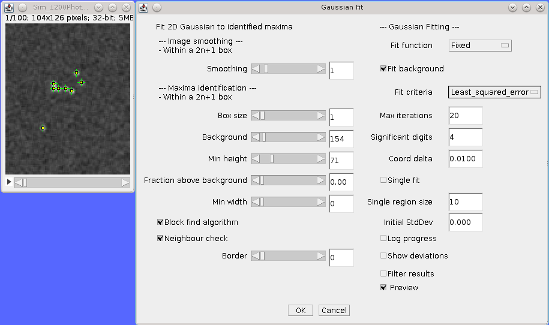

    Gaussian Fit plugin with live preview of the candidate peaks on the active image.

The plugin is designed to work on rectangular regions of an image (or the whole image). It will work best in the following situation:

#.  The background level is constant across the image
#.  The peaks are distinct and well separated, e.g. over 40% of the peak height is clearly visible away from any other peak

The plugin works using a two stage process:

#. Identify peaks on a smoothed image using non-maximal suppression
#. Fit all the peaks using a 2D Gaussian simultaneously with a global background or separately with local background

.. index:: Maxima Identification

Maxima Identification
~~~~~~~~~~~~~~~~~~~~~

Pixels are smoothed using a box filter of 2n+1 square dimensions around each pixel. Non-integer smoothing sizes are supported using a weight for the edge pixels.

Peaks are selected if they are higher than all other pixels in a 2n+1 box region. The box can be a different size from the smoothing window. The peaks must also satisfy the criteria of minimum height above the defined background, minimum width and a certain distance from the edge of the ROI.

When you run the plugin you can enable a ``Preview`` checkbox at the bottom of the dialog. This will draw on the image the currently identified maxima. This will update as you adjust the parameters such as the smoothing and the minimum peak height.

The following parameters are available:

.. list-table::
   :widths: 20 80
   :header-rows: 1

   * - Parameter
     - Description

   * - Smoothing
     - The size of the smoothing window.

   * - Box Size
     - Identify maxima within a 2n+1 box.

   * - Background
     - Set the background level for the image.

   * - Min height
     - Set the minimum height above the background as an absolute value.

   * - Fraction above background
     - Set the minimum height above the background as a fraction of the total peak height from 0.

   * - Min width
     - The minimum peak-width at half-maxima (PWHM).

   * - Block find algorithm
     - Use the block-find algorithm for non-maximal suppression [Neubeck and Van Gool, 2006].

       This is much faster than a standard search of each 2N+1 region around every pixel. The algorithm finds the maximum in each of the non-overlapping N+1 sized blocks in the image. Only the single maxima from each block is compared to the remaining pixels in the 2N+1 region.

   * - Neighbour check
     - Perform addition checks on neighbours when identifying maxima.

       The block-find algorithm defines a maxima as any pixel with no other *higher* pixels within a radius. This can over-count maxima if they are *equal* height. If enabled this checks adjacent blocks for equal height maxima, eliminating any maxima with neighbours that are already a maxima.

   * - Border
     - The border size in pixels to ignore when identifying maxima.

.. index:: Peak Fitting

Peak Fitting
~~~~~~~~~~~~

When peaks have been identified they are fit using a 2D Gaussian. This uses the same fitting algorithm as the ``Peak Fit`` plugin.

The following parameters are available:

.. list-table::
   :widths: 20 80
   :header-rows: 1

   * - Parameter
     - Description

   * - PSF
     - *   ``Circular``: Fits X,Y centre, combined X/Y deviation and amplitude.
       *   ``Eliptical``: Fits X,Y centre, individual X/Y deviation and amplitude.
       *   ``Free``: Fits X,Y centre, individual X/Y deviation, rotation angle and amplitude.

   * - Fit Background
     - Enable background fitting. If disabled then the background is assumed to be zero.

       Note that cellular images contain background fluorescence and cameras may have a bias offset to allow characterisation of noise. This setting is best left on.

   * - Max Iterations
     - The maximum number of iterations for the fit.

   * - Relative threshold
     - The threshold below which a relative change in the function value terminates fitting.

       Set to ``0`` to disable.

   * - Absolute threshold
     - The threshold below which an absolute change in the function value terminates fitting.

       Set to ``0`` to disable.

   * - Single fit
     - Peaks are fit all at once using the entire ROI or can be fitted individually (``Single fit``). If using ``Single fit`` then a region is drawn around the peak and fitted.

       Individual fitting works well if the box does not include any other peaks, otherwise a neighbour peak can interfere and it is best to fit all at once.

   * - Single region size
     - The size around each peak to use for fitting.

   * - Initial StdDev
     - The initial standard deviation in pixels for the Gaussian. Set to zero to estimate this from the peak-width.

   * - Log progress
     - Set to **true** to write progress messages to the ``ImageJ`` log.

   * - Show deviations
     - Set to **true** to output an estimated error for each of the parameters in the results table.

   * - Filter results
     - Set to **true** to remove fits that are far away from the initial guess of the Gaussian. Only valid for single fitting as peaks are filtered individually.

       Peaks are removed if they drift more than half the width of the smoothing window or if the width changes more than 3-fold from the initial estimate.

   * - Show fit
     - Set to **true** to render the fitted Gaussian on an image.

       If using ``Single fit`` then an average is used where fit regions overlap.

Click ``OK`` to start the fitting. The fit uses a non-linear least squares routine until convergence. If convergence is not achieved by the maximum number of iterations the fit fails. The fitted results are output to a results table.

.. index:: ! Fail Count Manager

Fail Count Manager
------------------

The ``Fail Count Manager`` provides analysis of the fail count settings used in the ``Peak Fit`` plugin. The ``Fail Count`` is the number of fitting failures for the current frame. When fitting spot candidates is is normal that a large number of candidates are noise. Thus it is sensible to not fit all the candidates and to stop fitting when certain conditions are met, e.g. number of total failures, number of consecutive failures, fraction of failures. The ``Fail Count Manager`` is able to run fitting on an example image and store the pass/fail status of each consecutive candidate. It then provides options to analyse the best settings to use for stopping fitting with the aim of fitting the most good candidates while eliminating wasted time fitting low quality candidates.

When the plugin is run a dialog allows a choice from the following options:

.. list-table::
   :widths: 20 80
   :header-rows: 1

   * - Option
     - Description

   * - Create Data
     - Fit an example image using the ``Peak Fit`` engine. The fail count data is stored in memory and optionally will be saved to file.

   * - Load Data
     - Load a saved set of fail count data.

   * - Save Data
     - Save fail count data to file.

   * - Plot Data
     - Produce plots of the fail count data.

   * - Analyse Data
     - Perform analysis on the fail count data using various conditions for fit termination.

.. index:: Create Fail Count Data

Create Fail Count Data
~~~~~~~~~~~~~~~~~~~~~~

Run the fitting engine on the current image to generate pass/fail data for sequential candidates in each frame. When this option is a dialog is shown to configure the collection of fail count data. The following parameters are available:

.. list-table::
   :widths: 20 80
   :header-rows: 1

   * - Parameter
     - Description

   * - Max frames
     - The number of frames to process from the image.

   * - Fail count limit
     - The upper limit for the fail count. Fitting a frame will stop when the number of consecutive failures reach this limit.

   * - Save
     - If **true** the fail count data will be saved to file.

When the options are configured a dialog to configured the fit engine is shown. This uses the same options as the ``Peak Fit`` plugin (see section :numref:`%s <fitting_plugins:Peak Fit>`).

The fitting engine will be run on the selected frames from the image and the fail count data saved to memory. If ``Save`` was enabled then a dialog will be present to save the data to file.

.. index:: Load Fail Count Data

Load Fail Count Data
~~~~~~~~~~~~~~~~~~~~

Load a saved set of fail count data. The option will present a file selection dialog and then load the data to memory.

.. index:: Save Fail Count Data

Save Fail Count Data
~~~~~~~~~~~~~~~~~~~~

Save fail count data to file. The option will present a file selection dialog and then save the data from memory to file. The data has the following format::

    ID,Candidate,Status
    1,1,y
    1,2,y
    1,3,y
    1,4,y

where ``ID`` is the frame, ``Candidate`` is the candidate ID in the frame, and ``Status`` is ``y`` if the fit was successful, otherwise it is ``n``.

.. index:: Plot Fail Count Data

Plot Fail Count Data
~~~~~~~~~~~~~~~~~~~~

Produce various plots of the fail count data. When this option is run the currently selected item ID in the fail count data is plotted. An interactive dialog is shown where the plot settings can be configured.

The following plots are constructed:

.. list-table::
   :widths: 20 80
   :header-rows: 1

   * - Plot
     - Description

   * - Pass Count
     - The pass count verses the candidate ID.

   * - Pass Rate
     - The pass rate verses the candidate ID:

       :math:`\mathit{pass\:rate} = \frac{\sum \mathit{pass} }{n}`

   * - Consecutive Fail Count
     - A count of consecutive fails verses the candidate ID. This resets to zero after a pass.

   * - Rolling Fail Count
     - The count of the number of fails within a rolling window verses the candidate ID.

   * - Weighted Fail Count
     - The weighted fail count verses the candidate ID. For each result the fail count is updated by adding the ``Fail weight`` for a fail or subtracting the ``Pass weight`` for a pass.

   * - Resetting Fail Count
     - The resetting fail count verses the candidate ID. For each result the fail count is incremented for a fail or reset for a pass by applying the ``Reset fraction``:

       :math:`\mathit{count} = \mathit{count} \times \mathit{reset\:fraction}`

The interactive plot dialog is non-blocking allowing other ``ImageJ`` windows to be used. This dialog may be behind the fail count plots. Any changes to the parameters are reflected in the plots.

The following plot parameters can be specified:

.. list-table::
   :widths: 20 80
   :header-rows: 1

   * - Parameter
     - Description

   * - Item
     - The ID to plot.

   * - Fixed x axis
     - If **true** the x-axis on the plot will be scaled to the maximum candidate ID in the entire fail count data. If **false** the x-axis is scaled to the current data.

       This option allows scrolling through the data using the ``Item`` slider without resizing each plot.

   * - Rolling window
     - The size of the rolling window for the ``Rolling Fail Count`` plot.

   * - Pass weight
     - The pass weight for the ``Weighted Fail Count`` plot.

   * - Fail weight
     - The fail weight for the ``Weighted Fail Count`` plot.

   * - Reset fraction
     - The reset fraction for the ``Resetting Fail Count`` plot.

.. index:: Analyse Fail Count Data

Analyse Fail Count Data
~~~~~~~~~~~~~~~~~~~~~~~

Perform analysis on the fail count data using various conditions for fit termination. The fail count data is passed to a fail counter. The fail counter determines when fitting would stop on the current set of candidates. This is compared to a target number of candidates set using the fraction of passing fits in the candidates.

.. math::

    \mathit{target\:pass\:count} = \mathit{total\:pass\:count} \times \mathit{target\:pass\:fraction}

The number of candidates processed to achieve the ``Target pass count`` is named the ``Target`` candidate ID.

The counter is scored using:

.. math::

    \mathit{score} & = \frac{\mathit{target\:pass\:count}-\mathit{pass\:count}}{\mathit{target\:pass\:count}}, \: & \text{if } count <= target \\
                   & = \frac{\mathit{count}-\mathit{target}}{\mathit{target}},        & \text{otherwise}

where *count* is the number of candidates processed before stopping.

The following fail counters can be used:

.. list-table::
   :widths: 20 80
   :header-rows: 1

   * - Fail Counter
     - Description

   * - Consecutive Failures
     - Stop evaluating when a number of consecutive failures occurs.

   * - Rolling Failures
     - Stop evaluating when a number of failures occurs within a window.

   * - Weighted Failures
     - Stop evaluating when a number of cumulative failures occurs. The counting is weighted so that fails increment and passes decrement different amounts.

   * - Resetting Failures
     - Stop evaluating when a number of cumulative failures occurs. The failures count is reset to a fraction of the current value for each pass.

   * - Pass Rate
     - Stop evaluating when the pass rate falls below a set fraction. A minimum number of pass/fail counts can be specified before the fraction of passes is evaluated, e.g. require at least 5 counts before computing the pass rate.

When the ``Analyse`` option is run a dialog is presented allowing the fail counters to be configured. This follows the general concept that each counter has parameters that are set using a range from a minimum to a maximum. The ranges to use for each counter are configured and then the data is analysed using all possible counters. The plugin will compute the number of counters and if above a configured size will prompt the user if they wish to perform analysis. This prevents creation of too many counters. To ignore a counter set the maximum threshold for the counter to a negative value. When analysis is complete a table is shown of the top *N* counters.

The following plot parameters can be specified:

.. list-table::
   :widths: 30 70
   :header-rows: 1

   * - Parameter
     - Description

   * - Target pass fraction
     - The ideal fraction of total pass results to allow before termination of fitting.

   * - Table top n
     - The number of results to show in the results table.

   * - Rolling counter min allowed failures
     - The minimum number of failures for the ``Rolling failures`` counter.

   * - Rolling counter max allowed failures
     - The maximum number of failures for the ``Rolling failures`` counter.

   * - Rolling counter min window
     - The minimum window size for the ``Rolling failures`` counter.

   * - Rolling counter max window
     - The maximum window size for the ``Rolling failures`` counter.

   * - Weighted counter min allowed failures
     - The minimum number of failures for the ``Weighted failures`` counter.

   * - Weighted counter max allowed failures
     - The maximum number of failures for the ``Weighted failures`` counter.

   * - Weighted counter min pass decrement
     - The minimum pass decrement for the ``Weighted failures`` counter.

   * - Weighted counter max pass decrement
     - The maximum pass decrement for the ``Weighted failures`` counter.

   * - Resetting counter min allowed failures
     - The minimum number of failures for the ``Resetting failures`` counter.

   * - Resetting counter max allowed failures
     - The maximum number of failures for the ``Resetting failures`` counter.

   * - Resetting counter min pass decrement
     - The minimum pass decrement for the ``Resetting failures`` counter.

   * - Resetting counter max pass decrement
     - The maximum pass decrement for the ``Resetting failures`` counter.

   * - Resetting counter inc pass decrement
     - The increment for enumerating the decrement parameter for the ``Resetting failures`` counter.

   * - Pass rate counter min allowed failures
     - The minimum number of failures for the ``Pass rate failures`` counter.

   * - Pass rate counter max allowed failures
     - The maximum number of failures for the ``Pass rate failures`` counter.

   * - Pass rate counter min pass rate
     - The minimum pass rate for the ``Pass rate failures`` counter.

   * - Pass rate counter max pass rate
     - The maximum pass rate for the ``Pass rate failures`` counter.

   * - Pass rate counter inc pass rate
     - The increment for enumerating the pass rate parameter for the ``Pass rate failures`` counter.

Note: There are no parameters for the ``Consecutive Failures`` counter. All fail limits up to the maximum number of consecutive failures in the data are analysed.

.. index:: ! Spot Fit Tool

Spot Fit Tool
-------------

The ``Spot Fit Tool`` allows fitting spots interactively on an image by clicking candidate spots. It is based on the same fitting engine as ``Peak Fit``.

The ``Spot Fit Tool`` plugin requires no calibration parameters and the least-squares estimation is used. It is currently not possible to use maximum likelihood estimation.

When the plugin is run it displays a dialog allowing the current tool options to be configured. A tool is then installed in the ``ImageJ`` toolbar and selected as the active tool. A double-click on the tool icon will open the tool options dialog.

When the tool is active any mouse-click on an image will run the fitting process. A region is searched around the clicked location for a local maxima. A region around the local maxima is then fit using a Gaussian 2D function. Fits are performed using the default fit configuration and the spot width is estimated from the data using the peak width at half maxima. If fitting converges then the spot is filtered using a signal-to-noise ratio (SNR) threshold. The signal uses half the fitted signal divided by the area covered by the central part of the Gaussian containing half the intensity. The noise is obtained using the standard deviation of the fit region residuals. Successful fits are marked on the image and added to a results table. The point is marked on the image using an overlay which can optionally be attached to the image slice.

If the ``Alt``, ``Shift`` or ``Control`` key is held down the tool operates in ``Remove`` mode. Any existing points within the search region are removed from the image and the results table.

The following option parameters are available:

.. list-table::
   :widths: 20 80
   :header-rows: 1

   * - Parameter
     - Description

   * - Channel
     - The channel to fit (applies to hyperstacks).

   * - Search Range
     - Identify local maxima within a 2n+1 box.

   * - Fit Radius
     - Identify local maxima within a 2n+1 box.

   * - SNR Threshold
     - The SNR threshold used to filter bad spots.

   * - Show fit ROI
     - Draw the most recent fit region on the image using a ROI.

   * - Show overlay
     - If **true** mark the spot on the image using an overlay.

   * - Attach to slice
     - If **true** the spot overlay will be associated with the current slice position.

       When using a standard stack the spot overlay will only show when the image slice matches. If set to **false** the spot overlay will always be visible.

       When using a hyperstack the spot overlay is always associated with the current channel and frame. This option also associates the spot with the current z-slice.

   * - Log progress
     - Show information about the clicked location and fitting process in the ``ImageJ`` log window.

   * - Comparison channel
     - Show information about a second channel in the same region. If the channel exists a background and signal intensity estimate is made for the second channel. The background uses the minimum average value of the four edges of the fit region. The intensity uses a weighted mean of the fit region above the background. The weights use the normalised Gaussian function of the fitted spot.

.. index:: Advanced Spot Fit Settings

Advanced Spot Fit Settings
~~~~~~~~~~~~~~~~~~~~~~~~~~

Currently it is not possible to change the fit settings. This allows simple configuration of the tool without having to understand the underlying fitting engine. Since the tool only fits spots that are visually identified it reasonable to assume the spot is well defined and under this scenario the default fit settings are robust.

If the image data has been acquired using a sCMOS camera then the data should be pre-processed before fitting as each pixel will have a different bias and gain. Use the ``Camera Model Manager`` plugin to remove the per-pixel bias and gain from the image (see section :numref:`%s <calibration_plugins:Camera Model Manager>`). The ``Spot Fit Tool`` can then be used to perform fitting using least squares estimation.

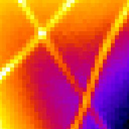

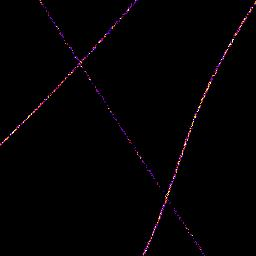

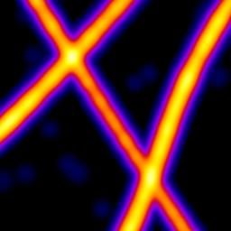

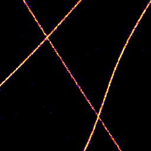

