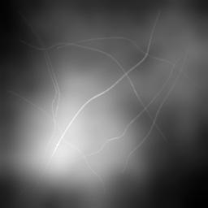
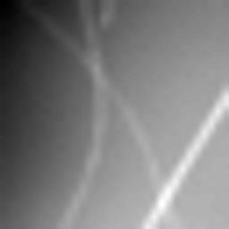
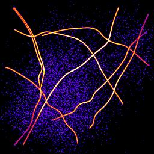
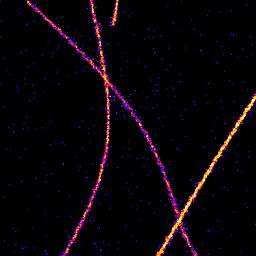

.. index:: ! GDSC Single Molecule Light Microscopy SMLM ImageJ Plugins

GDSC Single Molecule Light Microscopy (SMLM) ImageJ Plugins
===========================================================

.. image:: https://api.travis-ci.com/aherbert/gdsc-smlm.svg?branch=master
    :target: https://travis-ci.com/aherbert/gdsc-smlm
    :alt: Build Status

.. image:: https://coveralls.io/repos/github/aherbert/gdsc-smlm/badge.svg?branch=master
    :target: https://coveralls.io/github/aherbert/gdsc-smlm?branch=master
    :alt: Coverage Status

.. image:: https://readthedocs.org/projects/gdsc-smlm/badge/?version=latest
    :target: https://gdsc-smlm.readthedocs.io/en/latest/?badge=latest
    :alt: Documentation Status

.. image:: https://img.shields.io/badge/License-GPL%20v3-blue.svg
    :target: https://www.gnu.org/licenses/gpl-3.0
    :alt: License: GPL v3

GDSC SMLM plugins provide various tools for single molecule localisation analysis.

The tools are easily :ref:`installed <installation:Installation>` into ``ImageJ``. The library works for Java 1.8+.

The code is hosted on GitHub_.

.. index:: ! Overview

Overview
========

Super-resolution microscopy can be used to obtain a higher level of resolution from an image than conventional light microscopy.

In conventional light microscopy the subject is illuminated and all the light interacting with the subject is captured simultaneously into an image. The resolution is limited since the optics of the microscope cannot focus the light perfectly.

Super-resolution microscopy uses small molecules that can be activated to emit light. If a single molecule is activated its position can be localised using software analysis. Using thousands of localisations it is possible to reconstruct a virtual image of the subject. This increases the image resolution to the precision of the localisation method. The improvement depends on the imaging conditions but is often 5-10 times higher.

:numref:`Table %s <table_example>` shows the increased resolution of single molecule localisation microscopy. The difference is most noticeable where structures meet since the single molecules have a cleaner signal when activated individually than the combined signal of all the molecules together.

.. _table_example:
.. list-table:: Example images of standard and single molecule localisation microscopy
    :align: center

    * - | (A) Standard image
        | |example_image_standard_jpg|
      - | (B) Super-resolution image
        | |example_image_superres_jpg|
    * - | (C) Standard image 8x
        | |example_image_standard_8x_jpg|
      - | (D) Super-resolution image 8x
        | |example_image_superres_8x_jpg|

The GDSC Single Molecule Light Microscopy (SMLM) plugins provide various tools for single molecule localisation analysis.

- Fit an image, or series of images, using a 2D Guassian Point Spread Function (PSF)
- Save results to a table, a file, an image and/or to memory
- Trace or cluster localisations through time to identify molecules
- Correct drift in long time course images
- Estimate fluorophore dark-time and blinking rate
- Create localisation density images
- Create custom PSFs from calibration images
- Create simulated data using a Gaussian or custom PSF with configurable molecule populations and diffusion
- Calibrate the gain and read noise of your microscope camera
- Estimate noise in an image
- Estimate resolution using Fourier Ring Correlation (FRC)

The following plugins are available:

Fitting Plugins
---------------

.. list-table::
   :widths: 30 70
   :header-rows: 0

   * - :ref:`fitting_plugins:Simple Fit`
     - Performs fitting on an image to generate a table of molecule localisations and an image reconstruction.

       Provides a step through guide for initial configuration of microscope parameters

   * - :ref:`fitting_plugins:Peak Fit`
     - Performs fitting on an image to generate a list of molecule localisations.

   * - :ref:`fitting_plugins:Template Manager`
     - Allows management of templates for the fitting configuration.

   * - :ref:`fitting_plugins:Fit Configuration`
     - Allows setting the fitting parameters and saving them to file.

   * - :ref:`fitting_plugins:Peak Fit (Series)`
     - Performs fitting on folder of images to generate a list of molecule localisations.

   * - :ref:`fitting_plugins:Spot Finder`
     - Identifies candidate maxima in an image.

   * - :ref:`fitting_plugins:Spot Finder (Series)`
     - Identifies candidate maxima in a folder of images.

   * - :ref:`fitting_plugins:Spot Finder (Preview)`
     - Shows an interactive view of the candidates that will be identified in an image.

   * - :ref:`fitting_plugins:Fit Maxima`
     - Performs PSF fitting on candidate maxima.

   * - :ref:`fitting_plugins:Gaussian Fit`
     - Allows interactive identification of maxima using filters and 2D Gaussian fitting.

   * - :ref:`fitting_plugins:Fail Count Manager`
     - Provides analysis of the fail count settings used in the ``Peak Fit`` plugin.

   * - :ref:`fitting_plugins:Spot Fit Tool`
     - Allows interactive fitting of clicked spots on an image.

Results Plugins
---------------

.. list-table::
   :widths: 30 70
   :header-rows: 0

   * - :ref:`results_plugins:Results Manager`
     - Allows conversion of the localisation results into different formats, e.g. files or images.

   * - :ref:`results_plugins:Batch Load Results`
     - Allows multiple files to be loaded into memory.

   * - :ref:`results_plugins:Batch Save Results`
     - Allows multiple results sets to be saved to file.

   * - :ref:`results_plugins:Summarise Results`
     - Displays a summary of the results held in memory.

   * - :ref:`results_plugins:Clear Memory Results`
     - Removes all results held in memory.

   * - :ref:`results_plugins:Clear Memory Results (Multi)`
     - Removes selected results held in memory.

   * - :ref:`results_plugins:Rename Results`
     - Allows the results sets to be renamed.

   * - :ref:`results_plugins:Resequence Results`
     - Allows the frame number of results to be rebuilt assuming a repeating pattern of data and non-data frames.

   * - :ref:`results_plugins:Calibrate Results`
     - Allows results held in memory to be calibrated.

   * - :ref:`results_plugins:Update Results Bounds`
     - Allows the bounds of the results to be updated.

   * - :ref:`results_plugins:Convert Results`
     - Allows results held in memory to be converted to different units.

   * - :ref:`results_plugins:Show Results Header`
     - Shows the header information from any support localisation results file format.

   * - :ref:`results_plugins:Overlay Results`
     - Draws an overlay on an image using all the localisations from a results dataset.

   * - :ref:`results_plugins:Load Localisations`
     - Loads localisation data from a delimited text file.

   * - :ref:`results_plugins:Trace Exporter`
     - Export traced datasets to file.

   * - :ref:`results_plugins:Filter Results`
     - Filters a list of localisations using signal strength, coordinate shift and PSF width.

   * - :ref:`results_plugins:Crop Results`
     - Filters a set of localisations using a 2D bounding rectangle.

   * - :ref:`results_plugins:ROI Crop Results`
     - Filters a set of localisations using any ``ImageJ`` region of interest (ROI).

   * - :ref:`results_plugins:Free Filter Results`
     - Filters a list of localisations using a custom filter specified using a text description. Multiple filters can be combined with AND/OR operators.

   * - :ref:`results_plugins:Filter Molecules`
     - Filters a set of molecules using various criteria.

   * - :ref:`results_plugins:Split Results`
     - Splits a set of localisation results using a 2D mask.

   * - :ref:`results_plugins:Translate Results`
     - Allows the localisations in a dataset to be translated.

   * - :ref:`results_plugins:3D Results Viewer`
     - Show an interactive 3D view of the localisations in a dataset.

   * - :ref:`results_plugins:Results Match Calculator`
     - Calculate the match statistics between two results sets.

   * - :ref:`results_plugins:Trace Match Calculator`
     - Calculate the match statistics between two sets of traced molecules.

   * - :ref:`results_plugins:Classification Match Calculator`
     - Calculate the match between two classifications of the same localisations.

   * - :ref:`results_plugins:Spot Inspector`
     - Extracts the fitted spots from an image into a stack ordered by the user-selected score.

   * - :ref:`results_plugins:Yeast Mask`
     - Creates a mask of a fission yeast cell (*S. pombe*).

   * - :ref:`results_plugins:Depth Mask`
     - Creates a 3D mask using three 2D masks to define the shape.

   * - :ref:`results_plugins:Nucleus Mask`
     - Creates a 3D mask using spheres to model a nucleus of a cell.

Analysis Plugins
----------------

.. list-table::
   :widths: 30 70
   :header-rows: 0

   * - :ref:`analysis_plugins:Drift Calculator`
     - Corrects stage drift using: sub-image alignment; fiducial markers within an image; reference stack alignment; or a drift file.

   * - :ref:`analysis_plugins:Trace Molecules`
     - Traces molecules through time using time and distance thresholds (using a type of single-linkage clustering).

   * - :ref:`analysis_plugins:Cluster Molecules`
     - Clusters molecules through time using time and distance thresholds (using centroid-linkage clustering).

   * - :ref:`analysis_plugins:Dynamic Trace Molecules`
     - Traces localisations through time and collates them into traces using a probability model to connect localisations.

   * - :ref:`analysis_plugins:Trace Diffusion`
     - Trace molecules through consecutive frames. Mean-squared displacement analysis is performed on the traces to calculate a diffusion coefficient.

   * - :ref:`analysis_plugins:Trace Diffusion (Multi)`
     - Allows the ``Trace Diffusion`` plugin to be run with multiple input datasets.

   * - :ref:`analysis_plugins:Trace Length Analysis`
     - Analyses the track length of traced data.

   * - :ref:`analysis_plugins:Track Population Analysis`
     - Analyses the local diffusion of tracks within a window and classifies tracks into sub-populations based on diffusion metrics.

   * - :ref:`analysis_plugins:OPTICS`
     - Runs the OPTICS algorithm to perform interactive density-based clustering of localisation data.

   * - :ref:`analysis_plugins:DBSCAN`
     - Runs the DBSCAN algorithm to perform interactive density-based clustering of localisation data.

   * - :ref:`analysis_plugins:Draw Clusters`
     - Draws collections of localisations with the same ID on an image, for example the output from ``Trace Molecules`` or ``Cluster Molecules``.

   * - :ref:`analysis_plugins:Density Image`
     - Calculates the local density around localisations and displays an image coloured using the density score.

   * - :ref:`analysis_plugins:Dark Time Analysis`
     - Determines the maximum dark time for a fluorophore from localisation data.

   * - :ref:`analysis_plugins:Blink Estimator`
     - Estimate the blinking rate of fluorophores in a results set.

   * - :ref:`analysis_plugins:Time Correlated (TC-PALM) Analysis`
     - Performs time correlated photo-activated light microscopy (TC-PALM) analysis.

   * - :ref:`analysis_plugins:Neighbour Analysis`
     - Saves all localisations paired with their neighbour (if present) to file.

   * - :ref:`analysis_plugins:Filter Analysis`
     - Performs filtering on a set of categorised localisation results and computes match statistics for each filter.

   * - :ref:`analysis_plugins:Create Filters`
     - Used to prepare a large set of filters for use in the ``Filter Analysis (File)`` plugin.

   * - :ref:`analysis_plugins:Filter Analysis (File)`
     - Performs filtering on a set of categorised localisation results and computes match statistics for each filter defined in the input file.

   * - :ref:`analysis_plugins:Spot Analysis`
     - Allows analysis of the signal and on/off times for fixed fluorophore spots in an image stack.

   * - :ref:`analysis_plugins:Spot Analysis (Add)`
     - This plugin provides a named plugin command for the ``Add`` button of the ``Spot Analysis`` plugin.

   * - :ref:`analysis_plugins:Crosstalk Activation Analysis`
     - Perform crosstalk activation analysis of photo-switchable probes under pulsed light activation.

   * - :ref:`analysis_plugins:Pulse Activation Analysis`
     - Perform multi-channel super-resolution imaging by means of photo-switchable probes and pulsed light activation.

   * - :ref:`analysis_plugins:Density Estimator`
     - Estimates the local density using NxN squares around localisations.

   * - :ref:`analysis_plugins:Fourier Image Resolution`
     - Analyses the resolution of an image using Fourier Ring Correlation.

   * - :ref:`analysis_plugins:FIRE Q Estimation`
     - Estimate the spurious correction factor *Q* for use in ``Fourier Image Resolution`` (FIRE) analysis.

PC PALM Plugins
---------------

.. list-table::
   :widths: 30 70
   :header-rows: 0

   * - :ref:`pc_palm_plugins:PC-PALM Molecules`
     - Prepare a set of localisations for Pair Correlation analysis.

   * - :ref:`pc_palm_plugins:PC-PALM Analysis`
     - Produce Pair Correlation curve for a set of localisations selected from a super-resolution image.

   * - :ref:`pc_palm_plugins:PC-PALM Spatial Analysis`
     - Performs spatial analysis to plot the molecule density around each localisation as a function of distance from the localisation.

   * - :ref:`pc_palm_plugins:PC-PALM Save Results`
     - Saves all the PC-PALM results held in memory to a results folder.

   * - :ref:`pc_palm_plugins:PC-PALM Load Results`
     - Load all the PC-PALM results from a results folder to memory.

   * - :ref:`pc_palm_plugins:PC-PALM Fitting`
     - Combine multiple Pair Correlation curves and fit them using models for random or clustered distributions.

   * - :ref:`pc_palm_plugins:PC-PALM Clusters`
     - Find clusters of molecules using a partial centroid-linkage hierarchical clustering algorithm.

Model Plugins
-------------

.. list-table::
   :widths: 30 70
   :header-rows: 0

   * - :ref:`model_plugins:PSF Creator`
     - Extracts the PSF from a Z-stack image of markers, e.g. quantum dots or fluorescent beads.

   * - :ref:`model_plugins:PSF Drift`
     - Computes the drift in a PSF image.

   * - :ref:`model_plugins:PSF Combiner`
     - Combines several PSF images into a single average PSF.

   * - :ref:`model_plugins:PSF HWHM`
     - Diplays the half-width at half-maxima (HWHM) curve for a PSF image.

   * - :ref:`model_plugins:Cubic Spline Manager`
     - Allows management of the cubic spline models of point spread functions (PSFs).

   * - :ref:`model_plugins:Astigmatism Model Manager`
     - Allows management of 2D Gaussian astigmatism models for a 2D astigmatic PSF.

   * - :ref:`model_plugins:Create Data`
     - Creates an image by simulating single molecule localisations using a model of photoactivated diffusing fluorophore complexes.

       The PSF can be simulated or real using an input PSF image

   * - :ref:`model_plugins:Create Simple Data`
     - Creates an image by simulating single molecule localisations at a specified density.

   * - :ref:`model_plugins:Create Track Data`
     - Creates an image by simulating single molecule localisations diffusing in tracks that do not overlap in time.

   * - :ref:`model_plugins:Create Benchmark Data`
     - Creates an image by simulating single molecule localisations in a fixed location.

   * - :ref:`model_plugins:Fit Benchmark Data`
     - Fit the image created by ``Create Benchmark Data`` and compute statistics on the accuracy and precision of fitting.

   * - :ref:`model_plugins:Benchmark Analysis`
     - Compute statistics on the accuracy and precision of fitting using different methods. Statistics are only computed for all the localisations that were fit successfully by each method.

   * - :ref:`model_plugins:Create Spot Data`
     - Creates a sparse image by simulating zero or one localisation per frame.

   * - :ref:`model_plugins:Load Benchmark Data`
     - Load benchmark data using an open image and a localisations text file.

   * - :ref:`model_plugins:Filter Spot Data`
     - Filter the image created by ``Create Simple Data`` or ``Create Spot Data`` and compute statistics on the accuracy and precision of identifying spot candidates.

   * - :ref:`model_plugins:Filter Spot Data (Batch)`
     - Run a batch of filters through the analysis of ``Filter Spot Data``.

   * - :ref:`model_plugins:Fit Spot Data`
     - Fits all the candidate spots identified by the ``Filter Spot Data`` plugin.

   * - :ref:`model_plugins:Benchmark Filter Analysis`
     - Run different filtering methods on a set of benchmark fitting results outputting performance statistics on the success of the filter.

   * - :ref:`model_plugins:Benchmark Filter Parameters`
     - Run different filter control parameters on a set of benchmark fitting results outputting performance statistics on the success of the filter.

   * - :ref:`model_plugins:Iterate Filter Analysis`
     - Iterates the ``Benchmark Filter Analysis`` and ``Benchmark Filter Parameters`` plugin to optimise performance on a set of benchmark fitting results.

   * - :ref:`model_plugins:Score Filter`
     - Scores a filter against a set of benchmark fitting results.

   * - :ref:`model_plugins:Doublet Analysis`
     - Fits candidate spots identified by the ``Filter Spot Data`` plugin as a single or double spot (doublet) and scores the results.

   * - :ref:`model_plugins:Doublet Filter Analysis`
     - Filters all the fit results produced by the ``Doublet Analysis`` plugin using the specified filter settings and scores the results.

   * - :ref:`model_plugins:Smart Spot Ranking`
     - Compare methods for classifying spot candidates.

Calibration Plugins
-------------------

.. list-table::
   :widths: 30 70
   :header-rows: 0

   * - :ref:`calibration_plugins:PSF Calculator`
     - Allows calculation of the Point Spread Function (PSF) size given the microscope imaging parameters.

   * - :ref:`calibration_plugins:PSF Estimator`
     - Estimates the PSF by performing fitting on a sample image.

   * - :ref:`calibration_plugins:Mean-Variance Test` & :ref:`calibration_plugins:Mean-Variance Test (EM-CCD)`
     - Opens a folder of images and computes a Mean-Variance test to determine the gain and read noise of the microscope camera.

       Gain can be calculated for standard or Electron Multiplying (EM) cameras

   * - :ref:`calibration_plugins:EM-Gain Analysis`
     - Analysis a white light image from an EM-CCD camera and fits a model to obtain the bias, EM-gain, read noise and average photons per pixel.

   * - :ref:`calibration_plugins:EM-Gain PMF`
     - Displays a plot of the probability mass function (PMF) of the expected value of a pixel on an EM-CCD camera given an average number of photons.

   * - :ref:`calibration_plugins:sCMOS Analysis`
     - Analyse the per pixel offset, variance and gain from a sCMOS camera.

   * - :ref:`calibration_plugins:Camera Model Analysis`
     - Model the on-chip amplification from an EM-CCD camera, CCD or sCMOS camera.

   * - :ref:`calibration_plugins:Camera Model Fisher Information Analysis`
     - Model the Fisher information from an EM-CCD camera, CCD or sCMOS camera.

   * - :ref:`calibration_plugins:Camera Model Manager`
     - Allows management of per-pixel camera models for the fitting configuration.

   * - :ref:`calibration_plugins:Diffusion Rate Test`
     - Simulate molecule diffusion and fit a graph of mean-squared displacement to determine the diffusion coefficient.

Tool Plugins
------------

In addition to the principle plugins for localisation fitting and analysis there are several utility plugins provided.

.. list-table::
   :widths: 30 70
   :header-rows: 0

   * - :ref:`tools_plugins:Smooth Image`
     - Performs smoothing on an image (identical to that performed when identifying maxima).

   * - :ref:`tools_plugins:Binary Display`
     - Switches an image to binary (white/black) to allow quick visualisation of localisations.

   * - :ref:`tools_plugins:Reset Display`
     - Resets a binary image back to the standard display.

   * - :ref:`tools_plugins:Pixel Filter`
     - Perform filtering to remove hot pixels from an image.

   * - :ref:`tools_plugins:Noise Estimator`
     - Estimate the noise in an image using various methods.

   * - :ref:`tools_plugins:Background Estimator`
     - Estimate the background in a region of an image.

   * - :ref:`tools_plugins:Median Filter`
     - Compute the median of an image, on a per-pixel basis, using a rolling window at set intervals.

   * - :ref:`tools_plugins:Image Background`
     - Produces a background intensity image and a mask from a sample *in vivo* image. This can be used to simulate realistic fluorophore distributions.

   * - :ref:`tools_plugins:Overlay Image`
     - Allow an image to be added as an overlay with a transparent background.

   * - :ref:`tools_plugins:Image Kernel Filter`
     - Convolve an image with a kernel from another image.

   * - :ref:`tools_plugins:TIFF Series Viewer`
     - Opens a TIFF image as a read-only virtual stack image. Images can be extremely large.

Toolset Plugins
---------------

These plugins provide quick access to the various SMLM plugins via `ImageJ` toolsets and a customisable ``SMLM Tools`` window.

.. list-table::
   :widths: 30 70
   :header-rows: 0

   * - :ref:`toolset_plugins:Install SMLM Toolset`
     - Adds an ``ImageJ`` Toolset containing common commands that can be used from the ``ImageJ`` toolbar.

   * - :ref:`toolset_plugins:Show SMLM Tools`
     - Display a ``SMLM Tools`` window with buttons to run plugins.

   * - :ref:`toolset_plugins:Create SMLM Tools config`
     - Create a configuration file allowing the ``SMLM Tools`` panel to be customised.

   * - :ref:`toolset_plugins:SMLM Macro Extensions`
     - Register functions that can be used in the ``ImageJ`` macro language.

All of the plugins can be incorporated into ``ImageJ`` macros to allow automation of image analysis workflows.

..
  No index

Contents
========

.. toctree::
    :numbered:
    :maxdepth: 4

    background
    installation
    imagej_plugins
    fitting_plugins
    results_plugins
    analysis_plugins
    pc_palm_plugins
    model_plugins
    calibration_plugins
    tools_plugins
    toolset_plugins
    localisation_precision
    comparison_metrics
    msd_correction
    references

.. toctree::
    :hidden:

    change_log

..
  No index

Index
=====

* :ref:`genindex`
* :ref:`search`

.. index:: ! Issues

Issues
======

Please file a bug report on GitHub_.

.. _GitHub: https://github.com/aherbert/gdsc-smlm/

