.. index:: ! Model Plugins

Model Plugins
=============

The following plugins allow single-molecule images to be simulated. This can be used for benchmarking fitting parameters by comparing the results of fitting the simulation to the actual known positions. Note that comparison of two sets of localisations can be done using the
``Results Match Calculator``
plugin (see section :numref:`{number}<results_plugins:Results Match Calculator>`).

.. index:: ! Benchmarking

Benchmarking
------------

The benchmarking system provides the means to optimise the SMLM tools to produce the best results on data that is typical of a microscope setup.

*   Create an ideal PSF of the microscope (``PSF Creator`` and ``PSF Drift``)
*   Draw spots on an image using a defined camera noise model at configured XY positions and z-depths (``Create Spot Data``)
*   Identify candidates for fitting (``Filter Spot Data``)
*   Fit candidate spots (``Fit Spot Data``)
*   Filter the fitting results, i.e. accept or reject fitting results (``Benchmark Filter Analysis``)
*   Save templates of the best fit configurations

The benchmarking workflow will provide statistics on the recall and precision that can be achieved when fitting localisations of a given photon signal strength throughout the depth-of-field of the point spread function.

The plugins are described in the following sections using the order presented on the ``Plugins > GDSC SMLM > Model`` menu.

.. index:: ! PSF Creator

PSF Creator
-----------

Produces an average PSF image using selected diffraction limited spots from a sample image.

The ``PSF Creator`` plugin can be used to create a Point Spread Function (PSF) image for a microscope. The PSF can be saved as an image or a cubic spline function depending on the analysis mode. The PSF represents how a single point source of light passes through the microscope optics to be captured on the camera. Due to physical limits the wavelength of light cannot be focused perfectly and will appear as a blurred spot. The spot will change size with z-depth as the light will be captured as it is converging to, or diverging from, the focal point. Additionally since the spot is actually composed of a series of waves it may appear as a ring due to diffraction. More details on the PSF can be found in section :numref:`{number}: {name} <background:Diffraction limit of light microscopy>`.

The exact shape of a PSF can be calculated using various models that account for the diffraction of various immersion media (water, oil, etc.) used to image samples. However individual microscope optics are unique and the PSF may vary from one set-up to another even if the hardware is duplicated. The ``PSF Creator`` allows an image model of the PSF to be created that can be used in simulations to draw diffraction limited spots that appear the same as those taken on the microscope. These simulations can be used to optimise localisation analysis. The stack alignment mode also allows the PSF to be saved as a function using a cubic spline approximation. Cubic spline PSFs can be used for rendering images or fitting to image data. Cubic splines are administered using the ``Cubic Spline Manager`` plugin (see :numref:`%s <model_plugins:Cubic Spline Manager>`).

..
  No index

Input Image
~~~~~~~~~~~

The input image must be a z-stack of diffraction limited spots, for example quantum dots or fluorescent beads. The spot must be imaged through a large z range in small increments from out-of-focus through focus to out-of-focus. This will allow the entire PSF to be captured. The first and last frames are used to set a background level for the image intensity so ideally the spot should not be visible at all. An example spot imaged at 1000nm intervals is shown in :numref:`Figure %s <fig_beads_at_intervals>`. It can be seen that the spot disappears when 3\ |micro|\ m out of focus. Ideal input images should cover a similar range but using a smaller step size, for example 20nm.

.. _fig_beads_at_intervals:
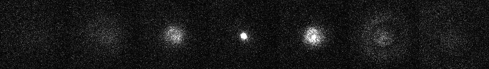

    Fluorescent bead imaged at 1000nm intervals.

    The central frame is in focus. Contrast levels have been set to show the PSF when out-of-focus.

When preparing a calibration image not all the spots are ideal due to problems with sample preparation. The spots should be inspected and only those that show a small in-focus spot and a smooth transition to out-of-focus should be selected for analysis. In addition there should be no surrounding spots that will contribute overlapping PSFs to the image. The spots can have their focal point in different z slices.

The spots should be marked using the ``ImageJ`` ``Point ROI`` tool. Right-clicking on the toolbar button will allow the tool to be changed to multiple-point mode. Clicking the image will add a point. Points can be dragged using the mouse and a point can be removed by holding the ``Alt`` key down while clicking the point marker. The marked spot centre is only an approximation and will be refined during analysis.

..
  No index

Analysis Mode
~~~~~~~~~~~~~

The plugin will create a combined PSF by aligning many selected PSFs. The plugin offers two analysis modes using different alignment procedures. When run the type of analysis must be specified:

.. list-table::
   :widths: 20 80
   :header-rows: 1

   * - Parameter
     - Description

   * - Mode
     - The analysis mode:

       * ``Stack alignment``: Align extracted image stacks using cross-correlation. The combined PSF is created using cubic spline interpolation and iteratively refined. Suitable for any PSF shape.
       * ``Gaussian fitting``: Fit the centre of each spot using a 2D Gaussian and align the centres. No refinement of the initial alignment is possible. This is suitable for spot-type PSFs.

   * - Radius
     - The square radius around each marked point to use for analysis. Any spot pairs within 2 x radius will be eliminated from analysis to prevent overlapping PSFs.

   * - Interactive mode
     - Set to **true** to manually accept/reject each spot analysis result. This allows the parameters to be fine tuned until successful and then they can be applied in batch analysis.

The following sections describe the different alignment modes.

.. index:: PSF Creator; Stack Alignment

Stack Alignment
~~~~~~~~~~~~~~~

Each selected PSF will be cropped into a 3D stack. The stacks are aligned using an iterative procedure. An initial guess for the z-centre is made based on the PSF type. All spots are aligned using the initial centre to create a combined PSF. The alignment is performed using a cubic spline function to model each PSF allowing sub-pixel resolution for each alignment. The alignment is then refined by aligning each PSF to the current combined PSF using normalised cross-correlation to update the relative centre of each PSF. After each alignment the combined PSF is rebuilt and this repeats until convergence (no change in the centres of the PSFs).

Convergence can be measured by the amount of change in the relative centres each iteration. The XYZ shifts to apply to each PSF are used to compute the root mean square deviation (RMSD) in XY and Z. The centre of mass of the combined PSF z-centre is also tracked and the XY shift computed. In interactive mode the change is logged to the ``ImageJ`` window but convergence is specified manually. In non-interactive mode convergence of computed RMSDs must be below a threshold and the change in the combined PSF centre must be below a threshold.

The following parameters can be specified:

.. list-table::
   :widths: 20 80
   :header-rows: 1

   * - Parameter
     - Description

   * - Alignment mode
     - The alignment mode:

       * ``2D Projections``: Align using the average shift required to align the 2D projections: XY, XZ and YZ. 2D projections are fast and alignment is numerically stable.
       * ``3D Projections``: Align using a single shift computed from a 3D cross-correlation. Although this is better in theory the 3D cross correlation can produce incorrect alignment results which are attributed to numerical instability. This mode is experimental; use with caution.

   * - Z radius
     - Define the depth around the z-centre to extract into a stack. If zero then the entire image stack is used. Use this to limit the size of each PSF and ultimately the depth of the final combined PSF. This value can be adjusted later in ``Interactive mode`` when previewing the extracted PSF.

   * - Alignment mode
     - The alignment mode:

       * ``Spot``: The PSF is 'spot-like'. The initial z-centre is estimated using the slice with the maximum intensity.
       * ``Astigmatism``: The PSF is from an astigmatic lens which changes the X and Y widths individually through the depth of focus. The initial z-centre is estimated using the slice with the smallest combined spot width.
       * ``Double Helix``: The PSF is from a split phase lens which renders two spots that spiral around a virtual centre through the depth of focus. The initial z-centre is estimated by identifying the two spots and their rotation angle and using a common angle for all PSFs.

   * - nm per pixel
     - The xy-pixel size of the calibration image.

   * - nm per slice
     - The z-slice step size used when acquiring the calibration image.

   * - Camera type
     - Configure the camera type. This is used to subtract the pixel offset bias from the input data. It is not strictly required for EMCCD/CCD cameras which have a common bias which will not effect the cross correlation. For sCMOS cameras the per pixel bias may effect correlation and a suitable per-pixel camera model must be provided to subtract the bias.

   * - Analysis window
     - Set the border to exclude from analysis on the PSF, for example computations on the PSF pixel values such as intensity and min/max. This can be used to ignore noise at the edge of the PSF. A setting of 0 uses the entire region.

   * - Smoothing
     - The LOESS smoothing parameter used to smooth data.

   * - CoM z window
     - The z-window around the PSF centre to use to compute the centre-of-mass (CoM). Use zero to compute the CoM with the z-centre slice. A higher number will incorporate neighbour slices.

   * - CoM border
     - The border to exclude around the PSF centre when computing the centre-of-mass. This is a fraction relative to the PSF image region. When zero the entire XY image plane is used to compute the centre. Exclude border pixels using a positive value.

   * - Alignment magnification
     - Set the magnification to apply to each PSF before alignment. Magnification uses tricubic interpolation to enlarge the PSF. Note: Magnification will remove noise from individual PSFs before alignment.

   * - Smooth stack signal
     - After magnification each PSF is normalised to sum to 1 so each contributes equally to the combined PSF. Normalisation uses the maximum signal across the PSF stack. Set to **true** to apply smoothing to the signal verses slice data before picking the maximum. Smoothing helps reduce noise in the final combined PSF by more equally weighting individual PSFs.

   * - Max iterations
     - The maximum number of iterations used to refine the alignment.

   * - Check alignments
     - Set to **true** to manually check each PSF alignment. This allows the new alignment to be accepted/rejected. If rejected then the existing alignment is used. The spot can also be excluded from any further alignments and will not contribute to the combined PSF.

       Only available in interactive mode.

   * - Sub-pixel precision
     - Set the resolution of alignment. Shifts computed below this resolution are considered equal.

   * - RMSD XY threshold
     - Set the convergence threshold for the RMSD of the XY translation applied to the PSF centres in the current alignment iteration. Only available in interactive mode.

   * - RMSD Z threshold
     - Set the convergence threshold for the RMSD of the Z translation applied to the PSF centres in the current alignment iteration. Only available in interactive mode.

   * - CoM shift threshold
     - Set the convergence threshold for the change in the centre-of-mass of the combined PSF in the current alignment iteration. Only available in interactive mode.

   * - Reset
     - Press this button to reset to the default settings.

Analysis
^^^^^^^^

Analysis begins by extracting all the spots into stacks based around their z-centre. The z-centres are determined automatically based on the spot type. In ``Interactive mode`` the analysis to determine the z-centre of each PSF can be inspected. The z-centre and z-radius can be manually changed and analysis settings updated based on the displayed PSF. For each candidate PSF the plugin will display:

* A outline box on the input image of the current PSF.
* The magnified PSF that was used for alignment.
* The XY, XZ and YZ projections of the PSF.
* A plot of the foreground intensity verses z slice. The foreground is the maximum intensity in the slice.
* A plot of the background intensity verses z slice. The background is the minimum intensity in the slice.
* A plot of the signal verses z slice. The signal is the sum of intensity in the slice.
* A plot of the spot width verses z slice for ``Spot`` and ``Astigmatism`` modes, otherwise the rotation angle verses z slice for ``Double Helix`` mode.

The plots show the current z-centre. A dialog is shown allowing the z-centre to be adjusted. The analysis parameters for the spots can also be adjusted based on inspecting the initial PSF and plot data:

* ``Z centre``: Adjusting this will move the z-centre on the plots and update the displayed images.
* ``Z radius``: Adjusting this will move the z-boundary on the plots and the displayed images. This setting determines the depth of pixel data extracted into a stack for alignment.
* ``CoM z window``: Can be adjusted using input from the PSF images. No interactive display is used for this parameter.
* ``CoM border``: Adjusting this will change the outline displayed on the PSF images.
* ``Analysis window``: Adjusting this will change foreground and background plots.

The following buttons are available:

* ``Reset``: Changes the z centre back to the centre computed by the automated analysis.
* ``Exclude``: Remove this PSF from future analysis.
* ``Include``: Include this PSF in the combined PSF.
* ``Cancel``: Stop the analysis.

When all the z-centres and radius have been selected the PSFs are extracted and aligned to create a combined PSF. The z-centre of the combined PSF is automatically determined using the spot type. In ``Interactive mode`` the initial combined PSF can be inspected. The plugin displays the combined PSF using the same plots and display as used for the individual PSF. The z-centre of the combined PSF can be updated using the interactive dialog and the CoM region redefined. The location of the z-centre and computation of the centre-of-mass affect convergence. Alignments only use the cross-correlation result and will be the same.

The initial combined PSF has been created by an initial alignment of all individual PSFs. Each PSF stores a centre relative to the combined PSF. The combined PSF can be refined by changing the alignment of each individual PSF; this is measured using a change in the relative centre of each individual PSF. This process is iterated until convergence (i.e. the change is very small).

Refinement of the combined PSF uses re-alignment of each individual PSF with cross correlation. If ``Check alignments`` was enabled then the alignment can be inspected. The spot is displayed and the plugin shows a dialog with the computed alignment shift in the relative spot centre with the following options:

* ``Exclude spot``: Remove this PSF from future analysis.
* ``Accept``: Accept the alignment translation.
* ``Reject``: Reject the alignment translation. The spot centre will not be updated this iteration. The spot will contribute to the combined PSF next iteration using its current relative position.
* ``Cancel``: Stop the analysis.

When all spots have been re-aligned the convergence criteria are evaluated. If the satisfied then the refinement stops, otherwise is continues. In ``Interactive mode`` a dialog is presented with the last RMSD change in the XY and Z centres of each spot and the change in centre-of-mass of the combined PSF. The dialog has the following options:

* ``Converged``: Stop refinement.
* ``Continue``: Continue with refinement.
* ``Cancel``: Stop the analysis.

When the refinement has completed the combined PSF must be finalised. The plugin will display the combined PSF and an interactive dialog allowing the PSF to be cropped and the output option specified:

.. list-table::
   :widths: 20 80
   :header-rows: 1

   * - Parameter
     - Description

   * - Slice
     - Adjust the currently displayed slice in the PSF. This is the 

   * - Crop border
     - Define the border around the PSF to crop. Use this to remove edge pixels that do not contribute to the PSF.

   * - Crop start
     - Define the number of initial slices to crop from the stack. Use this to remove slices that do not contribute to the PSF.

   * - Crop end
     - Define the number of final slices to crop from the stack. Use this to remove slices that do not contribute to the PSF.

   * - Output type
     - Define the output:

       * ``CSpline``: Save the PSF using a cubic spline function. The data precision and filename can be specified. 
       * ``Image PSF``: Generate an image representing the PSF. The magnification can be specified.

       Additional options can be specified using the ``...`` button. The size of the output will be shown in the dialog. This will vary based on the crop.

   * - Update ROI
     - If **true** the final centres of each individual PSF are marked on the original image. 

When the output options have been configured the combined PSF is cropped and enlarged to a final PSF. For a cubic spline the enlargement is 3x. For an Image PSF the enlargement magnification is specified in the output options. The enlarged PSF is displayed and options to compute the centre can be configured. The options are:

.. list-table::
   :widths: 20 80
   :header-rows: 1

   * - Parameter
     - Description

   * - z-centre
     - Define the z-centre of the PSF. It will be set on the current known z-centre.

   * - CoM z window
     - The z-window around the PSF centre to use to compute the centre-of-mass (CoM). Use zero to compute the CoM with the z-centre slice. A higher number will incorporate neighbour slices.

   * - CoM border
     - The border to exclude around the PSF centre when computing the centre-of-mass. This is a fraction relative to the PSF image region. When zero the entire XY image plane is used to compute the centre. Exclude border pixels using a positive value.

   * - Analysis window
     - Adjusting this will change foreground and background plots.

   * - Edge window
     - Define the window function applied to the PSF to smooth the edge to zero. A plot showing the window function is updated when the settings change. The function is a `Tukey window <https://en.wikipedia.org/wiki/Window_function#Tukey_window>`_.

   * - Crop to z-centre
     - If **true** the PSF will be cropped around the z-centre so the number of slices before and after the centre are the same.

The final processing of the PSF will redisplay the PSF and the X, Y, and Z projections and log the centre to the ``ImageJ`` log window. The PSF image has a JSON tag added to the image info property containing the z-centre, image scale and number of input images used. This will be saved and reloaded when using the TIFF file format in ``ImageJ``. This information is used in the ``PSF Drift``, ``PSF combiner`` and ``Create Data`` plugins. The information can be viewed using the ``Image > Show Info...`` command, e.g.

.. code-block:: json

    {
      "imageCount": 6,
      "centreImage": 482,
      "pixelSize": 25.0,
      "pixelDepth": 5.0,
      "notes": {
        "Dir": "/data/lmc2016/Beads/",
        "File": "sequence-as-stack-Beads-AS-Exp.tif",
        "Created": "25-Feb-2020 12:04"
      },
      "xCentre": 112.79481547687612,
      "yCentre": 112.17886326281314,
      "zCentre": 481.0
    }

.. index:: PSF Creator; Gaussian Fitting

Gaussian Fitting
~~~~~~~~~~~~~~~~

Each marked spot will be analysed in turn. Spots will only be used when there are no other spots within a specified distance to ensure a clean signal is extracted, i.e. no overlapping PSFs.

For each frame the plugin will run the ``Peak Fit`` algorithm to fit the amplitude, centre and width of the peak. Fitting will begin to fail when the peak is very out-of-focus as the PSF may not resemble a 2D Gaussian.

The amplitude is smoothed using a LOESS smoothing algorithm and plotted against the z-position. The amplitude should be highest when the peak is in focus. This point from the smoothed data is taken as the initial centre slice. The range of the in-focus spot is marked by moving in either direction from the centre slice until the smoothed amplitude is below a set fraction of the highest point.

The width and centre X and Y positions are then extracted for the in-focus range and smoothed using the LOESS algorithm. Since the amplitude is not a very consistent marker the centre slice is moved to the point with the lowest width. The spot centre is then recorded for the centre slice using the smoothed centre X and Y data.

The identification of the spot centre can be run automatically using configured parameters. Alternatively the plugin can run in interactive mode. In this instance the plugin will produce plots of the raw and smoothed data as shown in :numref:`Figure %s <fig_psf_creator_amplitude_plot>` and :numref:`Figure %s <fig_psf_creator_psf_plot>`. The calculated centre is shown as a green line and the user is asked if the analysis result should be accepted or rejected (see :numref:`Figure %s <fig_psf_creator_interactive_dialog>`). The user is able to adjust the centre of the spot using a slider if the centre analysis is incorrect.

.. _fig_psf_creator_amplitude_plot:
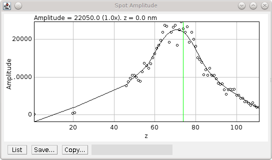

    Amplitude plot generated by the PSF Creator plugin.

    Amplitude plot shows raw data (circles) and smoothed data (black line). The centre z-slice is marked with a green line.

.. _fig_psf_creator_psf_plot:
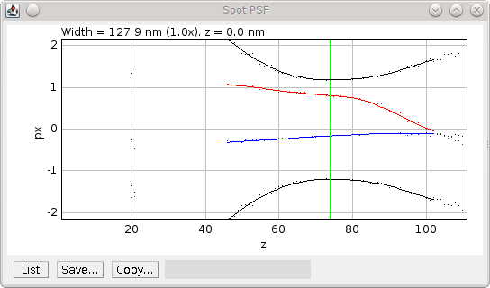

    PSF plot generated by the PSF Creator plugin.

    PSF plot shows raw data as spots and smoothed data from the in-focus region as a line. Width (black), X centre (blue) and Y centre (red). The centre z-slice is marked with a green line.

.. _fig_psf_creator_interactive_dialog:
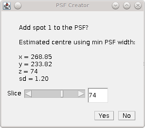

    PSF Creator Yes/No dialog shown in interactive mode.

When all the spot centres have been identified the plugin will generate a combined PSF image. Each spot is extracted into a stack and enlarged using the configured settings. The background is calculated for the spot using the N initial and M final frames and subtracted from the image. A `Tukey window <https://en.wikipedia.org/wiki/Window_function#Tukey_window>`_ is then applied to the spot so that the edge pixels approach zero.

If using interactive mode the user has a second chance to view the spot data and accept it. A plot is produced of the total intensity within half of the region surrounding the spot against the z-position (see :numref:`Figure %s <fig_psf_creator_intensity_vs_z>`). At this stage the centre cannot be adjusted but  it is possible to reject the spot. For example if the profile does not smoothly fall away in intensity from the centre as the spot is gradually defocussed.

.. _fig_psf_creator_intensity_vs_z:
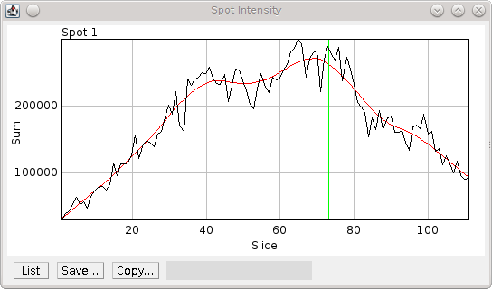

    Spot intensity within half the region surrounding the spot.

    The profile is produced after the image has been scaled, background normalised and windowed. Black) Raw data; Red) Smoothed data; Green) Spot z-centre.

For all spots that are accepted, the spots are then overlaid using their X, Y and Z centres into an average PSF image. It is assumed that the in-focus spot can be modelled by a 2D Gaussian. All the pixels within 3 standard deviations of the centre are summed as foreground pixels. The image is then normalised across all frames so that the sum of the foreground is 1.

Parameters
^^^^^^^^^^

.. list-table::
   :widths: 20 80
   :header-rows: 1

   * - Parameter
     - Description

   * - nm per slice
     - The z-slice step size used when acquiring the calibration image.

   * - Amplitude fraction
     - The fraction of the peak amplitude to use to mark the in-focus spot.

   * - Start background frames
     - The number of initial frames to use to calculate the background.

   * - End background frames
     - The number of final frames to use to calculate the background.

   * - Magnification
     - The magnification to use when enlarging the final PSF image.

   * - Smoothing
     - The LOESS smoothing parameter.

   * - Centre each slice
     - Set the centre of each slice to the centre-of-mass.

       Note that using this option may cause the centre of consecutive frames to shift erratically. A better approach is to disable this and compute a drift curve using the ``PSF Drift`` plugin.

   * - CoM cut off
     - The amplitude cut-off for pixels to be included in the centre-of-mass calculation. Any pixels below this fraction of the maximum pixel intensity are ignored as noise.

   * - Interpolation
     - Set the interpolation mode to use when enlarging images to create the final PSF.

When the configuration for the analysis has been configured a second dialog is shown to allow the fitting configuration to be specified. Details of the options can be found in section :numref:`{number}: {name} <fitting_plugins:Peak Fit>`.

It is recommended that the peak filtering be configured to allow very wide (out-of-focus) spots (e.g. ``Width factor`` >= 5) and the ``Signal strength`` should allow poor spots (e.g. 5).

Output
^^^^^^

The plugin will log details of each spot analysed to the ``ImageJ`` log window (e.g. centre and width). When complete the plugin will record the z-centre, scale and standard deviation of the final PSF image to the log. The plugin also fits a 2D Gaussian to the combined PSF image and records the fitted standard deviation at the z-centre as a measure of the PSF width.

The final PSF image is shown as a new image. The z-centre is selected as the active slice. The PSF image has a JSON tag added to the image info property containing the z-centre, image scale, number of input images used and the PSF width. This will be saved and reloaded when using the TIFF file format in ``ImageJ``. This information is used in the ``PSF Drift``, ``PSF combiner`` and ``Create Data`` plugins. The information can be viewed using the ``Image > Show Info...`` command, e.g.

.. code-block:: json

    {
      "imageCount": 6,
      "centreImage": 90,
      "pixelSize": 10.0,
      "pixelDepth": 20.0,
      "fwhm": 39.4433161942883,
      "notes": {
        "Dir": "/data/lmc2016/Beads/",
        "File": "sequence-as-stack-Beads-AS-Exp.tif",
        "Created": "25-Feb-2020 12:35"
      }
    }

When the final PSF image has been constructed the plugin will show the Amplitude and PSF plots for the final PSF image. A dialog is then presented allowing analysis of the PSF to be done interactively (:numref:`Figure %s <fig_psf_creator_spot_analysis_dialog>`).

.. _fig_psf_creator_spot_analysis_dialog:
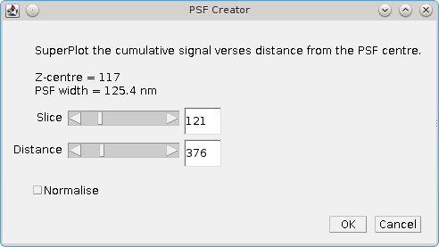

    PSF creator interactive spot analysis dialog

The ``Slice`` parameter controls the current slice from the PSF image that will be analysed. The
``Distance`` parameter controls the distance used for the cumulative signal analysis. Two additional plots are displayed and updated interactively when the ``Slice`` and ``Distance`` parameters change. One shows the percentage of the PSF signal at different z-depths that is within 3 times the standard deviation of the fitted PSF SD for the z-centre (:numref:`Figure %s <fig_psf_creator_spot_relative_signal_plot>`). This shows that as the spot moves out of focus less of the signal is captured within the same area.

.. _fig_psf_creator_spot_relative_signal_plot:
.. figure:: images/psf_creator_spot_relative_signal_plot.png
    :align: center
    :figwidth: 80%

    Relative signal verses z-depth for a PSF spot.

    The plot shows the percentage of signal within 3 times the standard deviation (SD) of the fitted PSF for the z-centre against the depth. The green line shows the currently active slice.

A plot is also shown of the cumulative signal as the distance from the centre of the PSF increases (:numref:`Figure %s <fig_psf_creator_spot_cumulative_signal_plot>`). This plot is drawn using data for the currently active slice in the PSF.

.. _fig_psf_creator_spot_cumulative_signal_plot:
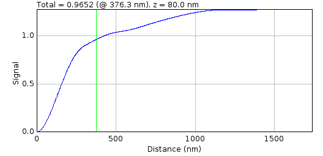

    Cumulative signal verses radius for a PSF spot.

    The cumulative signal is shown for the slice and distance (green line) as selected in the ``PSF Creator`` interactive spot analysis dialog.

The green line shows the current distance selected and the total is shown in the plot label. If the ``Normalise`` parameter is selected then the cumulative signal up to the distance is normalised to 1 on the chart (but the label is unchanged). This plot visualises how much of the PSF signal is missed at a given distance and how the focal depth changes how the signal is distributed. Note: The y-axis scale is reset when the ``Distance`` or ``Normalise`` parameters change. It is not reset when the ``Slice`` parameter changes allowing visualisation of the magnitude changes as the slice is adjusted.

The interactive dialog is a blocking window. It must be closed before the plots can be saved.

Finally the Centre-of-Mass (CoM) of the PSF is computed and shown on a plot (:numref:`Figure %s <fig_psf_creator_spot_com_plot>`). The CoM is computed using all pixels within a fraction of the maximum pixel intensity of the image. The default is 5%. This should avoid including noise in the CoM calculation. If the PSF is symmetric about the fitted centre then the CoM drift should be low. In the example shown in :numref:`Figure %s <fig_psf_creator_spot_com_plot>` the red line (X-drift) is approximately flat but the blue line (Y-drift) shows that the PSF is skewed in the Y direction as the CoM moves past the centre determined by the fitting algorithm.

.. _fig_psf_creator_spot_com_plot:
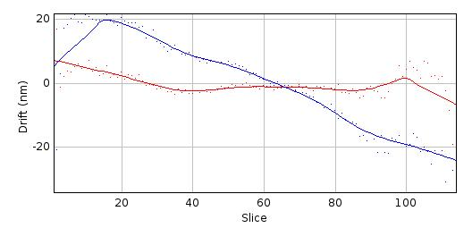

    Centre-of-mass (CoM) verses z-depth for a PSF spot.

    Centre-of-mass computed for each slice in the final combined PSF. The raw data is shown as points with a smoothed curve for X (red) and Y (blue) coordinates.

.. index:: ! PSF Drift

PSF Drift
---------

The ``PSF Drift`` plugin computes the drift of the centre of a PSF image against the slice. The centre is defined by fitting a simulated image using Gaussian 2D fitting. The drift curve thus defines a correction factor to apply to the PSF when simulating ground-truth images to be used for benchmarking. This allows scoring benchmarking fit results using distance metrics to compare actual and predicted localisations. For example if rendering an image from a PSF model always results in fitting the centre with a -50nm offset, then the image can be rendered for benchmarking with a corresponding +50nm offset and a perfect fit would have a distance of 0nm between predicted and actual.

When the plugin is run it searches all the open images for valid PSF images. These will be tagged in the image info property with settings containing details of the PSF. The plugin then presents a dialog where the user can configure how to compute the drift curve (:numref:`Figure %s <fig_psf_drift_dialog>`).

.. _fig_psf_drift_dialog:
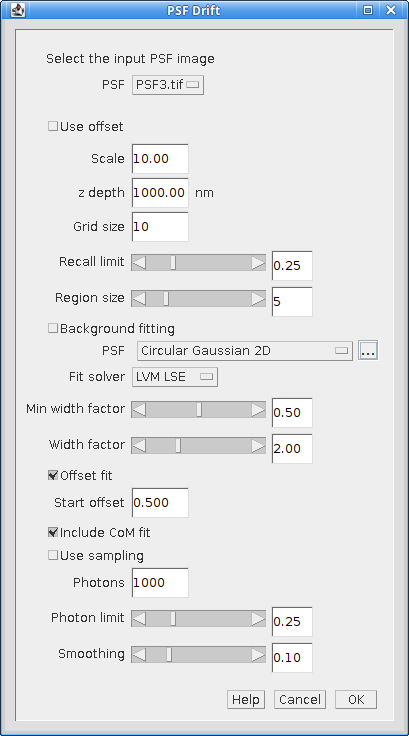

    PSF Drift dialog

.. index:: Drift Calculation

Drift Calculation
~~~~~~~~~~~~~~~~~

The drift curve represents the centre of the PSF for each image in the PSF stack. This is computed by drawing the PSF into an image at a specified scale and then fitting the image with a 2D Gaussian (as per the
``Peak Fit``
plugin). The PSF can be rendered using two modes:

* PSF rendering uses bilinear interpolation to scale the PSF before insertion. The integral of the scaled PSF over each output pixel is then used to set the image pixel value.
* PSF sampling uses the PSF as a 2D probability distribution. The coordinates from random sampling of this distribution are then mapped to the output pixels to generate the counts for each pixel.

The PSF is drawn multiple times to reduce bias. The PSF is inserted into the image centre pixel at each point on an NxN grid, so reducing bias from the fitting due to the location the PSF was inserted. For example a grid of 10 would insert the PSF at 100 locations spaced at 0.1 pixel intervals starting from 0 in each dimension. 100 fits would be computed and the recall (number of successful fits) recorded.

Fits are accepted if the fitting algorithm successfully converged and the fitted signal is within a range of the actual signal:

.. math::

    f \times \mathit{actual} < \mathit{fitted} < 2 \times \mathit{actual}

where :math:`f` is a user configured lower fraction.

Parameters
~~~~~~~~~~

.. list-table::
   :widths: 20 80
   :header-rows: 1

   * - Parameter
     - Description

   * - PSF
     - The PSF used to compute the drift.

   * - Use offset
     - Use an existing drift curve stored in the PSF to offset the insert location.

       Note that this can be used to check that the existing drift curve is correct for the given image reconstruction and fitting settings.

   * - Scale
     - The reduction scale for the PSF.

   * - z depth
     - The range of the PSF stack to compute the drift. z-positions outside this range will not be processed. Use this option to speed up processing when the depth-of-field of the PSF is known.

   * - Grid size
     - The number of intervals to use to construct the NxN grid for inserting the PSF into the centre pixel.

   * - Recall limit
     - The fraction of fits that must be successful for a valid drift calculation.

   * - Region size
     - Defines the size of the image to insert the PSF into. The actual size is 2N+1.

   * - Background fitting
     - Select this to allow the algorithm to fit the background. Note that the background should be zero as no data is inserted into the image apart from the PSF. This can be used to more closely match the fitting performed on real data.

   * - Fit solver
     - The solver used to fit the data.

       Note that a second dialog will be presented for the selected solver to be configured. The values are initially set to the defaults which should work in most cases. See the ``Peak Fit`` plugin for details of how to configure the solver (section :numref:`{number}<fitting_plugins:Peak Fit>`).

   * - Fit function
     - The function used to fit the data.

   * - Offset fit
     - Fit each image with the initial guess for the centre shifted by an offset. The guess is shifted in each of the 4 diagonal directions from the true centre.

   * - Start offset
     - The offset to use with the ``Offset fit`` option.

   * - Include CoM fit
     - Fit each image with the initial guess for the centre as the centre-of-mass of the pixels.

   * - Use sampling
     - Draw the PSF by sampling it as a 2D probability distribution. The alternative is to draw it exactly using bilinear interpolation to scale the PSF.

   * - Photons
     - The signal to draw in photons.

   * - Photon limit
     - The lower fraction of the actual photons where fits will be rejected. Fits are always rejected when the photons are 2-fold higher than the actual value.

   * - Smoothing
     - The smoothing parameter used to smooth the fit curve using the LOESS smoothing algorithm.

Output
~~~~~~

The drift for each frame is computed as the mean of all the fitted centres. The curve represents the average centre of the PSF following idealised fitting of the data with the chosen ``Fit solver`` and ``Fit function`` (i.e. no noise other than Poisson noise if ``Use sampling`` is enabled).

The drift curves for each dimension (X & Y) are then plotted along with the recall against the z-depth. The z-axis is limited to the input z-depth or the available depth of the PSF, whichever is lower.

.. index:: Drift Curve

Drift Curve
^^^^^^^^^^^

The drift curve plot shows the average centre of spots fitted to the simulated image. :numref:`Figure %s <fig_psf_drift_curve>` shows an example Y drift curve. The drift is minimal when the PSF is in focus however the centre drifts nearly a full pixel as the PSF moves out of focus. This is due to an alignment error with the microscope optics. Note that the curve shows the standard error for each centre; a high standard error would indicate that the curve is not a good estimate at the given point.

.. _fig_psf_drift_curve:
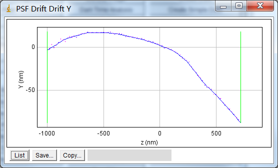

    Example drift plot for the Y centre of the PSF

    The plot shows the average Y centre when simulated spots are fit using a Gaussian 2D function.Original data points in blue with magenta vertical bars for the standard error of the mean. The smoothed curve is shown as a blue line. Green vertical lines mark the points where the recall falls below the configured limit. The PSF has an equivalent pixel pitch of 107nm.

.. index:: Recall Curve

Recall Curve
^^^^^^^^^^^^

The recall curve shows the fraction of fits that were successful at each z-depth. The example in :numref:`Figure %s <fig_psf_drift_recall_plot>` shows that fitting is successful until 720 nm out-of-focus. In this case the z-depth used for analysis could be extended as the recall is still 1 at the maximum negative depth (-1000nm).

.. _fig_psf_drift_recall_plot:
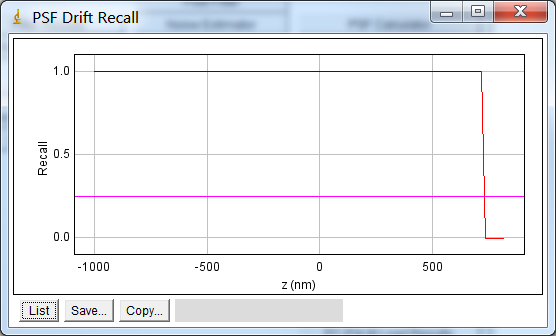

    PSF drift recall plot.

    The plot shows the fraction of simulated PSF spots successfully fit at each z-depth. The magenta line indicates the recall limit.

.. index:: Saving the Drift

Saving the Drift
~~~~~~~~~~~~~~~~

When the calculation is complete the user is presented with the option to save the curve to the PSF (image :numref:`Figure %s <fig_psf_drift_save_dialog>`). The curve is added as settings stored in the Image Info data field. If the entire stack is not covered by the calculated drift curve then the plugin provides the user with the option to average the last n frames of the drift curve in each direction and store this average drift for the terminal frames.

.. _fig_psf_drift_save_dialog:
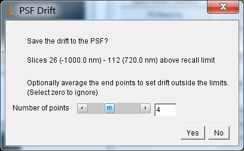

    PSF drift save dialog.

Click ``Yes`` to save the curve, or ``No`` to discard the results.

The saved drift can be used to offset the centre of each frame of the PSF when reconstructing images. This can be done when running the
``PSF Drift``
plugin to check the curve is correct. :numref:`Figure %s <fig_psf_drift_curve_corrected>` shows an example of a re-run of the plugin using the recently computed drift curve. Note that the maximum drift has been reduced from -87nm to -7.4nm and most of the drift is below 0.5nm.

.. _fig_psf_drift_curve_corrected:
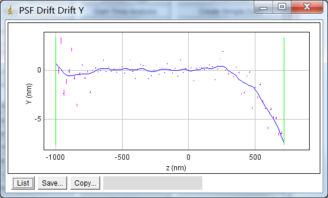

    Example drift plot constructed using a computed drift curve to correct the simulated spots.

Note: The saved drift curve is used by default in the
``Create Data``
plugin when reconstructing images. This allows benchmarking data to be constructed by placing the localisation data at the average centre that would be found by idealised fitting of that PSF.

.. index:: ! PSF Combiner

PSF Combiner
------------

The ``PSF Combiner`` plugin produces an average PSF image from multiple PSF images. PSF images can be created using the ``PSF Creator`` plugin (see section :numref:`%s<model_plugins:PSF Creator>`).

When the plugin is run it searches all the open images for valid PSF images. These will be tagged in the image info property with the z-centre, image scale and number of input images used to create the PSF. The plugin then presents a dialog where the user can select the images to combine (:numref:`Figure %s <fig_psf_combiner_dialog>`). The dialog is presented iteratively to allowing only one image to be selected from the available images each time. Select the first image from the dialog and click ``OK`` to include the image. The list of available images is then updated and the dialog reshown. Click ``Cancel`` to stop adding images. Note that the iterative addition of images allows the plugin to be fully supported by the ``ImageJ`` macro recorder.

.. _fig_psf_combiner_dialog:
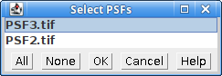

    PSF Combiner dialog

When the input images have been selected the plugin checks that each PSF has the same image scale. Note that input PSFs can have different X, Y and Z dimensions. If the scales are not the same then the images cannot be combined and an error is shown. Otherwise the plugin then presents a dialog where the z-depth of the combined PSF can be selected. This allows the size of the output PSF to be limited to N frames above and below the z-centre.

The combined PSF is created by overlaying the x,y,z-centres and summing the individual PSF images. Each PSF is weighted using the number of images used to created the PSF divided by the total number of images:

.. math::

    \mathit{weight}_{i}=\frac{n_{i}}{\sum n_{i}}

The combined PSF image is shown as a new image. The z-centre is selected as the active slice. The PSF image has a tag added to the image info property containing the z-centre, image scale and number of input images used. This information is used in the
``Create Data``
plugin. The information can be viewed using the
``Image > Show Info...``
command.

.. index:: ! PSF HWHM

PSF HWHM
--------

The ``PSF HWHM`` plugin computes the half-width at half-maxima (HWHM) curve for a PSF image assuming the PSF is a peaked maxima. The curve can be used to redefine the z-centre of the PSF and saved as metadata for the PSF image. PSF images can be created using the ``PSF Creator`` plugin (see section :numref:`%s<model_plugins:PSF Creator>`).

The concept of HWHM only applies to a PSF that is a peaked maxima. This may not be true for an image PSF that shows diffraction patterns at out-of-focus regions. To approximate a peak maxima for all z-depths it is assumed that the peak is Gaussian. For each frame the centre of the PSF is identified. The width is gradually increased until the sum equals the integral of a 2D Gaussian at HWHM. This value thus corresponds to the HWHM of the 2D Gaussian approximation of the peak. It is the expected width for peaks fit to the image using the ``Peak Fit`` plugin which approximates PSFs using a 2D Gaussian.

When the plugin is run the following parameters can be configured:

.. list-table::
   :widths: 20 80
   :header-rows: 1

   * - Parameter
     - Description

   * - PSF
     - The PSF used to compute the HWHM curve.

   * - Use offset
     - Use a calibrated PSF centre drift curve stored in the PSF to define the centre of each slice. Otherwise use the pixel centre of the input image as the centre of each slice.

   * - Smoothing
     - The smoothing to apply to the curve. This is the bandwidth parameter for a LOESS smoothing algorithm and corresponds to the fraction of surrounding data used for local smoothing of each point.

Clicking the ``OK`` button begins the analysis. The HWHM for each dimension is evaluated separately to produce a HWHM curve for the X and Y dimensions. This is averaged to a combined curve and shown on an interactive plot (see :numref:`Figure %s <fig_hwhm_curve>`).

.. _fig_hwhm_curve:
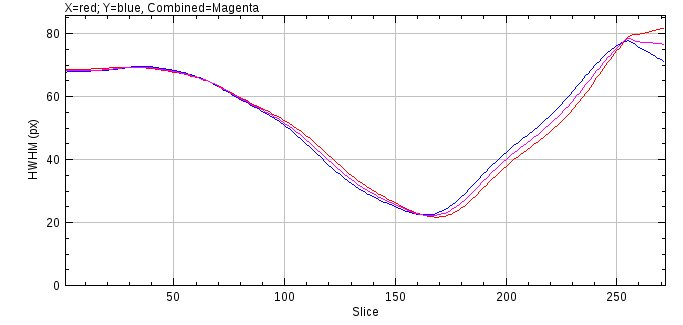

A dialog is shown that displays the current z-centre and FWHM (full-width at half-maxima) stored for the PSF and a new z-centre and FWHM defined by the HWHM curve (see :numref:`Figure %s <fig_hwhm_curve_dialog>`). Upon initialisation the minimum of the combined HWHM defines the new z-centre of the PSF. This can be moved using the dialog slider and the position of this slice is highlighted on the HWHM curve in green. The original PSF image is updated to the selected slice for reference. This allows choosing a new centre based on the HWHM curve. If the ``Yes`` button is selected the new z-centre and/or the new HWHM can be saved to the metadata for the PSF image. Note that the metadata for a PSF image is stored in the ImageJ info property and can be viewed using ``Image > Show Info...``.

.. _fig_hwhm_curve_dialog:
.. figure:: images/hwhm_curve_dialog.png
    :align: center
    :figwidth: 80%

.. index:: ! Cubic Spline Manager

Cubic Spline Manager
--------------------

The ``Cubic Spline Manager`` provides management of the cubic spline models of point spread functions (PSFs). Cubic spline models are created by the ``PSF Creator`` plugin (see :numref:`%s<model_plugins:PSF Creator>`).

When the ``Cubic Spline Manager`` plugin is run a dialog allows a choice from the following options:

.. list-table::
   :widths: 20 80
   :header-rows: 1

   * - Option
     - Description

   * - Print all model details
     - Write details of each cubic spline model to the ``ImageJ`` log window.

   * - View a spline model
     - Render a stack image using the entire PSF model.

   * - Load a spline model
     - Load a model from an external file.

   * - Load from directory
     - Load all models from a directory.

   * - Delete a spline model
     - Deletes a model from the settings.

   * - Render the spline function
     - Render an image dynamically using the PSF model.

..
  No index

Print All Model Details
~~~~~~~~~~~~~~~~~~~~~~~

This options prints the details of each model to the ``ImageJ`` log window. The settings contain the name of the model, the details of the file containing the model data and the scale (in nm) of the PSF model. Note that the scale defines the spacing interval between data points in the cubic spline. For efficiency during fitting of a model to data this spacing should be an integer factor of the pixel width, e.g. for a pixel width of 104nm the spline scale could be 104, 52, 26, etc.

..
  No index

View a spline model
~~~~~~~~~~~~~~~~~~~

Presents a selection dialog allowing the model to be selected and the output magnification. The magnification should be an integer. The model is then used to render a stack image of the PSF at the given magnification.

..
  No index

Load a Spline Model
~~~~~~~~~~~~~~~~~~~

Presents a file selection dialog where a spline model can be selected. Models are contained in a single file. The file has metadata identifying the model format. The plugin will attempt to load the cubic spline model. The result is recorded in the ``ImageJ`` log window. If successful then the model is named using the filename and metadata on the model is added to the settings. The model is then available for use. Any existing model with the same name will be replaced.

Note: Model files are stored in a binary format. The files can be copied to another location and reloaded. It is also possible to allow multiple ``ImageJ`` instances to load models from a network resource.

..
  No index

Load from Directory
~~~~~~~~~~~~~~~~~~~

Presents a directory selection dialog allowing a model directory to be chosen. The plugin will attempt to load each file in the directory. The results are recorded in the ``ImageJ`` log window. If a file was a valid model then it is named using the filename and added to the settings. Any existing model with the same name will be replaced.

..
  No index

Delete a Spline Model
~~~~~~~~~~~~~~~~~~~~~

Presents a selection dialog allowing the model to be selected. The selected model is then removed from the settings.

Note: The model data file is not deleted.

..
  No index

Render the Spline Function
~~~~~~~~~~~~~~~~~~~~~~~~~~

Presents a selection dialog allowing the model to be selected. The selected model is then dynamically rendered on an image. An interactive dialog is displayed allowing the relative centre of the PSF to be adjusted. This has the effect of translating the model in the XY plane or viewing a different part of the model in the z-axis.

The ``Scale`` parameter is used to control the sampling interval of the cubic spline. A scale of 1 will sample the model at the spacing interval of the spline data points. A scale of 2 samples at every other data point. Higher scales sample every ``n`` data points where ``n=Scale``. This can be used to show how a model with a higher resolution than the image pixel width renders the PSF, e.g. a model with a 53nm spline scale can be rendered on a 106nm image using ``Scale=2``.

For maximum efficiency the scale should be an integer. However the translations may be any value as the cubic spline is a continuous function and interpolates appropriately.

.. index:: ! Astigmatism Model Manager

Astigmatism Model Manager
-------------------------

The ``Astigmatism Model Manager`` provides creation and management of astigmatism models for 2D Gaussian point spread functions (PSFs) imaged using an cylindrical lens. This creates a spot where the width of the spot in the X and Y dimensions varies with the Z depth. This occurs as the focal planes for the X and Y dimensions are not colocated.

The model provides a function to compute the X and Y width using Z and is based on Smith *et al*, (2010) *Nature Methods* **7**, 373-375 and Holtzer *et al* (2007) *Applied Physics Letters* **90**, 1–3.

When the ``Astigmatism Model Manager`` plugin is run a dialog allows a choice from the following options:

.. list-table::
   :widths: 20 80
   :header-rows: 1

   * - Option
     - Description

   * - Create Model
     - Create a model by fitting a 2D Gaussian to a PSF image.

   * - Import Model
     - Import a model from file.

   * - View Model
     - Show the model function and an example PSF image.

   * - Delete Model
     - Delete a model from the settings.

   * - Invert Model
     - Invert a model along the z-axis.

   * - Export Model
     - Export a model to file.

.. index:: Create Model

Create Model
~~~~~~~~~~~~

Create a model by fitting a 2D Gaussian to a PSF image. An stack image must be available with an example PSF marked with a single ``ImageJ`` point ROI. Multiple points are not currently supported because it does not appear to be necessary. Repeating the analysis on different examples should create a model with approximately the same width curve. This is simplified by the plugin saving the configuration options used in the last analysis.

Presents a dialog where PSF image can be selected. The plugin then asks for the z-step resolution of the PSF stack and presents a dialog where the fitting can be configured. The fitting options are a simplified version of the options available in the ``Peak Fit`` plugin (see :numref:`{number}: {name} <fitting_plugins:Peak Fit>`). The same dialog fields are used to allow users familiar with ``Peak Fit`` to configure the options. The camera used to image the data must be configured and the expected PSF type. This should be an elliptical Gaussian; other options that do not fit independent X and Y widths will produce data that cannot be fit with a model. Fitting is most sensitive to the initial PSF width parameter so this should be tried using a few different sizes. The ``Fitting Width`` parameter should be wide enough to capture the out-of-focus PSF. Filtering options can be used to discard bad fits for out-of-focus spots. The ``Width factor`` should be high so that wide spots can be used to model the out-of-focus PSF.

Once the fitting is configured the plugin will fit each frame of the input image. The data is used to produce the plot of the following metrics against the z depth:

.. list-table::
   :widths: 20 80
   :header-rows: 1

   * - Metric
     - Notes

   * - Intensity
     - This should be a smooth line showing the PSF intensity is gradually lost when out-of-focus

   * - X or Y Width
     - This should show gradual change of the widths with the z position and a clear separation of the focal plane (minimum width) for the two dimensions.

   * - X or Y Position
     - This should show only gradual drift of the spot position. Large shifts of the fitted centre indicate that the PSF data may be poor or the fit settings were not optimal.

The plots can be used to select the data that will be used to fit the model. The model will map the z position to the PSF widths. Thus the data used for fitting should contain points on a smooth curve over a large range of z. This data is used to estimate the initial model parameters which are then refined using a least squares fitting. Width outliers are expected at the edge of the z range so the plugin displays an interactive dialog where the minimum and maximum z can be selected. The currently specified levels are shown on the plot using an ROI (see :numref:`Figure %s <fig_astig_model_manager_create_model_curve>`). The dialog allows the following options to be set to control building the model:

.. list-table::
   :widths: 20 80
   :header-rows: 1

   * - Parameter
     - Description

   * - Min z
     - The minimum z slice from the stack to use when building the model.

   * - Max z
     - The maximum z slice from the stack to use when building the model.

   * - Smoothing
     - The smoothing parameter for a LOESS smoothing on the raw data before estimating model parameters.

   * - Show estimated curve
     - If **true** after the initial estimation of model parameters the analysis pauses to display the estimate on the width curve. This is used to verify that the estimation (after data smoothing) was good.

   * - Weighted fit
     - If **true** weight each observation using 1/observation. Thus small widths (in focus positions) have higher weights.

The model is created by fitting the parameters using the raw data. The model is then shown on the width curve over the original data (see :numref:`Figure %s <fig_astig_model_manager_fit_model_curve>`). The plugin has the following options to save the model:

.. list-table::
   :widths: 20 80
   :header-rows: 1

   * - Parameter
     - Description

   * - Save model
     - Set to **true** to save the model. Select this option if the model is a good visual fit to the raw PSF width data.

   * - Model name
     - The name of the saved model.

       If the name is already in use the plugin will present option to overwrite the existing model or rename the new model.

   * - Save fit width
     - Set to **true** to save the final model PSF widths in the fitting configuration. Select this option to allow the plugin to be re-run on the same example PSF or a different PSF with an optimal width determined by the model.

       This can be used to iterate the building of a model when the initial estimate for the peak width was not appropriate.

.. _fig_astig_model_manager_create_model_curve:
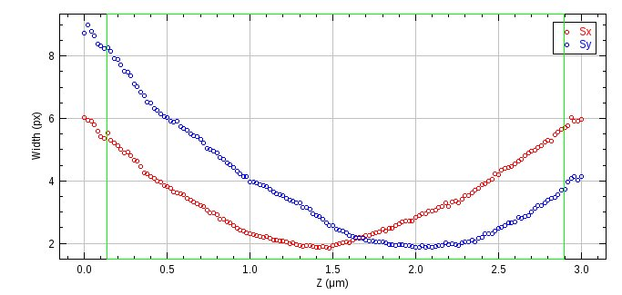

    Astigmatism raw data width curve

    The curve shows the PSF x and y widths against the z depth. The z region currently selected for use in building the model is shown an an ROI.

.. _fig_astig_model_manager_fit_model_curve:
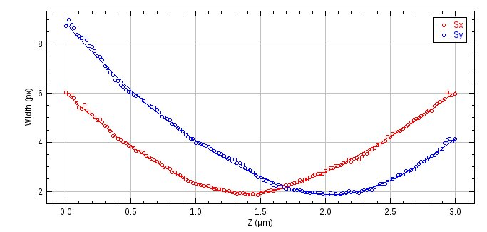

    Fitted astigmatism model width curve

    The curve shows the PSF x and y widths against the z depth. The astigmatism model function that maps the z position to the width is shown using a line.

..
  No index

Import Model
~~~~~~~~~~~~

Presents a dialog where a model name is specified and the import file can be selected. The plugin will attempt to load the astigmatism model. The result is recorded in the ``ImageJ`` log window. If successful then the model is saved to settings and is then available for use.

..
  No index

View Model
~~~~~~~~~~

Display the model function as a width curve against the z dimension (see :numref:`Figure %s <fig_astig_model_manager_view_model_curve>`) and an example 2D Gaussian image for a given z depth. The following options are available:

.. list-table::
   :widths: 20 80
   :header-rows: 1

   * - Option
     - Description

   * - Model
     - The model to view.

   * - z distance unit
     - The distance unit for the z dimension. The default is the native unit used by the model.

   * - s distance unit
     - The distance unit for the Gaussian width. The default is the native unit used by the model.

   * - Show depth of focus
     - If **true** display the depth of focus on the model width curve. The depth of focus is a property of the model. Dotted lines will show the depth of focus +/- from the focal plane in the X and Y dimensions using the same colour as the function.

   * - Show combined width
     - If **true** show a combined width curve. The combined width is computed using :math:`s = \sqrt{|s_x s_y|}`.

   * - Show PSF
     - If **true** show an example 2D Gaussian PSF for the current z value; the slice is set using an interactive dialog.

If the ``Show PSF`` option was selected an interactive dialog is shown allowing the z value to be changed. This will update the example 2D Gaussian PSF. The z value is marked on the model function width curve for reference. The example PSF may optionally be calibrated in the units specified by the ``s distance unit`` parameter. This allows the ``ImageJ`` ROI tools to be used to measure distances on the image using the appropriate units.

.. _fig_astig_model_manager_view_model_curve:
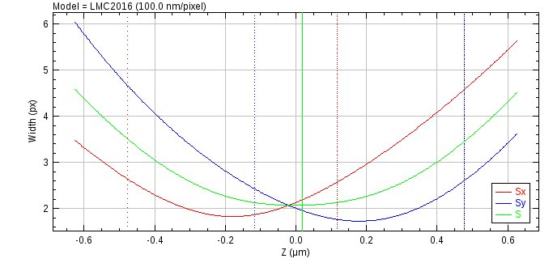

    Astigmatism model width curve

    The width curve shows the x and y widths against the z depth. The combined width is shown in green and dotted lines in red and blue mark the depth of focus around the focal plane for X and Y respectively. The current z position in the view model dialog is shown as a ROI line.

..
  No index

Delete Model
~~~~~~~~~~~~

Presents a selection dialog allowing the model to be selected. The selected model is then removed from the settings.

..
  No index

Invert Model
~~~~~~~~~~~~

Inverts the z-orientation of a model. An astigmatism model creates a focal plane for the X and Y dimensions above and below respectively the z-centre. This option will invert the model to change the orientation. It can be used for example if a model was created with an incorrect specification of the imaging direction of the PSF along the z axis.

Presents a selection dialog allowing the model to be selected. The selected model is then inverted.

..
  No index

Export Model
~~~~~~~~~~~~

Presents a dialog where a model and export file can be selected. The model is saved to the file in a text format.

.. index:: ! Create Data

Create Data
-----------

Creates an image by simulating single molecule localisations using a model of photoactivated diffusing fluorophore complexes. The simulation is partly based on the work of Colthorpe, *et al* (2012).

.. index:: Simulation

Simulation
~~~~~~~~~~

Fluorophores initialise in an inactive state where they do not fluoresce. The switch to an active state is caused by subjecting the fluorophore to an activation laser. Once in an active state the molecule can fluoresce when subjected to a readout laser. The amount of fluorescence is proportional to the intensity of the readout laser. The active molecule can reversibly switch into a dark state where it does not emit fluorescence. Switching on and off causes the molecule to blink. Eventually the molecule will irreversibly bleach to a state where it no longer fluoresces.

Molecules are randomly positioned in a 3D volume. These are then subjected to photoactivation laser illumination and readout laser illumination. The illumination is not constant across the image but uses a radial fall-off function to simulate the darkening towards the edges of a wide-field microscope image. The light fall-off is 50% at the field edge. Illumination light and background fluorescence are subject to Poisson noise.

The read-out laser is a continuous light source. The activation laser can be continuous or pulsed. When pulsed mode is used all readout frames have a low level of activation light. This is interspersed with pulses of the activation laser at set intervals. The pulse is deemed to be a zero time event. The ratio between the amount of energy a fluorophore can receive during the pulse and between pulses can be controlled. This allows the simulation to vary the level of background activation, i.e. molecules that activate in frames not directly following an activation pulse.

The amount of photons required for photo-activation of each molecule is defined by sampling from a random exponential distribution. The average for this distribution is set using the cumulative number of photons in the centre of the field at 30% of the simulation length. Thus approximately 50% of the molecules should have activated by 1/3 of the simulation.

The simulation allows for a single dark state or dual dark state model. For the single dark state model the fluorophore can be either on or off (dark state). The number of times the fluorophore enters the dark state is selected from a probability distribution. For the dual dark state model the fluorophore can be on or in either dark state 1 or dark state 2. The dark state can only transition between the on state. There is no transition from dark state 1 to 2 or the reverse. The number of times the fluorophore enters the 2\ :sup:`nd` dark state is selected from a probability distribution. For each time the molecule is in the on state the number of times the fluorophore enters the 1\ :sup:`st` dark state is selected from a probability distribution. The dual dark state model can be used to simulate flickering of the fluorophore at a fast rate (i.e. moving between the on state and dark state 1) broken by longer period of off time (i.e. moving between the on state and dark state 2).

The number of blinks is sampled from a Poisson or Geometric distribution and the length of time in the on-state and off-state(s) are sampled from exponential distributions. The average for these distributions are set as simulation parameters.

Analysis of the signal-per-frame verses the time for the lifetime of the fluorophore shows that the signal is approximately constant, i.e. the signal does not get weaker over time. However it does vary which can be attributed to the fluorophore orientation. Consequently the signal for each fluorophore is modelled by sampling from a distribution with a specified mean emission rate (in photons/second). A fixed distribution uses the same rate for all fluorophores. A uniform distribution chooses the signal-per-frame uniformly between a lower and upper limit. A custom distribution can be specified by loading an empirical distribution from a file, for example inputting a set of observed photon budgets extracted from real data. A gamma distribution can be used; this is based on analysis of the signal of mEOS3 fluorophores in yeast that shows the signal-per-frame can be modelled using a gamma distribution. Finally a correlated distribution can be used where the signal-per-frame is correlated to the total on time. This is based on analysis of mEOS3 fluorophores in yeast that shows the signal-per-frame of a molecule is negatively correlated with the total on-time, i.e. molecules that are on for a shorter amount of time have a brighter signal. This may be because the release of more photons per second causes the molecule to expend the total photon budget and then photo bleach in a shorter time. Thus the simulation allows the total on-time of the fluorophore to be negatively correlated with the photon emission rate.

Molecules can move using diffusion. The diffusion is modelled using a random walk as described in the
``Diffusion Rate Test`` plugin (see section :numref:`calibration_plugins:Diffusion Rate Test`). The diffusion can be random or confined to a specified volume. The diffusion can be limited to a fraction of the molecules by fixing a random sample of the molecules.

The simulation runs for a specified duration at a given time interval per simulation step. At each step the simulation calculates the new position, if diffusing, and fluorescence of the molecules. These are then drawn on an image at a specified exposure rate. The simulation interval does not have to match the exposure time of the output image. Using a shorter simulation step than the exposure time is useful when simulating diffusion molecules. The appearance of the fluorophore is modelled using a configurable point spread function (PSF).

When the molecules have been simulated the results can be filtered to remove low signal spots. This allows the ``Create Data`` plugin to generate images at a certain signal-to-noise ratio for benchmarking experiments.

The simulation creates an ``ImageJ`` image stack and the underlying data can be saved in various formats. The raw localisations per frame are also written to a results set in memory
allowing the results of fitting the simulated image to be compared to the actual underlying data.

The simulation computes the fluorophores using a single worker thread. The time intensive
rendering of the localisations as an image is multi-threaded. The number of threads uses the ``ImageJ`` setting under ``Edit > Options > Memory & threads...``.

.. index:: Point Spread Function

Point Spread Function
~~~~~~~~~~~~~~~~~~~~~

The appearance of the fluorophore is modelled using a configurable point spread function (PSF). The number of photons in the fluorophore is used to create a Poisson random variable of the number of photons, N, that are actually observed. The PSF is then sampled randomly N times and each sample is mapped from the PSF coordinates on to the correct pixel in the image.

.. index:: Gaussian PSF

Gaussian PSF
^^^^^^^^^^^^

The Gaussian PSF uses a 2D Gaussian function. The width of the Gaussian is obtained from the microscope parameters (wavelength and Numerical Aperture) using the same approximation formula as the
``PSF Calculator``
plugin (see section :numref:`%s<calibration_plugins:PSF Calculator>`). Alternatively the width can be specified explicitly in the plugin. The width changes using a z-defocussed exponential model. The width is scaled using the following formula:

.. math::

    \mathit{Scale}=1/(\exp (-\left|{z}\right|\cdot \ln (2)/\mathit{zDepth}))

where
:math:`z` is the z position relative to the focal plane (z=0) and
:math:`\mathit{zDepth}` is the depth at which the width should be double.

PSF sampling is done by drawing a Gaussian random variable for the X and Y coordinates and then adding this location to the image.

.. index:: Airy PSF

Airy PSF
^^^^^^^^

The Airy PSF uses the Airy pattern to describe the PSF. The width of the Airy pattern is obtained from the microscope parameters using the same formula as the
``PSF Calculator``
plugin (see section :numref:`%s<calibration_plugins:PSF Calculator>`). The Airy PSF is valid for a z-depth of zero. However the software does not implement an advanced defocussed PSF model for the Airy pattern. When defocussed the width changes using a z-defocussed exponential model as per the Gaussian PSF.

PSF sampling is done by constructing a cumulative Airy pattern (i.e. power of the Airy pattern) for all distances up to the 4\ :sup:`th` zero ring. This is approximately 95.2% of the entire Airy pattern power. Note however that the pattern diminishes gradually to infinity so sampling beyond this ring is not practical. A random sample from 0 to 1 is taken for the total Airy power. If outside the 4\ :sup:`th` zero ring it is ignored. Otherwise the radius for the power is interpolated and the radius used with a randomly orientated vector to generate the X and Y coordinates. The location is added to the image.

.. index:: Image PSF

Image PSF
^^^^^^^^^

The PSF image can be created using the
``PSF Creator``
and
``PSF Combiner``
plugins (see sections :numref:`%s <model_plugins:PSF Creator>` and :numref:`%s <model_plugins:PSF Combiner>`).

When the plugin is run it will check all open images for the PSF settings in the image info property. This contains details of the image pixel width and depth scales and the location of the z-centre in the image stack. If no valid images are found then the ``Image PSF`` option is not available.

The PSF image pixel scale may not match the simulation; ideally the PSF image should have a smaller pixel scale than the output image so that many pixels from the PSF cover one pixel in the output image. The resolution of the output, i.e. the accuracy of the centre of the spot, will be determined by the ratio between the two image scales. For example a PSF image of 15nm/pixel and an output width of 100nm/pixel will have a resolution of 15/100 = 0.15 pixels.

During initialisation the PSF image is normalised so the z-centre has a sum of 1 (and all the other slices are scaled appropriately). A cumulative image is then calculated for each slice. No cumulative image is allowed a total above 1.

PSF sampling is performed by selecting the appropriate slice from the image using the z-depth. The z-centre is specified using the middle of the slice so if the slice depth is 30nm then both -10 and 10 will be sampled from the centre slice. A random sample from 0 to 1 is taken and used to look up the appropriate pixel within the cumulative image for that slice. This sampled PSF pixel is then mapped to the output and the location added to the image. Note that if the cumulative total for the slice is below 1 then the sample may be ignored. This is allowed since the image PSF has a limited size (i.e. does not have infinite dimensions). Missed samples are unlikely to effect the output image as the pixels are very far from the PSF centre.

.. index:: Image Reconstruction

Image Reconstruction
~~~~~~~~~~~~~~~~~~~~

The simulation aims to match the data produced by the pixel array of an EM-CCD camera. Photons are generated in a random process modelled by the Poisson distribution. Photons are captured on the sensor and converted to electrons. The conversion is subject to the quantum efficiency of the camera sensor modelled as a binomial distribution. The electrons are amplified through an Electron Multiplying device to increase the number. This process is subject to gamma noise. The electrons are read from the camera and digitised to Analogue-to-Digital Units (ADUs). Reading the electrons is subject to Gaussian read noise.

The simulation models the camera CCD array as a set of photo cells that will be read into pixels. The photons emitted by fluorophores are spread onto the photo cells using a point spread function (PSF). Background photons are also captured. The photons are amplified and then read into an image.

Each frame starts with an empty image. A background level of photons is sampled from a Poisson distribution and added to each pixel to simulate a background fluorescence image. Alternatively the background can be specified using an input image subject to Poisson noise. The background is simulated in photons and converted to electrons using the EM-gain amplification model (see below). The camera read noise for each pixel is simulated using a Gaussian distribution. This is computed as a separate read-noise image and stored in electrons.

Then all the localisations are processed. For each active fluorophore the total on-time is computed. If a correlation between on-time and photon emission rate is modelled a second set of on-times (tCorr) are created with a specified correlation to the actual on-times. These are used to specify the average emission rate for each fluorophore using a proportion of the input emission rate:

.. math::

    \mathit{rate}_{i}=\mathit{rate}\ast {\frac{\mathit{tCorr}_{i}}{\sum^{N}\mathit{tCorr}_{i}/N}}

If no correlation is used then the emission rate is the sampled from the configured distribution (either a fixed, uniform, Gamma or custom distribution) with the mean set to the input emission rate.

The emission rate for each fluorophore is constant. The mean number of photons emitted for each simulation step is calculated using the photon emission rate multiplied by the fraction of the step that the fluorophore was active. The number of photons is then sampled from the Poisson distribution with the given mean for the step. This models the photon shot noise at a per simulation step basis. The photons are then sampled onto the photo cells using a point spread function.

When the localisation is drawn on the image the variance of all the background pixels in the affected area is computed to be used to compute the localisation noise. The variance of the background image is combined with the variance of the read-noise image to produce the total variance. The square root of the sum of the variances is the local noise. Note that the noise value calculated is the noise that would be in the image with no fluorophore present. This is the true background noise and it is the noise that is estimated by the
``Peak Fit``
plugin during fitting. This noise therefore **ignores the photon shot noise** of the fluorophore signal. The noise is in electrons and is converted to photons to match the captured photons from the fluorophore. The signal-to-noise ratio (SNR) can be used to filter low SNR fluorophore signals from the image. Thus filtering based on SNR is using the raw photons rendered compared to the EM-gain amplified and scaled local noise. This is a simplification to allow filtering to be done before amplification. Any fluorophores below the SNR threshold can be removed from the image.

Once all the localisations have been processed the captured photons are converted to electrons by sampling from a binomial distribution with the probability set to the quantum efficiency. The electrons are amplified for EM noise using a gamma distribution [Hirsch, *et al*, 2004] with the shape parameter equal to the input electrons and the scale parameter is the EM-gain.

The read-noise and image background calculated earlier (for use in the per localisation noise calculation) is then added to the image. The EM amplified electrons are then converted to ADUs using the camera gain and the image offset using the camera bias. The bias offset (above zero) ensures that the final output image using 16-bit unsigned integers can record negative noise values.

In cases where the EM-gain is below 1 the simulation is identical but omits any EM-gain amplification steps. This models a CCD camera.

Note: Accurate values for the read noise, gain and EM-gain for a camera can be obtained using the
``Mean-Variance Test``
plugin (see section :numref:`%s <calibration_plugins:Mean-Variance Test>`) or the
``EM-gain Analysis``
plugin (see section :numref:`%s <calibration_plugins:EM-gain Analysis>`).

.. index:: Particle Distribution

Particle Distribution
~~~~~~~~~~~~~~~~~~~~~

The simulation can distribute the particle using the following methods:

.. list-table::
   :widths: 20 80
   :header-rows: 1

   * - **Method**
     - Description

   * - Uniform RNG
     - The particles are randomly positioned in the 3D volume defined by the ``Size`` and ``Depth`` parameters. The coordinates are sampled randomly from a uniform distribution.

   * - Uniform Halton
     - The particles are randomly positioned in the 3D volume defined by the ``Size`` and ``Depth`` parameters. The coordinates are drawn using a Halton sequence that very uniformly distributes the particles.

   * - Uniform Sobol
     - The particles are randomly positioned in the 3D volume defined by the ``Size`` and ``Depth`` parameters. The coordinates are drawn using a Sobol sequence that very uniformly distributes the particles.

   * - Mask
     - The plugin will ask the user to select a mask image. The image must be square but width/height dimensions are scaled to match the simulation. Any stack image must have the z-depth of each slice defined so the plugin asks for the slice depth (in nm). If the slice depth is set to zero then it will be auto configured to fit the entire stack into the depth of the simulation.

       The particles will be placed randomly within a non-zero pixel selected from the mask. If a single slice mask is used then the z-depth uses the ``Depth`` parameter with the effect of a constant confined region throughout the depth of the simulation.

       If a stack is used then the mask slice is chosen with a frequency proportional to the number of non-zero pixels in the slice compared to the total non-zero pixels. The particle is then placed randomly in a non-zero pixel in the mask and the z-coordinate randomly selected from the slice z-depth.

   * - Grid
     - Particles are placed on a grid. The plugin will ask the user to specify the grid parameters.

       The image area is divided into square cells of ``Cell size`` dimensions (in pixels). A particle is placed randomly in the middle 50% of the cell. A second particle can be placed in the cell with the specified probability (p-binary). The second particle is randomly located away from the first using a minimum and maximum distance (in nm).

       The grid distribution simulates an exact proportion of monomer/dimer localisations. The distribution can be used for benchmarking techniques for identification of single/double localisations.

Once the particles are distributed within the volume they can move using a diffusion coefficient. To prevent the particles moving too far the diffusion can be confined using the following methods:

.. list-table::
   :widths: 20 80
   :header-rows: 1

   * - **Method**
     - Description

   * - Mask
     - Confine the movement to a mask defined using an input image.

       The plugin will ask the user to select a mask image. The image must be square but width/height dimensions are scaled to match the simulation. The boundaries are specified by non-zero pixels. If a single slice is used then the z-depth uses the ``Depth`` parameter. Any stack image must have the z-depth of each slice defined so the plugin asks for the slice depth (in nm).

       Note: The ``Confinement`` mask should be compatible with the initial ``Distribution`` option, i.e. they should intersect, otherwise molecules may not be able to move from their initial positions.

   * - Sphere
     - Confine the movement to a sphere with the origin at the diffusion start location. The plugin will ask for the sphere radius (in nm).

   * - Within image
     - Confine the movement to the image bounding dimensions.

Parameters
~~~~~~~~~~

The following parameters can be used to control the simulation:

.. list-table::
   :widths: 20 80
   :header-rows: 1

   * - Parameter
     - Description

   * - Pixel pitch
     - The simulated size of the pixel in the image (in nm).

   * - Size
     - The width and height of the image in pixels.

   * - Depth
     - The depth of the simulation (in nm). Molecules will only be sampled within this volume. Note that the output image is only 2D. Set to zero to have no depth simulation (i.e. all spots at z=0).

   * - Fixed depth
     - Select this to use the ``Depth`` parameter as a fixed z-coordinate. This allows simulating out-of-focus spots.

   * - Seconds
     - The duration of the simulation.

   * - Exposure time
     - The exposure time for the output image.

   * - Step per second
     - The number of simulation steps per second.

   * - Illumination
     - The type of illumination for the image (i.e. specify the intensity of light across the image as uniform or radial falloff).

   * - Pulse interval
     - The interval at which the activation laser is used. Set to zero to disable.

   * - Pulse ratio
     - The strength of the activation laser relative to the background activation level, e.g. 100 means 100 times more activation photons in a pulse than all the frames between pulses. Set to zero to disable.

   * - Background image
     - Ony presented if there are suitable background images. Images must be grayscale and square.

       Select the image that will form the background photon level. The image will be scaled so that the maximum value is the level defined by the ``Background`` parameter. Each frame will use this image as the background with each pixel subject to Poisson noise.

   * - Background
     - The background level in photons. This is subject to Poisson noise. Convert to actual ADU value by multiplying by the product of the camera gain, EM-gain and quantum efficiency.

   * - EM gain
     - The EM-gain of the simulated camera.

   * - Camera gain
     - The camera gain (in ADU/electron).

   * - Quantum efficiency
     - The efficiency converting photons to electrons in the camera.

   * - Read noise
     - The average Gaussian read noise to add to each pixel (in electrons).

   * - Bias
     - The bias offset to add to the image. Allows negative noise values to be displayed on unsigned 16-bit images.

   * - PSF Model
     - Specify the PSF model to use. The ``Image PSF`` option is only available if a valid PSF image is open.

   * - Enter width
     - Select this option to enter the PSF width (in nm) for the Gaussian/Airy PSF. A second dialog will prompt the user for the PSF SD (Standard Deviation). For an Airy PSF the SD is converted to the Airy pattern width by dividing by 1.323.

       If not selected a second dialog will prompt the user for the emission wavelength of the fluorophore and the numerical aperture of the microscope. These will be used to define the PSF width.

   * - Distribution
     - The random distribution of the particles.

   * - Particles
     - The number of molecules to simulate.

   * - Compound molecules
     - Select this to allow compound molecules to be configured. See section :numref:`{number}: {name} <model_plugins:Compound Molecules>`.

   * - Diffusion rate
     - The diffusion rate of the molecules.

   * - Use grid walk
     - Simulate diffusion using a grid walk. Otherwise use movement along a random vector (which is a slower computation).

   * - Fixed Fraction
     - The fraction of molecules that will not diffuse.

   * - Confinement
     - Specify the confinement of the diffusing molecules.

   * - Photons
     - The average photon emission rate of a fluorophore (photons per second).

       The actual emission rate per fluorophore is sampled from a distribution with a mean of the ``Photons`` parameter.

   * - Photon distribution
     - Choose the photon distribution.

       * ``Uniform``: Sample the emission rate uniformly from a range between ``Photons`` and ``Max Photons``.

       * ``Gamma``: Sample the emission rate from a gamma distribution with the specified ``Photon shape`` parameter. The mean of the gamma distribution will be equal to the ``Photons``.

       * ``Custom``: The distribution is specified using an input file of photon values, one per line. The photons will be sampled using a probability distribution based on these values but with a mean of the photon rate specified by the ``Photons`` parameter.

       * ``Fixed``: Used a fixed emission rate specified by the ``Photons`` parameter.

       * ``Correlated``: If non zero the total photon budget of a fluorophore will be proportional to the total on time using the chosen ``Correlation``. Ideally the correlation should be negative so short lived fluorophores are brighter.

       Note: If any distribution requires additional parameters they will be collected using a separate dialog.

   * - On time
     - The average on time of a fluorophore.

   * - Off time short
     - The average off time of a fluorophore in dark state 1 (short).

   * - Off time long
     - The average off time of a fluorophore in the dark state 2 (long).

       Set to zero to use a single dark state model.

   * - N Blinks short
     - The average number of times the fluorophore enters dark state 1 from each repetition of the on-state.

       Note that a blink is caused by the dark state. Set to zero to prevent blinking and all fluorophores will only activate and then bleach.

   * - N Blinks long
     - The average number of times the fluorophore enters dark state 2 from each repetition of the on-state.

       Set to zero to use a single dark state model.

   * - Use geometric distribution
     - If true the blinks will be sampled from a geometric distribution, otherwise a Poisson distribution is used.

   * - Min photons
     - The minimum number of photons a fluorophore must emit to be included in a time frame.

   * - Min SNR t1
     - The minimum signal-to-noise ratio for a fluorophore that is on in a single time frame.

   * - Min SNR tN
     - The minimum signal-to-noise ratio for a fluorophore that is on in consecutive time frames. In theory it should be easier to see a spot that is on for consecutive frames and so this parameter should be lower than ``Min SNR t1``.

   * - Raw image
     - Select this option to output an image using 32-bit floating point numbers. The default is to use 16-bit unsigned integers.

   * - Save image
     - Show a dialog allowing the image to be saved as a file.

   * - Save image results
     - Show a dialog allowing the image localisations to be saved as a PeakResults file. Note that this does not contain the molecule Z position.

   * - Save Fluorophores
     - Show a dialog allowing the fluorophores to be saved. The file contains the number of blinks and the on and off times for each fluorophore (to the thousandth of a second).

   * - Save Localisations
     - Show a dialog allowing the localisations to be saved. The file contains the time and X,Y,Z positions of each fluorophore when it was in an on state.

   * - Show histograms
     - Show histograms of the generated data.

   * - Choose histograms
     - Set to **true** to allow the histograms to be selected, otherwise all histograms are shown.

   * - Histogram bins
     - The number of bins in the histogram.

   * - Remove outliers
     - Remove outliers before plotting histograms. Outliers are 1.5 times the interquartile range above/below the upper/lower quartiles. Outliers are always removed for the Precision data since low photon signals can produce extreme precision values.

   * - Density radius
     - Specify the radius (relative to the Half-Width at Half-Maxima, HWHM, of the PSF) to use when calculating the localisation density around each molecule. The average density is shown in the summary table. The density is the number of molecules within the specified radius.

Data Summary
~~~~~~~~~~~~

The ``Create Data`` plugin summarises the dataset when the image has been constructed. The mean of various statistics is shown. These statistics can be plotted using the ``Show histograms`` option. The summary table shows the following fields:

.. list-table::
   :widths: 20 80
   :header-rows: 1

   * - Field
     - Description

   * - Dataset
     - The number of the dataset.

   * - Molecules
     - The number of fluorophore molecules that activated during the simulation.

   * - Pulses
     - The number of fluorophore pulses (continuous emission from the on-state).

   * - Localisations
     - Total number of localisations. Equals the number of spots drawn on the image.

   * - HWHM
     - The Half-Width at Half-Maxima (HWHM) of the PSF.

   * - S
     - The standard deviation of the Gaussian equivalent of the PSF. This is the exact SD of the Gaussian PSF or if using an Airy or Image PSF it is the Gaussian that best matches the width profile of PSF.

   * - Sa
     - The standard deviation of the Gaussian equivalent of the PSF adjusted for square pixels. The pixel adjustment in computed as:

       :math:`s_a = \sqrt{s^2+a^2/12}`

       where *s* is the standard deviation and *a* is the pixel size, both in nanometers.

       This should be used as the input width to ``Peak Fit``.

   * - Signal/Frame
     - The average signal emitted by a fluorophore per frame.

   * - Signal/Frame (continuous)
     - The average signal emitted by the fluorophores that were continuous for the entire frame.

   * - Total signal
     - The average total signal for fluorophores.

   * - Blinks
     - The average number of blinks of a fluorophore.

   * - tOn
     - The average on time of a fluorophore.

   * - tOff
     - The average off time of a fluorophore.

   * - Sampled Blinks
     - The average number of blinks of a fluorophore if perfectly sampling at integer frame intervals (see section :numref:`%s <model_plugins:Sampled Statistics>`).

   * - Sampled tOn
     - The average on time of a fluorophore if perfectly sampling at integer frame intervals (see section :numref:`%s <model_plugins:Sampled Statistics>`).

   * - Sampled tOff
     - The average off time of a fluorophore if perfectly sampling at integer frame intervals (see section :numref:`%s <model_plugins:Sampled Statistics>`).

   * - Noise
     - The average noise of the region surrounding a fluorophore.

   * - SNR
     - The average signal-to-noise ratio (SNR) of a fluorophore.

   * - SNR (continuous)
     - The average signal-to-noise ratio (SNR) of fluorophores that were continuous for the entire frame.

   * - Density
     - The localisation density (calculated in the region defined by the ``Density Radius`` parameter).

   * - Precision
     - The average precision (in nm).

   * - Width
     - The average PSF width (in pixels).

.. index:: Compound Molecules

Compound Molecules
~~~~~~~~~~~~~~~~~~

By default all the molecules are single particles. However it may be desirable to simulate a collection of compound molecules, for example dimers and hexamers. This is possible using the ``Compound molecules`` option. If this option is selected the plugin will show a second dialog where the user can input the molecule configuration using a `Google Protocol Buffers <https://developers.google.com/protocol-buffers>`_ specification.

The specification is a list of all the compounds that should be simulated. Each compound has a fraction parameter. The compound will be represented using the fraction divided by the total sum of all fractions to indicate the proportion of the compound. Each compound also has a diffusion parameter. When using compound molecules the ``Diffusion`` parameter in the main plugin dialog is ignored. Note that the ``Fixed fraction`` parameter is still used to fix a fraction of the compounds. To gain more control over the moving molecules set the ``Fixed fraction`` parameter so zero. Then simulate a mixed population of diffusing molecules and fixed molecules by specifying the same compounds twice, one with a diffusion coefficient of zero and the other non-zero.

The remaining section of the compound specification is the list of atoms. These are fluorophore positions relative to the origin. The distances are specified in nanometres. The atom mass is used to weight the centre of mass for the compound. If omitted it is assumed all the atoms are the same.

An example compound using a 2:1 ratio of fixed monomer to moving dimer is shown below:

.. code-block:: proto

    molecule {
      fraction: 2.0
      diffusion_rate: 0
      diffusion_type: "Random Walk"
      atom {
        x: 0.0
        y: 0.0
        z: 0.0
        mass: 10.0
      }
    }
    molecule {
      fraction: 1.0
      diffusion_rate: 0.2
      diffusion_type: "Random Walk"
      atom {
        mass: 30.0
      }
      atom {
        x: 1000.0
        mass: 20.0
      }
    }

Note that the attributes do not have to be set when they are zero. They are set here for clarity in the first molecule to show all the available fields. The following diffusion types are allowed:

.. list-table::
   :widths: 20 80
   :header-rows: 1

   * - Diffusion Type
     - Description

   * - Random Walk
     - A random walk.

   * - Grid Walk
     - A grid walk using defined step sizes in each dimension.

   * - Linear Walk
     - A random walk along a linear axis. The axis orientation is random and the particle will slide back-and-forth along the axis.

When the compound is created the centre of mass is placed at the randomly chosen location. The compound can be rotated around the centre of mass. This rotation can be done once when the compound is created (``Rotate initial orientation``) and during the simulation (``Rotate during simulation``). If the ``Enable 2D rotation`` option is chosen then the rotation only occurs around the Z-axis, otherwise the axis is a randomly chosen unit vector. The rotation is a random angle from 0-360 degrees at each simulation step. Currently is it not possible to configure the rotation speed of the compound. Note that rotation will not occur if the molecule is part of the fixed fraction but will be allowed if the molecule is not fixed but the diffusion rate is zero.

The compound molecules dialog contains a ``Show examples`` checkbox. If this is selected the plugin will output a set of examples to the ``ImageJ`` log. Cancel the dialog to allow the ``ImageJ`` log to be selected and use the examples as the basis for new compounds.

When the simulation is run the molecules are created and placed randomly in the 3D volume. Each atom in the compound is then modelled as a separate fluorophore. The total lifetime of the compound is computed using the first and last time of any fluorophore in the compound that was active. The entire compound is then subject to the diffusion (and rotation) over the lifetime of the compound.

.. index:: Sampled Statistics

Sampled Statistics
~~~~~~~~~~~~~~~~~~

The simulation computes the on and off times for each fluorophore using fractions of a second. However the image is reconstructed using a specified exposure time into image frames. Thus it is possible for a fluorophore to turn off and then back on in the same frame or in consecutive frames. This will be seen on the image as a less intense spot since the fluorophore is emitting for less time. However it will not be possible to see these fast off-times since the spot emission will appear continuous.

The sampled statistics recompute the number of blinks, on and off times for frame-by-frame sampling. Any off-time than does not completely span a frame cannot be viewed and is removed. This means that the average off-time increases as the short off-times are removed. The average on time increases as well since bursts that are joined by a short off time will be joined up to longer bursts. Finally the number of blinks is reduced because very short blinks cannot be counted.

It should be possible to experimentally compute values close to the sampled statistics by using optimised fitting parameters within the ``Peak Fit`` plugin (see section :numref:`%s<fitting_plugins:Peak Fit>`) and then using the ``Blink Estimator`` plugin (see section :numref:`%s<analysis_plugins:Blink Estimator>`). An approximate number of molecules and pulses can be estimated using the ``Trace Molecules`` plugin (see section :numref:`%s<analysis_plugins:Trace Molecules>`).

..
  No index

Memory Output
~~~~~~~~~~~~~

The localisations that are created are stored as various results sets in memory. Each molecule has a unique ID that is stored in each localisation. The results are named as follows:

.. list-table::
   :widths: 30 70
   :header-rows: 1

   * - Suffix
     - Description

   * - Localisation Data (Create Data)
     - A full set of localisations with each assigned the corresponding molecule ID.

   * - Localisation Data (Create Data Pulses)
     - A set of centroids, each centroid is composed of the collection of localisations from a single molecule that were continuously visible in consecutive frames of the image. The start and end frame of the pulse is stored.

   * - Localisation Data (Create Data No Density)
     - The set of localisations where there was no other localisation within the radius used to calculate the density.

   * - Localisation Data (Create Data Density)
     - The set of localisations where there was at least one other localisation within the radius used to calculate the density.

It is possible to save these results to file using the ``Results Manager`` plugin.

.. index:: ! Create Simple Data

Create Simple Data
------------------

Creates an image by simulating single molecule localisations at a specified density.

The ``Create Simple Data`` plugin is a modification of the ``Create Data`` plugin to remove the simulation of diffusing fluorophores. The simulation draws localisations on frames at a specified density until enough frames have been created to reach the desired number of localisations. Note that at least one localisation is drawn per frame so to achieve a very low density will require using a large image size.

The number of photons per localisation is randomly sampled from the range specified by the minimum to the maximum photons parameters. The output of the plugin is an image and summary table as per the ``Create Data`` plugin.

The ``Create Simple Data`` plugin records the details of the simulation in memory. This data can be used with the ``Filter Spot Data`` plugin to filter the image to identify candidate localisations and report statistics on the recall and precision of the results.

The following parameters can be configured:

.. list-table::
   :widths: 20 80
   :header-rows: 1

   * - Parameter
     - Description

   * - Pixel pitch
     - The simulated size of the pixel in the image (in nm).

   * - Size
     - The width and height of the image in pixels.

   * - Depth
     - The depth of the simulation (in nm). Molecules will only be sampled within this volume. Note that the output image is only 2D. Set to zero to have no depth simulation.

   * - Fixed depth
     - Select this to use the ``Depth`` parameter as a fixed z-coordinate. This allows simulating out-of-focus spots.

   * - Background
     - The background level in photons. This is subject to Poisson noise. Convert to actual ADU value by multiplying by the product of the camera gain, EM-gain and quantum efficiency.

   * - EM gain
     - The EM-gain of the simulated camera.

   * - Camera gain
     - The camera gain (in ADU/electron).

   * - Quantum efficiency
     - The efficiency converting photons to electrons in the camera.

   * - Read noise
     - The average Gaussian read noise to add to each pixel (in electrons).

   * - Bias
     - The bias offset to add to the image. Allows negative noise values to be displayed.

   * - PSF Model
     - Specify the PSF model to use. The ``Image PSF`` option is only available if a valid PSF image is open.

   * - Enter width
     - Select this option to enter the PSF width (in nm) for the Gaussian/Airy PSF. A second dialog will prompt the user for the PSF SD (Standard Deviation). For an Airy PSF the SD is converted to the Airy pattern width by dividing by 1.323.

       If not selected a second dialog will prompt the user for the emission wavelength of the fluorophore and the numerical aperture of the microscope. These will be used to define the PSF width.

   * - Distribution
     - The random distribution of the particles.

       See section :numref:`{number}: {name} <model_plugins:Particle Distribution>`. Note: Some distributions are not supported.

   * - Sample per frame
     - The density is used to compute the number of molecules to draw per frame (*N*). The default is to use a fixed number in each frame by rounding *N*. Select this option to sample each frame using a Poisson distribution with a mean of *N*.

   * - Particles
     - The number of molecules to simulate.

   * - Density
     - The density of the molecules in squared micrometres.

   * - Min photons
     - The minimum number of photons for a localisation.

   * - Max photons
     - The maximum number of photons for a localisation.

   * - Raw image
     - Select this option to output an image using 32-bit floating point numbers. The default is to use 16-bit unsigned integers.

   * - Save image
     - Show a dialog allowing the image to be saved as a file.

   * - Save image results
     - Show a dialog allowing the image localisations to be saved as a PeakResults file. Note that this does not contain the molecule Z position.

   * - Save Localisations
     - Show a dialog allowing the localisations to be saved. The file contains the time and X,Y,Z positions of each fluorophore when it was in an on state.

   * - Show histograms
     - Show histograms of the generated data.

   * - Choose histograms
     - Set to **true** to allow the histograms to be selected, otherwise all histograms are shown.

   * - Histogram bins
     - The number of bins in the histogram.

   * - Remove outliers
     - Remove outliers before plotting histograms. Outliers are 1.5 times the interquartile range above/below the upper/lower quartiles. Outliers are always removed for the Precision data since low photon signals can produce extreme precision values.

   * - Density radius
     - Specify the radius (relative to the Half-Width at Half-Maxima, HWHM, of the PSF) to use when calculating the localisation density around each molecule. The average density is shown in the summary table. The density is the number of molecules within the specified radius.

.. index:: ! Create Benchmark Data

Create Benchmark Data
---------------------

Creates an image by simulating single molecule localisations in a fixed location.

The ``Create Benchmark Data`` plugin is a modification of the ``Create Data`` plugin to remove the simulation of diffusing fluorophores. The simulation draws a single localisation on each frame at a fixed position (relative to the image centre).

The number of photons per localisation is randomly sampled from the range specified by the minimum to the maximum photons parameters. The output of the plugin is an image and summary table as per the ``Create Data`` plugin.

If the minimum and maximum photon limits are the same the ``Create Benchmark Data`` plugin records the details of the simulation in memory. This includes the exact number of photons for each localisation. This data can be used with the ``Fit Benchmark Data`` plugin to fit the localisations and report statistics on the accuracy and precision of the fit results.

The following parameters can be configured:

.. list-table::
   :widths: 20 80
   :header-rows: 1

   * - Parameter
     - Description

   * - Pixel pitch
     - The simulated size of the pixel in the image (in nm).

   * - Size
     - The width and height of the image in pixels.

   * - Background
     - The background level in photons. This is subject to Poisson noise. Convert to actual ADU value by multiplying by the product of the camera gain, EM-gain and quantum efficiency.

   * - EM gain
     - The EM-gain of the simulated camera.

   * - Camera gain
     - The camera gain (in ADU/electron).

   * - Quantum efficiency
     - The efficiency converting photons to electrons in the camera.

   * - Read noise
     - The average Gaussian read noise to add to each pixel (in electrons).

   * - Bias
     - The bias offset to add to the image. Allows negative noise values to be displayed.

   * - PSF Model
     - Specify the PSF model to use. The ``Image PSF`` option is only available if a valid PSF image is open

   * - Enter width
     - Select this option to enter the PSF width (in nm) for the Gaussian/Airy PSF. A second dialog will prompt the user for the PSF SD (Standard Deviation). For an Airy PSF the SD is converted to the Airy pattern width by dividing by 1.323.

       If not selected a second dialog will prompt the user for the emission wavelength of the fluorophore and the numerical aperture of the microscope. These will be used to define the PSF width.

   * - Particles
     - The number of molecules to simulate.

   * - X position
     - The X position relative to the centre of the image (in nm). To place the localisation in the centre of a pixel set the ``Size`` parameter to an odd number.

   * - Y position
     - The Y position relative to the centre of the image (in nm). To place the localisation in the centre of a pixel set the ``Size`` parameter to an odd number.

   * - Z position
     - The Z position relative to the focal plane (in nm).

   * - Min photons
     - The minimum number of photons for a localisation.

   * - Max photons
     - The maximum number of photons for a localisation.

   * - Raw image
     - Select this option to output an image using 32-bit floating point numbers. The default is to use 16-bit unsigned integers.

   * - Save image
     - Show a dialog allowing the image to be saved as a file.

   * - Save image results
     - Show a dialog allowing the image localisations to be saved as a PeakResults file. Note that this does not contain the molecule Z position.

   * - Save Localisations
     - Show a dialog allowing the localisations to be saved. The file contains the time and X,Y,Z positions of each fluorophore when it was in an on state.

   * - Show histograms
     - Show histograms of the generated data.

   * - Choose histograms
     - Set to **true** to allow the histograms to be selected, otherwise all histograms are shown.

   * - Histogram bins
     - The number of bins in the histogram.

   * - Remove outliers
     - Remove outliers before plotting histograms. Outliers are 1.5 times the interquartile range above/below the upper/lower quartiles. Outliers are always removed for the Precision data since low photon signals can produce extreme precision values.

   * - Density radius
     - Specify the radius (relative to the Half-Width at Half-Maxima, HWHM, of the PSF) to use when calculating the localisation density around each molecule. The average density is shown in the summary table. The density is the number of molecules within the specified radius.

.. index:: Fitting Limits

Fitting Limits
~~~~~~~~~~~~~~

The ``Create Benchmark Data`` plugin will report the theoretical limit (precision) for fitting the signal (number of photons) and the XY coordinates (localisation). These limits use the formulas of Thompson *et al* (2002) for the signal and Mortensen *et al* (2010) for the localisation (see section :numref:`{number}: {name} <localisation_precision:Localisation Precision>`).

Note that these formulas are derived from modelling the point spread function (PSF) as a 2D Gaussian for both the simulation and the fitting. Given that the true data will have a PSF defined by the microscope parameters these formulas only approximate the precision that can be obtained on image data. However they are useful to allow demonstration that the fitting routines in the SMLM plugins can achieve the theoretical limit, i.e. they are working as well as can be expected.

.. index:: ! Create Track Data

Create Track Data
-----------------

Creates an image by simulating single molecule localisations diffusing in tracks that do not overlap in time. This is the simplest simulation to test moving molecules.

The ``Create Track Data`` plugin is a modification of the ``Create Data`` plugin to simplify the simulation of diffusing fluorophores. Each flourophore will have a fixed lifetime configured by the ``On time`` parameter. The simulation draws a single fluorophore that will diffuse using the configured parameters such as the diffusion rate and type, the fraction of fixed molecules, and the diffusion confinement. A single dark frame will be added to the image at the end of a flourophore lifetime before a new flourophore is created.

The parameters are configured as for the ``Create Data`` plugin (see :numref:`{number}: {name} <model_plugins:Create Data>`. Some parameters have been removed as they are redundant as follows:

 * The simulation duration (``Seconds``) has been removed. The duration of the simulation is defined by the ``On time`` and the number of ``Particles``.
 * The correlation mode is removed from the available photon distributions as all fluorophores have the same lifetime.
 * The additional parameters to configure the on-times, off-times, and distribution of the number of blinks has been removed since each flourophore has a single pulse of a fixed lifetime.

.. index:: ! Fit Benchmark Data

Fit Benchmark Data
------------------

Fit the image created by ``Create Benchmark Data`` and compute statistics on the accuracy and precision of fitting.

The ``Fit Benchmark Data`` plugin will fit a stack image of localisations all created at the same coordinates. This image must be created by the ``Create Benchmark Data`` plugin as the parameters used to create the image are stored in memory and used in the analysis.

The plugin allows the size of the fitting region around the localisation, the fitting method and the initial guess for the fit to be configured. The fitting process is performed and the fit rejected if the coordinates move outside the fitting region, the signal is negative or the fitted width deviates more than 2-fold from the initial estimate. All other results are stored for analysis.

The following parameters can be configured:

.. list-table::
   :widths: 20 80
   :header-rows: 1

   * - Parameter
     - Description

   * - Region size
     - The size of the region around the localisation used for fitting. The actual region is a square of dimensions 2n+1.

   * - PSF width
     - The initial estimate for the 2D Gaussian.

   * - Fit solver
     - The solver used for fitting.

       The plugin will show a second dialog allowing the fitting to be configured that is specific to the selected solver. Details of configuring each fit solver can be found in the section describing the ``Peak Fit`` plugin (section :numref:`%s <fitting_plugins:Peak Fit>`).

   * - Fit function
     - The function used for fitting.

   * - Offset fit
     - Select this to start fitting at a distance offset from the true localisation centre. The fitting repeated 4 times using the ``Start offset`` along each of the diagonals (1,1), (1,-1), (-1,1), (-1,-1).

   * - Start offset
     - The distance to offset the initial estimate.

   * - Include CoM fit
     - Perform fitting by starting at the centre-of-mass of the fit region.

   * - Background fitting
     - Select this to fit the background. If false then fitting will fix the background parameter using the true background.

   * - Signal fitting
     - Select this to fit the signal. If false then fitting will fix the signal parameter using the true signal.

   * - Show histograms
     - Show histograms of the results (the difference between the fit results and the true answer).

       If selected a second dialog is shown allowing the user to choose which histograms to display.

Data Summary
~~~~~~~~~~~~

The ``Fit Benchmark Data`` plugin will compute the difference between the fit result and the
true answer for each parameter that was fitted. Histograms of the differences can be shown using the ``Show histograms`` options. The average and standard deviation are then reported in a summary table:

.. list-table::
   :widths: 20 80
   :header-rows: 1

   * - Field
     - Description

   * - Molecules
     - The number of localisations in the benchmark data.

   * - N
     - The average number of photons per localisation.

   * - s
     - The standard deviation of the Gaussian profile that matches the PSF.

   * - a
     - The pixel size.

   * - s\ :sub:`a`
     - The standard deviation adjusted for square pixels computed as:

       :math:`s_a = \sqrt{s^2+a^2/12}`

   * - X
     - The X position of the localisations, relative to the centre of the image.

   * - Y
     - The Y position of the localisations, relative to the centre of the image.

   * - Gain
     - The total gain of the simulation.

   * - ReadNoise
     - The read noise of the simulation.

   * - B
     - The background number of photons.

   * - b\ :sup:`2`
     - The noise per pixel. This is a combination of the read noise and the background number of photons.

   * - SNR
     - The signal to noise ratio (:math:`\mathit{SNR} = \frac{N}{\sqrt{b^2}}`).

   * - Limit N
     - The theoretical limit of signal precision.

   * - Limit X
     - The theoretical limit of localisation precision for Least Squares Fitting.

   * - Limit X ML
     - The theoretical limit of localisation precision for Maximum Likelihood fitting.

   * - Region
     - The actual size of the region used for fitting.

   * - Width
     - The PSF width used for fitting.

   * - Method
     - The method used for fitting.

   * - Options
     - Additional options for the fitting method.

   * - Recall
     - The fraction of localisations that were successfully fitted. This does not indicate that the fitting was good, only that it returned a result.

   * - dB & +/-
     - The average and standard deviation of the difference of the fit to the actual background.

   * - dB & +/-
     - The average difference of the fit to the average signal.

   * - dSignal & +/-
     - The average and standard deviation of the difference of the fit to the average signal.

   * - dAngle & +/-
     - The average and standard deviation of the difference of the fit to the angle. All simulations will use a circular PSF so the actual angle is assumed to be zero. This is only reported for the ``Free`` fit function.

   * - dX & +/-
     - The average and standard deviation of the difference of the fit to the actual X position.

   * - dY & +/-
     - The average and standard deviation of the difference of the fit to the actual Y position.

   * - dSx & +/-
     - The average and standard deviation of the difference of the fit to the actual PSF standard deviation in the X dimension.

   * - dSy & +/-
     - The average and standard deviation of the difference of the fit to the actual PSF standard deviation in the Y dimension. This is only reported for the ``Free`` and ``Free circular`` fit functions.

   * - Time & +/-
     - The average and standard deviation of the time for fitting per localisation.

   * - dActualSignal & +/-
     - The average and standard deviation of the difference of the fit to the actual signal for the localisation (Note that the ``Create Benchmark Data`` plugin stores the number of photons that were simulation per localisation after Poisson sampling to allow this comparison).

   * - dSax & +/-
     - The average and standard deviation of the difference of the fit to the actual PSF standard deviation in the X dimension, adjusted for square pixels.

   * - dSax & +/-
     - The average and standard deviation of the difference of the fit to the actual PSF standard deviation in the Y dimension, adjusted for square pixels. This is only reported for the ``Free`` and ``Free circular`` fit functions.

.. index:: ! Benchmark Analysis

Benchmark Analysis
------------------

Compute statistics on the accuracy and precision of fitting using different methods. Statistics are only computed for all the localisations that were fit successfully by each method.

The ``Benchmark Analysis`` plugin can be used to compare different fitting methods on the same benchmark data. The analysis is similar to that produced by the ``Fit Benchmark Data`` plugin, but performed on a subset of data which were successfully processed by all fitting methods.

It should be noted that if the ``Fit Benchmark Data`` plugin is run for multiple fitting methods the recall may be different for each method. This means that a more robust fitting method that has a higher recall may not be fairly compared against a poor fitting method that fails on all the difficult targets. The poor method may have an artificially inflated precision because the worst fits were discarded.

A fair comparison between fitting methods is to store all the fitting results in memory. Then when several different fitting methods have been run the average and standard deviation statistics are recomputed only for those localisations that were successfully fit by **every** method.

The ``Benchmark Analysis`` plugin requires that the ``Fit Benchmark Data`` plugin has been run at least twice for a given set of benchmark data producing at least two results sets. The plugin will analyse the data for all localisations successfully fit by each method and produce a summary table as per the ``Fit Benchmark Data`` plugin. The only difference is an additional column after the ``Recall`` column that provides the original recall (``OrigRecall``). The recall column will be the same for each fitting method as the analysis uses a common subset of results. In some cases it may be much lower than the original recall indicating that some of the fitting methods have performed much worse than others. It is now possible to judge the accuracy and precision of each method in a fair comparison on an equivalent dataset.

Note: If a new set of benchmark data is created (e.g. using ``Create Benchmark Data``) then any results in memory from ``Fit Benchmark Data`` will be discarded as they no longer apply to the new data.

.. index:: ! Create Spot Data

Create Spot Data
----------------

Creates a sparse image by simulating zero or one localisation per frame

The ``Create Spot Data`` plugin is a modification of the ``Create Data`` plugin to remove the simulation of diffusing fluorophores. The simulation draws localisations on 50% of the image frames. Note that a maximum of one localisation is drawn per frame. Each localisation is randomly positioned in the central 50% of the image.

The number of photons per localisation is randomly sampled from the range specified by the minimum to the maximum photons parameters. The output of the plugin is an image and summary table as per the ``Create Data`` plugin.

The ``Create Spot Data`` plugin records the details of the simulation in memory. This data can be used with the ``Filter Spot Data`` plugin to filter the image to identify candidate localisations and report statistics on the recall and precision of the results.

The following parameters can be configured:

.. list-table::
   :widths: 20 80
   :header-rows: 1

   * - Parameter
     - Description

   * - Pixel pitch
     - The simulated size of the pixel in the image (in nm).

   * - Size
     - The width and height of the image in pixels.

   * - Depth
     - The depth of the simulation (in nm). Molecules will only be sampled within this volume. Note that the output image is only 2D. Set to zero to have no depth simulation.

   * - Fixed depth
     - Select this to use the Depth`` parameter as a fixed z-coordinate. This allows simulating out-of-focus spots.

   * - Background
     - The background level in photons. This is subject to Poisson noise. Convert to actual ADU value by multiplying by the product of the camera gain, EM-gain and quantum efficiency.

   * - EM gain
     - The EM-gain of the simulated camera.

   * - Camera gain
     - The camera gain (in ADU/electron).

   * - Quantum efficiency
     - The efficiency converting photons to electrons in the camera.

   * - Read noise
     - The average Gaussian read noise to add to each pixel (in electrons).

   * - Bias
     - The bias offset to add to the image. Allows negative noise values to be displayed.

   * - PSF Model
     - Specify the PSF model to use. The ``Image PSF`` option is only available if a valid PSF image is open.

   * - Enter width
     - Select this option to enter the PSF width (in nm) for the Gaussian/Airy PSF. A second dialog will prompt the user for the PSF SD (Standard Deviation). For an Airy PSF the SD is converted to the Airy pattern width by dividing by 1.323.

       If not selected a second dialog will prompt the user for the emission wavelength of the fluorophore and the numerical aperture of the microscope. These will be used to define the PSF width.

   * - Particles
     - The number of molecules to simulate.

   * - Density
     - The density of the molecules in squared micrometres.

   * - Min photons
     - The minimum number of photons for a localisation.

   * - Max photons
     - The maximum number of photons for a localisation.

   * - Raw image
     - Select this option to output an image using 32-bit floating point numbers. The default is to use 16-bit unsigned integers.

   * - Save image
     - Show a dialog allowing the image to be saved as a file.

   * - Save image results
     - Show a dialog allowing the image localisations to be saved as a PeakResults file. Note that this does not contain the molecule Z position.

   * - Save Localisations
     - Show a dialog allowing the localisations to be saved. The file contains the time and X,Y,Z positions of each fluorophore when it was in an on state.

   * - Show histograms
     - Show histograms of the generated data.

   * - Choose histograms
     - Set to **true** to allow the histograms to be selected, otherwise all histograms are shown.

   * - Histogram bins
     - The number of bins in the histogram.

   * - Remove outliers
     - Remove outliers before plotting histograms. Outliers are 1.5 times the interquartile range above/below the upper/lower quartiles. Outliers are always removed for the Precision data since low photon signals can produce extreme precision values.

.. index:: ! Load Benchmark Data

Load Benchmark Data
-------------------

Load benchmark data using an open image and a localisations text file. The benchmark data should be representative of single molecule localisation images that will be processed by the ``Peak Fit`` plugin. It can be used with the benchmark plugins to find the optimal settings for the ``Peak Fit`` plugin to identify localisations. Loading external benchmarking data allows the image simulation to be performed using any suitable software.

The benchmark data will be used exactly as if the image was simulated using the ``Create Data`` plugin under certain assumptions. The benchmark system requires that the data be well approximated as a 2D Gaussian PSF. If the input data contains widths for the x and optionally y deviations then the PSF will be auto-configured as a one-axis or two-axis Gaussian PSF. If no width data is loaded then a standard width for an approximate Gaussian 2D is added to the localisation data. This width is configured in simulation settings dialog. This allows the input data to be used in the benchmarking plugins.

When the plugin runs the input data must be selected:

.. list-table::
   :widths: 20 80
   :header-rows: 1

   * - Parameter
     - Description

   * - Image
     - The simulated localisation image.

   * - Results file
     - The ground-truth localisation result file.

   * - Preprocessed results
     - Set to **true** to indicate that the results have been pre-processed to the GDSC SMLM file format. This will contain the appropriate calibration and PSF data for the results.

       If *false* the results are loaded via a universal results loader that will collect the required calibration data.

When the input data is selected the plugin will load the ground-truth localisation result file. If this is pre-processed data then it is assumed the input is in a GDSC SMLM localisations format and the calibration is valid. Otherwise a dialog is presented to load the localisation data. The data is loaded using the generic ``Load Localisations`` plugin (see :numref:`{number}: {name} <results_plugins:Load Localisations>`). Settings should be configured to read the correct columns from the text file.The dataset will be loaded into memory with the name of the localisations image and the suffix ``(Results)``.

Once the data has been loaded the settings for the simulation are configured:

.. list-table::
   :widths: 20 80
   :header-rows: 1

   * - Parameter
     - Description

   * - Flourophore simulation
     - Set to **true** if this is a simulation with the same fluorophores occurring in multiple frames. Set to *false* if using single random localisations per frame.

   * - Gaussian SD
     - The standard deviation of a 2D Gaussian that approximates the PSF of the localisation data. This value will be used as the reference for the image PSF. An appropriate value can be obtained using the ``PSF Calculator`` plugin (see section :numref:`%s<calibration_plugins:PSF Calculator>`).

   * - Pixel pitch
     - Set the size of the image pixels. This will be pre-populated with the calibration if available.

   * - Background
     - The number of background photons in the simulation per frame. This is used to allow estimation of fitting precision. If unknown then set to zero.

   * - Camera type
     - The type of camera in the simulation. This will be pre-populated with the calibration if available. The settings can be configured using the ``...`` button. Some additional settings may be required over those collected when loading the localisations.

   * - Depth
     - The maximum z-depth of the simulation relative to the focal plain (z=0). The units are pixels. This field is pre-populated with the maximum z-depth in the input data. Convert a known z-depth (e.g. in nanometers) to pixels using the calibration defined by the ``Pixel pitch`` parameter.

.. index:: ! Filter Spot Data

Filter Spot Data
----------------

Filter the image created by ``Create Simple Data`` or ``Create Spot Data`` and compute statistics on the accuracy and precision of identifying spot candidates. If these results are not available an error will be displayed.

Analysis
~~~~~~~~

The ``Filter Spot data`` plugin will filter a stack image of localisations to identify candidates for fitting. This image must be created by the ``Create Simple Data`` or ``Create Spot Data`` plugin as the parameters used to create the image are stored in memory and used in the analysis.

The plugin allows the spot filter and the analysis settings to be configured. The filtering is then performed on each frame in the image, candidates in the configured border are ignored and the combined list of spot candidates ranked. This ranking depends on the filter but is usually done using the pixel value in the filtered image at the spot candidate position. The ranking will be the same as that used when performing fitting within the ``Peak Fit`` plugin, only on all the candidates at the same time and not on the candidates per frame (since ``Peak Fit`` processes and fits frames individually). The ranked spot candidates are then analysed to produce scoring metrics of the filter performance by comparison to the simulated spot positions.

The two sets of coordinates are assigned as matches if they are within a configured distance.
By default matching is performed using a nearest-neighbour algorithm assigning the closest pairs. This can be changed to process the candidates in order, attempting to find a free localisation that is within the match distance to the candidate. This simulates the way the candidates will be used during fitting with the highest ranked candidates being processed first, thus they will be likely to be fit to a localisation, even if it has a closer candidate (as that will be processed later). Optionally multiple matching can be used where a candidate can be matched to more than one localisation. This is useful when simulating high density data with overlapping localisations.

In addition the spot candidates can be assessed as matches if they are within a factor of the true signal for the localisation (Note: all spot filters produce an estimate of the signal, for example using the maximum height of the spot). The relative signal factor is simply the estimated spot signal divided by the true signal. The relative signal factor (rsf) above or below the true signal (which has 1 for a perfect match) is adjusted so that the new signal factor (sf) score is 0 for a perfect match:

.. math::

    \mathit{sf}=(\mathit{rsf}<1)?1-\frac{1}{\mathit{rsf}}:\mathit{rsf}-1

The matches are then assigned a score. The score is created using a ramped function between the ``Lower distance`` and the ``Match distance``.

Any distance below the ``Lower distance`` is 1. Anything above the ``Match distance`` is 0. In between uses a ramp to set the score. The ramp is not linear but uses a cosine function. This smooths the transition at the ends of the range to make selection of the end points for assessment less critical; the ramp is linear in the exact centre of the range. Thus the ideal end points should be above and below the ideal scoring threshold.

If matches are also using a signal factor a similar ramp is applied to produce a signal score and the final score computed as a product of the two. The match score is then used to accumulate a score for the spot filter.

The match score is counted as true positive (TP). The remaining false positive (FP) score is calculated as 1 – score.

Note that the analysis optionally allows a spot candidate to match multiple spots. This is useful when spot density is high and true localisations overlap. In this case the TP score is the sum of individual TP scores. The FP score is 1-TP score but limited to a minimum of 0. Thus a spot candidate can be rewarded for being closest to 2 or more actual localisations but never penalised for being more than a single candidate.

The performance is then calculated by summing:

*   The true positives (TP) as the sum of the score for the positives
*   The false positives (FP) as the sum of the 1-TP score for all candidates, limited to 0 in the case of multiple matches. If a candidate does not match anything then TP=0 and FP=1
*   The false negatives (FN) as the total number of localisations minus the TP total (i.e. how many localisations were missed)

The TP, FP and FN totals can be used to produced scoring metrics to assess the filters.

Note that the use of a ramped score function based on distance (and signal factor) allows the comparison of scores between different filters, since some algorithms may identify spot candidates closer to the true localisation. Also note that if it is not clear at what level to set the match distance and signal factor then using a ramped score will produce the same results as repeating the analysis with multiple thresholds and averaging the score with the same ramped weighting for each scoring threshold.

Parameters
~~~~~~~~~~

The following parameters can be configured.

.. list-table::
   :widths: 20 80
   :header-rows: 1

   * - Parameter
     - Description

   * - Spot filter type
     - The type of filter to use.

       If a ``Difference`` or ``Jury`` filter is selected then the plugin will present an additional dialog to configure each additional spot filter.

   * - Spot filter
     - The name of the first spot filter.

   * - Filter relative distances
     - Set to **true** to make all distances relative to the Half-Width at Half-Maxima (HWHM) of the PSF used to create the data. This is the same as when using the ``Peak Fit`` plugin. This applies to the spot identification. Note that the actual distances used will be recorded in the results table.

       Set to **true** to use absolute distances enabling fine control over the tested settings. Distances will be in pixels.

   * - Smoothing
     - The smoothing parameter for the first filter.

   * - Search width
     - Define the region within which to search for a local maxima. The region size is 2n+1. This must be at least 1.

   * - Border
     - Define the number of border pixels for the filter to ignore. This prevents detection of maxima at the edge of the image where fitting is has an incomplete PSF.

   * - Score relative distances
     - Set to **true** to make all distances relative to the Half-Width at Half-Maxima (HWHM) of the PSF used to create the data. This applies to the spot scoring options. Note that the actual distances used will be recorded in the results table.

   * - Analysis border
     - Define the number of border pixels to ignore during the analysis. Any true or candidate maxima within this border are ignored. This should be used to reduce the scoring effect of edge localisations that have incomplete PSFs.

   * - Hard border
     - Set to **true** to ignore all localisations in the analysis border.

       If **false** localisations are weighted using their distance from the edge allowing those just outside the analysis region a weight close to 1 and those at the edge of the image a weight of 0. The weighting uses a cosine curve to create a Tukey window function.

   * - Matching method
     - Configure the matching method:

       * ``Single``: Allow a candidate to match only one localisation. Matches are assigned closest first.
       * ``Multi``: Allow a candidate to match more than one localisation. For all unmatched localisations the closest candidate is assigned. Each candidate can only be assigned once per iteration. This repeats until no more matches can be made. This method thus matches all close pairs and then adds further matches if anything that is unmatched is within the match distance.
       * ``Greedy``: Allow a candidate to match more than one localisation. Matches are assigned closest first. This differs from the ``Multi`` method which only allows 1 assignment to be made per iteration. This method is not iterative and so is faster for multi-matching. It can ignore candidates that are close enough to match a localisation because they are not as close as another candidate that is already paired. This will increase the false positive score.

   * - Match distance
     - The maximum allowed distance between a true and candidate maxima to be classed as a match.

   * - Lower distance
     - The distance limit defining the maximum score for a match between a fitted localisation and the true localisation.

       Set to the same as the ``Match distance`` to ignore the ramped scoring function.

   * - Match signal
     - Define the limit for the difference between the estimated signal and the actual signal for a match. A value of (N-1) indicates the fit is allowed to be N-fold different, i.e. use 2 for a 3-fold difference.

       Set to zero to ignore.

   * - Lower signal
     - The limit defining the maximum score for a match between the estimated signal and the true
       signal.

       Set to the same as the ``Match signal`` to ignore the ramped scoring function.

   * - Recall fraction
     - The fraction of the maximum recall to use for calculating the second set of recall and precision scores.

   * - Show plots
     - Select this option to show plots of the results (the match statistics verses the spot candidate rank and the precision-recall curve).

   * - Plot rank by intensity
     - The default x-axis rank when plotting is an integer series starting from 1.

       Set this option to true to show the ranking using the candidate spot intensity relative to the intensity range of all the spots. Candidates are ordered by intensity so the order will be the same, the relative positions will change as many candidates have low signal.

   * - Show failure plots
     - Select this option to show a histogram of the count of false positives before each true positive (i.e. failures).

   * - Show TP
     - If **true** show the true-positives overlaid on the localisation image in green.

   * - Show FP
     - If **true** show the false-positives overlaid on the localisation image in red.

   * - Show FN
     - If **true** show the false-negatives overlaid on the localisation image in yellow.

Results
~~~~~~~

The ``Filter Spot Data`` plugin will compare the spot candidates to the actual localisation positions in each frame. Any spot candidate that is within the ``Match distance`` of an actual localisation is marked as a match (true positive). The comparison is done using a closest pairs algorithm where the first pair are eliminated from subsequent pairings. All other spot candidates that fail to match an actual localisation are false positives. The recall, precision and Jaccard score (see section :numref:`{number}: {name} <comparison_metrics:Comparison Metrics>`) are computed for the entire collection.

Given that the spot candidates are ranked, it is possible to compute the scoring metrics for each additional spot added to the collection starting from the highest ranked spot. A plot is shown of the recall, precision and Jaccard score against the rank (:numref:`Figure %s <fig_filter_spot_data_score_vs_rank>`). The correlation between the candidate intensity and actual intensity is also shown.

.. _fig_filter_spot_data_score_vs_rank:
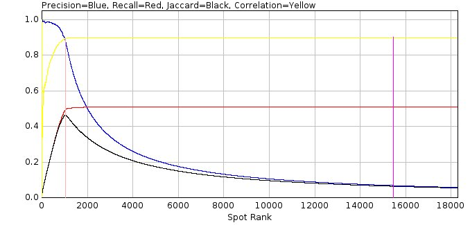

    Filter spot data scoring metrics against spot rank

The same data can be plot using the ``Plot rank by intensity`` option (:numref:`Figure %s <fig_filter_spot_data_score_vs_intensity>`).

.. _fig_filter_spot_data_score_vs_intensity:
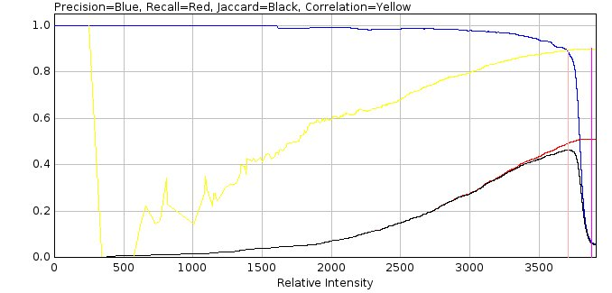

    Filter spot data scoring metrics against spot intensity

Since the spot filter will identify many false positives the overall precision score is very low. Thus the plugin also reports the precision at a fraction of the maximum recall. This fraction can be configured and is shown on the plot using a magenta line. In :numref:`Figure %s <fig_filter_spot_data_score_vs_rank>` the line is drawn at 98% of the maximum recall.

In addition the precision can be plotted directly against the recall (:numref:`Figure %s <fig_filter_spot_data_auc>`). The **A**\ rea **U**\ nder the precision-recall **C**\ urve (AUC) is the average precision at each possible recall value. This provides a single score on how good the filter is at finding and ranking spot candidates. An example precision-recall chart is shown below. The AUC2 score is computed using a modified precision curve that uses the highest precision at that recall or above. This smooths a noisy curve that may occur at low recall values. The AUC2 score is always above the AUC score.

.. _fig_filter_spot_data_auc:
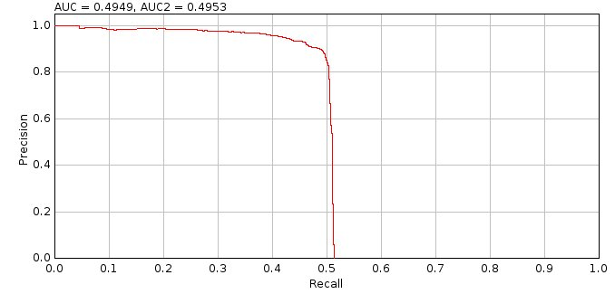

    Filter spot data Area Under precision-recall Curve (AUC)

A scatter plot of the candidate intensity against the true spot intensity is shown for all matches (:numref:`Figure %s <fig_filter_spot_data_candidate_vs_actual_intensity>`). The correlation and slope of the line (assuming an intercept at 0,0) is shown.

.. _fig_filter_spot_data_candidate_vs_actual_intensity:
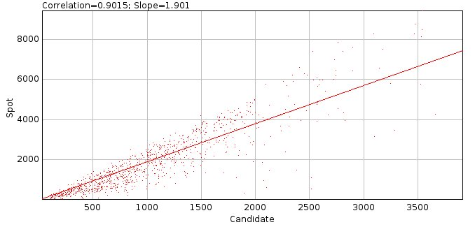

    Filter spot data actual intensity verses candidate spot intensity for matches

An ideal filter should produce a slope of 1 meaning that the estimated signal is a good starting approximation for a fitting algorithm. However as the filter smoothing increases the intensity of spots is reduced due to merging of the spot pixels with surrounding background. Thus higher smoothing values tend to increase the slope as the intensity is underestimated.

An additional analysis is performed using the ranked candidates. For each frame in the input image a count is made of the number of false positives (failures) before each additional true positive. The counts are plotted as a histogram and a cumulative histogram if the ``Show failure plots`` option is selected. The cumulative histogram is then used to determine the number of consecutive false positives to accept to achieve a set fraction of the maximum true positives. The fractions are reported for
80, 80, 95, 99 and 100%. This value can be used to determine the ``Fail limit`` parameter for the
``Peak Fit``
plugin for different imaging conditions (i.e. how many failures to allow before processing of fit candidates is stopped).

The analysis results are then reported in a summary table:

.. list-table::
   :widths: 20 80
   :header-rows: 1

   * - Field
     - Description

   * - Frames
     - The number of frames in the simulated image.

   * - W
     - The width of the simulated image minus the analysis border.

   * - H
     - The height of the simulated image minus the analysis border.

   * - Molecules
     - The number of molecules that occur within the bounds of the analysis border.

   * - Density
     - The molecule density within the analysis region.

   * - N
     - The average number of photons per localisation.

   * - s
     - The standard deviation of the Gaussian profile that matches the PSF.

   * - a
     - The pixel size.

   * - Depth
     - The z-depth of the localisations.

   * - Fixed
     - True if the simulation used a fixed depth.

   * - Gain
     - The total gain of the simulation.

   * - ReadNoise
     - The read noise of the simulation.

   * - B
     - The background number of photons.

   * - b\ :sup:`2`
     - The noise per pixel. This is a combination of the read noise and the background number of photons.

   * - SNR
     - The signal to noise ratio (:math:`\mathit{SNR}=\frac{N}{\sqrt{b^2}}`).

   * - s (px)
     - The standard deviation of the Gaussian profile that matches the PSF in pixels.

   * - Type
     - The type of filter.

   * - Search
     - The search width.

   * - Border
     - The border.

   * - Width
     - The effective width of the filter, i.e. the number of pixels around a point that are used in the filter. The actual region width is 2w+1.

       This allows comparison of the size of different filters.

   * - Filter
     - The name of the first filter.

   * - Param
     - The parameter of the first filter.

   * - Description
     - The full description of the filter. For a ``Difference`` or ``Jury`` filter the full set of filters will be listed.

   * - A.Border
     - The analysis border.

   * - Multi
     - True if multiple matches were allowed.

   * - Ranked
     - True if matching was performed using the candidate in their ranked order, i.e. higher ranked candidates are matched to true results first. The default is to use nearest neighbour matching, irrespective of the candidate ranking.

   * - Lower d
     - The lower match distance.

   * - d
     - The match distance.

   * - Lower sf
     - The lower signal factor.

   * - sf
     - The signal factor.

   * - Slope
     - The slope of the regression between the candidate intensity and the intensity of matching localisations.

   * - TP
     - The overall number of true positives.

   * - FP
     - The overall number of false positives.

   * - Recall
     - The overall recall.

   * - Precision
     - The overall precision.

   * - Jaccard
     - The overall Jaccard.

   * - R
     - The overall correlation between the candidate intensity and the intensity of matching localisations.

   * - TP
     - The number of true positives at the configured fraction of the maximum recall.

   * - FP
     - The number of false positives at the configured fraction of the maximum recall.

   * - Recall
     - The recall at the configured fraction of the maximum recall.

   * - Precision
     - The precision at the configured fraction of the maximum recall.

   * - Jaccard
     - The Jaccard at the configured fraction of the maximum recall.

   * - R
     - The overall correlation between the candidate intensity and the intensity of matching localisations at the configured fraction of the maximum recall.

   * - TP
     - The number of true positives at the maximum Jaccard score.

   * - FP
     - The number of false positives at the maximum Jaccard score.

   * - Recall
     - The recall at the maximum Jaccard score.

   * - Precision
     - The precision at the maximum Jaccard score.

   * - Jaccard
     - The maximum Jaccard score.

   * - R
     - The overall correlation between the candidate intensity and the intensity of matching localisations at the maximum Jaccard score.

   * - Time
     - The total run-time for filtering the image and ranking the candidates.

   * - AUC
     - The area under the precision-recall curve.

   * - AUC2
     - The area under the adjusted precision-recall curve. The adjustment is made by using the highest precision at that recall or above.

   * - Fail 80
     - The failure count that must be allowed to achieve 80% of the maximum true positive count.

   * - Fail90
     - The failure count that must be allowed to achieve 90% of the maximum true positive count.

   * - Fail95
     - The failure count that must be allowed to achieve 95% of the maximum true positive count.

   * - Fail99
     - The failure count that must be allowed to achieve 99% of the maximum true positive count.

   * - Fail100
     - The failure count that must be allowed to achieve 100% of the maximum true positive count.

.. index:: ! Filter Spot Data Batch

Filter Spot Data (Batch)
------------------------

Allows the analysis of the ``Filter Spot Data`` plugin (see :numref:`%s<model_plugins:Filter Spot Data>`) to be applied to a batch of different filters. The plugin analysis settings are the same as the ``Filter Spot Data`` plugin. However the settings do not allow precise configuration of a *single* filter. The plugin has options to select different *types* of filter. These are then applied using a range of widths appropriate for the PSF width of the data. This begins at a small width and is limited to 3 times the standard deviation of the Gaussian 2D approximation of the PSF. The following filter parameters can be configured:

.. list-table::
   :widths: 20 80
   :header-rows: 1

   * - Parameter
     - Description

   * - Mean
     - A block mean filter using widths in increments of 0.05.

   * - Gaussian
     - A Gaussian filter using widths in increments of 0.05.

   * - Circular
     - A circular filter using widths in increments of 0.5. Note: Radius changes below 0.5 do not alter the circular mask created for the filter.

   * - Median
     - A median filter using widths in increments of 1. Note: Fractional pixels are not applicable to the median filter.

   * - Difference filter
     - If **true** the filters will be configured as difference filters. A second filter of the same type is created. The output of this filter will be subtracted from the first filter to create a batch of difference filters.

   * - Difference smoothing
     - The width for the difference filter.

       Note if this is not above the maximum width of the first filter then the difference filter is invalid and the results for these filters should be ignored in the results.

   * - Min search width
     - The minimum width to use in the filter to search for local maxima.

   * - Max search width
     - The maximum width to use in the filter to search for local maxima.

Note that the results output options from the ``Filter Spot Data`` plugin are not shown in this dialog as they apply to a specific filter. These options are available for the best performing filter once analysis of all filters is complete.

Results
~~~~~~~

The analysis produces an entry in a summary table for each filter. The summary table is the same as for the ``Filter Spot Data`` plugin.

When all filters have been scored a dialog is presented allowing the results to be displayed. The plugin provides options to view how the performance of the filter changes with the width of the filter. Then it allows the best filter to be selected and the results of that filter displayed using the same options as the ``Filter Spot Data`` plugin.

Note that the results are cached in memory for the benchmark dataset. Re-running the plugin with the same filter options will use cached results as the analysis will be the same. This allows repeat execution of the plugin to by-pass the analysis stage and allow selection of different result options.

The following options can be selected:

.. list-table::
   :widths: 20 80
   :header-rows: 1

   * - Parameter
     - Description

   * - Use cached results
     - If **true** the analysis will add the most recently selected filter results to the cache of all analysis performed on this benchmark data. This creates plots with all filters that have been analysed. Use this option to add a new filter to the existing analysis plots.

       If **false** only the most recently selected filter results will be displayed. Use this option to show plots only with the configured filters.

   * - AUC
     - Display the Area Under precision-recall Curve (AUC) for each filter against the width of the filter. See :numref:`Figure %s <fig_filter_spot_data_performance_auc>` for an example of AUC score against filter width.

   * - Max Jaccard
     - Display the maximum Jaccard score for each filter against the width of the filter.

       Note the Jaccard score is computed for all sets of the candidate maxima from 1 to number of candidates when the candidates are ranked by their filter score. This plot shows the maximum Jaccard score, i.e. the score before extra false positives begin to lower the score. See :numref:`Figure %s <fig_filter_spot_data_score_vs_rank>` for an example of spot data scoring metrics against spot rank.

   * - Precision (at Max Jaccard)
     - Display the precision score at the location of the maximum Jaccard score for each filter against the width of the filter.

   * - Recall (at Max Jaccard)
     - Display the recall score at the location of the maximum Jaccard score for each filter against the width of the filter.

   * - Time
     - Display the filtering time for each filter against the width of the filter.

   * - Selection
     - Specify the method to select the best filter:

       * ``AUC``: The filter with the highest AUC score
       * ``Max Jaccard``: The filter with the highest max Jaccard score
       * ``AUC+Max Jaccard``: The filter with the highest combined AUC amd Max Jaccard score. The scores are combined by converting them to z-scores using the mean and standard deviation of the population, then the z-scores are summed.

   * - Show plots
     - Select this option to show plots of the results (the match statistics verses the spot candidate rank and the precision-recall curve).

   * - Plot rank by intensity
     - The default x-axis rank when plotting is an integer series starting from 1.

       Set this option to true to show the ranking using the candidate spot intensity relative to the intensity range of all the spots. Candidates are ordered by intensity so the order will be the same, the relative positions will change as many candidates have low signal.

   * - Show failure plots
     - Select this option to show a histogram of the count of false positives before each true positive (i.e. failures).

   * - Show TP
     - If **true** show the true-positives overlaid on the localisation image in green.

   * - Show FP
     - If **true** show the false-positives overlaid on the localisation image in red.

   * - Show FN
     - If **true** show the false-negatives overlaid on the localisation image in yellow.

.. _fig_filter_spot_data_performance_auc:
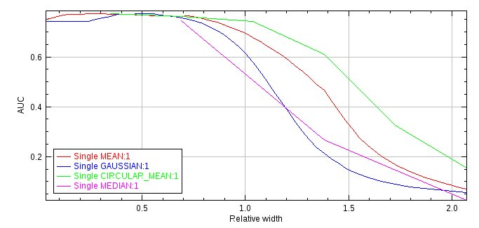

    Plot of the Area Under precision-recall Curve score against the filter width for various filters. The filter width is relative to the PSF width of the image data. All filters are single filters using a search width of 1.

.. index:: ! Fit Spot Data

Fit Spot Data
-------------

Fits all the candidate spots identified by the ``Filter Spot Data`` plugin. This plugin requires the results generated by the ``Filter Spot Data`` plugin. If these results are not available an error will be displayed.

Analysis
~~~~~~~~

The ``Fit Spot Data`` plugin fits each candidate spot identified in the benchmark image by the
``Filter Spot Data`` plugin. The spot candidates are identified in each frame in the image and ranked by the filter, for example by estimated intensity. However there will be many candidates that are not valid spots since the ``Create Simple Data`` or ``Create Spot Data`` plugin generates an image with noise which may be identified as a spot candidate. Thus it is usually possible to stop processing candidates when a successive number of candidates fail. This is the method employed by the main ``Peak Fit`` plugin when processing single-molecule localisation images.

For the purpose of benchmarking it is possible to speed up processing by ignoring many of the candidates. Since the spots were simulated it is known which candidates are correct (positives) and which are incorrect (negatives). The ``Fit Spot Data`` plugin allows the user to specify the fraction of positives in each frame that will be processed. This sets a target limit for the positives. When this target has been reached the plugin will continue processing candidates until: (1) a set fraction of the total number of candidates processed are negatives; and (2) a minimum number of negatives after the positive target have been processed. The rest of the candidates are then ignored and marked as not-fitted.

The algorithm used to fit the spots can be configured in the plugin options. However all fit results are accepted as long as the fitted signal is above zero, the coordinates are within the fit region and the fitted width is within a factor of 5 of the initial estimate. There is no further filtering performed by the plugin on the fit results. This provides an upper limit for the recall that is possible using this fitting configuration. Filtering of the results using limits on the signal, peak width, precision, etc. is done using the ``Benchmark Filter Analysis`` plugin.

When all the fitting has been done the fitted coordinates and any candidates coordinates that were not fitted or failed to fit are compared with the actual coordinates that were simulated. The two sets of coordinates are assigned as matches if they are within a configured distance. In addition the fitted candidates can be set as matches if they are within a factor of the true signal for the localisation. The relative signal factor is simply the fitted signal divided by the true signal. The relative signal factor (rsf) above or below the true signal (which has 1 for a perfect match) is adjusted so that the new signal factor (sf) score is 0 for a perfect match:

.. math::

    \mathit{sf}=(\mathit{rsf}<1)?1-\frac{1}{\mathit{rsf}}:\mathit{rsf}-1

The matches are then assigned a score. The score is created using a ramped function between the ``Lower distance`` and the ``Match distance``. Any distance below the ``Lower distance`` is 1. Anything above the ``Match distance`` is 0. In between uses a ramp to set the score. The ramp is not linear but uses a cosine function. This smooths the transition at the ends of the range to make selection of the end points for assessment less critical; the ramp is linear in the exact centre of the range. Thus the ideal end points should be above and below the ideal scoring threshold.

If using a signal factor a similar ramp is applied to produce a signal score and the final score computed as a product of the two. The match score is then used to accumulate a score for how accurate the fitting was performed.

If the match is between a fitted candidate and a true localisation then the score is a true positive (TP). When using a ramped distance function to create the score, the remaining score is calculated as 1 – score and assigned as false positive (FP).

The TP and FP totals thus represent the score that can be achieved for a perfect results filter that is able to correctly allow any fit results that are within the match distance, and optionally signal factor, of a true localisation and reject all other fit results. If a candidate fails to be fitted but is close to a true localisation it will not be included in the TP/FP assessment scores. However the original number of localisations that were simulated is known and this can be used to produce a False Negative (FN) score as the number of localisations minus the TP, i.e. how many spots were missed.

Note that the use of a ramped score function based on distance and signal allows the comparison of scores between different fitting algorithms, since some algorithms may fit the spots closer to the true localisation. Also note that if it is not clear at what level to set the scoring thresholds then using a ramped distance score will produce the same results as repeating the analysis with multiple thresholds and averaging the score (with the same weighting applied by the ramp).

Parameters
~~~~~~~~~~

The following parameters can be configured:

.. list-table::
   :widths: 20 80
   :header-rows: 1

   * - Parameter
     - Description

   * - Fraction positives
     - Set the limit (in percent) on the number of filter candidates that match true localisations that must be processed.

   * - Fraction negatives after positives
     - After the positive target has been reached, set the limit (in percent) on the fraction of filter candidates that must be negatives (i.e. how many of the candidates for fitting should be incorrect).

   * - Min negatives after positives
     - After the positive target has been reached, set a minimum number of filter candidates that must be negatives (i.e. how many extra incorrect candidates should be included in the fitting process).

   * - Match distance
     - The distance limit defining the minimum score for a match between a fitted localisation and the true localisation. The distance is expressed relative to the PSF width used to generate the data.

   * - Lower distance
     - The distance limit defining the maximum score for a match between a fitted localisation and the true localisation. The distance is expressed relative to the PSF width used to generate the data.

       Set to the same as the ``Match distance`` to ignore the ramped scoring function.

   * - Match signal
     - Define the limit for the difference between the fitted signal and the actual signal for a match. A value of (N-1) indicates the fit is allowed to be N-fold different, i.e. use 2 for a 3-fold difference.

       Set to zero to ignore.

   * - Lower signal
     - The limit defining the maximum score for a match between a fitted signal and the true signal.

       Set to the same as the ``Match signal`` to ignore the ramped scoring function.

   * - Initial StdDev
     - The initial 2D Gaussian standard deviation for fitting. The width is expressed in pixels. By default it is set using the configured width of the PSF used to generate the data and should not need adjusting (unless it is intended to benchmark an incorrectly calibrated fitting algorithm).

   * - Fitting width
     - Define the size of the region around a candidate to use for fitting. The region size in pixels is set using the ``Fitting width`` multiplied by the ``Initial StdDev``.

   * - Fit solver
     - Define the solver used for fitting. Depending on the chosen solver a second dialog box will be presented to allow further configuration.

       See section :numref:`{number}: {name} <fitting_plugins:Fitting Parameters>`.

   * - Fit function
     - The fit function.

       See section :numref:`{number}: {name} <fitting_plugins:Fitting Parameters>`.

   * - Include neighbours
     - See section :numref:`{number}: {name} <fitting_plugins:Multiple Peak Fitting Parameters>`.

   * - Neighbour height
     - See section :numref:`{number}: {name} <fitting_plugins:Multiple Peak Fitting Parameters>`.

   * - Duplicate distance
     - See section :numref:`{number}: {name} <fitting_plugins:Multiple Peak Fitting Parameters>`.

   * - Show score histograms
     - Show histograms and cumulation histograms of the metrics used to assess fit results: Signal, SNR, MinWidth, MaxWidth, XY Shift, Euclidian Shift, and Precision. Histograms are also shown of the number of iterations and function evaluations used by the fitting algorithm.

   * - Show correlation
     - Show a plot of the correlation between the candidate intensity against the true spot intensity for all matches, as a function of the spot candidate rank.

   * - Plot rank by intensity
     - The default x-axis rank when plotting the correlation is an integer series starting from 1.

       Set this option to true to show the ranking using the spot intensity relative to the intensity range of all the spots. Candidates are ordered by intensity so the order will be the same but the relative positions will change.

   * - Save filter range
     - Save the estimated ranges for each spot metric as a filter set file that can be used in the ``Benchmark Filter Analysis`` plugin.

       Note: The range increment in the filter set file is set to 1/10 of the range and certain filters are disabled as they are similar (e.g. Shift and EShift).

Results
~~~~~~~

After spot candidates have been fitted and scored using their distance to the true localisations the results are summarised.

For all the fitted results that were within the ``Match distance`` of a true localisation, a histogram is computed of the distances, the z-depth of the original localisations and the computed precision of the fit using the Mortensen formula. This allows a visualisation of how close the fitted results are to the actual localisations and also of the depth-of-field of the localisation algorithm.

Note that the ``Match Depth`` histogram will not be useful if the data were originally simulated with a fixed depth or the PSF does not vary with z-depth. If results were simulated using a fixed photon level then the standard deviation of the match distance should be approximately the same as the average of the calculated precision (since the precision calculation represents the standard deviation of the distance from the true location assuming fitting a 2D Gaussian PSF with Poisson noise).

A scatter plot of the spot intensity against the true spot intensity is shown for all matches. The correlation and slope of the line (assuming an intercept at 0,0) is shown on the plot. An ideal fitting algorithm should produce a slope of 1.

For all of the candidates that were fit the system compiles histograms of each of the common metrics used to assess the fit of the 2D Gaussian to the data (Signal, SNR, MinWidth, MaxWidth, XY Shift, Euclidian Shift, and Precision). Three histograms are computed for: all the fitting results; only the matches; and the non-matched results. The histogram are then used to produce an estimate for the range that should be used for each metric as a filter to separate good fits from bad fits. This is done by comparing the values in the matches histogram with the values in the non-matches histogram, for example using the largest separation between the cumulative histograms for each. This may for example produce an estimate that a SNR filter should be in the range of 25 to 300. These ranges are reported to the results table and can optionally be saved to a file for use in the ``Benchmark Filter Analysis`` plugin.

The results of match scoring are used to compute the match statistics Recall, Precision, Jaccard and F1-score. See setc :numref:`{number}: {name} <comparison_metrics:Comparison Metrics>` for more details. The first set of statistics are for the raw candidates (before fitting). These show how effective the filter was at identifying candidates that were processed and sets an upper limit on the performance of the fitted results. The second set summarise the performance of the fitted results. Note that the table does not show the False Negative score since this is equal to the number of simulated molecules minus the True Positives.

The analysis results are then reported in a summary table

.. list-table::
   :widths: 20 80
   :header-rows: 1

   * - Field
     - Description

   * - Frames
     - The number of frames in the simulated image.

   * - W
     - The width of the simulated image minus the analysis border.

   * - H
     - The height of the simulated image minus the analysis border.

   * - Molecules
     - The number of molecules that occur within the bounds of the analysis border.

   * - Density
     - The molecule density within the analysis region.

   * - N
     - The average number of photons per localisation.

   * - s
     - The standard deviation of the Gaussian profile that matches the PSF.

   * - a
     - The pixel size.

   * - Depth
     - The z-depth of the localisations.

   * - Fixed
     - True if the simulation used a fixed depth.

   * - Gain
     - The total gain of the simulation.

   * - ReadNoise
     - The read noise of the simulation.

   * - B
     - The background number of photons.

   * - b\ :sup:`2`
     - The noise per pixel. This is a combination of the read noise and the background number of photons.

   * - SNR
     - The signal to noise ratio (:math:`\mathit{SNR}=\frac{N}{\sqrt{b^2}}`).

   * - s (px)
     - The standard deviation of the Gaussian profile that matches the PSF in pixels.

   * - Filter
     - The full description of the filter used to identify the fitting candidates. For a ``Difference`` or ``Jury`` filter the full set of filters will be listed.

   * - Spots
     - The number of filter candidates.

   * - nP
     - The number of spot filter candidates that identify a true localisation (positives).

       Note: This result is computed with the distance thresholds set in the ``Filter Spot Data`` plugin.

   * - nN
     - The number of spot filter candidates that do not identify a true localisation (negatives).

   * - fP
     - The number of spot filter candidates that identify a true localisation (positives). This is a fractional score that uses the partial matching score system with lower and upper distance thresholds.

       Note: This result is computed with the distance thresholds set in the ``Filter Spot Data`` plugin.

   * - fN
     - The number of spot filter candidates that do not identify a true localisation (positives). This is the number of spot candidates minus ``fP``.

   * - Solver
     - The fit solver used for fitting.

   * - Fitting
     - The fit window size used for fitting.

   * - % nP
     - The fraction of positive candidates that were processed.

   * - % nN
     - The fraction of negative candidates that were processed.

   * - Total
     - The number of candidates that were processed.

   * - cTP
     - The number of candidates that match a true localisation (Candidate True Positives).

   * - cFP
     - The number of candidates that do not match a true localisation (Candidate False Positives).

   * - cRecall
     - The recall of the candidates.

   * - cPrecision
     - The precision of the candidates.

   * - cJaccard
     - The Jaccard of the candidates.

   * - cF1
     - The F1-score of the candidates.

   * - Fail cTP
     - The number of candidates that match a true localisation where fitting failed, i.e. the algorithm did not return a result.

   * - Fail cFP
     - The number of candidates that do not match a true localisation where fitting failed, i.e. the algorithm did not return a result.

   * - TP
     - The sum of the match score for fit results that can be matched to a localisation.

   * - FP
     - The sum of the remaining match score for fit results that can be matched to a localisation.

       This will be zero if not using a ramped match score with ``Match Distance`` above ``Lower distance``.

   * - Recall
     - The recall of the fitted candidates.

   * - Precision
     - The precision of the fitted candidates.

   * - F1
     - The F1-score of the fitted candidates.

   * - Jaccard
     - The Jaccard of the fitted candidates.

   * - pF1
     - The F1-score of the fitted candidates assuming perfect precision (i.e. all false positives are removed). Recall is unchanged.

   * - pJaccard
     - The Jaccard of the fitted candidates assuming perfect precision (i.e. all false positives are removed). Recall is unchanged.

   * - Med.Distance
     - The median of the histogram of the distance between fitted candidates and the localisations.

   * - Med.Depth
     - The median of the histogram of the z-depth of localisations that were fitted.

   * - Correlation
     - The correlation between the fitted signal and the actual signal for match results.

   * - Ranked
     - The Spearman’s rank correlation between the fitted signal and the actual signal for match results.

   * - Slope
     - The slope of the regression between the fitted signal and the actual signal for match results (assuming an intercept at 0,0).

   * - Signal
     - The lower and upper range estimate for a signal filter.

   * - SNR
     - The lower and upper range estimate for a SNR filter.

   * - MinWidth
     - The lower and upper range estimate for a minimum width filter.

   * - MaxWidth
     - The lower and upper range estimate for a maximum width filter.

   * - Shift
     - The lower and upper range estimate for an absolute max X or Y shift filter.

   * - EShift
     - The lower and upper range estimate for a Euclidian shift filter.

   * - Precision
     - The lower and upper range estimate for a precision filter.

   * - Iterations
     - The lower and upper range of iterations used for fitting results that match (uses 1% and 99.9% percentile values).

   * - Evaluations
     - The lower and upper range of function evaluations used for fitting results that match (uses 1% and 99.9% percentile values).

   * - Run time
     - The length of time taken to perform fitting.

Note: The lower and upper bounds are set using a variety of measures suitable for the metric including percentile values of the data range and the maximum difference between the cumulative histograms of matched and non-matched fit results. Full details can be found in the source code. The ranges are only a suggested start point for generation of a filter to classify fit results. The ranges can be tested on the fit results using the ``Benchmark Filter Analysis`` plugin to find an optimum filter for the simulated data.

.. index:: ! Benchmark Filter Analysis

Benchmark Filter Analysis
-------------------------

Run different filtering methods on a set of benchmark fitting results produced by ``Fit Spot Data`` outputting performance statistics on the success of the filter. If these results are not available an error will be displayed when running the plugin.

The ``Benchmark Filter Analysis`` plugin is designed to test the results filtering available in the ``Peak Fit`` plugin. The principle is that simulated localisations are identified as candidates for fitting and then fitted using the same routines available in ``Peak Fit``. This is done using the ``Filter Spot Data`` and ``Fit Spot Data`` plugins. The results can then be subjected to different filters to determine the best filter.

This plugin is similar to the ``Benchmark Filter Parameters`` plugin. Searching all parameters that control filtering of fitting results is computationally intractable. The search has been split into optimising the parameters for the result filter (``Benchmark Filter Analysis``) and optimising the parameters that control a single result filter (``Benchmark Filter Parameters``). Alternating the optimisation of the two sets of parameters can be done using the ``Iterate Filter Analysis`` plugin (see :numref:`%s<model_plugins:Iterate Filter Analysis>`).

Input Filters
~~~~~~~~~~~~~

The plugin is able to process thousands of filters by loading the filters from a file. The file describing the filters can be created using the ``Create Filters`` plugin (section :numref:`%s <analysis_plugins:Create Filters>`). When all the parameters for the plugin are configured the plugin prompts the user for a filter file. Loading filters may take a long time so if the filename selected for the filters is the same as the last set of loaded filters the plugin will ask if you would like to re-use the filters that were previously loaded.

Filters are grouped into sets. Each set is processed separately. Results are shown per filter and then as a summary of the best results per filter set. This allows different types of filters to be compared (e.g. SNR, Precision, etc) in a summary table.

.. index:: Expanding Filter Sets

Expanding Filter Sets
^^^^^^^^^^^^^^^^^^^^^

Note that the plugin will detect if a filter set only contains 3 filters and determine if it can be expanded. The criteria for expansion are that the second filter has a value for each parameter equal or above the first filter. The first filter then forms the minimum value and the second filter the maximum value. The third filter must then have a value that is positive for each parameter where the second filter value was above the first filter value. The third filter then forms the increment for the parameters. Note that if the increment is infinity then it is ignored. This means that it is possible to create a series of values from minimum to maximum using the increment. Note that the increment does not have to be an exact factor of the range. The value is just incremented from the minimum until the maximum is reached (or exceeded).

Note that a filter set file can be created using suitable ranges for the current fit results by the ``Fit Spot Data`` plugin using the ``Save filter range`` option. To avoid testing filters that assess similar properties the ``Fit Spot Data`` plugin disables certain filters. Currently EShift and Signal filtering are disabled as they are similar to Shift and SNR. They can be renabled by changing the third filter value from Infinity to a suitable increment. The Z depth filtering is also disabled as 3D fitting using astigmatism is experimental and not supported in the benchmarking plugins. If a filter set file is saved using ``Fit Spot Data`` then the file will be pre-selected in the dialog for convenience.

If the filter set can be expanded the plugin will compute the number of combinations that will be created after expansion. It will then ask the user if they would like to expand the filters.

Expanding filters is much faster that reading a large number of filters from a file and so is the preferred method of loading a large evenly spaced filter set. Note that advanced filters using ``And`` or ``Or`` filters can be constructed using expansion. The user should note that the parameters for the combined filters are represented as a single linear array, for example:

.. code-block:: xml

    <list>
      <FilterSet name="Multi2">
        <filters>
          <AndFilter>
            <filter1 class="SNRFilter" snr="10"/>
            <filter2 class="WidthFilter" width="1.5"/>
          </AndFilter>
          <AndFilter>
            <filter1 class="SNRFilter" snr="20"/>
            <filter2 class="WidthFilter" width="2.5"/>
          </AndFilter>
          <AndFilter>
            <filter1 class="SNRFilter" snr="1"/>
            <filter2 class="WidthFilter" width="0.1"/>
          </AndFilter>
        </filters>
      </FilterSet>
    </list>

would expand into a SNR and Width filter using a range of 10-20 for SNR and 1.5 to 2.5 for Width.

Analysis
~~~~~~~~

For each filter in the set, the plugin runs the filter on the fit results.

The filter separates the results into those that are accepted (positives) and those that are rejected (negatives). Note that the results are processed in the order determined by the filter that identified the fit candidates. As per the ``Peak Fit`` plugin, a record is kept of the number of consecutive results that fail. This includes any candidates that did not produce a fit and any results that are rejected by the filter. As soon as the configured fail count is reached then the remaining results in that frame are all rejected.

The filtered results are then scored. The scoring is designed to find the best fitter & filter combination for the given spot candidates. The ideal combination would correctly fit & pick all the candidate positions that are close to a localisation and reject all other candidates.

The scoring scheme is shown in :numref:`Figure %s <fig_filter_analysis_scoring_scheme>`.

.. _fig_filter_analysis_scoring_scheme:
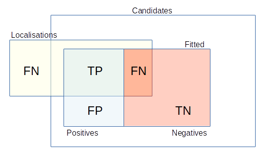

    Scoring scheme for the spot candidates against the known spot locations.

    .. list-table::
       :widths: 20 80
       :header-rows: 0

       * - Candidates
         - All the spot candidates.
       * - Fitted spots
         - Any spot candidate that was successfully fitted.
       * - Positives
         - Any fitted spot that was accepted by the filter.
       * - Negatives
         - Any fitted spot that was rejected by the filter.
       * - TP
         - True Positive:
           A spot candidate that was fitted and accepted by the filter and matches a localisation.
       * - FP
         - False Positive:
           A spot candidate that was fitted and accepted by the filter but does not match a localisation.
       * - FN
         - False Negative:
           A spot candidate that was fitted and rejected by the filter but matches a localisation.
           or any unmatched localisation.
       * - TN
         - True Negative:
           A spot candidate that was fitted and rejected by the filter and does not match a localisation.

Classically a match is assigned if a predicted result and a localisation are within a distance threshold. This makes the choice of distance threshold critical. It also means that methods that get very close to the answer are not scored better than methods that get just close enough to the answer. This can be overcome by repeating the analysis multiple times with different distance thresholds and averaging the scores. An alternative is to use a ramped scoring function where the degree of match can be varied from 0 to 1. When using ramped scoring functions the fractional allocation of scores is performed, i.e. candidates are treated as if they both match and unmatch and the scores accumulated using fractional counts. This results in an equivalent to multiple analysis using different thresholds and averaging of the scores, but it can be performed in one iteration.

The choice of the distance thresholds for benchmarking a microscope setup can be made using the wavelength of light (:math:`\lambda`) and the expected number of photons. The upper threshold can be set using the Abbe limit:

.. math::

    \mathit{Resolution}=\frac{\lambda}{2\mathit{NA}}

where NA is the numerical aperture of the microscope [Abbe, 1873]. Any match below this distance is closer than the standard resolution of an optical microscope and so can be classed as a super-resolution match. The lower threshold can be set using the Mortensen formula for the precision of fitting a 2D Gaussian to 2D Gaussian data corrupted by Poisson noise (see :numref:`{number}: {name} <localisation_precision:Localisation Precision>`). Although only an approximation of fitting to a microscope PSF the formula provides an estimate of the limit of super-resolution fitting. Any fitting algorithm will not be expected to perform matches consistently below this limit. In practice though it is usually fair to set the lower distance as 33-50% of the Abbe limit.

As well as matching the localisation position it is possible to assign matches using the fitted signal. The signal-factor is computed within the ``Fit Spot Data`` plugin and is a measure of how far the fitted signal was from the true number of photons. Matches can be rejected if they are above a threshold and, as for the distance match, a ramped score is available using a ramped scoring function. In the case that ramped scoring is used for both distance and signal-factor then the final match score is the product of the two ramped scores. The remaining unmatched score is set so the total for the result is 1.

Scores are reported using classical binary scoring and the fractional scoring. In binary scoring any filtered spot close to a localisation is counted as a true positive. In fractional scoring the same spot may be part true positive and part false positive. The fractional scoring metrics are prefixed with an ``f``.

The total TP+FP must equal the number of fitted spots accepted by the filter; and TP+FN must equal the number of localisations included in the analysis. This may be lower than the number of simulated molecules if a border is used. There is no reporting of the TN score as this will vary depending on the number of candidates and fitted spots produced by the spot filter and fitting algorithms. Focusing the results on the TP score allows different spot filter and fitting methods to be compared since the total number of localisations is the same. The TP, FP, and FN totals can be used to compute scores as detailed in :numref:`{number}: {name} <comparison_metrics:Comparison Metrics>`.

.. index:: Ranking Filters

Ranking Filters
^^^^^^^^^^^^^^^

When all the scores have been computed for the filters in a filter set, the filters are ranked. Ranking is performed using two chosen scoring metrics. The first metric is chosen as a minimum limit that must be achieved; this is the ``Criteria`` metric with the limit specified as the ``Criteria limit``. The second metric is chosen to rank all the filters that pass the criteria; this is the ``Score`` metric. If no filters pass the criteria then a warning is written to the ``ImageJ`` log window.

This ranking system allows filters to be restricted to those that function at a minimum desired level and then ranked. For example assessing all filters that achieve 95% precision and then ranking by recall would pick the best filter for high confidence in the results, and assessing all filters that achieve 80% recall and then ranking by precision would pick the best filter for returning a high number of localisations but potentially also returning many false positives. Note that some scores are better as they get lower. In this case the plugin reverses the ordering to pick the best filter. Note that when ranking filters if the score is the same then the rank is determined by the criteria metric.

The use of the ``Criteria`` filter can be disabled by setting the ``Criteria limit`` to a value achievable by any filter, e.g. Precision = 0.

The best filter from each filter set is recorded to the summary table.

.. index:: Sensitivity Analysis

Sensitivity Analysis
^^^^^^^^^^^^^^^^^^^^

The sensitivity analysis aims to show how much the scores will change when the filter parameters are adjusted. An ideal filter would be one with low sensitivity, i.e. changing the parameters away from the optimal does not alter performance.

Sensitivity can be calculated for the best filter from each filter set. This is done by altering the parameters of the filter by a small change (delta) and recomputing the scores. This can be used to express the relative change in the score with a change in the parameters, i.e. the partial gradient. The gradient of each parameter is reported; those with lower gradients are more robust and those with higher gradients are the ones that cannot be varied very much for optimal performance of the filter.

.. index:: Filter Optimisation

Filter Optimisation
^^^^^^^^^^^^^^^^^^^

Searching for the best parameters for a filter is an optimisation problem. The more parameters there are in the filter the more combinations are possible. It may not be feasible to enumerate all the possible parameter combinations to find the best parameters. The plugin offers methods for searching for the optimal parameters: evolution using a genetic algorithm; range search; enrichment search; and step search. Each method uses the input filter set as a seed. Filters are then created using different methods and evaluated. Some algorithms iterate the generation of filters and evaluation until the best score has converged. Once the optimal parameters are found for the filter set then the plugin produces the summary results as per normal.

For some algorithms the input filter set is used to define the lower and upper bounds for the filter parameters. In this case the filter set must contain at least 2 filters. An example below shows a filter file that defines the parameter bounds for a ``MultiFilter2`` filter:

.. code-block:: xml

    <list>
      <FilterSet name="Range">
        <filters>
          <MultiFilter2 signal="1975.0" snr="158.0" minWidth="0.64" maxWidth="1.1" shift="0.0" eshift="0.0" precision="4.0" minZ="0.0" maxZ="0.0"/>
          <MultiFilter2 signal="19620.0" snr="230.0" minWidth="0.96" maxWidth="1.5" shift="2.8" eshift="3.2" precision="20.0" minZ="0.0" maxZ="0.0"/>
        </filters>
      </FilterSet>
    </list>

The ultimate limits for each filter parameter are set using the minimum and maximum value of that filter data in all the results generated by ``Benchmark Spot Fit`` plugin. This prevents evaluation of filters that will not discriminate the fit results.

.. index:: Evolution using a Genetic Algorithm

Evolution using a Genetic Algorithm
"""""""""""""""""""""""""""""""""""

All the filters in a filter set are used to create a population of filters. The parameters are listed in order to create a genome for each individual. The fitness of each individual is the score that is achieved using the ranking metric and the criteria metric. Scoring is performed by ensuring all filters achieving the criteria are ranked ahead of all filters not achieving the criteria.

After computing the fitness of individuals in a population, the population is allowed to change. The population is first reduced to a subset of the individuals using a selection process; the best scoring individual is always kept at each iteration. The subset forms a new population that is expanded by breeding. Pairs are selected for crossover and then new individuals are created by crossing their parent parameter values at random points along the genome. These new individuals may also mutate to change parameters in their genome. When enough new individuals have been created the fitness is evaluated again and the process repeated until no improvement can be made. Note that the individuals selected for the subset are not changed and only new individuals can mutate. This means that the best individuals in the population will not get worse each iteration.

Note that due to the use of mutation the genetic algorithm is able to produce parameter values that were not in the original filter set.

.. list-table::
   :widths: 20 80
   :header-rows: 1

   * - Parameter
     - Description

   * - Population size
     - The size of the population.

   * - Failure limit
     - The limit on the number of failed attempts to create a new individual before stopping growing the population. Note that new individuals are checked to be unique so it is common in a highly similar population that many crossovers will no create unique combinations.

   * - Tolerance
     - The relative error for convergence of the top filter score.

   * - Converged count
     - The number of iterations with a converged score to allow before stopping.

   * - Mutation rate
     - The mean fraction of the genome positions that will mutate. The number of mutations is a Poisson variable sampled using a mean equal to the mutation rate multiplied by the genome length. Note that the same position can mutate multiple times.

   * - Crossover rate
     - The mean fraction of the genome positions that will crossover. The number of crossovers is a Poisson variable sampled using a mean equal to the crossover rate multiplied by the genome length. It is not possible to crossover more times than the number of parameters in the genome.

   * - Mean children
     - When performing crossover between two selected individuals, the number of children will be equal to a Poisson variable sampled using this mean. At least 1 child is always produced.

   * - Selection fraction
     - At each iteration the population is reduced to a fraction of the target population size. The new size will be at least 2.

   * - Ramped selection
     - Select individuals using a weighting so that each individual is weighted according to the rank of the fitness score. This allows unfit individuals to be selected when reducing the population size, albeit with lower probability. When selecting for crossovers the selection is biased towards the highest ranking individuals.

       If not selected the individuals will be selected in order of fitness when reducing the population and randomly from the population when selecting for crossovers.

   * - Save option
     - Allow the final population of filters (after convergence) to be saved to file. This allows restarting the plugin to continue with the same population.

   * - Parameter name
     - The mutation range.

       The dialog will present a field for each named parameter of the filter. The mutation range is the standard deviation of the Gaussian distribution used to mutate the parameter.

       A negative value disables optimisation of that filter parameter. A value of zero includes the filter parameter but will prevent mutation. The parameter will only take values observed in the population.

.. index:: Range Search

Range Search
""""""""""""

Create a range for each parameter. This is divided uniformly into a set number of samples. The all-vs-all combination of all parameters is then evaluated. At each iteration the search will enumerate all points in the configured search space and find the optimum. If at the bounds of the range in any dimension then the range is expanded and only those points that have not yet been evaluated will be passed to the score function. If not at the bounds then the range is re-centred on the optimum. A refinement step can be performed at the current optimum. The optimum is a sample from an enumerated grid of parameter space. Refinement will evaluate the parameters using values between the current optimum and next grid interval. This can be done using small steps in a single dimension with all other dimensions held fixed and dimensions are rotated until no improvement (``Single Dimension`` refinement). Or by enumerating all dimensions on a smaller parameter grid within the original interval (``Multi Dimension`` refinement). Following refinement the parameter range is reduced by a factor and the process iterated. The effect is an enumerated search of parameter space that gradually reduces around the current optimum.

If a seed population was provided then the first step is to re-centre to the optimum of the seed population and the range refined/reduced as per the refinement mode parameter. Subsequent steps are the same.

The process iterates until the range cannot be reduced in size, or convergence is reached.

.. list-table::
   :widths: 20 80
   :header-rows: 1

   * - Parameter
     - Description

   * - Width
     - Defines the spread of samples for each parameter range around the range centre. The number of samples is equal to 2 * Width + 1.

   * - Save option
     - Set to **true** to save the final population of filters as a filter set. This can be used as input to the plugin to resume optimisation.

   * - Max iterations
     - The maximum number of iterations.

   * - Reduce
     - The factor used to reduce the range. If set to 1 then no reduction is performed and the process stops after the first enumeration and refinement.

   * - Refinement
     - Set the refinement mode used to refine the best filter from the most recent iteration.

   * - Seed size
     - The number of random samples to seed the initial iteration. These are samples taken using a uniform sample from within the parameter range.

   * - Parameter name
     - Each filter parameter has a boolean flag to state if it is enabled. If **true** then the parameter will be set to the disabled value for the filter. Otherwise the range for the parameter will be enumerated to create filters.

.. index:: Enrichment Search

Enrichment Search
"""""""""""""""""

Search the configured parameter space using random sampling until convergence of the optimum.

At each iteration the search will randomly sample points in the configured search space and score them. The top fraction of the results is used to redefine the search space. This range can be padded to expand it to a larger range.

.. list-table::
   :widths: 20 80
   :header-rows: 1

   * - Parameter
     - Description

   * - Save option
     - Set to **true** to save the final population of filters as a filter set. This can be used as input to the plugin to resume optimisation.

   * - Max iterations
     - The maximum number of iterations.

   * - Converged count
     - The number of iterations with a converged score to allow before stopping.

   * - Samples
     - The number of samples per iteration. These are samples taken using a uniform sample from within the parameter range.

   * - Fraction
     - The fraction of filters used to define the new search space each iteration.

   * - Padding
     - The amount of additional range to add to the range for each dimension.

   * - Parameter name
     - Each filter parameter has a boolean flag to state if it is enabled. If **true** then the parameter will be set to the disabled value for the filter. Otherwise the range for the parameter will be sampled to create filters.

.. index:: Step Search

Step Search
"""""""""""

The ``Step Search`` is the same as the initial iteration of the ``Range Search``. The ``Refinement`` mode is set to ``Multi Dimension``. The ``Reduce`` parameter is set to 1 thus no iteration is performed to improve the initial best scoring filter.

The search can be represented as a grid of filter parameters in n-dimensional space bounded by the range of the filter parameters. The initial search will identify the best grid position. A refinement constructs a grid within the space between the grid position and all its neighbours.

This search is an efficient optimisation if the number of combinations is computationally feasible. For example a filter with 5 parameters and a ``Width`` of 5 will have ``2*5+1 = 11`` samples per dimension and 161,051 filters. From the optimum filter a second set of 161,051 filters will be sampled during the refinement step within the interval between the initial optimum and the next evaluated parameter in either direction for all dimensions. To identify the same optimum in a single step would require ``2*5*5+1 == 51`` samples per dimension and approximately 345 million filters.

Parameters
~~~~~~~~~~

When the plugin is run a dialog is presented allowing parameters to be configured.

The dialog message shows a summary of the results computed by ``Fit Spot Data`` that will be analysed. The number of results is shown along with the number of true positives within the results if they are scored with the current values for the match distances. This is the upper limit of true positives for any filter. If the match distances are altered then the number of true positives will be recomputed when the plugin is run but will not update in the plugin message until it is next displayed.

The expected signal and localisation precision of the simulation localisations is computed using the formulas of Thompson (for signal) and Mortensen (for localisation), see section :numref:`{number}: {name} <localisation_precision:Localisation Precision>` for more details. If analysis has been previously run on this data then the score for the best filter result held in memory is shown. (The results in memory functionality is used for choosing the optimum fail count settings for a filter set.)

Note that the match distance parameters are expressed relative to those used in the ``Fit Spot Data`` plugin. This is because the matches are assigned within that program and cannot be recomputed. A lower distance is allowed as it will change a match to a non-match. However higher values are not allowed as this requires recomputation of all match distances. The distances that were used by the ``Fit Spot Data`` plugin are shown in a message above the section where the distances are configured to remind the user of the values. Re-run the ``Fit Spot Data`` plugin if you wish to use higher values.

The following parameters can be adjusted:

.. list-table::
   :widths: 20 80
   :header-rows: 1

   * - Parameter
     - Description

   * - Fail count
     - The number of failures to accept before rejecting the remaining results from the current frame.

   * - Residuals Threshold
     - The threshold for the residuals analysis where a single spot would be fit again as a double spot. The residuals are a measure of how elliptical the Gaussian data is compared to the Gaussian spot; this elliptical shape is assumed to be due to two overlapping spots. A lower threshold will attempt a doublet fit for more candidates. Set to 1.0 to disable.

   * - Duplicate distance
     - The distance where two spots are considered equal. This is used to filter later spot fit results where a candidate has drifted to fit another previously identified spot.

   * - Reset
     - Set to **true** to clear the best filter scores from memory. The memory is also cleared if the fit results have changed, or the ranking and scoring thresholds are changed.

   * - Show table
     - Show a result table with the scores of each filter.

   * - Show summary
     - Show a result table with the best filter(s) from each filter set.

   * - Clear tables
     - Clear any results tables that are already open.

   * - Summary top n
     - Show the top N filters from each filter set in the summary table. Set to zero to disable (show only the top 1 filter).

   * - Summary depth
     - Specify the depth of localisations used for the depth recall analysis in the summary table, i.e. the recall of localisations within the specified depth-of-field.

   * - Plot top n
     - Show a plot of the performance score against the parameter value for each filter in the top N scoring filter sets. This is useful for filters that have one main parameter, e.g. signal-to-noise or localisation precision. However combination filters that test many fit parameters together are only partially supported. In this case the main parameter value for the filter will determine the x-axis value.

       This option is not available when an optimisation search has been performed on the filter set.

   * - Save best filter
     - Select this to save the best filter from all filter sets to file. The user will be prompted for a filename when the analysis is complete.

   * - Save template
     - Set to **true** to save a template containing the fit and filter settings from the best filter to a template file. Template files can be loaded by the ``Template Manager`` plugin for use in ``Peak Fit``.

   * - Calculate sensitivity
     - Select this to perform sensitivity analysis on the top filter from each filter set.

   * - Delta
     - The relative change in the parameter value to use to calculate the sensitivity.

   * - Criteria
     - The metric used for the minimum criteria. All filters must pass this criteria to be included in scoring.

   * - Criteria limit
     - The value for the minimum criteria.

   * - Score
     - The metric used to rank all filters that reach the minimum criteria.

   * - Upper match distance
     - The distance limit defining the minimum score (0) for a match between a fitted localisation and the true localisation. The distance is expressed relative to the match distance used with the ``Fit Spot Data`` plugin (since the matches of results to localisations are computed within that program).

   * - Partial match distance
     - The distance limit defining the maximum score (1) for a match between a fitted localisation and the true localisation. The value is expressed relative to the match distance used with the ``Fit Spot Data`` plugin (since the matches of results to localisations are computed within that program).

       Set to the same as the ``Upper match distance`` to ignore the ramped scoring function. Otherwise matches at a distance between ``Partial`` and ``Upper match distance`` will have a score between 0 and 1.

   * - Upper signal factor
     - The signal factor defining the minimum score for a match between a fitted localisation and the true localisation. The value is expressed relative to the signal factor used with the ``Fit Spot Data`` plugin (since the matches of results to localisations are computed within that program).

   * - Partial signal factor
     - The signal factor defining the maximum score for a match between a fitted localisation and the true localisation. The value is expressed relative to the signal factor used with the ``Fit Spot Data`` plugin (since the matches of results to localisations are computed within that program).

       Set to the same as the ``Upper signal distance`` to ignore the ramped scoring function. Otherwise matches with a signal-factor ``Partial`` and ``Upper signal factor`` will have a score between 0 and 1.

   * - Depth recall analysis
     - Produce a histogram of the recall verses z-depth of the original localisations.

       This option is only available if the simulation had variable z-depth.

   * - Score analysis
     - Produce a histogram of the distance and signal factor for all fit matches to the original localisations.

   * - Component analysis
     - Perform an analysis of the component parts of the top scoring filter. Applies only to multi-part filters. This creates filters from the components and scores them allowing the contribution of each component part to be assessed.

       Filters are created by either enumerating all combinations of the components, or scoring a subset using *n* components and ranking them with the top ranked filter progressing to the next round for *n+1* components. Enumerating all combinations is available when there are up to 12 component parts (4095 combinations). Either option starts with all possible filters with 1 component and reports results for the best filter or all the filters. Subsequent rounds use 2, 3, etc component parts.

       - ``None``: No component analysis
       - ``Best Ranked``: Output the best result per round building filters using the top ranked filter from the previous round.
       - ``Ranked``: Output all results per round building filters using the top ranked filter from the previous round.
       - ``Best All``: Output the best result per round building filters using an enumeration of all combinations of the components.
       - ``All``: Output all results per round building filters using an enumeration of all combinations of the components.

   * - Evolve
     - Perform a search optimisation of the filter parameters (see section :numref:`%s <model_plugins:Filter Optimisation>`). This option may not evaluate all the filters in the input filter set. The input filter set is used to defined bounds of the filter parameters for the search. Once the optimal parameters have been identified then the best filter is included in the output results.

       - ``None``: No optimisation
       - ``Genetic Algorithm``: Use a genetic algorithm to explore combinations of the best filters until convergence.
       - ``Range Search``: Search using a range. The range is reduced each iteration until convergence. The initial range is created from the input filter set.
       - ``Enrichment Search``: Sample randomly from the parameter range of the filters. The top fraction of the results are used to define the range for the next round of sampling. Iterates until convergence.
       - ``Step Search``: Search using the parameter range of the input filters with a configured number of steps.

   * - Repeat evolve
     - Set to **true** to repeat the optimisation performed by the ``Evolve`` setting when re-running the plugin with identical input. If **false** the plugin will allow configuration of the output display options for the previous results cached for the specified settings.

       This option only applies when re-running the plugin with the same input results and the same settings. In this case the analysis will be the same and the plugin can reuse cached results allowing display of different output options for the same results. Re-use of the same results is not possible if the evolve setting was used as the optimisation is randomly seeded.

       This option is useful to experiment with different ``Evolve`` settings for the same input results and filter settings.

   * - Title
     - Add a title for the analysis to the results tables. This can be used when running multiple repeats of the plugin with results from different filters and fitting algorithms.

   * - Show TP
     - Show the true positives on the original input image data. TP are shown in green.

   * - Show FP
     - Show the false positives on the original input image data. FP are shown in red if included in the filter scoring; otherwise magenta if they are excluded (e.g. in the image border).

   * - Show FN
     - Show the false negatives on the original input image data. FN are shown in yellow if included in the filter scoring; otherwise orange if they are excluded (e.g. in the image border).

Once the main parameters have been chosen a second dialog is presented where the scoring metrics that are recorded in the results table can be specified. This allows the user to remove many of the results from the table if they do not need them to save space.

If the ``Evolve`` option is selected a dialog will be presented for each filter set to be optimised. The parameters are all prefixed with the filter set number. This allows support for recording the plugin using the ``ImageJ`` recorder for use in the ``ImageJ`` macro language. See section :numref:`{number}: {name} <model_plugins:Filter Optimisation>` for details.

When using the ``Evolve`` option a results table is created named ``Benchmark Filter Analysis Evolution``. This table contains the same columns as the main results table with an extra column for the iteration of the algorithm. The results from the best filter per iteration are added to the table. This table can be used to track the progress of the algorithm. If desired the algorithm can be stopped manually by pressing the ``Escape`` character.

Results
~~~~~~~

If the ``Depth recall analysis`` option was selected the plugin will compute a histogram of the recall verses z-depth. Three histograms are computed. The first is for all the localisations. This is plotted in black and provides the upper limit for performance. The second is the histogram for all the fitted results that match a localisation. This is plotted in blue and provides the upper limit that can be achieved by fitting. The third is the histogram for all the fitted results that were accepted by the filter. This is plotted in red. An example is shown in :numref:`Figure %s <fig_filter_analysis_depth_recall_analysis>`.

.. _fig_filter_analysis_depth_recall_analysis:
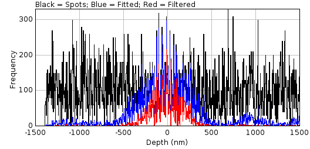

    Benchmark filter analysis depth recall analysis histograms

    The number of original (black), fitted (blue) and filtered (red) spots are shown against the z-depth.

Since the number of localisations at different depths is highly variable the histograms are smoothed and then normalised by the number of localisations. In the normalised plot (:numref:`Figure %s <fig_filter_analysis_depth_recall_analysis_normalised>`) only the fitted and filtered lines are shown; the magenta lines represent the depth-of-field specified by the ``Summary depth`` field.

.. _fig_filter_analysis_depth_recall_analysis_normalised:
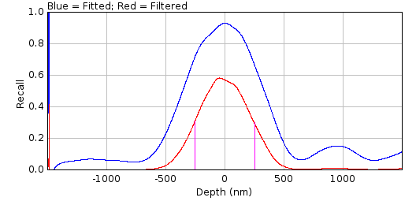

    Benchmark filter analysis depth recall analysis normalised histograms

    The number of fitted (blue) and filtered (red) spots are shown against the z-depth. Magenta lines represent the depth-of-field specified by the ``Summary depth`` field.

If the ``Score analysis`` option was selected the plugin will compute a histogram of the distance and signal-factor score for all matches. :numref:`Figure %s <fig_filter_analysis_depth_score_analysis_distance_histogram>` shows an example for the distance histogram. Two histograms are computed for each score. The first is for all the fitted results that match a localisation. This is plotted in blue and provides the upper limit that can be achieved by filtering. The second is the histogram for all the fitted results that were accepted by the filter. This is plotted in red. The label shows the mean of each histogram in braces.

.. _fig_filter_analysis_depth_score_analysis_distance_histogram:
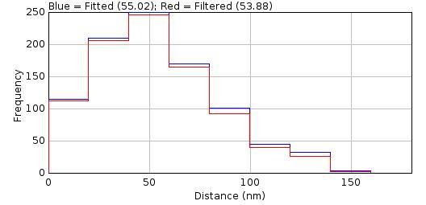

    Benchmark filter analysis histogram of distance between predicted and actual localisations

    Histograms are shown for fitted (blue) and filtered (red) spots.

If the ``Show table`` or ``Show summary`` options are selected the plugin will display the results in a table. The following fields are shown in the results tables. Note that for brevity not all the metrics that can be selected by the user are described here. See section :numref:`{number}: {name} <comparison_metrics:Comparison Metrics>` for details of the metrics.

.. list-table::
   :widths: 20 80
   :header-rows: 1

   * - Field
     - Description

   * - Frames
     - The number of frames in the simulated image.

   * - W
     - The width of the simulated image minus the analysis border.

   * - H
     - The height of the simulated image minus the analysis border.

   * - Molecules
     - The number of molecules that occur within the bounds of the analysis border.

   * - Density
     - The molecule density within the analysis region.

   * - N
     - The average number of photons per localisation.

   * - s
     - The standard deviation of the Gaussian profile that matches the PSF.

   * - a
     - The pixel size.

   * - Depth
     - The z-depth of the localisations.

   * - Fixed
     - True if the simulation used a fixed depth.

   * - Gain
     - The total gain of the simulation.

   * - ReadNoise
     - The read noise of the simulation.

   * - B
     - The background number of photons.

   * - b\ :sup:`2`
     - The noise per pixel. This is a combination of the read noise and the background number of photons.

   * - SNR
     - The signal to noise ratio (:math:`\mathit{SNR}=\frac{N}{\sqrt{b^2}}`).

   * - s (px)
     - The standard deviation of the Gaussian profile that matches the PSF in pixels.

   * - Filter
     - The full description of the filter used to identify the fitting candidates. For a ``Difference`` or ``Jury`` filter the full set of filters will be listed.

   * - Spots
     - The number of filter candidates.

   * - nP
     - The number of filter candidates that identify a true localisation (positives).

       Note: This result is computed with the distance thresholds set in the ``Filter Spot Data`` plugin.

   * - nN
     - The number of filter candidates that do not identify a true localisation (negatives).

   * - fP
     - The number of filter candidates that identify a true localisation (positives).
       This is a fractional score that uses the partial matching score system with lower and upper distance thresholds.

       Note: This result is computed with the distance thresholds set in the ``Filter Spot Data`` plugin.

   * - fN
     - The number of filter candidates that do not identify a true localisation (positives). This is the number of spot candidates minus fP.

   * - Solver
     - The fit solver used for fitting.

   * - Fitting
     - The fit window size used for fitting.

   * - Title
     - The ``Title`` field from the plugin dialog is copied here.

   * - Name
     - The name of the filter.

   * - Fail
     - The fail count.

   * - Res
     - The residuals threshold.

   * - Dup D
     - The duplicate distance.

   * - Lower D
     - The lower match distance.

   * - Upper D
     - The upper match distance.

   * - Lower factor
     - The lower match signal-factor.

   * - Upper factor
     - The upper match signal-factor.

   * - TP
     - The true positive score.

   * - FP
     - The false positive score.

   * - FN
     - The false negative score.

   * - Metrics
     - Configured score metrics computed using TP, FP and FN. See section :numref:`{number} <comparison_metrics:Comparison Metrics>`.

   * - fTP
     - The fractional true positive score.

   * - fFP
     - The fractional false positive score.

   * - fFN
     - The fractional false negative score.

   * - fMetrics
     - The fraction score metrics computed using fTP, fFP and fFN.

The summary table contains the same fields as the results table. The following additional columns are present:

.. list-table::
   :widths: 20 80
   :header-rows: 1

   * - Field
     - Description

   * - Depth Recall
     - The recall of localisations that were within the depth specified by the ``Summary depth`` parameter. Note that the summary depth parameter is for a span half above and half below zero so that the depth-of-field equals the ``Summary depth``.

   * - Distance
     - The average distance between fitted results and the true localisation.

   * - Signal factor
     - The average signal factor between fitted results and the true localisation.

   * - RMSD
     - The root mean squared distance (RMSD) between fitted results and the true localisation.

   * - Slope
     - The slope of the best line fit of the simulated localisation signal and the fitted signal.

   * - At limit
     - A flag to indicate if the optimal filter from the filter set was at the limit of the range for any of the expanded parameters. A character is used for each filter parameter: ``U`` = Upper limit; ``>`` = Above the upper limit; ``L`` = Lower limit; and ``<`` = Below the lower limit. If this is set then a better filter may exist if the ranges are changed. The parameter(s) at the edge of the range are also recorded in the ``ImageJ`` log window.

   * - Evolve
     - The optimisation algorithm for the filter set.

   * - Time
     - The time for the analysis of the filter set.

   * - Search
     - The optimisation algorithm for the parameters of a single filter. This is used by the ``Benchmark Filter Parameters`` plugin.

   * - Time
     - The time for the analysis of the parameters of a single filter. This is used by the ``Benchmark Filter Parameters`` plugin.

.. index:: ! Benchmark Filter Parameters

Benchmark Filter Parameters
---------------------------

Run different filter parameters on a set of benchmark fitting results produced by ``Fit Spot Data`` outputting performance statistics on the success. If these results are not available an error will be displayed when running the plugin.

The ``Benchmark Filter Parameters`` plugin is designed to test the results filtering available in the ``Peak Fit`` plugin. The principle is that simulated localisations are identified as candidates for fitting and then fitted using the same routines available in ``Peak Fit``. This is done using the ``Filter Spot Data`` and ``Fit Spot Data`` plugins. The results can then be subjected to different filters to determine the best filter.

This plugin is similar to the ``Benchmark Filter Analysis`` plugin. Searching all parameters that control filtering of fitting results is computationally intractable. The search has been split into optimising the parameters for the result filter (``Benchmark Filter Analysis``) and optimising the parameters that control a single result filter (``Benchmark Filter Parameters``). Alternating the optimisation of the two sets of parameters can be done using the ``Iterate Filter Analysis`` plugin (see :numref:`%s<model_plugins:Iterate Filter Analysis>`).

The following parameters are used by every single filter:

*  Fail count
*  Residuals Threshold
*  Duplicate distance

The ``Benchmark Filter Parameters`` plugin uses the top scoring filter from the ``Benchmark Filter Analysis`` plugin and searches for the best filter control parameters. The search algorithms are similar to those described in section :numref:`{number}: {name} <model_plugins:Filter Optimisation>` and the filters are scored using the same metrics. Due to the low number of parameters and the expected bounds for each parameter the number of combinations is expected to be small. Thus the genetic algorithm has been removed and a new algorithm has been added that allows enumeration of the entire range in appropriate step increments.

In the the ``Benchmark Filter Analysis`` plugin the range for the parameter optimisation is defined using a filter set due unlimited number of filter combinations. In contrast the ``Benchmark Filter Parameters`` plugin defines the range for the small set of parameters in the plugin dialog. The dialog is very similar to the dialog for the ``Benchmark Filter Analysis`` plugin. The following are different options for this plugin:

.. list-table::
   :widths: 20 80
   :header-rows: 1

   * - Parameter
     - Description

   * - Fail count
     - The number of failures to accept before rejecting the remaining results from the current frame.

   * - Min fail count
     - The lower limit of the fail count.

   * - Max fail count
     - The upper limit of the fail count.

   * - Residuals Threshold
     - The threshold for the residuals analysis where a single spot would be fit again as a double spot. The residuals are a measure of how elliptical the Gaussian data is compared to the Gaussian spot; this elliptical shape is assumed to be due to two overlapping spots. A lower threshold will attempt a doublet fit for more candidates. Set to 1.0 to disable.

   * - Min residuals threshold
     - The lower limit of the residuals threshold.

   * - Max residuals threshold
     - The upper limit of the residuals threshold.

   * - Duplicate distance
     - The distance where two spots are considered equal. This is used to filter later spot fit results where a candidate has drifted to fit another previously identified spot.

   * - Min duplicate distance
     - The lower limit of the duplicate distance.

   * - Max duplicate distance
     - The upper limit of the duplicate distance.

   * - Search
     - Perform a search optimisation of the filter parameters within the defined bounds (see section :numref:`%s <model_plugins:Filter Optimisation>`).

       - ``Range Search``: Search using a range. The range is reduced each iteration until convergence. The initial range is created from the input bounds.
       - ``Enrichment Search``: Sample randomly from the parameter range. The top fraction of the results are used to define the range for the next round of sampling. Iterates until convergence.
       - ``Step Search``: Search using the parameter range with a configured number of steps.
       - ``Enumerate``: Enumerate the parameter range. The increment used to enumerate the range for the parameters are: Fail count = 1; Residuals threshold = 0.05; and Duplicate distance = 0.5.

   * - Repeat search
     - Set to **true** to repeat the optimisation performed by the ``Search`` setting when re-running the plugin with identical input. If **false** the plugin will allow configuration of the output display options for the previous results cached for the specified settings.

       This option only applies when re-running the plugin with the same input results and the same settings. In this case the analysis will be the same and the plugin can reuse cached results allowing display of different output options for the same results. Re-use of the same results is not possible if the search setting was used as the optimisation is randomly seeded.

       This option is useful to experiment with different ``Search`` settings for the same input results and filter settings.

The plugin results are presented as per the ``Benchmark Filter Analysis`` plugin. The summary table will contain the current best filter recorded from the ``Benchmark Filter Analysis`` plugin. The final columns of the summary table will contain the ``Search`` mode and analysis time for the search. Note that the scores for the current best filter may improve if a different set of filter control parameters have been identified.

.. index:: ! Iterate Filter Analysis

Iterate Filter Analysis
-----------------------

Run different filter parameters on a set of benchmark fitting results produced by ``Fit Spot Data`` outputting performance statistics on the success. If these results are not available an error will be displayed when running the plugin.

The ``Iterate Filter Analysis`` plugin is designed to test the results filtering available in the ``Peak Fit`` plugin. The principle is that simulated localisations are identified as candidates for fitting and then fitted using the same routines available in ``Peak Fit``. This is done using the ``Filter Spot Data`` and ``Fit Spot Data`` plugins. The results can then be subjected to different filters to determine the best filter.

Searching all parameters that control fitting and filtering of fitting results is computationally intractable. This plugin alternates the ``Benchmark Spot Fit``, ``Benchmark Filter Analysis`` and ``Benchmark Filter Parameters`` plugins until convergence. This can be performed within a reasonable time on a standard desktop machine making optimisation of fitting parameters available to computationally resource limited audiences.

Iteration
~~~~~~~~~

Note that the fitting of spot candidates involves filtering results dynamically as they are generated. Fitting stops when filtering is consistently rejecting fits. Thus changes to the spot filter can effect the number of fitted spots. This requires iteration of the spot fitting and the filtering together.

The plugin uses the following routine:

#. Fit spots using single, doublet and multi-fit options.
#. Optimise the best filter from a filter set(s).
#. Optimise the filter control parameters for the best filter.
#. Optional: Test convergence of the filter parameters and go to 2 if not converged.
#. Update the fit parameters to use the new filter.
#. Fit spots using single, doublet and multi-fit options.
#. Optimise the best filter from a filter set(s).
#. Optimise the filter control parameters for the best filter.
#. If converged then stop.
#. Else go to 4.

Steps 1-3 correspond to the ``Benchmark Spot Fit``, ``Benchmark Filter Analysis`` and ``Benchmark Filter Parameters`` plugins. The plugins are run interactively to collect settings on the first invocation. Step 1 is only run if the benchmark fitting results are not available for the current simulation, otherwise the current fit results are used. Step 4 is an optional step to ensure the filter is optimal for the current fit results before refitting the spot data. Without this option only a single optimisation of the filter is performed per refit of the spot data.

The convergence is measured using:

* The exact match of the filter control parameters (e.g. ``Fail count`` and ``Residuals threshold``); and one of
* Convergence within a relative tolerance for the filter parameters; or
* Convergence within a relative tolerance for the benchmarking score; or
* Convergence of the final output results coordinates; or
* A maximum number of iterations is reached.

At each iteration it is expected that the best filter will be similar to the previous best filter. Thus the range around the current optimum that is searched can be reduced. The reduction factor is initially set to 1 (no reduction) and linearly progresses to a configured minimum level over a set number of iterations.

Parameters
~~~~~~~~~~

The plugin requires the following parameters to control the iteration:

.. list-table::
   :widths: 20 80
   :header-rows: 1

   * - Parameter
     - Description

   * - Score tolerance
     - The relative error for convergence of the benchmark filter score.

   * - Filter tolerance
     - The relative error for convergence of the benchmark filter parameters.

   * - Compare results
     - Set to **true** to compare the current and previous results coordinates produced by fitting the spot data.

   * - Compare distance
     - The distance to mark localisations as identical. If the current and previous results are identical within this distance then iteration will stop, i.e. the current settings have converged to have no effect on the output results.

   * - Iter Max iterations
     - The maximum number of iterations. This includes the optional inner iterations to converge on the best filter before a refit. If using the ``Converge before refit`` option then the maximum iterations should be increased.

   * - Min range reduction
     - The minimum reduction factor to adjust the parameter ranges when performing the filter optimisation. Set to 1 this has no effect. Otherwise the reduction factor linear ramps from 1 to min over the configured number of iterations.

   * - Min range reduction iterations
     - The number of iterations taken to reach the ``Min range reduction`` factor. The iteration count is the the number of refits of the spot data thus excludes the optional inner convergence of the filter parameters.

   * - Converge before refit
     - Set to **true** to require the filter parameters to converge before performing a refit of the spot data with the new best filter.

The plugin requires that ``Benchmark Spot Fit`` has been run to initialise the fit settings. If this has not been done then it will be run once by the plugin. Note that the initial spot fit must be run with the default filter settings and not a previously optimised filter. If the filter settings are not the defaults then the plugin will always be run. This ensures a consistent start point for optimisation.

The plugin then shows a dialog to obtain options for ``Benchmark Filter Analysis`` and ``Benchmark Filter Parameters``. These plugins are very similar and a single dialog can collect the parameters for both plugins.

The plugin then iterates the optimisation of the result filter given the same filter control parameters, and the optimisation of the filter control parameters given a single result filter and repeats fitting of the spot data with the optimal filter until convergence.

Results
~~~~~~~

The results are shown in the same result tables as the ``Benchmark Spot Fit``, ``Benchmark Filter Analysis`` and ``Benchmark Filter Parameters`` plugins. Progress is logged to the ``ImageJ`` log window.

.. index:: ! Score Filter

Score Filter
------------

Scores a filter against a set of benchmark fitting results.

This documentation is in progress.

.. index:: ! Doublet Analysis

Doublet Analysis
----------------

Fits candidate spots identified by the ``Filter Spot Data`` plugin as a single or double spot (doublet) and scores the results. This plugin requires the results generated by the ``Filter Spot Data`` plugin. If these results are not available an error will be displayed.

Super-resolution data may contain overlapping localisations. These may be so close they appear as a single spot. The fitting algorithm within the SMLM code is capable of analysing the difference (fit residuals) between the fitted 2D Gaussian and the image data. If the residuals show an asymmetric pattern (e.g. an elliptical shape) then it is possible that the image contains two spots in close proximity that have been identified and fit as a single spot. The software can refit the image using a two peak model. The results are compared to the single peak model and accepted if they pass set criteria. The ``Doublet Analysis`` plugin allows the criteria for choosing doublet fits to be tested.

Analysis
~~~~~~~~

The ``Doublet Analysis`` plugin fits a subset of the candidate spots identified in the benchmark image by the ``Filter Spot Data`` plugin. Localisation are assigned to their nearest spot candidate. Their is no distance threshold but the localisation must be within the fit window that will be used when fitting the candidate, i.e could this localisation be fit by the candidate spot. All candidates that match one or more localisations are processed using the fitting routine since these have the possibility of being a doublet (a match to two localisations). Candidates that do not match any localisations are ignored, simplifying analysis; these are results that should be eliminated as a single fit by a good results filter preventing them from entering doublet fitting.

Optionally any spot candidate that has a neighbour spot candidate in the fit window can be ignored. This is a situation where the fitting algorithm could be set to fit multiple peaks, which is the preferred option to a guess between a single or doublet fit.

The plugins stores the count of the number of actual results that match a spot, and the number of spots with neighbours within the fit region or within the fit region expanded 50%. These can be reported in a results table for each candidate and plotted as summary histograms.

The candidates are then fit as a single and a doublet (irrespective of what the true number of localisations is) and the results stored for analysis. Various metrics are computed including the residual score for the single fit, and the distances from the original fit centre of the doublet centres.

Once all the fitting has been completed the results are compared to the actual localisations and scored. Scoring uses distance and signal factor thresholds with an upper and lower bounds and a ramped scoring function. This is same as the ramped scoring used in the ``Benchmark Filter Analysis`` plugin (see section :numref:`{number} <model_plugins:Benchmark Filter Analysis>`).

Results are scored as if all fits were accepted a single fit, or all results accepted as a doublet fit. The results are stored for use in the ``Doublet Filter Analysis`` plugin. This accumulates the scores for singles or doublets depending on the fit results that are accepted.

Note that precomputing scoring results as only two sets (singles or doublets) is a compromise for computation speed. Ideally the analysis would filter the results to accept and then compute match scores for the coordinates that remain. However in practice the coordinates of one of the doublet results is likely to match the same localisation as the corresponding single result, so totalling scores from either the single fit or doublet fit is valid. Using the option to ignore any candidates with neighbour candidates will ensure that no other fit results encroach within the fit window, and reduce scoring errors when summing single and doublet score results.

Matching of fit results to localisations can be performed using different methods:

.. list-table::
   :widths: 20 80
   :header-rows: 1

   * - Method
     - Description

   * - Simple
     - Match localisations to their closest fit result.

   * - By residuals
     - Process the fit results in the order determined by the residuals score. Each fit result (or pair of results) is matched to free localisations if within the match distance.

       This is valid for comparing the score between residuals=1 (all singles) and the effect of altering the residuals threshold to allow more doublets. It is not a true effect as doublets with a higher residuals score may not be the first spot candidates that are fit.

   * - By candidate
     - Process the fit results in the order determined by the spot candidate rank. Each fit result (or pair of results) is matched to free localisations if within the match distance. This means results from higher ranking spot candidates may match a localisation that is actually closer to a lower ranking spot candidate results.

Parameters
~~~~~~~~~~

The following parameters can be configured:

.. list-table::
   :widths: 20 80
   :header-rows: 1

   * - Parameter
     - Description

   * - Template
     - Select a template to configure the spot filter and fitting settings.

       Templates are loaded using the ``Template Manager`` plugin.

   * - Benchmark settings
     - Use the spot filter and fitting settings from the best filter identified by the ``Benchmark Filter Analysis`` plugin.

       This allows testing the residuals threshold to use given the optimum filter for fitting single spots.

   * - Initial StdDev
     - The initial 2D Gaussian standard deviation for fitting. The width is expressed in pixels. By default it is set using the configured width of the PSF used to generate the data and should not need adjusting (unless it is intended to benchmark an incorrectly calibrated fitting algorithm).

   * - Spot filter type
     - The type of filter to use.

       If a ``Difference`` or ``Jury`` filter is selected then the plugin will present an additional dialog to configure each additional spot filter.

   * - Spot filter
     - The name of the first spot filter.

   * - Relative distances
     - Set to **true** to make all distances relative to the Half-Width at Half-Maxima (HWHM) of the PSF used to create the data. This is the same as when using the ``Peak Fit`` plugin. This applies to the spot identification, and also the match distance. Note that the actual distances used will be recorded in the results table.

       Set to **true** to use absolute distances enabling fine control over the tested settings. Distances will be in pixels.

   * - Smoothing
     - The smoothing parameter for the first filter.

   * - Search width
     - Define the region within which to search for a local maxima. The region size is 2n+1. This must be at least 1.

   * - Border
     - Define the number of border pixels to ignore. No maxima are allowed in the border.

   * - Fitting width
     - Define the size of the region around a candidate to use for fitting. The region size in pixels is set using the ``Fitting width`` multiplied by the ``Initial StdDev``.

   * - Fit solver
     - Define the solver used for fitting. Depending on the chosen solver a second dialog box will be presented to allow further configuration.

       See :numref:`{number}: {name} <fitting_plugins:Fitting Parameters>`.

   * - Fit function
     - The fit function.

       See :numref:`{number}: {name} <fitting_plugins:Fitting Parameters>`.

   * - Iteration increase
     - The fitting algorithm normally increases the number of iterations when fitting multiple peaks. This increase is based on the results of testing on many datasets. However this factor can be increased by an addition factor to ensure all doublets are fit.

   * - Show overlay
     - Show an overlay on the image of the spot candidates that will be processed. Candidates are coloured using the number of localisations they match: 1 (red); 2 (green); over 2 (blue).

   * - Show histograms
     - Show histograms of the number of spot matching results (number of localisations, number of neighbours, etc).

   * - Show results
     - Show a results table with details of the fit results for each spot candidate.

   * - Show Jaccard plot
     - Show a plot of the performance scores verses the residuals threshold.

   * - Use max residuals
     - Use the maximum residuals score. This is a measure of the maximum asymmetry in the fit residuals.

       The alternative is the average of the score for the two quadrants for which it is computed (i.e. the average asymmetry).

   * - Match distance
     - The distance limit defining the minimum score for a match between a fitted localisation and the true localisation. The distance is expressed relative to the PSF width used to generate the data.

   * - Lower distance
     - The distance limit defining the maximum score for a match between a fitted localisation and the true localisation. The distance is expressed relative to the PSF width used to generate the data.

       Set to the same as the ``Match distance`` to ignore the ramped scoring function.

   * - Signal factor
     - Define the limit for the difference between the fitted signal and the actual signal for a match. A value of (N-1) indicates the fit is allowed to be N-fold different, i.e. use 2 for a 3-fold difference.

       Set to zero to ignore.

   * - Lower signal
     - The limit defining the maximum score for a match between a fitted signal and the true signal.

       Set to the same as the ``Match signal`` to ignore the ramped scoring function.

   * - Matching
     - Select the matching algorithm.

Results
~~~~~~~

After spot candidates have been fitted and scored using their distance to the true localisations the results are summarised. Each candidate that was fitted as a single spot has a residuals score. The results are sorted by their residuals score and the binary scoring statistics (Precision, Recall, Jaccard) are computed for each possible threshold for the residuals score; for a given threshold all spots below the threshold are accepted as single fits and all above are accepted as double fits.

If the ``Show Jaccard Plot`` option was selected the scoring statistics can be plotted against the residuals threshold (:numref:`Figure %s <fig_doublet_analysis_jaccard_plot>`).

.. _fig_doublet_analysis_jaccard_plot:
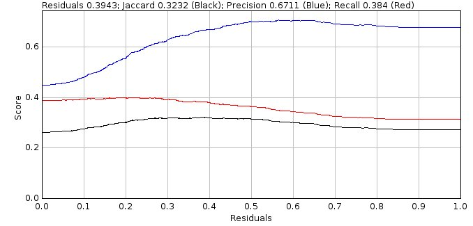

    Doublet Analysis ``Show Jaccard Plot`` displays the scoring statistics verses the residuals threshold

The plot usually shows a region where the Jaccard score is optimal. Measures of the size of this region are calculated for the summary table. An ideal result would be the maximum Jaccard score when the residuals threshold is zero, i.e. the system fits all spots as singles and doublets and can pick the best result from each fit. However no filtering of fit results is performed and so many doublet results may contain poor spot data that can be filtered out using thresholds such as width, precision and SNR. Consequently the performance is often better when the single fits that have symmetric residuals (low residuals score) are accepted as singles and not as doublets, i.e. the residuals threshold is above 0. Unless the density is extremely low (and there are no doublets) it is unlikely the best score will be at residuals score 1, i.e. accept all fits as a single spot.

The analysis results are reported in a summary table:

.. list-table::
   :widths: 20 80
   :header-rows: 1

   * - Field
     - Description

   * - Molecules
     - The number of molecules in the simulated data.

   * - Matched
     - The number of molecules that matched to a spot candidate.

   * - Density
     - The density of the molecules.

   * - minN
     - The minimum number of photons for a flourophore.

   * - maxN
     - The maximum number of photons for a flourophore.

   * - N
     - The average number of photons for a flourophore.

   * - s (nm)
     - The PSF standard deviation.

   * - a (nm)
     - The pixel pitch.

   * - s\ :sub:`a` (nm)
     - The adjusted PSF standard deviation accounting for square pixels.

   * - Gain
     - The total gain of the simulation.

   * - ReadNoise (ADUs)
     - The read noise of the simulation.

   * - B (photons)
     - The background photons.

   * - Noise (ADUs)
     - The combined noise from read noise and background photons.

   * - SNR
     - The signal-to-noise ratio (using the average photons for signal).

   * - Width
     - The size of the fitting region. The actual region is 2N+1.

   * - Method
     - The fit method.

   * - Options
     - Options for the fit method.

   * - Score n=1
     - Summary statistics (Mean Std.Dev (N) Median) of the residuals score of candidates that match 1 result.

   * - Score n=2
     - Summary statistics (Mean Std.Dev (N) Median) of the residuals score of candidates that match 2 results.

   * - Score n=N
     - Summary statistics (Mean Std.Dev (N) Median) of the residuals score of candidates that match more than 2 results.

   * - Iter n=1
     - Summary statistics (Mean Std.Dev (N) Median) of the number of iterations to fit a candidate that matches only 1 actual result.

   * - Eval n=1
     - Summary statistics (Mean Std.Dev (N) Median) of the number of function evaluations to fit a candidate that matches only 1 actual result.

   * - Iter n>1
     - Summary statistics (Mean Std.Dev (N) Median) of the number of iterations to fit a candidate that matches more than 1 actual result.

   * - Eval n>1
     - Summary statistics (Mean Std.Dev (N) Median) of the number of function evaluations to fit a candidate that matches more than 1 actual result.

   * - Matching
     - The match mode.

   * - BestJ
     - The best jaccard score if the system was able to correctly filter single and doublet fit results. This sets an upper bounds for what is possible.

   * - J (r=1)
     - The Jaccard score for fitting everything as singles (residuals threshold = 1).

   * - MaxJ
     - The maximum Jaccard score.

   * - Residuals
     - The residuals threshold used to obtain the maximum Jaccard score.

   * - Area +/- 15%
     - The average Jaccard score using the region around the maximum Jaccard score with a width of +/- 0.15.

   * - Area 98%
     - The average Jaccard score using the region around the maximum Jaccard score with a Jaccard above 98% of the maximum.

   * - Min 98%
     - The lower bounds of the region around the maximum Jaccard score with a Jaccard above 98% of the maximum.

   * - Max 98%
     - The upper bounds of the region around the maximum Jaccard score with a Jaccard above 98% of the maximum.

   * - Range 98%
     - The range of the region around the maximum Jaccard score with a Jaccard above 98% of the maximum.

   * - wMean 98%
     - The weighted mean Jaccard score using the region around the maximum Jaccard score with a Jaccard above 98% of the maximum.

   * - Area > 90%
     - The average Jaccard score using the region around the maximum Jaccard score with a Jaccard above 90% of the performance improvement over no doublet fitting.

   * - Min > 90%
     - The lower bounds of the region around the maximum Jaccard score with a Jaccard above 90% of the performance improvement over no doublet fitting.

   * - Max > 90%
     - The upper bounds of the region around the maximum Jaccard score with a Jaccard above 90% of the performance improvement over no doublet fitting.

   * - Range > 90%
     - The range of the region around the maximum Jaccard score with a Jaccard above 90% of the performance improvement over no doublet fitting.

   * - wMean > 90%
     - The weighted mean Jaccard score using the region around the maximum Jaccard score with a Jaccard above 90% of the performance improvement over no doublet fitting.

   * - Run time
     - The run time for fitting.

.. index:: Overlay

Overlay
^^^^^^^

If the ``Show overlay`` option was selected the plugin will put a cross on the input localisation image coloured using the number of localisations they match: 1 (red); 2 (green); over 2 (blue) (see :numref:`Figure %s <fig_doublet_analysis_overlay>`).

.. _fig_doublet_analysis_overlay:
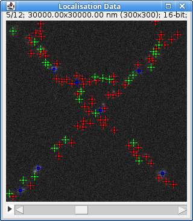

    Double Analysis ``Show overlay`` option identifies localisations that match fitted results

    The overlay is coloured using the number of localisations they match: 1 (red); 2 (green); over 2 (blue).

The overlay can be removed using ``Image > Overlay > Remove Overlay``.

Histograms
^^^^^^^^^^

If the ``Show histograms`` option was selected the plugin prompts the user to select which histograms to display. The following histograms are available:

.. list-table::
   :widths: 20 80
   :header-rows: 1

   * - Field
     - Description

   * - Candidate:N results in candidate
     - The number of actual results that match to a spot candidate.

   * - Assigned Result:N results in assigned spot
     - The number of results that match to a spot candidate with n results (the sum of this histogram is the total number of results that match candidates).

   * - Singles:Neighbours
     - The number of neighbour candidates in the fit region for candidates that match 1 actual result.

   * - Doublets:Neighbours
     - The number of neighbour candidates in the fit region for candidates that match 2 actual results.

   * - Multiples:Neighbours
     - The number of neighbour candidates in the fit region for candidates that match more than 2 actual results.

   * - Singles:Almost
     - The number of neighbour candidates in the expanded fit region for candidates that match 1 actual result.

   * - Doublets:Almost
     - The number of neighbour candidates in the expanded fit region for candidates that match 2 actual results.

   * - Multiples:Almost
     - The number of neighbour candidates in the expanded fit region for candidates that match more than 2 actual results.

   * - Score n=1
     - The residuals score for candidates that match only 1 result.

   * - Score n=2
     - The residuals score for candidates that match 2 results (doublets).

   * - Score n=N
     - The residuals score for candidates that match more than 2 results.

   * - Iter n=1
     - The number of iterations to fit a candidate that matches only 1 actual result.

   * - Eval n=1
     - The number of function evaluations to fit a candidate that matches only 1 actual result.

   * - Iter n>1
     - The number of iterations to fit a candidate that matches more than 1 actual result.

   * - Eval n>1
     - The number of function evaluations to fit a candidate that matches more than 1 actual result.

Results Table
^^^^^^^^^^^^^

If the ``Show results`` option was selected the plugin outputs information about the fit of each spot candidate to a table. The values contained in the table can be used to filter the fit results to accept either the single or doublet fit. This can be done using the ``Doublet Filter Analysis`` plugin.

The following data is shown:

.. list-table::
   :widths: 20 80
   :header-rows: 1

   * - Field
     - Description

   * - Frame
     - The frame containing the spot candidate.

   * - X
     - The x position of the candidate.

   * - Y
     - The y position of the candidate.

   * - I
     - The intensity of the candidate.

   * - n
     - The number of results that match to the candidate.

   * - neighbours
     - The number of spot candidates that are inside the fit region for the candidate.

   * - almost
     - The number of spot candidates that are inside the expanded fit region for the candidate.

   * - score1
     - The 1\ :sup:`st` residuals score (calculated using quadrants based around a cross through the fitted position).

   * - score2
     - The 2\ :sup:`nd` residuals score (calculated using quadrants based around a diagonal cross through the fitted position).

   * - R1
     - The result of fitting the candidate as a single spot.

   * - R2
     - The result of fitting the candidate as a doublet (this is empty if the spot cannot be fit as a single).

   * - ss1
     - The residual sum-of-squares when fitting as a single spot.

   * - ss2
     - The residual sum-of-squares when fitting as a doublet.

   * - v1
     - The optimised value when fitting as a single spot (this may be the Maximum Likelihood Score or the sum-of-squares).

   * - v2
     - The optimised value when fitting as a doublet (this may be the Maximum Likelihood Score or the sum-of-squares).

   * - r1
     - The adjusted coefficient of determination when fitting a single spot.

   * - r2
     - The adjusted coefficient of determination when fitting a doublet.

   * - aic1
     - The adjusted Akaike Information Criterion when fitting a single spot using the likelihood estimated from the residuals.

   * - aic2
     - The adjusted Akaike Information Criterion when fitting a doublet using the likelihood estimated from the residuals.

   * - bic1
     - The Bayesian Information Criterion when fitting a single spot using the likelihood estimated from the residuals.

   * - bic2
     - The Bayesian Information Criterion when fitting a doublet using the likelihood estimated from the residuals.

   * - maic1
     - The adjusted Akaike Information Criterion when fitting a single spot using the likelihood from Maximum Likelihood fitting. If using Least Squares fitting this will be the same as AIC.

   * - maic2
     - The adjusted Akaike Information Criterion when fitting a doublet using the likelihood from Maximum Likelihood fitting. If using Least Squares fitting this will be the same as AIC.

   * - mbic1
     - The Bayesian Information Criterion when fitting a single spot using the likelihood from Maximum Likelihood fitting. If using Least Squares fitting this will be the same as BIC.

   * - mbic2
     - The Bayesian Information Criterion when fitting a doublet using the likelihood from Maximum Likelihood fitting. If using Least Squares fitting this will be the same as BIC.

   * - a1
     - The angle between the vector.
       defining the asymmetry in the fit residuals and the position of the first spot of the doublet

   * - a2
     - The angle between the vector.
       defining the asymmetry in the fit residuals and the position of the second spot of the doublet

   * - gap
     - The distance between the two spots in the doublet.

   * - x1
     - The X distance between the centres of the single fit and the position of the first spot of the doublet.

   * - y1
     - The Y distance between the centres of the single fit and the position of the first spot of the doublet.

   * - x2
     - The X distance between the centres of the single fit and the position of the second spot of the doublet.

   * - y2
     - The Y distance between the centres of the single fit and the position of the second spot of the doublet.

   * - i1
     - The number of iterations to fit as a single spot.

   * - i2
     - The number of iterations to fit as a doublet.

   * - e1
     - The number of function evaluations to fit as a single spot.

   * - e2
     - The number of function evaluations to fit as a doublet.

   * - params1
     - The fit parameters of the single spot.

   * - params2
     - The fit parameters of the doublet.

.. index:: ! Doublet Filter Analysis

Doublet Filter Analysis
-----------------------

Filters all the fit results produced by the ``Doublet Analysis`` plugin using the specified filter settings and scores the results. This plugin requires the results generated by the ``Doublet Analysis`` plugin. If these results are not available an error will be displayed.

This can be used to determine the best settings for optimum doublet fitting and filtering.

.. index:: Selecting a Two Spot Model

Selecting a Two Spot Model
~~~~~~~~~~~~~~~~~~~~~~~~~~

The ``Doublet Analysis`` plugin fits a subset of the candidate spots in the benchmark image. These are fit as a single spot or as a double spot (doublet). The results are compared to the actual coordinates and scored. The ``Doublet Filter Analysis`` plugin applies filters to the fitting results to select if the single or doublet (or no fit) results should be accepted. The filtered results are then scored against the actual coordinates.

Unlike standard fitting and filtering, where the system must decide if the fit of a single spot is good, doublet fitting must decide if the fit is better with two spots rather than one. The system first requires that both results from the doublet are valid (i.e. using SNR, width, precision, etc). It then must decide if the fit is better using two spots rather than one. Given that the two spot model has more parameters it has an advantage over a simpler one spot model. The plugin provide various scores to determine if there is sufficient improvement in the fit to accept the more complex two spot model. The acceptance scores are described below.

.. index:: Adjusted Coefficient of Determination

Adjusted Coefficient of Determination
^^^^^^^^^^^^^^^^^^^^^^^^^^^^^^^^^^^^^

.. math::

    R_{\mathit{adj}}^{2}=1-(\frac{\mathit{SS}_{\mathit{res}}}{\mathit{SS}_{\mathit{total}}}\times{\frac{n-1}{n-p-1}})

Where
:math:`\mathit{SS}_{\mathit{res}}` is the sum of the squared residuals (difference between the fitted model and the data),
:math:`\mathit{SS}_{\mathit{total}}` is the sum of the squared differences between the data and the mean of the data,
:math:`n` is the number of fitted points and
:math:`p` is the number of parameters.
A higher score is better.

.. index:: Bias corrected Akaike Information Criterion

Bias corrected Akaike Information Criterion
^^^^^^^^^^^^^^^^^^^^^^^^^^^^^^^^^^^^^^^^^^^

.. math::

    \mathit{AIC}=2p-2\times \ln (\mathit{likelihood})

.. math::

    \mathit{AICc}=\mathit{AIC}+2p(\frac{p+1}{n-p-1})

Where
:math:`\mathit{AIC}` is Akaike Information Criterion,
:math:`\mathit{likelihood}` is the likelihood of the model given the data,
:math:`n` is the number of fitted points and
:math:`p` is the number of parameters.
:math:`\mathit{AICc}` is the bias corrected Akaike Information Criterion which corrects for an increase in the number of parameters with respect to the number of fitted data points. A lower score is better.

.. index:: Bayesian Information Criterion

Bayesian Information Criterion
^^^^^^^^^^^^^^^^^^^^^^^^^^^^^^

.. math::

    \mathit{BIC}=p\times \ln (n)-2\times \ln (\mathit{likelihood})

Where
:math:`\mathit{BIC}` is Bayesian Information Criterion,
:math:`\mathit{likelihood}` is the likelihood of the model given the data,
:math:`n` is the number of fitted points and
:math:`p` is the number of parameters.
A lower score is better.

Note: The BIC penalises additional parameters more than the AIC.

.. index:: Computing the Likelihood

Computing the Likelihood
^^^^^^^^^^^^^^^^^^^^^^^^

The likelihood score is output directly when using a Maximum Likelihood Estimator.

When using a Least Squares Estimator the variance of a model's residuals distributions (:math:`\sigma^2`) is :math:`\mathit{SS}_{\mathit{res}} / n`, where :math:`\mathit{SS}_{\mathit{res}}` is the sum of the squared residuals (difference between the fitted model and the data) and :math:`n` is the number of fitted points. Then, the maximum value of a model's log-likelihood function is:

.. math::

    \ln (\mathit{likelihood})=-{\frac{n}{2}}\ln (2\pi )-\frac{n}{2}\ln(\sigma ^{2})-\frac{1}{2\sigma ^{2}}\mathit{SS}_{\mathit{res}}

Parameters
~~~~~~~~~~

The following parameters can be configured:

.. list-table::
   :widths: 20 80
   :header-rows: 1

   * - Parameter
     - Description

   * - Selection Criteria
     - Specify the selection criteria for choosing a single or doublet fit.

       AIC/BIC are computed using the likelihood taken from the sum of squared residuals. ML AIC/ML BIC are computed using the likelihood from the Maximum Likelihood Estimator (if available).

   * - Template
     - Select a template to use to populate the filter settings.

       Templates can be loaded using the ``Template Manager`` plugin.

   * - Benchmark settings
     - Use the filter settings from the best filter identified by the ``Benchmark Filter Analysis`` plugin.

       This allows testing the residuals threshold to use given the optimum filter for fitting single spots.

   * - Shift Factor
     - Any peak that shifts more than a factor of the initial peak standard deviation is discarded.

   * - Signal Strength
     - Any peak with a signal/noise below this level is discarded.

       The signal is the calculated volume under the Gaussian. The image noise is calculated per frame.

   * - Min photons
     - The minimum number of photons in a fitted peak. This requires a correctly calibrated gain to convert ADUs to photons.

   * - Min width factor
     - Any peak whose final fitted width is a factor smaller than the start width is discarded (e.g. 0.5x fold).

   * - Max width Factor
     - Any peak whose final fitted width is a factor larger than the start width is discarded (e.g. 2x fold).

   * - Precision
     - Any peak with a precision above this level is discarded, i.e. not very good precision.

   * - Local background
     - Use the local fitted background in the precision calculation. The default is to use the global background estimate for the frame.

   * - Drift angle
     - Set the maximum angle that a doublet centre can be away from the vector defining the assymetry in the single fit residuals. The angle criteria is only applied if the doublet centre has shifted beyond the configured shift factor for filtering a single spot (i.e. if the doublet centre is far from the original fitted position it must be in the correct direction given the fit residuals).

       Note: This angle is displayed in the results table for each candidate fit result if the ``Show results`` option is chosen.

   * - Min gap
     - The minimum gap between the two centres of the doublet, i.e. prevent them being on top of each other.

   * - Show results
     - Show a results table with details of the fit results for each spot candidate.

   * - Show Jaccard plot
     - Show a plot of the performance scores verses the residuals threshold.

   * - Use max residuals
     - Use the maximum residuals score. This is a measure of the maximum asymmetry in the fit residuals.

       The alternative is the average of the score for the two quadrants for which it is computed (i.e. the average asymmetry).

   * - Logging
     - Set to **true** to log detailed information about why each doublet fit was rejected.

   * - Title
     - A title to record in the results summary or the template file.

   * - Save template
     - Set to **true** to save a template containing all the filter, fit and filtering settings from the benchmark plugins to file. The template will contain the best residuals threshold given the filter settings.

       This template can be loaded using the ``Template Manager`` plugin for use in the ``Peak Fit`` plugin when fitting localisation data.

Results
~~~~~~~

After spot candidates have been filtered using the specified criteria the results are summarised. Each candidate that was fitted as a single spot has a residuals score. The results are sorted by their residuals score and the binary scoring statistics (Precision, Recall, Jaccard) are computed for each possible threshold for the residuals score; for a given threshold all spots below the threshold are assessed as single fits and all above are subjected to the selction criteria to choose the single or doublet fit.

If the \`Show Jaccard Plot`` option was selected the scoring statistics can be plotted against the residuals threshold (::numref:`Figure %s <fig_doublet_filter_analysis_jaccard_plot>`).

.. _fig_doublet_filter_analysis_jaccard_plot:
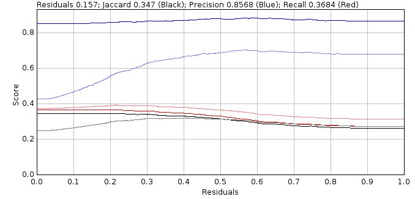

    Doublet Filter Analysis ``Show Jaccard Plot`` displays the scoring statistics verses the residuals threshold

This plot is similar to the output from the
``Doublet Analysis``
plugin where results were either accepted as a single or doublet based purely on the residuals score. The performance metrics for this simple selection are shown in light blue (precision), light red (recall) and grey (Jaccard).

However the plot now shows the results of applying the selection criteria on the fit of the model as a single or doublet and also the filtering of the spots using any spot selection filters. The performance metrics for the strict selection are shown in blue (precision), red (recall) and black (Jaccard). The recall will be lower (as strict filtering removes many spots) however the precision is higher as the system correctly picks good spots (true positives) more often than bad spots (false positives).

As before the plot usually shows a region where the Jaccard score is optimal. Measures of the size of this region are calculated for the summary table. An ideal result would be the maximum Jaccard score when the residuals threshold is zero, i.e. the system fits all spots as singles and doublets and can pick the best result from each fit. However this requires all spots to be fit twice which is computationally expensive. So the system computes the weighted average for the residuals threshold for the region of the curve within a fraction of the maximum performance improvement over no doublet fitting, i.e. the residuals score to achieve most of the performance benefit. This residuals score is often much higher than the residuals score for the best Jaccard score and so is a compromise between maximum performance and speed.

The filter analysis results are reported in a summary table:

.. list-table::
   :widths: 20 80
   :header-rows: 1

   * - Field
     - Description

   * - Density
     - The density of the molecules.

   * - s
     - The PSF width used for fitting.

   * - Width
     - The size of the fitting region. The actual region is 2N+1.

   * - Method
     - The fit method.

   * - Options
     - Options for the fit method.

   * - BestJ
     - The best Jaccard score possible if the system is capable of accepting fit results that score more than 0.5 for true positive (fractional scores are possible due to the use of weighted scoring) and rejecting all others.

   * - Title
     - The title from the input dialog.

   * - Use residuals
     - Specify if the residuals score is the maximum or the average of residuals score 1 and 2 for the single spot.

   * - Selection
     - The selection criterion.

   * - Shift
     - The shift filter value.

   * - SNR
     - The SNR filter value.

   * - Photons
     - The Signal (photons) filter value.

   * - Min Width
     - The minimum width filter value.

   * - Max Width
     - The maximum width filter value.

   * - Precision
     - The precision filter value.

   * - Local B
     - True if using a local background for the precision filter.

   * - Angle
     - The angle limit.

   * - Gap
     - The minimum gap between doublets centres.

   * - J (r=1)
     - The Jaccard score for fitting everything as singles (residuals threshold = 1).

   * - MaxJ
     - The maximum Jaccard score.

       Note: The difference between ``MaxJ`` and ``J (r=1)`` is the performance improvement for using doublet fitting.

   * - Residuals
     - The residuals threshold used to obtain the maximum Jaccard score.

   * - Area +/- 15%
     - The average Jaccard score using the region around the maximum Jaccard score with a width of +/- 0.15.

   * - Area 98%
     - The average Jaccard score using the region around the maximum Jaccard score with a Jaccard above 98% of the maximum.

   * - Min 98%
     - The lower bounds of the region around the maximum Jaccard score with a Jaccard above 98% of the maximum.

   * - Max 98%
     - The upper bounds of the region around the maximum Jaccard score with a Jaccard above 98% of the maximum.

   * - Range 98%
     - The range of the region around the maximum Jaccard score with a Jaccard above 98% of the maximum.

   * - wMean 98%
     - The weighted mean Jaccard score using the region around the maximum Jaccard score with a Jaccard above 98% of the maximum.

   * - Area > 90%
     - The average Jaccard score using the region around the maximum Jaccard score with a Jaccard above 90% of the performance improvement over no doublet fitting.

   * - Min > 90%
     - The lower bounds of the region around the maximum Jaccard score with a Jaccard above 90% of the performance improvement over no doublet fitting.

   * - Max > 90%
     - The upper bounds of the region around the maximum Jaccard score with a Jaccard above 90% of the performance improvement over no doublet fitting.

   * - Range > 90%
     - The range of the region around the maximum Jaccard score with a Jaccard above 90% of the performance improvement over no doublet fitting.

   * - wMean > 90%
     - The weighted mean Jaccard score using the region around the maximum Jaccard score with a Jaccard above 90% of the performance improvement over no doublet fitting.

Results Table
^^^^^^^^^^^^^

If the ``Show results`` option was selected the plugin outputs information about the fit of each spot candidate to a table as per the ``Doublet Analysis`` plugin. See section :numref:`{number} <model_plugins:Doublet Analysis>` for more details.

.. index:: ! Smart Spot Ranking

Smart Spot Ranking
------------------

Compare methods for ranking spot candidates.

This documentation is in progress.

