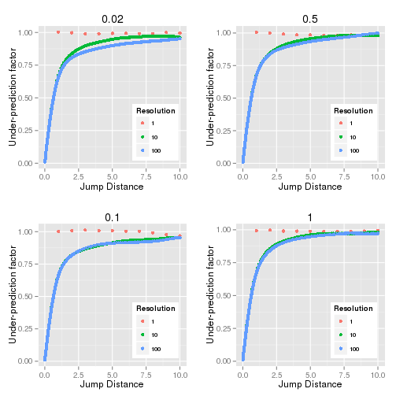
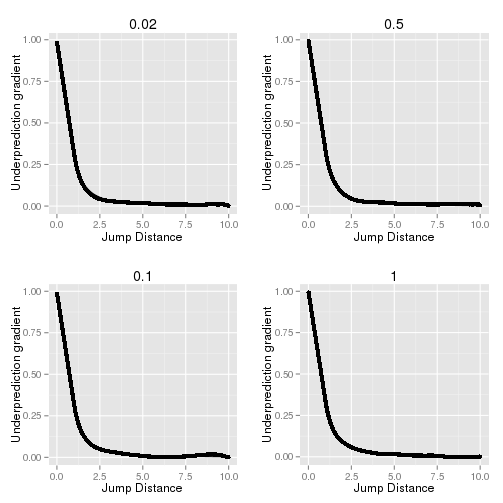

.. index:: ! MSD Correction

MSD Correction
==============

The mean squared distance (MSD) is classically computed using the distance between a diffusing molecule after time *t* and the origin. The expected MSD after time *t* is related to the diffusion coefficient *D* and for 1-dimension diffusion is:

.. math::

    \mathit{MSD}={2Dt}

Thus the diffusion coefficient can be computed using observed distances on diffusing particles. This requires an exact location of the molecule. However the situation is different for localisations that have been determined using imaging of moving fluorescent objects. The position is not the exact position of the object but an average over the exposure time used to acquire the image frame. The distance between two frames thus represents the distance between an average position in the start and end frames, optionally with extra frames inserted in-between. The extra frames only effect the time between the start and end frame.

The effect of averaging the position in the start and end frames can be examined using a simulation. Diffusion can be simulated by sampling from a Gaussian distribution to generate random movements in a single dimension. The width of the Gaussian (*s*) is related to the diffusion coefficient (*D*) and time of diffusion (*t*):

.. math::

    s=\sqrt{2Dt}

Samples can be taken for X and Y dimensions independently to simulate a 2-dimension diffusion track for a molecule. The location of a fluorophore within a frame can be determined using the average of a number of *N* consecutive positions from the simulated diffusion track. The location of the fluorophore in the next frame is the average of the next *N* consecutive positions. The simulation has a resolution of *N* steps per frame. The distance between these two points can then be calculated.

It is possible to calculate distances between frames of *N* simulation steps that are offset by *j* simulation steps (*j* is the jump distance between the two points). Since the data is artificial in this case *N* does not have to be a factor of *j* allowing for example a jump of 1.5 frames. The distance *d* is defined as:

.. math::

    d=\sum _{i}^{i+N}{\frac{x_{n}}{N}}-\sum _{i+j}^{i+j+N}{\frac{x_{n}}{N}}

This is performed for each dimension in the simulation and summed to the mean squared distance. The MSD from the simulation can be compared to the expected MSD from the diffusion coefficient.

:numref:`Figure %s <fig_observed_msd_vs_expected>` shows the ratio (under-prediction factor) between the observed MSD and the expected MSD against the frame overlap (jump distance). The simulation was performed using different number of steps per frame (resolution) and different diffusion coefficients. There is no under-prediction when the resolution is 1. At higher resolutions the under-prediction converges to a curve that is constant irrespective of the diffusion coefficient.

.. _fig_observed_msd_vs_expected:

    Under-prediction factor of observed MSD and expected MSD against the jump distance

    Simulation was performed using a diffusion coefficient (*D*) of 0.02, 0.1, 0.5 and 1. The resolution is the number simulation steps per frame.

The gradient of the under-prediction factor with respect to the jump distance can be computed numerically by taking the difference of adjacent values in Y divided by the difference in X. For the high resolution curve this results in :numref:`Figure %s <fig_observed_msd_vs_expected_gradient>`.

.. _fig_observed_msd_vs_expected_gradient:

    Gradient of the under-prediction factor of observed MSD and expected MSD against the jump distance.

    Simulation was performed using a diffusion coefficient (D) of 0.02, 0.1, 0.5 and 1. The resolution is 100 steps per frame.

Fitting the under-prediction ratio
----------------------------------

The under-prediction ratio is a function :math:`f(n)` of the jump distance in frames *n*. The gradient of the under-prediction factor (:math:`f'(n)`, :numref:`Figure %s <fig_observed_msd_vs_expected_gradient>`) is readily fitted. The solution can be integrated to determine the fit of the under-prediction factor (:math:`f(n)`, :numref:`Figure %s <fig_observed_msd_vs_expected>`).

n < 1
~~~~~

The curve is linear for jump distances under 1 frame. For :math:`n<1` the gradient of :math:`f'(n)` is -2/3
and the curve is described by:

.. math::

    f'(n)=1-\frac{2n}{3}

And the integral is:

.. math::

    f(n) &= \int {1-\frac{2n}{3}}\mathit{dn} \\
         &= n-\frac{n^{2}}{3}+C

:math:`C` equates to zero to fit the under-prediction line.

Note that this solution is not applicable to super-resolution data as it cannot be imaged at less than 1 frame intervals.

n > 1
~~~~~

The gradient follows a power law for :math:`n>1`.

.. math::

    f'(n)=\frac{1}{3n^{2}}

And the integral is:

.. math::

    f(n) &= \int {\frac{1}{3n^{2}}}\mathit{dn} \\
         &= C-\frac{1}{3n}

:math:`C` equates to 1 to fit the under-prediction line :math:`f(n)`:

.. math::

    f(n) = 1-\frac{1}{3n}

Note that this solution is applicable to super-resolution data.

Application to Diffusion Data
~~~~~~~~~~~~~~~~~~~~~~~~~~~~~

Given that the under-prediction is only relevant to experimental data when the number of frames is 1 or more the observed MSD can be converted to the true MSD by dividing by a correction factor (:math:`F`):

.. math::

    F &= 1-\frac{1}{3n} \\
      &= \frac{n-\frac{1}{3}}{n}

This correction factor effectively states that the diffusion of the objects within the start and end frames has reduced the time interval by a fixed constant of 1/3. This is logical since any frames added in between the start and end frames will be measured entirely. Only the start and end frames are composed of an average location of a diffusing particle.

When performing jump distance analysis when the jump length is fixed it is not necessary to correct each observed squared distance before fitting the MSD data. Since the correction is a single scaling factor the computed diffusion coefficient can be adjusted by applying the linear correction factor.

Fitting the Plot of MSD verses N Frames
---------------------------------------

When fitting the linear plot of MSD verses the number of frames we can account for the correction factor. The observed MSD is composed of the actual MSD multiplied by the correction factor before being adjusted for the precision error:

.. math::

    \mathit{oMSD}(n\Delta t) & = \mathit{MSD}(n\Delta t)\times(\frac{n-1/3}{n})+4\sigma ^{2} \\
                             & = 4D(n\Delta t)\times (\frac{n-1/3}{n})+4\sigma^{2} \\
                             & = 4D(\Delta t)\times n(\frac{n-1/3}{n})+4\sigma^{2} \\
                             & = 4D(\Delta t)\times (n-1/3)+4\sigma ^{2} \\
                             & = 4D(n\Delta t)-\frac{4D(\Delta t)}{3}+4\sigma^{2}

The resulting equation is still a linear fit. The intercept has a new representation and allows the intercept to be negative. To ensure the intercept is correctly bounded it should be represented using the fit parameters and not fit using a single constant C.

Note: The final fitted equation is the 2-dimension equivalent of the equation provided in Backlund, *et al* (2015), equation (1):

    "The effect of static and dynamic errors on the expected value of the estimated 1D MSD for the special case of pure Brownian motion is to produce a constant offset of the linear dependence according to:"

.. math::

    E[\hat{M}(n)]=2\mathit{Dnt}_{E}+2\sigma ^{2}-\frac{2}{3}Dt_{E}

where :math:`t_E` is the exposure time of the acquisition,
:math:`n` is the number of frames spanning the lag,
:math:`D` is the diffusion coefficient,
:math:`\sigma` is the localisation error including an additional correction due to the spreading of photons over a greater area for a moving particle,
:math:`E` is the expectation value and the hat denotes the estimated quantity. The only difference is the equation is scaled by 2 for 2-dimensional analysis.
