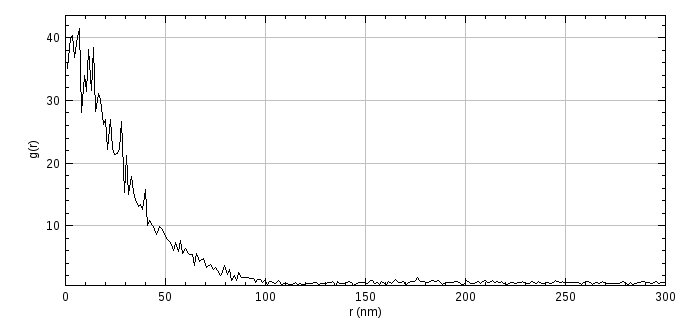

PC PALM Plugins
===============

The following plugins are used to analyse the auto-correlation of a set of localisations using Pair Correlation (PC) analysis. This can provide information on whether the localisations are randomly distributed or clustered ([Sengupta *et al* , 2011], [Sengupta, *et al*, 2013], [Puchnar, *et al*, 2013]).

The analysis uses a set of localisations assumed to represent single molecules or single fluorescent bursts. The data is compared to itself using auto-correlation and a curve is computed as a function of the distance from the centre of the localisation. A flat curve is indicative that the distribution of localisations is no different from a random distribution. Shaped curves can be fit using models that apply to various distributions of localisations (random; fluctuations; or an emulsion).

The plugins are described in the following sections using the order presented on the ``Plugins > GDSC SMLM > PC PALM`` menu.

.. note::

    The PC-PALM plugins should be considered experimental.

    The analysis of localisations using PC_PALM is applicable to 2D data (Sengupta *et al*, 2011). The analysis methods do not accommodate structures that overlap in the z-dimension. The original papers performed analysis on 2D bound membrane proteins.

    The analysis of colocated fluorescence by Puchner *et al* (2013) is not limited to 2D data but requires that clusters projected onto the 2D imaging plane are well separated.

    In either case the success of the method requires careful experimental setup, imaging conditions and localisation analysis. Development work on these plugins was halted when the methods were determined to be unsuitable for the imaging data of interest.

PC-PALM Molecules
-----------------

Prepare results held in memory for analysis using pair correlation methods. This plugin either simulates results or filters localisations from a results set to a set of coordinates with time and photon signal information. The molecules are drawn on an image to allow regions of the data to be selected for analysis.

The pair correlation analysis assumes that the molecules are not moving. The input data should be localisation positions from a fixed sample. The use of fiducial markers to correct drift during image acquisition is recommended by Sengupta, *et al* (2013).

The output of the ``PC-PALM Molecules`` plugin is a set of molecule positions stored in memory. Each position should represent a single continuous on time of a fluorophore over one or more frames. Blinking events resulting in intervening dark frames should not be joined and must remain as separate molecules in the output molecule positions. This is because the model correlation functions used during analysis assume a blinking component for the same molecules.

The plugin has the following modes to prepare the molecule positions:

.. list-table::
   :widths: 20 80
   :header-rows: 1

   * - Run mode
     - Description

   * - PC-PALM
     - Follows the PC-PALM protocol for estimating localisation precision and then tracing molecules.

       See :numref:`{number}: {name} <pc_palm_plugins:Run Mode: PC-PALM>`.

   * - Manual tracing
     - Trace molecules using a distance and time threshold. Any spot that occurred within time threshold and distance threshold of a previous spot is grouped into the same trace as that previous spot.

       The tracing uses nearest neighbour assignment and more recent frames have priority (i.e. localisations with a small time gap are joined in preference to a larger time gap and smaller distance). More control over the tracing can be performed using an external tracing analysis and the molecules loaded direct using the ``In-memory`` mode.

   * - In-memory results
     - Select molecules previously loaded into memory.

   * - Simulation
     - Simulates localisations using different molecule distributions.

       See :numref:`{number}: {name} <pc_palm_plugins:Run Mode: Simulation>`.

Note: If no localisations are currently stored in memory then the plugin will default to simulation mode. In this case the simulation dialog is combined with the output image options.

Once the molecules have been identified the plugin will construct a super-resolution image of the data. The image is binary with a value of 1 for any pixel that has one or more molecules, otherwise the pixels are 0. The image has an ROI drawn on the image. This represents a rectangular region for analysis by the ``PC-PALM Analysis`` plugin. The image is used to select regions of data for analysis. Ideally some level of non-random distribution (clustering) should be visible in the image.

Optionally a high resolution image of the data can be constructed. This will attempt to draw each molecule on a single pixel by defining the pixel pitch as the reciprocal of the minimum distance between any two molecules. In the event of colocalisation this may be a very small distance and the reciprocal which defines the output pixel pitch will tend towards infinity. Thus the plugin provides the option to limit the output pixel pitch. Note that this image allows debugging the molecule distribution that is used in the ``PC-PALM Analysis`` plugin. Ideally it should be possible to render all molecules to separate pixels on a high resolution image to maximise the information available during pair correlation. This may not be possible if colocalisation of blinks from the same molecules is present. However if the minimum distance between molecules is high then the conversion of localisations to molecules may have grouped together separate molecules.

Parameters
~~~~~~~~~~

The following parameters are available:

.. list-table::
   :widths: 20 80
   :header-rows: 1

   * - Parameter
     - Description

   * - Input
     - The input localisations.

       Only available if there are localisations in memory. Otherwise the mode is ``Simulation`` and the dialog displays the simulation dialog parameters (see :numref:`{number}: {name} <pc_palm_plugins:Run Mode: Simulation>`).

   * - Use ROI
     - Map the ROI from the currently selected image to the input localisations and crop the selected region. This options is only shown if the current image has an area ROI.

       This option can be used to dynamically crop results from a dataset using a ROI drawn on a super-resolution render of the data.

   * - Run mode
     - The mode used to map the localisations into molecules representing distinct blinks of fluorophores.

   * - Image size
     - The size (in pixels) of the output super-resolution image of the final molecules.

   * - ROI size
     - The size of the ROI to create on the output super resolution image.

   * - Show high res image
     - Set to **true** to show a high resolution image of the final molecules.

   * - nm per pixel limit
     - Set the minimum pixel pitch (in nm) for the high resolution image. A setting of 0 will attempt to create the largest image possible.

   * - Clear results
     - Set to **true** to remove any PC-PALM analysis results from memory. Use this option to clear old results when starting a new analysis of a different dataset.

Run Mode: PC-PALM
~~~~~~~~~~~~~~~~~

This mode follows the PC-PALM protocol of Sengupta, *et al* (2013), steps 13 to 18. The localisation precision of each localisation is used to build a histogram of precision. The stored precision associated with the localisation is used if available or it is computed using the Mortensen formula ([Mortensen *et al*, 2010]). The histogram of the precision is fit using a skewed Gaussian function to determine the average positional uncertainty. The histogram and fitted function will be displayed.

The localisations are then traced using a distance of 2.5 times the average positional uncertainty with a time gap of successive frames. Joined localisations correspond to a single molecule that is active over multiple frames. The centroid of each molecule is computed using the intensity weighted coordinates of the localisations. The localisation precision of the molecule is computed using the weighted distance from the centroid and the weighted precision of each localisation (see formula 7b from Sengupta, *et al* (2013)).

The precision of each molecule is used to build a histogram of precision. Optionally this can include the localisations that are singles, i.e. they only occur in one frame and are not traced into a molecule. The precision histogram is again fit with a skewed Gaussian to determine the average positional uncertainty of each molecule and the results displayed. Note that the distribution of the precision of singles may be very different from the distribution of the precision of multi-frame molecules. This will be evident on the displayed histogram as a bimodal function. Thus including the singles may not create a good fit of the histogram using a skewed Gaussian.

Any molecule with a positional uncertainty above 3 times the average positional uncertainty is discarded to create the final molecules dataset. If the singles were not included in the previous stage to create the molecule precision histogram then any singles can optionally be included in the final dataset if they have a precision lower than the threshold.

The following parameters are available:

.. list-table::
   :widths: 20 80
   :header-rows: 1

   * - Parameter
     - Description

   * - Histogram bins
     - The number of bins to use for the histogram. Use zero for auto.

   * - Singles mode
     - Specify how to handle single localisations that cannot be traced into molecules:

       - ``Ignore``: Remove from the data.
       - ``Include in molecules histogram``: Include them as molecules and allow their precision to contribute to the molecules precision histogram.
       - ``Include in final filtering``: Add to the final output dataset if below the precision threshold set using the average positional uncertainty of the traced molecules.

   * - Simplex fit
     - Set to **true** to perform a simplex fit of the skewed Gaussian. The default is a least square optimisation using numerical gradients.

   * - Show histograms
     - Set to **true** to show the histograms.

   * - Binary image
     - Set to **true** to display the super resolution image of the molecules as a binary image. If **false** then the image is a histogram where the value of each pixel is the molecule count at that pixel. This will not effect the later analysis and is used for visualisation purposes of the molecule density.

   * - Blinking rate
     - Set the blinking rate. This only effects the protein density that is reported to the ``ImageJ`` log window. The protein density is the molecule density divided by the blinking rate. Blinking rate is of interest during later PC-PALM analysis.

Run Mode: Simulation
~~~~~~~~~~~~~~~~~~~~

This mode allows simulation of data using different spatial distributions. Note that the simulation was created to verify that the models used during PC-PALM analysis correctly fit the data. Thus the options are based around clusters of loosely associated molecules. These clusters have an average size (number of members) and cover a circular region that should not overlap other regions. This is the data that is fit by the emulsion model of PC-PALM. Parameters have been added to simulate fluorophore blinking of each molecule in the cluster.

The simulation creates positions randomly within a defined 2D region. The positions may be cluster centres or molecules. If cluster centres then molecules are created for each cluster. Each molecule may blink multiple times resulting in 0 or more localisations per molecule. The number of blinks is the number of localisations per molecule. The localisations are created with a specified positional uncertainty to simulate the fitting precision of a typical super-resolution experiment.

The following cluster simulations are available:

.. list-table::
   :widths: 20 80
   :header-rows: 1

   * - Cluster simulation
     - Description

   * - None
     - Molecule positions are sampled uniformly from the 2D region. Each molecule position generates zero or more localisations due to blinking.

   * - Circles
     - Cluster positions are sampled uniformly from the 2D region. Each cluster contains zero or more molecules within a circle of a specified radius. The cluster circles may overlap.

   * - Non-overlapping circles
     - Create a mask using randomly distributed non-overlapping circles of a specified radius. Each circle has only 1 cluster of molecules. This simulation may not create the desired number of clusters due to space restrictions. If this occurs a message is logged to the ``ImageJ`` log window.

       *Note: This is the distribution modelled by the emulsion model during PC-PALM analysis.*

   * - Circles Mask
     - Create a mask using non-overlapping circles of a specified radius. The region is filled with circles. Sample cluster positions from any circle, there may be more than 1 cluster per circle.

When molecules are simulated into localisations (i.e. blinking) the plugin can optionally compute data on the cluster sizes and the intra-molecule distances. A histogram of the distances is computed and summary statistics recorded to the ``ImageJ`` log window. The plugin also computes the mean distance from a cluster member to the cluster centroid and records this in the ``ImageJ`` log window. These distances should be analysed in conjunction to the simulation settings and also to the model produced by subsequent PC-PALM analysis. If the intra-molecule distances are computed an option is provided to run the paricle linkage algorithm to perform clustering. The clustering distance is the 99\ :sup:`th` percentile from the actual intra-molecule distances. During clustering the join distances between the same molecule (intra-molecule) and between different molecules (inter-molecule) are collected and these are displayed in a cumulative histogram. If the clusters are not dense relative to the localisation precision then there should be a larger frequency of intra-molecule links. As the clusters reduce in size different molecules will begin to be joined and the frequency of inter-molecule links will increase.

The following parameters are available:

.. list-table::
   :widths: 20 80
   :header-rows: 1

   * - Parameter
     - Description

   * - Molecules
     - The number of molecules to simulate. When using a ``Binomial`` distribution this is the number of clusters.

   * - Simulation size
     - The size of the region (in |micro|\ m).

   * - Blinking rate
     - The average number of blinks per molecule. When using a ``Binomial`` distribution this is the number of molecules per cluster.

   * - Blinking distribution
     - The distribution of the blinks per molecule.

       - ``Poisson``: Use a Poisson distribution.
       - ``Geometric``: Use a geometric distribution.
       - ``None``: Use a fixed number of blinks.
       - ``Binomial``: Use a binomial distribution. The ``Blinking rate`` parameter is used as the number of trials and the p-value of a blink occurring is collected via a dialog.

   * - Average precision
     - Define the standard deviation (in nm) of the random Gaussian added to each molecule position when generating localisations to simulate localisation uncertainty.

   * - Show histograms
     - Set to **true** to display a histogram of the intra-molecule distances and the number of blinks per molecule.

   * - Distance analysis
     - Set to **true** to perform clustering and distance analysis on the final localisations. Requires that ``Show histograms`` is **true**.

   * - Cluster simulation
     - Specify the cluster simulation.

   * - Cluster number
     - Specify the number of molecules per cluster. This is called the cluster number in the PC-PALM analysis.

   * - Cluster variation
     - Specify the standard deviation of the cluster number to allow variation in cluster size.

   * - Cluster radius
     - Specify the cluster radius (in nm).

   * - Show cluster mask
     - Set to **true** to show a mask of the region where a molecule may occur. The actual molecule positions are shown on the mask image. Note: This is different from the output binary image from ``PC-PALM Molecules`` that shows the final molecule dataset, i.e. each blink of the simulated molecule. This option shows the actual coordinate of the molecule without blinking and can be used to inspect the number of molecules in each cluster.

PC-PALM Analysis
----------------

Perform pair-correlation analysis in the frequency domain as per the paper by [Sengupta *et al* , 2011], [Sengupta, *et al*, 2013] to produce a *g(r)* auto-correlation curve. Analysis is based on the PC-PALM protocol of Sengupta, *et al* (2013), steps 19 to 20(A).

Molecules representing distinct on bursts from a fluorophore over one or more frames must be prepared using ``PC-PALM Molecules``. That plugin will create an image of the molecule data. A rectangular region of interest (ROI) should be marked on the image. This is the region that will be extracted from the molecule dataset for analysis. When the plugin is run the image with the ROI must be selected otherwise the plugin will display an error.

The analysis plugin will extract the selected molecule data and create a super-resolution image. This should be as large as possible to maximise separation of molecules onto different pixels. This would be achieved using a pixel pitch inverse to the minimum distance between molecules. However due to colocalisation of molecules the minimum distance between them may be extremely small. In practice a pixel pitch of a few nm should be sufficient for analysis. Note that the PC-PALM Molecules plugin will report the minimum distance between molecules and a suggested pixel pitch. This is pre-loaded as the starting value in the analysis plugin dialog. If a previous analysis has been performed on a different ROI then the previous pixel pitch is retained.

The super resolution image is used to compute an auto correlation curve (*g(r)*). This represents the similarity between the image and the same image offset at a given radius *r*. The computation is performed using Fourier transforms which results in the correlation score being computed at each radius *r* in all directions simultaneously. The curve is normalised using the protein density (the molecule density divided by the blinking rate) to account for different numbers of molecules in each ROI. This allows multiple correlation curves to be combined to create a smoother curve for fitting (see :numref:`{number}: {name} <pc_palm_plugins:PC-PALM Fitting>`). A summary of the data is recorded in a results table and the curve is saved in memory for fitting.

Note that the use of an ROI to select regions for analysis allow computation of the *g(r)* curve with a larger super resolution image (smaller pixel pitch). A large dataset may not be possible to analyse in a single pass due to memory restrictions. This can be analysed by sectioning the region, analysing non-overlapping sections and then combining the *g(r)* curves from each analysis. Combination of curves can be done by the ``PC-PALM Fitting`` plugin for curves created using the same pixel pitch (resolution).

Parameters
~~~~~~~~~~

The following parameters are available:

.. list-table::
   :widths: 20 80
   :header-rows: 1

   * - Parameter
     - Description

   * - Correlation distance
     - The maximum distance for the correlation curve.

   * - Binary image
     - Set to **true** to use a value of 1 for each pixel where 1 or more molecules are located. If **false** then the pixel value uses a count. This may effect the correlation curve when there are high levels of colocated molecules on the super-resolution image.

   * - Blinking rate
     - The estimated blinking rate of the fluorphore. This is used to map molecule counts to protein counts. The value effects the normalisation of the correlation curve and the same value should be used for all datasets from the same imaging conditions. The number will effect the peak density and ultimately the cluster number output when fitting models to the *g(r)* curve.

   * - nm per pixel
     - The pixel pitch (resolution) of super-resolution image constructed for auto-correlation.

   * - Show error bars
     - Set to **true** to show the standard error of each value of the *g(r)* curve. Note that the value is the mean of the auto-correlation in multiple directions for the given radius *r*.

   * - Apply window
     - Set to **true** to apply a Tukey window to the super-resolution image to reduce edge artifacts that occur due to periodicity of the Fourier transforms.

   * - Show high res image
     - Set to **true** to show the super-resolution image of the selected molecules.

   * - Show correlation image
     - Set to **true** to show the auto-correlation images computed using the fast Fourier transform (FFT). The transformed image, transformed image window and the normalised correlation are displayed. The *g(r)* curve is computed by averaging all pixel values at the same radius from the centre of the normalised correlation image. Note that the central pixel may have a very high value compared to the other pixel values and contrast adjustment will be required. 

Results
~~~~~~~

A summary of the input data used for analysis is recorded to a results table:

.. list-table::
   :widths: 20 80
   :header-rows: 1

   * - Field
     - Description

   * - ID
     - The identifier of the results.

   * - Image Source
     - The source data for the results.

   * - X
     - The X origin of the region (in |micro|\ m).

   * - X %
     - The X origin of the region as a percentage of the source data width.

   * - Y
     - The Y origin of the region (in |micro|\ m).

   * - Y %
     - The Y origin of the region as a percentage of the source data height.

   * - Width
     - The width of the region (in |micro|\ m).

   * - Width %
     - The width of the region as a percentage of the source data width.

   * - Height
     - The height of the region (in |micro|\ m).

   * - Height %
     - The height of the region as a percentage of the source data height.

   * - N
     - The number of molecules in the region.

   * - PeakDensity
     - The peak density (in |micro|\ m\ :sup:`2`).

   * - nm/pixel
     - The pixel pitch (resolution) of super-resolution image constructed for auto-correlation.

   * - Binary
     - **true** if the super-resolution image was binary.

The correlation curve is displayed (see :numref:`Figure %s <fig_gr_curve>`). A high correlation is visible for small radii which gradually reduces to the background correlation value of 1. Multiple curves can be combined and fit using different models (see :numref:`{number}: {name} <pc_palm_plugins:PC-PALM Fitting>`).

.. _fig_gr_curve:

    Auto-correlation curve from PC-PALM analysis

PC-PALM Spatial Analysis
------------------------

Perform pair-correlation spatial analysis as per the paper by [Puchnar, *et al*, 2013]. This methods plots the molecule density around each localisation as a function of distance from the localisation.

PC-PALM Save Results
--------------------

Saves all the PC-PALM results held in memory to a results folder. When the plugin is run a folder must be selected. All results currently held in memory are saved to the folder in an XML format. Analysis results performed in the frequency domain to create a *g(r)* curve have the prefix ``Frequency``; results performed in the spatial domain have the prefix ``Spatial``.

PC-PALM Load Results
--------------------

Loads all the PC-PALM results from a results folder to memory. When the plugin is run a folder must be selected. All files with the ``.xml`` suffix will be loaded. Each result file has an ID. The result will replace any current result held in memory with the same ID, otherwise the result will be added to the current results. To load results from different directories saved in different sessions of PC-PALM analysis (thus the IDs are not unique) requires editing the XML files to create a unique ID for each file.

An error is shown if any XML file is not recognised as a PC-PALM result.

PC-PALM Fitting
---------------

Combines multiple correlation curves calculated by PC-PALM Analysis into an average curve and fits the curve using various models.

PC-PALM Clusters
----------------

Clusters localisations using a distance threshold and produces a histogram of cluster size. This can be fit using a zero-truncated negative Binomial distribution (with parameters *n*, *p*) to calculate the size of the clusters (*n*) and the probability of seeing a fluorophore (*p*).
