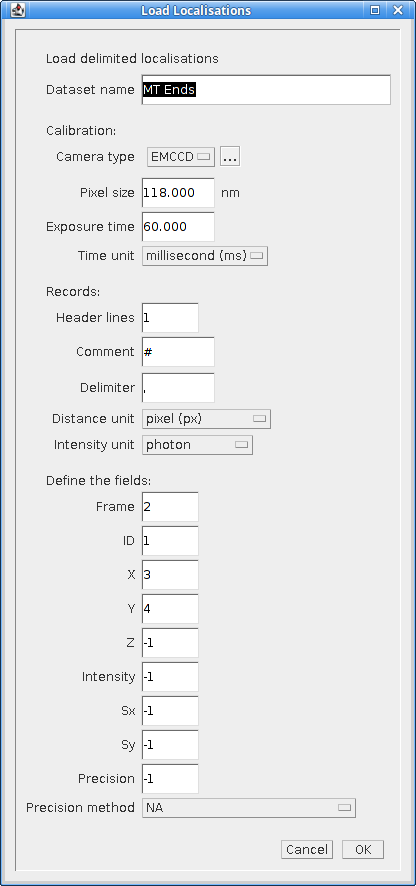
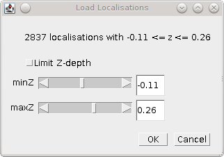
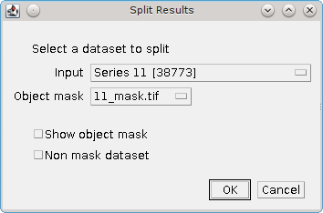
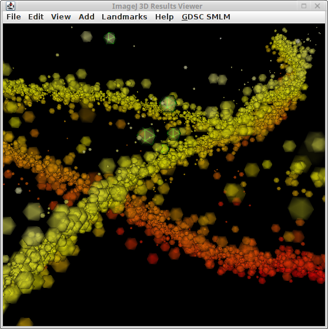
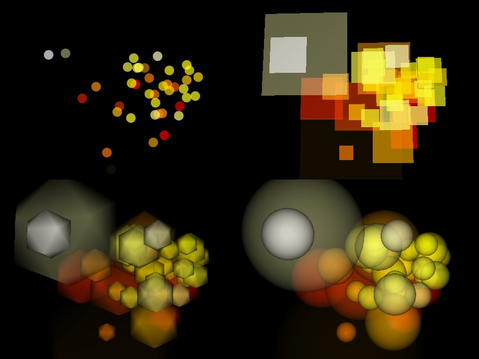

.. index:: ! Results Plugins

Results Plugins
===============

The following plugins allow localisation results to be opened, converted and saved using various formats.

The plugins are described in the following sections using the order presented on the ``Plugins > GDSC SMLM > Results`` menu.

.. index:: ! Results Manager

Results Manager
---------------

The ``Results Manager`` allows loading results to memory and output of results to a table, an image, or to file. Results can be generated in memory by the ``Peak Fit`` plugin (see section :numref:`%s <fitting_plugins:Peak Fit>`) or loaded from a supported file format.

The ``Results Manager`` allows the ``Peak Fit`` plugin to be run in the fastest mode with no output display  (results are saved to memory). The results can then be visualised with different options using the ``Results Manager`` and saved to file. Reconstructed images can be saved using the standard ``ImageJ`` ``File > Save As`` options.

The plugin can be used to convert text results to binary results and vice-versa. Binary results save and load very fast but are not human readable. They are a good option for storing large results sets (10,000 or more localisations) for repeat analysis.

.. index:: Results Manager; Input Options

Input Options
~~~~~~~~~~~~~

Input can be from results in memory or a result file. All the datasets held in memory are shown in the ``Input`` selection list. Choose the ``File`` option to load results from a file. The ``Input file`` can be selected using the ``...`` button to open a file selection dialog. The result file option allows the user to load results that were generated in a previous session.

The plugin can load data generated by the ``Peak Fit`` plugin and saved as results file. It also loads results that have been saved from the ``Peak Fit`` results table to a text file. External file formats are also supported. Currently the following alternative formats are supported:

*   rapidSTORM
*   Nikon NSTORM
*   MicroManager Tagged Spot File (`TSF <https://micro-manager.org/wiki/Tagged_Spot_File_(tsf)_format>`_)

Note: Custom text formats can be loaded into memory using the ``Load Localisations`` plugin (see :numref:`{number}: {name} <results_plugins:Load Localisations>`).

As with all of the SMLM plugins, the ``Results Manager`` is fully supported by the ``ImageJ`` macro recorder. This allows the use of macros to bulk convert many results sets, for example to render images and save them using the ``File > Save As`` command.

.. index:: Image Calibration

Image Calibration
^^^^^^^^^^^^^^^^^

The SMLM plugins require that an image have a calibration to allow certain plugins to function. This calibration includes the pixel pitch, the total gain and the exposure time (as described in section :numref:`{number}: {name} <fitting_plugins:Fitting Calibration>`). Certain file types do not have an image calibration. If the ``Results Manager`` detects that calibration is missing a message is written to the ``ImageJ`` log window and the plugin will present a dialog where the user can enter the missing calibration for the results. This is added to the results and will be saved if using a SMLM file format.

.. index:: Results Manager; Output Options

Output Options
~~~~~~~~~~~~~~

The output options are the same as in the ``Peak Fit`` plugin: image, table, file and memory output. The differences from the ``Peak Fit`` are described below.

.. index:: Table Output

Table Output
^^^^^^^^^^^^

The ``Peak Fit`` plugin presented results as they were computed using an ``ImageJ`` table. This is available using the ``ImageJ`` option.

The ``Interactive`` option uses a dynamic table that offers a view of an existing dataset. This requires the entire results set to be available and so is not an option during fitting. The view can be configured, for example changing the display units, and the dataset changed by deleting items. Changes to the dataset can be saved to memory as the same or a new named dataset.

The table view has interactive features. The column widths can be resized and clicking a column header allows sorting the table by that column. Single items can be selected using a mouse click. Hold the ``Control`` button to select multiple rows or the ``Shift`` key to select a range of rows.

The menu provides the following options:

.. list-table::
   :widths: 15 20 60
   :header-rows: 1

   * - Menu
     - Command
     - Description

   * - Results
     - Save
     - Save the results in the table to a dataset in memory.

       The dataset can be saved to file using the ``Results Manager``.

   * - Results
     - Show Info
     - Show the result information. This displays the results in the ``Summarise Results`` window.

   * - Edit
     - Read-only
     - If **true** then the table cannot be edited. This is the default.

   * - Edit
     - Delete
     - Delete the selected rows from the dataset.

   * - Edit
     - Delete All
     - Delete all the data from the dataset.

   * - Edit
     - Select None
     - Clear the selection.

   * - Edit
     - Select All
     - Select all the data.

   * - Edit
     - Unsort
     - Restore to the default order of the dataset. This is the order shown when the table is first displayed. Use this option to reverse the sort order imposed by a column.

   * - Edit
     - Table Settings
     - Open the settings configuration dialog for the table. See :ref:`interactive table settings <table_interactive_table_settings>` for details.

   * - Source
     - Show Info
     - Print details of the source of the results set to the ``ImageJ`` log window.

   * - Source
     - Show Image
     - Load the image source of the results.

   * - Source
     - Overlay
     - If the results source (i.e. image) is open then overlay the selected results on the image.

       This can be used in combination with sorted columns to quickly visualise spots with certain features, e.g. a low signal-to-noise ratio.

Note that certain menu items have keyboard short cuts.

The following table settings can be configured:

.. _table_interactive_table_settings:
.. list-table::
   :widths: 30 60
   :header-rows: 1

   * - Parameter
     - Description

   * - Table distance unit
     - The distance unit.

   * - Table intensity unit
     - The intensity unit.

   * - Table angle unit
     - The angle unit.

   * - Table show fitting data
     - Show additional data from the fitting performed by ``Peak Fit``.

   * - Table show noise data
     - Show the noise and signal-to-noise ratio.

   * - Table show precision
     - Show the localisation precision data associated with the results.

       If the results do not have precision data it is computed using the Mortensen formula for least squares estimation (see :numref:`%s <localisation_precision:Localisation Precision for Least Squares Fitting>`). If this is not possible zero is shown.

   * - Table precision
     - Configures the number of significant digits for display in the table. Set to zero to show the full precision of the data.

   * - Table show counter
     - Show a column with the ID of the result. This matches the default order of the dataset.

.. index:: Image Output

Image Output
^^^^^^^^^^^^

One additional image parameter is available for ``Image`` output if the extra options are enabled using the ``Shift`` key:

.. list-table::
   :widths: 20 80
   :header-rows: 1

   * - Parameter
     - Description

   * - Image Window
     - Applies to output images.

       The ``Image Window`` specifies the number of consecutive frames from the results that should be plotted on a single ``ImageJ`` stack frame.

       By default this parameter is zero. All localisations are plotted on the same output frame.

       If this is set to 1 then each frame will be output to a new frame in the output image. Use this option to allow the input and output images to be directly compared frame-by-frame.

       If set higher than 1 then N frames will be collated together into one output image. Use this option to produce a time-slice stack through your results at a specified collation interval

       This option is not available during live fitting since the result must be sorted. This is not possible with multi-threaded code as the results can appear out of order.

.. index:: File Output

File Output
^^^^^^^^^^^

The only difference is that the file output requires that the name of the output file be provided. In the ``Peak Fit`` plugin only the results directory was specified and the filename was taken from the image. Allowing the full filename to be specified provides greater flexibility in saving results.

.. index:: ! Batch Load Results

Batch Load Results
------------------

Allows multiple files to be loaded into memory. A file selection dialog is opened where multiple files can be selected from the same directory. Hold the ``Control`` key to select multiple files from the dialog.

The plugin will load each file in turn using the same file input options as the ``Results Manager`` plugin. If the file format is not recognised then an error message is displayed. If the file is recognised then a calibration check is performed and if calibration missing a dialog will be shown where the calibration can be entered.

The results set for each file is named using the metadata in the results file, or if missing, a dialog is presented where the name can be entered.

.. index:: ! Batch Save Results

Batch Save Results
------------------

Allows multiple results sets to be saved to file. Presents a dialog where the results to be saved can be selected. If results are selected a dialog is presented where the file format can be chosen and the output directory. Extra options for the file format can be specified using the ``...`` button.

Results are saved to a file named using the dataset name and the appropriate suffix for the file format. A message is written to the ``ImageJ`` log for each output file.

.. index:: ! Summarise Results

Summarise Results
-----------------

Shows a summary of all the results currently in memory.

The summary table shows the name of the results dataset and then the following statistics:

*   The number of results
*   The size of the results in memory
*   The bounds of the results (minimum and maximum ``x`` and ``y`` coordinates of the source)
*   The image calibration
*   The average, median, minimum and maximum of the precision and signal-to-noise ratio (SNR)

.. index:: Summary Data Histograms

Summary Data Histograms
~~~~~~~~~~~~~~~~~~~~~~~

The table only shows summary statistics. Double-click on a row in the table to open a dialog where histograms of the data can be constructed. The data for the histograms can be chosen and the number of histogram bins. Set to zero to auto-scale the bin widths. Outliers can be removed from the data before plotting to reduce the histogram width. This is useful for plotting the localisation precision which may have a long tail.

.. index:: ! Clear Memory Results

Clear Memory Results
--------------------

Removes all the results currently stored in memory. Presents a confirmation dialog showing the number of results that will be removed if the user selects ``OK``.

.. index:: ! Clear Memory Results Multi

Clear Memory Results (Multi)
----------------------------

Removes selected results currently stored in memory. Presents a dialog where the results to be removed can be selected. Then presents a confirmation dialog showing the number of results that will be removed if the user selects ``OK``.

.. index:: ! Rename Results

Rename Results
--------------

Allows the name of a results set held in memory to be changed.

Typically new results are named using the name of the input image or input results set appended with details of how the new results were generated, e.g. the name of the fitting engine or in the case of tracing analysis ``Traced``. The name is associated with the results set and used is analysis plugins or when reconstructing super-resolution images. It is also saved in the SMLM file format.

The names can be updated using the
``Rename Results``
plugin. The plugin presents a dialog with a single large text field. All the existing names are entered on the left side of the equals (``=``) symbol. The new name will be entered on the right side of the equals symbol followed by a semi-colon (``;``). The semi-colon is needed to support this plugin within the ``ImageJ`` macro language.

An example of two results sets, ``NewResults`` and ``AnalysisResults``, is shown below::

    NewResults = NewResults;
    AnalysisResults = AnalysisResults;

When the plugin is run all the target results sets are identified using the names on the left. Any missing names are ignored allowing the user to delete many entries that should be unchanged. If the left and right side are identical then the name will be unchanged. Any invalid names not corresponding to an existing dataset cause an error to be displayed.

The destination names are then checked, any duplicates among the destination names cause an error to be displayed. If no errors occurred then the datasets are renamed. Renaming may cause an existing dataset to be over-written if that dataset is not also renamed. This is allowed behaviour as it may be desirable to over-write a set of named results with the latest analysis results.

The following would rename ``NewResults`` to ``BestResults``. ``AnalysisResults`` would be unchanged::

    NewResults = BestResults;

The following would over-write ``AnalysisResults`` leaving just one results set in memory::

    NewResults = AnalysisResults;

The following would rename ``NewResults`` to ``AnalysisResults`` and ``AnalysisResults`` to ``OldResults``::

    NewResults = AnalysisResults;
    AnalysisResults = OldResults;

.. index:: ! Resequence Results

Resequence Results
------------------

Allows the frame number of results to be rebuilt assuming a repeating pattern of data and non-data frames.

The ``Peak Fit`` plugin will fit a stack of images using a continuous frame number starting at 1. However this image may have been extracted from a larger image with interlaced data or been taken with a custom image acquisition workflow. In this case the frame number will be an incorrect representation of time. This will affect any analysis using the time gaps between localisations.

For example if every 20 images is a white light image and this was removed before fitting the frame number can be restored to add blank frames at 1, 21, 41, etc. Or the image may represent 1000 frames of imaging interspersed with 5 second gaps. Resequencing the results can put an appropriate gap between localisations in frame 1000 and 1001.

This plugin can resequences the results using the regular repeat of the original image. The following parameters are required:

.. list-table::
   :widths: 20 80
   :header-rows: 1

   * - Parameter
     - Description

   * - Input
     - The results to process. Results will be directly updated (and there is no ``Undo`` operation).

   * - Start
     - The first frame containing data in the original image.

   * - Block
     - The number of continuous frames that contain data in the original image.

   * - Skip
     - The number of continuous frames to skip before the next block of data in the original image.

   * - Log mapping
     - Write to the ``ImageJ`` log the mapping between the current and the new frame number.

It is not possible to undo the ``Resequence Results`` plugin. Before running the plugin you can save the results to file using the ``Results Manager`` . These can be reloaded if the resequence operation produced an incorrect frame-by-frame mapping.

Note: If the source data is interlaced it can be directly handled by the ``Peak Fit`` plugin using the extra options (hold the ``Shift`` or ``Alt`` key down when running the plugin). There is no need to extract all the relevant data frames from the source image before running ``Peak Fit``.

.. index:: ! Calibrate Results

Calibrate Results
-----------------

Allows results held in memory to be calibrated (e.g. the pixel pitch and camera gain can be adjusted). Note that the raw data held in memory is stored using pixel units and image frames. Many of the plugins require calibrated units such as nanometers, micrometres, milliseconds and photons. Thus it is possible to store a calibration within the results. This calibration is added automatically when the results are generated inside the SMLM plugins. However the results may be loaded from file where a calibration is not present or the calibration was incorrect when the results were generated. This plugin allows the calibration to be updated.

When the plugin is run it presents a selection of the current results that are held in memory. If no results are available then an error is displayed. The user must select the results to update.

The following options are then available:

.. list-table::
   :widths: 20 80
   :header-rows: 1

   * - Parameter
     - Description

   * - Update all linked results
     - When new results are created from existing results they use the calibration from the source results. Select this to update all the results in memory that share the same calibration.

       If unselected then the other results will remain unchanged.

   * - Camera Type
     - The type of camera. Additional details about the camera can be entered by clicking the ``...`` button.

       See section :numref:`{number}: {name} <fitting_plugins:Camera Type>`.

   * - Calibration (nm/px)
     - The size of the pixels in nanometers.

   * - Exposure time (ms)
     - The exposure time for a single frame in milliseconds.

Note that not all the calibration parameters have to be configured. Not all the plugins require every parameter. The most common parameters used for analysis are ``Calibration`` and ``Exposure time``.

.. index:: ! Update Results Bounds

Update Results Bounds
---------------------

Allows the bounds of the results to be updated. The bounds should correspond to the region used for the analysis that generated the results. The bound are used in many plugins, for example in the reconstruction of super resolution images.

The bounds should contain the minimum and maximum x and y coordinates. If created from the data this may be smaller than the actual bounds used to generate the results. For example if the data was loaded from file as raw coordinates with no metadata it is useful to define the bounds of the image frame used to acquire the data.

When the plugin is run it presents a selection of the current results that are held in memory. If no results are available then an error is displayed. The user must select the results to update.

The plugin then presents a dialog where the bounds can be updated. The auto-bounds as defined by the minimum and maximum coordinates are computed and displayed for reference. The current bounds if available are shown in the dialog. These can be updated. The new bounds will be the union of the input bounds and the auto-bounds. This ensures that all the data is within the bounds.

.. index:: ! Convert Results

Convert Results
---------------

Allows results held in memory to be converted to different units. For example this can be used to correct data loaded from file. It is not possible to convert results that do not have a calibration.

When the plugin is run it presents a selection of the current results that are held in memory. If no results are available then an error is displayed. The user must select the results to update.

The plugin then presents a dialog where the current units for the results are shown. Calibration values are also shown for distance and intensity. The units can be changed and the calibration updated if required. If the ``OK`` button is pressed then the results are converted if the units have been changed by linearly scaling the data by the appropriate conversion factor. The results calibration will be updated to the new units (if changed) and the new calibration values.

.. index:: ! Show Results Header

Show Results Header
-------------------

Shows the header information from any supported localisation results file format. This is particularly useful for reading the header from GDSC SMLM binary format results files.

When the plugin is run the user is presented with a dialog where the results file can be selected. The ``Filename`` field ``...`` button can be clicked to open a file selection window.

When the plugin runs it will attempt to open the selected file and read it as a localisation results file. The header will be extracted and reported to the ``ImageJ`` log window.

If the ``Raw`` option is selected then the header will be written directly. Note that the ``ImageJ`` log window does not show tab characters. However if a line containing tab characters is copied from the log window and pasted into a text editor these characters are maintained.

If the ``Raw`` option is not selected then the plugin will attempt to extract the standard information stored in a GDSC SMLM results file header:

.. list-table::
   :widths: 20 80
   :header-rows: 1

   * - Field
     - Description

   * - Format
     - The GDSC SMLM file format code.

   * - Name
     - The name of the results.

   * - Bounds
     - The bounds of the results data (minx, miny, width, height).

   * - Source
     - The source of the localisation data, for example details of the original image.

   * - Calibration
     - The calibration (nm/pixel, exposure time, etc).

   * - PSF
     - The point spread function (PSF) used to model the data.

   * - Configuration
     - The fitting configuration used to produce the results.

.. index:: ! Overlay Results

Overlay Results
---------------

Draws an overlay on an image using all the localisations from a results dataset. Only the localisations from the current frame are drawn and the overlay updates dynamically as the user changes the current image slice. This allows visualisation of the spot data that has been successfully captured in a results dataset, e.g. has fitting successfully identified spots that the user would select manually.

When the plugin is run it scans all the results sets held in memory. Each results set has a source for the results; if the source is an image that is currently open then the results set is available for selection. If no results sets have an open source image then an error is shown. Otherwise the list of available results sets is presented to the user in a dialog.

All the localisations from the selected results set for the current frame set are overlaid on the source image. When the image is updated to a new frame the overlay will be updated.

The ``Show table`` option can be used to present a results table of the localisations below the image. This is dynamically updated with the current frame. The table has interactive functionality, for example a double mouse-click on a result entry will draw an overlay on the image of just that localisation result. For more details see section :ref:`fitting_plugins:Interactive Results Table`.

The ``Overlay Results`` dialog is non-blocking allowing the user to interact with ``ImageJ`` as normal. However if the results are cleared from memory or the image is no longer available then the dialog list will be out-of-date and an error is logged to the ``ImageJ`` log window and shown on the dialog. Restarting the plugin will refresh the list of available results.

.. index:: ! load localisations

Load Localisations
------------------

Loads a set of localisations from a delimited text file. The file format is specified during runtime allowing any delimited localisation data to be loaded.

When the plugin is run the user is prompted to select a text file containing delimited localisation data. The plugin then presents a dialog where the file format can be defined (:numref:`Figure %s <fig_load_localisations_dialog>`).

.. _fig_load_localisations_dialog:

    Load localisations dialog

The plugin requires that the dataset be given a name. This is used to store the dataset in memory. If the name matches an existing dataset in memory then it will be replaced. Note: The current datasets held in memory can be listed using the ``Summarise Results`` plugin.

The following sections describe the parameters required to define the file format.

.. index:: Data Calibration

Data Calibration
~~~~~~~~~~~~~~~~

The GDSC SMLM plugins store localisation data assumed to be obtained from a microscope camera. The data is stored using distances in pixels and intensity in photons. The units can be converted to nanometres (nm) and camera counts using a calibration stored with the dataset. This conversion is required for many analysis plugins.

The plugin requires the following calibration details for the dataset:

.. list-table::
   :widths: 20 80
   :header-rows: 1

   * - Parameter
     - Description

   * - Camera type
     - The type of camera used to acquire the image. Additional details about the camera can be entered by clicking the ``...`` button.

       See section :numref:`{number}: {name} <fitting_plugins:Camera Type>`.

   * - Pixel size
     - The size (in nm) of each pixel. This depends on the microscope magnification.

   * - Exposure time
     - The duration of each frame from the camera.

   * - Time unit
     - The unit for the ``Exposure time``.

Additional calibration can be configured depending on the ``Camera type``. For ``EMCCD`` and ``CCD`` cameras the following can be configured:

.. list-table::
   :widths: 20 80
   :header-rows: 1

   * - Parameter
     - Description

   * - Camera bias
     - The zero-offset bias added to each pixel by the camera.

   * - Gain
     - This is the total gain the camera applied to convert captured photons to output pixel counts.

   * - Read noise
     - The read noise of the camera.

For ``sCMOS`` cameras a camera model must be loaded. This contains the bias, gain and read noise for each pixel in the camera. A dialog is presented allowing the model to be selected from the list of known camera models.

Note: sCMOS cameras read each pixel using individual circuits. This is in contrast to CCD cameras which use the same circuits to read every pixel allowing a global bias, gain and read noise.

.. index:: Localisation Records

Localisation Records
~~~~~~~~~~~~~~~~~~~~

Each line of the file is read as a localisation record of delimited fields. Lines in the file can be ignored, for example if they are meta-data describing the records. The plugin requires the following file-format details:

.. list-table::
   :widths: 20 80
   :header-rows: 1

   * - Parameter
     - Description

   * - Header lines
     - The initial number of lines to ignore. For example a file header of column names.

   * - Comment
     - Any line starting with this sequence of characters is ignored.

   * - Delimiter
     - Defines the delimiter of the fields. Regular expression are supported and the default is white space (``\s+``).

   * - Distance unit
     - The distance units of the localisation records. Records will be converted to the GDSC SMLM format if necessary using the ``Pixel size`` parameter.

   * - Intensity unit
     - The intensity units of the localisation records. Records will be converted to the GDSC SMLM format if necessary using the ``Gain`` parameter.

..
  No index

Fields
~~~~~~

The fields must be defined so the plugin knows how to read the data. Note that the field index is zero-based. Not all fields are required and if a field does not exist then the index can be set to a negative value. The plugin can load the following data from each record:

.. list-table::
   :widths: 15 40 15 10 15
   :header-rows: 1

   * - Field
     - Description
     - Type
     - Required
     - Default

   * - Frame
     - The time frame.
     - Integer
     -
     - 0

   * - ID
     - The identifier for the localisation. This can be used to group localisations of the same molecule.
     - Integer
     -
     - 0

   * - Category
     - The category for the localisation. This can be used to sub-classify localisations of the same molecule, for example diffusion states.
     - Integer
     -
     - 0

   * - X
     - The X coordinate.
     - Real
     - Y
     -

   * - Y
     - The Y coordinate.
     - Real
     - Y
     -

   * - Z
     - The Z coordinate.
     - Real
     -
     - 0

   * - Intensity
     - The localisation intensity. If absent this will be set to 1.
     - Real
     -
     - 1
       count

   * - Sx
     - The standard deviation of the Gaussian point spread function in the X-dimension.
     - Real
     -
     - 1
       pixel

   * - Sy
     - The standard deviation of the Gaussian point spread function in the Y-dimension.
     - Real
     -
     - 1
       pixel

   * - Precision
     - The uncertainty of the localisation position is the standard deviation of the Gaussian probability distribution of the actual position given the coordinates. It is commonly known as the localisation precision and is a measure of how close the coordinates are to the actual position.

       This is the square root of the arithmetic mean of the uncertainty variance in the X and Y dimensions:

       :math:`\sigma=\sqrt{\frac{\sigma_{x}^2 + \sigma_{y}^2}{2}}`

       Note that although the literature commonly presents the ``Precision`` in nm the units must match the ``Distance unit`` parameter.
     - Real
     -
     - NaN

If any field does not exist then it will be set to the default value. Note that the GDSC SMLM localisation model is based around approximating the point spread function (PSF) of a microscope using a 2D Gaussian. If the localisation results have been produced using another PSF model then either the ``Sx`` and ``Sy`` fields can be omitted or the PSF data should be converted to a Gaussian approximation before loading the data.

..
  No index

Other Parameters
~~~~~~~~~~~~~~~~

.. list-table::
   :widths: 20 80
   :header-rows: 1

   * - Parameter
     - Description

   * - Precision method
     - The method used to compute the precision. This is stored with the results.

..
  No index

Errors
~~~~~~

If any errors occur when parsing a record then the first error will be recorded to the ``ImageJ`` log. Subsequent errors are counted silently and the plugin reports the count of total errors at the end. Errors typically occur when the fields or header format have been defined incorrectly and so should be corrected.

..
  No index

Unsupported File Formats
~~~~~~~~~~~~~~~~~~~~~~~~

The ``Load Localisations`` plugin is designed to be generic so it can handle a wide variety of data. If you have data in a format that cannot be loaded then please contact us with an example. This is likely to occur if the units are not supported, e.g. distance in metres.

..
  No index

Z-Depth Filtering
~~~~~~~~~~~~~~~~~

When all the localisation records have been processed the plugin can optionally filter the localisations by z-depth. This allows loading a slice of 3D data for processing within 2D analysis. This feature is disabled by setting the Z-dimension field index to -1. In this case any 3D data will be loaded as a 2D projection.

If a range of z-depths is available the plugin presents a dialog allowing the user to select a subset of localisations (:numref:`Figure %s <fig_zdepth_filter_dialog>`). The dialog shows the minimum and maximum limits of the z coordinates and provides an option to limit the z-depth. The limits can then be adjusted using the sliders.

.. _fig_zdepth_filter_dialog:

    Z-depth filtering dialog

Thus the ``Load localisations`` plugin can be used to load selected slices of data for analysis.

If the user requires a subset of the data in the XY dimensions then this can be achieved using the ``Crop Results`` or ``ROI Crop Results`` plugins once the results have been loaded (see sections :numref:`%s <results_plugins:Crop Results>` and :numref:`%s <results_plugins:ROI Crop Results>`).

.. index:: ! Trace Exporter

Trace Exporter
--------------

Export traced datasets to file. A traced dataset is identified using the Id field on the results from each dataset. Each Id is a grouping of results from the dataset. The Id field is typically written by an analysis plugin such as ``Trace Molecules``.

When the ``Trace Exporter`` is run a dialog is presented allowing the export to be configured. If no traced results are available an error is shown. The exporter assumes that each grouping of results with the same Id corresponds to a single molecule traced over a period of time. The following parameters can be set:

.. list-table::
   :widths: 20 80
   :header-rows: 1

   * - Parameter
     - Description

   * - Directory
     - The output directory.

   * - Min length
     - The minimum length of each trace. Any trace shorter than this will not be exported.

   * - Max length
     - The maximum length of each trace. Any trace longer than this will not be split into sub-traces. This option can be used to increase the number of short traces.

   * - Max jump
     - The maximum jump allowed within a trace. If a jump between frames is larger than this then the trace will be split into two sub-traces and exported with a unique Id.

   * - Wobble
     - Add a random Gaussian deviation to the coordinates. This can be used to add randomness to simulated data.

   * - Format
     - Select the output format (see :numref:`%s <results_plugins:Available Formats>`).

   * - Histogram trace lengths
     - Plot a histogram of the length of traces for each exported dataset.

.. index:: Available Formats

Available Formats
~~~~~~~~~~~~~~~~~

Spot-On
^^^^^^^

The `Spot-On CSV file format <https://spoton.berkeley.edu/SPTGUI/docs/latest#input-formats>`_. This is a simple CSV format containing the localisation positions in time and space (XY) for each trace. The format has the following columns:

.. list-table::
   :widths: 20 80
   :header-rows: 1

   * - Column
     - Description

   * - Frame
     - Frame number.

   * - T
     - Time (in seconds).

   * - Trajectory
     - The trace Id.

   * - X
     - The x position (in |micro|\ m).

   * - Y
     - The y position (in |micro|\ m).

anaDDA Localisations
^^^^^^^^^^^^^^^^^^^^

The `anaDDA <https://github.com/HohlbeinLab/anaDDA>`_ localisations file format. This is a Matlab matrix file consisting of 5 columns and `n` rows where `n` is the number of localisations. The format has the following columns:

.. list-table::
   :widths: 20 80
   :header-rows: 1

   * - Column
     - Description

   * - X
     - The x position (in |micro|\ m).

   * - Y
     - The y position (in |micro|\ m).

   * - Frame
     - Frame number.

   * - ID
     - The track Id.

   * - Time
     - Frame time (in seconds). This is the length of the frame (i.e. exposure time). It will be the same for the entire set of localisations.

The file uses Matlab's Mat5 binary format with the extension ``.mat``. The file has a single matrix named ``tracks`` of `n` rows by 5 columns of type double. It can be loaded in to Matlab using::

    load('/path/to/file.mat')

This will create the variable ``tracks`` containing the localisation data. To avoid overwriting any existing variable named ``tracks`` load the data into a named structure (e.g. ``input``) and reference the matrix using::

    input = load('/path/to/file.mat')
    input.tracks

vbSPT Localisations
^^^^^^^^^^^^^^^^^^^

The `vbSPT <https://sourceforge.net/projects/vbspt/>`_ localisations file format. This is a Matlab matrix file containing a cell array where each element, representing a trajectory, is a matrix
where the rows define the coordinates in two or three dimensions at each timestep. Each matrix entry of the cell array has the following columns:

.. list-table::
   :widths: 20 80
   :header-rows: 1

   * - Column
     - Description

   * - X
     - The x position (in |micro|\ m).

   * - Y
     - The y position (in |micro|\ m).

   * - Z
     - The z position (in |micro|\ m). Only included if the results set contains non-zero z coordinates.

   * - Frame
     - The frame. This is not specified by the vbSPT format. It is added to the required XYZ data to allow localisations to be correctly identified and exported following analysis by vbSPT. It is ignored by vbSPT analysis which uses the first 2 or 3 columns only.

The file uses Matlab's Mat5 binary format with the extension ``.mat``. The file has a single cell array named ``tracks`` of 1 row by `n` columns, where `n` is the number of tracks. It can be specified as the input within the ``vbSPT`` run input file using::

    % Inputs
    inputfile = '/path/to/file.mat';
    trajectoryfield = 'tracks';

The cell contents can be displayed for verification using::

    % Example loading and display of track data from the first 2 cells
    input = load(inputfile, 'tracks');
    celldisp(input.tracks(1,1:2));

NOBIAS Localisations
^^^^^^^^^^^^^^^^^^^^

The `NOBIAS <https://github.com/BiteenMatlab/NOBIAS>`_ localisations file format. This is a Matlab matrix file containing the track IDs and jump steps in the X and Y dimensions.

The file uses Matlab's Mat5 binary format with the extension ``.mat``. The file has a struct named ``data``. This has an array named ``TrID`` of `n` rows by 1 column, where `n` is the number of jump steps, representing the track IDs. The export uses the original track IDs from the tracks, not a sequence starting from 1. A second array named ``obs`` of 2 by `n` columns represents the track jump sizes in pixels. To allow motion blur correction, a third array named ``obs_corr`` matching the size of ``obs`` is provided. This contains the product of consecutive steps in each dimension, e.g. x[i]*x[i+1] for all i+1 < n. The value at the end of the array for each dimension is `nan`.

Note: The apparent transpose of columns and rows for the two named fields matches the example data format provided by NOBIAS. The ``TrID`` matrix is used as a 1D array and columns*rows must equal `n`.

If the results are calibrated then a second struct called 'Params' is added to the file containing two named fields: 'frametime' is the frame exposure time in seconds; and 'pixelsize' is the camera pixel size in |micro|\ m.

The cell contents can be displayed for verification using::

    % Example loading and display of the first 3 jump steps
    input = load('/path/to/file.mat', 'data');
    display(input.data.obs(1:2,1:3));
    display(input.data.TrID(1:3,1));
    display(input.Params);

Execute NOBIAS HDP-HMM Module using::

    out = NOBIAS(input.data,'pixelsize',input.Params.pixelsize,'frametime',Params.frametime)

.. index:: Exporting Datasets

Exporting Datasets
~~~~~~~~~~~~~~~~~~

When the export parameters have been chosen the plugin presents a selection dialog of all the results sets that are available. When the results have been selected they are exported to a file in the output directory named using the results set name and the appropriate file extension.

.. index:: ! Filter Results

Filter Results
--------------

Filters a set of localisations using various criteria.

Requires the fitting results to be loaded into memory. When the plugin is run the user is presented with a selection dialog of the available results. The user can select the results to filter.

The plugin analyses the selected results and computes limits for each of the filters based on the data. If the results could not be analysed for a filter then the filter limits will be set to zero. A second dialog is then shown that allows the filters to be adjusted. The following filters are available:

.. list-table::
   :widths: 20 80
   :header-rows: 1

   * - Filter
     - Description

   * - Max drift
     - The maximum distance the fitted centre is allowed to be from the original maxima location.

   * - Min Signal
     - The minimum signal strength.

   * - Min SNR
     - The minimum signal-to-noise ratio.

   * - Min Precision
     - The minimum precision.

   * - Min Width
     - The minimum width for a localisation. Width assumes a Gaussian 2D PSF and using the standard deviation of the Gaussian.

   * - Max Width
     - The maximum width for a localisation. Width assumes a Gaussian 2D PSF and using the standard deviation of the Gaussian.

   * - Mask
     - Select an image to use as a mask. Only localisations that occur in non-zero mask pixels will be included in the results. The localisation coordinates are mapped to the width and height of the mask based on the bounds of the results dataset. For example to map the x coordinate:

       :math:`x_m = \frac{x-\mathit{bounds}_{\mathit{origin}}}{\mathit{bounds}_{\mathit{width}}} \times\mathit{mask}_{\mathit{width}}`

       If the mask is a stack then the frame of the localisation result will be used to select the mask slice.

If any parameter is set to zero it will be ignored.

The results of filtering are saved to memory with the same name and the ``Filtered`` suffix.

.. index:: ! Crop Results

Crop Results
------------

Filters a set of localisations using a 2D bounding rectangle.

Requires the fitting results to be loaded into memory. When the plugin is run the user is presented with a selection dialog of the available results. The user can select the results to crop.

The plugin then computes the 2D data bounds of the selected results and presents options for cropping the data using a bounding rectangle.

..
  No index

Defining the crop
~~~~~~~~~~~~~~~~~

The bounding rectangle can be defined in multiple ways. If more than one bounding rectangle is defined then the final bounding rectangle is the intersection (smallest overlap) of all the rectangles. The following bounding rectangles can be defined:

*   Border: The current data bounds of the results is reduced by a defined border
*   Region: A region is defined using an origin, width and height
*   ROI: A rectangular ROI currently displayed on an image is scaled to the dimensions of the data bounds

Note that regions are defined using pixel units.

Parameters
~~~~~~~~~~

The following parameters are available:

.. list-table::
   :widths: 20 80
   :header-rows: 1

   * - Parameter
     - Description

   * - Border
     - The border used to reduce the current data bounds. Set to zero to ignore.

   * - Select region
     - Select this option to construct a region.

   * - X
     - The region X origin.

   * - Y
     - The region Y origin.

   * - Width
     - The region width.

   * - Height
     - The region height.

   * - Use ROI
     - Select this option to construct a region by scaling an area ROI from an image. This option is only shown if an open image contains an area ROI.

   * - Image
     - Select the image with the area ROI.

   * - Name option
     - Select the naming option for the cropped results:

       * ``Name``: Specify the name of the output results.
       * ``Suffix``: Use the name of the input results plus a suffix.
       * ``Sequence``: Use the name of the input results plus a suffix and a counter. The counter will increment every time the plugin is executed.

       The selected option is configured using the ``...`` button.

   * - Preserve bounds
     - If **true** the bounds of the source results will be preserved as the bounds of the cropped results. The default is to recompute the bounds. This option can be used to allow the cropped results to be rendered with the original bounds to facilitate comparison with the original image.

   * - Reset origin
     - If **true** the bounds and the localisations will be translated so the origin is (0,0). This option is not used when ``Preserve bounds`` is set to ``true``.

Note that the ROI method scales the ROI from the image to the current data bounds (width and height) of the selected results. If the ROI is on an image that does not match the width/height ratio of the data bounds then the scaling will be different in the X and Y dimensions. For the best results it is recommended to construct a super-resolution image of the target dataset using the ``Results Manager``. An ROI can then be drawn on the super-resolution image covering the desired results. This ensures the rectangle shape of the source image and the target dataset are identical.

.. index:: ! ROI Crop Results

ROI Crop Results
----------------

Filters a set of localisations using any ``ImageJ`` region of interest (ROI).

The region to crop is defined using a ROI currently displayed on an image. If no images have an area ROI then an error message is shown. Otherwise the user is presented with a selection dialog of the available results. The user can select the results to crop and is then presented with a dialog to select the ROI.

.. list-table::
   :widths: 20 80
   :header-rows: 1

   * - Parameter
     - Description

   * - Image
     - Select the image with the area ROI.

   * - Name option
     - Select the naming option for the cropped results.

       These options are the same as the ``Crop Results`` plugin (see section :numref:`%s <results_plugins:Crop Results>`).

   * - Preserve bounds
     - If **true** the bounds of the source results will be preserved as the bounds of the cropped results. The default is to recompute the bounds. This option can be used to allow the cropped results to be rendered with the original bounds to facilitate comparison with the original image.

When the plugin is executed the localisation coordinates are mapped from the bounds of the dataset to the bounds of the image containing the ROI. For example to map the x coordinate:

.. math::

    x_m = \frac{x-\mathit{bounds}_{\mathit{origin}}}{\mathit{bounds}_{\mathit{width}}} \times\mathit{image}_{\mathit{width}}

An example method to create the ROI is to use the ``Results Manager`` to construct a super-resolution image of the dataset. The region can be marked using any of the ``ImageJ`` ROI tools to select the localisations of interest.

.. index:: Composite ROIs

Composite ROIs
~~~~~~~~~~~~~~

The plugin will support composite ROIs. This is when multiple regions are marked on the image when holding the shift key. This feature can for example be used to draw around cells of interest on a white light image of the sample. The ``ROI Crop Results`` plugin would then extract all the localisations inside the marked cells.

.. index:: ! Free Filter Results

Free Filter Results
-------------------

Filters a set of localisations using various criteria.

Requires the fitting results to be loaded into memory. When the plugin is run the user is presented with a selection dialog of the available results. The user can select the results to filter.

The dialog also contains a text area. This is used to construct filters using eXtensible Markup Language (XML). A set of example filters can be shown by clicking on the ``Show demo filters`` checkbox. This will record the available filters to the ``ImageJ`` log. Note: To see the filters and copy them to the clipboard as examples you will first have to cancel the plugin dialog as it blocks other ``ImageJ`` windows.

The following filters are available:

.. list-table::
   :widths: 20 80
   :header-rows: 1

   * - Filter
     - Description

   * - WidthFilter
     - Filters the results using an upper width factor. Width is relative to the initial peak width.

   * - WidthFilter2
     - Filter the results using a lower and upper width factor. Width is relative to the initial peak width.

   * - XyWidthFilter
     - Filters the results using an upper width factor on the X and Y widths. Width is relative to the initial peak width.

   * - XyWidthFilter2
     - Filter the results using a lower and upper width factor on the X and Y widths. Width is relative to the initial peak width.

   * - SbrFilter
     - Filter results using a lower signal-to-background ratio (SBR) threshold.

   * - ShiftFilter
     - Filter results using a shift factor. X/Y shift is relative to the initial peak width.

   * - EShiftFilter
     - Filter results using a Euclidian shift factor. Shift is relative to the initial peak width.

   * - SignalFilter
     - Filter results using a lower signal threshold. The threshold is applied in photons.

   * - SnrFilter
     - Filter results using a lower signal-to-noise ratio (SNR) threshold.

   * - AnrFilter
     - Filter results using a lower amplitude-to-noise ratio (ANR) threshold.

   * - PrecisionFilter
     - Filter the results using an upper precision threshold. The estimated noise is used to set the background noise (see :numref:`localisation_precision:Localisation Precision`).

   * - PrecisionFilter2
     - As per the ``PrecisionFilter`` but the estimated noise is used to set the background noise (see :numref:`localisation_precision:Localisation Precision`).

   * - SnrHysteresisFilter
     - Filter results using a signal-to-noise ratio (SNR) threshold. Any results above the upper SNR limit are included. Any results below the lower SNR limit are excluded. Any results between the limits (candidates) are included only if they can be traced through time, potentially via other candidates, to a valid result.

       The distance used for tracing is the search distance multiplied by the average precision of the candidates.

   * - PrecisionHysteresisFilter
     - Filter results using a precision threshold. Any results below the lower precision limit are included. Any results above the upper precision limit are excluded. Any results between the limits (candidates) are included only if they can be traced through time, potentially via other candidates, to a valid result.

       The distance used for tracing is the search distance multiplied by the average precision of the candidates.

   * - TraceFilter
     - Filter results that can be traced over time frames. The trace distance is specified in pixels and the time threshold in frames.

   * - CoordinateFilter
     - Filter results using a coordinate range. This can be used to crop the results to a rectangular region, for example when batch processing results subsets in a macro.

   * - MultiFilter
     - Filter results using multiple thresholds: Signal, SNR, width, shift, Eclidian shift, precision and z-depth. The fitted background is used to set the background noise for the precision see :numref:`localisation_precision:Localisation Precision`).

   * - MultiFilter2
     - As per the ``MultiFilter`` but the estimated noise is used to set the background noise for the precision (see :numref:`localisation_precision:Localisation Precision`).

   * - MultiHystersisFilter
     - Filter results using multiple thresholds: Signal, SNR, width, shift, and precision. The fitted background is used to set the background noise for the precision see :numref:`localisation_precision:Localisation Precision`). Any results within the strict limits are included. Any results outside the weak limits are excluded. Any results between the limits (candidates) are included only if they can be traced through time, potentially via other candidates, to a valid result.

       The distance used for tracing is the search distance multiplied by the average precision of the candidates.

   * - MultiHystersisFilter2
     - As per the ``MultiHystersisFilter`` but the estimated noise is used to set the background noise for the precision (see :numref:`localisation_precision:Localisation Precision`).

   * - AndFilter
     - Filter results using the combination of two filters. Results must pass both filters.

   * - OrFilter
     - Filter results using the combination of two filters. Results can pass either filter.

The ``Free Filter`` plugin provides a powerful tool for customising the subset of results that are extracted. For example it is possible to extract only the results that have either (1) a signal-to-noise ratio above 10 and a precision of less than 30nm; or (2) that can be traced to another localisation within 0.5 pixels and 1 time frame using the following combined filter:

.. code-block:: xml

    <OrFilter>
      <filter1 class="AndFilter">
        <filter1 class="SNRFilter" snr="10.0"/>
        <filter2 class="PrecisionFilter" precision="30.0"/>
      </filter1>
      <filter2 class="TraceFilter" d="0.5" t="1"/>
    </OrFilter>

Note how the combined filters require that the contained filters are specified in a ``<filter>`` tag and the type of filter is specified using the ``class`` attribute. The filter parameters are specified using attributes.

When the filter is run on the selected data a new dataset is created with the suffix ``Free Filtered``.

.. index:: ! Filter Molecules

Filter Molecules
----------------

Filters a set of molecules using various criteria. Molecules are results that have been assigned an identifier (ID). For example unique IDs can be used to assign localisations to moving molecules that have been traced through a series of frames.

When the plugin is run the user is presented with a dialog allowing the results set and the filter to be selected.

.. list-table::
   :widths: 20 80
   :header-rows: 1

   * - Parameter
     - Description

   * - Input
     - Select the results set to filter. Only results sets with localisation that have positive IDs are listed (i.e. the results must be assigned to molecules).

   * - Filter mode
     - Select the filter mode. Each mode will use a separate dialog to configure the filter.

   * - Remove singles
     - Remove any singles from the dataset. This is any molecule with an ID of zero or negative (a special ID used to identify single localisations not part of a molecule) or any ID that is observed only once.

   * - Output name
     - Specify the output name to use when naming the filtered results.

   * - Output suffix
     - Specify if the ``Output name`` is a suffix to append to the name of the input dataset.

When the filter has been selected the results will be filtered. Each filter may present another dialog to configure filter options. Each of the filters is described in the following sections.

Filter Diffusion Coefficient
~~~~~~~~~~~~~~~~~~~~~~~~~~~~

Filter the molecules using their local diffusion coefficient. Each molecule ID is assumed to be a track from a moving molecule. The track is analysed to compute the length of each track in frames and the mean squared displacement (MSD). The MSD is the mean of the sum of the squared jump distances between localisations in the trace. Each jump distance has the localisation precision subtracted from the jump length (i.e. the expected error in the measurement). The error uses the median precision for the results dataset.

The MSD can be converted to the diffusion coefficient for 2D diffusion:

.. math::

    D = \frac{\mathit{MSD}}{4 * \Delta t}

When the filter is initialised a histogram is displayed of the diffusion coefficient and the track length data. Outliers are removed from the diffusion coefficient histogram thus the upper range may not include all the molecules. The maximum value is shown in the label for reference. Note that there may be a large peak at 0 for the diffusion coefficient histogram. This is because small jumps below the localisation precision are set to zero. The peak at zero represents static molecules that are not diffusing.

A dialog allows a region of data from the histograms to be selected interactively. The dialog will show the number of molecules in the output dataset after filtering. The filtered tracks must have a diffusion coefficient within the lower and upper threshold (inclusive) and be at least as long as the minimum length. For convenience if the upper threshold is below the lower threshold it is ignored and the upper threshold is set to the maximum observed value. To remove all molecules with a diffusion coefficient of zero set the lower threshold manually to a very small number (e.g. 1e-16) and the upper threshold to zero (i.e. ignored).

The following parameters can be specified.

.. list-table::
   :widths: 20 80
   :header-rows: 1

   * - Parameter
     - Description

   * - Lower D threshold
     - Specify the lower threshold for the diffusion coefficient (inclusive).

   * - Upper D threshold
     - Specify the upper threshold for the diffusion coefficient (inclusive). This is ignored if below the lower threshold.

   * - Minimum length
     - Specify the minimum length for a molecule track. The length is specified in number of jumps between localisations in the molecule track, e.g. length 1 is for a molecule with 2 localisations.

.. index:: ! Split Results

Split Results
-------------

Splits a set of localisation results using a 2D mask. This allows the results to be divided into subsets for analysis. A use-case is to split the dataset into one results set per cell before applying a tracing algorithm; this avoids connecting molecules from different cells.

When the plugin is run the user is presented with a dialog allowing the results set and the mask to be selected (see :numref:`Figure %s <fig_split_results_dialog>`).

.. _fig_split_results_dialog:

    Split Results dialog

If no results are currently held in memory, or no images are open then an error is displayed.

The following parameters can be set:

.. list-table::
   :widths: 20 80
   :header-rows: 1

   * - Parameter
     - Description

   * - Input
     - Select the results set to split.

   * - Object mask
     - Select the mask image used to identify objects.

   * - Show object mask
     - Display an image with a unique pixel value for each object.

   * - Non mask dataset
     - Include a results set for all the results that do not occur within an object.

Analysis
~~~~~~~~

The selected object mask is analysed for objects. An object is assigned using contiguous pixels with the same value. Object pixels are be joined using 4-connected edges, not 8-connected neighbours. This allows a single line of diagonal pixels to divide two objects.

The 2D dimensions from the bounds of the results set are then mapped onto the object mask dimensions to create scaling factors. For example a results set with dimensions 512x512 can be mapped to a mask of 1024x1024 with a scaling factor of 2. The mapping is performed in each dimension allowing use of an object mask that does not match the original rectangle ratio of the results set. (Note that the dimensions of the results set can be displayed using the ``Summarise Results`` plugin.) However it is normal for a mask to be created using an image taken on the same camera as the source image for the super-resolution dataset to allow masking image objects, for example cells.

A new dataset is created for each mask object. The results are then mapped to the object pixels using the scaling factors and added to the appropriate dataset. The plugin will save any non-empty dataset to memory. The dataset is named using the input results set name plus the object ID (starting from 1). To see the objects use the ``Show object mask`` option.

Optionally the plugin can save a results set containing all the results that do not map to
any objects. This has an ID of zero. To create this dataset use the ``Non mask dataset`` option.

.. index:: ! Translate Results

Translate Results
-----------------

Applies a fixed translation to the coordinates of the dataset.

The following parameters can be set:

.. list-table::
   :widths: 20 80
   :header-rows: 1

   * - Parameter
     - Description

   * - Input
     - The results set.

   * - x
     - The x translation.

   * - y
     - The y translation.

   * - z
     - The z translation.

   * - Distance unit
     - The distance unit for the translation.

The translations will be converted using the dataset calibration into valid coordinate updates. If the plugin is unable to perform the translation (due to missing calibration to convert the translation units) an error message is shown.

This plugin will update only the XYZ coordinates. Other data stored in the localisations such as the original X and Y values are not updated. The bounds of the dataset will be updated to the bounding box of the new coordinates if an x or y translation is applied.

.. index:: ! 3D Results Viewer

3D Results Viewer
-----------------

Show an interactive 3D view of the localisations in a dataset using graphics card acceleration. The ``3D Results Viewer`` can be used to view 2D datasets with dynamic image rendering. An example 3D dataset is shown in :numref:`Figure %s <fig_threed_viewer_example>`.

.. _fig_threed_viewer_example:

    Main window of the 3D Results Viewer.

    The image shows fitting results for a simulated microtubule network. The image is sample dataset MT0.N1.LD from the Localisation Microscopy Challenge 2016. The image is coloured by z-depth using a red-yellow transition. The size of the localisations represents the localisation precision. Transparency is 30%. Selected localisations are outlined using a green 3D mesh.

.. index:: Stability Issues

Stability Issues
~~~~~~~~~~~~~~~~

It is possible that the ``3D Results Viewer`` unexpectedly stops working. This can cause all of ``ImageJ`` to become unresponsive forcing a restart.

The reasons for the stability problems are unknown. It is more likely to happen when using 3D scenes with many objects indicating it could be due to overload of the underlying ``Java 3D`` library.

It is recommended to:

* Only use the ``3D Results Viewer`` when no other unsaved work is in progress in ``ImageJ``.
* Limit the rendering option to use simple 3D objects for large datasets.
* Crop datasets to only those required to create a high resolution image.

The ``3D Results Viewer`` supports interactive cropping allow easy selection of subsets of data for viewing with higher resolution rendering.

.. index:: 3D Results Viewer; Overview

Overview
~~~~~~~~

The ``3D Results Viewer`` is built on top of the ``ImageJ 3D Viewer`` (see `3D Viewer <https://imagej.net/3D_Viewer>`_). The ``ImageJ 3D Viewer`` can render image stacks as texture-based volume renderings, surfaces or orthoslices. It offers functionality to manipulate the image view and change rendering options. The ``3D Results Viewer`` uses this functionality to view the XYZ coordinates of a localisation results set. An additional ``GDSC SMLM`` menu has been added to the standard window to add functionality specific to rendering localisations.

A 3D view is created by constructing surfaces, shining a light on the surfaces and then capturing the scene from a viewing position and angle. Thus the localisation XYZ points have to be represented as shapes. The more complex the shape the slower the rendering of the view. The ``3D Results Viewer`` offers shapes as simple as flat dots for rendering millions of localisation to high resolution spheres for smaller datasets. The fastest rendering ignores shapes that are behind others, i.e. the shapes are opaque. A more useful rendering is to use transparency so that you can see through shapes to those behind. This requires additional work from the rendering engine and is slower.

Transparency has an additional caveat. The graphics engine constructs each surface sequentially and models the light reflecting on the surface. When an object is transparent the light of those object that are behind it is used in the rendering. Due to the implementation of the underlying graphics libraries a transparent object can only pass light through from objects that are *already part of the scene*. Thus true transparency requires that the objects are sorted and processed in depth first order. This is very intense and can be prohibitively slow. The ``3D Results Viewer`` supports the dynamic transparency mode of the ``Java 3D`` library. It also offers the ability to enable and disable object transparency and dynamic transparency (object sorting) in the view. Thus the view can be positioned with transparency off and then it can be enabled once the view position is set as desired.

Dynamic transparency may be prohibitively slow as objects are sorted for every change in the view. A compromise is to turn-off dynamic transparency and only sort objects from back to front when the view is correct. This is an available option but must be chosen when the dataset is added to the view. It cannot later be changed as the type of graphics object created is different. Menu options with mapped shortcut keys are available to sort the objects once the view is correctly positioned.

.. index:: Loading Data

Loading Data
~~~~~~~~~~~~

When the ``3D Results Viewer`` is run the user must select the results set and the rendering options. Many of the rendering options cannot be changed after the objects have been constructed. Transparency, shading and colour can be updated dynamically. The following parameters can be set:

.. list-table::
   :widths: 20 80
   :header-rows: 1

   * - Parameter
     - Description

   * - Input
     - The results set. Can be 2D or 3D.

       2D datasets can be spread in the z dimension using the ``Depth mode``.

   * - Window
     - The window to display the data. Choose a ``New window`` or any existing window.

       Coordinates are added to existing windows using the same global reference frame. Thus datasets should be compatible. It is possible to translate datasets using the ``Translate Results`` plugin.

       Note that windows can be synchronized for side-by-side viewing of datasets (``View > Sync view``).

   * - Transparency
     - Set the global transparency applied to all objects. This can be changed later using ``Edit > Change transparency``.

       The ``...`` button configures the transparency options.

       Set ``Support dynamic transparency`` to **true** to create objects that can be rendered transparent using dynamic depth first sorting. This cannot be changed after object creation. If set to **false** the ``GDSC SMLM`` menu sort options for the object will function.

       Set ``Enable dynamic transparency`` to **true** to create the scene with dynamic transparency enabled. This can be changed later using ``GDSC SMLM > Toggle dynamic transparency``.

   * - Colour
     - The colour look-up table (LUT) used to colour the localisations. The LUT is applied over the range of the z coordinates.

       This can be changed later using ``GDSC SMLM > Change colour``.

   * - Rendering
     - Select the shape of the localisations. This cannot be changed after creation.

       The ``...`` button allows the pixel size of the ``Point`` rendering to be set. This can be changed later using ``GDSC SMLM > Change point size``.

       See :numref:`{number}: {name} <results_plugins:Rendering Options>`.

   * - Shaded
     - If **true** object surfaces will be shown. Otherwise only the edges will be shown so the appearance is a mesh. This can be changed later using ``GDSC SMLM > Toggle shaded``.

   * - Size mode
     - The mode used to determine the size of an object.

       * ``Fixed``: Use a fixed radius (in nm).
       * ``XY Precision``: Use the localisation XY precision (in nm).
       * ``XYZ Deviations``: Use the fitting deviations of the XYZ parameters (in nm).

       If the selected option is not available the plugin will show an error when the dataset is loaded.

   * - Sort mode
     - The mode used to determine the order of the objects added to the 3D model. This will effect rendering of transparent objects as only existing objects behind the current object will affect the transparency.

       * ``None``: Use the results set order.
       * ``XYZ``: Sort using XYZ. The precedence of each dimension is defined using a 3D vector to set the direction and scale of the view.
       * ``Orthographic``: Project points to the plane defined by a 3D vector and rank by their distance to the plane.
       * ``Perspective``: Rank points by their distance to the eye position. The eye position can be input as a 3D coordinate with a view orientation. It can be saved from any current window using the ``GDSC SMLM > Find eye point`` command.

       Note: If objects were added with ``Support dynamic transparency`` set to **false** then the order can be updated from the current viewpoint eye position using the ``GDSC SMLM`` menu sort options. If using dynamic transparency the order is ignored when enabled, and used when dynamic transparency is disabled.

   * - Transparency mode
     - Set the transparency applied to each object. The final transparency of an object is the global transparency combined with the object transparency. The global transparency can be adjusted later, the object transparency is fixed.

       Transparency is interpolated between a minimum and maximum using a property of the localisation.

       * ``None``: No object transparency.
       * ``Size``: Use the size determined by the ``Size mode``.
       * ``Intensity``: Use the localisation intensity.
       * ``XY Precision``: Use the localisation XY precision (in nm).
       * ``XYZ Deviations``: Use the fitting deviations of the XYZ parameters (in nm).

   * - Colour mode
     - Set the mode used to assign colour to each localisation.

       * ``Depth``: Use the z-depth.
       * ``Intensity``: Use the localisation intensity.
       * ``ID``: Use the localisation ID. For example identifiers may be assigned by clustering.

       The ``Intensity`` mode allows `Gamma correction <https://en.wikipedia.org/wiki/Gamma_correction>`_. Low gamma will increase the colour range used for low intensity values. High gamma will increase the colour range used for high intensity values. Set the ``Colour gamma`` to one to disable.

   * - Depth mode
     - Applies to 2D datasets.

       Set the method used to adjust the z coordinate to prevent creating shapes in a single plane.

       * ``None``: Draw shapes in a single plane. Rendering side-effects may occur.
       * ``Intensity``: Rank localisation by intensity and uniformly spread them over the z range.
       * ``Dither``: Random choose a z position for each localisation. The seed for randomness can be configured allowing the same dataset to be rendered in two windows with the same dither.

       The ``...`` button specifies the range (in nm) to spread the z coordinates, and optionally the ``Dither seed``.

When the options are configured the localisations are used to create the 3D objects. This may take a long time and a counter is displayed in the ``ImageJ`` progress bar until the view window is displayed.

.. index:: Rendering Options

Rendering Options
^^^^^^^^^^^^^^^^^

An XYZ localisation must be represented as a surface in a 3D scene. Various rendering modes are available. :numref:`Figure %s <fig_threed_viewer_rendering_example>` shows examples of the same scene using different rendering modes.

.. _fig_threed_viewer_rendering_example:

    Example rendering modes of the 3D Results Viewer: Point; Square; Icosahedron; and Super-High Resolution Sphere. Dynamic transparency is enabled.

More surfaces will slow down rendering. If a large number of surfaces will be created the plugin will show a warning message asking the user if they wish to continue with the selected rendering. This will occur for large datasets with complex rendering. The following rendering options are available:

.. list-table::
   :widths: 40 40 20
   :header-rows: 1

   * - Rendering
     - Description
     - Triangles

   * - Point
     - Circles of a given pixel radius.
     - N/A

   * - Square
     - 2D square
     - 2

   * - Hexagon
     - 2D hexagon
     - 6

   * - Low resolution circle
     - 2D fan
     - 12

   * - High resolution circle
     - 2D fan
     - 20

   * - Cube
     - 3D cube
     - 12

   * - Icosahedron
     - 3D icosahedron
     - 20

   * - Low resolution sphere
     - 3D sphere
     - 80

   * - High resolution sphere
     - 3D sphere
     - 360

   * - Super-high resolution sphere
     - 3D sphere
     - 1280

Note: The ``Point`` rendering is not a true shape. It is rendered as a circle of fixed radius and does not scale with view distance. Keyboards shortcuts are provided to increase/decrease the size of the points as the viewing distance is updated. The circle is presented face-on irrespective of the view. This is very fast and can handle large datasets.

Use of the 2D rendering objects can be used to provide an alternative to the rasterised 2D image output created for 2D localisations by the ``Results Manager``. However the view has the advantage of dynamic resizing of the window; image zoom and translation; and selection of localisations by mouse click or ROIs.

.. index:: Interactive View

Interactive View
~~~~~~~~~~~~~~~~

The ``ImageJ 3D Viewer`` window created by the ``3D Results Viewer`` plugin has many features that apply to the super-resolution dataset.

The window can be resized and the image view will update dynamically. Full screen mode is enabled by pressing ``Ctrl + F`` and closed by pressing ``Escape``.

A single mouse-click will select objects. Each dataset added to the view is treated as a single object. The object selected will be written to the ``ImageJ`` status bar. This is useful to select individual datasets added to the same view for either transformation or deletion.

The keyboard arrow keys will update the view by rotating around the X or Y axis. If the ``ImageJ`` scrolling tool is enabled the view will respond to mouse click and drag operations to rotate the view. If the ``Shift`` key is held during drag the view is translated. Mouse scroll actions will zoom the view.

Additional features have been added for the ``3D Results Viewer``. If an ROI tool is selected the current localisations can be cropped to a new dataset. The localisation coordinates are projected onto the view. Any projected point inside the ROI is added to the new dataset. Any area ROI is supported including composite ROIs created by holding the ``Shift`` key to draw multiple ROIs. The cropped dataset name is configured using the ``GDCS SMLM > Update settings`` option.

If the ``Ctrl`` button is held the mouse can be used to select localisations. A single mouse-click will select the localisation; the selection is marked with a configurable outline. A double mouse-click will centre the view rotation on the localisation. This can be reset using ``View > Center > Universe``.

Selected data is added to an interactive table to display the localisation data (see section :numref:`%s <results_plugins:Table Output>`). Rows selected in the table will be selected in any ``3D Results Viewer`` created with the same dataset. This allows multiple views to be open for the same results set and the selection is synchronised. Note that tables opened by the ``Results Manager`` are not associated with ``3D Results Viewer`` windows; the table must be opened by the ``3D Results Viewer``.

The following menu options are useful:

.. list-table::
   :widths: 20 20 60
   :header-rows: 1

   * - Menu
     - Option
     - Description

   * - Edit
     - Select
     - Allows selection of a localisation results object.

   * - Edit
     - Change transparency
     - Allows adjustment of the global transparency.

   * - Edit
     - Delete
     - Removed the selected object from the view. The dataset is not deleted from memory.

   * - Edit
     - Transformation
     - Options to apply a local transformation to the selected results object. The transformation must first be unlocked.

   * - View
     - Centre
     - Allows the view to be centred on a selected results object or the universe (all objects).

   * - View
     - Fit view to
     - Allows the view to be fit to a selected results object or the universe (all objects).

   * - View
     - Take snapshot
     - Create an ``ImageJ`` image of the current view.

   * - View
     - Sync view
     - If **true** the view orientation is synchronized with all other views with this option enabled. Allows side-by-side view of datasets.

   * - View
     - Fullscreen
     - Show the view using the entire screen. Closed using ``Escape``.

.. index:: GDSC SMLM View Menu

GDSC SMLM View Menu
~~~~~~~~~~~~~~~~~~~

The ``ImageJ 3D Viewer`` window has a ``GDSC SMLM`` menu added with features for the super-resolution data. Note that the actions will work on the currently selected results object, or all results objects if there is no selection. Objects are selected by mouse click or using ``Edit > Select``.

.. list-table::
   :widths: 20 80
   :header-rows: 1

   * - Option
     - Description

   * - Reset global rotation
     - Resets the rotation (but not the translation or zoom)

   * - Reset global translation
     - Resets the translation (but not the rotation or zoom)

   * - Reset global zoom
     - Resets the zoom (but not the rotation or translation)

   * - Reset all transformations
     - Resets the view and any transformations that have been applied to results objects.

   * - Reset selected transformations
     - Resets any transformations that have been applied to results objects.

   * - Find eye point
     - Record the current eye position and orientation to the ``ImageJ`` log. This can also be saved for use as the eye position for the ``Perspective`` option for the ``Sort mode``.

   * - Sort Back to Front
     - Sorts objects from back to front given the current eye position. This works for objects not created for dynamic transparency.

   * - Sort Front to Back
     - Sorts objects from front to back given the current eye position. This works for objects not created for dynamic transparency.

   * - Change colour
     - Opens a dialog allow the look-up table to be changed. The image may take a long time to update after the colour change.

   * - Change point size
     - Opens a dialog allow the point size to be changed. Applies to ``Point`` rendering.

   * - Increase point size
     - Increase the point size. Applies to ``Point`` rendering.

   * - Decrease point size
     - Decrease the point size. Applies to ``Point`` rendering.

   * - Toggle transparent
     - Turn transparency on/off.

   * - Toggle shaded
     - Turn surface shading on/off. When off the objects will appear as a mesh.

   * - Toggle dynamic transparency
     - Turn dynamic transparency on/off. This applies to the entire scene and is the dynamic sorting of objects depth first on view change.

   * - Colour surface from 2D image
     - Use an ``ImageJ`` image to colour the surface of objects. Opens a selection dialog where the image can be chosen. The image may take a long time to update after the colour change.

       This only works if the xy coordinates from the objects can be mapped directly onto the image pixel coordinates by dividing by the input image pixel width / height (i.e. the input image must be calibrated appropriately).

       This option can be used to apply the colouring from a rasterised super-resolution image produced by the ``Results Manager`` to the 3D view.

   * - Crop results
     - Crop the current selection to a new dataset. The localisations are projected onto the view plane and if inside an ROI marked using the ``ImageJ`` tools they are added to a new dataset. The dataset name is configured using the ``3D Results Viewer`` settings.

   * - Update settings
     - Show a dialog to update the ``3D Results Viewer`` settings (see :numref:`%s <results_plugins:3D Results Viewer Settings>`).

   * - Help
     - Show the help documentation.

.. index:: 3D Results Viewer Settings

3D Results Viewer Settings
^^^^^^^^^^^^^^^^^^^^^^^^^^

Several of the options in the ``3D Results Viewer`` are controlled by settings. The following settings are available:

.. list-table::
   :widths: 20 80
   :header-rows: 1

   * - Setting
     - Description

   * - Highlight colour
     - Specify the highlight colour used to outline selected localisations.

   * - Add to selection
     - If **true** selecting a localisation by ``Shift`` click will add to the selection. Otherwise the previously selected localisations are deselected.

   * - Show results table
     - If **true** selecting a localisation by ``Shift`` click will show a results table with the localisation data. The default data displayed in the table can be configured using the ``...`` button.

   * - Save eye point
     - If **true** the ``Find eye point`` command will be saved to settings. This is available for various options when showing a new dataset.

   * - Crop name option
     - Specify the name of the dataset created by the ``Crop`` command. The options are the same as those described in :numref:`{number}: {name} <results_plugins:Crop Results>`.

   * - Update existing tables
     - If **true** any changes to the table settings configured for ``Show results table`` will be applied to existing table. Otherwise they apply to new tables.

.. index:: ! Results Match Calculator

Results Match Calculator
------------------------

Calculate the match statistics between two results sets.

The ``Results Match Calculator`` allows two sets of localisations to be compared. The results are processed per time frame. The plugin can identify results that span multiple time frames, e.g. trace results produced by the ``Trace Molecules`` plugin. These will processed using a configurable option to either split into a single localisation for each frame, all with identical coordinates, or create a single localisation at the start or end frame of the span.

Localisations are identified as a match if they are within a set distance. The plugin computes matches iteratively allocating the closest pairs first until no more matches can be made. The matches are used to compute comparison score metrics to show the similarity between the two results sets. The available metrics are Precision, Recall, F-score and Jaccard. Details of the comparison metrics can be found in section :numref:`{number}: {name} <comparison_metrics:Comparison Metrics>`.

The score metrics are shown in a results table. Optionally a table of the matched pairs can be displayed showing the matched and unmatched localisations. The pairs table supports interactive identification of the selected points on the source image (see :ref:`results_plugins:Interactive Results Match Table`). Any previous results in the pairs table will be cleared.

Since matches are computed at a set distance threshold the plugin provides the ability to perform analysis at many distances. In this case the pairs are matched at the largest distance threshold. Then the scores for lower distance thresholds can be computed by eliminating pairs that are too far apart.

The following parameters can be set:

.. list-table::
   :widths: 20 80
   :header-rows: 1

   * - Parameter
     - Description

   * - Results1
     - The first results set.

   * - Results2
     - The second results set.

   * - Coordinate method1
     - The method to process multi-frame localisation for ``Results1``.

       * ``All``: Split into a single localisation for each frame, all with identical coordinates.
       * ``First frame``: Create a single localisation at the first frame.
       * ``Last frame``: Create a single localisation at the last frame.

   * - Coordinate method2
     - The method to process multi-frame localisation for ``Results2``.

   * - Distance
     - The minimum distance for a match.

   * - Increments
     - The number of times to increment the distance threshold.

   * - Delta
     - The value to increment the distance threshold.

   * - Beta
     - Controls the weighting between Precision and Recall for the custom F-score.

   * - Show table
     - Display a table of the match statistics.

   * - Show Pairs
     - Display a table of the matched pairs with coordinates and distances.

   * - Save classifications
     - Save the classifications to file. The data from results set 2 will be saved to a PeakResults file. This uses the original value field to store if the point was matched. If the point matches a point in results set 1 then the original value will be set to 1, otherwise the original value is set to 0.

       * ``None``: Do not save.
       * ``Matched``: Save the localisations that *do* match.
       * ``Unmatched``: Save the localisation that *do not* match.
       * ``All``: Save all localisations.

   * - Id analysis
     - If the results in the results set have an Id label for each localisation the plugin will compute the number of molecules that were matched. The TP, FN and recall for each results set will be added to the results table as additional columns.

       Note: Ids are added to the results by various plugins, e.g. ``Trace Molecules``, ``Create Data``.

   * - Save Pairs
     - Save the *matched* localisations from each result set to an output directory. Files are created containing only those localisation that lie within an incremental distance interval. Thus the combination of all files is the entire set of matched localisations. For example if settings were ``Distance=1, Increments=2, Delta=0.5`` then files would be output for the intervals ``0-1, 1-1.5, 1.5-2``.

       Files will be named ``Match[12]_<ResultsName>_<lower>_<upper>.txt`` where ``<ResultsName>`` is the results set name and ``<lower>`` and ``<upper>`` are the bounds of the match distance.

   * - Output end frame
     - If **true** the output results files will contain the end frame column if this is present in the data.

.. index:: Interactive Results Match Table

Interactive Results Match Table
~~~~~~~~~~~~~~~~~~~~~~~~~~~~~~~

The results ``Show pairs`` table will show the coordinates and distance between matched pairs. Unmatched pairs will be added to the table at the end of the matches for the same time frame.

To assist in viewing the localisations that are matches the table supports mouse click interaction. The table is linked to the results source for the ``Results1`` input. If this is an image open in ``ImageJ`` the table can draw ROI points on the image:

*   Double-clicking a line in the results table will draw a single point ROI at the coordinates identified. The stack position will be set to the correct frame.
*   Highlighting multiple lines with a mouse click while holding the shift key will draw multiple point ROI on the coordinates identified. The frame will be set to the last identified frame in the selection.

The coordinates for each point are taken from the X1 & Y1 columns, or if they are unavailable (in the case of an unmatched pair), the X2 & Y2 columns.

Note: The image must be open before the plugin is run for the table to be linked the source image.

.. index:: ! Trace Match Calculator

Trace Match Calculator
----------------------

Calculate the match statistics between two sets of traced molecules.

The ``Trace Match Calculator`` allows sets of traced localisations to be compared. The plugin scans the results held in memory and only allows results to be selected where they contain an entry that spans multiple time frames. Such results can be generated using the ``Trace Molecules`` plugin.

The plugin compares traces using the following distance weighted score:

.. math::

    \mathit{Score}=\mathit{overlap}\cdot 1/(1+\frac{d^2}{d_{t}^2})

where
:math:`\mathit{overlap}` is the number of frames where both traces are present,
:math:`d` is the distance between the two points and
:math:`d_t` is a threshold distance.
The score is composed of two parts: the overlap and the distance weighting. The distance weighting has a maximum value of 1 and reduces to zero. The weighting is 0.5 when :math:`d` equals :math:`d_t`. Thus the score will favour a match between close traces and those with the largest overlap in time. Since the distance score asymptotes to zero at :math:`d=\infty` any overlapping traces can be scored. To prevent scoring all pairs a maximum allowed distance between the traces is set. This is currently configured at :math:`2d_t`.

The plugin computes matches iteratively allocating the highest scoring pairs first until no more matches can be made. The matches are used to compute comparison score metrics to show the similarity between the two results sets. The available metrics are Precision, Recall, F-score and Jaccard. Details of the comparison metrics can be found in section :numref:`{number}: {name} <comparison_metrics:Comparison Metrics>`.

The overall score is the sum of the scores for all of the matched pairs. This score is then normalised by the maximum number of time-points contained in either result set.

.. math::

    \mathit{Total\:Score}=\frac{ \sum ^{i}{S_{i}} }{\mathit{max}(\mathit{p1},\mathit{p2})}

The number of time-points (*p*) is equal to the count of the number of individual localisations in the results before tracing.

.. math::

    p=\sum ^{i}{\mathit{tEnd}_{i}-\mathit{tStart}_{i}+1}

where *tStart* is the trace start time and *tEnd* is the trace end time. The normalisation penalises the score if either result set contains many unmatched or partially matched traces. The overall score should have a value between 0 and 1.

The score metrics are shown in a results table. Optionally a table of the matched pairs can be displayed showing the matched and unmatched localisations. The pairs table supports interactive identification of the selected points on the source image. This is the same functionality as the :ref:`results_plugins:Results Match Calculator` (see :numref:`{number}: {name} <results_plugins:Interactive Results Match Table>`). Any previous results in the pairs table will be cleared.

The plugin can compare one or two results sets to the same reference. This allows the user to compare different tracing results to a benchmark, for example the results of tracing raw localisations can be be compared to tracing filtered localisations. If two test sets are input then the matched pairs table will contain additional columns to display triples.

The following parameters can be set:

.. list-table::
   :widths: 20 80
   :header-rows: 1

   * - Parameter
     - Description

   * - Resuls1
     - The first results set (the reference).

   * - Results2
     - The second results set (test set 1).

   * - Results3
     - The third results set (test set 2; optional).

   * - Distance
     - The maximum distance for a match. This is equal to :math:`2d_t` in the score distance weighting formula.

   * - Beta
     - Controls the weighting between Precision and Recall for the custom F-score.

   * - Show Pairs
     - Display a table of the matched pairs with coordinates and distances.

   * - Sort Pairs
     - Specify the sort method for the pairs: Time or Score.

.. index:: ! Classification Match Calculator

Classification Match Calculator
-------------------------------

Calculate the match between two classifications of the same localisations

The ``Classification Match Calculator`` allows two different classifications of the same localisations to be compared. Classifications can use the id and/or category of the localisations. The input requires two datasets containing the same localisations. Localisations are paired using the frame and XYZ position (converted to pixels). The id and/or category from each pair is extracted and used to create a classification index. The similarity of the classifications is computed using the `Rand Index <https://en.wikipedia.org/wiki/Rand_index>`_.

The following parameters can be set:

.. list-table::
   :widths: 20 80
   :header-rows: 1

   * - Parameter
     - Description

   * - Resuls1
     - The first results set.

   * - Results2
     - The second results set.

   * - Match distance
     - The distance for a match between localisations. Used to pair identical localisations from the two results sets.

   * - Use id
     - Configure how to use the id to create the classification. Ignore: do not use the localisation id; Ignore zero: use localisations with a non-zero id; or ALL: use the localisation id.

   * - Use category
     - Configure how to use the category to create the classification. Ignore; Ignore zero; or ALL.

The results are displayed in a table. Additional fields not in the parameter table are described below:

.. list-table::
   :widths: 20 80
   :header-rows: 1

   * - Field
     - Description

   * - n1
     - The number of localisations from results 1 included for analysis.

   * - c1
     - The number of unique classifications in results 1.

   * - n2
     - The number of localisations from results 2 included for analysis.

   * - c2
     - The number of unique classifications in results 2.

   * - Matched
     - The number of matched localisations in the analysis. This is the number of localisations that have their classification compared.

   * - Rand Index
     - The Rand index. This represents the probability that ``X`` and ``Y`` will agree on a randomly chosen pair of classifications. Has a value between 0 and 1.

       For any pair of classifications in ``X``, the classifications can be the same or different. The identical pair of classifications in ``Y`` can also be the same or different. The Rand index is the probability that the pair is either the same in ``X`` and ``Y`` or different in ``X`` and ``Y`` divided by the total ((same ``X``, same ``Y``) + (different ``X``, different ``Y``) + (same ``X``, different ``Y``) + (different ``X``, same ``Y``)).

   * - Adjusted RI
     - The adjusted Rand index (the Rand index adjusted for the chance of grouping elements by chance). Has a maximum value of 1 and can yield negative values if the index is less than the expected index.

.. index:: ! Spot Inspector

Spot Inspector
--------------

Extracts the fitted spots from an image into a stack ordered by the user-selected score.

The ``Spot Inspector`` plugin allows visualisation of the fitted spots from a result set held in memory. The plugin will check if the original source for the results can be located. This may be an image open in ``ImageJ`` or the original file or image series located on disk. This allows inspection of fitting results from an image series too large to fit into memory. If the original source cannot be located then the plugin will fail with an error message.

The ``Spot Inspector`` orders the results using a user-selected score. Then the pixels surrounding each spot centre are extracted into an image stack in the rank order.

The plugin creates a results table containing all the results in their rank order. If a line on the table is double-clicked using the mouse then the appropriate slice of the spot image stack is selected, and if open the results source image stack with the spot selected using an overlay.

If the ``Shift`` key is held down when clicking the results table any spot from the entire results set will be shown on the spot image using a multi-point ROI. This can produce many labels on the image which can be dismissed by clicking on the image or using ``Edit > Selection > Select None`` (``Ctrl+Shift+A``).

The following parameters can be configured:

.. list-table::
   :widths: 20 80
   :header-rows: 1

   * - Parameter
     - Description

   * - Input
     - Select the input results set.

   * - Ranking
     - Select the score used to rank the results.

   * - Radius
     - Select the pixel radius around the localisation centre to extract.

   * - Calibrated table
     - Show the localisation sizes in nm (default is pixels).

   * - Plot score
     - Show a plot of the score against the rank.

   * - Plot histogram
     - Show a histogram of the score.

   * - Histogram bins
     - The number of bins to use for the histogram. Set to zero for auto.

   * - Remove outliers
     - Remove any localisation from the plots that lies more than 1.5x the interquartile range above or below the 25\ :sup:`th` and 75\ :sup:`th` percentile (quartile boundaries). This can remove poor scoring results that skew the plot visualisation.

.. index:: ! Yeast Mask

Yeast Mask
----------

Creates a mask of a fission yeast cell (*S. pombe*). The mask can be used to simulate diffusion with a cell.

The mask uses an idealised model with a tube for the main body of the cell with a spherical end cap. The height of the output image is defined by the total length of the cell and the pixel scale. The width will either fit one cell or be a square image which is packed with cells until no more fit within the image.

The following parameters can be configured:

.. list-table::
   :widths: 20 80
   :header-rows: 1

   * - Parameter
     - Description

   * - Tube length
     - The length of the cell.

   * - Radius
     - The radius of the tube.

   * - Exclude nucleus
     - If **true** the mask will exclude a nucleus region in the centre of the cell. The nucleus is a sphere.

   * - Nucleus (fraction)
     - The size of the nucleus as a fraction of the cell tube radius.

   * - Pixel pitch
     - The size of each pixel.

   * - Pixel depth
     - The depth of each voxel (for 3D masks).

   * - Square output
     - If **true** the image will be square and may contain more than one cell. Otherwise a single cell is created.

   * - Border
     - The number of extra pixels to use between the cell and the edge of the image, or other cells. A border of 1 is always used to allow the cells to be distinct.

   * - 2D
     - If **true** the output will be a 2D image of the central slice through the cell. Othewise a 3D image is created.

.. index:: ! Depth Mask

Depth Mask
----------

Creates a 3D mask using three 2D masks to define the shape. This is an inverse of a three way maximum intensity projection of a 3D mask. However due to information loss during projection the type of 3D masks that can be created are simple solid shapes.

The plugin presents a dialog where 3 mask Masks can be selected. The Masks are then validated to check that:

* ``Mask XY`` width == ``Mask XZ`` width
* ``Mask XY`` height == ``Mask YZ`` width
* ``Mask XZ`` height == ``Mask YZ`` height

The output mask will have dimensions [``Mask XY`` width] by [``Mask XY`` height] by [``Mask XZ`` height], i.e. ``X x Y x Z``.

The mask is constructed by copying the XY mask through the entire z stack. Then the XZ and YZ masks are used to remove any pixels from the 3D mask so that the XZ and YZ projections of the 3D mask match the corresponding 2D mask.

.. index:: ! Nucleus Mask

Nucleus Mask
------------

Creates a 3D mask using spheres to model a nucleus of a cell.

The following parameters can be configured:

.. list-table::
   :widths: 20 80
   :header-rows: 1

   * - Parameter
     - Description

   * - Mode
     - Specify the mode used to create the nucleus locations.

       * ``Random``: Place the nuclei randomly on the image.
       * ``User input``: Place nuclei on the image at locations clicked by the user.

       An additional dialog is used to collect options for each mode.

   * - Field width
     - The output image size.

   * - Pixel pitch
     - The size of each pixel.

   * - Pixel depth
     - The depth of each voxel.

If the ``Random`` mode is selected then nuclei are randomly added to the image. The size of the nuclei is configured using the ``Diameter`` parameter. Nuclei are added in columns down the image a random distance apart specified by the `y dither` parameter. The z location is specified by the `z dither parameter`. Set to zero to put all nuclei in the same plane. Columns are added until the image space is filled.

If the ``User input`` mode is selected a blank mask is created and a dialog is presented to allow the nucleus ``Diameter`` to be configured. Any mouse click on the mask will draw a nucleus of the given diameter on the mask located on that z slice. There is no check that nuclei do not overlap. The user can change the diameter and current slice to create the mask as desired. Click ``Close`` to close the dialog and stop adding more nuclei.
