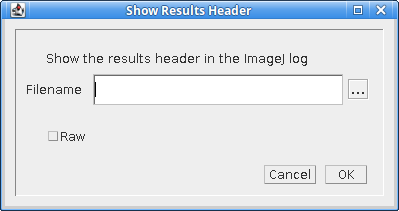
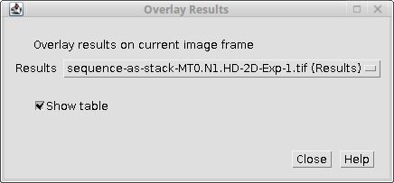

.. index:: results plugins

Results Plugins
===============

The following plugins allow localisation results to be opened, converted and saved using various formats.

The plugins are described in the following sections using the order presented on the
``Plugins > GDSC SMLM > Results``
menu.

.. index:: results manager

Results Manager
---------------

Allows results to be output to a results table, an image, or to file.

The ``Results Manager`` allows the ``Peak Fit`` plugin to be run in the fastest mode with no output results (results are saved to memory). The results can then be visualised with different options using the ``Results Manager`` and saved to file. Reconstructed images can be saved using the standard ``ImageJ`` ``File > Save As`` options.

The plugin can be used to convert text results to binary results and vice-versa. Binary results save and load very fast but are not human readable. They are a good option for storing large results sets (10,000 or more localisations) for repeat analysis.

.. index:: input options

Input options
~~~~~~~~~~~~~

Input can be from results in memory or a result file. Using the result file option allows the user to load results that were generated in a previous session.

The plugin can load data generated by the
``Peak Fit``
plugin and saved as results file. It also loads results that have been saved from the
``Peak Fit``
results table to a text file. External file formats are also supported. Currently the following alternative formats are supported:

*   rapidSTORM
*   Nikon NSTORM
*   MicroManager Tagged Spot File (`TSF <https://micro-manager.org/wiki/Tagged_Spot_File_(tsf)_format>`_)

Note: Custom text formats can be loaded into memory using the ``Load Localisations`` plugin (see :numref:`{number}: {name} <results_plugins:Load Localisations>`).

.. index:: image calibration

Image calibration
^^^^^^^^^^^^^^^^^

The SMLM plugins require that an image have a calibration to allow certain plugins to function. This calibration includes the pixel pitch, the total gain and the exposure time (as described in section :numref:`{number}: {name} <fitting_plugins:Calibration>`). Certain file types do not have an image calibration. In this case the plugin will present a dialog where the user can enter the calibration for the results. This is added to the results and will be saved if using a SMLM file format.

.. index:: output options

Output options
~~~~~~~~~~~~~~

The output options are the same as in the
``Peak Fit``
plugin. The only difference is that the file output requires that the name of the output file be provided. In the
``Peak Fit``
plugin only the results directory was specified and the filename was taken from the image. Allowing the full filename to be specified provides greater flexibility in saving results.

Note that the
``Input file``
and
``Results file``
fields support a mouse double-click action to open a file selection dialog. As with the
``Peak Fit``
plugin the results file suffix will be changed to ``.xls`` for text results and ``.bin`` for binary results.

One additional parameter is available for ``Image`` output:

.. list-table::
   :widths: 20 80
   :header-rows: 1

   * - Parameter
     - Description

   * - Image Window
     - Applies to output images.

       The ``Image Window`` specifies the number of consecutive frames from the results that should be plotted on a single ``ImageJ`` stack frame.

       By default this parameter is zero. All localisations are plotted on the same output frame.

       If this is set to 1 then each frame will be output to a new frame in the output image. Use this option to allow the input and output images to be directly compared frame-by-frame.

       If set higher than 1 then N frames will be collated together into one output image. Use this option to produce a time-slice stack through your results at a specified collation interval

       This option is not available during live fitting since the result must be sorted. This is not possible with multi-threaded code as the results can appear out of order.


As with all of the SMLM plugins, the ``Results Manager`` is fully supported by the ``ImageJ`` macro recorder. This allows the use of macros to bulk convert many results sets, for example to render images and save them using the ``File > Save As`` command.

.. index:: summarise results

Summarise Results
-----------------

Shows a summary of all the results currently in memory.

The summary table shows the name of the results dataset and then the following statistics:

*   The number of results
*   The size of the results in memory
*   The bounds of the results (minimum and maximum ``x`` and ``y`` coordinates of the source)
*   The average, median, minimum and maximum of the precision and Signal-to-noise ratio (SNR)

.. index:: clear memory results

Clear Memory Results
--------------------

Removes all the results currently stored in memory. Presents a confirmation dialog showing the number of results that will be removed if the user selects ``OK``.

.. index:: clear memory results (multi)

Clear Memory Results (Multi)
----------------------------

Removes selected results currently stored in memory. Presents a dialog where the results to be removed can be selected. Then presents a confirmation dialog showing the number of results that will be removed if the user selects ``OK``.

.. index:: rename results

Rename Results
--------------

Allows the name of a results set held in memory to be changed.

Typically new results are named using the name of the input image or input results set appended with details of how the new results were generated, e.g. the name of the fitting engine or in the case of tracing analysis ``Traced``. The name is associated with the results set and used is analysis plugins or when reconstructing super-resolution images. It is also saved in the SMLM file format.

The names can be updated using the
``Rename Results``
plugin. The plugin presents a dialog with a single large text field. All the existing names are entered on the left side of the equals (``=``) symbol. The new name will be entered on the right side of the equals symbol followed by a semi-colon (``;``). The semi-colon is needed to support this plugin within the ``ImageJ`` macro language.

An example of two results sets, ``NewResults`` and ``AnalysisResults``, is shown below::

    NewResults = NewResults;
    AnalysisResults = AnalysisResults;

When the plugin is run all the target results sets are identified using the names on the left. Any missing names are ignored allowing the user to delete many entries that should be unchanged. If the left and right side are identical then the name will be unchanged. Any invalid names not corresponding to an existing dataset cause an error to be displayed.

The destination names are then checked, any duplicates cause an error to be displayed. If no errors occurred then the datasets are renamed. Renaming may cause an existing dataset to be over-written if that dataset is not also renamed. This is allowed behaviour as it may be desirable to over-write a set of named results with the latest analysis results.

The following would rename ``NewResults`` to ``BestResults``. ``AnalysisResults`` would be unchanged::

    NewResults = BestResults;

The following would over-write ``AnalysisResults`` leaving just one results set in memory::

    NewResults = AnalysisResults;

The following would rename ``NewResults`` to ``AnalysisResults`` and ``AnalysisResults`` to ``OldResults``::

    NewResults = AnalysisResults;
    AnalysisResults = OldResults;

.. index:: resequence results

Resequence Results
------------------

Allows the frame number of results to be rebuilt assuming a repeating pattern of data and non-data frames.

The
``Peak Fit``
plugin will fit a stack of images using a continuous frame number starting at 1. However this image may have been extracted from a larger image with interlaced data or been taken with a custom image acquisition workflow. In this case the frame number will be an incorrect representation of time. This is relevant for any analysis using the time gaps between localisations.

For example if every 20 images is a white light image and this was removed before fitting the frame number can be restored to add blank frames at 1, 21, 41, etc. Or the image may represent 1000 frames of imaging interspersed with 5 second gaps. Resequencing the results can put an appropriate gap between localisations in frame 1000 and 1001.

This plugin can resequences the results using the regular repeat of the original image. The following parameters are required:

.. list-table::
   :widths: 20 80
   :header-rows: 1

   * - Parameter
     - Description

   * - Input
     - The results to process. Results will be directly updated (and there is no ``Undo`` operation).

   * - Start
     - The first frame containing data in the original image.

   * - Block
     - The number of continuous frames that contain data in the original image.

   * - Skip
     - The number of continuous frames to skip before the next block of data in the original image.

   * - Log mapping
     - Write to the ``ImageJ`` log the mapping between the current and the new frame number.


It is not possible to undo the ``Resequence Results`` plugin. Before running the plugin you can save the results to file using the ``Results Manager`` . These can be reloaded if the resequence operation produced an incorrect frame-by-frame mapping.

Note: If the data is interlaced it can be directly handled by the ``Peak Fit`` plugin using the extra options (hold the ``Shift`` or ``Alt`` key down when running the plugin). There is no need to extract all the relevant data frames from the source image before running ``Peak Fit``.

.. index:: calibrate results

Calibrate Results
-----------------

Allows results held in memory to be calibrated (e.g. the pixel pitch and camera gain can be adjusted). Note that the raw data held in memory is stored using pixel units and image frames. Many of the plugins require calibrated units such as nanometers, micrometres, milliseconds and photons. Thus it is possible to store a calibration within the results. This calibration is added automatically when the results are generated inside the SMLM plugins. However the results may be loaded from file where a calibration is not present or the calibration was incorrect when the results were generated. This plugin allows the calibration to be updated.

When the plugin is run it presents a selection of the current results that are held in memory. If no results are available then an error is displayed. The user must select the results to update.

The following options are then available:

.. list-table::
   :widths: 20 80
   :header-rows: 1

   * - Parameter
     - Description

   * - Update all linked results
     - When new results are created from existing results they copy the calibration from the source results. Select this to update all the results in memory that share the same calibration.

       If unselected then the other results will remain unchanged.

   * - Calibration (nm/px)
     - The size of the pixels in nanometers.

   * - Gain (ADU/photon)
     - The number of Analogue-to-Digital Units (ADU) that represent one photon.

   * - EM-CCD
     - A flag to indicate if the image was taken using an EM-CCD camera.

   * - Exposure time (ms)
     - The exposure time for a single frame in milliseconds.

   * - Camera bias (ADUs)
     - The bias offset added to each pixel by the camera.

   * - Read noise (ADUs)
     - The camera read noise in ADUs.


Note that not all the calibration parameters have to be configured. Not all the plugins require every parameter. The most common parameters used are ``Calibration`` and ``Exposure time``.

.. index:: show results header

Show Results Header
-------------------

Shows the header information from any supported localisation results file format. This is particularly useful for reading the header from GDSC SMLM binary format results files.

When the plugin is run the user is presented with a dialog where the results file can be selected (:numref:`Figure %s <fig_show_results_header_dialog>`).

.. _fig_show_results_header_dialog:


    Show Results Header dialog

The ``Filename`` field ``...`` button can be clicked to open a file selection window.

When the plugin runs it will attempt to open the selected file and read it as a localisation results file. The header will be extracted and reported to the ``ImageJ`` log window.

If the ``Raw`` option is selected then the header will be written directly. Note that the ``ImageJ`` log window does not show tab characters. However if a line containing tab characters is copied from the log window and pasted into a text editor these characters are maintained.

If the ``Raw`` option is not selected then the plugin will attempt to extract the standard information stored in a GDSC SMLM results file header:

.. list-table::
   :widths: 20 80
   :header-rows: 1

   * - Field
     - Description

   * - Format
     - The GDSC SMLM file format code.

   * - Name
     - The name of the results.

   * - Bounds
     - The bounds of the results data (minx, miny, width, height).

   * - Calibration
     - The calibration (nm/pixel, exposure time, etc).

   * - Configuration
     - The fitting configuration used to produce the results.


.. index:: overlay results

Overlay Results
---------------

Draws an overlay on an image using all the localisations from a results dataset. Only the localisations from the current frame are drawn and the overlay updates dynamically as the user changes the current image slice. This allows visualisation of the spot data that has been successfully captured in a results dataset, e.g. has fitting successfully identified spots that the user would select manually.

When the plugin is run it scans all the results sets held in memory. Each results set has a source for the results; if the source is an image that is currently open then the results set is available for selection. If no results sets have an open source image then an error is shown. Otherwise the list of available results sets is presented to the user in a dialog (:numref:`Figure %s <fig_overlay_results_dialog>`).

.. _fig_overlay_results_dialog:


    Overlay results dialog

All the localisations from the selected results set for the current frame set are overlaid on the source image. When the image is updated to a new frame the overlay will be updated.

The ``Show table`` option can be used to present a results table of the localisations below the image. This is dynamically updated with the current frame. The table has interactive functionality, for example a double mouse-click on a result entry will draw an overlay on the image of just that localisation result. For more details see section :ref:`fitting_plugins:Interactive Results Table`.

The ``Overlay Results`` dialog is non-blocking allowing the user to interact with ``ImageJ`` as normal. However if the results are cleared from memory or the image is no longer available then the dialog list will be out-of-date and an error is logged to the ``ImageJ`` log window and shown on the dialog. Restarting the plugin will refresh the list of available results.

.. index:: load localisations

Load Localisations
------------------

Loads a set of localisations from a delimited text file. The file format is specified during runtime allowing any delimited localisation data to be loaded.

When the plugin is run the user is prompted to select a text file containing delimited localisation data. The plugin then presents a dialog where the file format can be defined (:numref:`Figure %s <fig_load_localisations_dialog>`).

.. _fig_load_localisations_dialog:
.. figure:: images/load_localisations_dialog.png
    :align: center
    :figwidth: 80%

    Load localisations dialog

The plugin requires that the dataset be given a name. This is used to store the dataset in memory. If the name matches an existing dataset in memory then it will be replaced. Note: The current datasets held in memory can be listed using the
``Summarise Results``
plugin.

The following sections describe the parameters required to define the file format.

.. index:: calibration

Calibration
~~~~~~~~~~~

The GDSC SMLM plugins store localisation data assumed to be obtained from a microscope camera. The data is stored using distances in pixels and intensity in camera counts. The units can be converted to nanometres (nm) and photons using a calibration stored with the dataset. This conversion is required for many analysis plugins.

The plugin requires the following calibration details for the dataset:

.. list-table::
   :widths: 20 80
   :header-rows: 1

   * - Parameter
     - Description

   * - Camera type
     - The type of camera used to acquire the image. Additional details about the camera can be entered by clicking the ``...``` button.

   * - Pixel size
     - The size (in nm) of each pixel. This depends on the microscope magnification.

   * - Exposure time
     - The duration of each frame from the camera.

   * - Time unit
     - The unit for the ``Exposure time``.

Additional calibration can be configured depending on the ``Camera type``. For ``EMCCD`` and ``CCD`` cameras the following can be configured:

.. list-table::
   :widths: 20 80
   :header-rows: 1

   * - Parameter
     - Description

   * - Camera bias
     - The zero-offset bias added to each pixel by the camera.

   * - Gain
     - This is the total gain the camera applied to convert captured photons to output pixel counts.

   * - Read noise
     - The read noise of the camera.

For ``sCMOS`` cameras a camera model must be loaded. This contains the bias, gain and read noise for each pixel in the camera. A dialog is presented allowing the model to be selected from the list of known camera models.

Note: sCMOS cameras read each pixel using individual circuits. This is in contrast to CCD cameras which use the same circuits to read every pixel allowing a global bias, gain and read noise.


.. index:: localisation records

Localisation Records
~~~~~~~~~~~~~~~~~~~~

Each line of the file is read as a localisation record of delimited fields. Lines in the file can be ignored, for example if they are meta-data describing the records. The plugin requires the following file-format details:

.. list-table::
   :widths: 20 80
   :header-rows: 1

   * - Parameter
     - Description

   * - Header lines
     - The initial number of lines to ignore. For example a file header of column names.

   * - Comment
     - Any line starting with this sequence of characters is ignored.

   * - Delimiter
     - Defines the delimiter of the fields. Regular expression are supported and the default is white space (``\s+``).

   * - Distance unit
     - The distance units of the localisation records. Records will be converted to the GDSC SMLM format if necessary using the ``Pixel size`` parameter.

   * - Intensity unit
     - The intensity units of the localisation records. Records will be converted to the GDSC SMLM format if necessary using the ``Gain`` parameter.


.. index:: fields

Fields
~~~~~~

The fields must be defined so the plugin knows how to read the data. Note that the field index is zero-based. Not all fields are required and if a field does not exist then the index can be set to a negative value. The plugin can load the following data from each record:

.. list-table::
   :widths: 15 40 15 10 15
   :header-rows: 1

   * - Field
     - Description
     - Type
     - Required
     - Default

   * - T
     - The time frame.
     - Integer
     -
     - 0

   * - ID
     - The identifier for the localisation. This can be used to group localisations of the same molecule.
     - Integer
     -
     - 0

   * - X
     - The X coordinate.
     - Real
     - Y
     -

   * - Y
     - The Y coordinate.
     - Real
     - Y
     -

   * - Z
     - The Z coordinate.
     - Real
     -
     - 0

   * - Intensity
     - The localisation intensity. If absent this will be set to 1.
     - Real
     -
     - 1
       count

   * - Sx
     - The standard deviation of the Gaussian point spread function in the X-dimension.
     - Real
     -
     - 1
       pixel

   * - Sy
     - The standard deviation of the Gaussian point spread function in the Y-dimension.
     - Real
     -
     - 1
       pixel

   * - Precision
     - The uncertainty of the localisation position is the standard deviation of the Gaussian probability distribution of the actual position given the coordinates. It is commonly known as the localisation precision and is a measure of how close the coordinates are to the actual position.

       This is the square root of the arithmetic mean of the uncertainty variance in the X and Y dimensions:

       :math:`\sigma=\sqrt{\frac{\sigma_{x}^2 + \sigma_{y}^2}{2}}`

       Note that although the literature commonly presents the ``Precision`` in nm the units must match the ``Distance unit`` parameter.
     - Real
     -
     - NaN


If any field does not exist then it will be set to the default value. Note that the GDSC SMLM localisation model is based around approximating the point spread function (PSF) of a microscope using a 2D Gaussian. If the localisation results have been produced using another PSF model then either the Sx and Sy fields can be omitted or they should be converted to a Gaussian approximation before loading the data.

.. index:: errors

Errors
^^^^^^

If any errors occur when parsing a record then the first error will be recorded to the ``ImageJ`` log. Subsequent errors are counted silently and the plugin reports the count of total errors at the end. Errors typically occur when the fields or header format have been defined incorrectly and so should be corrected.

.. index:: unsupported file formats

Unsupported file formats
~~~~~~~~~~~~~~~~~~~~~~~~

The
``Load Localisations``
plugin is designed to be generic so it can handle a wide variety of data. If you have data in a format that cannot be loaded then please contact us with an example. This is likely to occur if the units are not supported, e.g. distance in metres.

.. index:: z-depth filtering

Z-depth filtering
~~~~~~~~~~~~~~~~~

When all the localisation records have been processed the plugin can optionally filter the localisations by z-depth. This allows loading a slice of 3D data for processing within 2D analysis. This feature is disabled by setting the Z-dimension field index to -1. In this case any 3D data will be loaded as a 2D projection.

If a range of z-depths is available the plugin presents a dialog allowing the user to select a subset of localisations (:numref:`Figure %s <fig_zdepth_filter_dialog>`). The dialog shows the minimum and maximum limits of the z coordinates and provides an option to limit the z-depth. The limits can then be adjusted using the sliders.

.. _fig_zdepth_filter_dialog:
.. figure:: images/zdepth_filter_dialog.png
    :align: center
    :figwidth: 80%

    Z-depth filtering dialog

Thus the
``Load localisations``
plugin can be used to load selected slices of data for analysis.

If the user requires a subset of the data in the XY dimensions then this can be achieved using the
``Crop Results``
plugin once the results have been loaded.

.. index:: filter results

Filter Results
--------------

Filters a set of localisations using various criteria.

Requires the fitting results to be loaded into memory. When the plugin is run the user is presented with a selection dialog of the available results. The user can select the results to filter.

The plugin analyses the selected results and computes limits for each of the filters based on the data. If the results could not be analysed for a filter then the filter limits will be set to zero. A second dialog is then shown that allows the filters to be adjusted. The following filters are available:

.. list-table::
   :widths: 20 80
   :header-rows: 1

   * - Parameter
     - Description

   * - Max drift
     - The maximum distance the fitted centre is allowed to be from the original maxima location.

   * - Min Signal
     - The minimum signal strength.

   * - Min SNR
     - The minimum signal-to-noise ratio.

   * - Min Precision
     - The minimum precision.

   * - Min Width
     - The minimum width for a localisation. Width assumes a Gaussian 2D PSF and using the standard deviation of the Gaussian.

   * - Max Width
     - The maximum width for a localisation. Width assumes a Gaussian 2D PSF and using the standard deviation of the Gaussian.

   * - Mask
     - Select an image to use as a mask. Only localisations that occur in non-zero mask pixels will be included in the results. The mask is scaled to match the width and height of the result source.


If any parameter is set to zero it will be ignored.

.. index:: crop results

Crop Results
------------

Filters a set of localisations using a 2D bounding rectangle.

Requires the fitting results to be loaded into memory. When the plugin is run the user is presented with a selection dialog of the available results. The user can select the results to crop.

The plugin then computes the 2D data bounds of the selected results and presents options for cropping the data using a bounding rectangle.

.. index:: defining the crop

Defining the crop
~~~~~~~~~~~~~~~~~

The bounding rectangle can be defined in multiple ways. If more than one bounding rectangle is defined then the final bounding rectangle is the intersection of all the rectangles. The following bounding rectangles can be defined:

*   Border: The current data bounds of the results is reduced by a defined border
*   Region: A region is defined using an origin, width and height
*   ROI: A rectangular ROI currently displayed on an image is scaled to the dimensions of the data bounds

Note that regions are defined using pixel units.

.. index:: parameters

Parameters
~~~~~~~~~~

The following filters are available:

.. list-table::
   :widths: 20 80
   :header-rows: 1

   * - Parameter
     - Description

   * - Border
     - The border used to reduce the current data bounds. Set to zero to ignore.

   * - Select region
     - Select this option to construct a region.

   * - X
     - The region X origin.

   * - Y
     - The region Y origin.

   * - Width
     - The region width.

   * - Height
     - The region height.

   * - Use ROI
     - Select this option to construct a region by scaling an area ROI from an image. This option is only shown if an open image contains an area ROI.

   * - Image
     - Select the image with the area ROI.

   * - Overwrite
     - Select this option to overwrite the results with the cropped results. The default creates a new dataset with the same name and the suffix ``Cropped``.


Note that the ROI method scales the ROI from the image to the current data bounds of the selected results. If the ROI is on an image that does not match the width/height ratio of the data bounds then the scaling will be different in the X and Y dimensions. For the best results it is recommended to construct a super-resolution image of the target dataset using the
``Results Manager``
. An ROI can then be drawn on the super-resolution image covering the desired results. This ensures the rectangle shape of the source image and the target dataset are identical.

.. index:: free filter results

Free Filter Results
-------------------

Filters a set of localisations using various criteria.

Requires the fitting results to be loaded into memory. When the plugin is run the user is presented with a selection dialog of the available results. The user can select the results to filter.

The dialog also contains a text area. This is used to construct filters using eXtensible Markup Language (XML). A set of example filters can be shown by clicking on the
``Show demo filters``
checkbox. This will record the available filters to the ``ImageJ`` log. Note: To see the filters and copy them to the clipboard as examples you will first have to cancel the plugin dialog as it blocks other ``ImageJ`` windows.

The following filters are available:

.. list-table::
   :widths: 20 80
   :header-rows: 1

   * - **Filter**
     - Description

   * - WidthFilter
     - Filters the results using an upper width factor. Width is relative to the initial peak width.

   * - WidthFilter2
     - Filter the results using a width range. Width is relative to the initial peak width.

   * - SignalFilter
     - Filter results using a lower signal threshold. The threshold is applied in photons.

   * - SNRFilter
     - Filter results using a lower SNR threshold.

   * - SNRFilter2
     - Filter results using a lower SNR threshold and width range. Width is relative to initial peak width.

   * - PrecisionFilter
     - Filter the results using an upper precision threshold.

   * - SNRHysteresisFilter
     - Filter results using a signal-to-noise (SNR) threshold. Any results above the upper SNR limit are included. Any results below the lower SNR limit are excluded. Any results between the limits (candidates) are included only if they can be traced through time, potentially via other candidates, to a valid result.

       The distance used for tracing is the search distance multiplied by the average precision of the candidates.

   * - PrecisionHysteresisFilter
     - Filter results using a precision threshold. Any results below the lower precision limit are included. Any results above the upper precision limit are excluded. Any results between the limits (candidates) are included only if they can be traced through time, potentially via other candidates, to a valid result.

       The distance used for tracing is the search distance multiplied by the average precision of the candidates.

   * - TraceFilter
     - Filter results that can be traced over time frames. The trace distance is specified in pixels and the time threshold in frames.

   * - CoordinateFilter
     - Filter results using a coordinate range. This can be used to crop the results to a rectangular region, for example when batch processing results subsets in a macro.

   * - AndFilter
     - Filter results using the combination of two filters. Results must pass both filters.

   * - OrFilter
     - Filter results using the combination of two filters. Results can pass either filter.

The
``Free Filter``
plugin provides a powerful tool for customising the subset of results that are extracted. For example it is possible to extract only the results that have either (1) a Signal-to-noise ratio above 10 and a Precision of less than 30nm; or (2) that can be traced to another localisation within 0.5 pixels and 1 time frame using the following combined filter:

.. code-block:: xml

    <OrFilter>
      <filter1 class="AndFilter">
        <filter1 class="SNRFilter" snr="10.0"/>
        <filter2 class="PrecisionFilter" precision="30.0"/>
      </filter1>
      <filter2 class="TraceFilter" d="0.5" t="1"/>
    </OrFilter>

Note how the combined filters require that the contained filters are specified in a
``<filter>``
tag and the type of filter is specified using the
``class``
attribute. The filter parameters are specified using attributes.

.. index:: split results

Split Results
-------------

Splits a set of localisation results using a 2D mask. This allows the results to be divided into subsets, for example one results set per cell.

When the plugin is run the user is presented with a dialog allowing the results set and the mask to be selected (see :numref:`Figure %s <fig_split_results_dialog>`).

.. _fig_split_results_dialog:
.. figure:: images/split_results_dialog.png
    :align: center
    :figwidth: 80%

    Split Results dialog

If no results are currently held in memory, or no images are open then an error is displayed.

The following parameters can be set:

.. list-table::
   :widths: 20 80
   :header-rows: 1

   * - Parameter
     - Description

   * - Input
     - Select the results set to split.

   * - Object mask
     - Select the mask image used to identify objects.

   * - Show object mask
     - Display an image with a unique pixel value for each object.

   * - Non mask dataset
     - Include a results set for all the results that do not occur within an object.


.. index:: analysis

Analysis
~~~~~~~~

The selected object mask is analysed for objects. An object is a assigned using contiguous pixels with the same value. Object pixels are be joined using 4-connected edges, not 8-connected neighbours. This allows a single line of diagonal pixels to divide two objects.

The 2D dimensions from the bounds of the results set are then mapped onto the object mask dimensions to create scaling factors. For example a results set with dimensions 512x512 can be mapped to a mask of 1024x1024 with a scaling factor of 2. The mapping is performed in each dimension allowing use of an object mask that does not match the original rectangle ratio of the results set. (Note that the dimensions of the results set can be displayed using the ``Summarise Results`` plugin.) However it is normal for a mask to be created using an image taken on the same camera as the source image for the super-resolution dataset to allow masking image objects, for example cells.

A new dataset is created for each mask object. The results are then mapped to the object pixels using the scaling factors and added to the appropriate dataset. The plugin will save any non-empty dataset to memory. The dataset is named using the input results set name plus the object ID (starting from 1). To see the objects use the ``Show object mask`` option.

Optionally the plugin can save a results set containing all the results that do not map to
any objects. This has an ID of zero. To create this dataset use the ``Non mask dataset`` option.

.. index:: results match calculator

Results Match Calculator
------------------------

Calculate the match statistics between two results sets.

The ``Results Match Calculator`` allows two sets of localisations to be compared. The results are processed per time frame. The plugin can identify results that span multiple time frames, e.g. trace results produced by the ``Trace Molecules`` plugin. These will be split into a single localisation for each frame, all with identical coordinates.

Localisations are identified as a match if they are within a set distance. The plugin computes matches iteratively allocating the closest pairs first until no more matches can be made. The matches are used to compute comparison score metrics to show the similarity between the two results sets. The available metrics are Precision, Recall, F-score and Jaccard. Details of the comparison metrics can be found in section :numref:`{number}: {name} <comparison_metrics:Comparison Metrics>`.

The score metrics are shown in a results table. Optionally a table of the matched pairs can be displayed showing the matched and unmatched localisations. The pairs table supports interactive identification of the selected points on the source image (see :ref:`results_plugins:Interactive Results Match Table`). Any previous results in the pairs table will be cleared.

Since matches are computed at a set distance threshold the plugin provides the ability to perform analysis at many distances. In this case the pairs are matched at the largest distance threshold. Then the scores for lower distance thresholds can be computed by eliminating pairs that are too far apart.

The following parameters can be set:

.. list-table::
   :widths: 20 80
   :header-rows: 1

   * - Parameter
     - Description

   * - Results1
     - The first results set.

   * - Results2
     - The second results set.

   * - Distance
     - The minimum distance for a match.

   * - Increments
     - The number of times to increment the distance threshold.

   * - Delta
     - The value to increment the distance threshold.

   * - Beta
     - Controls the weighting between Precision and Recall for the custom F-score.

   * - Show table
     - Display a table of the match statistics.

   * - Show Pairs
     - Display a table of the matched pairs with coordinates and distances.

   * - Save classifications
     - The data from results set 2 will be saved to a PeakResults file. This uses the original value field to store if the point was matched. If the point matches a point in results set 1 then the original value will be set to 1, otherwise the original value is set to 0.

   * - Id analysis
     - If the results in the results set have an Id label for each localisation the plugin will compute the number of molecules that were matched. The TP, FN and recall for each results set will be added to the results table as additional columns.

       Note: Ids are added to the results by various plugins, e.g. ``Trace Molecules``, ``Create Data``.


.. index:: interactive results match table

Interactive Results Match Table
~~~~~~~~~~~~~~~~~~~~~~~~~~~~~~~

The results ``Show pairs`` table will show the coordinates and distance between matched pairs. Unmatched paris will be added to the table at the end of the matches for the same time frame.

To assist in viewing the localisations that are matches the table supports mouse click interaction. The table is linked to the results source for the ``Results1`` input. If this is an image open in ``ImageJ`` the table can draw ROI points on the image:

*   Double-clicking a line in the results table will draw a single point ROI at the coordinates identified. The stack position will be set to the correct frame.
*   Highlighting multiple lines with a mouse click while holding the shift key will draw multiple point ROI on the coordinates identified. The frame will be set to the last identified frame in the selection.

The coordinates for each point are taken from the X1 & Y1 columns, or if they are unavailable, the X2 & Y2 columns.

.. index:: trace match calculator

Trace Match Calculator
----------------------

Calculate the match statistics between two sets of traced molecules.

The ``Trace Match Calculator`` allows sets of traced localisations to be compared. The plugin scans the results held in memory and only allows results to be selected where they contain an entry that spans multiple time frames. Such results can be generated using the ``Trace Molecules`` plugin.

The plugin compares traces using the following distance weighted score:

.. math::

    \mathit{Score}=\mathit{overlap}\cdot 1/(1+\frac{d^2}{d_{t}^2})

where
:math:`\mathit{overlap}` is the number of frames where both traces are present,
:math:`d` is the distance between the two points and
:math:`d_t` is a threshold distance.
The score is composed of two parts: the overlap and the distance weighting. The distance weighting has a maximum value of 1 and reduces to zero. The weighting is 0.5 when :math:`d` equals :math:`d_t`. Thus the score will favour a match between close traces and those with the largest overlap in time. Since the distance score asymptotes to zero at :math:`d=\infty` any overlapping traces can be scored. To prevent scoring all pairs a maximum allowed distance between the traces is set. This is currently configured at :math:`2d_t`.

The plugin computes matches iteratively allocating the highest scoring pairs first until no more matches can be made. The matches are used to compute comparison score metrics to show the similarity between the two results sets. The available metrics are Precision, Recall, F-score and Jaccard. Details of the comparison metrics can be found in section :numref:`{number}: {name} <comparison_metrics:Comparison Metrics>`.

The overall score is the sum of the scores for all of the matched pairs. This score is then normalised by the maximum number of time-points contained in either result set.

.. math::

    \mathit{Total\:Score}=\frac{ \sum ^{i}{S_{i}} }{\mathit{max}(\mathit{p1},\mathit{p2})}

The number of time-points (*p*) is equal to the count of the number of individual localisations in the results before tracing.

.. math::

    p=\sum ^{i}{\mathit{tEnd}_{i}-\mathit{tStart}_{i}+1}

where *tStart* is the trace start time and *tEnd* is the trace end time. The normalisation penalises the score if either result set contains many unmatched or partially matched traces. The overall score should have a value between 0 and 1.

The score metrics are shown in a results table. Optionally a table of the matched pairs can be displayed showing the matched and unmatched localisations. The pairs table supports interactive identification of the selected points on the source image. This is the same functionality as the :ref:`results_plugins:Results Match Calculator` (see :ref:`{number}: {name} <results_plugins:Interactive Results Match Table>`). Any previous results in the pairs table will be cleared.

The plugin can compare one or two results sets to the same reference. This allows the user to compare different tracing results to a benchmark, for example the results of tracing raw localisations can be be compared to tracing filtered localisations. If two test sets are input then the matched pairs table will contain additional columns to display triples.

The following parameters can be set:

.. list-table::
   :widths: 20 80
   :header-rows: 1

   * - Parameter
     - Description

   * - Resuls1
     - The first results set (the reference).

   * - Results2
     - The second results set (test set 1).

   * - Results3
     - The third results set (test set 2; optional).

   * - Distance
     - The minimum distance for a match. This is equal to :math:`2d_t` in the score distance weighting formula.

   * - Beta
     - Controls the weighting between Precision and Recall for the custom F-score.

   * - Show Pairs
     - Display a table of the matched pairs with coordinates and distances.

   * - Sort Pairs
     - Specify the sort method for the pairs: Time or Score.


.. index:: spot inspector

Spot Inspector
--------------

Extracts the fitted spots from an image into a stack ordered by the user-selected score.

The ``Spot Inspector`` plugin allows visualisation of the fitted spots from a result set held in memory. The results are ordered using a user-selected score. Then the pixels surrounding each spot centre are extracted into an image stack named using the plugin title.

The plugin also produces a results table containing all the results in their rank order. If a line on the table is double-clicked using the mouse then the appropriate slice of the image stack is selected. Any spot from the entire results set will be labelled on the image using a multi-point ROI. This can produce many labels on the image which can be dismissed by clicking on the image or using ``Edit > Selection > Select None`` (``Ctrl+Shift+A``).

The plugin will check if the original source can be located. This may be an image open in ``ImageJ`` or the original file or image series located on disk. This allows inspection of fitting results from an image series too large to fit into memory. If the original source cannot be located then the plugin will fail with an error message.

The following parameters can be configured:

.. list-table::
   :widths: 20 80
   :header-rows: 1

   * - Parameter
     - Description

   * - Input
     - Select the input results set.

   * - Ranking
     - Select the score used to rank the results.

   * - Radius
     - Select the pixel radius around the localisation centre to extract.

   * - Calibrated table
     - Show the localisation sizes in nm (default is pixels).

   * - Plot score
     - Show a plot of the score against the rank.

   * - Plot histogram
     - Show a histogram of the score.

   * - Histogram bins
     - The number of bins to use for the histogram. Set to zero for auto.

   * - Remove outliers
     - Remove any localisation from the plots that lies more than 1.5x the interquartile range above or below the 25\ :sup:`th` and 75\ :sup:`th` percentile (quartile boundaries). This can remove poor scoring results that skew the plot visualisation.

