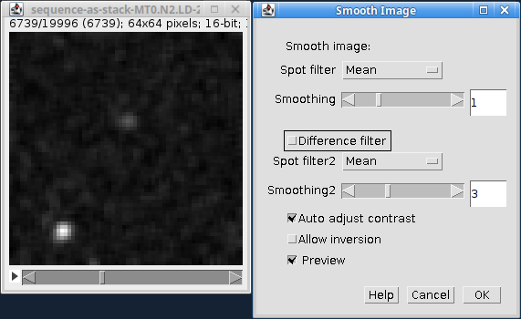
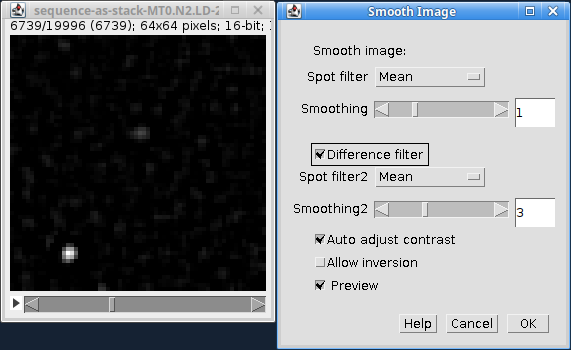
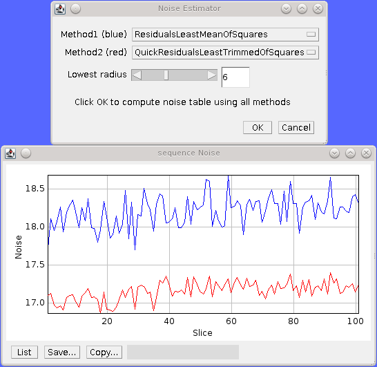
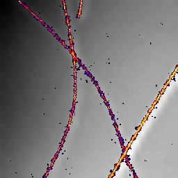

.. index:: tools plugins

Tools Plugins
=============

The following plugins contain utilities for image manipulation.

The plugins are described in the following sections using the order presented on the
``Plugins > GDSC SMLM > Tools``
menu.

.. index:: smooth image

Smooth Image
------------

Provides a filter plugin for smoothing an image (see :numref:`Table %s <table_smooth_image>`).

.. _table_smooth_image:
.. list-table:: Smooth image dialog with the preview applied to the current image.
    :align: center

    * - (A) Standard smoothing for a 16-bit image.

        |smooth_image_standard_png|
    * - (B) Difference-of-smoothing for a 32-bit image.

        |smooth_image_difference_png|

The filter uses the same methods as the ``Peak Fit`` plugin for identifying local maxima. However only a single or difference filter is available (no Jury filter) so that a single dialog can display all the options. A single filter applies a single smoothing operation to the image. A difference filter applies two smoothing operations and the second smoothed image is subtracted from the first. This produces a difference-of-smoothing image. As can be seen by comparing :numref:`Table %s <table_smooth_image>` (A) and (B), the difference filter is beneficial when there is a variable background across the image. The filter reduces the contribution the background has to the brightness of the spots by performing local contrast enhancement.

The following algorithms are available:

.. list-table::
   :widths: 20 80
   :header-rows: 1

   * - Algorithm
     - Description

   * - Mean
     - Compute the mean in a square region. The region can be any size as the final edge pixels are given a weight using the region width.

   * - Block mean
     - Compute the mean in a square region. The region is rounded to integer pixels.

   * - Circular mean
     - Compute the mean in an approximate circular region. The circle is drawn using square pixels. To see the circle mask use ``Process > Filters > Show Circular Masks...``.

   * - Gaussian
     - Perform Gaussian convolution. The convolution kernel standard deviation is set to the ``Smooth`` parameter.

       The total region width around each point that is used will be 2n+1 with :math:`n=\lceil 2.8\sigma \rceil` where :math:`\lceil x \rceil` is the ceiling function.

   * - Median
     - Compute the median in a square region. The region is rounded to integer pixels.

Use the ``Preview`` button to see the effect of smoothing. If you click ``OK`` the plugin will perform smoothing on the entire stack or optionally just the current frame.

.. index:: smoothing within the peak fit plugin

Smoothing within the Peak Fit plugin
~~~~~~~~~~~~~~~~~~~~~~~~~~~~~~~~~~~~

Note that the ``Peak Fit`` plugin calculates the smoothing window size using a factor of the PSF width. This can result in a non-integer value. Algorithms that require integer window sizes (e.g. block mean, median) have the window size rounded down to the nearest integer to avoid over smoothing.

Most images analysed within the ``Peak Fit`` plugin will use a filter size less than 4 due to the small size of the PSF from single molecule microscopy.

.. index:: binary display

Binary Display
--------------

Switches an image to binary (white/black) to allow quick visualisation of localisations.

The SMLM plugins contain several methods for generating an image. Often images are created with a large difference in value for pixels that contain localisations. The difference can be so great that some localisations are not visible. The ``Binary Display`` plugin converts all non-zero pixels to the value 1. This allows the user to see any pixel that contains any level of localisation. This mode may be useful for drawing regions of interest (ROIs) around dense sections of localisations.

Note that the data for the image are directly updated. The data can be reset using the ``Reset Display`` plugin.

.. index:: reset display

Reset Display
-------------

Resets a binary image generated by ``Binary Display`` back to the standard display.

This will only work for stack images if the user remains at the same slice position. Moving to a new slice and back will delete the information used to reset the image.

.. index:: pixel filter

Pixel Filter
------------

Perform filtering to replace hot pixels from an image.

The ``Pixel Filter`` is a simple plugin that will replace pixels with the mean of the surrounding region if they are more than N standard deviations from the mean. The filter is designed to remove outlier (hot) pixels that are much brighter then their neighbour pixels. These pixels will be identified as candidate maxima by the ``Peak Fit`` plugin although they are not suitable for Gaussian fitting.

The filter operates on the currently selected image. The preview option allows the results of the filter to be viewed before running the filter on the current frame or optionally the entire image stack.

The filter uses a cumulative sum and sum-of-squares lookup table to compute the region mean and standard deviation. This allows fast computation in constant time regardless of the size of the neighbourhood region.

The following parameters can be set:

.. list-table::
   :widths: 20 80
   :header-rows: 1

   * - Parameter
     - Description

   * - Radius
     - The radius of the square neighbourhood region.

   * - Error
     - The number of standard deviations above the mean that identifies a hot pixel.

   * - Preview
     - Preview the filter on the image. The number of pixels replaced will be shown in the dialog.

.. index:: noise estimator

Noise Estimator
---------------

Estimates noise in an image. This plugin can be used to compare noise estimation methods. Note that estimating the noise in an image is important when setting the signal-to-noise ratio (SNR) for use in filtering localisation fitting results.

When loaded the plugin provides a plot of the noise estimate of the next 100 frames of a stack (from the current frame) as shown in :numref:`Figure %s <fig_noise_estimator_dialog_and_plot>`. Two noise estimation methods can be chosen (see table below). Changing an estimation method will dynamically update the noise plot.

.. _fig_noise_estimator_dialog_and_plot:

    Noise Esimator plugin dialog and the noise plot for the next 100 frames in the image.

    Method1 is shown in blue, Method2 is shown in red.

If you click ``OK`` the plugin will compute all the estimation methods for the entire stack (or optionally just the current frame) and display the results in a table.

The following noise methods are available:

.. list-table::
   :widths: 30 70
   :header-rows: 1

   * - Method
     - Description

   * - All Pixels
     - The standard deviation of the pixels.

   * - Lowest Pixels
     - The standard deviation of a box region around the lowest intensity pixel in the image. The box region can be adjusted using the ``Lowest radius`` parameter. (This is the method used within QuickPALM [Henriques *et al*, 2010] and can produce inconsistent noise levels between frames due to the small sample size).

   * - Residuals Least Median Of Squares
     - Calculate the median of the residuals. Then use this to estimate the standard deviation of the residuals.

   * - Residuals Least Trimmed Square Estimator
     - Square the residuals. Sum the smallest half of the squared residuals. Then use this to estimate the standard deviation of the residuals. (This is insensitive to high intensity pixels).

   * - Residuals Least Mean Square Estimator
     - Calculate the standard deviation of the residuals.

   * - Quick Residuals Least Median Of Squares
     - As before but ignore pixels on the image boundary.

   * - Quick Residuals Least Trimmed Square Estimator
     - As before but ignore pixels on the image boundary.

   * - Quick Residuals Least Mean Square Estimator
     - As before but ignore pixels on the image boundary.

.. index:: image residuals

Image Residuals
~~~~~~~~~~~~~~~

The residuals of an image are calculated for each pixel using the total difference to the 4n connected pixels. These are normalised so that the sum of the residuals squared is the same as the sum of the image pixels squared. Comparing each pixel to its neighbours provides a robust method of estimating noise if the underlying signal is adequately sampled. Variations between neighbour pixels are expected to be small, consequently large variations indicate high noise.

All the image residuals methods are based on the “Least trimmed square” robust estimator described in:

.. code-block:: text

    P. Rousseeuw and A. Leroy
    Robust Regression and Outlier Detection
    New York: Wiley, 1987

.. index:: noise estimation within the peak fit plugin

Noise estimation within the Peak Fit plugin
~~~~~~~~~~~~~~~~~~~~~~~~~~~~~~~~~~~~~~~~~~~

The fitting code in the ``Peak Fit`` plugin currently uses the ``QuickResidualsLeastMeanOfSquares``. This method is more stable than using the standard deviation of the image pixels since large variations around the high intensity localisations are smoothed by using the image residuals.

The noise estimation method can be changed in the ``Peak Fit`` plugin by holding the ``Shift`` or ``Alt`` key down when running the plugin to see the extra options.

.. index:: median filter

Median Filter
-------------

Compute the median of an image, on a per-pixel basis, using a rolling window at set intervals.

Super-resolution image data can contain a low amount of background which affects the performance of fitting routines if it is not constant, for example cell walls may be visible as a change in low level fluorescence over a distance of a few pixels. This uneven background will not be modelled by a fitting routine which assumes the background is constant. Any local gradients in the background can be eliminated by assuming that all real fluorescence over a short time frame will be much higher than the other values for the pixels in the same location. Using the median value for the pixel will approximate the background. This can be subtracted from the image data prior to fitting so that only fluorescent bursts are left for fitting.

The ``Median Filter`` plugin will compute the median for each pixel column through the image (i.e. all z positions of the pixel) using a rolling window. The median can be calculated at every pixel or at intervals. In the case of interval calculation then the intermediate points have linearly interpolated medians.

The median image either replaces the input image, or is subtracted from the input image to produce an image with only localisations. A bias offset is added to this image to allow noise to be modelled (i.e. values below zero).

The following parameters can be specified:

.. list-table::
   :widths: 20 80
   :header-rows: 1

   * - Parameter
     - Description

   * - Radius
     - The number of pixels to use for the median. The median is calculated using a window of :math:`2 \times \mathit{radius} + 1`.

   * - Interval
     - The interval between slices to calculate the median. An interval of 1 will produce a true rolling median. Larger intervals will require interpolation for some pixels.

   * - Block size
     - The algorithm is multi-threaded and processes a block of pixels on each thread in turn. Specify the number of pixels to use in a block. Larger blocks will require more memory due to the algorithm implementation for calculating rolling medians.

       The number of threads is set in ``Edit > Options > Memory & Threads...``.

   * - Subtract
     - Subtract the median image from the original image.

   * - Bias
     - If subtracting the median, add a bias to the result image so that negative numbers can be modelled (i.e. when the original image data is lower than the median).

.. index:: overlay image

Overlay Image
-------------

Allow an image to be added as an overlay with a transparent background. Using a transparent background is not possible with the standard ``ImageJ`` ``Image > Overlay > Add image...`` command.

For example the super-resolution image created from fitting localisations can be overlaid on the average z-projection of the original image to show where the localisations occur (see :numref:`Table %s <table_superres_overlay>`):

.. _table_superres_overlay:
.. list-table:: Overlay of super-resolution image on the original average projection image
    :align: center

    * - |example_image_standard_8x_jpg| +
        |example_image_superres_8x_jpg| =
        |example_image_superres_overlay_standard_8x_png|

.. |example_image_standard_8x_jpg| image:: images/example_image_standard_8x.jpg
    :width: 5.099cm
    :height: 5.099cm

.. |example_image_superres_8x_jpg| image:: images/example_image_superres_8x.jpg
    :width: 5.099cm
    :height: 5.099cm

The ``Overlay Image`` plugin must be run after selecting the image to overlay. The following parameters can be specified:

.. list-table::
   :widths: 20 80
   :header-rows: 1

   * - Parameter
     - Description

   * - Image to add
     - Select the image to use as the overlay.

       The list only shows the images that are valid. Overlay images must be equal or smaller in width and height than the target image.

   * - X location
     - The x location to insert the overlay (measured from the top-left corner).

   * - Y location
     - The y location to insert the overlay (measured from the top-left corner).

   * - Opacity
     - The opacity of the overlay. 100% will totally obscure the underlying image.

   * - Transparent background
     - Select this to use a transparent background for any pixels with a value of zero. This allows the underlying image to be seen even when the opacity is set to 100%.

   * - Replace overlay
     - Select this to replace the current overlay. Uncheck this to add to the current overlay (i.e. combine overlays).
