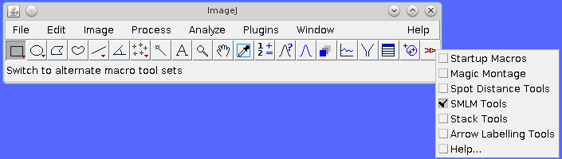

.. index:: toolset plugins

Toolset Plugins
===============

The following plugins add functionality to ``ImageJ`` to allow the SMLM plugins to be run using the ``ImageJ`` toolbar or a dedicated window panel of buttons.

The plugins are described in the following sections using the order presented on the ``Plugins > GDSC SMLM > Toolset`` menu.

.. index:: install smlm toolset

Install SMLM Toolset
--------------------

You can install a toolset for the SMLM plugins using the '
``GDSC SMLM > Install SMLM Toolset``
' plugin. This will create a text file in the ``ImageJ/macros/toolsets`` directory. The toolset can be activated using the ``More Tools`` menu button (the last button on the ``ImageJ`` toolbar) as shown in :numref:`Figure %s <fig_smlm_toolset_selection>`.

.. _fig_smlm_toolset_selection:

    Activation of the ``SMLM toolset`` using the ``ImageJ`` 'More Tools' menu.

The toolset defines 8 buttons for the ``ImageJ`` menu bar that allow various plugins to be run. When the mouse is over the button the name of the plugin will be shown in the ``ImageJ`` window. Click the button to run the plugin.

Note: The latest version of the ``SMLM Tools.txt`` file is packaged within the SMLM Jar file. This can be manually extracted using an archiving utility. The ``Install SMLM Toolset`` plugin simply extracts this file and writes it to the ``[ImageJ Path]/macros/toolsets`` directory if the user has the correct access permissions.

.. index:: show smlm tools

Show SMLM Tools
---------------

Displays a window with buttons to run all the SMLM plugins.

The window is constructed using a configuration file. The plugins listed in the configuration file are used to build a window with buttons to allow them to run. The file is searched for in the following locations:

* ``[ImageJ Path]/plugins/smlm.config``
* ``[SMLM Jar File]/gdsc/smlm/plugins.config``

Noted that the ``plugins.config`` file within the SMLM jar file is used by ``ImageJ`` to build the entries for the plugins menu. To customise the ``ImageJ`` menus the ``plugins.config`` file can be extracted from the Jar file, modified and replaced. This will also change the ``SMLM Tools`` window unless a separate ``smlm.config`` file is placed in the ``ImageJ`` plugins directory.

The ``plugins.config`` file has entries consisting of 3 fields separated by commas. Lines starting with # are ignored. For example::

    #ImageJ menu, “Plugin name”, full.java.plugin.ClassName(“arguments”)
    Plugins>GDSC SMLM, "Peak Fit", gdsc.smlm.ij.plugins.PeakFit
    Plugins>GDSC SMLM, "Spot Finder", gdsc.smlm.ij.plugins.PeakFit(“spot”)
    Plugins>GDSC SMLM, "-"

This example shows that the ``Spot Finder`` plugin is running the ``Peak Fit`` plugin with an argument indicating that it should only find the spot candidates.

The ``SMLM Tools`` window is a series of buttons arranged in columns. Each button on the window has the name of the plugin. The buttons are ordered using the order of the configuration file. Any separator entries in the file using the plugin name “-” will result in padding being applied between buttons (a separator row). Separator rows are also added for empty lines. 2 or more successive separator entries will result in a new column. :numref:`Figure %s <fig_smlm_toolset_window>` shows an example of the ``SMLM Tools`` window.

.. _fig_smlm_toolset_window:
.. figure:: images/smlm_toolset_window.png
    :align: center
    :figwidth: 80%

    SMLM Tools window

.. index:: create smlm tools config

Create SMLM Tools Config
------------------------

Create a configuration file allowing the ``SMLM Tools`` window to be customised.

This plugin extracts the plugins.config file from the SMLM jar file and writes it to ``[ImageJ Path]/plugins/smlm.config``. Optionally the file can be edited before installation to customise the plugins that appear on the ``SMLM Tools`` window (see section :numref:`%s <toolset_plugins:Show SMLM Tools>`).

If the file cannot be written the plugin will report an error. If the file already exists the user will be
asked if they wish to overwrite the file. The option to remove the existing file is also provided. If removed, the ``SMLM Tools`` window will revert to showing the default plugins.

If the plugin is run and the ``SMLM Tools`` window is currently open then it will be closed and re-opened to update to the new configuration.
